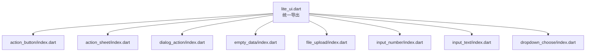
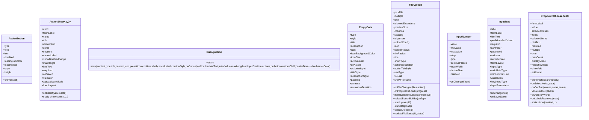
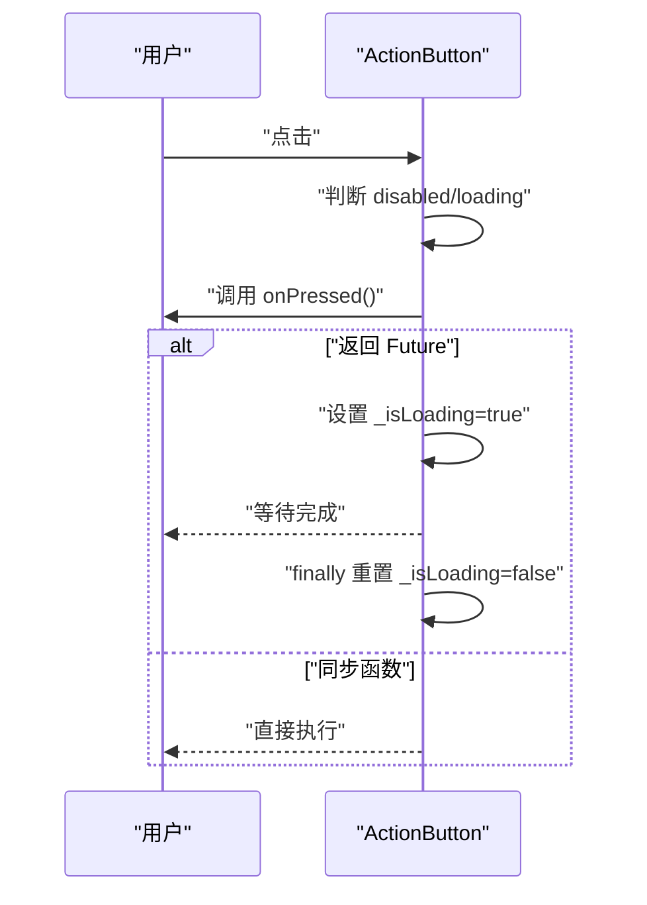
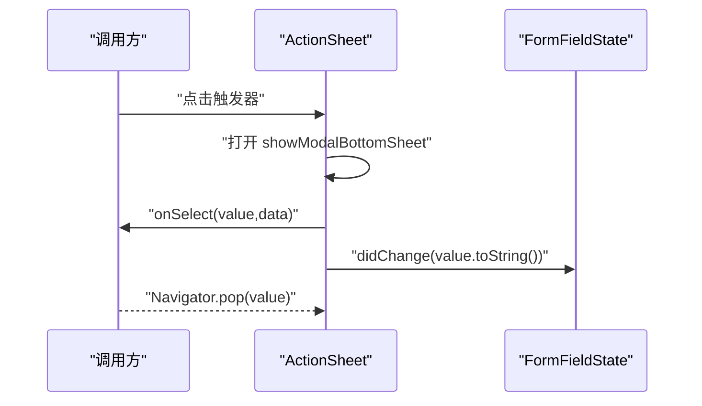
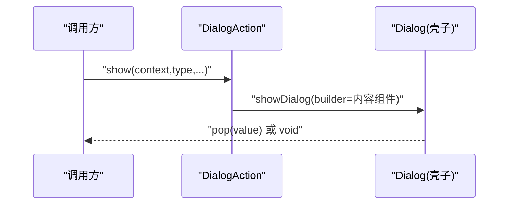
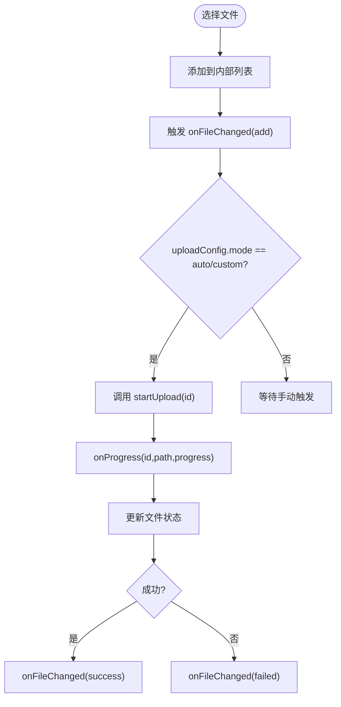
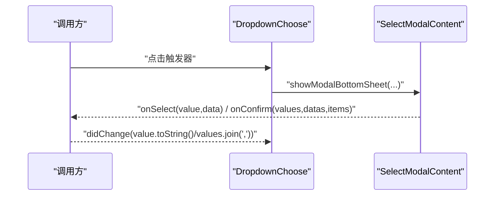
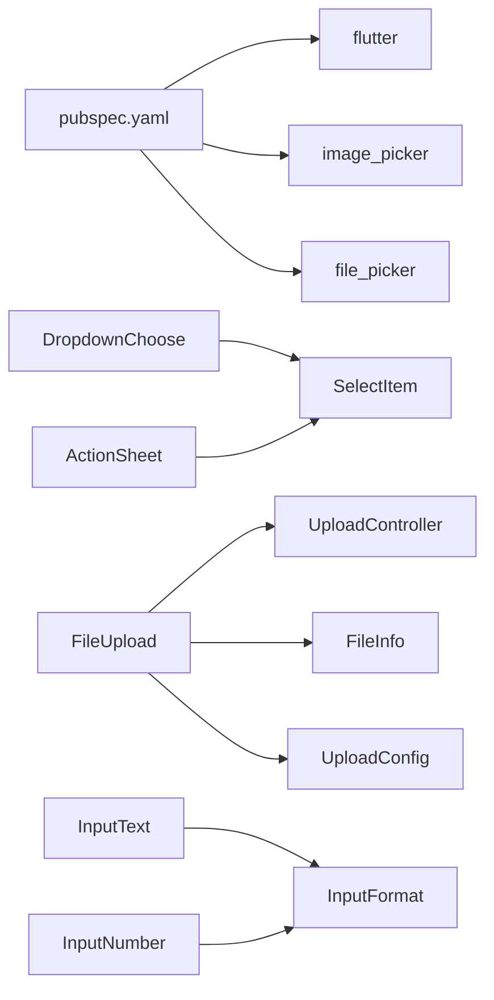

# API 参考

<cite>
**本文引用的文件**   
- [pubspec.yaml](file://pubspec.yaml)
- [README.md](file://README.md)
- [lite_ui.dart](file://lib/lite_ui.dart)
- [action_button.dart](file://lib/src/action_button/action_button.dart)
- [action_sheet.dart](file://lib/src/action_sheet/action_sheet.dart)
- [dialog_action.dart](file://lib/src/dialog_action/dialog_action.dart)
- [empty_data_content.dart](file://lib/src/empty_data/empty_data_content.dart)
- [file_upload.dart](file://lib/src/file_upload/file_upload.dart)
- [input_number.dart](file://lib/src/input_number/input_number.dart)
- [input_text.dart](file://lib/src/input_text/input_text.dart)
- [dropdown_choose.dart](file://lib/src/dropdown_choose/dropdown_choose.dart)
</cite>

## 目录
1. [简介](#简介)
2. [项目结构](#项目结构)
3. [核心组件](#核心组件)
4. [架构总览](#架构总览)
5. [详细组件分析](#详细组件分析)
6. [依赖关系分析](#依赖关系分析)
7. [性能与可用性建议](#性能与可用性建议)
8. [故障排查指南](#故障排查指南)
9. [结论](#结论)
10. [附录：版本与兼容性](#附录版本与兼容性)

## 简介
Lite UI 是一个轻量级 Flutter UI 组件库，提供常用弹窗、按钮、表单控件、文件上传等能力。组件具备高可配置性、支持泛型适配业务数据类型，并内置主题与校验工具，便于快速集成与扩展。

## 项目结构
- 入口导出统一在 lite_ui.dart，集中暴露各组件、模型、枚举与工具类。
- 各组件按功能模块划分在 lib/src 下，每个模块包含 index.dart 作为对外导出入口。
- 示例工程位于 example/，用于演示用法与集成方式。

**图表来源** 
- [lite_ui.dart:1-19](file://lib/lite_ui.dart#L1-L19)

**章节来源**
- [lite_ui.dart:1-19](file://lib/lite_ui.dart#L1-L19)

## 核心组件
本库提供以下核心组件（均通过 lite_ui.dart 统一导出）：
- ActionButton：操作按钮，支持多种样式与异步加载态
- ActionSheet：底部操作面板，支持普通列表与分组模式
- DialogAction：居中弹窗，支持 alert/confirm/input/multiAction/custom
- EmptyData：空状态占位，支持多场景与多风格
- FileUpload：文件上传，支持卡片/列表/自定义展示与进度回调
- InputNumber：数字步进器，支持整数/小数与长按连续增减
- InputText：文本输入框，支持标签、密码、校验、前后缀图标
- DropdownChoose：底部选择器，支持本地过滤与远程搜索

**章节来源**
- [lite_ui.dart:1-19](file://lib/lite_ui.dart#L1-L19)
- [README.md:24-126](file://README.md#L24-L126)

## 架构总览
组件整体采用“壳子 + 内容”的解耦设计：
- 弹窗类组件（DialogAction、ActionSheet、DropdownChoose）负责弹出壳子与生命周期管理，具体内容由内部子组件渲染。
- 表单类组件（InputText、InputNumber、FileUpload）封装交互与校验逻辑，并通过回调与父组件通信。
- 通用数据模型与枚举集中在 models 与 utils 中，保证类型一致性与复用性。

**图表来源** 
- [action_button.dart:43-94](file://lib/src/action_button/action_button.dart#L43-L94)
- [action_sheet.dart:22-153](file://lib/src/action_sheet/action_sheet.dart#L22-L153)
- [dialog_action.dart:24-131](file://lib/src/dialog_action/dialog_action.dart#L24-L131)
- [empty_data_content.dart:26-102](file://lib/src/empty_data/empty_data_content.dart#L26-L102)
- [file_upload.dart:15-165](file://lib/src/file_upload/file_upload.dart#L15-L165)
- [input_number.dart:21-68](file://lib/src/input_number/input_number.dart#L21-L68)
- [input_text.dart:15-168](file://lib/src/input_text/input_text.dart#L15-L168)
- [dropdown_choose.dart:11-242](file://lib/src/dropdown_choose/dropdown_choose.dart#L11-L242)

## 详细组件分析

### ActionButton（操作按钮）
- 构造函数参数
  - type：按钮类型，默认 elevated；可选 elevated/outlined/text/filled/toned/icon
  - text：按钮文字（icon 类型时忽略）
  - icon：图标（非 icon 类型显示在文字左侧；icon 类型作为唯一内容）
  - iconSize：图标尺寸（仅 icon 类型生效）
  - onPressed：点击回调，支持同步或异步（Future），自动处理 loading 态与防重复点击
  - disabled：是否禁用，默认 false
  - loadingIndicator：自定义加载指示器
  - loadingText：加载中显示的文字（为 null 时保持原文字）
  - style：按钮样式（透传底层 ButtonStyle）
  - height：按钮高度，默认 45
- 返回值与事件
  - onPressed 返回 Future 时，组件进入加载态并在完成后恢复
- 注意事项
  - 异步回调期间禁止重复点击
  - icon 类型下 loading 会替换图标为环形进度条

**图表来源** 
- [action_button.dart:96-175](file://lib/src/action_button/action_button.dart#L96-L175)

**章节来源**
- [action_button.dart:43-208](file://lib/src/action_button/action_button.dart#L43-L208)

### ActionSheet（底部操作面板）
- 构造函数参数
  - child：自定义触发器（不传则使用默认触发器 UI）
  - formLabel：表单标签（默认触发器模式使用）
  - value：当前选中值（受控模式，自动匹配 label 显示）
  - title/description：标题与描述
  - items/sections：操作项列表或分组数据（sections 优先）
  - cancelLabel：取消按钮文字，默认「取消」
  - showDisabledBadge：是否显示禁用项标签
  - maxHeight：最大高度（覆盖默认 75%）
  - hintText：占位提示
  - required/onSaved/validator/autovalidateMode/formLayout：表单相关
  - onSelect：选中回调 (value, data)
- 静态方法
  - show(context, ...)：编程式弹出，返回选中的 value
- 注意事项
  - 受控模式下 value 变化需配合 setState 更新
  - 校验失败时错误信息通过 FormField 展示

**图表来源** 
- [action_sheet.dart:155-254](file://lib/src/action_sheet/action_sheet.dart#L155-L254)

**章节来源**
- [action_sheet.dart:22-255](file://lib/src/action_sheet/action_sheet.dart#L22-L255)

### DialogAction（居中弹窗）
- 静态方法 show<V>(...)
  - type：弹窗类型（alert/confirm/input/multiAction/custom）
  - title/content：标题与内容
  - icon/presetIcon：图标（自定义或预设 success/warning/error/info）
  - confirmLabel/cancelLabel：按钮文字
  - confirmStyle：确认按钮样式
  - onCancel/onConfirm：确认/取消回调
  - input 专属：hintText/initialValue/maxLength/onInputConfirm
  - multiAction 专属：actions/onAction
  - custom 专属：customChild
  - barrierDismissible/barrierColor：遮罩行为与颜色
- 返回值
  - 返回 Future<V?>，根据弹窗类型返回相应值（如输入文本、操作值等）
- 注意事项
  - 不同模式有默认文案，可通过参数覆盖
  - 关闭弹窗由组件内部 pop 控制

**图表来源** 
- [dialog_action.dart:56-131](file://lib/src/dialog_action/dialog_action.dart#L56-L131)

**章节来源**
- [dialog_action.dart:24-248](file://lib/src/dialog_action/dialog_action.dart#L24-L248)

### EmptyData（空状态占位）
- 构造函数参数
  - type：场景类型（空数据、无权限、网络错误、搜索无结果等）
  - style：布局风格（default/compact/card/minimal）
  - title/description：标题与描述（未传则按 type 默认）
  - icon/iconBackgroundColor/iconSize：图标与背景色、尺寸
  - actionLabel/onAction/actionWidget：操作按钮或自定义区域
  - titleStyle/descriptionStyle：标题与描述样式
  - padding/animate/animationDuration：内边距与入场动画
- 静态方法
  - iconOf/bgColorOf/iconColorOf(type)：获取内置图标与颜色
- 注意事项
  - 动画可通过 animate 开关控制
  - 自定义 actionWidget 优先级高于 actionLabel

**章节来源**
- [empty_data_content.dart:26-167](file://lib/src/empty_data/empty_data_content.dart#L26-L167)

### FileUpload（文件上传）
- 构造函数参数
  - pickFile：选择器类型（file/gallery/camera/imageOrCamera/all）
  - multiple：是否多选，默认 true
  - limit：数量限制（-1 表示不限制）
  - allowedExtensions：允许的文件扩展名（仅在 file 模式生效）
  - onFileChanged(files, action)：文件变更回调（add/remove/uploading/progress/success/failed）
  - previewSize/columns：卡片尺寸或列数（二者互斥）
  - spacing/alignment：间距与对齐
  - uploadConfig：上传配置（auto/manual/custom 三种模式）
  - onProgress(id, path, progress)：上传进度回调
  - icon/borderRadius/fileRadius/title：图标与圆角、标题
  - showType：展示类型（card/textInfo/custom）
  - itemBuilder：自定义文件项构建器（custom 模式必填）
  - uploadButtonBuilder：自定义上传按钮构建器
  - actionDecoration/actionTitleStyle：上传按钮区域装饰与文字样式
  - useType：使用模式（normal/avatar），avatar 模式强制单选与图片选择
  - fileList：初始文件列表（编辑回显）
  - showFileName：是否显示文件名与大小
- 公开方法（通过 GlobalKey<FileUploadState>）
  - startUpload(id)：开始上传指定文件
  - startAllUpload()：批量上传所有 pending 文件
  - cancelUpload(id)：取消上传
  - updateFileStatus(id, status)：手动更新文件状态
- 注意事项
  - previewSize 与 columns 互斥
  - avatar 模式下对 pickFile 有限制
  - 上传中文件不可删除
  - 外部 fileList 引用变化时会同步到内部列表

**图表来源** 
- [file_upload.dart:379-383](file://lib/src/file_upload/file_upload.dart#L379-L383)
- [file_upload.dart:341-375](file://lib/src/file_upload/file_upload.dart#L341-L375)

**章节来源**
- [file_upload.dart:15-594](file://lib/src/file_upload/file_upload.dart#L15-L594)

### InputNumber（数字步进器）
- 构造函数参数
  - value：当前值（必填）
  - onChanged：值变化回调
  - minValue/maxValue：最小/最大值
  - step：步长
  - type：输入类型（integer/decimal）
  - decimalPlaces：小数位数（decimal 模式有效）
  - inputWidth/buttonSize：输入框宽度与按钮大小
  - disabled：是否禁用
- 交互特性
  - 左右按钮支持长按连续增减
  - 输入框提交时进行范围裁剪与格式化
- 注意事项
  - 超出范围的值会被裁剪至边界
  - 禁用状态下无法操作

**章节来源**
- [input_number.dart:21-307](file://lib/src/input_number/input_number.dart#L21-L307)

### InputText（文本输入框）
- 构造函数参数
  - label/formLabel/hintText：标签、表单标签、提示文字
  - prefixIcon/suffixIcon：前后置图标（Widget 或 IconData）
  - required/password：必填标记、密码模式
  - controller：控制器（未传入则内部创建）
  - onChange/onSaved/validator：输入变化、保存、校验
  - autoValidate：自动验证模式
  - formLayout：表单布局（row/column）
  - inputType/validRuleType/minLen/maxLen/validRules：输入类型、校验规则类型与自定义规则
  - keyboardType/inputFormatters：键盘类型与输入格式化器
  - 样式相关：labelStyle/errorColor/hintStyle/hintTextColor/hintFontSize/inputRadius/borderColor/focusBorderColor/showFloatingLabel
- 交互特性
  - 支持清除、密码可见切换
  - 浮动标签行为根据布局与配置动态决定
- 注意事项
  - 校验读取真实数据源 controller.text
  - 外部传入 controller 时需自行 dispose

**章节来源**
- [input_text.dart:15-365](file://lib/src/input_text/input_text.dart#L15-L365)

### DropdownChoose（底部选择器）
- 构造函数参数
  - formLabel：表单标签
  - value/selectedValues：单选值或多选值集合
  - items/selectedItems：选项列表与已选项完整数据（用于回显 label）
  - hintText/required/multiple/type：提示、必填、多选、模式（filterable/remote）
  - onRemoteSearch：远程搜索回调（remote 模式必填）
  - onSelect/onConfirm：选中与多选确认回调
  - maxCount：多选最大数量
  - displayMode/maxShowTags/valueBuilder：值显示模式与自定义构建器
  - showAdd/addLabel/onAdd：新增按钮与回调
  - onLabelsResolved：远程模式下解析到的 value→label 映射回调
  - onSaved/validator/autovalidateMode/formLayout：表单相关
- 静态方法
  - show(context, ...)：编程式弹出，返回选中的 value（单选）或 values（多选）
- 注意事项
  - filterable 模式必须传 items；remote 模式不能传 items 且必须传 onRemoteSearch
  - selectedValues 与 selectedItems 同时传递时长度需相等
  - onConfirm 仅在多选模式有效

**图表来源** 
- [dropdown_choose.dart:314-391](file://lib/src/dropdown_choose/dropdown_choose.dart#L314-L391)

**章节来源**
- [dropdown_choose.dart:11-392](file://lib/src/dropdown_choose/dropdown_choose.dart#L11-L392)

## 依赖关系分析
- 包依赖
  - flutter：框架依赖
  - image_picker：图片选择与拍照
  - file_picker：系统级文件选择
- 组件耦合
  - ActionSheet/DropdownChoose 依赖 SelectItem 与回调类型定义
  - FileUpload 依赖 UploadController 与 FileInfo/UploadConfig 等模型
  - InputText/InputNumber 依赖输入格式化与校验工具

**图表来源** 
- [pubspec.yaml:1-21](file://pubspec.yaml#L1-L21)
- [dropdown_choose.dart:1-10](file://lib/src/dropdown_choose/dropdown_choose.dart#L1-L10)
- [action_sheet.dart:1-8](file://lib/src/action_sheet/action_sheet.dart#L1-L8)
- [file_upload.dart:1-14](file://lib/src/file_upload/file_upload.dart#L1-L14)
- [input_text.dart:1-12](file://lib/src/input_text/input_text.dart#L1-L12)

**章节来源**
- [pubspec.yaml:1-21](file://pubspec.yaml#L1-L21)

## 性能与可用性建议
- 避免频繁 rebuild：对于大数据量选择器，优先使用 remote 模式并按需分页加载。
- 合理使用受控模式：表单字段受控时注意 state 更新粒度，避免不必要的重建。
- 文件上传并发控制：通过 UploadConfig.maxConcurrent 控制并发，避免阻塞主线程。
- 动画与过渡：EmptyData 的动画可根据场景关闭以提升性能。
- 输入校验：尽量使用内置 validRuleType 减少自定义规则开销。

[本节为通用指导，无需引用具体文件]

## 故障排查指南
- ActionButton 点击无响应
  - 检查 disabled 与 loading 状态
  - 确认 onPressed 是否为空
- ActionSheet/DropdownChoose 校验失败
  - 检查 required 与 validator 实现
  - 确认受控 value 是否正确同步
- FileUpload 上传失败
  - 检查 uploadConfig.mode 与 onProgress 回调
  - 查看 failed 状态后重试逻辑
- InputText 校验不生效
  - 确保读取 controller.text 而非 FormField.value
  - 检查 autoValidate 与 validator 组合
- InputNumber 值异常
  - 确认 minValue/maxValue/step 配置
  - 检查输入格式化与提交处理

**章节来源**
- [action_button.dart:96-175](file://lib/src/action_button/action_button.dart#L96-L175)
- [action_sheet.dart:196-254](file://lib/src/action_sheet/action_sheet.dart#L196-L254)
- [file_upload.dart:341-375](file://lib/src/file_upload/file_upload.dart#L341-L375)
- [input_text.dart:196-217](file://lib/src/input_text/input_text.dart#L196-L217)
- [input_number.dart:153-162](file://lib/src/input_number/input_number.dart#L153-L162)

## 结论
Lite UI 提供了丰富且易用的 UI 组件，涵盖按钮、弹窗、表单与文件上传等常见场景。通过统一的导出与清晰的 API 设计，开发者可以快速集成并定制。建议在复杂场景中结合远程搜索与并发控制优化性能，并利用内置校验与主题提升一致性。

[本节为总结，无需引用具体文件]

## 附录：版本与兼容性
- 包版本：1.2.0
- SDK 要求：^3.12.2
- Flutter 要求：>=1.17.0
- 主要依赖：image_picker 1.2.3、file_picker 12.0.0-beta.7

**章节来源**
- [pubspec.yaml:1-21](file://pubspec.yaml#L1-L21)