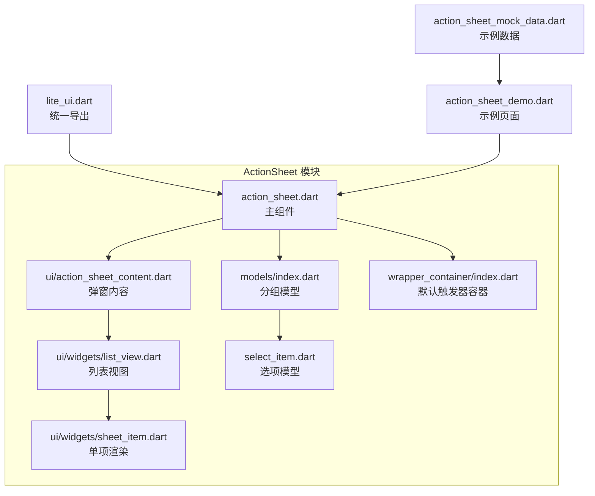
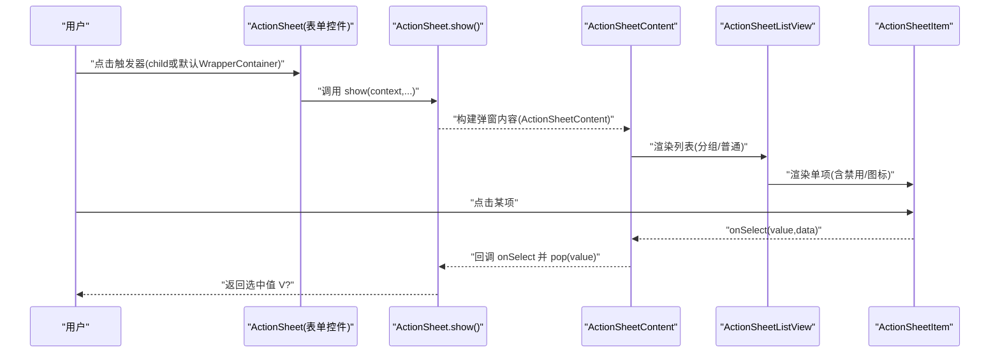
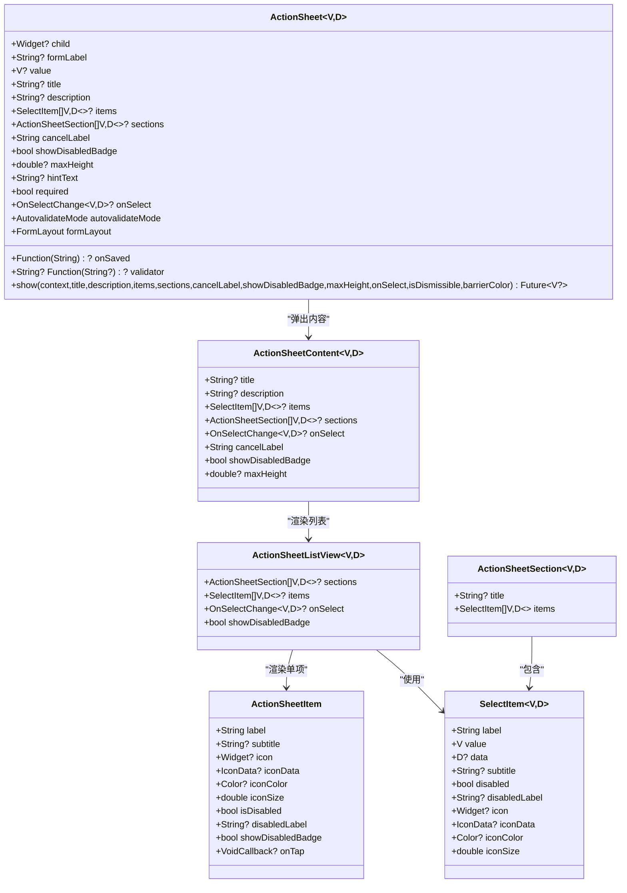

# ActionSheet API

<cite>
**本文引用的文件**   
- [action_sheet.dart](file://lib/src/action_sheet/action_sheet.dart)
- [action_sheet_content.dart](file://lib/src/action_sheet/ui/action_sheet_content.dart)
- [list_view.dart](file://lib/src/action_sheet/ui/widgets/list_view.dart)
- [sheet_item.dart](file://lib/src/action_sheet/ui/widgets/sheet_item.dart)
- [models/index.dart](file://lib/src/action_sheet/models/index.dart)
- [select_item.dart](file://lib/src/models/select_item.dart)
- [callbacks.dart](file://lib/src/models/callbacks.dart)
- [enum.dart](file://lib/src/models/enum.dart)
- [wrapper_container/index.dart](file://lib/src/wrapper_container/index.dart)
- [lite_ui.dart](file://lib/lite_ui.dart)
- [action_sheet_demo.dart](file://example/lib/pages/action_sheet_demo.dart)
- [action_sheet_mock_data.dart](file://example/lib/mock/action_sheet_mock_data.dart)
</cite>

## 目录
1. [简介](#简介)
2. [项目结构](#项目结构)
3. [核心组件](#核心组件)
4. [架构总览](#架构总览)
5. [详细组件分析](#详细组件分析)
6. [依赖关系分析](#依赖关系分析)
7. [性能考量](#性能考量)
8. [故障排查指南](#故障排查指南)
9. [结论](#结论)
10. [附录](#附录)

## 简介
ActionSheet 是底部弹出式操作面板组件，支持两种数据模式：普通列表与分组列表。它提供标题、描述、可滚动操作项列表以及取消按钮，并支持与 Form 表单集成，实现受控/非受控模式、必填校验与错误提示。组件既可作为内置触发器的表单控件使用，也可通过自定义 child 作为触发器，或通过静态方法 show() 编程式调用。

## 项目结构
ActionSheet 相关代码位于 lib/src/action_sheet 目录下，包含主组件、内容渲染、列表视图、单项渲染及模型定义；示例页面位于 example/lib/pages 与 mock 数据位于 example/lib/mock。

图表来源 
- [action_sheet.dart:1-149](file://lib/src/action_sheet/action_sheet.dart#L1-L149)
- [action_sheet_content.dart:1-135](file://lib/src/action_sheet/ui/action_sheet_content.dart#L1-L135)
- [list_view.dart:1-31](file://lib/src/action_sheet/ui/widgets/list_view.dart#L1-L31)
- [sheet_item.dart:1-52](file://lib/src/action_sheet/ui/widgets/sheet_item.dart#L1-L52)
- [models/index.dart:1-15](file://lib/src/action_sheet/models/index.dart#L1-L15)
- [select_item.dart:1-78](file://lib/src/models/select_item.dart#L1-L78)
- [wrapper_container/index.dart:1-119](file://lib/src/wrapper_container/index.dart#L1-L119)
- [lite_ui.dart:1-19](file://lib/lite_ui.dart#L1-L19)
- [action_sheet_demo.dart:1-243](file://example/lib/pages/action_sheet_demo.dart#L1-L243)
- [action_sheet_mock_data.dart:1-103](file://example/lib/mock/action_sheet_mock_data.dart#L1-L103)

章节来源
- [action_sheet.dart:1-149](file://lib/src/action_sheet/action_sheet.dart#L1-L149)
- [lite_ui.dart:1-19](file://lib/lite_ui.dart#L1-L19)

## 核心组件
- ActionSheet<V, D>：表单控件与弹窗壳子，负责受控/非受控状态、默认触发器、与 FormField 集成、以及 show() 静态方法。
- ActionSheetContent<V, D>：弹窗内容（标题+描述+列表+取消），委托给 ActionSheetListView 渲染。
- ActionSheetListView<V, D>：统一处理分组与普通模式的列表渲染。
- ActionSheetItem：单项渲染，支持图标、禁用状态与禁用标签。
- SelectItem<V, D>：选项数据模型，包含 label、value、data、subtitle、disabled、icon/iconData 等。
- ActionSheetSection<V, D>：分组数据模型，包含 title 与 items。

章节来源
- [action_sheet.dart:22-101](file://lib/src/action_sheet/action_sheet.dart#L22-L101)
- [action_sheet_content.dart:19-54](file://lib/src/action_sheet/ui/action_sheet_content.dart#L19-L54)
- [list_view.dart:12-25](file://lib/src/action_sheet/ui/widgets/list_view.dart#L12-L25)
- [sheet_item.dart:4-47](file://lib/src/action_sheet/ui/widgets/sheet_item.dart#L4-L47)
- [select_item.dart:9-51](file://lib/src/models/select_item.dart#L9-L51)
- [models/index.dart:6-14](file://lib/src/action_sheet/models/index.dart#L6-L14)

## 架构总览
ActionSheet 的交互流程分为三种方式：
- 内置触发器：点击 WrapperContainer 触发 _showSheet，内部调用 show() 弹出 ActionSheetContent。
- 自定义触发器：传入 child，点击 child 同样触发 _showSheet。
- 编程式调用：直接调用 ActionSheet.show(context, ...) 弹出内容。

图表来源 
- [action_sheet.dart:158-174](file://lib/src/action_sheet/action_sheet.dart#L158-L174)
- [action_sheet.dart:114-149](file://lib/src/action_sheet/action_sheet.dart#L114-L149)
- [action_sheet_content.dart:59-133](file://lib/src/action_sheet/ui/action_sheet_content.dart#L59-L133)
- [list_view.dart:27-31](file://lib/src/action_sheet/ui/widgets/list_view.dart#L27-L31)
- [sheet_item.dart:49-52](file://lib/src/action_sheet/ui/widgets/sheet_item.dart#L49-L52)

## 详细组件分析

### ActionSheet 属性与方法
- child：自定义触发器 Widget（可选）。不传则渲染默认触发器 UI。
- formLabel：表单标签（默认触发器模式使用）。
- value：当前选中的值（受控模式）。组件会据此匹配 items/sections 中的 label 显示。
- title：主标题。
- description：副标题/描述。
- items：操作项列表（普通模式）。
- sections：分组数据（优先于 items）。
- cancelLabel：取消按钮文字，默认「取消」。
- showDisabledBadge：是否显示禁用项标签，默认 false。
- maxHeight：自定义最大高度（覆盖默认的 75% 屏幕高度）。
- hintText：占位提示文字（未选中时显示）。
- required：是否必填，默认 false。
- onSaved：保存回调，接收字符串形式的值。
- onSelect：选中回调，返回 (V value, D? data)。
- validator：自定义校验函数，返回错误消息或 null。
- autovalidateMode：自动验证模式，默认 AutovalidateMode.disabled。
- formLayout：表单布局方式，默认 FormLayout.row。

静态方法 show()
- 参数：context、title、description、items、sections、cancelLabel、showDisabledBadge、maxHeight、onSelect、isDismissible、barrierColor。
- 行为：以 showModalBottomSheet 弹出 ActionSheetContent，并在 onSelect 中调用外部回调后 pop(value) 返回结果。

受控与非受控模式
- 受控模式：传入 value，配合 onSelect 更新父级 state，组件根据 value 匹配 label 显示。
- 非受控模式：不传 value，仅通过 onSelect 处理选择事件。

与 Form 集成
- 组件内部包裹 FormField<String>，当 required=true 时启用默认校验逻辑，优先使用自定义 validator。
- 选择后同步值到 FormField，支持 onSaved 提交。

章节来源
- [action_sheet.dart:22-101](file://lib/src/action_sheet/action_sheet.dart#L22-L101)
- [action_sheet.dart:114-149](file://lib/src/action_sheet/action_sheet.dart#L114-L149)
- [action_sheet.dart:155-254](file://lib/src/action_sheet/action_sheet.dart#L155-L254)

### ActionSheetContent
- 作用：承载标题、描述、可滚动列表与取消按钮。
- 关键属性：title、description、items、sections、onSelect、cancelLabel、showDisabledBadge、maxHeight。
- 行为：计算有效最大高度（默认屏幕高度的 75%），渲染卡片容器与列表，底部固定取消按钮。

章节来源
- [action_sheet_content.dart:19-54](file://lib/src/action_sheet/ui/action_sheet_content.dart#L19-L54)
- [action_sheet_content.dart:59-133](file://lib/src/action_sheet/ui/action_sheet_content.dart#L59-L133)

### ActionSheetListView
- 作用：统一处理分组与普通模式的渲染。
- 关键属性：sections、items、onSelect、showDisabledBadge。
- 行为：若存在 sections 则按组渲染，否则扁平渲染 items；项之间分割线在普通模式下显示。

章节来源
- [list_view.dart:12-25](file://lib/src/action_sheet/ui/widgets/list_view.dart#L12-L25)
- [list_view.dart:27-31](file://lib/src/action_sheet/ui/widgets/list_view.dart#L27-L31)

### ActionSheetItem
- 作用：单项渲染，支持图标与禁用状态。
- 关键属性：label、subtitle、icon/iconData、iconColor、iconSize、isDisabled、disabledLabel、showDisabledBadge、onTap。
- 行为：禁用时禁用点击；当 showDisabledBadge=true 且 disabled=true 时显示禁用标签。

章节来源
- [sheet_item.dart:4-47](file://lib/src/action_sheet/ui/widgets/sheet_item.dart#L4-L47)
- [sheet_item.dart:49-52](file://lib/src/action_sheet/ui/widgets/sheet_item.dart#L49-L52)

### 数据模型
- SelectItem<V, D>：选项数据，包含 label、value、data、subtitle、disabled、disabledLabel、icon/iconData、iconColor、iconSize。提供 withIcon 工厂构造。
- ActionSheetSection<V, D>：分组数据，包含 title 与 items。

章节来源
- [select_item.dart:9-77](file://lib/src/models/select_item.dart#L9-L77)
- [models/index.dart:6-14](file://lib/src/action_sheet/models/index.dart#L6-L14)

### 表单布局与类型
- FormLayout：row/column 两种布局。
- OnSelectChange<V, D>：单选回调签名。

章节来源
- [enum.dart:1-6](file://lib/src/models/enum.dart#L1-L6)
- [callbacks.dart:1-13](file://lib/src/models/callbacks.dart#L1-L13)

### 默认触发器容器
- WrapperContainer：包装默认触发器 UI，提供表单标签、值文本、错误提示、后缀图标等。
- 与 ActionSheet 结合：当未传入 child 时，由 WrapperContainer 渲染默认触发器，点击后触发 _showSheet。

章节来源
- [wrapper_container/index.dart:13-66](file://lib/src/wrapper_container/index.dart#L13-L66)
- [wrapper_container/index.dart:68-118](file://lib/src/wrapper_container/index.dart#L68-L118)

## 依赖关系分析
ActionSheet 依赖以下模块：
- models/index.dart：导出 SelectItem、ActionSheetSection、回调与枚举。
- wrapper_container/index.dart：默认触发器容器。
- ui/action_sheet_content.dart：弹窗内容。
- ui/widgets/list_view.dart：列表视图。
- ui/widgets/sheet_item.dart：单项渲染。

图表来源 
- [action_sheet.dart:22-101](file://lib/src/action_sheet/action_sheet.dart#L22-L101)
- [action_sheet_content.dart:19-54](file://lib/src/action_sheet/ui/action_sheet_content.dart#L19-L54)
- [list_view.dart:12-25](file://lib/src/action_sheet/ui/widgets/list_view.dart#L12-L25)
- [sheet_item.dart:4-47](file://lib/src/action_sheet/ui/widgets/sheet_item.dart#L4-L47)
- [select_item.dart:9-51](file://lib/src/models/select_item.dart#L9-L51)
- [models/index.dart:6-14](file://lib/src/action_sheet/models/index.dart#L6-L14)

## 性能考量
- 列表渲染：ActionSheetListView 在分组模式下避免不必要的分割线，减少绘制开销。
- 最大高度：默认使用屏幕高度的 75%，可通过 maxHeight 自定义，避免过大内容导致滚动性能问题。
- 受控模式：value 变化会触发重新匹配 label，建议在大数据集场景下对 items/sections 做稳定引用或缓存。
- 禁用项：showDisabledBadge 仅在需要时开启，减少额外标签渲染。

[本节为通用指导，无需源码引用]

## 故障排查指南
- 必填校验无效
  - 检查 required 是否为 true，validator 是否正确返回错误消息。
  - 确认 autovalidateMode 设置是否符合预期（默认 disabled，需手动触发验证或改为其他模式）。
- 受控模式未显示已选值
  - 确保 value 与 items/sections 中的 item.value 一致（类型与相等性比较）。
  - 若 value 为自定义对象，需正确实现 == 与 hashCode。
- 禁用项仍可点击
  - 检查 SelectItem.disabled 与 showDisabledBadge 配置，确保 isDisabled 生效。
- 表单布局异常
  - 检查 formLayout 为 row 或 column，WrapperContainer 会根据布局调整标签与错误提示位置。

章节来源
- [action_sheet.dart:196-210](file://lib/src/action_sheet/action_sheet.dart#L196-L210)
- [wrapper_container/index.dart:68-118](file://lib/src/wrapper_container/index.dart#L68-L118)

## 结论
ActionSheet 提供了灵活的底部操作面板能力，支持普通与分组数据、图标与禁用状态、受控与非受控模式以及与 Form 表单的深度集成。通过 show() 静态方法可实现编程式调用，满足多种业务场景需求。合理配置属性与遵循最佳实践可获得良好的用户体验与性能表现。

[本节为总结，无需源码引用]

## 附录

### API 属性速查表
- child：自定义触发器 Widget（可选）
- formLabel：表单标签（默认触发器模式使用）
- value：当前选中的值（受控模式）
- title：主标题
- description：副标题/描述
- items：操作项列表（普通模式）
- sections：分组数据（优先于 items）
- cancelLabel：取消按钮文字（默认「取消」）
- showDisabledBadge：是否显示禁用项标签（默认 false）
- maxHeight：自定义最大高度（覆盖默认 75%）
- hintText：占位提示文字（未选中时显示）
- required：是否必填（默认 false）
- onSaved：保存回调（字符串形式）
- onSelect：选中回调（value, data）
- validator：自定义校验函数（返回错误消息或 null）
- autovalidateMode：自动验证模式（默认 disabled）
- formLayout：表单布局（默认 row）

章节来源
- [action_sheet.dart:22-101](file://lib/src/action_sheet/action_sheet.dart#L22-L101)

### 静态方法 show() 参数说明
- context：上下文
- title：主标题
- description：副标题/描述
- items：操作项列表
- sections：分组数据（优先于 items）
- cancelLabel：取消按钮文字（默认「取消」）
- showDisabledBadge：是否显示禁用项标签（默认 false）
- maxHeight：自定义最大高度
- onSelect：选中回调（value, data）
- isDismissible：点击遮罩是否可关闭（默认 true）
- barrierColor：遮罩颜色

章节来源
- [action_sheet.dart:114-149](file://lib/src/action_sheet/action_sheet.dart#L114-L149)

### 受控与非受控使用示例（路径指引）
- 基本本地操作菜单（非受控）：[action_sheet_demo.dart:17-27](file://example/lib/pages/action_sheet_demo.dart#L17-L27)
- 分组显示示例（非受控）：[action_sheet_demo.dart:29-40](file://example/lib/pages/action_sheet_demo.dart#L29-L40)
- 带图标的列表项示例（非受控）：[action_sheet_demo.dart:42-53](file://example/lib/pages/action_sheet_demo.dart#L42-L53)
- 禁用状态示例（非受控）：[action_sheet_demo.dart:55-104](file://example/lib/pages/action_sheet_demo.dart#L55-L104)
- 组合功能（分组+图标+禁用）示例（非受控）：[action_sheet_demo.dart:106-167](file://example/lib/pages/action_sheet_demo.dart#L106-L167)
- 示例数据（默认/分组/图标/城市）：[action_sheet_mock_data.dart:1-103](file://example/lib/mock/action_sheet_mock_data.dart#L1-L103)

### 与 Form 表单集成的验证机制
- 组件内部使用 FormField<String>，当 required=true 时启用默认校验逻辑，优先使用自定义 validator。
- 选择后同步值到 FormField，支持 onSaved 提交。
- 错误提示通过 WrapperContainer 展示，支持行/列布局。

章节来源
- [action_sheet.dart:155-254](file://lib/src/action_sheet/action_sheet.dart#L155-L254)
- [wrapper_container/index.dart:68-118](file://lib/src/wrapper_container/index.dart#L68-L118)