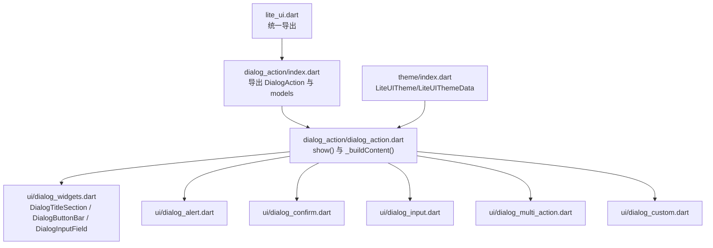
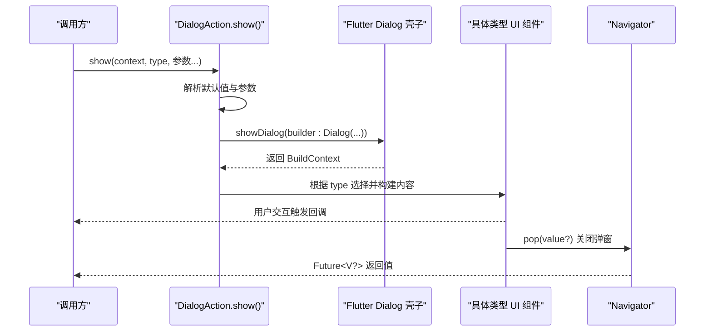
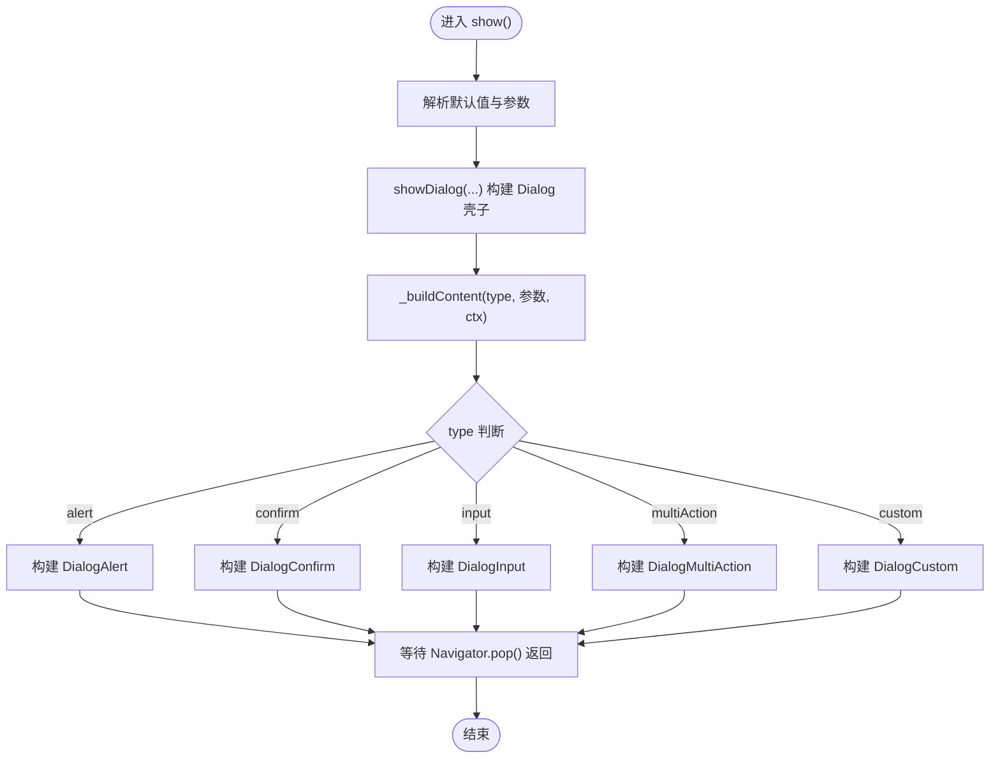
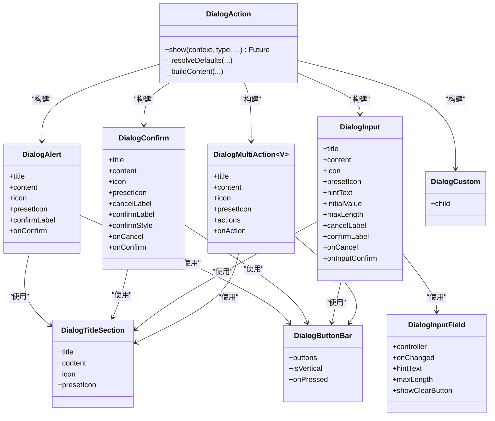

# DialogAction API

<cite>
**本文引用的文件**   
- [dialog_action.dart](file://lib/src/dialog_action/dialog_action.dart)
- [index.dart](file://lib/src/dialog_action/index.dart)
- [models/index.dart](file://lib/src/dialog_action/models/index.dart)
- [ui/dialog_widgets.dart](file://lib/src/dialog_action/ui/dialog_widgets.dart)
- [ui/dialog_alert.dart](file://lib/src/dialog_action/ui/dialog_alert.dart)
- [ui/dialog_confirm.dart](file://lib/src/dialog_action/ui/dialog_confirm.dart)
- [ui/dialog_input.dart](file://lib/src/dialog_action/ui/dialog_input.dart)
- [ui/dialog_multi_action.dart](file://lib/src/dialog_action/ui/dialog_multi_action.dart)
- [ui/dialog_custom.dart](file://lib/src/dialog_action/ui/dialog_custom.dart)
- [lite_ui.dart](file://lib/lite_ui.dart)
- [dialog_action_demo.dart](file://example/lib/pages/dialog_action_demo.dart)
- [theme/index.dart](file://lib/src/theme/index.dart)
</cite>

## 目录
1. [简介](#简介)
2. [项目结构](#项目结构)
3. [核心组件与类型](#核心组件与类型)
4. [架构总览](#架构总览)
5. [详细组件分析](#详细组件分析)
6. [依赖关系分析](#依赖关系分析)
7. [性能与可用性建议](#性能与可用性建议)
8. [故障排查指南](#故障排查指南)
9. [结论](#结论)
10. [附录：API 参考与示例索引](#附录api-参考与示例索引)

## 简介
DialogAction 是 lite_ui 库中的居中弹窗组件，提供多种预设对话框类型：alert、confirm、input、multiAction、custom。通过静态方法 show() 即可快速弹出对应类型的对话框，支持标题、内容、图标、按钮文案、回调函数等配置，并返回异步结果（如 confirm 的布尔值、input 的文本、multiAction 的 value）。同时支持自定义遮罩行为、主题样式覆盖以及完全自定义内容的弹窗。

## 项目结构
DialogAction 采用“壳子 + 内容”的分层设计：
- 入口与调度：DialogAction.show() 负责显示 Dialog 壳子，并根据 type 分发到具体 UI 组件。
- 模型与枚举：统一导出 DialogType、DialogButtonStyle、DialogActionButton、DialogPresetIcon 等类型。
- UI 组件：每种类型对应一个专用 Widget，复用公共标题区域与按钮栏。
- 主题系统：通过 Flutter Theme 与 LiteUITheme 进行样式定制。

图表来源
- [lite_ui.dart:1-19](file://lib/lite_ui.dart#L1-L19)
- [index.dart:1-3](file://lib/src/dialog_action/index.dart#L1-L3)
- [dialog_action.dart:95-131](file://lib/src/dialog_action/dialog_action.dart#L95-L131)
- [ui/dialog_widgets.dart:1-275](file://lib/src/dialog_action/ui/dialog_widgets.dart#L1-L275)
- [ui/dialog_alert.dart:1-44](file://lib/src/dialog_action/ui/dialog_alert.dart#L1-L44)
- [ui/dialog_confirm.dart:1-70](file://lib/src/dialog_action/ui/dialog_confirm.dart#L1-L70)
- [ui/dialog_input.dart:1-110](file://lib/src/dialog_action/ui/dialog_input.dart#L1-L110)
- [ui/dialog_multi_action.dart:1-48](file://lib/src/dialog_action/ui/dialog_multi_action.dart#L1-L48)
- [ui/dialog_custom.dart:1-18](file://lib/src/dialog_action/ui/dialog_custom.dart#L1-L18)
- [theme/index.dart:1-73](file://lib/src/theme/index.dart#L1-L73)

章节来源
- [lite_ui.dart:1-19](file://lib/lite_ui.dart#L1-L19)
- [index.dart:1-3](file://lib/src/dialog_action/index.dart#L1-L3)

## 核心组件与类型
- DialogAction：居中弹窗壳子，提供静态方法 show<V>()，根据 type 渲染不同内容。
- DialogType：弹窗类型枚举（alert、confirm、input、multiAction、custom）。
- DialogButtonStyle：按钮样式（normal、primary、destructive）。
- DialogActionButton<V>：多操作按钮数据（label、value、style、disabled）。
- DialogPresetIcon：预设图标（success、warning、error、info）。
- DialogDefaults：内部默认值容器（title、content、confirmLabel、cancelLabel、hintText）。
- UI 组件：
  - DialogAlert：提示弹窗（标题+内容+确认按钮）
  - DialogConfirm：确认弹窗（标题+内容+取消/确认双按钮）
  - DialogInput：输入弹窗（标题+输入框+取消/确认）
  - DialogMultiAction<V>：多操作弹窗（标题+内容+纵向多按钮）
  - DialogCustom：自定义内容弹窗（仅壳子）
- 公共 UI：
  - DialogTitleSection：标题区（可选图标+标题+内容）
  - DialogButtonBar：按钮栏（横向或纵向布局）
  - DialogInputField：输入框（带清除按钮、最大长度、聚焦边框等）

章节来源
- [dialog_action.dart:24-91](file://lib/src/dialog_action/dialog_action.dart#L24-L91)
- [models/index.dart:1-85](file://lib/src/dialog_action/models/index.dart#L1-L85)
- [ui/dialog_widgets.dart:1-275](file://lib/src/dialog_action/ui/dialog_widgets.dart#L1-L275)
- [ui/dialog_alert.dart:1-44](file://lib/src/dialog_action/ui/dialog_alert.dart#L1-L44)
- [ui/dialog_confirm.dart:1-70](file://lib/src/dialog_action/ui/dialog_confirm.dart#L1-L70)
- [ui/dialog_input.dart:1-110](file://lib/src/dialog_action/ui/dialog_input.dart#L1-L110)
- [ui/dialog_multi_action.dart:1-48](file://lib/src/dialog_action/ui/dialog_multi_action.dart#L1-L48)
- [ui/dialog_custom.dart:1-18](file://lib/src/dialog_action/ui/dialog_custom.dart#L1-L18)

## 架构总览
DialogAction.show() 作为统一入口，完成参数解析、默认值合并、Dialog 壳子构建与内容分发。各类型 UI 组件复用公共标题与按钮栏，保证一致的交互体验。

图表来源
- [dialog_action.dart:95-131](file://lib/src/dialog_action/dialog_action.dart#L95-L131)
- [dialog_action.dart:190-247](file://lib/src/dialog_action/dialog_action.dart#L190-L247)

## 详细组件分析

### DialogAction.show() 静态方法
- 功能：显示居中弹窗，支持 barrierDismissible、barrierColor 控制遮罩行为；根据 type 分发到对应 UI 组件；返回 Future<V?>。
- 关键参数：
  - context：必需
  - type：弹窗类型，默认 alert
  - title/content：标题与内容
  - icon/presetIcon：自定义图标或预设图标
  - confirmLabel/cancelLabel/confirmStyle：按钮文案与样式
  - onCancel/onConfirm：confirm 模式回调
  - hintText/initialValue/maxLength/onInputConfirm：input 模式参数
  - actions/onAction：multiAction 模式参数
  - customChild：custom 模式内容
  - barrierDismissible/barrierColor：遮罩相关

图表来源
- [dialog_action.dart:95-131](file://lib/src/dialog_action/dialog_action.dart#L95-L131)
- [dialog_action.dart:190-247](file://lib/src/dialog_action/dialog_action.dart#L190-L247)

章节来源
- [dialog_action.dart:24-91](file://lib/src/dialog_action/dialog_action.dart#L24-L91)
- [dialog_action.dart:95-131](file://lib/src/dialog_action/dialog_action.dart#L95-L131)
- [dialog_action.dart:190-247](file://lib/src/dialog_action/dialog_action.dart#L190-L247)

### 类型一：alert（提示弹窗）
- 用途：展示提示信息，单个确认按钮。
- 常用参数：title、content、icon/presetIcon、confirmLabel、onConfirm。
- 返回值：Future<void>（关闭即返回 null）。
- 使用示例路径：[dialog_action_demo.dart:14-24](file://example/lib/pages/dialog_action_demo.dart#L14-L24)

章节来源
- [ui/dialog_alert.dart:1-44](file://lib/src/dialog_action/ui/dialog_alert.dart#L1-L44)
- [dialog_action_demo.dart:14-24](file://example/lib/pages/dialog_action_demo.dart#L14-L24)

### 类型二：confirm（确认弹窗）
- 用途：二次确认，包含取消与确认两个按钮。
- 常用参数：title、content、icon/presetIcon、cancelLabel、confirmLabel、confirmStyle、onCancel、onConfirm。
- 返回值：Future<bool>（点击确认返回 true，取消返回 false）。
- 使用示例路径：[dialog_action_demo.dart:26-44](file://example/lib/pages/dialog_action_demo.dart#L26-L44)

章节来源
- [ui/dialog_confirm.dart:1-70](file://lib/src/dialog_action/ui/dialog_confirm.dart#L1-L70)
- [dialog_action_demo.dart:26-44](file://example/lib/pages/dialog_action_demo.dart#L26-L44)

### 类型三：input（输入弹窗）
- 用途：收集用户输入，包含输入框与取消/确认按钮。
- 常用参数：title、content、icon/presetIcon、hintText、initialValue、maxLength、onCancel、onInputConfirm。
- 返回值：Future<String?>（确认时返回输入文本，取消返回 null）。
- 使用示例路径：[dialog_action_demo.dart:46-64](file://example/lib/pages/dialog_action_demo.dart#L46-L64)

章节来源
- [ui/dialog_input.dart:1-110](file://lib/src/dialog_action/ui/dialog_input.dart#L1-L110)
- [dialog_action_demo.dart:46-64](file://example/lib/pages/dialog_action_demo.dart#L46-L64)

### 类型四：multiAction（多操作弹窗）
- 用途：展示多个操作按钮（纵向排列），每个按钮携带 label 与 value。
- 常用参数：title、content、icon/presetIcon、actions、onAction。
- 返回值：Future<V?>（点击某个按钮返回对应的 value）。
- 使用示例路径：[dialog_action_demo.dart:66-82](file://example/lib/pages/dialog_action_demo.dart#L66-L82)

章节来源
- [ui/dialog_multi_action.dart:1-48](file://lib/src/dialog_action/ui/dialog_multi_action.dart#L1-L48)
- [dialog_action_demo.dart:66-82](file://example/lib/pages/dialog_action_demo.dart#L66-L82)

### 类型五：custom（自定义内容弹窗）
- 用途：完全自定义弹窗内容，仅由 DialogAction 提供壳子与遮罩。
- 常用参数：customChild（任意 Widget）、barrierDismissible、barrierColor。
- 返回值：Future<void>（关闭即返回 null）。
- 使用示例路径：[dialog_action_demo.dart:84-106](file://example/lib/pages/dialog_action_demo.dart#L84-L106)

章节来源
- [ui/dialog_custom.dart:1-18](file://lib/src/dialog_action/ui/dialog_custom.dart#L1-L18)
- [dialog_action_demo.dart:84-106](file://example/lib/pages/dialog_action_demo.dart#L84-L106)

### 公共 UI 组件
- DialogTitleSection：标题区，支持自定义图标与预设图标，居中对齐。
- DialogButtonBar：按钮栏，支持横向（alert/confirm/input）与纵向（multiAction）两种布局，iOS 风格分割线。
- DialogInputField：输入框，支持 maxLength、自动聚焦、清除按钮、聚焦边框高亮。

章节来源
- [ui/dialog_widgets.dart:1-275](file://lib/src/dialog_action/ui/dialog_widgets.dart#L1-L275)

## 依赖关系分析
DialogAction 与各 UI 组件之间为“组合”关系，UI 组件之间通过公共组件复用，避免重复实现。

图表来源
- [dialog_action.dart:95-131](file://lib/src/dialog_action/dialog_action.dart#L95-L131)
- [ui/dialog_alert.dart:1-44](file://lib/src/dialog_action/ui/dialog_alert.dart#L1-L44)
- [ui/dialog_confirm.dart:1-70](file://lib/src/dialog_action/ui/dialog_confirm.dart#L1-L70)
- [ui/dialog_input.dart:1-110](file://lib/src/dialog_action/ui/dialog_input.dart#L1-L110)
- [ui/dialog_multi_action.dart:1-48](file://lib/src/dialog_action/ui/dialog_multi_action.dart#L1-L48)
- [ui/dialog_custom.dart:1-18](file://lib/src/dialog_action/ui/dialog_custom.dart#L1-L18)
- [ui/dialog_widgets.dart:1-275](file://lib/src/dialog_action/ui/dialog_widgets.dart#L1-L275)

章节来源
- [dialog_action.dart:95-131](file://lib/src/dialog_action/dialog_action.dart#L95-L131)
- [ui/dialog_widgets.dart:1-275](file://lib/src/dialog_action/ui/dialog_widgets.dart#L1-L275)

## 性能与可用性建议
- 避免在 Dialog 内放置重型 Widget，尽量保持轻量以提升渲染速度。
- 合理使用 barrierDismissible，防止误触关闭导致的数据丢失。
- input 模式下设置 maxLength 与合适的 initialValue，减少不必要的状态更新。
- multiAction 的 actions 列表不宜过长，必要时分页或改用其他选择器。
- 自定义内容弹窗中避免频繁 setState，必要时将状态下沉至独立控制器。

## 故障排查指南
- 弹窗不显示：检查是否传入有效的 BuildContext，确保在可导航上下文中调用。
- 返回值未生效：确认是否在 await 后处理返回值，并确保 Navigator.pop(value) 被正确调用。
- 输入框无法提交：检查 onInputConfirm 是否正确绑定，且当前文本非空（input 模式下确认按钮会禁用空输入）。
- 样式异常：确认 Theme.of(context) 的颜色与字体是否可用，必要时通过 LiteUITheme 全局覆盖。

章节来源
- [ui/dialog_input.dart:63-109](file://lib/src/dialog_action/ui/dialog_input.dart#L63-L109)
- [dialog_action.dart:190-247](file://lib/src/dialog_action/dialog_action.dart#L190-L247)

## 结论
DialogAction 以统一的静态接口提供了丰富的弹窗能力，涵盖常见业务场景与高度可扩展的自定义能力。通过类型化返回值与回调机制，开发者可以简洁地处理异步交互与结果传递。结合主题系统与公共 UI 组件，可在保持一致视觉风格的同时满足个性化需求。

## 附录：API 参考与示例索引

### DialogAction.show() 参数说明
- context：必需的 BuildContext
- type：DialogType，默认 alert
- title/content：字符串，标题与内容
- icon/presetIcon：Widget 或预设图标
- confirmLabel/cancelLabel/confirmStyle：按钮文案与样式
- onCancel/onConfirm：回调函数
- hintText/initialValue/maxLength/onInputConfirm：输入框相关
- actions/onAction：多操作按钮列表与回调
- customChild：自定义内容 Widget
- barrierDismissible/barrierColor：遮罩行为与颜色

章节来源
- [dialog_action.dart:24-91](file://lib/src/dialog_action/dialog_action.dart#L24-L91)

### 各类型使用示例路径
- alert 默认与自定义：[dialog_action_demo.dart:14-24](file://example/lib/pages/dialog_action_demo.dart#L14-L24)
- confirm 默认与自定义：[dialog_action_demo.dart:26-44](file://example/lib/pages/dialog_action_demo.dart#L26-L44)
- input 默认与自定义：[dialog_action_demo.dart:46-64](file://example/lib/pages/dialog_action_demo.dart#L46-L64)
- multiAction：[dialog_action_demo.dart:66-82](file://example/lib/pages/dialog_action_demo.dart#L66-L82)
- custom：[dialog_action_demo.dart:84-106](file://example/lib/pages/dialog_action_demo.dart#L84-L106)
- 自定义图标：[dialog_action_demo.dart:108-124](file://example/lib/pages/dialog_action_demo.dart#L108-L124)

章节来源
- [dialog_action_demo.dart:14-124](file://example/lib/pages/dialog_action_demo.dart#L14-L124)

### 主题定制与样式覆盖
- 使用 Flutter Theme 的 colorScheme、textTheme 影响标题、按钮颜色与字体。
- 通过 LiteUITheme 包裹应用，统一设置库级默认颜色与圆角等。
- 针对 Dialog 壳子，可通过 barrierColor、Dialog.backgroundColor、shape 等进行外观调整。

章节来源
- [theme/index.dart:1-73](file://lib/src/theme/index.dart#L1-L73)
- [dialog_action.dart:95-131](file://lib/src/dialog_action/dialog_action.dart#L95-L131)
- [ui/dialog_widgets.dart:1-275](file://lib/src/dialog_action/ui/dialog_widgets.dart#L1-L275)