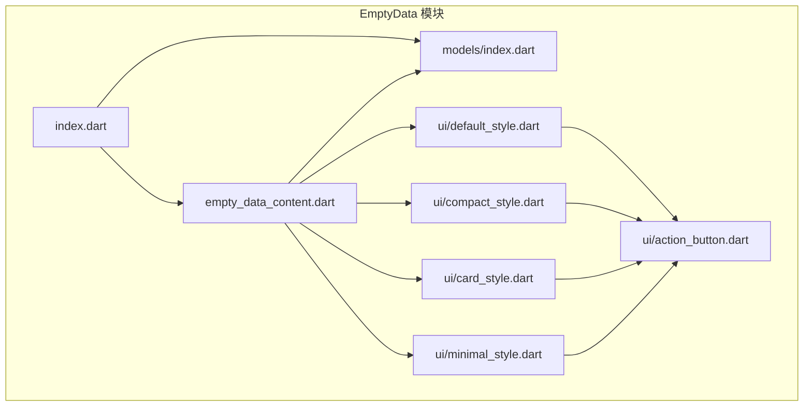
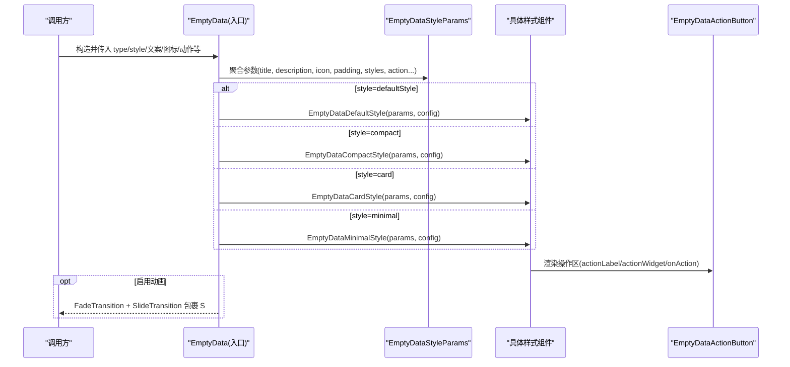
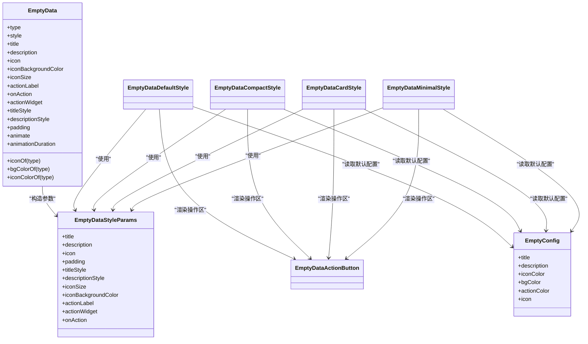
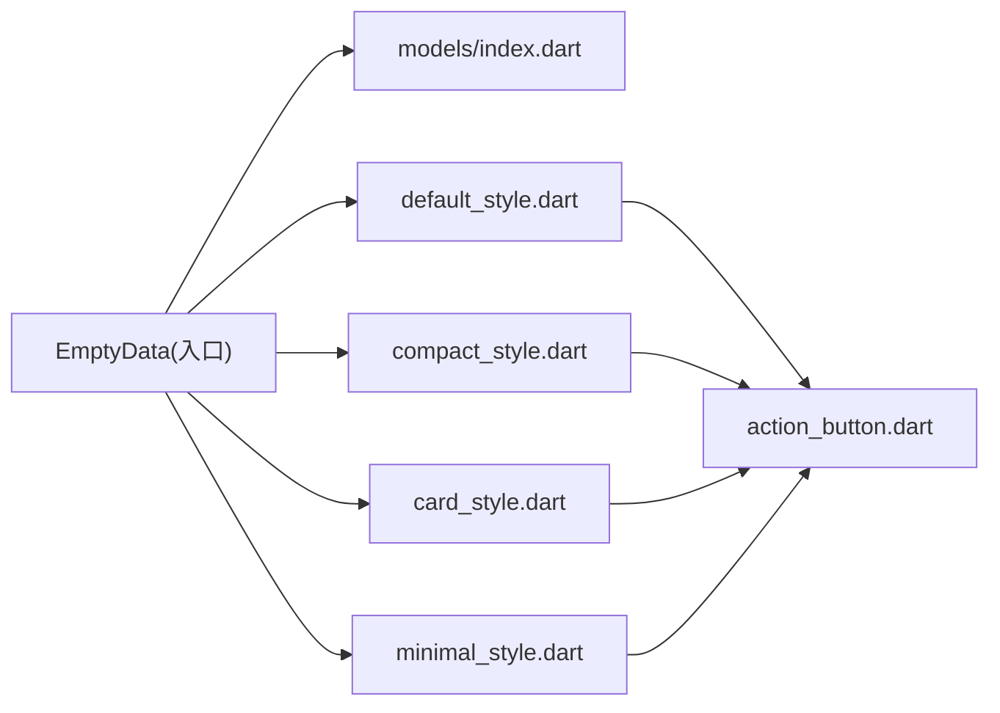

# EmptyData API

<cite>
**本文引用的文件**   
- [lib/src/empty_data/index.dart](file://lib/src/empty_data/index.dart)
- [lib/src/empty_data/empty_data_content.dart](file://lib/src/empty_data/empty_data_content.dart)
- [lib/src/empty_data/models/index.dart](file://lib/src/empty_data/models/index.dart)
- [lib/src/empty_data/ui/default_style.dart](file://lib/src/empty_data/ui/default_style.dart)
- [lib/src/empty_data/ui/compact_style.dart](file://lib/src/empty_data/ui/compact_style.dart)
- [lib/src/empty_data/ui/card_style.dart](file://lib/src/empty_data/ui/card_style.dart)
- [lib/src/empty_data/ui/minimal_style.dart](file://lib/src/empty_data/ui/minimal_style.dart)
- [lib/src/empty_data/ui/action_button.dart](file://lib/src/empty_data/ui/action_button.dart)
- [example/lib/pages/empty_data_demo.dart](file://example/lib/pages/empty_data_demo.dart)
</cite>

## 目录
1. [简介](#简介)
2. [项目结构](#项目结构)
3. [核心组件与 API](#核心组件与-api)
4. [架构总览](#架构总览)
5. [详细组件分析](#详细组件分析)
6. [依赖关系分析](#依赖关系分析)
7. [性能与动画](#性能与动画)
8. [与列表和数据加载的集成模式](#与列表和数据加载的集成模式)
9. [响应式设计与可访问性](#响应式设计与可访问性)
10. [故障排查](#故障排查)
11. [结论](#结论)

## 简介
EmptyData 是一个用于展示“空状态”的 Flutter 组件，适用于列表、页面或模块无数据时的占位提示。它支持 8 种预设场景类型与 4 种布局风格自由组合，并提供图标、标题、描述、按钮等属性的灵活配置，同时内置入场动画与交互行为，便于快速构建一致的空状态体验。

## 项目结构
EmptyData 采用“模型 + 样式 + 入口组件”的分层组织：
- 模型定义：场景类型、布局风格、默认配置与共享参数
- 样式实现：不同风格的 UI 渲染逻辑
- 入口组件：统一对外暴露 API，负责参数聚合、样式分发与动画控制

图表来源
- [lib/src/empty_data/index.dart:1-3](file://lib/src/empty_data/index.dart#L1-L3)
- [lib/src/empty_data/empty_data_content.dart:1-167](file://lib/src/empty_data/empty_data_content.dart#L1-L167)
- [lib/src/empty_data/models/index.dart:1-156](file://lib/src/empty_data/models/index.dart#L1-L156)
- [lib/src/empty_data/ui/default_style.dart:1-69](file://lib/src/empty_data/ui/default_style.dart#L1-L69)
- [lib/src/empty_data/ui/compact_style.dart:1-67](file://lib/src/empty_data/ui/compact_style.dart#L1-L67)
- [lib/src/empty_data/ui/card_style.dart:1-92](file://lib/src/empty_data/ui/card_style.dart#L1-L92)
- [lib/src/empty_data/ui/minimal_style.dart:1-75](file://lib/src/empty_data/ui/minimal_style.dart#L1-L75)
- [lib/src/empty_data/ui/action_button.dart:1-63](file://lib/src/empty_data/ui/action_button.dart#L1-L63)

章节来源
- [lib/src/empty_data/index.dart:1-3](file://lib/src/empty_data/index.dart#L1-L3)
- [lib/src/empty_data/empty_data_content.dart:1-167](file://lib/src/empty_data/empty_data_content.dart#L1-L167)
- [lib/src/empty_data/models/index.dart:1-156](file://lib/src/empty_data/models/index.dart#L1-L156)

## 核心组件与 API
EmptyData 是对外暴露的核心 StatefulWidget，提供以下关键能力：
- 场景类型 type：选择 8 种预设空状态（如 empty、search、noNetwork、error、noPermission、noMessage、noOrder、maintenance）
- 布局风格 style：选择 4 种视觉风格（defaultStyle、compact、card、minimal）
- 文案与图标：title、description、icon、iconBackgroundColor、iconSize
- 操作区域：actionLabel、onAction、actionWidget（自定义操作区）
- 文本样式：titleStyle、descriptionStyle
- 布局与动画：padding、animate、animationDuration
- 静态工具：iconOf(type)、bgColorOf(type)、iconColorOf(type)

使用建议
- 最简用法：仅传入 type 即可显示默认文案与图标
- 指定风格与场景：style + type 组合快速切换外观与内容
- 完全自定义：通过 icon、title、description、actionWidget 等覆盖默认值

章节来源
- [lib/src/empty_data/empty_data_content.dart:26-102](file://lib/src/empty_data/empty_data_content.dart#L26-L102)
- [lib/src/empty_data/models/index.dart:3-43](file://lib/src/empty_data/models/index.dart#L3-L43)
- [lib/src/empty_data/models/index.dart:45-123](file://lib/src/empty_data/models/index.dart#L45-L123)
- [lib/src/empty_data/models/index.dart:125-155](file://lib/src/empty_data/models/index.dart#L125-L155)

## 架构总览
EmptyData 的工作流程如下：
- 入口组件接收用户参数，构造 EmptyDataStyleParams
- 根据 style 选择对应样式组件进行渲染
- 若启用 animate，则包裹 FadeTransition 与 SlideTransition 实现入场动画
- 各样式组件内部复用 EmptyDataActionButton 渲染操作区

图表来源
- [lib/src/empty_data/empty_data_content.dart:134-166](file://lib/src/empty_data/empty_data_content.dart#L134-L166)
- [lib/src/empty_data/ui/default_style.dart:1-69](file://lib/src/empty_data/ui/default_style.dart#L1-L69)
- [lib/src/empty_data/ui/compact_style.dart:1-67](file://lib/src/empty_data/ui/compact_style.dart#L1-L67)
- [lib/src/empty_data/ui/card_style.dart:1-92](file://lib/src/empty_data/ui/card_style.dart#L1-L92)
- [lib/src/empty_data/ui/minimal_style.dart:1-75](file://lib/src/empty_data/ui/minimal_style.dart#L1-L75)
- [lib/src/empty_data/ui/action_button.dart:1-63](file://lib/src/empty_data/ui/action_button.dart#L1-L63)

## 详细组件分析

### 入口组件 EmptyData
职责
- 管理 state、动画控制器与过渡效果
- 将外部属性聚合成 EmptyDataStyleParams
- 根据 style 分派到对应样式组件

关键属性与行为
- type/style：决定默认文案、图标与布局风格
- title/description/icon/iconBackgroundColor/iconSize：覆盖默认内容与视觉
- actionLabel/onAction/actionWidget：操作区文案、回调或自定义 Widget
- titleStyle/descriptionStyle：文本样式定制
- padding/animate/animationDuration：内边距与入场动画开关及时长

静态方法
- iconOf(type)：获取该类型的内置图标
- bgColorOf(type)：获取该类型的背景色
- iconColorOf(type)：获取该类型的图标色

章节来源
- [lib/src/empty_data/empty_data_content.dart:26-102](file://lib/src/empty_data/empty_data_content.dart#L26-L102)
- [lib/src/empty_data/empty_data_content.dart:104-131](file://lib/src/empty_data/empty_data_content.dart#L104-L131)
- [lib/src/empty_data/empty_data_content.dart:134-166](file://lib/src/empty_data/empty_data_content.dart#L134-L166)

### 模型与默认配置
- EmptyDataType：8 种空状态场景
- EmptyDataStyle：4 种布局风格
- EmptyConfig：每种场景的默认文案、颜色与图标
- EmptyDataStyleParams：样式组件共享参数对象

章节来源
- [lib/src/empty_data/models/index.dart:3-43](file://lib/src/empty_data/models/index.dart#L3-L43)
- [lib/src/empty_data/models/index.dart:45-123](file://lib/src/empty_data/models/index.dart#L45-L123)
- [lib/src/empty_data/models/index.dart:125-155](file://lib/src/empty_data/models/index.dart#L125-L155)

### 样式组件族
- EmptyDataDefaultStyle：居中圆形图标 + 文字，适合通用空状态
- EmptyDataCompactStyle：横向紧凑布局，适合行内或空间受限场景
- EmptyDataCardStyle：带顶部渐变色带的卡片，强调信息区块
- EmptyDataMinimalStyle：极简文字 + 圆点装饰，适合轻量提示

共同特性
- 均使用 Semantics 提供无障碍标签
- 均支持 actionLabel 或 actionWidget 渲染操作区
- 均支持 icon 与 iconBackgroundColor 覆盖默认视觉

章节来源
- [lib/src/empty_data/ui/default_style.dart:1-69](file://lib/src/empty_data/ui/default_style.dart#L1-L69)
- [lib/src/empty_data/ui/compact_style.dart:1-67](file://lib/src/empty_data/ui/compact_style.dart#L1-L67)
- [lib/src/empty_data/ui/card_style.dart:1-92](file://lib/src/empty_data/ui/card_style.dart#L1-L92)
- [lib/src/empty_data/ui/minimal_style.dart:1-75](file://lib/src/empty_data/ui/minimal_style.dart#L1-L75)

### 操作按钮 EmptyDataActionButton
职责
- 优先渲染 actionWidget（完全自定义操作区）
- 否则根据 actionLabel 渲染默认按钮
- compact 模式下调整尺寸与字体

交互与可访问性
- 提供 InkWell 点击反馈与阴影
- 使用 Semantics(button: true, label:) 提升可访问性

章节来源
- [lib/src/empty_data/ui/action_button.dart:1-63](file://lib/src/empty_data/ui/action_button.dart#L1-L63)

### 类图（代码级关系）

图表来源
- [lib/src/empty_data/empty_data_content.dart:26-102](file://lib/src/empty_data/empty_data_content.dart#L26-L102)
- [lib/src/empty_data/models/index.dart:45-155](file://lib/src/empty_data/models/index.dart#L45-L155)
- [lib/src/empty_data/ui/default_style.dart:1-69](file://lib/src/empty_data/ui/default_style.dart#L1-L69)
- [lib/src/empty_data/ui/compact_style.dart:1-67](file://lib/src/empty_data/ui/compact_style.dart#L1-L67)
- [lib/src/empty_data/ui/card_style.dart:1-92](file://lib/src/empty_data/ui/card_style.dart#L1-L92)
- [lib/src/empty_data/ui/minimal_style.dart:1-75](file://lib/src/empty_data/ui/minimal_style.dart#L1-L75)
- [lib/src/empty_data/ui/action_button.dart:1-63](file://lib/src/empty_data/ui/action_button.dart#L1-L63)

## 依赖关系分析
- 入口组件依赖模型与样式组件，并通过参数聚合减少样式组件的参数数量
- 样式组件依赖 EmptyDataActionButton 统一处理操作区
- 所有样式组件依赖 EmptyConfig 提供的默认文案与颜色

图表来源
- [lib/src/empty_data/empty_data_content.dart:1-167](file://lib/src/empty_data/empty_data_content.dart#L1-L167)
- [lib/src/empty_data/models/index.dart:1-156](file://lib/src/empty_data/models/index.dart#L1-L156)
- [lib/src/empty_data/ui/action_button.dart:1-63](file://lib/src/empty_data/ui/action_button.dart#L1-L63)

章节来源
- [lib/src/empty_data/empty_data_content.dart:1-167](file://lib/src/empty_data/empty_data_content.dart#L1-L167)
- [lib/src/empty_data/models/index.dart:1-156](file://lib/src/empty_data/models/index.dart#L1-L156)

## 性能与动画
- 动画机制：当 animate=true 时，使用 AnimationController + CurvedAnimation 驱动 FadeTransition 与 SlideTransition，默认时长 400ms
- 性能要点：
  - 仅在需要时启用动画，避免频繁重建导致重绘
  - 合理设置 animationDuration，过长影响交互流畅度
  - 使用 key（如 ValueKey）触发重播动画，便于演示与调试

章节来源
- [lib/src/empty_data/empty_data_content.dart:104-131](file://lib/src/empty_data/empty_data_content.dart#L104-L131)
- [lib/src/empty_data/empty_data_content.dart:134-166](file://lib/src/empty_data/empty_data_content.dart#L134-L166)
- [example/lib/pages/empty_data_demo.dart:11-36](file://example/lib/pages/empty_data_demo.dart#L11-L36)

## 与列表和数据加载的集成模式
常见模式
- 列表为空：直接返回 EmptyData，配合 actionLabel 引导用户新增数据
- 网络错误：使用 noNetwork 类型，提供“重新加载”按钮
- 加载中：结合业务状态机，在 loading 完成后切换为 EmptyData 或真实数据

示例参考
- 示例页展示了三种状态的切换与按钮回调处理

章节来源
- [example/lib/pages/empty_data_demo.dart:218-242](file://example/lib/pages/empty_data_demo.dart#L218-L242)
- [example/lib/pages/empty_data_demo.dart:359-388](file://example/lib/pages/empty_data_demo.dart#L359-L388)

## 响应式设计与可访问性
- 响应式适配：
  - 各样式组件使用 Flexible/Row/Column 自适应宽度
  - 文本 maxLines 与 overflow 控制换行与省略
  - padding 与 iconSize 可按需调整以适应不同屏幕
- 可访问性：
  - 样式组件使用 Semantics(label:) 提供可读标签
  - 按钮使用 Semantics(button: true, label:) 增强读屏支持

章节来源
- [lib/src/empty_data/ui/default_style.dart:18-20](file://lib/src/empty_data/ui/default_style.dart#L18-L20)
- [lib/src/empty_data/ui/compact_style.dart:18-20](file://lib/src/empty_data/ui/compact_style.dart#L18-L20)
- [lib/src/empty_data/ui/card_style.dart:18-20](file://lib/src/empty_data/ui/card_style.dart#L18-L20)
- [lib/src/empty_data/ui/minimal_style.dart:15-17](file://lib/src/empty_data/ui/minimal_style.dart#L15-L17)
- [lib/src/empty_data/ui/action_button.dart:31-34](file://lib/src/empty_data/ui/action_button.dart#L31-L34)

## 故障排查
常见问题与建议
- 未显示操作按钮：检查是否传入了 actionLabel 或 actionWidget；若均未传，按钮区域将被隐藏
- 动画不生效：确认 animate=true；如需重播动画，可通过改变 key 触发重建
- 文本溢出：适当增大 iconSize 或调整 padding；必要时限制 maxLines
- 颜色不一致：确保 iconBackgroundColor 与主题色协调；可使用静态方法获取默认色

章节来源
- [lib/src/empty_data/ui/action_button.dart:20-60](file://lib/src/empty_data/ui/action_button.dart#L20-L60)
- [lib/src/empty_data/empty_data_content.dart:114-125](file://lib/src/empty_data/empty_data_content.dart#L114-L125)
- [lib/src/empty_data/models/index.dart:58-123](file://lib/src/empty_data/models/index.dart#L58-L123)

## 结论
EmptyData 以清晰的 API 与可扩展的样式体系，为应用提供了统一的空状态解决方案。通过类型与风格的组合、灵活的文案与图标覆盖、以及可选的动画与交互，开发者可以快速构建符合业务需求的空状态界面，并与列表、加载状态无缝集成。