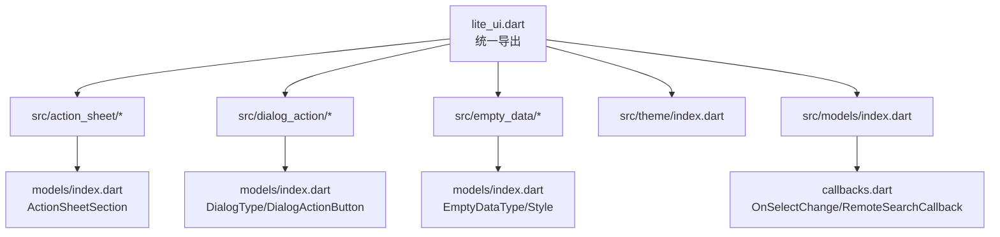
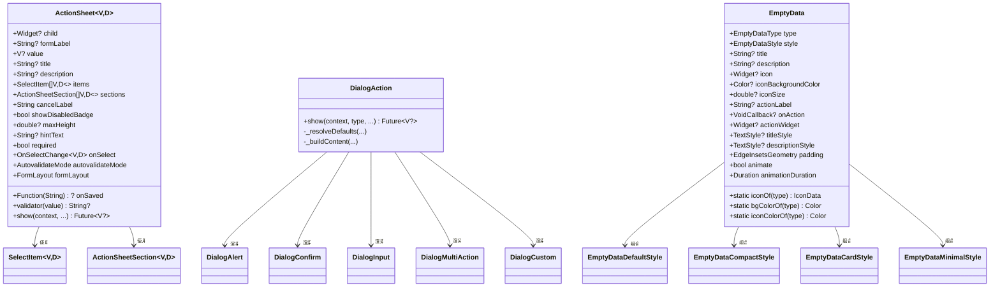
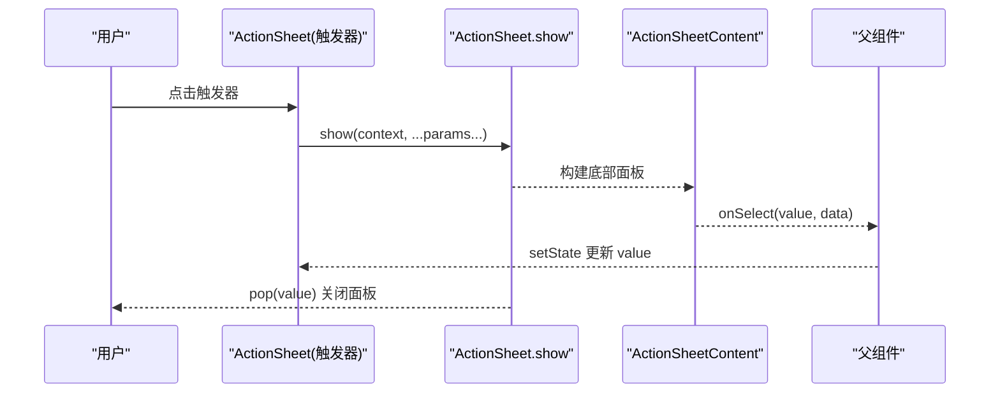
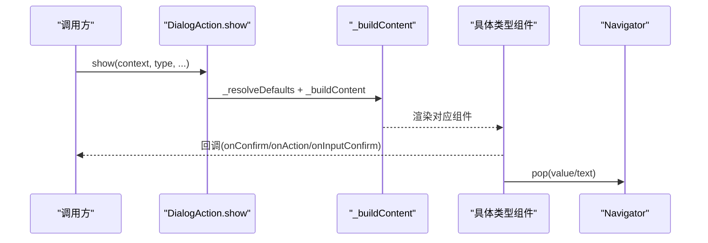
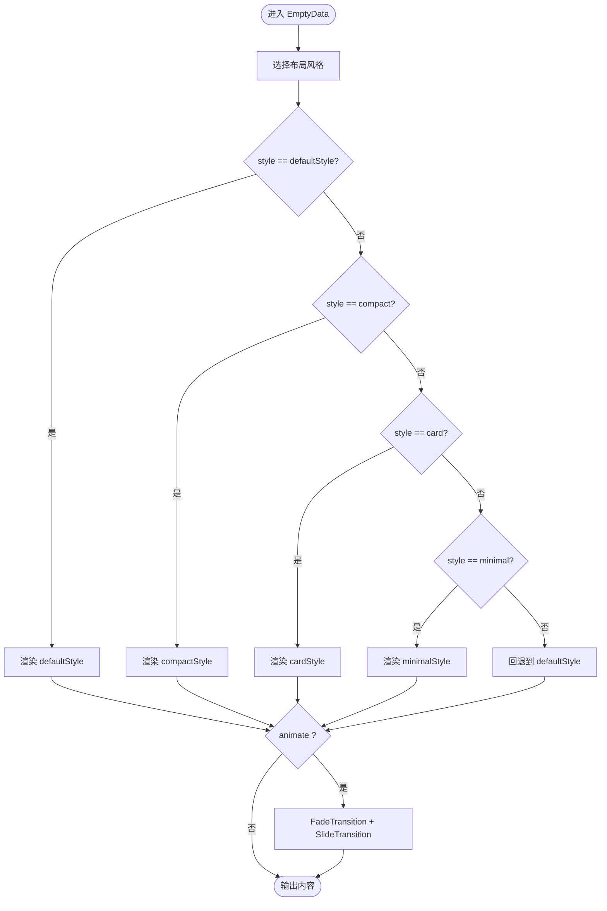
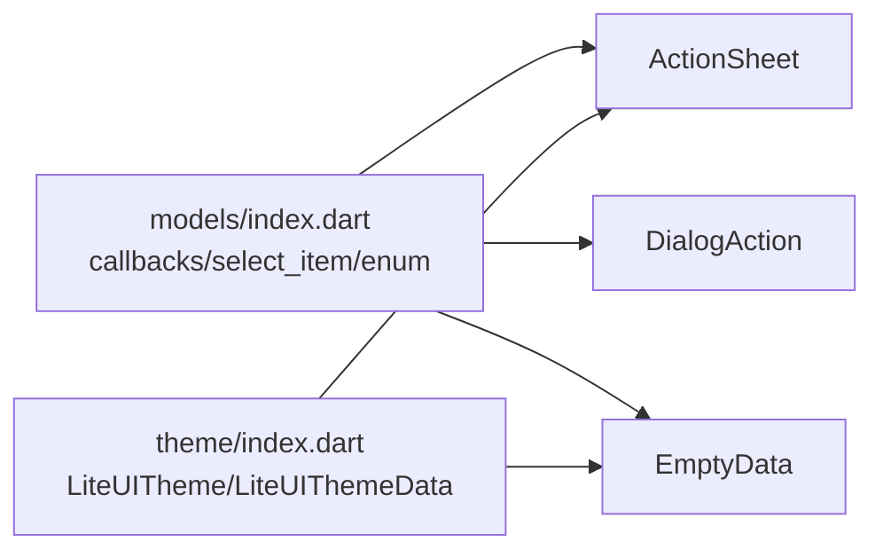

# 业务组件 API

<cite>
**本文引用的文件**   
- [lite_ui.dart](file://lib/lite_ui.dart)
- [README.md](file://README.md)
- [action_sheet.dart](file://lib/src/action_sheet/action_sheet.dart)
- [index.dart（ActionSheet）](file://lib/src/action_sheet/index.dart)
- [models/index.dart（ActionSheet）](file://lib/src/action_sheet/models/index.dart)
- [dialog_action.dart](file://lib/src/dialog_action/dialog_action.dart)
- [index.dart（DialogAction）](file://lib/src/dialog_action/index.dart)
- [models/index.dart（DialogAction）](file://lib/src/dialog_action/models/index.dart)
- [empty_data_content.dart](file://lib/src/empty_data/empty_data_content.dart)
- [index.dart（EmptyData）](file://lib/src/empty_data/index.dart)
- [models/index.dart（EmptyData）](file://lib/src/empty_data/models/index.dart)
- [callbacks.dart](file://lib/src/models/callbacks.dart)
- [index.dart（Models）](file://lib/src/models/index.dart)
- [index.dart（Theme）](file://lib/src/theme/index.dart)
</cite>

## 目录
1. [简介](#简介)
2. [项目结构](#项目结构)
3. [核心组件](#核心组件)
4. [架构总览](#架构总览)
5. [详细组件分析](#详细组件分析)
6. [依赖关系分析](#依赖关系分析)
7. [性能与可用性建议](#性能与可用性建议)
8. [故障排查指南](#故障排查指南)
9. [结论](#结论)
10. [附录：主题、样式与国际化](#附录主题样式与国际化)

## 简介
本文件为 Lite UI 业务组件的完整 API 参考，聚焦 ActionSheet、DialogAction、EmptyData 等常用业务组件。内容涵盖接口规范、配置选项、数据绑定、事件处理机制、交互流程、状态管理、异步操作处理，以及主题定制、样式覆盖与国际化支持方式。文档以“从入门到进阶”的方式组织，既适合快速上手，也便于深入查阅实现细节。

## 项目结构
Lite UI 采用按功能模块划分的目录组织方式，每个业务组件包含 models、ui、index 等子目录，统一通过顶层 lite_ui.dart 导出。主题模型集中定义在 theme 目录，通用回调与枚举集中在 models 目录。

图表来源 
- [lite_ui.dart:1-19](file://lib/lite_ui.dart#L1-L19)
- [index.dart（ActionSheet）:1-3](file://lib/src/action_sheet/index.dart#L1-L3)
- [index.dart（DialogAction）:1-3](file://lib/src/dialog_action/index.dart#L1-L3)
- [index.dart（EmptyData）:1-3](file://lib/src/empty_data/index.dart#L1-L3)
- [index.dart（Theme）:1-73](file://lib/src/theme/index.dart#L1-L73)
- [index.dart（Models）:1-4](file://lib/src/models/index.dart#L1-L4)

章节来源
- [lite_ui.dart:1-19](file://lib/lite_ui.dart#L1-L19)
- [README.md:1-126](file://README.md#L1-L126)

## 核心组件
- ActionSheet：底部弹出面板，支持普通列表与分组模式，提供受控值绑定、表单校验与静态 show 调用。
- DialogAction：居中弹窗，支持 alert/confirm/input/multiAction/custom 五种类型，统一入口 show。
- EmptyData：空状态占位组件，支持多场景类型与多种布局风格，内置动画与可自定义操作区。

章节来源
- [action_sheet.dart:1-255](file://lib/src/action_sheet/action_sheet.dart#L1-L255)
- [dialog_action.dart:1-248](file://lib/src/dialog_action/dialog_action.dart#L1-L248)
- [empty_data_content.dart:1-167](file://lib/src/empty_data/empty_data_content.dart#L1-L167)

## 架构总览
三个核心组件均遵循“壳子 + 内容渲染”的解耦设计：
- ActionSheet：壳子由 ActionSheet 负责 showModalBottomSheet，内容渲染委托给 ActionSheetContent。
- DialogAction：壳子由 DialogAction.show 负责 showDialog，具体类型内容由对应子组件渲染。
- EmptyData：根据 style 选择不同渲染策略，统一参数对象传递，避免参数爆炸。

图表来源 
- [action_sheet.dart:1-255](file://lib/src/action_sheet/action_sheet.dart#L1-L255)
- [dialog_action.dart:1-248](file://lib/src/dialog_action/dialog_action.dart#L1-L248)
- [empty_data_content.dart:1-167](file://lib/src/empty_data/empty_data_content.dart#L1-L167)
- [models/index.dart（ActionSheet）:1-15](file://lib/src/action_sheet/models/index.dart#L1-L15)
- [models/index.dart（DialogAction）:1-85](file://lib/src/dialog_action/models/index.dart#L1-L85)
- [models/index.dart（EmptyData）:1-156](file://lib/src/empty_data/models/index.dart#L1-L156)

## 详细组件分析

### ActionSheet
- 用途：底部弹出面板，展示操作项或分组操作项，支持受控值与表单集成。
- 关键能力
  - 两种数据模式：items 平铺；sections 分组优先。
  - 受控模式：传入 value，自动匹配 label 显示；配合 onSelect 更新父级状态。
  - 表单集成：FormField 包装，支持 required、validator、autovalidateMode、onSaved。
  - 编程式调用：ActionSheet.show 静态方法返回选中值。
- 重要属性与方法
  - child/formLabel/value/title/description/items/sections/cancelLabel/showDisabledBadge/maxHeight/hintText/required/onSaved/onSelect/validator/autovalidateMode/formLayout
  - static show(context, title, description, items, sections, cancelLabel, showDisabledBadge, maxHeight, onSelect, isDismissible, barrierColor)
- 交互流程
  - 点击触发器 → showModalBottomSheet → 渲染 ActionSheetContent → 用户选择 → 回调 onSelect → Navigator.pop(value) → 同步 FormField 值。

图表来源 
- [action_sheet.dart:103-149](file://lib/src/action_sheet/action_sheet.dart#L103-L149)
- [action_sheet.dart:155-174](file://lib/src/action_sheet/action_sheet.dart#L155-L174)

章节来源
- [action_sheet.dart:1-255](file://lib/src/action_sheet/action_sheet.dart#L1-L255)
- [index.dart（ActionSheet）:1-3](file://lib/src/action_sheet/index.dart#L1-L3)
- [models/index.dart（ActionSheet）:1-15](file://lib/src/action_sheet/models/index.dart#L1-L15)

### DialogAction
- 用途：居中弹窗，统一入口 show，支持 alert/confirm/input/multiAction/custom 五种类型。
- 关键能力
  - 类型化默认文案解析：_resolveDefaults 根据 type 设置默认标题、按钮文案与提示文字。
  - 内容分发：_buildContent 根据 type 渲染对应子组件。
  - 返回值：confirm/input/multiAction 返回 V 或文本；alert/custom 返回 void 或自定义。
- 重要属性与方法
  - show(context, type, title, content, icon, presetIcon, confirmLabel, cancelLabel, confirmStyle, onCancel, onConfirm, hintText, initialValue, maxLength, onInputConfirm, actions, onAction, customChild, barrierDismissible, barrierColor)
- 交互流程
  - 调用 show → showDialog → _buildContent → 渲染具体类型 → 用户操作 → 回调并 pop(value/text)。

图表来源 
- [dialog_action.dart:56-131](file://lib/src/dialog_action/dialog_action.dart#L56-L131)
- [dialog_action.dart:134-153](file://lib/src/dialog_action/dialog_action.dart#L134-L153)
- [dialog_action.dart:156-246](file://lib/src/dialog_action/dialog_action.dart#L156-L246)

章节来源
- [dialog_action.dart:1-248](file://lib/src/dialog_action/dialog_action.dart#L1-L248)
- [index.dart（DialogAction）:1-3](file://lib/src/dialog_action/index.dart#L1-L3)
- [models/index.dart（DialogAction）:1-85](file://lib/src/dialog_action/models/index.dart#L1-L85)

### EmptyData
- 用途：空状态占位组件，支持 8 种场景 × 4 种布局风格，可自定义图标、标题、描述与操作区。
- 关键能力
  - 场景枚举：EmptyDataType（empty/search/noNetwork/error/noPermission/noMessage/noOrder/maintenance）。
  - 风格枚举：EmptyDataStyle（defaultStyle/compact/card/minimal）。
  - 动画：入场淡入+上滑，可开关与时长控制。
  - 静态工具：iconOf/bgColorOf/iconColorOf 获取预设资源。
- 重要属性与方法
  - type/style/title/description/icon/iconBackgroundColor/iconSize/actionLabel/onAction/actionWidget/titleStyle/descriptionStyle/padding/animate/animationDuration
  - static iconOf(type), static bgColorOf(type), static iconColorOf(type)
- 渲染流程
  - 根据 style 选择对应渲染组件（default/compact/card/minimal），聚合参数 EmptyDataStyleParams，可选动画包裹。

图表来源 
- [empty_data_content.dart:134-167](file://lib/src/empty_data/empty_data_content.dart#L134-L167)
- [models/index.dart（EmptyData）:1-156](file://lib/src/empty_data/models/index.dart#L1-L156)

章节来源
- [empty_data_content.dart:1-167](file://lib/src/empty_data/empty_data_content.dart#L1-L167)
- [index.dart（EmptyData）:1-3](file://lib/src/empty_data/index.dart#L1-L3)
- [models/index.dart（EmptyData）:1-156](file://lib/src/empty_data/models/index.dart#L1-L156)

## 依赖关系分析
- 组件间耦合度低，主要通过 models 与 theme 共享数据结构与主题。
- ActionSheet 依赖 SelectItem、ActionSheetSection、FormLayout、LiteUITheme。
- DialogAction 依赖 DialogType、DialogActionButton、DialogButtonStyle、DialogPresetIcon。
- EmptyData 依赖 EmptyDataType、EmptyDataStyle、EmptyConfig、EmptyDataStyleParams。
- 回调类型集中定义于 callbacks.dart，便于复用与扩展。

图表来源 
- [index.dart（Models）:1-4](file://lib/src/models/index.dart#L1-L4)
- [callbacks.dart:1-13](file://lib/src/models/callbacks.dart#L1-L13)
- [index.dart（Theme）:1-73](file://lib/src/theme/index.dart#L1-L73)

章节来源
- [index.dart（Models）:1-4](file://lib/src/models/index.dart#L1-L4)
- [callbacks.dart:1-13](file://lib/src/models/callbacks.dart#L1-L13)
- [index.dart（Theme）:1-73](file://lib/src/theme/index.dart#L1-L73)

## 性能与可用性建议
- ActionSheet
  - 大数据量建议使用 sections 分组，减少单次渲染节点数量。
  - 合理设置 maxHeight，避免不必要的滚动与重绘。
  - 受控模式下，onSelect 中仅做必要 setState，避免频繁重建。
- DialogAction
  - multiAction 的 actions 列表过长时，考虑分页或懒加载。
  - input 模式如需长文本，注意 maxLength 与键盘高度对布局的影响。
- EmptyData
  - 动画可关闭（animate=false）以提升首屏性能。
  - 自定义 actionWidget 时避免复杂嵌套，保持轻量。

[本节为通用建议，不直接分析具体文件]

## 故障排查指南
- ActionSheet
  - 必填校验未生效：检查 required、validator、autovalidateMode 是否一致；确认 value 与 items/sections 中的 value 类型一致。
  - 选择后值未同步：确保 onSelect 中更新父级 state，并正确传回 value。
- DialogAction
  - 弹窗不关闭：确认回调中是否调用了 Navigator.pop 或返回了正确的返回值。
  - 输入框无初始值：检查 initialValue 是否正确传入。
- EmptyData
  - 动画卡顿：关闭 animate 或缩短 animationDuration。
  - 样式异常：检查 theme 覆盖是否生效，必要时使用 actionWidget 完全自定义。

章节来源
- [action_sheet.dart:196-209](file://lib/src/action_sheet/action_sheet.dart#L196-L209)
- [dialog_action.dart:134-153](file://lib/src/dialog_action/dialog_action.dart#L134-L153)
- [empty_data_content.dart:112-131](file://lib/src/empty_data/empty_data_content.dart#L112-L131)

## 结论
ActionSheet、DialogAction、EmptyData 三个组件以清晰的职责边界与统一的 API 设计，覆盖了常见的业务交互场景。通过泛型、枚举与集中式回调定义，实现了高内聚、低耦合与良好的可扩展性。结合 LiteUITheme 可实现全局主题定制，满足多端一致的视觉体验。

[本节为总结性内容，不直接分析具体文件]

## 附录：主题、样式与国际化
- 主题定制
  - 使用 LiteUITheme 包裹应用，提供 LiteUIThemeData 覆盖边框色、错误色、圆角、提示色与文字色。
  - 组件内部通过 LiteUITheme.of(context) 读取主题，保证样式一致性。
- 样式覆盖
  - ActionSheet：通过 maxHeight、cancelLabel、showDisabledBadge 调整外观与行为。
  - DialogAction：通过 confirmStyle、barrierColor、barrierDismissible 控制按钮与遮罩。
  - EmptyData：通过 style、titleStyle、descriptionStyle、padding、actionWidget 精细控制。
- 国际化支持
  - 组件文案多为参数传入（如 title、content、cancelLabel、confirmLabel、hintText），可在上层统一注入本地化字符串。
  - EmptyData 的默认文案来自 emptyDataDefaults，可通过覆盖 actionWidget 或传入自定义 title/description 实现多语言。

章节来源
- [index.dart（Theme）:1-73](file://lib/src/theme/index.dart#L1-L73)
- [action_sheet.dart:82-101](file://lib/src/action_sheet/action_sheet.dart#L82-L101)
- [dialog_action.dart:56-91](file://lib/src/dialog_action/dialog_action.dart#L56-L91)
- [empty_data_content.dart:72-89](file://lib/src/empty_data/empty_data_content.dart#L72-L89)
- [models/index.dart（EmptyData）:58-123](file://lib/src/empty_data/models/index.dart#L58-L123)