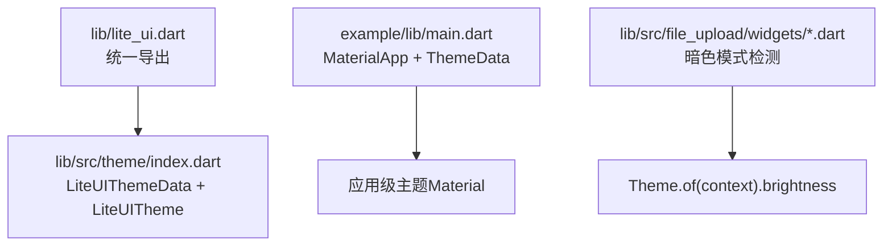
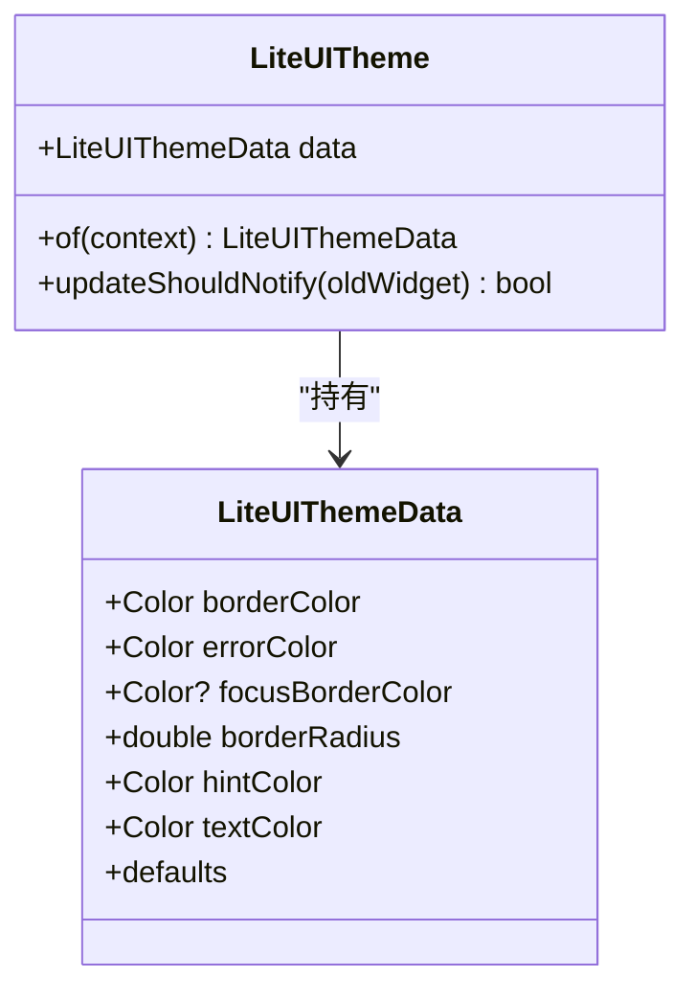
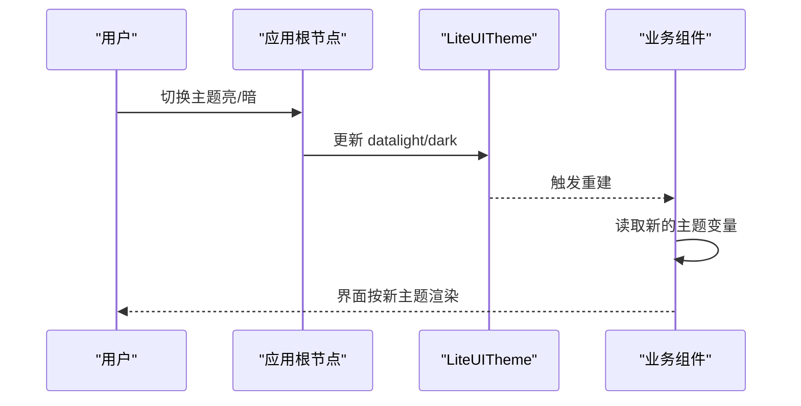
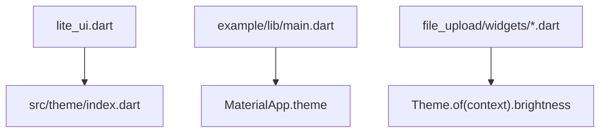

# 主题系统 API

<cite>
**本文引用的文件**
- [lib/lite_ui.dart](file://lib/lite_ui.dart)
- [lib/src/theme/index.dart](file://lib/src/theme/index.dart)
- [example/lib/main.dart](file://example/lib/main.dart)
- [lib/src/file_upload/widgets/file_action_sheet.dart](file://lib/src/file_upload/widgets/file_action_sheet.dart)
- [lib/src/file_upload/widgets/picker_sheet.dart](file://lib/src/file_upload/widgets/picker_sheet.dart)
- [lib/src/models/enum.dart](file://lib/src/models/enum.dart)
- [README.md](file://README.md)
</cite>

## 目录
1. [简介](#简介)
2. [项目结构](#项目结构)
3. [核心组件](#核心组件)
4. [架构总览](#架构总览)
5. [详细组件分析](#详细组件分析)
6. [依赖关系分析](#依赖关系分析)
7. [性能考虑](#性能考虑)
8. [故障排查指南](#故障排查指南)
9. [结论](#结论)
10. [附录](#附录)

## 简介
本文件为 Lite UI 主题系统的完整 API 参考文档，聚焦于 LiteUITheme 的配置选项、颜色与样式变量、字体与文本策略、主题继承与动态切换机制，以及响应式设计与暗色模式支持。同时给出多语言与品牌定制的实现建议，并说明与 Material Design 的兼容性与自定义样式的最佳实践。

## 项目结构
Lite UI 的主题能力通过库入口统一导出，并在 src/theme 中实现主题数据与 InheritedWidget 提供能力。示例应用展示了如何结合 Flutter 的 ThemeData 使用主题。

图表来源
- [lib/lite_ui.dart:1-19](file://lib/lite_ui.dart#L1-L19)
- [lib/src/theme/index.dart:1-73](file://lib/src/theme/index.dart#L1-L73)
- [example/lib/main.dart:1-80](file://example/lib/main.dart#L1-L80)
- [lib/src/file_upload/widgets/file_action_sheet.dart:18](file://lib/src/file_upload/widgets/file_action_sheet.dart#L18)
- [lib/src/file_upload/widgets/picker_sheet.dart:10](file://lib/src/file_upload/widgets/picker_sheet.dart#L10)

章节来源
- [lib/lite_ui.dart:1-19](file://lib/lite_ui.dart#L1-L19)
- [lib/src/theme/index.dart:1-73](file://lib/src/theme/index.dart#L1-L73)
- [example/lib/main.dart:1-80](file://example/lib/main.dart#L1-L80)

## 核心组件
- LiteUIThemeData：库级主题数据载体，包含边框颜色、错误颜色、聚焦边框颜色、圆角半径、提示文字颜色、默认文字颜色等。
- LiteUITheme：InheritedWidget，用于在 Widget 树中向下传递主题数据，并提供静态方法获取当前主题。

关键要点
- 所有属性均为不可变常量构造，便于热重载与变更通知优化。
- 未显式设置 focusBorderColor 时回退到系统主题色，保证与平台一致性。
- 提供 defaults 静态实例作为兜底值。

章节来源
- [lib/src/theme/index.dart:6-38](file://lib/src/theme/index.dart#L6-L38)
- [lib/src/theme/index.dart:40-73](file://lib/src/theme/index.dart#L40-L73)

## 架构总览
LiteUI 主题采用“轻量数据 + Inherited 传播”的模式，与应用层 Material 主题解耦但可协同工作。组件内部可通过 Theme.of(context) 读取亮度进行暗色适配，或通过 LiteUITheme.of(context) 读取库级主题变量。

图表来源
- [lib/src/theme/index.dart:6-73](file://lib/src/theme/index.dart#L6-L73)

章节来源
- [lib/src/theme/index.dart:1-73](file://lib/src/theme/index.dart#L1-L73)

## 详细组件分析

### LiteUIThemeData 配置项说明
- 边框颜色（borderColor）：组件默认边框色。
- 错误状态边框颜色（errorColor）：校验失败或异常态边框色。
- 聚焦边框颜色（focusBorderColor）：聚焦态边框色；为空时使用系统主题色。
- 圆角半径（borderRadius）：默认圆角大小。
- 提示文字颜色（hintColor）：占位符或提示文案颜色。
- 文字颜色（textColor）：默认正文文字颜色。

使用建议
- 将品牌主色映射到 errorColor 或 borderColor，保持视觉一致性。
- 若需强调交互反馈，优先设置 focusBorderColor，避免覆盖系统行为。

章节来源
- [lib/src/theme/index.dart:6-38](file://lib/src/theme/index.dart#L6-L38)

### LiteUITheme 主题注入与获取
- 通过 LiteUITheme(data:, child:) 包裹应用根节点，使子树共享同一套库级主题。
- 组件内通过 LiteUITheme.of(context) 获取当前主题数据。
- updateShouldNotify 基于 data 引用比较决定是否重建，提升性能。

章节来源
- [lib/src/theme/index.dart:40-73](file://lib/src/theme/index.dart#L40-L73)

### 与 Material 主题的协作与暗色模式
- 示例应用通过 MaterialApp.theme 设置 ColorScheme 与 useMaterial3，启用 Material 3 风格。
- 组件内部通过 Theme.of(context).brightness 判断明暗，以调整背景或图标对比度。
- 建议在 App 层维护一套 Light/Dark 两套 LiteUIThemeData，配合系统主题切换。

章节来源
- [example/lib/main.dart:20-26](file://example/lib/main.dart#L20-L26)
- [lib/src/file_upload/widgets/file_action_sheet.dart:18](file://lib/src/file_upload/widgets/file_action_sheet.dart#L18)
- [lib/src/file_upload/widgets/picker_sheet.dart:10](file://lib/src/file_upload/widgets/picker_sheet.dart#L10)

### 响应式设计支持
- 组件内部通过 MediaQuery.of(context).size.height 获取屏幕高度，用于弹窗面板高度计算与布局适配。
- 建议在小屏设备上降低圆角与间距，在大屏上适当放大字号与间距。

章节来源
- [lib/src/action_sheet/ui/action_sheet_content.dart:60](file://lib/src/action_sheet/ui/action_sheet_content.dart#L60)
- [lib/src/dropdown_choose/dropdown_choose.dart:175](file://lib/src/dropdown_choose/dropdown_choose.dart#L175)
- [lib/src/tree_select/tree_select_helper.dart:38](file://lib/src/tree_select/tree_select_helper.dart#L38)
- [lib/src/tree_select/tree_select_helper.dart:91](file://lib/src/tree_select/tree_select_helper.dart#L91)

### 主题变量的定义规范
- 命名约定：语义化命名（如 borderColor、errorColor），避免硬编码颜色值。
- 默认值：提供合理的 defaults，确保无主题包裹时的可用性。
- 类型约束：颜色使用 Color，尺寸使用 double，布尔与枚举明确边界。

章节来源
- [lib/src/theme/index.dart:6-38](file://lib/src/theme/index.dart#L6-L38)
- [lib/src/models/enum.dart:1-29](file://lib/src/models/enum.dart#L1-L29)

### 样式覆盖策略
- 组件级覆盖：在组件参数中直接传入样式覆盖，适用于局部差异。
- 主题级覆盖：通过 LiteUITheme 包裹更大范围，统一修改默认样式。
- 应用级覆盖：结合 Material 主题与 ColorScheme，全局控制色彩与文本样式。

章节来源
- [lib/src/theme/index.dart:40-73](file://lib/src/theme/index.dart#L40-L73)
- [example/lib/main.dart:20-26](file://example/lib/main.dart#L20-L26)

### 与 Material Design 规范的兼容性
- 使用 useMaterial3: true 启用 Material 3 设计语言。
- 通过 ColorScheme.fromSeed(seedColor:) 生成一致的主色与辅助色体系。
- 组件内部对 Brightness 的判断与 Material 的暗色模式保持一致。

章节来源
- [example/lib/main.dart:20-26](file://example/lib/main.dart#L20-L26)
- [lib/src/file_upload/widgets/file_action_sheet.dart:18](file://lib/src/file_upload/widgets/file_action_sheet.dart#L18)
- [lib/src/file_upload/widgets/picker_sheet.dart:10](file://lib/src/file_upload/widgets/picker_sheet.dart#L10)

### 动态切换主题（亮/暗）
- 在应用层维护两套 LiteUIThemeData（light/dark）。
- 监听系统主题变化或用户设置，更新 LiteUITheme.data。
- 组件通过 LiteUITheme.of(context) 自动响应重建。

[此图为概念流程，不直接映射具体源码文件]

### 多语言支持与国际化
- 文本内容建议使用 i18n 包管理，避免硬编码字符串。
- 主题变量不包含文案，文案由业务层注入，确保主题与语言解耦。
- 在表单与弹窗中统一通过 i18n 获取 label、placeholder、错误信息等。

[本节为通用指导，不直接分析具体文件]

### 品牌定制方案
- 将品牌主色映射到 borderColor 或 errorColor，形成统一的视觉基调。
- 通过 borderRadius 控制整体圆角风格，体现品牌调性。
- 在应用层结合 Material 的 ColorScheme 与 Typography，统一字体与层级。

章节来源
- [lib/src/theme/index.dart:6-38](file://lib/src/theme/index.dart#L6-L38)
- [example/lib/main.dart:20-26](file://example/lib/main.dart#L20-L26)

## 依赖关系分析
LiteUI 主题模块依赖 Flutter 的 Material 框架，并通过 InheritedWidget 向子树传播主题数据。示例应用通过 MaterialApp 提供 Material 主题，组件内部再根据亮度进行暗色适配。

图表来源
- [lib/lite_ui.dart:1-19](file://lib/lite_ui.dart#L1-L19)
- [lib/src/theme/index.dart:1-73](file://lib/src/theme/index.dart#L1-L73)
- [example/lib/main.dart:1-80](file://example/lib/main.dart#L1-L80)
- [lib/src/file_upload/widgets/file_action_sheet.dart:18](file://lib/src/file_upload/widgets/file_action_sheet.dart#L18)
- [lib/src/file_upload/widgets/picker_sheet.dart:10](file://lib/src/file_upload/widgets/picker_sheet.dart#L10)

章节来源
- [lib/lite_ui.dart:1-19](file://lib/lite_ui.dart#L1-L19)
- [lib/src/theme/index.dart:1-73](file://lib/src/theme/index.dart#L1-L73)
- [example/lib/main.dart:1-80](file://example/lib/main.dart#L1-L80)

## 性能考虑
- 使用 const 构造 LiteUIThemeData，减少不必要的重建。
- 仅在 data 引用变化时触发通知（updateShouldNotify），避免频繁刷新。
- 合理拆分主题作用域，避免大范围重建；必要时使用 ValueListenableBuilder 或 Provider 管理主题状态。
- 在暗色模式下避免重复计算亮度判断，可在上层缓存结果。

章节来源
- [lib/src/theme/index.dart:40-73](file://lib/src/theme/index.dart#L40-L73)

## 故障排查指南
- 主题未生效：确认 LiteUITheme 是否包裹了需要使用的组件树。
- 聚焦边框颜色未显示：检查 focusBorderColor 是否为空，为空时将回退到系统主题色。
- 暗色模式无效：确认应用层 ThemeData.brightness 是否正确设置，组件内部依赖该值进行适配。
- 响应式布局异常：检查 MediaQuery 的使用位置与作用域，确保在正确的 BuildContext 中获取尺寸。

章节来源
- [lib/src/theme/index.dart:40-73](file://lib/src/theme/index.dart#L40-L73)
- [example/lib/main.dart:20-26](file://example/lib/main.dart#L20-L26)
- [lib/src/file_upload/widgets/file_action_sheet.dart:18](file://lib/src/file_upload/widgets/file_action_sheet.dart#L18)
- [lib/src/file_upload/widgets/picker_sheet.dart:10](file://lib/src/file_upload/widgets/picker_sheet.dart#L10)

## 结论
LiteUI 主题系统以简洁的数据结构与 Inherited 传播为核心，既满足库级样式统一，又与应用层 Material 主题良好协作。通过合理的变量定义、覆盖策略与性能优化，可实现暗色模式、响应式设计与品牌定制的一体化方案。

## 附录
- 安装与依赖：参见 README 中的依赖表与安装方式。
- 组件一览：README 提供了各组件的功能说明与用法概览。

章节来源
- [README.md:1-126](file://README.md#L1-L126)