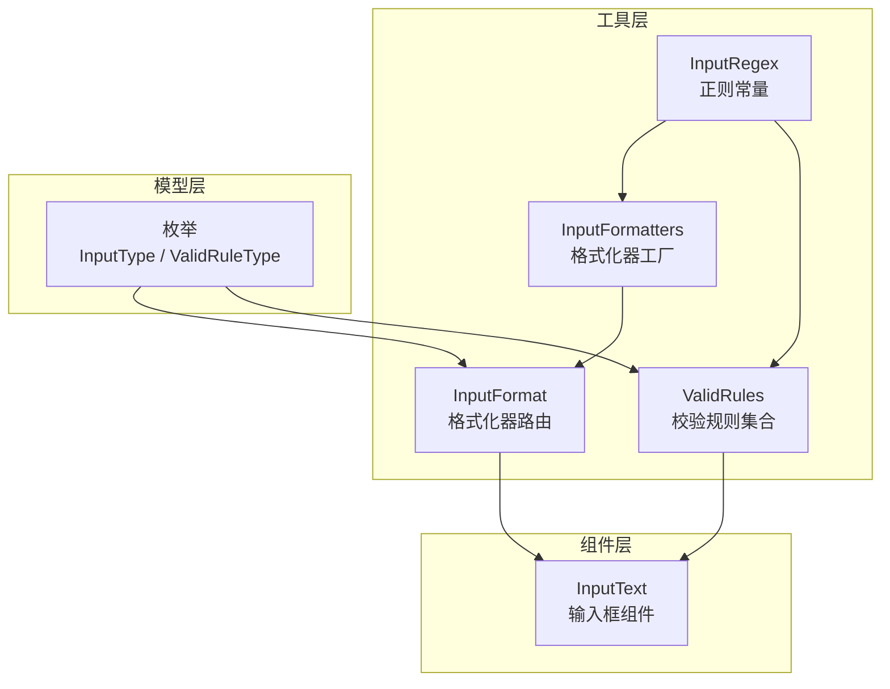
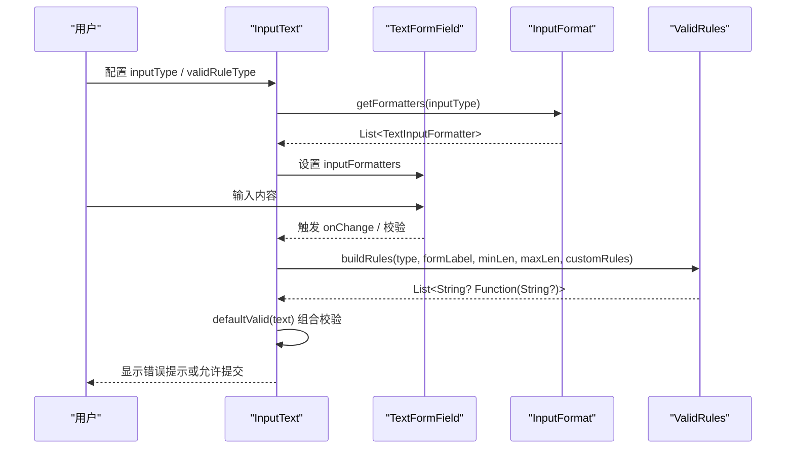
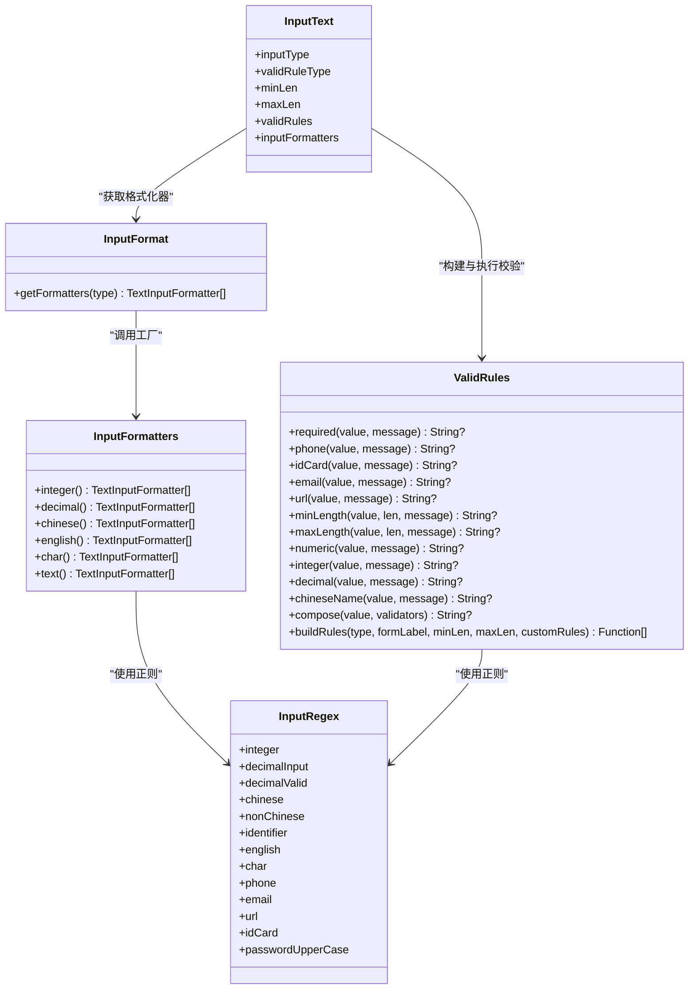

# 工具类 API

<cite>
**本文引用的文件**   
- [lib/src/utils/input_regex.dart](file://lib/src/utils/input_regex.dart)
- [lib/src/input_text/utils/input_format.dart](file://lib/src/input_text/utils/input_format.dart)
- [lib/src/input_text/utils/valid_rules.dart](file://lib/src/input_text/utils/valid_rules.dart)
- [lib/src/input_text/models/enum.dart](file://lib/src/input_text/models/enum.dart)
- [lib/src/input_text/input_text.dart](file://lib/src/input_text/input_text.dart)
- [example/lib/pages/component_demo.dart](file://example/lib/pages/component_demo.dart)
</cite>

## 目录
1. [简介](#简介)
2. [项目结构](#项目结构)
3. [核心组件](#核心组件)
4. [架构总览](#架构总览)
5. [详细组件分析](#详细组件分析)
6. [依赖关系分析](#依赖关系分析)
7. [性能与优化建议](#性能与优化建议)
8. [故障排查指南](#故障排查指南)
9. [结论](#结论)
10. [附录：函数签名与使用示例索引](#附录函数签名与使用示例索引)

## 简介
本文件为 Lite UI 输入相关工具类的 API 文档，覆盖以下能力：
- 输入正则表达式常量（InputRegex）
- 输入格式化器工厂与路由（InputFormatters、InputFormat）
- 校验规则集合与组合（ValidRules）
- 与 InputText 组件的集成方式、常见用法模式与扩展方法

目标读者包括需要实现表单输入限制、格式化处理与统一校验的前端开发者。

## 项目结构
Lite UI 将输入相关的工具按职责拆分到独立模块：
- 正则表达式常量集中在 utils/input_regex.dart
- 输入格式化器在 input_text/utils/input_format.dart，提供工厂方法与枚举路由
- 校验规则在 input_text/utils/valid_rules.dart，提供常用校验与规则构建器
- 枚举定义在 input_text/models/enum.dart，包含输入类型与校验规则类型
- InputText 组件在 input_text/input_text.dart，整合上述工具完成输入拦截与校验

图表来源
- [lib/src/utils/input_regex.dart:1-46](file://lib/src/utils/input_regex.dart#L1-L46)
- [lib/src/input_text/utils/input_format.dart:1-88](file://lib/src/input_text/utils/input_format.dart#L1-L88)
- [lib/src/input_text/utils/valid_rules.dart:1-245](file://lib/src/input_text/utils/valid_rules.dart#L1-L245)
- [lib/src/input_text/models/enum.dart:1-82](file://lib/src/input_text/models/enum.dart#L1-L82)
- [lib/src/input_text/input_text.dart:1-365](file://lib/src/input_text/input_text.dart#L1-L365)

章节来源
- [lib/lite_ui.dart:1-19](file://lib/lite_ui.dart#L1-L19)

## 核心组件
本节概述三大工具类的职责与对外暴露的静态方法。

- InputRegex：集中管理输入场景的正则表达式常量，如整数、小数、中文、英文、手机号、邮箱、URL、身份证号、密码大写字母等。
- InputFormatters：提供 TextInputFormatter 列表的工厂方法，用于实时拦截非法字符，支持整数、小数、中文、英文、单字符、普通文本等。
- InputFormat：根据 InputType 枚举返回对应的格式化器列表，简化 InputText 的配置。
- ValidRules：提供常用校验方法（必填、手机号、身份证、邮箱、URL、长度、数字、整数、小数、中文姓名、密码），以及 compose 组合校验和 buildRules 规则构建器。

章节来源
- [lib/src/utils/input_regex.dart:1-46](file://lib/src/utils/input_regex.dart#L1-L46)
- [lib/src/input_text/utils/input_format.dart:1-88](file://lib/src/input_text/utils/input_format.dart#L1-L88)
- [lib/src/input_text/utils/valid_rules.dart:1-245](file://lib/src/input_text/utils/valid_rules.dart#L1-L245)

## 架构总览
InputText 组件通过 InputFormat.getFormatters 获取输入格式化器，并在 TextFormField 中应用；同时通过 ValidRules.buildRules 生成校验规则列表，由 FormField.validator 执行校验。

图表来源
- [lib/src/input_text/input_text.dart:196-217](file://lib/src/input_text/input_text.dart#L196-L217)
- [lib/src/input_text/utils/input_format.dart:67-87](file://lib/src/input_text/utils/input_format.dart#L67-L87)
- [lib/src/input_text/utils/valid_rules.dart:191-243](file://lib/src/input_text/utils/valid_rules.dart#L191-L243)

## 详细组件分析

### InputRegex 正则表达式常量
- 作用：集中维护输入场景的正则表达式，避免散落在各处导致不一致。
- 主要常量：
  - integer：仅数字 0-9
  - decimalInput：数字和小数点（用于输入格式化器）
  - decimalValid：有效小数格式（用于校验）
  - chinese：中文字符集
  - nonChinese：非中文字符集
  - identifier：标识符（字母或下划线开头，后续字母数字下划线）
  - english：英文字母
  - char：ASCII 范围单字符
  - phone：中国大陆手机号
  - email：邮箱（改进版）
  - url：URL
  - idCard：身份证号（18位，末位X/x）
  - passwordUpperCase：密码需包含大写字母

使用要点：
- 输入阶段优先使用 decimalInput 进行快速过滤，避免非法字符进入。
- 校验阶段使用 decimalValid 确保最终值合法。
- 复杂规则（如邮箱、URL）建议使用已封装的正则，减少重复维护成本。

章节来源
- [lib/src/utils/input_regex.dart:1-46](file://lib/src/utils/input_regex.dart#L1-L46)

### InputFormatters 输入格式化器工厂
- 作用：为不同输入类型提供 TextInputFormatter 列表，用于实时拦截非法字符。
- 主要方法：
  - integer()：只允许数字
  - decimal()：只允许数字与一个小数点
  - chinese()：只允许中文字符
  - english()：只允许英文字母
  - char()：只允许 ASCII 单字符
  - text()：不限制（空列表）

使用要点：
- 小数格式化器内部会检查是否包含多个小数点，并拒绝非法输入。
- 可与自定义 formatter 组合，满足更复杂的输入限制。

章节来源
- [lib/src/input_text/utils/input_format.dart:10-62](file://lib/src/input_text/utils/input_format.dart#L10-L62)

### InputFormat 输入格式化器路由
- 作用：根据 InputType 枚举返回对应的格式化器列表，简化 InputText 配置。
- 主要方法：
  - getFormatters(InputType type)：返回对应类型的格式化器列表

使用要点：
- 与 InputText.inputType 配合使用，自动选择输入限制策略。
- 可叠加自定义 inputFormatters，优先级高于默认格式化器。

章节来源
- [lib/src/input_text/utils/input_format.dart:64-87](file://lib/src/input_text/utils/input_format.dart#L64-L87)

### ValidRules 校验规则集合
- 作用：提供常用校验方法与规则构建器，统一错误提示与校验逻辑。
- 主要方法：
  - required(value, {message})：必填校验
  - phone(value, {message})：手机号校验
  - idCard(value, {message})：身份证号校验（含校验码验证）
  - email(value, {message})：邮箱校验
  - url(value, {message})：URL校验
  - minLength(value, minLength, {message})：最小长度
  - maxLength(value, maxLength, {message})：最大长度
  - numeric(value, {message})：纯数字
  - integer(value, {message})：整数（支持负数）
  - decimal(value, {message})：有效小数（不允许非法格式）
  - chineseName(value, {message})：中文姓名（2-20个中文字符）
  - compose(value, validators)：组合校验，依次执行，返回第一个错误
  - buildRules({type, formLabel, minLen, maxLen, customRules})：根据枚举与参数自动生成规则列表

使用要点：
- 对于复杂业务规则，可使用 customRules 传入自定义校验函数。
- minLengthRule/maxLengthRule 工厂方法可直接放入 validRules 列表。
- 密码规则内置“至少6位 + 必须包含大写字母”。

章节来源
- [lib/src/input_text/utils/valid_rules.dart:1-245](file://lib/src/input_text/utils/valid_rules.dart#L1-L245)

### InputText 组件与工具集成
- 输入限制：通过 inputType 调用 InputFormat.getFormatters 获取格式化器，应用到 TextFormField.inputFormatters。
- 校验流程：当 required=true 或 validRuleType!=custom 时启用校验；defaultValid 组合 required、buildRules 生成的规则与自定义 validator，最后通过 ValidRules.compose 执行。
- 回调与状态：onChange、onSaved、validator、autoValidate 等参数控制交互行为。

章节来源
- [lib/src/input_text/input_text.dart:166-217](file://lib/src/input_text/input_text.dart#L166-L217)
- [lib/src/input_text/input_text.dart:236-352](file://lib/src/input_text/input_text.dart#L236-L352)

## 依赖关系分析
- InputFormatters 依赖 InputRegex 中的 decimalInput、chinese、english、char 等正则。
- InputFormat 依赖 InputFormatters 与各 InputType 枚举。
- ValidRules 依赖 InputRegex 中的 phone、email、url、idCard、passwordUpperCase 等正则。
- InputText 依赖 InputFormat 与 ValidRules，形成“输入限制 + 校验”的闭环。

图表来源
- [lib/src/utils/input_regex.dart:1-46](file://lib/src/utils/input_regex.dart#L1-L46)
- [lib/src/input_text/utils/input_format.dart:1-88](file://lib/src/input_text/utils/input_format.dart#L1-L88)
- [lib/src/input_text/utils/valid_rules.dart:1-245](file://lib/src/input_text/utils/valid_rules.dart#L1-L245)
- [lib/src/input_text/input_text.dart:1-365](file://lib/src/input_text/input_text.dart#L1-L365)

章节来源
- [lib/src/input_text/models/enum.dart:1-82](file://lib/src/input_text/models/enum.dart#L1-L82)

## 性能与优化建议
- 正则复用：InputRegex 中的 RegExp 均为 static final，避免重复编译，提升匹配性能。
- 输入阶段过滤优先：使用 InputFormatters.decimal 等轻量过滤，减少无效数据进入校验阶段。
- 校验短路：ValidRules.compose 遇到首个错误即返回，避免不必要的后续校验。
- 规则按需构建：buildRules 仅在需要时生成规则列表，减少内存分配。
- 自定义规则精简：尽量使用已有规则组合，避免过多自定义校验函数造成渲染抖动。

[本节为通用指导，无需具体文件引用]

## 故障排查指南
- 小数输入异常：确认使用的是 decimalInput 进行输入过滤，decimalValid 进行最终校验；避免多小数点或空小数点。
- 手机号校验失败：检查是否为中国大陆 11 位且符合号段规则；必要时调整键盘类型为 TextInputType.phone。
- 邮箱/URL 校验失败：确认字符串无多余空格或不可见字符；trim 后再校验。
- 身份证校验失败：注意末位 X/x 的大小写处理；校验码算法基于加权因子计算。
- 密码校验失败：确保包含大写字母且长度满足要求。
- 自定义规则未生效：确保 validRuleType=custom 且传入 validRules 列表；compose 顺序决定错误提示优先级。

章节来源
- [lib/src/input_text/utils/input_format.dart:18-41](file://lib/src/input_text/utils/input_format.dart#L18-L41)
- [lib/src/input_text/utils/valid_rules.dart:143-157](file://lib/src/input_text/utils/valid_rules.dart#L143-L157)
- [lib/src/input_text/utils/valid_rules.dart:31-51](file://lib/src/input_text/utils/valid_rules.dart#L31-L51)

## 结论
Lite UI 的工具类围绕“输入限制 + 校验”的核心目标，提供了清晰的分层与统一的接口：
- InputRegex 统一管理正则，保证一致性
- InputFormatters/InputFormat 提供输入阶段的实时拦截
- ValidRules 提供丰富的校验方法与灵活的规则构建
- InputText 组件无缝集成，降低使用复杂度

通过合理组合这些工具，可以快速实现健壮、易用的表单输入体验。

[本节为总结性内容，无需具体文件引用]

## 附录：函数签名与使用示例索引

### InputRegex 常量
- integer：整数正则
- decimalInput：输入阶段的小数正则
- decimalValid：校验阶段的小数正则
- chinese/nonChinese：中英文字符集
- identifier：标识符
- english/char：英文与 ASCII 单字符
- phone/email/url/idCard/passwordUpperCase：常见格式与密码规则

章节来源
- [lib/src/utils/input_regex.dart:1-46](file://lib/src/utils/input_regex.dart#L1-L46)

### InputFormatters 工厂方法
- integer()：只允许数字
- decimal()：只允许数字与一个小数点
- chinese()：只允许中文
- english()：只允许英文
- char()：只允许 ASCII 单字符
- text()：不限制

章节来源
- [lib/src/input_text/utils/input_format.dart:10-62](file://lib/src/input_text/utils/input_format.dart#L10-L62)

### InputFormat 路由方法
- getFormatters(InputType type)：返回对应格式化器列表

章节来源
- [lib/src/input_text/utils/input_format.dart:64-87](file://lib/src/input_text/utils/input_format.dart#L64-L87)

### ValidRules 校验方法
- required(value, {message})
- phone(value, {message})
- idCard(value, {message})
- email(value, {message})
- url(value, {message})
- minLength(value, minLength, {message})
- maxLength(value, maxLength, {message})
- numeric(value, {message})
- integer(value, {message})
- decimal(value, {message})
- chineseName(value, {message})
- compose(value, validators)
- buildRules({type, formLabel, minLen, maxLen, customRules})

章节来源
- [lib/src/input_text/utils/valid_rules.dart:1-245](file://lib/src/input_text/utils/valid_rules.dart#L1-L245)

### 使用示例索引（来自演示页面）
- 基础校验与输入类型限制：component_demo.dart
- 手机号、邮箱、密码等格式校验：component_demo.dart

章节来源
- [example/lib/pages/component_demo.dart:187-285](file://example/lib/pages/component_demo.dart#L187-L285)