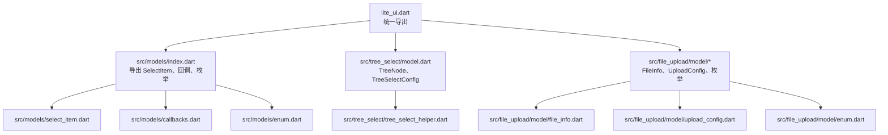
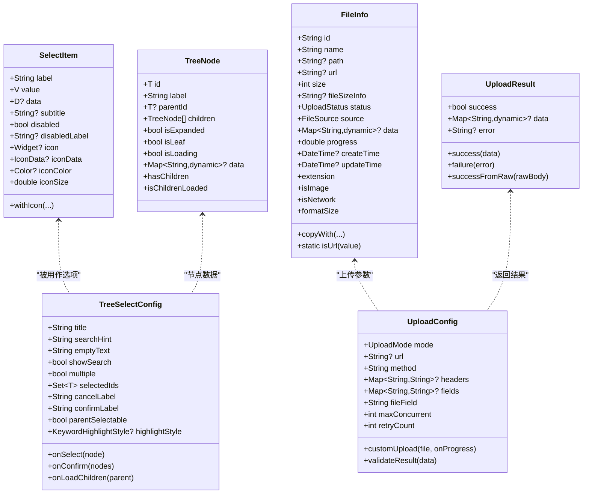
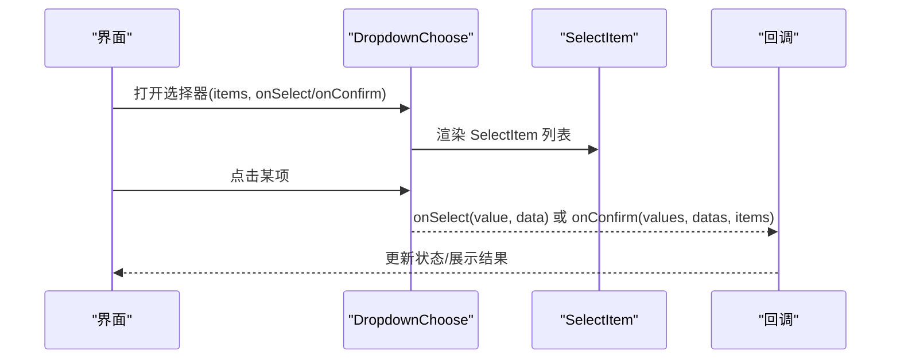
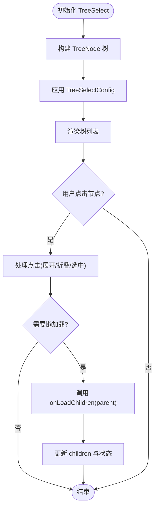
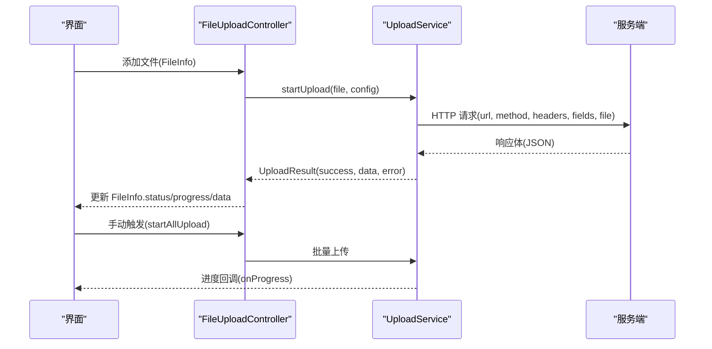
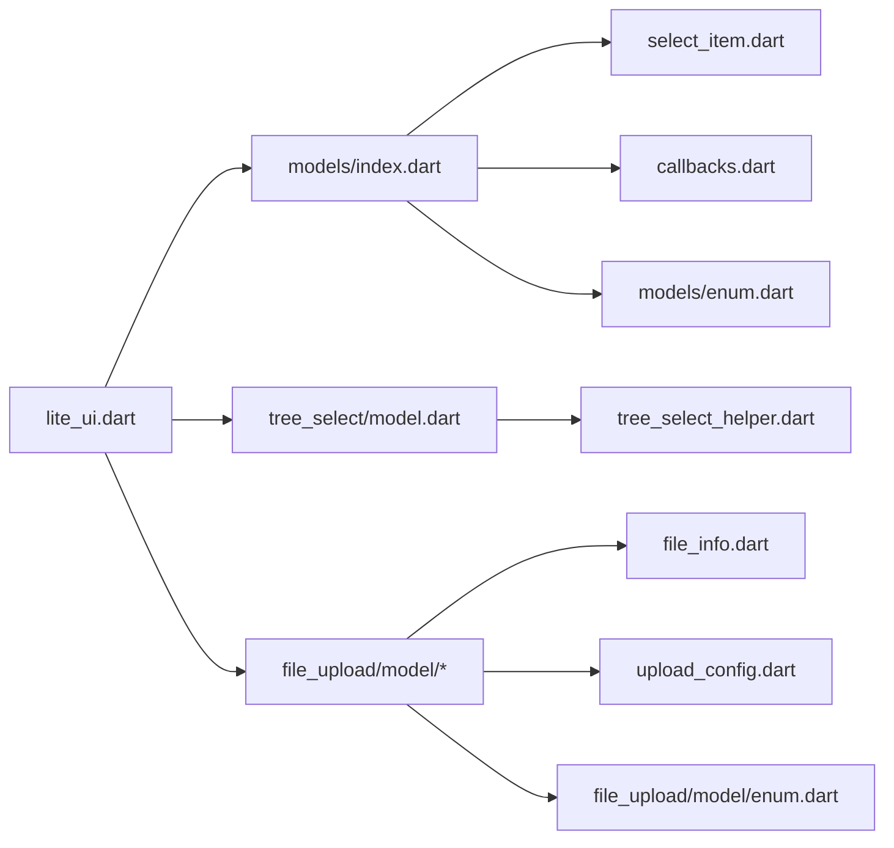

# 数据模型 API

<cite>
**本文引用的文件**   
- [lite_ui.dart](file://lib/lite_ui.dart)
- [models/index.dart](file://lib/src/models/index.dart)
- [select_item.dart](file://lib/src/models/select_item.dart)
- [callbacks.dart](file://lib/src/models/callbacks.dart)
- [enum.dart](file://lib/src/models/enum.dart)
- [model.dart](file://lib/src/tree_select/model.dart)
- [tree_select_helper.dart](file://lib/src/tree_select/tree_select_helper.dart)
- [file_info.dart](file://lib/src/file_upload/model/file_info.dart)
- [upload_config.dart](file://lib/src/file_upload/model/upload_config.dart)
- [enum.dart](file://lib/src/file_upload/model/enum.dart)
- [select_modal_demo.dart](file://example/lib/pages/select_modal_demo.dart)
- [action_sheet_mock_data.dart](file://example/lib/mock/action_sheet_mock_data.dart)
</cite>

## 目录
1. [简介](#简介)
2. [项目结构](#项目结构)
3. [核心数据模型](#核心数据模型)
4. [架构总览](#架构总览)
5. [详细组件分析](#详细组件分析)
6. [依赖关系分析](#依赖关系分析)
7. [性能与序列化建议](#性能与序列化建议)
8. [故障排查指南](#故障排查指南)
9. [结论](#结论)
10. [附录：示例与最佳实践](#附录示例与最佳实践)

## 简介
本文件为 Lite UI 的数据模型提供完整的 API 参考，覆盖 FileInfo、SelectItem、TreeNode 等核心数据结构，说明字段定义、数据类型、约束条件、模型间关系与继承结构、序列化机制，以及实例化、属性访问、方法调用的使用方式。同时给出数据验证、转换与持久化的最佳实践，并展示与后端 API 的数据映射和类型安全的处理方式。

## 项目结构
Lite UI 通过统一入口导出各模块的公共接口，其中数据模型集中在 models 与 tree_select、file_upload 子模块中。顶层 lite_ui.dart 负责集中导出，便于外部引用。

图表来源
- [lite_ui.dart:1-19](file://lib/lite_ui.dart#L1-L19)
- [models/index.dart:1-4](file://lib/src/models/index.dart#L1-L4)
- [model.dart:1-123](file://lib/src/tree_select/model.dart#L1-L123)
- [file_info.dart:1-140](file://lib/src/file_upload/model/file_info.dart#L1-L140)
- [upload_config.dart:1-139](file://lib/src/file_upload/model/upload_config.dart#L1-L139)
- [enum.dart:1-105](file://lib/src/file_upload/model/enum.dart#L1-L105)

章节来源
- [lite_ui.dart:1-19](file://lib/lite_ui.dart#L1-L19)
- [models/index.dart:1-4](file://lib/src/models/index.dart#L1-L4)

## 核心数据模型
本节对三大核心数据模型进行系统化说明：SelectItem、TreeNode、FileInfo。每个模型包含字段定义、类型、约束、常用方法与使用要点。

### SelectItem（备选数据项）
- 用途：用于下拉选择、操作面板等场景的统一数据项载体，支持泛型 value 与 data。
- 关键特性：
  - 泛型 V：value 的类型，作为选中状态标识；若为自定义对象需实现相等性比较。
  - 泛型 D：data 可选，承载原始业务数据。
  - 支持图标显示与禁用状态。
- 字段与约束：
  - label: 必填，显示文本
  - value: 必填，提交值
  - data: 可选，完整原始数据
  - subtitle: 可选，副标题
  - disabled: 默认 false，是否禁用
  - disabledLabel: 可选，禁用标签
  - icon/iconData/iconColor/iconSize: 图标相关，icon 与 iconData 互斥
- 构造器与工厂：
  - 构造函数：提供全部字段
  - withIcon：便捷创建带图标的项
- 典型用法：
  - 单选/多选列表项
  - 分组菜单项
  - 远程搜索返回项

章节来源
- [select_item.dart:1-78](file://lib/src/models/select_item.dart#L1-L78)
- [callbacks.dart:1-13](file://lib/src/models/callbacks.dart#L1-L13)
- [action_sheet_mock_data.dart:22-82](file://example/lib/mock/action_sheet_mock_data.dart#L22-L82)
- [select_modal_demo.dart:1-200](file://example/lib/pages/select_modal_demo.dart#L1-L200)

### TreeNode（树形节点）
- 用途：TreeSelect 组件的节点数据模型，纯数据结构，不包含 UI 逻辑。
- 泛型 T：节点 ID 类型，默认 String，可替换为 int 等。
- 字段与约束：
  - id: 必填，唯一标识
  - label: 必填，名称
  - parentId: 可选，父节点 ID
  - children: 子节点列表
  - isExpanded: 展开状态（UI 状态）
  - isLeaf: 是否为叶子节点
  - isLoading: 懒加载时是否加载中
  - data: 附加数据 Map
- 计算属性：
  - hasChildren：存在已加载或待加载的子节点
  - isChildrenLoaded：所有后代已加载
- 典型用法：
  - 构建静态树
  - 懒加载子节点
  - 单选/多选联动

章节来源
- [model.dart:1-123](file://lib/src/tree_select/model.dart#L1-L123)
- [tree_select_helper.dart:96-118](file://lib/src/tree_select/tree_select_helper.dart#L96-L118)

### FileInfo（文件信息）
- 用途：统一管理文件生命周期数据，包括本地路径、网络地址、大小、状态、进度等。
- 字段与约束：
  - id: 雪花算法生成，永远不为空
  - name: 文件名
  - path: 本地路径，可为 null（编辑模式已有文件时无需本地路径）
  - url: 网络访问地址（http(s)），上传成功或回显
  - size: 字节数
  - fileSizeInfo: 可选格式化大小，不传则自动计算
  - status: 上传状态（pending/uploading/success/failed）
  - source: 文件来源（file/image/camera/all/network 等）
  - data: 扩展数据（服务端响应体）
  - progress: 上传进度 0.0~1.0
  - createTime/updateTime: 时间戳
- 重要方法：
  - copyWith：局部更新副本
  - extension：获取扩展名
  - isImage：判断图片类型
  - isNetwork：判断网络文件
  - formatSize：格式化文件大小
  - isUrl：静态方法判断 URL
- 自动推断：
  - 当 url 存在且为 http(s) 开头时，自动设置 status=success、source=network

章节来源
- [file_info.dart:1-140](file://lib/src/file_upload/model/file_info.dart#L1-L140)
- [enum.dart:1-105](file://lib/src/file_upload/model/enum.dart#L1-L105)

### UploadConfig 与 UploadResult（上传配置与结果）
- UploadConfig：
  - mode：上传模式（auto/manual/custom）
  - url：接口地址（auto/manual 必填）
  - method：HTTP 方法，默认 POST
  - headers：请求头
  - fields：额外表单字段
  - fileField：文件字段名，默认 "file"
  - maxConcurrent：最大并发
  - retryCount：失败重试次数
  - customUpload：自定义上传函数（custom 模式必填）
  - validateResult：业务成功校验
- UploadResult：
  - success：是否成功
  - data：已解析 JSON Map
  - error：错误信息
  - successFromRaw：从原始字符串解析为成功结果

章节来源
- [upload_config.dart:1-139](file://lib/src/file_upload/model/upload_config.dart#L1-L139)

## 架构总览
下图展示了数据模型在 Lite UI 中的组织与依赖关系，以及它们在组件中的使用位置。

图表来源
- [select_item.dart:1-78](file://lib/src/models/select_item.dart#L1-L78)
- [model.dart:1-123](file://lib/src/tree_select/model.dart#L1-L123)
- [file_info.dart:1-140](file://lib/src/file_upload/model/file_info.dart#L1-L140)
- [upload_config.dart:1-139](file://lib/src/file_upload/model/upload_config.dart#L1-L139)

## 详细组件分析

### SelectItem 使用与回调
- 单选回调 OnSelectChange<V,D>：返回选中的 value 与 data
- 多选确认回调 OnMultiSelectConfirm<V,D>：返回 values、datas 与完整 items
- 远程搜索回调 RemoteSearchCallback<V,D>：根据关键字异步返回 SelectItem 列表

图表来源
- [select_modal_demo.dart:1-200](file://example/lib/pages/select_modal_demo.dart#L1-L200)
- [callbacks.dart:1-13](file://lib/src/models/callbacks.dart#L1-L13)
- [select_item.dart:1-78](file://lib/src/models/select_item.dart#L1-L78)

章节来源
- [select_modal_demo.dart:1-200](file://example/lib/pages/select_modal_demo.dart#L1-L200)
- [callbacks.dart:1-13](file://lib/src/models/callbacks.dart#L1-L13)

### TreeNode 与 TreeSelectConfig
- TreeNode 提供节点结构与懒加载能力，配合 TreeSelectConfig 完成单选/多选、搜索、高亮等交互。
- TreeSelectConfig 控制行为：title、searchHint、emptyText、showSearch、multiple、selectedIds、parentSelectable、highlightStyle 等。

图表来源
- [model.dart:1-123](file://lib/src/tree_select/model.dart#L1-L123)
- [tree_select_helper.dart:96-118](file://lib/src/tree_select/tree_select_helper.dart#L96-L118)

章节来源
- [model.dart:1-123](file://lib/src/tree_select/model.dart#L1-L123)
- [tree_select_helper.dart:96-118](file://lib/src/tree_select/tree_select_helper.dart#L96-L118)

### FileInfo 与 UploadConfig 工作流
- FileInfo 管理文件生命周期，UploadConfig 配置上传行为，UploadResult 表示上传结果。
- 内置上传模式：auto/manual，自定义上传模式：custom。

图表来源
- [file_info.dart:1-140](file://lib/src/file_upload/model/file_info.dart#L1-L140)
- [upload_config.dart:1-139](file://lib/src/file_upload/model/upload_config.dart#L1-L139)
- [enum.dart:1-105](file://lib/src/file_upload/model/enum.dart#L1-L105)

章节来源
- [file_info.dart:1-140](file://lib/src/file_upload/model/file_info.dart#L1-L140)
- [upload_config.dart:1-139](file://lib/src/file_upload/model/upload_config.dart#L1-L139)

## 依赖关系分析
- lite_ui.dart 作为统一出口，导出 models、tree_select、file_upload 等模块，降低耦合。
- SelectItem 被多个组件复用（ActionSheet、DropdownChoose、DialogAction）。
- TreeNode 与 TreeSelectConfig 共同支撑 TreeSelect 组件。
- FileInfo 与 UploadConfig/UploadResult 构成上传子系统的数据契约。

图表来源
- [lite_ui.dart:1-19](file://lib/lite_ui.dart#L1-L19)
- [models/index.dart:1-4](file://lib/src/models/index.dart#L1-L4)
- [model.dart:1-123](file://lib/src/tree_select/model.dart#L1-L123)
- [file_info.dart:1-140](file://lib/src/file_upload/model/file_info.dart#L1-L140)
- [upload_config.dart:1-139](file://lib/src/file_upload/model/upload_config.dart#L1-L139)
- [enum.dart:1-105](file://lib/src/file_upload/model/enum.dart#L1-L105)

章节来源
- [lite_ui.dart:1-19](file://lib/lite_ui.dart#L1-L19)

## 性能与序列化建议
- SelectItem：
  - 若 value 为复杂对象，务必实现相等性与哈希，避免重复计算与内存泄漏。
  - 大量选项时建议使用分页或虚拟滚动，减少渲染开销。
- TreeNode：
  - 懒加载按需加载子节点，避免一次性构建大树的性能问题。
  - 使用 Set<T> 存储 selectedIds，提升查找效率。
- FileInfo：
  - 使用 copyWith 进行不可变更新，避免不必要的重建。
  - 大文件上传时合理设置 maxConcurrent 与 retryCount，平衡吞吐与稳定性。
- 序列化：
  - FileInfo.data 可直接保存服务端响应 JSON Map，便于后续扩展。
  - UploadResult.successFromRaw 将原始响应解析为 Map，便于业务层校验。

[本节为通用指导，不直接分析具体文件]

## 故障排查指南
- SelectItem：
  - 禁用项无法选中：检查 disabled 与 disabledLabel 配置。
  - 图标未显示：确保 icon 与 iconData 仅设置其一。
- TreeNode：
  - 节点无子节点但显示展开：检查 isLeaf 与 children 为空时的懒加载逻辑。
  - 多选联动异常：确认 parentSelectable 与 selectedIds 初始值。
- FileInfo：
  - 状态未更新：检查 uploadConfig.mode 与 validateResult 返回值。
  - 进度不更新：确认 onProgress 回调是否正确上报 0.0~1.0。
- UploadConfig：
  - 上传失败：检查 url、method、headers、fields 与 validateResult 逻辑。
  - 自定义上传：确保 customUpload 返回 UploadResult 并正确设置 success/data/error。

章节来源
- [select_item.dart:1-78](file://lib/src/models/select_item.dart#L1-L78)
- [model.dart:1-123](file://lib/src/tree_select/model.dart#L1-L123)
- [file_info.dart:1-140](file://lib/src/file_upload/model/file_info.dart#L1-L140)
- [upload_config.dart:1-139](file://lib/src/file_upload/model/upload_config.dart#L1-L139)

## 结论
Lite UI 的数据模型以 SelectItem、TreeNode、FileInfo 为核心，分别支撑选择类组件、树形选择与文件上传功能。通过清晰的字段定义、严格的类型约束与完善的回调机制，实现了类型安全与可扩展性。结合 UploadConfig 与 UploadResult，上传流程具备高内聚与低耦合的特点。遵循本文的最佳实践，可在实际项目中高效、稳定地集成与扩展这些模型。

[本节为总结，不直接分析具体文件]

## 附录：示例与最佳实践
- SelectItem 示例：
  - 基础项：label/value
  - 带图标：withIcon(iconData, iconColor)
  - 禁用项：disabled=true, disabledLabel="不可用"
  - 分组菜单：ActionSheetSection(items: [...])
- TreeNode 示例：
  - 静态树：children 预置
  - 懒加载：onLoadChildren(parent) 返回子节点
  - 多选联动：parentSelectable=true, selectedIds=Set
- FileInfo 示例：
  - 本地文件：path 非空，status=pending
  - 网络回显：url=http(s)，自动推断 status=success/source=network
  - 上传进度：progress 0.0~1.0，status=uploading
- 与后端 API 映射：
  - SelectItem.value 对应后端提交值，SelectItem.data 携带原始数据
  - FileInfo.data 保存服务端响应 JSON Map，便于后续处理
  - UploadResult.data 为已解析 JSON，validateResult 进行业务校验

章节来源
- [action_sheet_mock_data.dart:22-82](file://example/lib/mock/action_sheet_mock_data.dart#L22-L82)
- [select_modal_demo.dart:1-200](file://example/lib/pages/select_modal_demo.dart#L1-L200)
- [model.dart:1-123](file://lib/src/tree_select/model.dart#L1-L123)
- [file_info.dart:1-140](file://lib/src/file_upload/model/file_info.dart#L1-L140)
- [upload_config.dart:1-139](file://lib/src/file_upload/model/upload_config.dart#L1-L139)