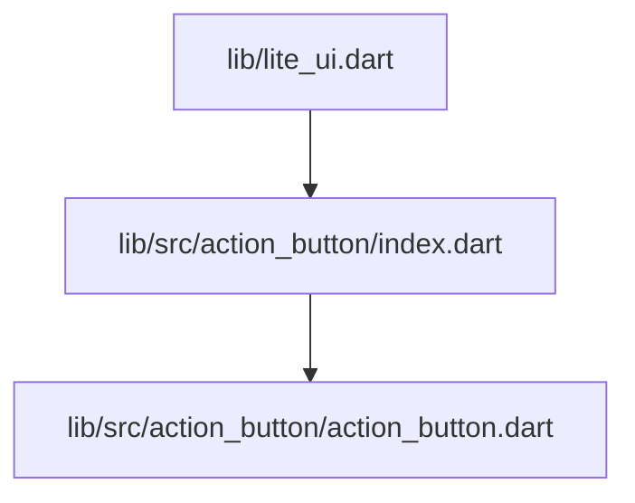
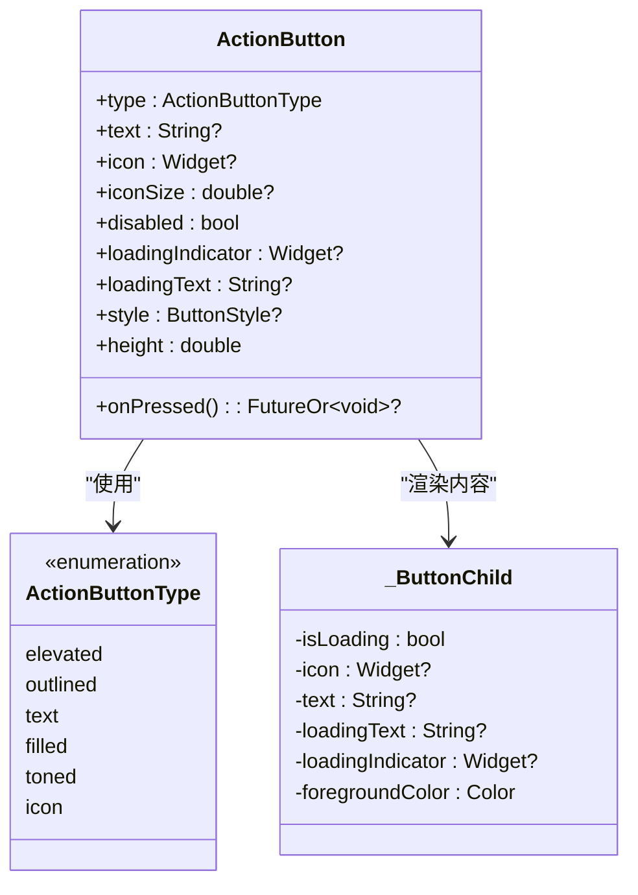
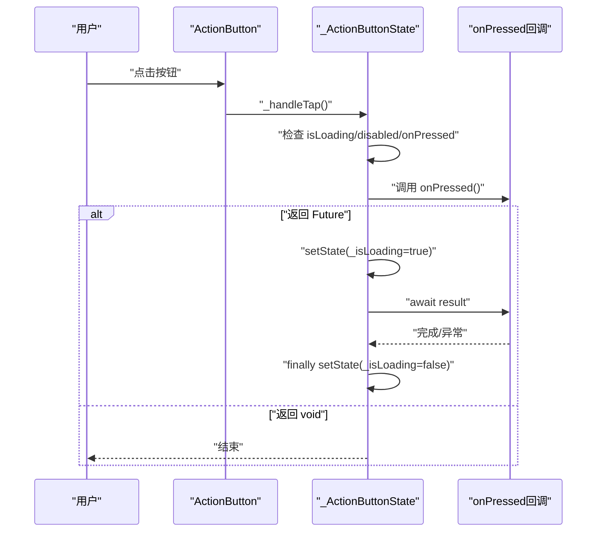
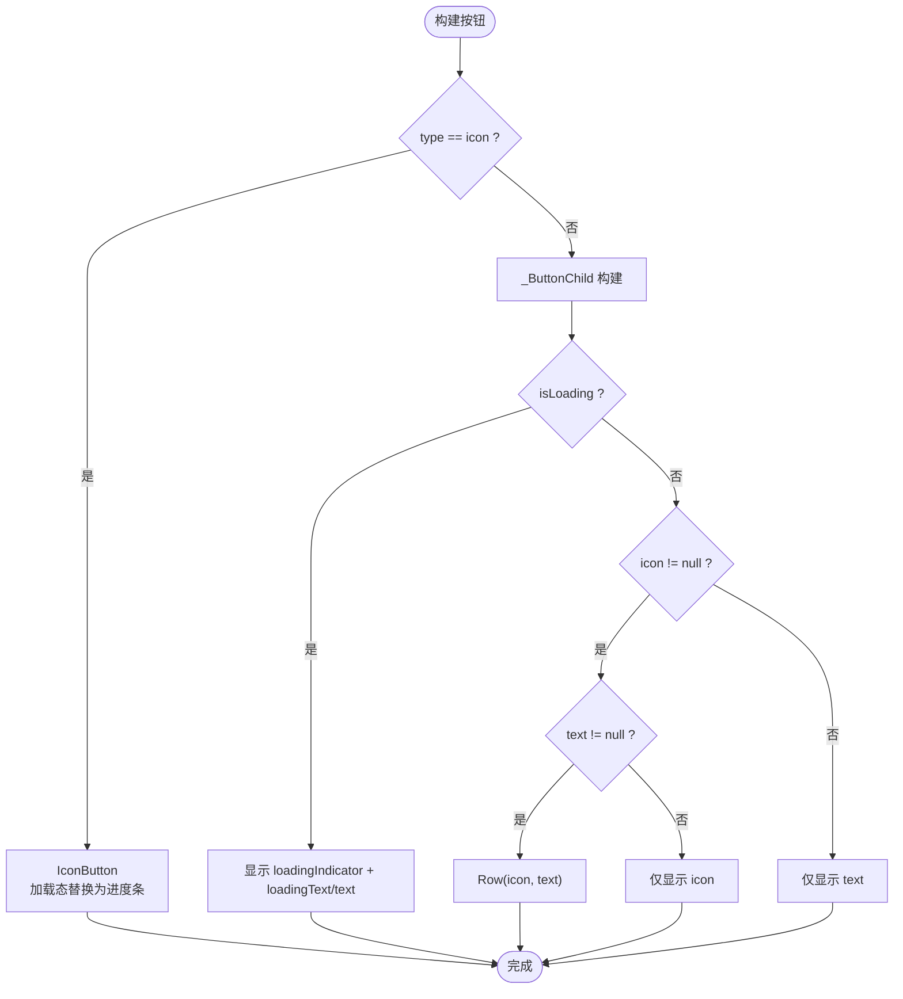
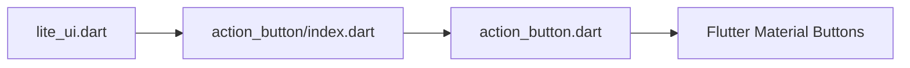

# ActionButton API

<cite>
**本文引用的文件**   
- [action_button.dart](file://lib/src/action_button/action_button.dart)
- [index.dart](file://lib/src/action_button/index.dart)
- [lite_ui.dart](file://lib/lite_ui.dart)
</cite>

## 目录
1. [简介](#简介)
2. [项目结构](#项目结构)
3. [核心组件](#核心组件)
4. [架构总览](#架构总览)
5. [详细组件分析](#详细组件分析)
6. [依赖分析](#依赖分析)
7. [性能考虑](#性能考虑)
8. [故障排查指南](#故障排查指南)
9. [结论](#结论)
10. [附录](#附录)

## 简介
ActionButton 是一个基于 Flutter 原生按钮的二次封装组件，统一了多种按钮风格与交互行为。通过 type 属性即可切换不同样式（elevated、outlined、text、filled、toned、icon），并内置同步/异步点击处理与加载状态管理，支持图标前缀、自定义样式与高度控制，适用于大多数业务场景中的操作入口。

## 项目结构
ActionButton 的实现位于 lib/src/action_button 目录下，并通过 index.dart 导出，最终由库根 lite_ui.dart 统一暴露给外部使用。

图表来源 
- [lite_ui.dart:1-19](file://lib/lite_ui.dart#L1-L19)
- [index.dart:1-2](file://lib/src/action_button/index.dart#L1-L2)
- [action_button.dart:1-208](file://lib/src/action_button/action_button.dart#L1-L208)

章节来源
- [lite_ui.dart:1-19](file://lib/lite_ui.dart#L1-L19)
- [index.dart:1-2](file://lib/src/action_button/index.dart#L1-L2)
- [action_button.dart:1-208](file://lib/src/action_button/action_button.dart#L1-L208)

## 核心组件
- ActionButtonType：按钮类型枚举，映射到 Flutter 标准按钮类型。
- ActionButton：受控的状态组件，负责渲染不同样式的按钮、处理点击回调与加载状态、组合图标与文字内容。
- _ButtonChild：内部子组件，根据加载状态、图标与文字组合显示内容。

章节来源
- [action_button.dart:4-23](file://lib/src/action_button/action_button.dart#L4-L23)
- [action_button.dart:43-94](file://lib/src/action_button/action_button.dart#L43-L94)
- [action_button.dart:177-208](file://lib/src/action_button/action_button.dart#L177-L208)

## 架构总览
ActionButton 通过 switch(type) 选择底层按钮实现，并在点击时自动识别 onPressed 返回类型以决定是否进入加载态。非 icon 类型默认在文字左侧展示图标；icon 类型则以图标为唯一内容。

图表来源 
- [action_button.dart:4-23](file://lib/src/action_button/action_button.dart#L4-L23)
- [action_button.dart:43-94](file://lib/src/action_button/action_button.dart#L43-L94)
- [action_button.dart:177-208](file://lib/src/action_button/action_button.dart#L177-L208)

## 详细组件分析

### 按钮类型枚举（ActionButtonType）
- elevated：凸起填充按钮（ElevatedButton），带背景色与阴影，适合主操作。
- outlined：描边按钮（OutlinedButton），无背景色有边框，适合次要操作。
- text：文字按钮（TextButton），无背景无边框，适合轻量操作。
- filled：填充按钮（FilledButton），Material 3 风格，无阴影，适合强调但不突出。
- toned：色调填充按钮（FilledButton.tonal），比 filled 更柔和。
- icon：图标按钮（IconButton），仅显示图标，适合工具栏或紧凑布局。

章节来源
- [action_button.dart:4-23](file://lib/src/action_button/action_button.dart#L4-L23)

### 构造函数参数说明
- type：按钮类型，默认 elevated。
- text：按钮文字；当 type=icon 时忽略。
- icon：图标；非 icon 类型时显示在文字左侧，icon 类型时为唯一内容。
- iconSize：图标尺寸；仅在 type=icon 时生效，透传给 IconButton.iconSize。
- onPressed：点击回调；支持同步函数（直接执行）与异步函数（自动显示 loading）。
- disabled：是否禁用，默认 false。
- loadingIndicator：自定义加载指示器；覆盖默认的 CircularProgressIndicator。
- loadingText：加载中显示的文字；为 null 时保持原文字 text，icon 类型时忽略。
- style：按钮样式；透传给底层按钮，覆盖默认样式。
- height：按钮高度；默认 45。

章节来源
- [action_button.dart:43-94](file://lib/src/action_button/action_button.dart#L43-L94)

### 点击与加载流程
- 若 onPressed 返回 Future，则进入加载态，期间禁止重复点击；完成后恢复。
- 若 onPressed 返回 void，则直接执行，不显示加载态。
- 在加载态下，非 icon 类型会显示 loadingIndicator 与 loadingText（或回退到 text）；icon 类型会在图标位置显示圆形进度条。

图表来源 
- [action_button.dart:96-114](file://lib/src/action_button/action_button.dart#L96-L114)

### 渲染逻辑与内容组合
- 非 icon 类型：优先使用 icon+text 组合；若无 text 则仅显示 icon；若无 icon 则仅显示 text。
- icon 类型：以 icon 为唯一内容；加载态时在图标位置显示进度条。
- 默认样式：文本字号、行高、内边距等；可通过 style 完全覆盖。

图表来源 
- [action_button.dart:116-175](file://lib/src/action_button/action_button.dart#L116-L175)
- [action_button.dart:177-208](file://lib/src/action_button/action_button.dart#L177-L208)

### 使用示例（路径引用）
以下为常见用法的代码片段路径，便于快速定位与参考：
- 基础用法（elevated/outlined/text/filled/toned/icon）：[action_button.dart:139-173](file://lib/src/action_button/action_button.dart#L139-L173)
- 同步点击处理（无 loading）：[action_button.dart:99-114](file://lib/src/action_button/action_button.dart#L99-L114)
- 异步点击处理（自动 loading）：[action_button.dart:99-114](file://lib/src/action_button/action_button.dart#L99-L114)
- 自定义加载指示器与加载文字：[action_button.dart:177-208](file://lib/src/action_button/action_button.dart#L177-L208)
- 样式定制（ButtonStyle）：[action_button.dart:116-135](file://lib/src/action_button/action_button.dart#L116-L135)
- 图标尺寸设置（icon 类型）：[action_button.dart:160-171](file://lib/src/action_button/action_button.dart#L160-L171)

章节来源
- [action_button.dart:96-175](file://lib/src/action_button/action_button.dart#L96-L175)
- [action_button.dart:177-208](file://lib/src/action_button/action_button.dart#L177-L208)

## 依赖分析
ActionButton 依赖 Flutter Material 组件（ElevatedButton、OutlinedButton、TextButton、FilledButton、IconButton）以及主题系统。其导出路径如下：

图表来源 
- [lite_ui.dart:1-19](file://lib/lite_ui.dart#L1-L19)
- [index.dart:1-2](file://lib/src/action_button/index.dart#L1-L2)
- [action_button.dart:139-173](file://lib/src/action_button/action_button.dart#L139-L173)

章节来源
- [lite_ui.dart:1-19](file://lib/lite_ui.dart#L1-L19)
- [index.dart:1-2](file://lib/src/action_button/index.dart#L1-L2)
- [action_button.dart:139-173](file://lib/src/action_button/action_button.dart#L139-L173)

## 性能考虑
- 避免在 onPressed 中执行耗时同步逻辑，尽量使用异步任务并让组件自动管理 loading。
- 合理复用样式对象（ButtonStyle），减少重建开销。
- 在高频触发的场景中，避免在 onPressed 内创建大量临时 Widget，必要时缓存。
- 使用合适的 type：icon 类型在紧凑布局中更高效；text 类型适合轻量操作。

## 故障排查指南
- 按钮不可点击：检查 disabled 是否为 true，或当前是否处于 loading 态（_isLoading）。
- 未显示加载动画：确认 onPressed 返回的是 Future；若返回 void 则不会进入 loading。
- 图标未显示：非 icon 类型需同时提供 icon；icon 类型必须提供 icon。
- 样式未生效：确保 style 正确传入且覆盖了所需属性（如 foregroundColor、padding、textStyle）。
- 高度不符合预期：调整 height 属性；注意默认高度为 45。

章节来源
- [action_button.dart:96-114](file://lib/src/action_button/action_button.dart#L96-L114)
- [action_button.dart:116-135](file://lib/src/action_button/action_button.dart#L116-L135)
- [action_button.dart:139-173](file://lib/src/action_button/action_button.dart#L139-L173)

## 结论
ActionButton 提供了统一的按钮抽象，简化了多风格按钮的使用与交互管理。通过清晰的参数设计与自动化的加载状态处理，开发者可以快速构建符合 Material 规范的按钮，并在复杂场景中保持良好的用户体验与性能表现。

## 附录

### 最佳实践
- 明确按钮语义：主操作使用 elevated/filled，次要操作使用 outlined/text，工具操作使用 icon。
- 统一样式：通过 style 集中管理字体、颜色、内边距，保证一致性。
- 异步优先：将网络请求或耗时操作放入 onPressed 的异步分支，利用组件自动 loading。
- 可访问性：保留水波纹与无障碍能力，避免破坏 Material 默认行为。

### 响应式设计建议
- 在小屏设备上优先使用 icon 类型或缩短文字。
- 通过 style 动态调整 padding 与 fontSize，适配不同屏幕密度。
- 结合外层容器（如 Row/Column）与间距控制，确保在不同布局下的可用性。