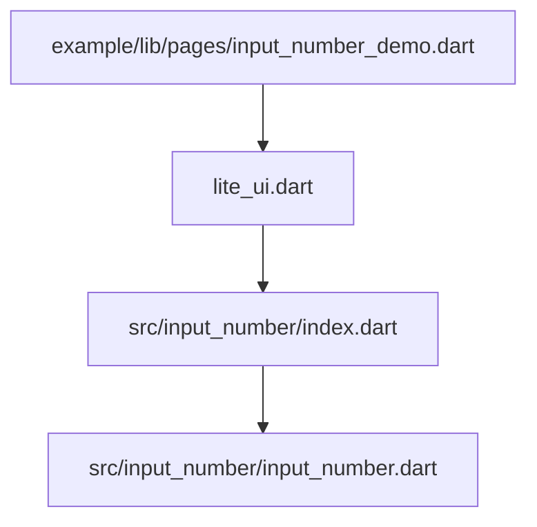
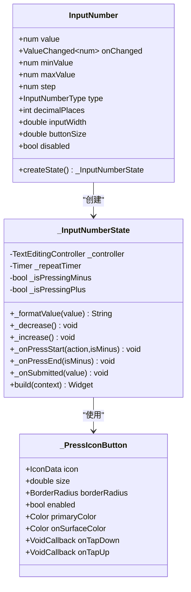
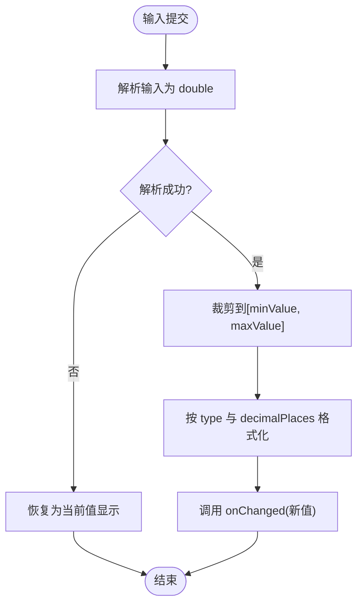
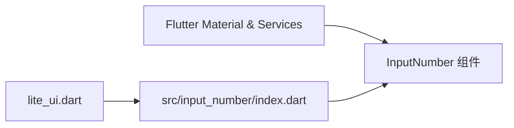

# InputNumber API

<cite>
**本文引用的文件**   
- [lib/src/input_number/input_number.dart](file://lib/src/input_number/input_number.dart)
- [lib/src/input_number/index.dart](file://lib/src/input_number/index.dart)
- [lib/lite_ui.dart](file://lib/lite_ui.dart)
- [example/lib/pages/input_number_demo.dart](file://example/lib/pages/input_number_demo.dart)
- [README.md](file://README.md)
</cite>

## 目录
1. [简介](#简介)
2. [项目结构](#项目结构)
3. [核心组件与枚举](#核心组件与枚举)
4. [架构总览](#架构总览)
5. [详细组件分析](#详细组件分析)
6. [依赖关系分析](#依赖关系分析)
7. [性能考量](#性能考量)
8. [故障排查指南](#故障排查指南)
9. [结论](#结论)
10. [附录：API 参考与示例](#附录api-参考与示例)

## 简介
InputNumber 是一个数字步进器组件，提供“左侧减号、中间输入框、右侧加号”的交互形态。支持整数与小数两种输入类型，可配置最小值、最大值、步长和小数位数；支持长按连续增减、提交时边界裁剪与格式化显示。该组件适用于价格输入、数量选择、百分比输入等常见场景。

## 项目结构
- 组件实现位于 lib/src/input_number/input_number.dart
- 统一导出入口在 lib/src/input_number/index.dart
- 库级导出在 lib/lite_ui.dart
- 使用示例在 example/lib/pages/input_number_demo.dart

图表来源
- [lib/lite_ui.dart:1-19](file://lib/lite_ui.dart#L1-L19)
- [lib/src/input_number/index.dart:1-2](file://lib/src/input_number/index.dart#L1-L2)
- [lib/src/input_number/input_number.dart:1-307](file://lib/src/input_number/input_number.dart#L1-L307)
- [example/lib/pages/input_number_demo.dart:1-140](file://example/lib/pages/input_number_demo.dart#L1-L140)

章节来源
- [lib/lite_ui.dart:1-19](file://lib/lite_ui.dart#L1-L19)
- [lib/src/input_number/index.dart:1-2](file://lib/src/input_number/index.dart#L1-L2)
- [lib/src/input_number/input_number.dart:1-307](file://lib/src/input_number/input_number.dart#L1-L307)
- [example/lib/pages/input_number_demo.dart:1-140](file://example/lib/pages/input_number_demo.dart#L1-L140)

## 核心组件与枚举
- InputNumberType 枚举
  - integer：仅允许输入整数
  - decimal：允许输入小数（默认）
- InputNumber 组件
  - 受控组件，通过 value 与 onChanged 进行状态管理
  - 支持 minValue、maxValue、step、type、decimalPlaces、inputWidth、buttonSize、disabled 等配置项

章节来源
- [lib/src/input_number/input_number.dart:6-13](file://lib/src/input_number/input_number.dart#L6-L13)
- [lib/src/input_number/input_number.dart:21-68](file://lib/src/input_number/input_number.dart#L21-L68)

## 架构总览
InputNumber 由以下部分构成：
- 外部参数层：接收 value、minValue、maxValue、step、type、decimalPlaces、inputWidth、buttonSize、disabled、onChanged
- 状态管理层：内部 TextEditingController 维护显示文本，监听父级 value 变化并同步
- 交互逻辑层：加减按钮点击与长按定时器触发增量/减量，提交时解析并裁剪到[minValue, maxValue]
- 展示层：根据 type 与 decimalPlaces 格式化显示文本，键盘类型与输入过滤器按类型切换

图表来源
- [lib/src/input_number/input_number.dart:21-68](file://lib/src/input_number/input_number.dart#L21-L68)
- [lib/src/input_number/input_number.dart:70-108](file://lib/src/input_number/input_number.dart#L70-L108)
- [lib/src/input_number/input_number.dart:110-166](file://lib/src/input_number/input_number.dart#L110-L166)
- [lib/src/input_number/input_number.dart:168-232](file://lib/src/input_number/input_number.dart#L168-L232)
- [lib/src/input_number/input_number.dart:235-306](file://lib/src/input_number/input_number.dart#L235-L306)

## 详细组件分析

### 构造函数与属性说明
- value（必填）：当前数值，受控更新
- onChanged：值变化回调，返回新数值
- minValue：最小值，默认 0
- maxValue：最大值，默认 9999
- step：每次加减的步长，默认 1
- type：输入类型，默认 decimal（小数），可选 integer（整数）
- decimalPlaces：小数位数，仅在 type=decimal 时生效，默认 2
- inputWidth：输入框宽度，默认 50
- buttonSize：按钮尺寸，默认 36
- disabled：是否禁用，默认 false

章节来源
- [lib/src/input_number/input_number.dart:21-68](file://lib/src/input_number/input_number.dart#L21-L68)

### 数值范围与边界处理
- 加减操作会检查边界：减少时不低于 minValue，增加时不高于 maxValue
- 用户提交（回车/完成）时，会将输入解析为 double，再 clamp 到[minValue, maxValue]，然后格式化显示并回调 onChanged
- 按钮可用性：当 value<=minValue 时减号不可用；当 value>=maxValue 时加号不可用

章节来源
- [lib/src/input_number/input_number.dart:110-124](file://lib/src/input_number/input_number.dart#L110-L124)
- [lib/src/input_number/input_number.dart:153-162](file://lib/src/input_number/input_number.dart#L153-L162)
- [lib/src/input_number/input_number.dart:164-165](file://lib/src/input_number/input_number.dart#L164-L165)

### 小数位控制与格式化显示
- 格式化函数根据 type 决定输出格式：
  - decimal：使用 toStringAsFixed(decimalPlaces) 固定小数位数
  - integer：转为 int 后输出
- 输入框键盘类型：
  - decimal：numberWithOptions(decimal: true)
  - integer：number（纯数字）
- 输入过滤器：
  - decimal：只允许数字与小数点，且限制小数位数不超过 decimalPlaces
  - integer：digitsOnly
- 长度限制：根据 maxValue 的位数与 decimalPlaces 动态设置最大字符长度

章节来源
- [lib/src/input_number/input_number.dart:82-87](file://lib/src/input_number/input_number.dart#L82-L87)
- [lib/src/input_number/input_number.dart:206-210](file://lib/src/input_number/input_number.dart#L206-L210)

### 用户交互与反馈
- 单击加减按钮：立即执行一次增减
- 长按加减按钮：启动定时器，每 120ms 重复触发一次，松开停止
- 禁用状态：整体透明度降低，按钮不可点击，输入框不可编辑
- 主题适配：颜色来自 Theme.of(context)，包括主色、表面色、描边色等

章节来源
- [lib/src/input_number/input_number.dart:127-151](file://lib/src/input_number/input_number.dart#L127-L151)
- [lib/src/input_number/input_number.dart:176-178](file://lib/src/input_number/input_number.dart#L176-L178)
- [lib/src/input_number/input_number.dart:168-175](file://lib/src/input_number/input_number.dart#L168-L175)

### 与表单验证集成建议
- 由于 InputNumber 是受控组件，建议在父组件中结合表单校验逻辑：
  - 在 onChanged 中进行业务校验（如范围、精度），必要时回退到上一个合法值
  - 如需错误提示，可在父组件中显示 Toast 或行内提示
- 组件本身不提供 validator 回调，但可通过父组件封装实现自定义校验

章节来源
- [lib/src/input_number/input_number.dart:110-124](file://lib/src/input_number/input_number.dart#L110-L124)
- [lib/src/input_number/input_number.dart:153-162](file://lib/src/input_number/input_number.dart#L153-L162)

### 代码级流程图（提交与格式化）

图表来源
- [lib/src/input_number/input_number.dart:153-162](file://lib/src/input_number/input_number.dart#L153-L162)
- [lib/src/input_number/input_number.dart:82-87](file://lib/src/input_number/input_number.dart#L82-L87)

## 依赖关系分析
- 组件依赖 Flutter Material 与 Services 包（Theme、TextField、TextInputFormatter、FilteringTextInputFormatter 等）
- 库级导出通过 lite_ui.dart 暴露 src/input_number/index.dart，从而对外提供 InputNumber 与 InputNumberType

图表来源
- [lib/src/input_number/input_number.dart:1-4](file://lib/src/input_number/input_number.dart#L1-L4)
- [lib/lite_ui.dart:13](file://lib/lite_ui.dart#L13)

章节来源
- [lib/src/input_number/input_number.dart:1-4](file://lib/src/input_number/input_number.dart#L1-L4)
- [lib/lite_ui.dart:13](file://lib/lite_ui.dart#L13)

## 性能考量
- 受控模式：value 变化会触发 didUpdateWidget，内部同步 TextEditingController 文本，避免不必要的重建
- 长按定时器：使用 Timer.periodic，在 dispose 时取消，防止内存泄漏
- 输入过滤：使用 FilteringTextInputFormatter 与 LengthLimitingTextInputFormatter 在输入阶段拦截非法字符，减少后续处理开销
- 动画按钮：每个按钮独立 AnimationController，生命周期与组件一致，避免全局共享导致的抖动

章节来源
- [lib/src/input_number/input_number.dart:96-101](file://lib/src/input_number/input_number.dart#L96-L101)
- [lib/src/input_number/input_number.dart:104-108](file://lib/src/input_number/input_number.dart#L104-L108)
- [lib/src/input_number/input_number.dart:206-210](file://lib/src/input_number/input_number.dart#L206-L210)
- [lib/src/input_number/input_number.dart:260-275](file://lib/src/input_number/input_number.dart#L260-L275)

## 故障排查指南
- 输入无效被拒绝
  - 检查 type 与 decimalPlaces 是否匹配预期
  - 确认输入过滤器是否过于严格（例如小数位数限制）
- 加减按钮无响应
  - 检查 disabled 是否为 true
  - 检查 value 是否已达到 minValue 或 maxValue
- 提交后值未更新
  - 检查 onChanged 是否正确保存新值
  - 确认父组件是否将 value 作为受控值传递
- 显示异常
  - 检查 _formatValue 的逻辑是否与 type 一致
  - 确认键盘类型与输入过滤器是否匹配

章节来源
- [lib/src/input_number/input_number.dart:110-124](file://lib/src/input_number/input_number.dart#L110-L124)
- [lib/src/input_number/input_number.dart:153-162](file://lib/src/input_number/input_number.dart#L153-L162)
- [lib/src/input_number/input_number.dart:176-178](file://lib/src/input_number/input_number.dart#L176-L178)
- [lib/src/input_number/input_number.dart:206-210](file://lib/src/input_number/input_number.dart#L206-L210)

## 结论
InputNumber 提供了简洁而强大的数字输入能力，覆盖常见的范围限制、精度控制、步长设置与格式化显示需求。通过受控模式与丰富的配置项，可以灵活适配价格、数量、百分比等多种业务场景。配合父组件的校验逻辑，可实现完整的表单集成体验。

## 附录：API 参考与示例

### API 参考
- 枚举
  - InputNumberType.integer：整数输入
  - InputNumberType.decimal：小数输入（默认）
- 组件属性
  - value：当前数值（必填）
  - onChanged：值变化回调
  - minValue：最小值（默认 0）
  - maxValue：最大值（默认 9999）
  - step：步长（默认 1）
  - type：输入类型（默认 decimal）
  - decimalPlaces：小数位数（默认 2）
  - inputWidth：输入框宽度（默认 50）
  - buttonSize：按钮尺寸（默认 36）
  - disabled：禁用（默认 false）

章节来源
- [lib/src/input_number/input_number.dart:6-13](file://lib/src/input_number/input_number.dart#L6-L13)
- [lib/src/input_number/input_number.dart:21-68](file://lib/src/input_number/input_number.dart#L21-L68)

### 使用示例（场景化）
- 基础用法（默认小数）
  - 参考路径：[example/lib/pages/input_number_demo.dart:24-29](file://example/lib/pages/input_number_demo.dart#L24-L29)
- 整数输入（购物车数量）
  - 参考路径：[example/lib/pages/input_number_demo.dart:31-36](file://example/lib/pages/input_number_demo.dart#L31-L36)
- 自定义范围（评分 0-100）
  - 参考路径：[example/lib/pages/input_number_demo.dart:38-43](file://example/lib/pages/input_number_demo.dart#L38-L43)
- 自定义步长（每次 ±5）
  - 参考路径：[example/lib/pages/input_number_demo.dart:45-57](file://example/lib/pages/input_number_demo.dart#L45-L57)
- 禁用状态
  - 参考路径：[example/lib/pages/input_number_demo.dart:59-64](file://example/lib/pages/input_number_demo.dart#L59-L64)
- 自定义尺寸
  - 参考路径：[example/lib/pages/input_number_demo.dart:66-71](file://example/lib/pages/input_number_demo.dart#L66-L71)
- 小数输入（体重，保留 1 位小数，步长 0.5）
  - 参考路径：[example/lib/pages/input_number_demo.dart:73-78](file://example/lib/pages/input_number_demo.dart#L73-L78)
- 实际场景：购物车数量
  - 参考路径：[example/lib/pages/input_number_demo.dart:107-138](file://example/lib/pages/input_number_demo.dart#L107-L138)

章节来源
- [example/lib/pages/input_number_demo.dart:24-78](file://example/lib/pages/input_number_demo.dart#L24-L78)
- [example/lib/pages/input_number_demo.dart:107-138](file://example/lib/pages/input_number_demo.dart#L107-L138)

### 与表单验证集成方法
- 在 onChanged 中执行业务校验（如范围、精度），若失败则回退到旧值
- 在父组件中集中管理错误提示（Toast、行内提示）
- 组件本身不包含 validator 回调，需通过上层封装实现

章节来源
- [lib/src/input_number/input_number.dart:110-124](file://lib/src/input_number/input_number.dart#L110-L124)
- [lib/src/input_number/input_number.dart:153-162](file://lib/src/input_number/input_number.dart#L153-L162)

### 性能优化建议
- 合理使用受控模式，避免频繁重建
- 在 dispose 中确保定时器释放
- 使用输入过滤器在输入阶段拦截非法字符
- 按钮动画独立管理，避免全局动画冲突

章节来源
- [lib/src/input_number/input_number.dart:96-108](file://lib/src/input_number/input_number.dart#L96-L108)
- [lib/src/input_number/input_number.dart:206-210](file://lib/src/input_number/input_number.dart#L206-L210)
- [lib/src/input_number/input_number.dart:260-275](file://lib/src/input_number/input_number.dart#L260-L275)