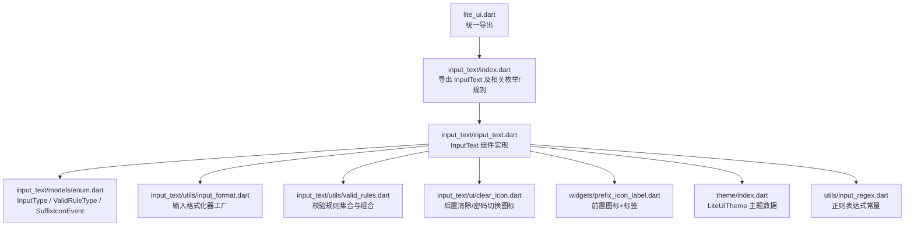
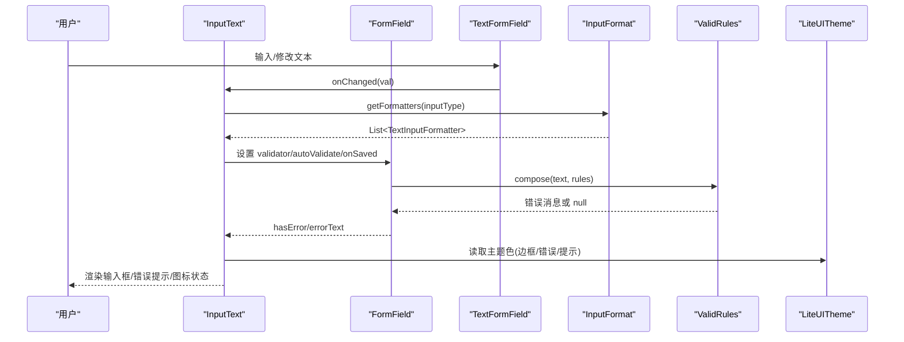
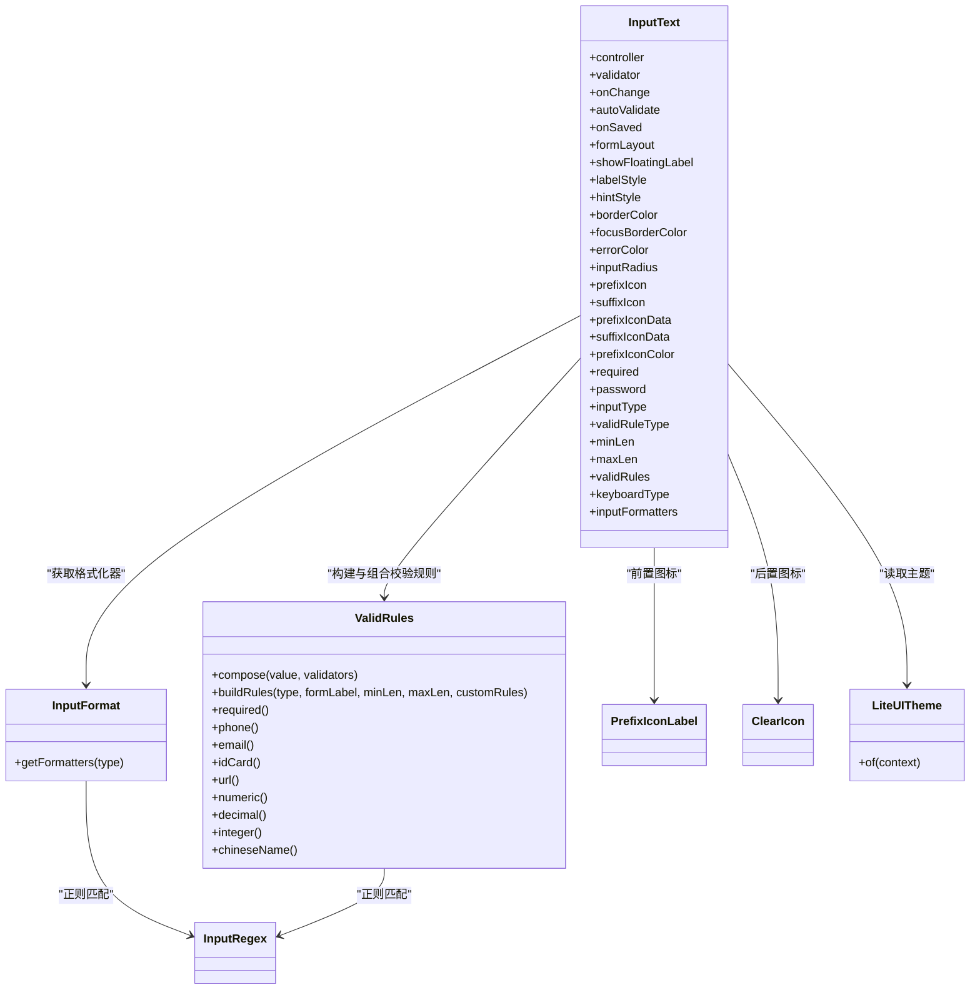

# InputText API

<cite>
**本文引用的文件**   
- [input_text.dart](file://lib/src/input_text/input_text.dart)
- [index.dart](file://lib/src/input_text/index.dart)
- [enum.dart](file://lib/src/input_text/models/enum.dart)
- [input_format.dart](file://lib/src/input_text/utils/input_format.dart)
- [valid_rules.dart](file://lib/src/input_text/utils/valid_rules.dart)
- [clear_icon.dart](file://lib/src/input_text/ui/clear_icon.dart)
- [prefix_icon_label.dart](file://lib/src/widgets/prefix_icon_label.dart)
- [input_regex.dart](file://lib/src/utils/input_regex.dart)
- [index.dart](file://lib/src/theme/index.dart)
- [lite_ui.dart](file://lib/lite_ui.dart)
</cite>

## 目录
1. [简介](#简介)
2. [项目结构](#项目结构)
3. [核心组件](#核心组件)
4. [架构总览](#架构总览)
5. [详细组件分析](#详细组件分析)
6. [依赖关系分析](#依赖关系分析)
7. [性能考量](#性能考量)
8. [故障排查指南](#故障排查指南)
9. [结论](#结论)
10. [附录：API 参考与示例](#附录api-参考与示例)

## 简介
InputText 是一个功能完备的文本输入框组件，支持多种输入类型、内置校验规则、输入格式化器、前后置图标、浮动标签、错误提示、主题集成等能力。通过枚举化的配置项（如输入类型、校验规则类型）简化常见场景的使用，同时保留足够的扩展性以支持自定义校验与格式化。

## 项目结构
InputText 相关代码位于 lib/src/input_text 目录下，包含组件实现、枚举定义、工具类与 UI 子部件；主题系统位于 lib/src/theme；正则表达式工具位于 lib/src/utils；公共导出入口在 lib/lite_ui.dart。

**图表来源**
- [lite_ui.dart:1-19](file://lib/lite_ui.dart#L1-L19)
- [index.dart:1-4](file://lib/src/input_text/index.dart#L1-L4)
- [input_text.dart:1-365](file://lib/src/input_text/input_text.dart#L1-L365)
- [enum.dart:1-82](file://lib/src/input_text/models/enum.dart#L1-L82)
- [input_format.dart:1-88](file://lib/src/input_text/utils/input_format.dart#L1-L88)
- [valid_rules.dart:1-245](file://lib/src/input_text/utils/valid_rules.dart#L1-L245)
- [clear_icon.dart:1-46](file://lib/src/input_text/ui/clear_icon.dart#L1-L46)
- [prefix_icon_label.dart:1-50](file://lib/src/widgets/prefix_icon_label.dart#L1-L50)
- [index.dart:1-73](file://lib/src/theme/index.dart#L1-L73)
- [input_regex.dart:1-46](file://lib/src/utils/input_regex.dart#L1-L46)

**章节来源**
- [lite_ui.dart:1-19](file://lib/lite_ui.dart#L1-L19)
- [index.dart:1-4](file://lib/src/input_text/index.dart#L1-L4)

## 核心组件
InputText 是基于 Flutter 的 StatefulWidget，内部使用 FormField 与 TextFormField 构建表单字段，提供以下关键能力：
- 输入类型控制：text、decimal、integer、chinese、english、char，底层通过 TextInputFormatter 实时拦截非法字符
- 校验规则：内置 phone/email/idCard/url/numeric/decimal/integer/chineseName/password 等规则，支持必填、长度限制与自定义规则组合
- 图标与交互：前/后置图标、密码可见性切换、清空内容、点击回调
- 布局与样式：行/列布局、浮动标签、圆角、边框颜色、错误色、提示文字样式
- 事件与生命周期：onChange、onSaved、自动验证模式、键盘类型、输入格式化器扩展

**章节来源**
- [input_text.dart:15-168](file://lib/src/input_text/input_text.dart#L15-L168)
- [input_text.dart:170-365](file://lib/src/input_text/input_text.dart#L170-L365)

## 架构总览
InputText 的运行时流程如下：用户输入触发 onChanged，组件根据 inputType 注入对应格式化器，随后进行校验（required + validRuleType + 自定义规则 + validator），最终渲染 InputDecoration 并显示错误信息或提示。

**图表来源**
- [input_text.dart:219-233](file://lib/src/input_text/input_text.dart#L219-L233)
- [input_text.dart:236-352](file://lib/src/input_text/input_text.dart#L236-L352)
- [input_format.dart:67-87](file://lib/src/input_text/utils/input_format.dart#L67-L87)
- [valid_rules.dart:176-182](file://lib/src/input_text/utils/valid_rules.dart#L176-L182)
- [index.dart:63-66](file://lib/src/theme/index.dart#L63-L66)

## 详细组件分析

### 构造函数参数与属性说明
- controller: TextEditingController？用于外部管理输入值与生命周期
- validator: String? Function(String?)? 自定义校验函数，最后执行
- onChange: Function(String)? 输入变化回调
- autoValidate: AutovalidateMode 自动验证模式
- onSaved: Function(String)? 保存回调
- formLayout: FormLayout.row/column 行/列布局
- showFloatingLabel: bool? 是否启用浮动标签
- labelStyle/hintStyle/hintTextColor/hintFontSize: 标签与提示样式
- borderColor/focusBorderColor/errorColor/inputRadius: 边框与圆角主题覆盖
- prefixIcon/suffixIcon/prefixIconData/suffixIconData/prefixIconColor: 前后置图标与颜色
- required: bool 必填标记（显示红色星号）
- password: bool 密码模式（含可见性切换）
- inputType: InputType 输入类型（text/decimal/integer/chinese/english/char）
- validRuleType: ValidRuleType 校验规则类型（phone/email/idCard/url/numeric/decimal/integer/chineseName/password/custom）
- minLen/maxLen: int? 最小/最大长度（配合 validRuleType 使用）
- validRules: List<String? Function(String?)>? 自定义校验规则列表（仅 validRuleType=custom 时生效）
- keyboardType: TextInputType? 键盘类型
- inputFormatters: List<TextInputFormatter>? 额外输入格式化器（与 inputType 的格式化器合并）

**章节来源**
- [input_text.dart:16-165](file://lib/src/input_text/input_text.dart#L16-L165)

### 输入类型与格式化器
- InputType.text：不限制（空格式化器）
- InputType.integer：仅数字
- InputType.decimal：允许数字与小数点，且最多一个小数点
- InputType.chinese：仅中文字符
- InputType.english：仅英文字母
- InputType.char：ASCII 单字符范围

格式化器由 InputFormat.getFormatters 根据 InputType 返回，并与 widget.inputFormatters 合并后传入 TextFormField。

**章节来源**
- [enum.dart:23-45](file://lib/src/input_text/models/enum.dart#L23-L45)
- [input_format.dart:10-62](file://lib/src/input_text/utils/input_format.dart#L10-L62)
- [input_format.dart:67-87](file://lib/src/input_text/utils/input_format.dart#L67-L87)
- [input_text.dart:270](file://lib/src/input_text/input_text.dart#L270)

### 校验规则与组合
- 必填校验：required=true 时自动添加
- 内置规则：ValidRuleType 选择后自动构建规则链（包含必填与具体格式校验）
- 长度限制：minLen/maxLen 可与任意类型组合
- 自定义规则：validRuleType=custom 时，使用 validRules 列表
- 自定义 validator：最后执行，可覆盖或补充其他规则

校验组合逻辑：
- defaultValid 读取 controller.text 作为真实数据源
- 依次执行 required -> buildRules(type) -> 自定义 validator
- 使用 ValidRules.compose 顺序执行，返回首个错误消息

**章节来源**
- [input_text.dart:196-217](file://lib/src/input_text/input_text.dart#L196-L217)
- [valid_rules.dart:176-182](file://lib/src/input_text/utils/valid_rules.dart#L176-L182)
- [valid_rules.dart:191-243](file://lib/src/input_text/utils/valid_rules.dart#L191-L243)

### 图标与交互
- 前置图标：PrefixIconLabel 支持 iconData/Widget 与颜色、宽度、必填标记
- 后置图标：ClearIcon 支持密码可见性切换、清空按钮、自定义 suffixIcon/suffixIconData
- 点击事件：onSuffixIconTap 接收 SuffixIconEvent（onTap/showPassword/clear）

**章节来源**
- [prefix_icon_label.dart:1-50](file://lib/src/widgets/prefix_icon_label.dart#L1-L50)
- [clear_icon.dart:1-46](file://lib/src/input_text/ui/clear_icon.dart#L1-L46)
- [input_text.dart:225-233](file://lib/src/input_text/input_text.dart#L225-L233)

### 布局与浮动标签
- formLayout=row：默认行布局，label 作为浮动标签
- formLayout=column：列布局，formLabel 作为静态标题，error 紧随其后
- showFloatingLabel：控制浮动标签行为（always/never），列布局下按 formLabel 是否为空决定

**章节来源**
- [input_text.dart:246-259](file://lib/src/input_text/input_text.dart#L246-L259)
- [input_text.dart:355-363](file://lib/src/input_text/input_text.dart#L355-L363)

### 主题与样式定制
- LiteUITheme 提供全局默认颜色（边框、错误、聚焦、提示、文字）
- InputText 在边框、错误色、提示色等处优先使用 widget 覆盖，其次回退到 LiteUITheme，再回退系统主题

**章节来源**
- [index.dart:6-38](file://lib/src/theme/index.dart#L6-L38)
- [index.dart:54-72](file://lib/src/theme/index.dart#L54-L72)
- [input_text.dart:282-296](file://lib/src/input_text/input_text.dart#L282-L296)
- [input_text.dart:319-345](file://lib/src/input_text/input_text.dart#L319-L345)

## 依赖关系分析
InputText 依赖以下模块：
- models/enum：InputType、ValidRuleType、SuffixIconEvent、FormLayout、BorderType
- utils/input_format：InputFormat/InputFormatters 提供格式化器
- utils/valid_rules：ValidRules 提供校验方法与组合
- widgets/prefix_icon_label：前置图标与标签
- ui/clear_icon：后置图标与交互
- theme/index：LiteUITheme 主题数据
- utils/input_regex：正则表达式常量

**图表来源**
- [input_text.dart:15-168](file://lib/src/input_text/input_text.dart#L15-L168)
- [input_format.dart:67-87](file://lib/src/input_text/utils/input_format.dart#L67-L87)
- [valid_rules.dart:176-182](file://lib/src/input_text/utils/valid_rules.dart#L176-L182)
- [prefix_icon_label.dart:1-50](file://lib/src/widgets/prefix_icon_label.dart#L1-L50)
- [clear_icon.dart:1-46](file://lib/src/input_text/ui/clear_icon.dart#L1-L46)
- [index.dart:63-66](file://lib/src/theme/index.dart#L63-L66)
- [input_regex.dart:1-46](file://lib/src/utils/input_regex.dart#L1-L46)

**章节来源**
- [enum.dart:1-82](file://lib/src/input_text/models/enum.dart#L1-L82)
- [input_format.dart:1-88](file://lib/src/input_text/utils/input_format.dart#L1-L88)
- [valid_rules.dart:1-245](file://lib/src/input_text/utils/valid_rules.dart#L1-L245)
- [prefix_icon_label.dart:1-50](file://lib/src/widgets/prefix_icon_label.dart#L1-L50)
- [clear_icon.dart:1-46](file://lib/src/input_text/ui/clear_icon.dart#L1-L46)
- [index.dart:1-73](file://lib/src/theme/index.dart#L1-L73)
- [input_regex.dart:1-46](file://lib/src/utils/input_regex.dart#L1-L46)

## 性能考量
- 输入格式化器在每次输入时运行，建议避免过于复杂的正则或计算逻辑
- 校验规则链较短时性能良好；大量自定义规则可能影响响应速度
- 控制器生命周期：若未传入 controller，组件内部创建并在 dispose 中释放；外部传入则由外部管理
- 焦点与失焦：使用 FocusNode 管理焦点，避免不必要的重建

[本节为通用指导，无需源码引用]

## 故障排查指南
- 校验不生效：确认已启用 required 或 validRuleType 非 custom；检查 defaultValid 是否被调用
- 格式化器无效：确保 inputType 与 inputFormatters 正确传入；注意两者会合并
- 密码切换无效：确认 password=true 且 onSuffixIconTap 处理 showPassword 事件
- 错误提示颜色异常：检查 errorColor 与 LiteUITheme.errorColor 的设置优先级
- 浮动标签不显示：检查 showFloatingLabel 与 formLayout 的组合逻辑

**章节来源**
- [input_text.dart:196-217](file://lib/src/input_text/input_text.dart#L196-L217)
- [input_text.dart:270](file://lib/src/input_text/input_text.dart#L270)
- [input_text.dart:225-233](file://lib/src/input_text/input_text.dart#L225-L233)
- [input_text.dart:282-296](file://lib/src/input_text/input_text.dart#L282-L296)
- [input_text.dart:355-363](file://lib/src/input_text/input_text.dart#L355-L363)

## 结论
InputText 提供了丰富的配置选项与强大的扩展能力，适用于大多数文本输入场景。通过枚举化配置简化常见需求，同时保留自定义校验与格式化器的灵活性。结合 LiteUITheme 可实现一致的主题风格与样式定制。

[本节为总结，无需源码引用]

## 附录：API 参考与示例

### 常用场景与最佳实践
- 实时验证与错误提示：使用 autoValidate 与 required/validRuleType 组合，错误信息通过 state.hasError 与 state.errorText 展示
- 输入限制：通过 inputType 与 inputFormatters 限制输入字符集与格式
- 自定义格式化器：在 inputFormatters 中添加自定义 TextInputFormatter，与 inputType 的格式化器合并
- 密码输入：设置 password=true，使用后缀图标切换可见性
- 主题定制：在应用层包裹 LiteUITheme，覆盖默认颜色与圆角

### 完整示例路径（不含代码内容）
- 基础文本输入：[input_text.dart:260-347](file://lib/src/input_text/input_text.dart#L260-L347)
- 密码输入与可见性切换：[input_text.dart:225-233](file://lib/src/input_text/input_text.dart#L225-L233)、[clear_icon.dart:17-25](file://lib/src/input_text/ui/clear_icon.dart#L17-L25)
- 数字与小数输入格式化：[input_format.dart:14-41](file://lib/src/input_text/utils/input_format.dart#L14-L41)
- 手机号/邮箱/身份证校验：[valid_rules.dart:15-51](file://lib/src/input_text/utils/valid_rules.dart#L15-L51)
- 自定义校验规则组合：[valid_rules.dart:191-243](file://lib/src/input_text/utils/valid_rules.dart#L191-L243)
- 主题覆盖与样式定制：[index.dart:27-38](file://lib/src/theme/index.dart#L27-L38)、[input_text.dart:319-345](file://lib/src/input_text/input_text.dart#L319-L345)

**章节来源**
- [input_text.dart:260-347](file://lib/src/input_text/input_text.dart#L260-L347)
- [input_format.dart:14-41](file://lib/src/input_text/utils/input_format.dart#L14-L41)
- [valid_rules.dart:15-51](file://lib/src/input_text/utils/valid_rules.dart#L15-L51)
- [valid_rules.dart:191-243](file://lib/src/input_text/utils/valid_rules.dart#L191-L243)
- [index.dart:27-38](file://lib/src/theme/index.dart#L27-L38)
- [clear_icon.dart:17-25](file://lib/src/input_text/ui/clear_icon.dart#L17-L25)