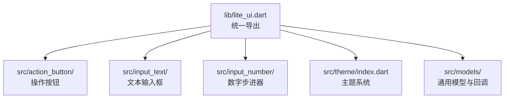
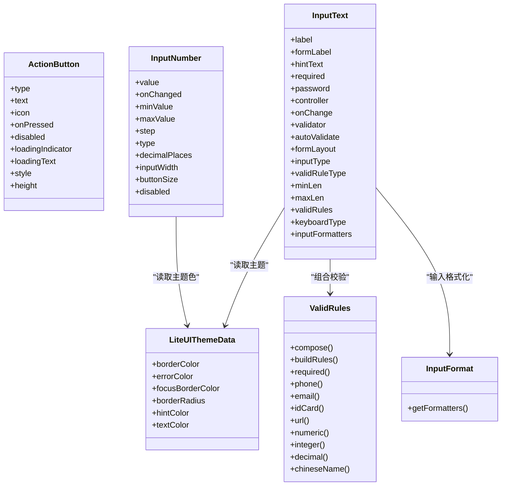
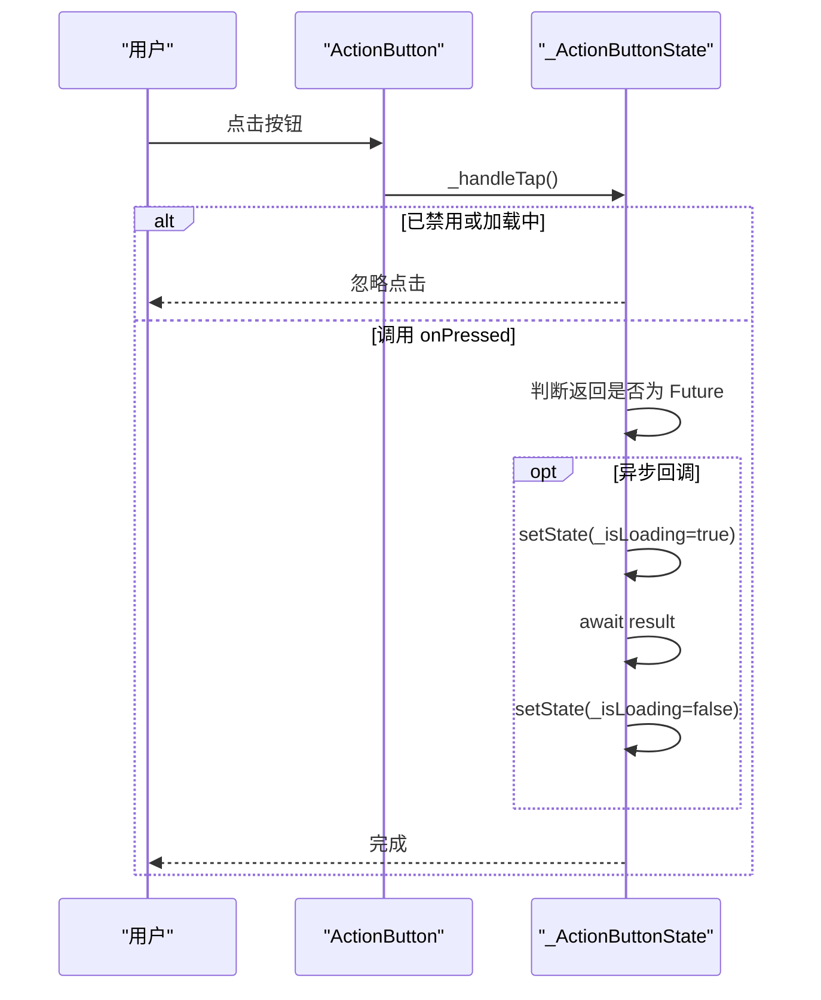
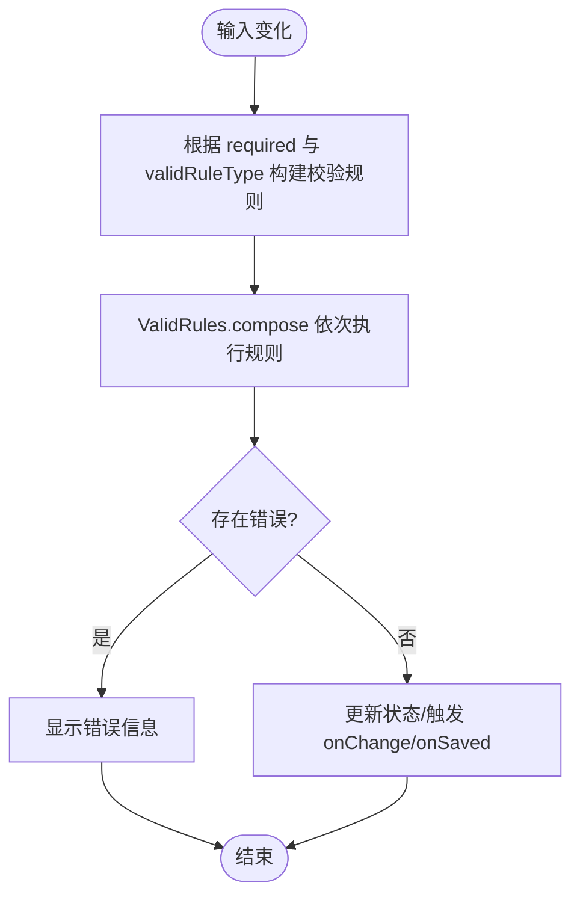
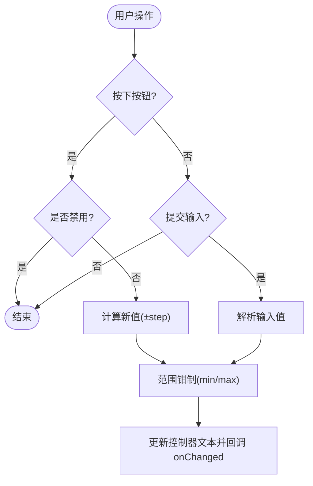
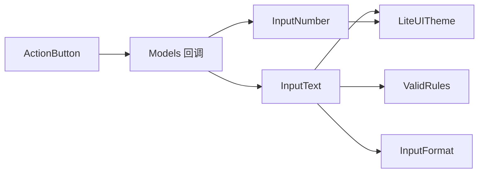

# 核心组件 API

<cite>
**本文引用的文件**   
- [lite_ui.dart](file://lib/lite_ui.dart)
- [README.md](file://README.md)
- [pubspec.yaml](file://pubspec.yaml)
- [action_button.dart](file://lib/src/action_button/action_button.dart)
- [index.dart（ActionButton）](file://lib/src/action_button/index.dart)
- [input_text.dart](file://lib/src/input_text/input_text.dart)
- [index.dart（InputText）](file://lib/src/input_text/index.dart)
- [enum.dart（InputText 枚举）](file://lib/src/input_text/models/enum.dart)
- [valid_rules.dart](file://lib/src/input_text/utils/valid_rules.dart)
- [input_format.dart](file://lib/src/input_text/utils/input_format.dart)
- [input_number.dart](file://lib/src/input_number/input_number.dart)
- [index.dart（InputNumber）](file://lib/src/input_number/index.dart)
- [callbacks.dart](file://lib/src/models/callbacks.dart)
- [index.dart（Models）](file://lib/src/models/index.dart)
- [theme/index.dart](file://lib/src/theme/index.dart)
</cite>

## 目录
1. [简介](#简介)
2. [项目结构](#项目结构)
3. [核心组件](#核心组件)
4. [架构总览](#架构总览)
5. [详细组件分析](#详细组件分析)
6. [依赖分析](#依赖分析)
7. [性能考虑](#性能考虑)
8. [故障排查指南](#故障排查指南)
9. [结论](#结论)
10. [附录](#附录)

## 简介
本文件为 Lite UI 核心组件的 API 文档，聚焦 ActionButton、InputText、InputNumber 三个基础组件。内容涵盖：
- 构造函数参数与属性配置
- 事件回调方法说明
- 样式定制、验证规则、格式化器等高级用法
- 状态管理、生命周期与性能优化建议
- 错误处理、异常场景与最佳实践

该库基于 Flutter 构建，提供开箱即用的按钮、输入框、数字步进器及主题能力，支持高度可配置与泛型适配。

## 项目结构
Lite UI 采用按功能模块划分的目录组织方式，核心入口通过 lite_ui.dart 统一导出各模块，便于按需引入。

图表来源
- [lite_ui.dart:1-19](file://lib/lite_ui.dart#L1-L19)

章节来源
- [lite_ui.dart:1-19](file://lib/lite_ui.dart#L1-L19)
- [README.md:24-37](file://README.md#L24-L37)

## 核心组件
本节概述三个核心组件的职责与能力边界：
- ActionButton：封装多种按钮类型，自动处理同步/异步点击与加载态。
- InputText：基于 TextFormField 的表单输入控件，内置输入格式限制与校验规则。
- InputNumber：左右加减按钮 + 中间输入的数字步进器，支持整数/小数与步长控制。

章节来源
- [README.md:40-126](file://README.md#L40-L126)

## 架构总览
组件间关系与依赖如下：
- ActionButton 独立实现，不依赖其他模块。
- InputText 依赖主题、输入格式化器与校验规则工具。
- InputNumber 使用系统主题色与输入格式化器进行数值输入限制。
- 主题 LiteUITheme 为全局样式注入点。

图表来源
- [action_button.dart:43-94](file://lib/src/action_button/action_button.dart#L43-L94)
- [input_text.dart:15-168](file://lib/src/input_text/input_text.dart#L15-L168)
- [input_number.dart:21-68](file://lib/src/input_number/input_number.dart#L21-L68)
- [theme/index.dart:6-38](file://lib/src/theme/index.dart#L6-L38)
- [valid_rules.dart:4-245](file://lib/src/input_text/utils/valid_rules.dart#L4-L245)
- [input_format.dart:67-87](file://lib/src/input_text/utils/input_format.dart#L67-L87)

## 详细组件分析

### ActionButton 组件
- 作用：统一封装 Elevated/Outlined/Text/Filled/Tonal/Icon 等按钮类型，自动识别同步/异步回调并显示加载态。
- 关键特性：
  - type：按钮类型，默认 elevated。
  - onPressed：支持同步或异步函数；异步时自动禁用重复点击并显示 loading。
  - icon/text：非 icon 类型时显示图标+文字；icon 类型时仅显示图标。
  - disabled/loadingIndicator/loadingText/style：控制禁用、自定义加载指示器、加载文案与样式覆盖。
  - height：默认 45。

图表来源
- [action_button.dart:96-175](file://lib/src/action_button/action_button.dart#L96-L175)

章节来源
- [action_button.dart:43-94](file://lib/src/action_button/action_button.dart#L43-L94)
- [action_button.dart:96-175](file://lib/src/action_button/action_button.dart#L96-L175)
- [index.dart（ActionButton）:1-2](file://lib/src/action_button/index.dart#L1-L2)

### InputText 组件
- 作用：基于 TextFormField 的表单输入控件，支持标签、密码模式、前置/后置图标、输入类型限制、校验规则、浮动标签等。
- 关键特性：
  - label/formLabel/hintText：标签与提示文案。
  - required/password/controller：必填标记、密码可见性切换、控制器。
  - onChange/onSaved/validator：输入变化、保存、自定义校验。
  - autoValidate：自动验证模式。
  - formLayout：行/列布局。
  - inputType：输入类型（text/decimal/integer/chinese/english/char），通过 TextInputFormatter 实时拦截非法字符。
  - validRuleType/minLen/maxLen/validRules：校验规则类型与长度限制，支持内置规则与自定义规则列表。
  - keyboardType/inputFormatters：键盘类型与额外格式化器。
  - 样式：边框颜色、聚焦边框颜色、圆角、提示文字样式、错误颜色、浮动标签样式。

图表来源
- [input_text.dart:196-217](file://lib/src/input_text/input_text.dart#L196-L217)
- [valid_rules.dart:173-182](file://lib/src/input_text/utils/valid_rules.dart#L173-L182)

章节来源
- [input_text.dart:15-168](file://lib/src/input_text/input_text.dart#L15-L168)
- [input_text.dart:170-234](file://lib/src/input_text/input_text.dart#L170-L234)
- [input_text.dart:236-365](file://lib/src/input_text/input_text.dart#L236-L365)
- [enum.dart（InputText 枚举）:23-82](file://lib/src/input_text/models/enum.dart#L23-L82)
- [valid_rules.dart:4-245](file://lib/src/input_text/utils/valid_rules.dart#L4-L245)
- [input_format.dart:67-87](file://lib/src/input_text/utils/input_format.dart#L67-L87)
- [index.dart（InputText）:1-4](file://lib/src/input_text/index.dart#L1-L4)

### InputNumber 组件
- 作用：左侧减号、中间输入框、右侧加号的数字步进器，支持整数/小数、步长、最小/最大值、长按连续增减。
- 关键特性：
  - value/onChanged：受控值与变化回调。
  - minValue/maxValue/step：范围与步长控制。
  - type/decimalPlaces：输入类型与小数位数。
  - inputWidth/buttonSize/disabled：尺寸与禁用状态。
  - 输入限制：通过 TextInputType 与 FilteringTextInputFormatter 限制输入格式。
  - 交互：按下持续触发定时器，松开停止。

图表来源
- [input_number.dart:110-162](file://lib/src/input_number/input_number.dart#L110-L162)
- [input_number.dart:168-231](file://lib/src/input_number/input_number.dart#L168-L231)

章节来源
- [input_number.dart:21-68](file://lib/src/input_number/input_number.dart#L21-L68)
- [input_number.dart:70-108](file://lib/src/input_number/input_number.dart#L70-L108)
- [input_number.dart:110-162](file://lib/src/input_number/input_number.dart#L110-L162)
- [input_number.dart:168-231](file://lib/src/input_number/input_number.dart#L168-L231)
- [index.dart（InputNumber）:1-2](file://lib/src/input_number/index.dart#L1-L2)

## 依赖分析
- ActionButton：无外部业务依赖，仅依赖 Flutter Material 组件。
- InputText：依赖主题 LiteUITheme、输入格式化 InputFormat、校验规则 ValidRules。
- InputNumber：依赖 Flutter 主题色与系统输入格式化器。
- Models：提供通用回调类型（单选、多选、远程搜索）。

图表来源
- [lite_ui.dart:1-19](file://lib/lite_ui.dart#L1-L19)
- [callbacks.dart:1-13](file://lib/src/models/callbacks.dart#L1-L13)

章节来源
- [lite_ui.dart:1-19](file://lib/lite_ui.dart#L1-L19)
- [callbacks.dart:1-13](file://lib/src/models/callbacks.dart#L1-L13)

## 性能考虑
- ActionButton：
  - 避免在 onPressed 中执行重计算；必要时使用防抖或节流。
  - 自定义 loadingIndicator 时注意动画开销，尽量复用资源。
- InputText：
  - 合理设置 autoValidate，避免频繁重建；复杂校验建议延迟到失焦或提交时。
  - 使用 controller 管理大文本输入，减少不必要的 rebuild。
  - 输入格式化器链过长会影响输入响应，精简规则。
- InputNumber：
  - 长按定时器间隔 120ms，适合快速递增；如需更流畅体验可在高频场景下合并状态更新。
  - 避免在 onChanged 中进行昂贵操作，建议使用 debounce。

[本节为通用指导，无需引用具体文件]

## 故障排查指南
- ActionButton 点击无效：
  - 检查 disabled 与 loading 状态；确认 onPressed 不为空。
  - 异步回调未正确 await 可能导致加载态异常。
- InputText 校验不生效：
  - 确认 validRuleType 与 required 的组合逻辑；custom 类型需传入 validRules。
  - 校验函数应返回 null 表示通过，否则返回错误消息。
- InputNumber 输入被拒绝：
  - 检查 keyboardType 与 inputFormatters 是否冲突。
  - 超出 min/max 范围会被钳制，确保业务层接受此行为。

章节来源
- [action_button.dart:96-175](file://lib/src/action_button/action_button.dart#L96-L175)
- [input_text.dart:196-217](file://lib/src/input_text/input_text.dart#L196-L217)
- [input_number.dart:153-162](file://lib/src/input_number/input_number.dart#L153-L162)

## 结论
ActionButton、InputText、InputNumber 构成了 Lite UI 的核心交互基础。通过统一的类型系统与校验/格式化机制，开发者可以快速构建稳定、可定制的表单与操作界面。结合主题系统，可实现一致的视觉风格与良好的用户体验。

[本节为总结，无需引用具体文件]

## 附录

### 安装与依赖
- 包名：lite_ui
- 版本：1.2.0
- 依赖：file_picker、image_picker、flutter SDK

章节来源
- [pubspec.yaml:1-21](file://pubspec.yaml#L1-L21)

### 使用示例指引
- ActionButton：
  - 同步点击：直接传入 void 回调。
  - 异步点击：传入 async 回调，自动显示加载态。
  - 样式定制：通过 style 覆盖默认 ButtonStyle。
- InputText：
  - 密码输入：password=true，配合后缀图标切换可见性。
  - 校验规则：使用 validRuleType 内置规则或 validRules 自定义规则。
  - 输入限制：通过 inputType 与 inputFormatters 限制字符集。
- InputNumber：
  - 整数/小数：type=integer 或 decimal，decimalPlaces 控制小数位。
  - 范围控制：minValue/maxValue 限制取值区间。
  - 长按递增：按住按钮持续触发增量。

章节来源
- [README.md:40-126](file://README.md#L40-L126)