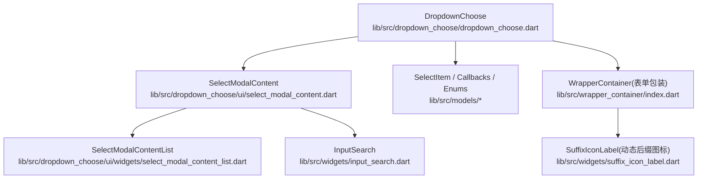
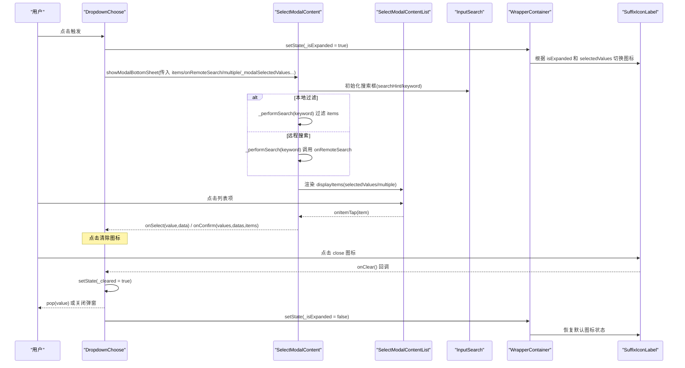
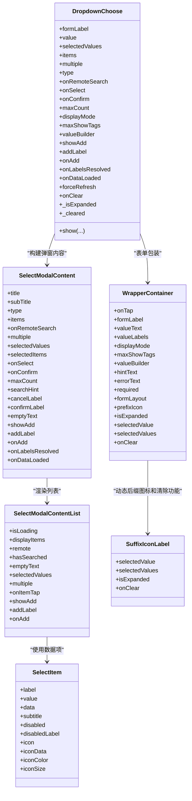

# DropdownChoose 下拉选择器 API

<cite>
**本文引用的文件**
- [lib/src/dropdown_choose/dropdown_choose.dart](file://lib/src/dropdown_choose/dropdown_choose.dart)
- [lib/src/dropdown_choose/ui/select_modal_content.dart](file://lib/src/dropdown_choose/ui/select_modal_content.dart)
- [lib/src/dropdown_choose/ui/widgets/select_modal_content_list.dart](file://lib/src/dropdown_choose/ui/widgets/select_modal_content_list.dart)
- [lib/src/models/select_item.dart](file://lib/src/models/select_item.dart)
- [lib/src/models/enum.dart](file://lib/src/models/enum.dart)
- [lib/src/models/callbacks.dart](file://lib/src/models/callbacks.dart)
- [lib/src/widgets/input_search.dart](file://lib/src/widgets/input_search.dart)
- [lib/src/wrapper_container/index.dart](file://lib/src/wrapper_container/index.dart)
- [lib/src/widgets/suffix_icon_label.dart](file://lib/src/widgets/suffix_icon_label.dart)
- [example/lib/pages/back.dart](file://example/lib/pages/back.dart)
- [example/lib/pages/select_modal_demo.dart](file://example/lib/pages/select_modal_demo.dart)
</cite>

## 更新摘要
**所做更改**
- 新增 onClear 回调属性，支持点击关闭图标时处理清除动作
- 修复了清除后弹窗选中状态不同步的问题，通过 _modalSelectedValues() 方法确保弹窗正确感知内部清除状态
- 完善了清除功能的用户体验，提供更直观的交互反馈

## 目录
1. [简介](#简介)
2. [项目结构](#项目结构)
3. [核心组件与参数总览](#核心组件与参数总览)
4. [架构概览](#架构概览)
5. [详细组件分析](#详细组件分析)
6. [依赖关系分析](#依赖关系分析)
7. [性能与优化建议](#性能与优化建议)
8. [故障排查指南](#故障排查指南)
9. [结论](#结论)
10. [附录：API 参考](#附录api-参考)

## 简介
DropdownChoose 是一个支持单选与多选的 Flutter 下拉选择器，提供本地过滤与远程搜索两种模式，内置表单校验、值显示模式（文本/标签/紧凑）、禁用项、占位提示、新增按钮、查看已选弹窗等能力。通过统一的 show 静态方法可快速弹出底部选择面板，适用于表单字段与独立弹窗场景。

**最新更新**：组件现已支持 onClear 回调功能和智能清除状态管理，当用户点击后缀图标的关闭按钮时，可以触发清除逻辑并同步弹窗选中状态，提供更好的用户体验。

## 项目结构
- 组件入口与状态管理：lib/src/dropdown_choose/dropdown_choose.dart
- 弹窗内容实现：lib/src/dropdown_choose/ui/select_modal_content.dart
- 列表渲染与空态处理：lib/src/dropdown_choose/ui/widgets/select_modal_content_list.dart
- 数据模型与回调类型：lib/src/models/select_item.dart、lib/src/models/callbacks.dart
- 枚举定义（布局、显示模式等）：lib/src/models/enum.dart
- 搜索输入框：lib/src/widgets/input_search.dart
- 包装容器与动态图标：lib/src/wrapper_container/index.dart、lib/src/widgets/suffix_icon_label.dart
- 示例用法：example/lib/pages/back.dart、example/lib/pages/select_modal_demo.dart



**图表来源**
- [lib/src/dropdown_choose/dropdown_choose.dart:1-470](file://lib/src/dropdown_choose/dropdown_choose.dart#L1-L470)
- [lib/src/dropdown_choose/ui/select_modal_content.dart:1-391](file://lib/src/dropdown_choose/ui/select_modal_content.dart#L1-L391)
- [lib/src/wrapper_container/index.dart:1-134](file://lib/src/wrapper_container/index.dart#L1-L134)
- [lib/src/widgets/suffix_icon_label.dart:1-39](file://lib/src/widgets/suffix_icon_label.dart#L1-L39)

## 核心组件与参数总览
- 组件类：DropdownChoose<V, D>
- 弹窗内容：SelectModalContent<V, D>
- 列表渲染：SelectModalContentList<V, D>
- 数据项：SelectItem<V, D>
- 回调类型：OnSelectChange、OnMultiSelectConfirm、RemoteSearchCallback
- 枚举：SelectModalType、DisplayMode、FormLayout

关键能力
- 单选/多选：multiple、onSelect、onConfirm、maxCount
- 搜索过滤：type=filterable 时本地过滤；type=remote 时 onRemoteSearch 异步搜索
- 数据源：items（本地模式必填）
- 禁用项：SelectItem.disabled、disabledLabel
- 占位提示：hintText
- 值显示：displayMode(text/tags/compact)、maxShowTags、valueBuilder
- 新增功能：showAdd、addLabel、onAdd
- 远程解析：onLabelsResolved、onDataLoaded、forceRefresh
- **清除功能**：onClear 回调支持点击关闭图标时的清除操作
- **智能状态管理**：_cleared 状态确保弹窗与外部状态同步
- **弹窗状态管理**：_isExpanded 状态控制，支持动态后缀图标切换
- **动态图标显示**：根据选择状态和弹窗展开状态智能切换右侧图标

## 架构概览
DropdownChoose 作为表单字段封装，点击后调用 show 打开底部弹窗 SelectModalContent，内部根据 type 决定本地过滤或远程搜索，并通过 SelectModalContentList 渲染列表，结合 InputSearch 完成搜索交互。

**更新**：组件现在维护 `_isExpanded` 和 `_cleared` 状态变量，在弹窗打开时设置为 true，关闭时重置为 false，同时通过 `_modalSelectedValues()` 方法确保弹窗正确感知内部清除状态。



**图表来源**
- [lib/src/dropdown_choose/dropdown_choose.dart:410-416](file://lib/src/dropdown_choose/dropdown_choose.dart#L410-L416)
- [lib/src/dropdown_choose/dropdown_choose.dart:417-462](file://lib/src/dropdown_choose/dropdown_choose.dart#L417-L462)
- [lib/src/dropdown_choose/ui/select_modal_content.dart:166-237](file://lib/src/dropdown_choose/ui/select_modal_content.dart#L166-L237)
- [lib/src/wrapper_container/index.dart:123-127](file://lib/src/wrapper_container/index.dart#L123-L127)
- [lib/src/widgets/suffix_icon_label.dart:32-36](file://lib/src/widgets/suffix_icon_label.dart#L32-L36)

## 详细组件分析

### DropdownChoose 组件
- 表单集成：FormField 包装，支持 required、validator、autovalidateMode、formLayout、prefixIcon、onSaved
- 值显示：text/tags/compact 三种模式，支持自定义 valueBuilder
- 弹窗行为：show 静态方法统一入口，支持 title/subTitle/searchHint/cancelLabel/confirmLabel/emptyText 等
- 远程缓存：首次加载成功非空结果会缓存，避免重复请求；可通过 forceRefresh 强制刷新
- **清除功能**：onClear 回调支持点击关闭图标时的清除操作，内部维护 `_cleared` 状态
- **智能状态管理**：_cleared 状态确保弹窗与外部状态同步，通过 `_modalSelectedValues()` 方法传递正确的选中值
- **弹窗状态管理**：新增 `_isExpanded` 状态变量，控制弹窗展开状态
- **动态图标支持**：通过 WrapperContainer 的 `isExpanded`、`selectedValue`、`selectedValues` 参数传递状态
- 校验逻辑：默认必填校验，多选拼接逗号分隔字符串提交

**更新**：组件现在维护弹窗展开状态和清除状态，并在 WrapperContainer 中传递相关参数以实现动态后缀图标显示和清除功能。

**章节来源**
- [lib/src/dropdown_choose/dropdown_choose.dart:117-120](file://lib/src/dropdown_choose/dropdown_choose.dart#L117-L120)
- [lib/src/dropdown_choose/dropdown_choose.dart:281-288](file://lib/src/dropdown_choose/dropdown_choose.dart#L281-L288)
- [lib/src/dropdown_choose/dropdown_choose.dart:310-314](file://lib/src/dropdown_choose/dropdown_choose.dart#L310-L314)
- [lib/src/dropdown_choose/dropdown_choose.dart:410-416](file://lib/src/dropdown_choose/dropdown_choose.dart#L410-L416)
- [lib/src/dropdown_choose/dropdown_choose.dart:428-429](file://lib/src/dropdown_choose/dropdown_choose.dart#L428-L429)

### SelectModalContent 弹窗内容
- 模式切换：type=filterable 本地过滤；type=remote 远程搜索
- 搜索流程：_performSearch 统一入口，远程模式设置 isLoading，本地模式直接过滤 label/subtitle
- 选中状态：selectedValues 集合维护，多选达到 maxCount 限制不再新增
- 已选项回显：selectedItems 优先使用，否则从搜索结果中匹配并缓存到 _selectedItemMap
- 新增按钮：search 无结果时展示，点击后 onAdd(keyword) 完成后自动刷新列表
- 查看已选：弹窗内展示已选 label，支持移除

**更新**：弹窗现在通过 `_modalSelectedValues()` 方法接收正确的选中值，确保清除后弹窗能正确显示空状态。

**章节来源**
- [lib/src/dropdown_choose/ui/select_modal_content.dart:22-134](file://lib/src/dropdown_choose/ui/select_modal_content.dart#L22-L134)
- [lib/src/dropdown_choose/ui/select_modal_content.dart:166-237](file://lib/src/dropdown_choose/ui/select_modal_content.dart#L166-L237)
- [lib/src/dropdown_choose/ui/select_modal_content.dart:239-282](file://lib/src/dropdown_choose/ui/select_modal_content.dart#L239-L282)
- [lib/src/dropdown_choose/ui/select_modal_content.dart:284-340](file://lib/src/dropdown_choose/ui/select_modal_content.dart#L284-L340)
- [lib/src/dropdown_choose/ui/select_modal_content.dart:349-390](file://lib/src/dropdown_choose/ui/select_modal_content.dart#L349-L390)

### WrapperContainer 包装容器
- 表单布局：统一包装表单标签、值显示区域和后缀图标
- **动态后缀图标**：通过 `isExpanded`、`selectedValue`、`selectedValues` 参数控制图标显示
- **清除功能支持**：通过 `onClear` 参数传递清除回调，支持点击关闭图标时的清除操作
- 错误处理：支持错误文本显示和样式应用
- 响应式布局：支持 row/column 两种布局方式

**更新**：新增对弹窗展开状态、选择状态和清除状态的监听，动态切换右侧图标样式并支持清除操作。

**章节来源**
- [lib/src/wrapper_container/index.dart:52-62](file://lib/src/wrapper_container/index.dart#L52-L62)
- [lib/src/wrapper_container/index.dart:126](file://lib/src/wrapper_container/index.dart#L126)

### SuffixIconLabel 动态后缀图标
- **智能图标切换**：根据选择状态和弹窗展开状态显示不同图标
- **状态判断逻辑**：
  - 有选中值：显示红色关闭图标 (Icons.close)，支持点击清除
  - 弹窗展开中：显示向下箭头 (Icons.keyboard_arrow_down_rounded)
  - 未展开且无选中值：显示向右箭头 (Icons.keyboard_arrow_right_rounded)
- **颜色自适应**：选中值时红色系，未选中时蓝色系
- **背景色变化**：选中值时浅红色背景，未选中时灰色背景
- **清除功能**：当有选中值且传递了 onClear 回调时，点击关闭图标触发清除操作

**更新**：这是本次更新的核心特性之一，为用户提供直观的清除操作体验。

**章节来源**
- [lib/src/widgets/suffix_icon_label.dart:3-9](file://lib/src/widgets/suffix_icon_label.dart#L3-L9)
- [lib/src/widgets/suffix_icon_label.dart:13](file://lib/src/widgets/suffix_icon_label.dart#L13)
- [lib/src/widgets/suffix_icon_label.dart:22-28](file://lib/src/widgets/suffix_icon_label.dart#L22-L28)
- [lib/src/widgets/suffix_icon_label.dart:32-36](file://lib/src/widgets/suffix_icon_label.dart#L32-L36)

### SelectModalContentList 列表渲染
- 状态分支：isLoading 显示加载中；displayItems 为空时显示 EmptyState；否则渲染 ListView.builder
- 列表项：CheckListItem 支持图标、副标题、禁用、勾选状态
- 空态文案：remote 模式下区分"请输入关键字搜索"和"暂无数据"

**章节来源**
- [lib/src/dropdown_choose/ui/widgets/select_modal_content_list.dart:1-103](file://lib/src/dropdown_choose/ui/widgets/select_modal_content_list.dart#L1-L103)

### 数据模型与回调
- SelectItem：label/value/data/subtitle/disabled/disabledLabel/icon/iconData/iconColor/iconSize
- OnSelectChange：单选/多选点击项回调
- OnMultiSelectConfirm：多选确认回调，返回 values、datas、完整 items
- RemoteSearchCallback：远程搜索回调，返回 List<SelectItem>
- DisplayMode：text/tags/compact
- FormLayout：row/column

**章节来源**
- [lib/src/models/select_item.dart:1-78](file://lib/src/models/select_item.dart#L1-L78)
- [lib/src/models/callbacks.dart:1-13](file://lib/src/models/callbacks.dart#L1-L13)
- [lib/src/models/enum.dart:1-29](file://lib/src/models/enum.dart#L1-L29)

### 搜索与过滤
- 本地过滤：按 label 与 subtitle 进行大小写不敏感包含匹配
- 远程搜索：由 onRemoteSearch 负责，组件仅控制 loading 与结果更新
- 搜索输入：InputSearch 提供搜索按钮与清除按钮，需主动触发 onSearch

**章节来源**
- [lib/src/dropdown_choose/ui/select_modal_content.dart:220-237](file://lib/src/dropdown_choose/ui/select_modal_content.dart#L220-L237)
- [lib/src/widgets/input_search.dart:1-50](file://lib/src/widgets/input_search.dart#L1-L50)

### 禁用项与占位符
- 禁用项：SelectItem.disabled=true 不可选，可选 disabledLabel 显示禁用标签
- 占位符：DropdownChoose.hintText 在输入框未选中时显示

**章节来源**
- [lib/src/models/select_item.dart:22-26](file://lib/src/models/select_item.dart#L22-L26)
- [lib/src/dropdown_choose/dropdown_choose.dart:33-34](file://lib/src/dropdown_choose/dropdown_choose.dart#L33-L34)

### 事件回调与示例
- onSelect：点击项时触发，单选立即关闭弹窗，多选仅切换勾选
- onConfirm：多选确认时触发，返回 values、datas、items
- onRemoteSearch：远程搜索回调
- onLabelsResolved：远程模式下解析出已选项 label 的映射回调
- onDataLoaded：首次加载成功且非空时的数据回调，便于外部缓存
- **onClear**：点击清除图标时触发，用于清空当前选中值

**更新**：新增了 onClear 回调，支持点击关闭图标时的清除操作，提升了用户的操作体验。

示例路径
- 单选/多选基础用法：[example/lib/pages/back.dart:176-269](file://example/lib/pages/back.dart#L176-L269)
- 远程搜索弹窗用法：[example/lib/pages/select_modal_demo.dart:134-153](file://example/lib/pages/select_modal_demo.dart#L134-L153)

**章节来源**
- [lib/src/models/callbacks.dart:1-13](file://lib/src/models/callbacks.dart#L1-L13)
- [lib/src/dropdown_choose/dropdown_choose.dart:117-120](file://lib/src/dropdown_choose/dropdown_choose.dart#L117-L120)
- [lib/src/dropdown_choose/dropdown_choose.dart:410-416](file://lib/src/dropdown_choose/dropdown_choose.dart#L410-L416)
- [lib/src/dropdown_choose/ui/select_modal_content.dart:305-340](file://lib/src/dropdown_choose/ui/select_modal_content.dart#L305-L340)
- [example/lib/pages/back.dart:176-269](file://example/lib/pages/back.dart#L176-L269)
- [example/lib/pages/select_modal_demo.dart:134-153](file://example/lib/pages/select_modal_demo.dart#L134-L153)

### 值显示模式与定制
- text：单行文本，顿号分隔
- tags：每个值显示为 tag，横向滚动
- compact：显示前 N 个 tag，剩余以 "+M" 显示，N 由 maxShowTags 控制
- valueBuilder：完全自定义值显示 Widget，优先级高于 displayMode

**章节来源**
- [lib/src/models/enum.dart:18-29](file://lib/src/models/enum.dart#L18-L29)
- [lib/src/dropdown_choose/dropdown_choose.dart:77-91](file://lib/src/dropdown_choose/dropdown_choose.dart#L77-L91)

### 远程数据加载与缓存
- 首次加载：remote 模式下 onRemoteSearch('') 获取初始数据
- 缓存策略：onDataLoaded 回调返回的数据会被 DropdownChoose 缓存，后续打开直接使用
- 强制刷新：forceRefresh=true 时不使用缓存，每次打开重新请求

**更新**：缓存机制更加智能，仅在首次加载成功且数据非空时缓存，失败或空数据不会缓存。

**章节来源**
- [lib/src/dropdown_choose/ui/select_modal_content.dart:190-237](file://lib/src/dropdown_choose/ui/select_modal_content.dart#L190-L237)
- [lib/src/dropdown_choose/dropdown_choose.dart:398-405](file://lib/src/dropdown_choose/dropdown_choose.dart#L398-L405)

### 新增功能与查看已选
- 新增按钮：search 无结果时展示，点击后 onAdd(keyword) 完成后自动刷新列表
- 查看已选：弹窗内展示已选 label 列表，支持移除操作

**章节来源**
- [lib/src/dropdown_choose/ui/select_modal_content.dart:274-303](file://lib/src/dropdown_choose/ui/select_modal_content.dart#L274-303)
- [lib/src/dropdown_choose/ui/widgets/select_modal_content_list.dart:69-80](file://lib/src/dropdown_choose/ui/widgets/select_modal_content_list.dart#L69-L80)

### 清除功能详解
- **触发条件**：当组件有选中值时，后缀图标显示为红色的关闭图标 (Icons.close)
- **清除逻辑**：点击关闭图标时，设置 `_cleared = true` 并清空 `_resolvedItems`
- **状态同步**：通过 `_modalSelectedValues()` 方法确保弹窗正确感知清除状态
- **回调机制**：触发外部的 `onClear` 回调，供父组件处理清除逻辑
- **状态重置**：当外部 `value/selectedValues` 发生变化时，自动重置 `_cleared` 状态

**新增功能**：这是本次更新的核心特性，为用户提供直观的清除操作体验。

**章节来源**
- [lib/src/dropdown_choose/dropdown_choose.dart:117-120](file://lib/src/dropdown_choose/dropdown_choose.dart#L117-L120)
- [lib/src/dropdown_choose/dropdown_choose.dart:284-288](file://lib/src/dropdown_choose/dropdown_choose.dart#L284-L288)
- [lib/src/dropdown_choose/dropdown_choose.dart:310-314](file://lib/src/dropdown_choose/dropdown_choose.dart#L310-L314)
- [lib/src/dropdown_choose/dropdown_choose.dart:410-416](file://lib/src/dropdown_choose/dropdown_choose.dart#L410-L416)
- [lib/src/widgets/suffix_icon_label.dart:32-36](file://lib/src/widgets/suffix_icon_label.dart#L32-L36)

## 依赖关系分析
- DropdownChoose 依赖 SelectModalContent 进行弹窗内容组织
- SelectModalContent 依赖 SelectModalContentList 渲染列表与空态
- 搜索交互依赖 InputSearch
- **WrapperContainer 依赖 SuffixIconLabel 实现动态图标和清除功能**
- 数据模型与回调类型集中定义于 models 目录

**更新**：新增了 WrapperContainer 与 SuffixIconLabel 的依赖关系，形成完整的动态图标显示和清除功能链路。



**图表来源**
- [lib/src/dropdown_choose/dropdown_choose.dart:11-120](file://lib/src/dropdown_choose/dropdown_choose.dart#L11-L120)
- [lib/src/dropdown_choose/ui/select_modal_content.dart:22-134](file://lib/src/dropdown_choose/ui/select_modal_content.dart#L22-L134)
- [lib/src/wrapper_container/index.dart:13-82](file://lib/src/wrapper_container/index.dart#L13-L82)
- [lib/src/widgets/suffix_icon_label.dart:3-11](file://lib/src/widgets/suffix_icon_label.dart#L3-L11)
- [lib/src/models/select_item.dart:9-51](file://lib/src/models/select_item.dart#L9-L51)

## 性能与优化建议
- 大列表渲染：当前使用 ListView.builder，按需构建列表项，适合中等规模数据；若数据量极大，可在上层对 items 分页或虚拟滚动（例如使用第三方包），或在 onRemoteSearch 中做服务端分页与增量加载
- 搜索性能：本地过滤基于 label/subtitle 包含匹配，时间复杂度 O(n)，建议在客户端保持合理数据量；远程搜索应配合防抖与后端分页
- 缓存策略：利用 onDataLoaded 与 forceRefresh 控制缓存命中与失效，减少重复请求
- 渲染优化：避免在 itemBuilder 中创建昂贵 Widget，尽量复用或提前构建；图标与样式通过 SelectItem.icon/iconData 传递，减少重建开销
- **状态管理优化**：_isExpanded 和 _cleared 状态变更仅影响 WrapperContainer 的重建，影响范围最小化
- **清除操作优化**：清除操作通过 setState 局部更新，避免不必要的组件重建

**更新**：新增了对状态管理和清除操作的优化建议，确保清除功能的性能影响最小化。

## 故障排查指南
- 远程模式必须传 onRemoteSearch，本地模式必须传 items：组件构造与 show 均有断言校验
- onConfirm 仅在 multiple=true 时有效，maxCount 必须大于 0 且仅在多选模式有效
- selectedValues 与 selectedItems 同时传递时长度必须相等
- 搜索无结果时，remote 模式显示"请输入关键字搜索"，本地模式显示"无匹配数据"
- 禁用项不可点击，检查 SelectItem.disabled 与 disabledLabel 配置
- **动态图标异常**：检查 WrapperContainer 的 isExpanded、selectedValue、selectedValues 参数是否正确传递
- **弹窗状态不同步**：确认 DropdownChoose 的 _isExpanded 状态在弹窗打开和关闭时正确更新
- **清除功能异常**：检查 onClear 回调是否正确传递，确认 _cleared 状态在外部值变化时正确重置
- **弹窗清除状态不同步**：确认 _modalSelectedValues() 方法正确返回 null 当 _cleared 为 true

**更新**：新增了对清除功能和弹窗状态同步相关的故障排查指导。

**章节来源**
- [lib/src/dropdown_choose/dropdown_choose.dart:247-260](file://lib/src/dropdown_choose/dropdown_choose.dart#L247-L260)
- [lib/src/dropdown_choose/ui/select_modal_content.dart:124-130](file://lib/src/dropdown_choose/ui/select_modal_content.dart#L124-L130)
- [lib/src/dropdown_choose/ui/widgets/select_modal_content_list.dart:69-80](file://lib/src/dropdown_choose/ui/widgets/select_modal_content_list.dart#L69-L80)

## 结论
DropdownChoose 提供了完善的下拉选择能力，覆盖表单集成、本地/远程搜索、多选限制、值显示定制、禁用项与占位提示、新增与查看已选等功能。**最新版本增强了清除功能和弹窗状态管理**，通过 onClear 回调和智能的状态同步机制，为用户提供更直观和便捷的操作体验。通过合理的缓存与搜索策略，可在大列表与远程数据场景下获得良好性能与用户体验。

**更新总结**：新增的清除功能和弹窗状态管理显著提升了用户体验，使组件更加直观和易用。

## 附录：API 参考

### DropdownChoose 主要参数
- formLabel：表单标签
- value：单选当前值
- selectedValues：多选当前值集合
- items：选项列表（本地模式必填）
- prefixIcon：前置图标
- selectedItems：已选中项完整数据（用于回显 label）
- hintText：占位提示文字
- required：是否必填
- multiple：是否多选
- type：选择器模式（filterable/remote）
- onRemoteSearch：远程搜索回调
- onSelect：选中回调
- onConfirm：多选确认回调
- maxCount：多选最大数量
- displayMode：值显示模式（text/tags/compact）
- maxShowTags：compact 模式最多显示 tag 数
- valueBuilder：自定义值显示构建器
- showAdd/addLabel/onAdd：新增按钮相关
- onLabelsResolved：远程模式下已选项 label 解析回调
- forceRefresh：强制刷新开关
- **onClear**：点击清除图标回调，用于清空当前选中值
- onSaved/validator/autovalidateMode/formLayout/prefixIcon：表单相关

**更新**：新增了 onClear 回调参数，支持点击关闭图标时的清除操作。

**章节来源**
- [lib/src/dropdown_choose/dropdown_choose.dart:11-120](file://lib/src/dropdown_choose/dropdown_choose.dart#L11-L120)
- [lib/src/dropdown_choose/dropdown_choose.dart:219-260](file://lib/src/dropdown_choose/dropdown_choose.dart#L219-L260)
- [lib/src/dropdown_choose/dropdown_choose.dart:281-288](file://lib/src/dropdown_choose/dropdown_choose.dart#L281-L288)

### SelectModalContent 主要参数
- title/subTitle：标题与副标题
- type/items/onRemoteSearch：模式与数据源
- multiple/selectedValues/selectedItems：多选与已选项
- onSelect/onConfirm/maxCount：选择与限制
- searchHint/cancelLabel/confirmLabel/emptyText：搜索与按钮文案
- showAdd/addLabel/onAdd：新增按钮
- onLabelsResolved/onDataLoaded：远程解析与数据加载回调

**章节来源**
- [lib/src/dropdown_choose/ui/select_modal_content.dart:22-134](file://lib/src/dropdown_choose/ui/select_modal_content.dart#L22-L134)

### WrapperContainer 新增参数
- **isExpanded**：弹窗展开状态，控制后缀图标显示
- **selectedValue**：单选模式下的选中值，有值时显示关闭图标
- **selectedValues**：多选模式下的选中值集合，非空时显示关闭图标
- **onClear**：清除回调，点击关闭图标时触发

**新增功能**：这些参数用于实现动态后缀图标显示和清除功能，根据用户交互状态智能切换图标并支持清除操作。

**章节来源**
- [lib/src/wrapper_container/index.dart:52-62](file://lib/src/wrapper_container/index.dart#L52-L62)

### SuffixIconLabel 组件
- **selectedValue**：单选选中值
- **selectedValues**：多选选中值集合  
- **isExpanded**：弹窗展开状态
- **onClear**：清除回调，点击关闭图标时触发

**图标显示逻辑**：
- 有选中值：显示红色关闭图标，支持点击清除
- 弹窗展开中：显示向下箭头
- 未展开且无选中值：显示向右箭头

**新增组件**：专门用于实现动态后缀图标的显示逻辑和清除功能。

**章节来源**
- [lib/src/widgets/suffix_icon_label.dart:3-11](file://lib/src/widgets/suffix_icon_label.dart#L3-L11)
- [lib/src/widgets/suffix_icon_label.dart:22-28](file://lib/src/widgets/suffix_icon_label.dart#L22-L28)
- [lib/src/widgets/suffix_icon_label.dart:32-36](file://lib/src/widgets/suffix_icon_label.dart#L32-L36)

### SelectItem 数据项字段
- label/value/data/subtitle/disabled/disabledLabel/icon/iconData/iconColor/iconSize

**章节来源**
- [lib/src/models/select_item.dart:9-51](file://lib/src/models/select_item.dart#L9-L51)

### 回调类型
- OnSelectChange<V,D>(value, data)
- OnMultiSelectConfirm<V,D>(values, datas, items)
- RemoteSearchCallback<V,D>(keyword) -> Future<List<SelectItem>>

**章节来源**
- [lib/src/models/callbacks.dart:1-13](file://lib/src/models/callbacks.dart#L1-L13)

### 枚举
- SelectModalType：filterable/remote
- DisplayMode：text/tags/compact
- FormLayout：row/column

**章节来源**
- [lib/src/models/enum.dart:1-29](file://lib/src/models/enum.dart#L1-L29)

### 使用示例路径
- 单选/多选基础用法：[example/lib/pages/back.dart:176-269](file://example/lib/pages/back.dart#L176-L269)
- 远程搜索弹窗用法：[example/lib/pages/select_modal_demo.dart:134-153](file://example/lib/pages/select_modal_demo.dart#L134-L153)

**更新说明**：所有现有示例都自动支持新的清除功能和动态图标功能，无需修改代码即可体验增强的用户体验。

### 清除功能使用示例
```dart
// 基础清除功能使用
DropdownChoose<String, int>(
  formLabel: '选择城市',
  value: _selectedCity,
  onClear: () {
    // 处理清除逻辑
    setState(() {
      _selectedCity = null;
    });
  },
  items: const [
    SelectItem(label: '北京', value: 'bj'),
    SelectItem(label: '上海', value: 'sh'),
    SelectItem(label: '广州', value: 'gz'),
  ],
),

// 多选模式下的清除功能
DropdownChoose<String, int>(
  formLabel: '选择城市',
  multiple: true,
  selectedValues: _selectedCities,
  onClear: () {
    // 处理多选清除逻辑
    setState(() {
      _selectedCities.clear();
    });
  },
  items: const [
    SelectItem(label: '北京', value: 'bj'),
    SelectItem(label: '上海', value: 'sh'),
    SelectItem(label: '广州', value: 'gz'),
  ],
),
```

**新增示例**：展示了如何在单选和多选模式下使用 onClear 回调来处理清除操作。