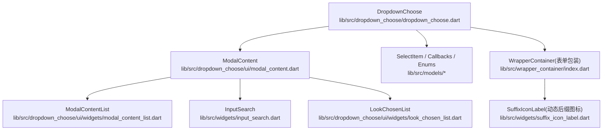
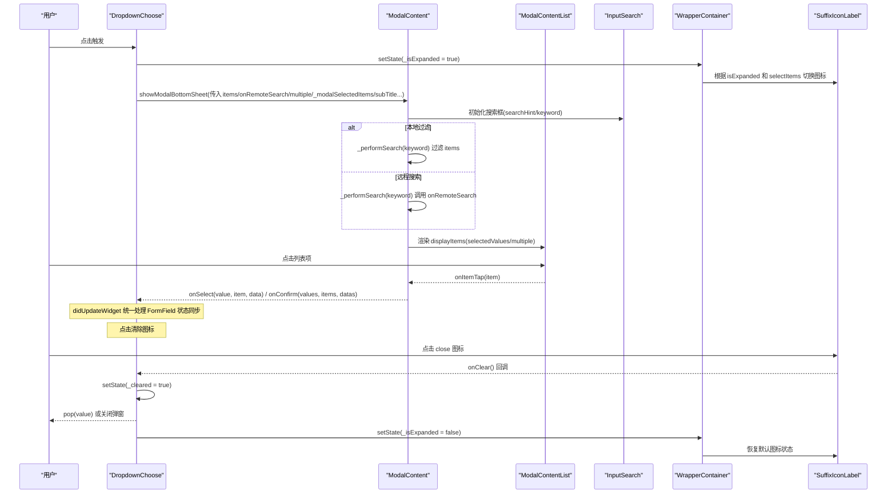
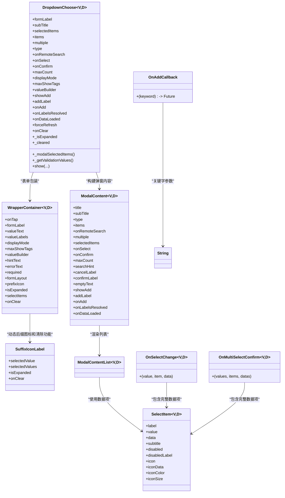

# DropdownChoose 下拉选择器 API

<cite>
**本文引用的文件**
- [lib/src/dropdown_choose/dropdown_choose.dart](file://lib/src/dropdown_choose/dropdown_choose.dart)
- [lib/src/dropdown_choose/ui/modal_content.dart](file://lib/src/dropdown_choose/ui/modal_content.dart)
- [lib/src/models/callbacks.dart](file://lib/src/models/callbacks.dart)
- [lib/src/models/select_item.dart](file://lib/src/models/select_item.dart)
- [lib/src/dropdown_choose/models/index.dart](file://lib/src/dropdown_choose/models/index.dart)
- [lib/src/wrapper_container/index.dart](file://lib/src/wrapper_container/index.dart)
- [lib/src/widgets/suffix_icon_label.dart](file://lib/src/widgets/suffix_icon_label.dart)
- [example/lib/pages/back.dart](file://example/lib/pages/back.dart)
- [example/lib/pages/select_modal_demo.dart](file://example/lib/pages/select_modal_demo.dart)
</cite>

## 更新摘要
**所做更改**
- **新增 subTitle 属性**：为 DropdownChoose 组件添加了副标题/描述文本支持，提升表单用户体验
- **增强状态管理**：改进了 `_modalSelectedItems()` 方法，提供更精确的选中项处理逻辑
- **优化验证逻辑**：通过 `_getValidationValues()` 方法实现更准确的验证值获取
- **改进表单集成**：增强了与 Flutter FormField 的集成，支持描述性文本和更好的状态同步

## 目录
1. [简介](#简介)
2. [项目结构](#项目结构)
3. [核心组件与参数总览](#核心组件与参数总览)
4. [架构概览](#架构概览)
5. [详细组件分析](#详细组件分析)
6. [依赖关系分析](#依赖关系分析)
7. [性能与优化建议](#性能与优化建议)
8. [故障排查指南](#故障排查指南)
9. [结论](#结论)
10. [附录：API 参考](#附录api-参考)

## 简介
DropdownChoose 是一个支持单选与多选的 Flutter 下拉选择器，提供本地过滤与远程搜索两种模式，内置表单校验、值显示模式（文本/标签/紧凑）、禁用项、占位提示、新增按钮、查看已选弹窗等能力。通过统一的 show 静态方法可快速弹出底部选择面板，适用于表单字段与独立弹窗场景。

**最新更新**：组件新增了 `subTitle` 属性，支持在表单标签下方显示描述性文本，提升了表单的用户体验和信息密度。同时改进了状态管理和验证逻辑，使组件更加稳定和易用。

## 项目结构
- 组件入口与状态管理：lib/src/dropdown_choose/dropdown_choose.dart
- 弹窗内容实现：lib/src/dropdown_choose/ui/modal_content.dart
- 数据模型与回调类型：lib/src/models/select_item.dart、lib/src/models/callbacks.dart
- 枚举定义（布局、显示模式等）：lib/src/dropdown_choose/models/index.dart
- 包装容器与动态图标：lib/src/wrapper_container/index.dart、lib/src/widgets/suffix_icon_label.dart
- 已选项查看弹窗：lib/src/dropdown_choose/ui/widgets/look_chosen_list.dart
- 示例用法：example/lib/pages/back.dart、example/lib/pages/select_modal_demo.dart



**图表来源**
- [lib/src/dropdown_choose/dropdown_choose.dart:11-160](file://lib/src/dropdown_choose/dropdown_choose.dart#L11-L160)
- [lib/src/dropdown_choose/ui/modal_content.dart:22-133](file://lib/src/dropdown_choose/ui/modal_content.dart#L22-L133)
- [lib/src/wrapper_container/index.dart:14-77](file://lib/src/wrapper_container/index.dart#L14-L77)
- [lib/src/widgets/suffix_icon_label.dart:3-10](file://lib/src/widgets/suffix_icon_label.dart#L3-L10)

## 核心组件与参数总览
- 组件类：DropdownChoose<V, D>
- 弹窗内容：ModalContent<V, D>
- 列表渲染：ModalContentList<V, D>
- 已选项弹窗：LookChosenList<V>
- 数据项：SelectItem<V, D>
- 回调类型：OnSelectChange、OnMultiSelectConfirm、RemoteSearchCallback、OnAddCallback
- 枚举：SelectType、DisplayMode、FormLayout

关键能力
- 单选/多选：multiple、onSelect、onConfirm、maxCount
- 搜索过滤：type=filterable 时本地过滤；type=remote 时 onRemoteSearch 异步搜索
- 数据源：items（本地模式必填）
- 已选项：**selectedItems**（统一的数据源，替代原来的 value 和 selectedValues）
- 禁用项：SelectItem.disabled、disabledLabel
- 占位提示：hintText
- 值显示：displayMode(text/tags/compact)、maxShowTags、valueBuilder
- 新增功能：showAdd、addLabel、onAdd（使用新的 OnAddCallback 类型）
- 远程解析：onLabelsResolved、onDataLoaded、forceRefresh
- 清除功能：onClear 回调支持点击关闭图标时的清除操作
- 智能状态管理：_isExpanded 和 _cleared 状态确保弹窗与外部状态同步
- 动态图标显示：根据选择状态和弹窗展开状态智能切换右侧图标
- FormField 状态同步：确保表单验证和回显正常工作
- 增强验证支持：validator 参数支持自定义验证逻辑
- **新增描述文本：subTitle 属性支持在表单标签下方显示描述信息**

## 架构概览
DropdownChoose 作为表单字段封装，点击后调用 show 打开底部弹窗 ModalContent，内部根据 type 决定本地过滤或远程搜索，并通过 ModalContentList 渲染列表，结合 InputSearch 完成搜索交互。

**更新**：组件现在维护 `_isExpanded` 和 `_cleared` 状态变量，在弹窗打开时设置为 true，关闭时重置为 false。API 已重构，移除了 value 属性，统一使用 selectedItems 作为已选项数据源。onConfirm 回调的参数顺序已更新为 (values, items, datas)。新增的 `subTitle` 属性支持在弹窗中显示描述性文本。



**图表来源**
- [lib/src/dropdown_choose/dropdown_choose.dart:430-477](file://lib/src/dropdown_choose/dropdown_choose.dart#L430-L477)
- [lib/src/dropdown_choose/dropdown_choose.dart:308-325](file://lib/src/dropdown_choose/dropdown_choose.dart#L308-L325)
- [lib/src/dropdown_choose/ui/modal_content.dart:166-237](file://lib/src/dropdown_choose/ui/modal_content.dart#L166-L237)
- [lib/src/wrapper_container/index.dart:121](file://lib/src/wrapper_container/index.dart#L121)
- [lib/src/widgets/suffix_icon_label.dart:30-32](file://lib/src/widgets/suffix_icon_label.dart#L30-L32)

## 详细组件分析

### DropdownChoose 组件
- 表单集成：FormField 包装，支持 required、validator、autovalidateMode、formLayout、prefixIcon、onSaved
- 值显示：text/tags/compact 三种模式，支持自定义 valueBuilder
- 弹窗行为：show 静态方法统一入口，支持 title/subTitle/searchHint/cancelLabel/confirmLabel/emptyText 等
- 远程缓存：首次加载成功非空结果会缓存，避免重复请求；可通过 forceRefresh 强制刷新
- 清除功能：onClear 回调支持点击关闭图标时的清除操作，内部维护 `_cleared` 状态
- 智能状态管理：_cleared 状态确保弹窗与外部状态同步，通过 `_modalSelectedItems()` 方法传递正确的选中项
- 弹窗状态管理：新增 `_isExpanded` 状态变量，控制弹窗展开状态
- 动态图标支持：通过 WrapperContainer 的 `isExpanded`、`selectItems` 参数传递状态
- FormField 状态同步：通过 `didUpdateWidget` 统一处理所有状态变更，确保表单验证和回显正常工作
- 增强验证支持：validator 参数支持自定义验证逻辑，清除状态验证逻辑优化
- **新增描述文本：subTitle 属性支持在表单标签下方显示描述性文本**

**更新**：组件已完成 API 重构，移除了 value 属性，统一使用 selectedItems 作为已选项数据源。onConfirm 回调的参数顺序已更新为 (values, items, datas)。组件现在维护弹窗展开状态和清除状态，并在 WrapperContainer 中传递相关参数以实现动态后缀图标显示和清除功能。**新增了 subTitle 属性，支持在表单标签下方显示描述性文本**。

**章节来源**
- [lib/src/dropdown_choose/dropdown_choose.dart:11-160](file://lib/src/dropdown_choose/dropdown_choose.dart#L11-L160)
- [lib/src/dropdown_choose/dropdown_choose.dart:308-325](file://lib/src/dropdown_choose/dropdown_choose.dart#L308-L325)
- [lib/src/dropdown_choose/dropdown_choose.dart:430-477](file://lib/src/dropdown_choose/dropdown_choose.dart#L430-L477)
- [lib/src/dropdown_choose/dropdown_choose.dart:453-472](file://lib/src/dropdown_choose/dropdown_choose.dart#L453-L472)

### ModalContent 弹窗内容
- 模式切换：type=filter 本地过滤；type=remote 远程搜索
- 搜索流程：_performSearch 统一入口，远程模式设置 isLoading，本地模式直接过滤 label/subtitle
- 选中状态：selectedValues 集合维护，多选达到 maxCount 限制不再新增
- 已选项回显：selectedItems 优先使用，否则从搜索结果中匹配并缓存到 _selectedItemMap
- 新增按钮：search 无结果时展示，点击后 onAdd(keyword) 完成后自动刷新列表
- 查看已选：弹窗内展示已选 label，支持移除
- **新增描述文本：subTitle 属性支持在弹窗顶部显示描述性文本**

**更新**：弹窗现在通过 `_modalSelectedItems()` 方法接收正确的选中项，确保清除后弹窗能正确显示空状态。onConfirm 回调的参数顺序已更新为 (values, items, datas)。**新增了 subTitle 属性的支持，可以在弹窗顶部显示描述性文本**。

**章节来源**
- [lib/src/dropdown_choose/ui/modal_content.dart:136-237](file://lib/src/dropdown_choose/ui/modal_content.dart#L136-237)
- [lib/src/dropdown_choose/ui/modal_content.dart:324-332](file://lib/src/dropdown_choose/ui/modal_content.dart#L324-332)

### WrapperContainer 包装容器
- 表单布局：统一包装表单标签、值显示区域和后缀图标
- 动态后缀图标：通过 `isExpanded`、`selectItems` 参数控制图标显示
- 清除功能支持：通过 `onClear` 参数传递清除回调，支持点击关闭图标时的清除操作
- 错误处理：支持错误文本显示和样式应用
- 响应式布局：支持 row/column 两种布局方式
- 强类型泛型支持：重构为 WrapperContainer<V, D>，提供更好的类型安全

**更新**：WrapperContainer 现在是强类型的泛型类 WrapperContainer<V, D>，新增了对弹窗展开状态和选择状态的监听，动态切换右侧图标样式并支持清除操作。

**章节来源**
- [lib/src/wrapper_container/index.dart:14-77](file://lib/src/wrapper_container/index.dart#L14-L77)
- [lib/src/wrapper_container/index.dart:121](file://lib/src/wrapper_container/index.dart#L121)

### SuffixIconLabel 动态后缀图标
- 智能图标切换：根据选择状态和弹窗展开状态显示不同图标
- 状态判断逻辑：
  - 有选中值：显示红色关闭图标 (Icons.close)，支持点击清除
  - 弹窗展开中：显示向下箭头 (Icons.keyboard_arrow_down_rounded)
  - 未展开且无选中值：显示向右箭头 (Icons.keyboard_arrow_right_rounded)
- 颜色自适应：选中值时红色系，未选中时蓝色系
- 背景色变化：选中值时浅红色背景，未选中时灰色背景
- 清除功能：当有选中值且传递了 onClear 回调时，点击关闭图标触发清除操作

**更新**：这是本次更新的核心特性之一，为用户提供直观的清除操作体验。

**章节来源**
- [lib/src/widgets/suffix_icon_label.dart:3-8](file://lib/src/widgets/suffix_icon_label.dart#L3-L8)
- [lib/src/widgets/suffix_icon_label.dart:19-27](file://lib/src/widgets/suffix_icon_label.dart#L19-L27)
- [lib/src/widgets/suffix_icon_label.dart:30-32](file://lib/src/widgets/suffix_icon_label.dart#L30-L32)

### 数据模型与回调
- SelectItem：label/value/data/subtitle/disabled/disabledLabel/icon/iconData/iconColor/iconSize
- OnSelectChange：**已更新**为 `void Function(V value, SelectItem<V, D> item, D? data)`，包含完整的 SelectItem 参数
- OnMultiSelectConfirm：**已更新**为 `void Function(List<V> values, List<SelectItem<V, D>> items, List<D?> datas)`，参数顺序优化，items 放在中间位置
- RemoteSearchCallback：远程搜索回调，返回 List<SelectItem>
- **OnAddCallback：新增**为 `Future<bool?> Function(String keyword)`，用于新增功能的异步回调
- DisplayMode：text/tags/compact
- FormLayout：row/column

**更新**：回调签名已经增强，现在提供了更完整的数据访问能力。OnSelectChange 现在可以访问完整的 SelectItem 对象，而不仅仅是 value 和 data。OnMultiSelectConfirm 的参数顺序经过优化，将最常用的 items 参数放在中间位置。**新增了 OnAddCallback 类型，为新增功能提供了更清晰的回调定义**。

**章节来源**
- [lib/src/models/select_item.dart:9-51](file://lib/src/models/select_item.dart#L9-L51)
- [lib/src/models/callbacks.dart:3-16](file://lib/src/models/callbacks.dart#L3-L16)
- [lib/src/dropdown_choose/models/index.dart:1-9](file://lib/src/dropdown_choose/models/index.dart#L1-L9)

### 事件回调与示例
- **onSelect**：**已更新**，点击项时触发，现在接收 (value, item, data) 三个参数，其中 item 是完整的 SelectItem 对象
- **onConfirm**：**已更新**，多选确认时触发，现在接收 (values, items, datas) 三个参数，参数顺序优化
- onRemoteSearch：远程搜索回调
- onLabelsResolved：远程模式下解析出已选项 label 的映射回调
- onDataLoaded：首次加载成功且非空时的数据回调，便于外部缓存
- **onClear**：点击清除图标时触发，用于清空当前选中值
- **onAdd**：**新增**，使用新的 OnAddCallback 类型，支持异步新增操作

**更新**：新增了 onClear 回调，支持点击关闭图标时的清除操作，提升了用户的操作体验。**最重要的是，onSelect 和 onConfirm 的回调签名已经增强，现在可以访问完整的数据项信息**。新增了 onAdd 回调，使用新的 OnAddCallback 类型来处理新增功能。

示例路径
- 单选/多选基础用法：[example/lib/pages/back.dart:176-269](file://example/lib/pages/back.dart#L176-L269)
- 远程搜索弹窗用法：[example/lib/pages/select_modal_demo.dart:134-153](file://example/lib/pages/select_modal_demo.dart#L134-L153)

**章节来源**
- [lib/src/models/callbacks.dart:3-16](file://lib/src/models/callbacks.dart#L3-L16)
- [lib/src/dropdown_choose/dropdown_choose.dart:453-472](file://lib/src/dropdown_choose/dropdown_choose.dart#L453-L472)
- [lib/src/dropdown_choose/ui/modal_content.dart:324-332](file://lib/src/dropdown_choose/ui/modal_content.dart#L324-332)
- [example/lib/pages/back.dart:176-269](file://example/lib/pages/back.dart#L176-L269)
- [example/lib/pages/select_modal_demo.dart:134-153](file://example/lib/pages/select_modal_demo.dart#L134-L153)

### 远程数据加载与缓存
- 首次加载：remote 模式下 onRemoteSearch('') 获取初始数据
- 缓存策略：onDataLoaded 回调返回的数据会被 DropdownChoose 缓存，后续打开直接使用
- 强制刷新：forceRefresh=true 时不使用缓存，每次打开重新请求

**更新**：缓存机制更加智能，仅在首次加载成功且数据非空时缓存，失败或空数据不会缓存。

**章节来源**
- [lib/src/dropdown_choose/ui/modal_content.dart:182-229](file://lib/src/dropdown_choose/ui/modal_content.dart#L182-L229)
- [lib/src/dropdown_choose/dropdown_choose.dart:445-452](file://lib/src/dropdown_choose/dropdown_choose.dart#L445-L452)

### 新增功能与查看已选
- 新增按钮：search 无结果时展示，点击后 onAdd(keyword) 完成后自动刷新列表
- 查看已选：弹窗内展示已选 label 列表，支持移除操作

**章节来源**
- [lib/src/dropdown_choose/ui/modal_content.dart:288-295](file://lib/src/dropdown_choose/ui/modal_content.dart#L288-295)

### 清除功能详解
- **触发条件**：当组件有选中值时，后缀图标显示为红色的关闭图标 (Icons.close)
- **清除逻辑**：点击关闭图标时，设置 `_cleared = true` 并清空内部缓存的选中项
- **状态同步**：通过 `_modalSelectedItems()` 方法确保弹窗正确感知清除状态
- **回调机制**：触发外部的 `onClear` 回调，供父组件处理清除逻辑
- **状态重置**：当外部 `selectedItems` 发生变化时，自动重置 `_cleared` 状态
- **FormField 状态同步**：清除后立即调用 `didChange('')` 确保验证能正确触发失败

**新增功能**：这是本次更新的核心特性，为用户提供直观的清除操作体验。

**章节来源**
- [lib/src/dropdown_choose/dropdown_choose.dart:419-429](file://lib/src/dropdown_choose/dropdown_choose.dart#L419-L429)
- [lib/src/dropdown_choose/dropdown_choose.dart:335-345](file://lib/src/dropdown_choose/dropdown_choose.dart#L335-L345)
- [lib/src/widgets/suffix_icon_label.dart:30-32](file://lib/src/widgets/suffix_icon_label.dart#L30-L32)

### FormField 状态同步机制
- **统一状态管理**：通过 `didUpdateWidget` 生命周期方法统一处理所有状态变更
- **onChange 同步**：在 onSelect、onConfirm、onClear 回调中设置内部状态后，由 `didUpdateWidget` 统一调用 `didChange` 同步 FormField 状态
- **验证触发**：确保表单验证能正确识别清除操作和值变更
- **回显修复**：解决表单验证后选择数据时回显异常的问题

**更新**：这是本次更新的核心修复，解决了表单验证后回显异常和清除后验证不生效两个关键问题。

**章节来源**
- [lib/src/dropdown_choose/dropdown_choose.dart:308-325](file://lib/src/dropdown_choose/dropdown_choose.dart#L308-L325)
- [lib/src/dropdown_choose/dropdown_choose.dart:453-472](file://lib/src/dropdown_choose/dropdown_choose.dart#L453-L472)

### 验证功能详解
- **validator 参数**：支持自定义验证函数，返回 null 表示验证通过，返回字符串表示验证失败的提示文字
- **清除状态验证**：当 `_cleared` 为 true 时，验证函数会收到 null 值，确保清除操作后验证能正确触发失败
- **单选模式验证**：validator 接收 widget.selectedItems?.firstOrNull?.value.toString() 作为参数
- **多选模式验证**：validator 接收 effectiveValues.join(',') 作为参数，空集合时传递 null
- **默认验证规则**：required 为 true 时，未选择任何值会显示"是必填项不能为空"的错误提示
- **自动验证模式**：通过 autovalidateMode 控制验证触发的时机
- **改进的验证值获取**：通过 `_getValidationValues()` 方法提供更准确的验证值

**新增功能**：这是本次更新的核心特性，提供了完整的表单验证支持，能够处理各种复杂的验证场景。**改进了验证值的获取逻辑，确保验证的准确性**。

**章节来源**
- [lib/src/dropdown_choose/dropdown_choose.dart:104-111](file://lib/src/dropdown_choose/dropdown_choose.dart#L104-L111)
- [lib/src/dropdown_choose/dropdown_choose.dart:347-372](file://lib/src/dropdown_choose/dropdown_choose.dart#L347-L372)

### 描述文本功能详解
- **subTitle 属性**：支持在表单标签下方显示描述性文本
- **弹窗描述文本**：在弹窗顶部显示描述信息，帮助用户理解选择器的用途
- **表单布局适配**：在不同表单布局下都能正确显示描述文本
- **样式一致性**：描述文本使用统一的样式和间距

**新增功能**：这是本次更新的重要特性，为表单提供了更好的用户体验和信息传达能力。

**章节来源**
- [lib/src/dropdown_choose/dropdown_choose.dart:52-53](file://lib/src/dropdown_choose/dropdown_choose.dart#L52-L53)
- [lib/src/dropdown_choose/ui/modal_content.dart:26-27](file://lib/src/dropdown_choose/ui/modal_content.dart#L26-L27)

## 依赖关系分析
- DropdownChoose 依赖 ModalContent 进行弹窗内容组织
- ModalContent 依赖 ModalContentList 渲染列表与空态
- 搜索交互依赖 InputSearch
- **WrapperContainer 依赖 SuffixIconLabel 实现动态图标和清除功能**
- 数据模型与回调类型集中定义于 models 目录

**更新**：新增了 WrapperContainer 与 SuffixIconLabel 的依赖关系，形成完整的动态图标显示和清除功能链路。**WrapperContainer 现在是一个强类型的泛型类，提供了更好的类型安全性**。



**图表来源**
- [lib/src/dropdown_choose/dropdown_choose.dart:11-160](file://lib/src/dropdown_choose/dropdown_choose.dart#L11-L160)
- [lib/src/dropdown_choose/ui/modal_content.dart:22-133](file://lib/src/dropdown_choose/ui/modal_content.dart#L22-L133)
- [lib/src/wrapper_container/index.dart:14-77](file://lib/src/wrapper_container/index.dart#L14-L77)
- [lib/src/widgets/suffix_icon_label.dart:3-10](file://lib/src/widgets/suffix_icon_label.dart#L3-L10)
- [lib/src/models/select_item.dart:9-51](file://lib/src/models/select_item.dart#L9-L51)
- [lib/src/models/callbacks.dart:3-16](file://lib/src/models/callbacks.dart#L3-L16)

## 性能与优化建议
- 大列表渲染：当前使用 ListView.builder，按需构建列表项，适合中等规模数据；若数据量极大，可在上层对 items 分页或虚拟滚动（例如使用第三方包），或在 onRemoteSearch 中做服务端分页与增量加载
- 搜索性能：本地过滤基于 label/subtitle 包含匹配，时间复杂度 O(n)，建议在客户端保持合理数据量；远程搜索应配合防抖与后端分页
- 缓存策略：利用 onDataLoaded 与 forceRefresh 控制缓存命中与失效，减少重复请求
- 渲染优化：避免在 itemBuilder 中创建昂贵 Widget，尽量复用或提前构建；图标与样式通过 SelectItem.icon/iconData 传递，减少重建开销
- **状态管理优化**：_isExpanded 和 _cleared 状态变更仅影响 WrapperContainer 的重建，影响范围最小化
- **清除操作优化**：清除操作通过 setState 局部更新，避免不必要的组件重建
- **FormField 状态同步优化**：通过 didUpdateWidget 统一处理状态同步，避免重复调用 didChange
- **验证性能优化**：validator 函数应避免执行耗时操作，必要时使用防抖或异步验证
- **回调性能优化**：新的回调签名虽然提供了更多数据，但要注意避免在回调中进行大量计算，必要时使用防抖或异步处理
- **描述文本优化**：subTitle 属性不影响核心渲染性能，仅在需要时显示

## 故障排查指南
- 远程模式必须传 onRemoteSearch，本地模式必须传 items：组件构造与 show 均有断言校验
- onConfirm 仅在 multiple=true 时有效，maxCount 必须大于 0 且仅在多选模式有效
- 搜索无结果时，remote 模式显示"请输入关键字搜索"，本地模式显示"无匹配数据"
- 禁用项不可点击，检查 SelectItem.disabled 与 disabledLabel 配置
- **动态图标异常**：检查 WrapperContainer 的 isExpanded、selectItems 参数是否正确传递
- **弹窗状态不同步**：确认 DropdownChoose 的 _isExpanded 状态在弹窗打开和关闭时正确更新
- **清除功能异常**：检查 onClear 回调是否正确传递，确认 _cleared 状态在外部值变化时正确重置
- **FormField 状态同步问题**：确认 didUpdateWidget 中的状态同步逻辑正常工作，检查 mounted 状态和 WidgetsBinding 调用
- **验证功能异常**：检查 validator 函数是否正确处理 null 值和空集合情况
- **自动验证不触发**：确认 autovalidateMode 参数设置正确，检查 FormField 的验证逻辑
- **回调签名不兼容**：如果升级后出现编译错误，需要更新 onSelect 和 onConfirm 回调的签名以匹配新的参数格式
- **描述文本不显示**：确认 subTitle 属性是否正确传递，检查表单布局是否支持描述文本显示

**更新**：新增了对清除功能、弹窗状态同步、验证功能和回调签名相关的故障排查指导，以及新增的描述文本功能的故障排查。

**章节来源**
- [lib/src/dropdown_choose/dropdown_choose.dart:40-48](file://lib/src/dropdown_choose/dropdown_choose.dart#L40-L48)
- [lib/src/dropdown_choose/ui/modal_content.dart:120-125](file://lib/src/dropdown_choose/ui/modal_content.dart#L120-L125)

## 结论
DropdownChoose 提供了完善的下拉选择能力，覆盖表单集成、本地/远程搜索、多选限制、值显示定制、禁用项与占位提示、新增与查看已选等功能。**最新版本新增了 subTitle 属性，支持在表单标签下方显示描述性文本，提升了用户体验**。同时改进了状态管理和验证逻辑，使组件更加稳定和易用。**最重要的改进是回调签名的增强**，现在 OnSelectChange 和 OnMultiSelectConfirm 都提供了完整的数据项支持，让开发者能够更方便地访问选中项的详细信息。通过合理的缓存与搜索策略，可在大列表与远程数据场景下获得良好性能与用户体验。

**更新总结**：新增的 subTitle 属性为表单提供了更好的用户体验和信息传达能力。**最重要的是，统一的 selectedItems 数据和优化的回调签名使组件更加易于使用和扩展**。

## 附录：API 参考

### DropdownChoose 主要参数
- formLabel：表单标签
- **subTitle**：**新增**，表单副标题/描述文本，显示在表单标签下方
- **selectedItems**：**已更新**，已选中项的完整数据（单选/多选统一使用），替代原来的 value 和 selectedValues
- items：选项列表（本地模式必填）
- prefixIcon：前置图标
- hintText：占位提示文字
- required：是否必填
- multiple：是否多选
- **type**：**已更新**，现在使用 SelectType.filter 或 SelectType.remote
- onRemoteSearch：远程搜索回调
- **onSelect**：**已更新**，现在接收 (value, item, data) 三个参数，其中 item 是完整的 SelectItem 对象
- **onConfirm**：**已更新**，现在接收 (values, items, datas) 三个参数，参数顺序优化
- maxCount：多选最大数量
- displayMode：值显示模式（text/tags/compact）
- maxShowTags：compact 模式最多显示 tag 数
- valueBuilder：自定义值显示构建器
- showAdd/addLabel/**onAdd**：新增按钮相关，onAdd 现在使用新的 OnAddCallback 类型
- onLabelsResolved：远程模式下已选项 label 解析回调
- forceRefresh：强制刷新开关
- **onClear**：点击清除图标回调，用于清空当前选中值
- **validator**：自定义验证函数，返回 null 表示验证通过，返回字符串表示验证失败提示
- **autovalidateMode**：自动验证模式，控制验证触发时机
- onSaved/formLayout/prefixIcon：表单相关

**更新**：新增了 subTitle 属性，支持在表单标签下方显示描述性文本。**最重要的是，value 属性已被移除，统一使用 selectedItems**，onSelect 和 onConfirm 的回调签名已经增强。**type 参数现在使用 SelectType 枚举**。

**章节来源**
- [lib/src/dropdown_choose/dropdown_choose.dart:11-160](file://lib/src/dropdown_choose/dropdown_choose.dart#L11-L160)
- [lib/src/dropdown_choose/dropdown_choose.dart:181-255](file://lib/src/dropdown_choose/dropdown_choose.dart#L181-L255)

### ModalContent 主要参数
- title/subTitle：标题与副标题
- type/items/onRemoteSearch：模式与数据源
- multiple/selectedItems：多选与已选项（已更新，移除了 selectedValues）
- **onSelect/onConfirm/maxCount**：**已更新**，回调签名增强，支持完整数据项
- searchHint/cancelLabel/confirmLabel/emptyText：搜索与按钮文案
- showAdd/addLabel/**onAdd**：新增按钮，onAdd 使用新的 OnAddCallback 类型
- onLabelsResolved/onDataLoaded：远程解析与数据加载回调

**章节来源**
- [lib/src/dropdown_choose/ui/modal_content.dart:22-133](file://lib/src/dropdown_choose/ui/modal_content.dart#L22-L133)

### WrapperContainer 新增参数
- **isExpanded**：弹窗展开状态，控制后缀图标显示
- **selectItems**：选中的项目列表，用于显示值（替代原来的 selectedValue/selectedValues）
- **onClear**：清除回调，点击关闭图标时触发

**新增功能**：这些参数用于实现动态后缀图标显示和清除功能，根据用户交互状态智能切换图标并支持清除操作。**WrapperContainer 现在是强类型的泛型类 WrapperContainer<V, D>**。

**章节来源**
- [lib/src/wrapper_container/index.dart:50-77](file://lib/src/wrapper_container/index.dart#L50-L77)

### SuffixIconLabel 组件
- **hasValue**：是否有选中值
- **isExpanded**：弹窗展开状态
- **onClear**：清除回调，点击关闭图标时触发

**图标显示逻辑**：
- 有选中值：显示红色关闭图标，支持点击清除
- 弹窗展开中：显示向下箭头
- 未展开且无选中值：显示向右箭头

**新增组件**：专门用于实现动态后缀图标的显示逻辑和清除功能。

**章节来源**
- [lib/src/widgets/suffix_icon_label.dart:3-10](file://lib/src/widgets/suffix_icon_label.dart#L3-L10)
- [lib/src/widgets/suffix_icon_label.dart:19-27](file://lib/src/widgets/suffix_icon_label.dart#L19-L27)
- [lib/src/widgets/suffix_icon_label.dart:30-32](file://lib/src/widgets/suffix_icon_label.dart#L30-L32)

### SelectItem 数据项字段
- label/value/data/subtitle/disabled/disabledLabel/icon/iconData/iconColor/iconSize

**章节来源**
- [lib/src/models/select_item.dart:9-51](file://lib/src/models/select_item.dart#L9-L51)

### 回调类型
- **OnSelectChange<V,D>(value, item, data)**：**已更新**，现在包含完整的 SelectItem 参数
- **OnMultiSelectConfirm<V,D>(values, items, datas)**：**已更新**，参数顺序优化，items 放在中间位置
- RemoteSearchCallback<V,D>(keyword) -> Future<List<SelectItem>>
- **OnAddCallback(keyword) -> Future<bool?>**：**新增**，用于新增功能的异步回调

**章节来源**
- [lib/src/models/callbacks.dart:3-16](file://lib/src/models/callbacks.dart#L3-L16)

### 枚举
- **SelectType**：**已更新**，原 SelectModalType 重命名为 SelectType，包含 filter 和 remote 两个值
- DisplayMode：text/tags/compact
- FormLayout：row/column

**章节来源**
- [lib/src/dropdown_choose/models/index.dart:1-9](file://lib/src/dropdown_choose/models/index.dart#L1-L9)

### 使用示例路径
- 单选/多选基础用法：[example/lib/pages/back.dart:176-269](file://example/lib/pages/back.dart#L176-L269)
- 远程搜索弹窗用法：[example/lib/pages/select_modal_demo.dart:134-153](file://example/lib/pages/select_modal_demo.dart#L134-L153)

**更新说明**：所有现有示例都自动支持新的清除功能、验证功能和动态图标功能，无需修改代码即可体验增强的用户体验。**但是需要注意，如果使用旧的回调签名，需要进行相应的更新**。

### 增强的回调签名使用示例
```dart
// 使用增强的 onSelect 回调
DropdownChoose<String, int>(
  formLabel: '选择城市',
  subTitle: '请选择您所在的城市', // 新增描述文本
  selectedItems: const [
    SelectItem(label: '北京', value: 'bj', data: 1),
  ],
  items: const [
    SelectItem(label: '北京', value: 'bj', data: 1),
    SelectItem(label: '上海', value: 'sh', data: 2),
  ],
  onSelect: (value, item, data) {
    // 现在可以直接访问完整的 SelectItem 对象
    print('选中的值: $value');
    print('完整的项: ${item.label} - ${item.subtitle}');
    print('原始数据: $data');
    
    setState(() {
      // 更新 selectedItems 而不是 value
      _selectedCity = value;
    });
  },
),

// 使用增强的 onConfirm 回调
DropdownChoose<String, int>(
  formLabel: '选择城市',
  subTitle: '请选择多个城市',
  multiple: true,
  selectedItems: const [
    SelectItem(label: '北京', value: 'bj', data: 1),
    SelectItem(label: '上海', value: 'sh', data: 2),
  ],
  items: const [
    SelectItem(label: '北京', value: 'bj', data: 1),
    SelectItem(label: '上海', value: 'sh', data: 2),
  ],
  onConfirm: (values, items, datas) {
    // 现在可以直接访问完整的 items 列表
    print('选中的值列表: $values');
    print('完整的项列表: ${items.map((i) => i.label).join(', ')}');
    print('原始数据列表: $datas');
    
    setState(() {
      _selectedCities = values.toSet();
    });
  },
),

// 使用新的 OnAddCallback
DropdownChoose<String, int>(
  formLabel: '选择城市',
  subTitle: '支持新增城市',
  showAdd: true,
  addLabel: '新增城市',
  onAdd: (keyword) async {
    // 处理新增逻辑
    final success = await addNewCity(keyword);
    return success ? true : null; // 返回 true 表示成功，null 表示取消
  },
),
```

**新增示例**：展示了如何使用增强的回调签名来访问完整的数据项信息，以及如何使用新的 OnAddCallback 类型来实现新增功能。**新增了 subTitle 属性的使用示例，展示了如何在表单中添加描述性文本**。