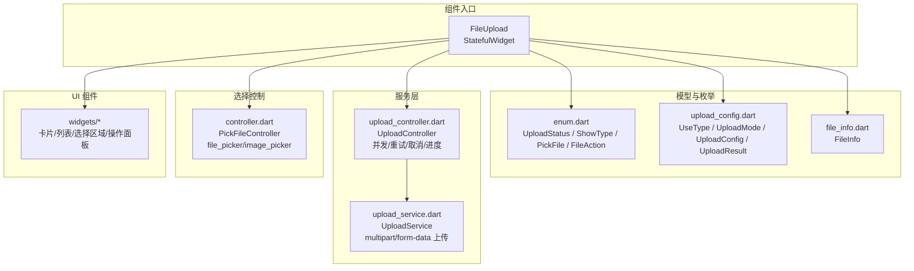
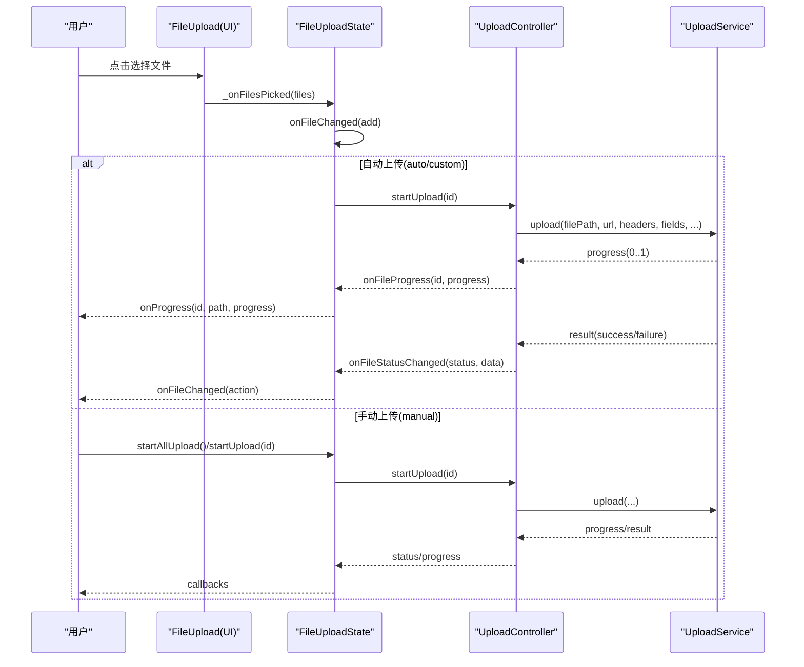
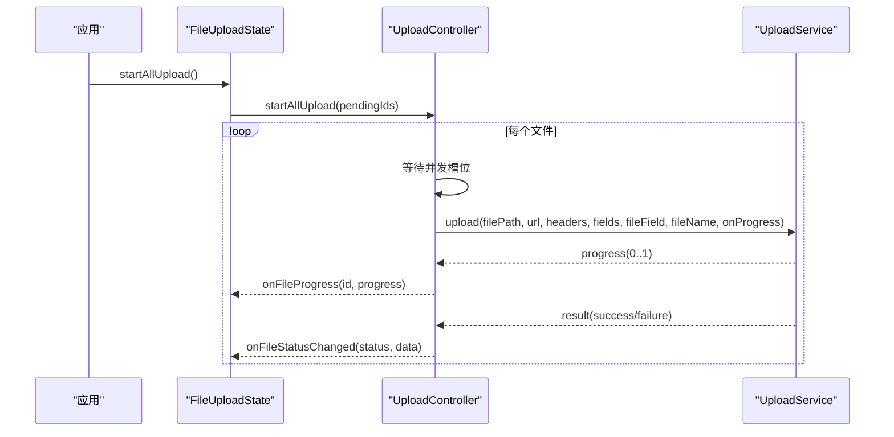
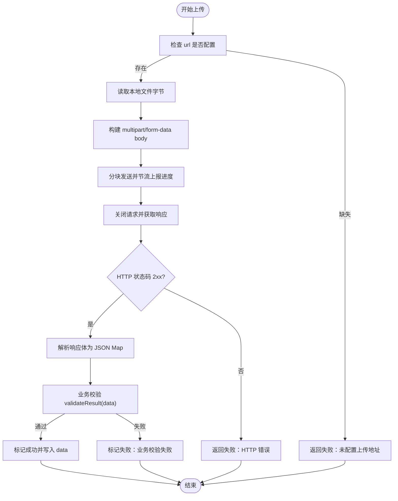
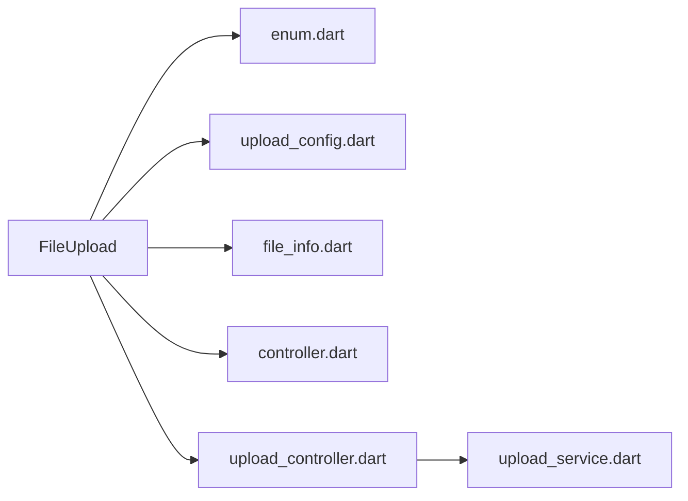

# FileUpload 文件上传组件 API

<cite>
**本文引用的文件**   
- [file_upload.dart](file://lib/src/file_upload/file_upload.dart)
- [enum.dart](file://lib/src/file_upload/model/enum.dart)
- [upload_config.dart](file://lib/src/file_upload/model/upload_config.dart)
- [file_info.dart](file://lib/src/file_upload/model/file_info.dart)
- [controller.dart](file://lib/src/file_upload/controller.dart)
- [upload_controller.dart](file://lib/src/file_upload/service/upload_controller.dart)
- [upload_service.dart](file://lib/src/file_upload/service/upload_service.dart)
- [index.dart](file://lib/src/file_upload/index.dart)
- [lite_ui.dart](file://lib/lite_ui.dart)
- [readme.md](file://lib/src/file_upload/readme.md)
</cite>

## 目录
1. [简介](#简介)
2. [项目结构](#项目结构)
3. [核心组件](#核心组件)
4. [架构总览](#架构总览)
5. [详细组件分析](#详细组件分析)
6. [依赖关系分析](#依赖关系分析)
7. [性能与内存优化建议](#性能与内存优化建议)
8. [故障排查指南](#故障排查指南)
9. [结论](#结论)
10. [附录：API 参考](#附录api-参考)

## 简介
FileUpload 是一个轻量级 Flutter 文件上传组件，支持文件选择、图片选择、拍照上传，提供卡片/列表/自定义三种展示模式，内置自动上传、手动上传、自定义上传三种模式。组件通过枚举控制选择器行为（PickFile）、上传模式（UploadMode）和文件状态（UploadStatus），并提供完善的回调机制（onProgress、onFileChanged）以及手动上传控制方法（startUpload、startAllUpload、cancelUpload）。同时支持头像模式（UseType.avatar）与编辑模式回显（fileList）。

## 项目结构
FileUpload 组件位于 lib/src/file_upload 目录下，按功能分层组织：
- model：数据模型与枚举（FileInfo、UploadConfig、枚举定义）
- service：上传控制器与服务（并发控制、重试、进度上报、内置 HTTP 上传）
- widgets：UI 组件（卡片/列表展示、选择区域、操作面板等）
- controller：文件选择控制器（封装 file_picker 与 image_picker）
- file_upload.dart：组件入口与状态管理
- index.dart：对外统一导出

图表来源
- [file_upload.dart:15-165](file://lib/src/file_upload/file_upload.dart#L15-L165)
- [enum.dart:1-105](file://lib/src/file_upload/model/enum.dart#L1-L105)
- [upload_config.dart:1-139](file://lib/src/file_upload/model/upload_config.dart#L1-L139)
- [file_info.dart:1-140](file://lib/src/file_upload/model/file_info.dart#L1-L140)
- [upload_controller.dart:1-163](file://lib/src/file_upload/service/upload_controller.dart#L1-L163)
- [upload_service.dart:1-183](file://lib/src/file_upload/service/upload_service.dart#L1-L183)
- [controller.dart:1-68](file://lib/src/file_upload/controller.dart#L1-L68)

章节来源
- [index.dart:1-6](file://lib/src/file_upload/index.dart#L1-L6)
- [lite_ui.dart:1-19](file://lib/lite_ui.dart#L1-L19)

## 核心组件
- FileUpload StatefulWidget：对外暴露所有配置项与回调，内部维护文件列表与上传控制器实例，负责 UI 构建与状态同步。
- FileInfo：文件信息模型，包含 id、name、path、url、size、status、source、progress、data 等字段，并提供 isImage、formatSize 等只读属性。
- UploadConfig：上传配置，包含 mode、url、method、headers、fields、fileField、maxConcurrent、retryCount、customUpload、validateResult。
- UploadController：上传流程控制器，负责并发限制、重试、取消、进度上报、内置/自定义上传分发。
- UploadService：内置 HTTP 上传服务，使用 multipart/form-data 发送请求并处理响应。
- PickFileController：封装文件选择逻辑，统一返回 FileInfo 列表。

章节来源
- [file_upload.dart:15-165](file://lib/src/file_upload/file_upload.dart#L15-L165)
- [file_info.dart:1-140](file://lib/src/file_upload/model/file_info.dart#L1-L140)
- [upload_config.dart:1-139](file://lib/src/file_upload/model/upload_config.dart#L1-L139)
- [upload_controller.dart:1-163](file://lib/src/file_upload/service/upload_controller.dart#L1-L163)
- [upload_service.dart:1-183](file://lib/src/file_upload/service/upload_service.dart#L1-L183)
- [controller.dart:1-68](file://lib/src/file_upload/controller.dart#L1-L68)

## 架构总览
FileUpload 的架构遵循“UI 层 - 控制器层 - 服务层”的分层设计：
- UI 层（FileUpload + widgets）：负责渲染与用户交互，调用 State 公开方法触发上传或取消。
- 控制器层（UploadController + PickFileController）：协调文件选择与上传生命周期，管理并发与重试。
- 服务层（UploadService）：执行网络请求与 I/O 操作，上报进度与结果。

图表来源
- [file_upload.dart:280-383](file://lib/src/file_upload/file_upload.dart#L280-L383)
- [upload_controller.dart:36-122](file://lib/src/file_upload/service/upload_controller.dart#L36-L122)
- [upload_service.dart:23-135](file://lib/src/file_upload/service/upload_service.dart#L23-L135)

## 详细组件分析

### 文件选择配置（PickFile）
- 枚举值：file（文件）、gallery（相册）、camera（拍照）、imageOrCamera（相册或拍照）、all（全部）
- 在头像模式下，pickFile 仅支持 gallery/camera/imageOrCamera；若未明确指定，默认 imageOrCamera
- 选择器由 PickFileController 统一封装，根据 multiple 与 allowedExtensions 进行过滤与裁剪

章节来源
- [enum.dart:73-89](file://lib/src/file_upload/model/enum.dart#L73-L89)
- [file_upload.dart:245-253](file://lib/src/file_upload/file_upload.dart#L245-L253)
- [controller.dart:17-67](file://lib/src/file_upload/controller.dart#L17-L67)

### 上传模式（UploadMode）
- auto：选择文件后自动开始上传，需提供 url
- manual：手动触发上传，需调用 startUpload/startAllUpload
- custom：完全自定义上传函数，需提供 customUpload，适合已有网络库封装

章节来源
- [upload_config.dart:19-29](file://lib/src/file_upload/model/upload_config.dart#L19-L29)
- [file_upload.dart:282-289](file://lib/src/file_upload/file_upload.dart#L282-L289)

### 文件限制与验证规则
- limit：-1 表示不限制，正整数为上限；达到上限后上传按钮隐藏
- multiple：是否多选，头像模式强制 false
- allowedExtensions：仅在 PickFile.file 时生效，用于扩展名过滤
- previewSize 与 columns 互斥，二者只能设置其一

章节来源
- [file_upload.dart:27-33](file://lib/src/file_upload/file_upload.dart#L27-L33)
- [file_upload.dart:156-161](file://lib/src/file_upload/file_upload.dart#L156-L161)
- [controller.dart:17-34](file://lib/src/file_upload/controller.dart#L17-L34)

### 构造函数参数详解
- pickFile：选择器类型
- multiple：是否多选
- limit：数量上限
- allowedExtensions：允许扩展名
- showType：card/textInfo/custom
- previewSize：固定尺寸（正方形），与 columns 互斥
- columns：列数，与 previewSize 互斥
- spacing：卡片间距（columns 模式生效）
- alignment：对齐方式（固定尺寸模式生效）
- borderRadius：外层容器圆角
- fileRadius：文件内容圆角
- title：上传按钮提示文字
- icon：自定义图标
- uploadConfig：上传配置
- fileList：初始文件列表（编辑模式回显）
- onFileChanged：文件变更回调
- onProgress：上传进度回调
- itemBuilder：自定义文件项构建器（ShowType.custom）
- uploadButtonBuilder：自定义上传按钮构建器
- actionDecoration：上传按钮区域装饰样式
- actionTitleStyle：上传按钮文字样式
- useType：normal/avatar（头像模式）
- showFileName：显示文件名与大小

章节来源
- [file_upload.dart:15-161](file://lib/src/file_upload/file_upload.dart#L15-L161)

### 文件状态管理（UploadStatus）
- pending：待上传
- uploading：上传中
- success：成功
- failed：失败
- 状态变化通过 onFileChanged 回调通知，action 包括 defaultLoad/add/remove/uploading/progress/success/failed

章节来源
- [enum.dart:1-14](file://lib/src/file_upload/model/enum.dart#L1-L14)
- [enum.dart:49-71](file://lib/src/file_upload/model/enum.dart#L49-L71)
- [file_upload.dart:341-375](file://lib/src/file_upload/file_upload.dart#L341-L375)

### 进度回调（onProgress）与文件变更回调（onFileChanged）
- onProgress：参数为 (id, path, progress)，在上传过程中周期性触发
- onFileChanged：参数为 (files, action)，在添加/删除/上传状态变化时触发

章节来源
- [file_upload.dart:67-70](file://lib/src/file_upload/file_upload.dart#L67-L70)
- [file_upload.dart:365-375](file://lib/src/file_upload/file_upload.dart#L365-L375)

### 手动上传控制方法
- startUpload(id)：上传指定文件
- startAllUpload()：上传所有待上传文件
- cancelUpload(id)：取消指定文件上传，恢复为 pending

章节来源
- [file_upload.dart:306-337](file://lib/src/file_upload/file_upload.dart#L306-L337)

### 头像模式（UseType.avatar）特殊配置
- 内部覆盖 limit=1、multiple=false、pickFile=imageOrCamera（若未明确指定）
- 禁用删除与成功徽章显示，简化 UI

章节来源
- [upload_config.dart:5-17](file://lib/src/file_upload/model/upload_config.dart#L5-L17)
- [file_upload.dart:236-253](file://lib/src/file_upload/file_upload.dart#L236-L253)
- [file_upload.dart:476-478](file://lib/src/file_upload/file_upload.dart#L476-L478)

### 编辑模式（fileList）数据回显
- 传入已存在文件列表，组件初始化直接展示
- url 以 http 开头自动识别为 success 状态，source=network
- 外部 fileList 引用变化时会同步更新内部列表，避免重复触发父组件 rebuild

章节来源
- [file_info.dart:70-78](file://lib/src/file_upload/model/file_info.dart#L70-L78)
- [file_upload.dart:190-234](file://lib/src/file_upload/file_upload.dart#L190-L234)

### 上传流程时序图（手动上传）

图表来源
- [file_upload.dart:321-326](file://lib/src/file_upload/file_upload.dart#L321-L326)
- [upload_controller.dart:54-57](file://lib/src/file_upload/service/upload_controller.dart#L54-L57)
- [upload_service.dart:23-135](file://lib/src/file_upload/service/upload_service.dart#L23-L135)

### 复杂逻辑流程图（内置上传）

图表来源
- [upload_service.dart:23-135](file://lib/src/file_upload/service/upload_service.dart#L23-L135)
- [upload_controller.dart:137-161](file://lib/src/file_upload/service/upload_controller.dart#L137-L161)

## 依赖关系分析
- FileUpload 依赖枚举与模型（enum.dart、upload_config.dart、file_info.dart）
- FileUpload 依赖选择控制器（controller.dart）与上传控制器（upload_controller.dart）
- UploadController 依赖上传服务（upload_service.dart）
- 对外通过 index.dart 统一导出，供 lite_ui.dart 聚合导出

图表来源
- [file_upload.dart:1-14](file://lib/src/file_upload/file_upload.dart#L1-L14)
- [upload_controller.dart:1-8](file://lib/src/file_upload/service/upload_controller.dart#L1-L8)
- [upload_service.dart:1-7](file://lib/src/file_upload/service/upload_service.dart#L1-L7)
- [index.dart:1-6](file://lib/src/file_upload/index.dart#L1-L6)
- [lite_ui.dart:1-19](file://lib/lite_ui.dart#L1-L19)

章节来源
- [file_upload.dart:1-14](file://lib/src/file_upload/file_upload.dart#L1-L14)
- [upload_controller.dart:1-8](file://lib/src/file_upload/service/upload_controller.dart#L1-L8)
- [upload_service.dart:1-7](file://lib/src/file_upload/service/upload_service.dart#L1-L7)
- [index.dart:1-6](file://lib/src/file_upload/index.dart#L1-L6)
- [lite_ui.dart:1-19](file://lib/lite_ui.dart#L1-L19)

## 性能与内存优化建议
- 合理设置 maxConcurrent：避免过多并发导致内存峰值过高与网络拥塞
- 使用节流进度上报：内置实现已对进度上报进行节流，避免频繁刷新 UI
- 大文件分块上传：内置上传采用分块发送，减少单次内存占用
- 及时释放资源：上传完成后确保连接关闭，避免 Socket/HttpClient 泄漏
- 避免不必要的重建：外部 fileList 引用变化时使用稳定标识比较，防止无效 setState
- Web 平台注意：内置上传基于 dart:io，Web 平台不可用，应使用 UploadMode.custom

章节来源
- [upload_service.dart:82-104](file://lib/src/file_upload/service/upload_service.dart#L82-L104)
- [upload_service.dart:131-134](file://lib/src/file_upload/service/upload_service.dart#L131-L134)
- [file_upload.dart:190-212](file://lib/src/file_upload/file_upload.dart#L190-L212)

## 故障排查指南
- 未配置 url：内置上传将返回失败，请检查 UploadConfig.url
- 文件路径为空：无法上传，确认文件选择成功后 path 不为空
- 业务校验失败：validateResult 返回 false 将标记失败，检查服务端响应格式
- 网络连接异常：SocketException/HttpException 捕获并记录日志
- 并发阻塞：activeUploadCount 接近 maxConcurrent 时，上传会等待

章节来源
- [upload_controller.dart:137-161](file://lib/src/file_upload/service/upload_controller.dart#L137-L161)
- [upload_service.dart:122-134](file://lib/src/file_upload/service/upload_service.dart#L122-L134)

## 结论
FileUpload 提供了完整的文件选择与上传能力，涵盖多种展示模式与上传模式，具备健壮的状态管理与回调机制。通过合理的配置与优化策略，可在多端场景下获得良好的用户体验与性能表现。

## 附录：API 参考

### FileUpload 参数表
- pickFile：PickFile，默认 all
- multiple：bool，默认 true
- limit：int，默认 -1
- allowedExtensions：List<String>?，默认 null
- showType：ShowType，默认 card
- previewSize：double?，默认 null
- columns：int?，默认 3
- spacing：double，默认 10
- alignment：WrapAlignment，默认 start
- borderRadius：double，默认 7
- fileRadius：double，默认 7
- title：String，默认 '点击上传'
- icon：Widget?，默认 null
- uploadConfig：UploadConfig?，默认 null
- fileList：List<FileInfo>?，默认 null
- onFileChanged：Function(List<FileInfo>, FileAction)?，默认 null
- onProgress：void Function(String id, String path, double progress)?，默认 null
- itemBuilder：Widget Function(FileInfo, int, VoidCallback)?，默认 null
- uploadButtonBuilder：Widget Function(VoidCallback)?，默认 null
- actionDecoration：BoxDecoration?，默认 null
- actionTitleStyle：TextStyle?，默认 null
- useType：UseType，默认 normal
- showFileName：bool，默认 true

章节来源
- [file_upload.dart:15-161](file://lib/src/file_upload/file_upload.dart#L15-L161)

### FileUploadState 公开方法
- startUpload(id)：上传指定文件
- startAllUpload()：上传所有待上传文件
- cancelUpload(id)：取消指定文件上传
- updateFileStatus(id, status)：手动更新文件状态
- files：当前文件列表（只读）

章节来源
- [file_upload.dart:296-337](file://lib/src/file_upload/file_upload.dart#L296-L337)

### UploadConfig 参数表
- mode：UploadMode，必填
- url：String?，auto/manual 时必填
- method：String，默认 POST
- headers：Map<String, String>?，默认 null
- fields：Map<String, String>?，默认 null
- fileField：String，默认 'file'
- maxConcurrent：int，默认 3
- retryCount：int，默认 0
- customUpload：Future<UploadResult> Function(FileInfo, void Function(double))?, custom 时必填
- validateResult：bool Function(Map<String, dynamic>?)?, 默认 null

章节来源
- [upload_config.dart:38-98](file://lib/src/file_upload/model/upload_config.dart#L38-L98)

### FileInfo 模型字段
- id：String，唯一标识
- name：String，文件名
- path：String?，本地路径
- url：String?，网络地址
- size：int，文件大小
- status：UploadStatus，上传状态
- source：FileSource，文件来源
- progress：double，上传进度
- data：Map<String, dynamic>?，扩展数据
- formatSize：String，格式化大小（只读）
- isImage：bool，是否为图片（只读）

章节来源
- [file_info.dart:10-78](file://lib/src/file_upload/model/file_info.dart#L10-L78)

### 枚举值说明
- PickFile：file/gallery/camera/imageOrCamera/all
- ShowType：card/textInfo/custom
- UploadMode：auto/manual/custom
- UploadStatus：pending/uploading/success/failed
- FileAction：defaultLoad/add/remove/uploading/progress/success/failed

章节来源
- [enum.dart:1-105](file://lib/src/file_upload/model/enum.dart#L1-L105)

### 使用示例参考
- 基础用法与展示模式、编辑模式回显、手动上传、自定义上传函数等示例可参考 readme.md

章节来源
- [readme.md:40-184](file://lib/src/file_upload/readme.md#L40-L184)
- [readme.md:186-267](file://lib/src/file_upload/readme.md#L186-L267)