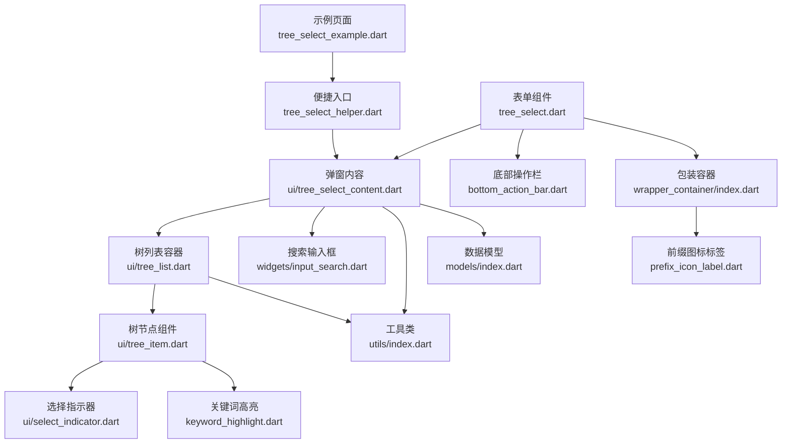
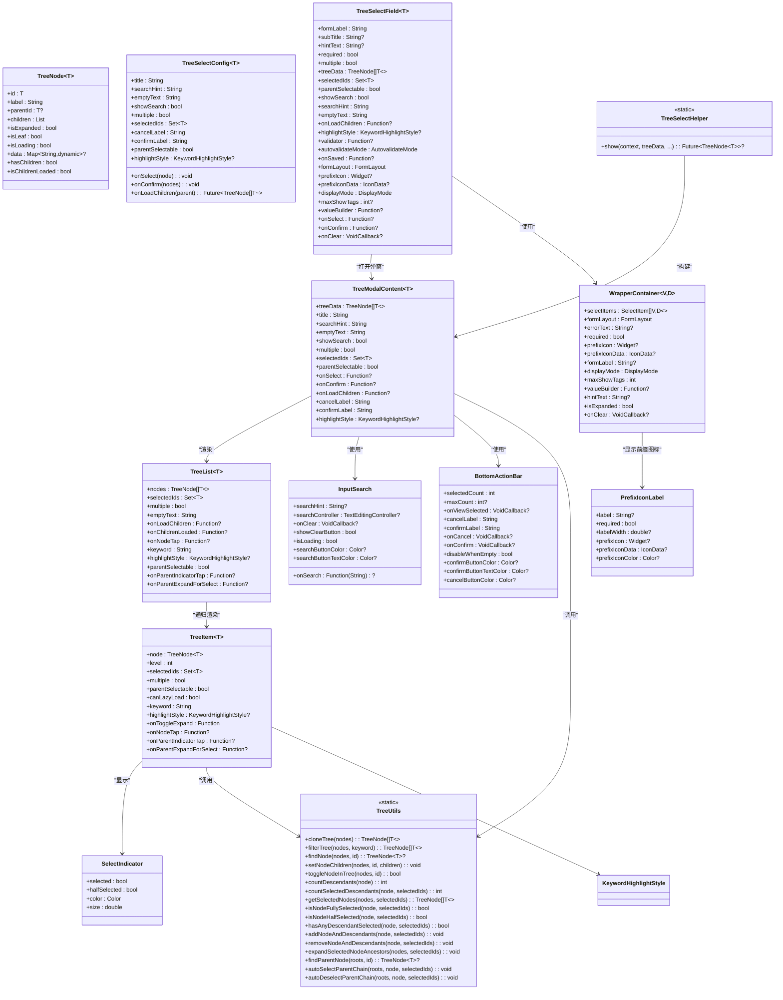
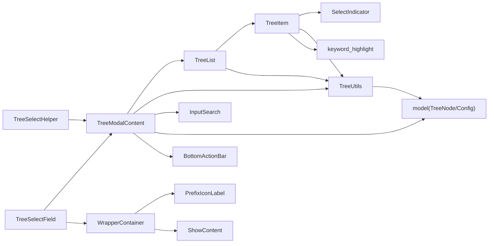

# TreeSelect 树形选择器 API

<cite>
**本文引用的文件**   
- [tree_select.dart](file://lib/src/tree_select/tree_select.dart)
- [tree_select_helper.dart](file://lib/src/tree_select/tree_select_helper.dart)
- [models/index.dart](file://lib/src/tree_select/models/index.dart)
- [ui/tree_select_content.dart](file://lib/src/tree_select/ui/tree_select_content.dart)
- [ui/tree_list.dart](file://lib/src/tree_select/ui/tree_list.dart)
- [ui/tree_item.dart](file://lib/src/tree_select/ui/tree_item.dart)
- [ui/select_indicator.dart](file://lib/src/tree_select/ui/select_indicator.dart)
- [utils/index.dart](file://lib/src/tree_select/utils/index.dart)
- [widgets/input_search.dart](file://lib/src/widgets/input_search.dart)
- [bottom_action_bar.dart](file://lib/src/widgets/bottom_action_bar.dart)
- [keyword_highlight.dart](file://lib/src/widgets/keyword_highlight.dart)
- [prefix_icon_label.dart](file://lib/src/widgets/prefix_icon_label.dart)
- [wrapper_container/index.dart](file://lib/src/wrapper_container/index.dart)
- [dropdown_choose.dart](file://lib/src/dropdown_choose/dropdown_choose.dart)
- [tree_select_example.dart](file://example/lib/pages/tree_select_example.dart)
</cite>

## 更新摘要

**变更内容**

- **架构重构**：tree_list.dart被拆分为tree_item.dart和select_indicator.dart，实现了更好的职责分离
- **InputSearch API简化**：移除了keyword参数，采用事件驱动模式
- **新增独立组件**：TreeItem专注于单个节点渲染，SelectIndicator专注三态选择指示器
- **性能优化**：更细粒度的状态管理和渲染优化

## 目录

1. [简介](#简介)
2. [项目结构](#项目结构)
3. [核心组件](#核心组件)
4. [架构总览](#架构总览)
5. [详细组件分析](#详细组件分析)
6. [依赖关系分析](#依赖关系分析)
7. [性能与大数据优化](#性能与大数据优化)
8. [故障排查指南](#故障排查指南)
9. [结论](#结论)
10. [附录：API 参考与示例](#附录api-参考与示例)

## 简介

TreeSelect 是一个支持单选/多选、搜索过滤、关键字高亮、懒加载与父节点联动选择的树形选择器。经过重大重构后，现在提供统一的 `show<T>()` 便捷方法和全新的 `TreeSelectField` 表单组件，完美集成 Flutter 表单系统。组件采用"表单字段组件 + 弹窗内容"的现代化架构，既支持快速集成，也满足深度定制需求。

**最新更新**：组件架构进行了重大重构，tree_list.dart被拆分为tree_item.dart和select_indicator.dart两个独立组件，提供了更好的职责分离和代码复用。同时InputSearch API进行了简化，移除了keyword参数，采用事件驱动模式。

## 项目结构

TreeSelect 相关代码位于 lib/src/tree_select 目录下，采用清晰的模块化设计：

- `tree_select.dart`: 新的表单字段组件 TreeSelectField
- `tree_select_helper.dart`: 统一的便捷入口方法
- `ui/tree_select_content.dart`: 重构后的弹窗内容组件 TreeModalContent
- `ui/tree_list.dart`: 树形列表容器组件（负责数据流管理）
- `ui/tree_item.dart`: 单个树节点渲染组件（负责UI展示）
- `ui/select_indicator.dart`: 三态选择指示器组件（全/半选/未选）
- `models/index.dart`: 数据模型和配置类
- `utils/index.dart`: 树操作工具类
- `widgets/input_search.dart`: 简化的搜索输入框组件
- `widgets/prefix_icon_label.dart`: 前缀图标标签组件
- `wrapper_container/index.dart`: 包装容器组件



**图表来源**

- [tree_select_example.dart:1-369](file://example/lib/pages/tree_select_example.dart#L1-L369)
- [tree_select_helper.dart:1-79](file://lib/src/tree_select/tree_select_helper.dart#L1-L79)
- [ui/tree_select_content.dart:1-325](file://lib/src/tree_select/ui/tree_select_content.dart#L1-L325)
- [ui/tree_list.dart:1-156](file://lib/src/tree_select/ui/tree_list.dart#L1-L156)
- [ui/tree_item.dart:1-232](file://lib/src/tree_select/ui/tree_item.dart#L1-L232)
- [ui/select_indicator.dart:1-38](file://lib/src/tree_select/ui/select_indicator.dart#L1-L38)
- [utils/index.dart:1-243](file://lib/src/tree_select/utils/index.dart#L1-L243)
- [models/index.dart:1-123](file://lib/src/tree_select/models/index.dart#L1-L123)
- [tree_select.dart:1-428](file://lib/src/tree_select/tree_select.dart#L1-L428)
- [bottom_action_bar.dart:1-135](file://lib/src/widgets/bottom_action_bar.dart#L1-L135)
- [prefix_icon_label.dart:1-51](file://lib/src/widgets/prefix_icon_label.dart#L1-L51)
- [wrapper_container/index.dart:1-134](file://lib/src/wrapper_container/index.dart#L1-L134)
- [widgets/input_search.dart:1-145](file://lib/src/widgets/input_search.dart#L1-L145)

## 核心组件

- **TreeNode<T>**: 树节点数据模型，包含 id、label、parentId、children、isExpanded、isLeaf、isLoading、data 等字段
- **TreeSelectConfig<T>**: 选择器配置项，集中管理所有行为与外观配置
- **TreeSelectField<T>**: 新的表单字段组件，集成 FormField 和 WrapperContainer
- **TreeModalContent<T>**: 重构后的弹窗内容组件，专注展示和交互逻辑
- **TreeList<T>**: 树形列表容器组件，负责数据流管理和状态同步
- **TreeItem<T>**: 纯展示型树节点组件，递归渲染单个节点及其子树
- **SelectIndicator**: 三态选择指示器组件，支持全选、半选、未选状态
- **TreeUtils**: 静态工具类，提供树操作的无状态方法集合
- **TreeSelectHelper**: 统一的便捷入口，提供单一的 show<T>() 方法
- **BottomActionBar**: 通用的底部操作栏组件，支持已选数量展示和空选禁用
- **PrefixIconLabel**: 前缀图标标签组件，支持 prefixIcon 和 prefixIconData 两种方式
- **InputSearch**: 简化的搜索输入框组件，移除keyword参数，采用事件驱动

**章节来源**

- [models/index.dart:1-123](file://lib/src/tree_select/models/index.dart#L1-L123)
- [tree_select.dart:1-428](file://lib/src/tree_select/tree_select.dart#L1-L428)
- [ui/tree_select_content.dart:1-325](file://lib/src/tree_select/ui/tree_select_content.dart#L1-L325)
- [ui/tree_list.dart:1-156](file://lib/src/tree_select/ui/tree_list.dart#L1-L156)
- [ui/tree_item.dart:1-232](file://lib/src/tree_select/ui/tree_item.dart#L1-L232)
- [ui/select_indicator.dart:1-38](file://lib/src/tree_select/ui/select_indicator.dart#L1-L38)
- [utils/index.dart:1-243](file://lib/src/tree_select/utils/index.dart#L1-L243)
- [tree_select_helper.dart:1-79](file://lib/src/tree_select/tree_select_helper.dart#L1-L79)
- [bottom_action_bar.dart:1-135](file://lib/src/widgets/bottom_action_bar.dart#L1-L135)
- [prefix_icon_label.dart:1-51](file://lib/src/widgets/prefix_icon_label.dart#L1-L51)
- [widgets/input_search.dart:1-145](file://lib/src/widgets/input_search.dart#L1-L145)

## 架构总览

TreeSelect 采用现代化的"表单字段 + 弹窗内容"分层架构，完全对齐 DropdownChoose 的设计模式：



**图表来源**

- [models/index.dart:1-123](file://lib/src/tree_select/models/index.dart#L1-L123)
- [tree_select.dart:1-428](file://lib/src/tree_select/tree_select.dart#L1-L428)
- [ui/tree_select_content.dart:1-325](file://lib/src/tree_select/ui/tree_select_content.dart#L1-L325)
- [ui/tree_list.dart:1-156](file://lib/src/tree_select/ui/tree_list.dart#L1-L156)
- [ui/tree_item.dart:1-232](file://lib/src/tree_select/ui/tree_item.dart#L1-L232)
- [ui/select_indicator.dart:1-38](file://lib/src/tree_select/ui/select_indicator.dart#L1-L38)
- [utils/index.dart:1-243](file://lib/src/tree_select/utils/index.dart#L1-L243)
- [tree_select_helper.dart:1-79](file://lib/src/tree_select/tree_select_helper.dart#L1-L79)
- [bottom_action_bar.dart:1-135](file://lib/src/widgets/bottom_action_bar.dart#L1-L135)
- [prefix_icon_label.dart:1-51](file://lib/src/widgets/prefix_icon_label.dart#L1-L51)
- [wrapper_container/index.dart:1-134](file://lib/src/wrapper_container/index.dart#L1-L134)
- [widgets/input_search.dart:1-145](file://lib/src/widgets/input_search.dart#L1-L145)

## 详细组件分析

### 数据模型与配置（TreeNode / TreeSelectConfig）

- **TreeNode<T>**: 描述树节点结构与状态，isLeaf=false 且 children 为空表示待懒加载；isExpanded 控制展开；isLoading 控制加载态；data 用于扩展附加信息
- **TreeSelectConfig<T>**: 集中配置选择器行为与外观，包括 title、searchHint、emptyText、showSearch、multiple、selectedIds、onSelect、onConfirm、onLoadChildren、cancelLabel、confirmLabel、parentSelectable、highlightStyle

**章节来源**

- [models/index.dart:1-123](file://lib/src/tree_select/models/index.dart#L1-L123)

### 统一便捷入口（TreeSelectHelper）

- **show<T>()**: 统一的显示方法，通过 multiple 参数区分单选和多选模式
  - 单选模式：选中节点后自动关闭，返回该节点，取消返回 null
  - 多选模式：通过 onConfirm 回调返回选中节点列表
- 内部通过 showModalBottomSheet 构建 TreeModalContent，设置高度约束与 SafeArea
- 支持所有配置选项：selectedIds 预选中、onSelect/onConfirm 回调、onLoadChildren 懒加载、高亮样式等

**章节来源**

- [tree_select_helper.dart:1-79](file://lib/src/tree_select/tree_select_helper.dart#L1-L79)

### 表单字段组件（TreeSelectField）

- **TreeSelectField<T>**: 全新的表单字段组件，完全集成 Flutter FormField
- 核心特性：
  - 支持单选和多选模式
  - 集成 WrapperContainer 提供默认 UI
  - 完整的表单校验和保存功能
  - 灵活的显示模式（text/compact/tags）
  - 自定义值构建器和图标配置
- State 管理：
  - 维护内部选中状态（\_selectedNode/\_selectedNodes）
  - 同步外部 selectedIds 变化
  - 处理清除状态和验证逻辑
  - 弹窗展开/折叠状态管理

**最新更新**：新增了 `prefixIconData` 属性，允许直接传递 IconData 数据作为前缀图标，与 DropdownChoose 组件保持一致的 API 设计。

**章节来源**

- [tree_select.dart:1-428](file://lib/src/tree_select/tree_select.dart#L1-428)

### 前缀图标标签组件（PrefixIconLabel）

- **PrefixIconLabel**: 专门处理前缀图标和标签显示的组件
- 核心特性：
  - 支持两种图标方式：`prefixIcon`（Widget）和 `prefixIconData`（IconData）
  - 互斥验证：确保只能传递其中一个图标方式
  - 支持必填标记显示
  - 可配置的图标颜色和大小
  - 响应式布局适配

**新增功能**：支持 `prefixIconData` 属性，当传递 IconData 时自动创建 Icon 组件，大小为 20，颜色可通过 `prefixIconColor` 配置。

**章节来源**

- [prefix_icon_label.dart:1-51](file://lib/src/widgets/prefix_icon_label.dart#L1-L51)

### 包装容器组件（WrapperContainer）

- **WrapperContainer<V, D>**: 统一的表单字段包装容器
- 核心特性：
  - 集成 PrefixIconLabel 显示前缀图标和标签
  - 支持多种值显示模式
  - 错误状态处理和边框样式
  - 后缀图标区域独立于点击区域
- 图标支持：
  - 同时支持 `prefixIcon` 和 `prefixIconData` 属性
  - 优先使用 Widget 类型的 prefixIcon
  - 回退到 IconData 类型的 prefixIconData

**更新**：新增了对 `prefixIconData` 属性的支持，在构建 PrefixIconLabel 时传递该属性。

**章节来源**

- [wrapper_container/index.dart:1-134](file://lib/src/wrapper_container/index.dart#L1-L134)

### 弹窗内容组件（TreeModalContent）

- **TreeModalContent<T>**: 重构后的纯弹窗内容组件，移除动画相关代码
- 核心功能：
  - 搜索过滤与关键词高亮
  - 树形列表渲染与交互
  - 懒加载子节点处理
  - 父子节点联动选择
  - 底部操作栏集成
- 状态管理：
  - \_searchController 搜索控制器
  - \_selectedIds 选中状态集合
  - \_filteredData 过滤后的数据
  - 祖先节点展开状态管理

**章节来源**

- [ui/tree_select_content.dart:1-325](file://lib/src/tree_select/ui/tree_select_content.dart#L1-L325)

### 树列表容器（TreeList）

- **TreeList<T>**: 重构后的树列表容器组件，专注于数据流管理和状态同步
- 核心功能：
  - 管理树数据的生命周期和状态同步
  - 处理懒加载逻辑和错误处理
  - 协调 TreeItem 组件的递归渲染
  - 监听数据变化并触发相应更新
- 状态管理：
  - 维护内部节点数据 `_nodes`
  - 处理 didUpdateWidget 中的数据同步
  - 管理展开/折叠状态的局部更新

**更新**：从原来的单一组件拆分为容器组件，专注于数据流管理，具体的节点渲染交给 TreeItem 组件处理。

**章节来源**

- [ui/tree_list.dart:1-156](file://lib/src/tree_select/ui/tree_list.dart#L1-L156)

### 树节点组件（TreeItem）

- **TreeItem<T>**: 新增的纯展示型树节点组件，负责单个节点的UI渲染
- 核心功能：
  - 递归渲染节点，支持展开/折叠箭头、加载指示器、子节点数量 badge
  - 选择指示器（全/半选/未选）三态显示
  - 懒加载：当 isLeaf=false 且 children 为空时，展开触发 onLoadChildren
  - 高亮文本：使用 buildHighlightedText 对 label 进行关键词匹配与高亮
  - 父节点可选模式：splitIndicator 将文本区与圆圈区分开，避免误触
  - 层级连接线：绘制实线直角引导线，清晰展示父子关系

**新增**：这是重构后新增的组件，专门负责单个节点的UI渲染，提高了代码的可维护性和复用性。

**章节来源**

- [ui/tree_item.dart:1-232](file://lib/src/tree_select/ui/tree_item.dart#L1-L232)

### 选择指示器（SelectIndicator）

- **SelectIndicator**: 新增的三态选择指示器组件，专门处理多选场景的选择状态显示
- 核心特性：
  - 全选状态：实心主色圆 + 白色对勾
  - 半选状态：实心主色圆 + 白色横线
  - 未选状态：灰色空心圆环
  - 可配置的颜色和尺寸
  - 纯展示型组件，无业务逻辑

**新增**：这是重构后新增的独立组件，将选择指示器的UI逻辑从TreeItem中分离出来，提高了代码的复用性。

**章节来源**

- [ui/select_indicator.dart:1-38](file://lib/src/tree_select/ui/select_indicator.dart#L1-L38)

### 简化的搜索输入框（InputSearch）

- **InputSearch**: 简化的搜索输入框组件，移除了keyword参数
- 核心特性：
  - 支持搜索图标、清除按钮、搜索按钮触发等功能
  - 输入内容不会自动触发搜索，需点击搜索按钮
  - 事件驱动的API设计，通过onSearch回调获取搜索关键词
  - 支持加载状态和自定义按钮样式
- API简化：
  - 移除了keyword参数
  - 采用onSearch回调传递搜索关键词
  - 更清晰的职责分离

**更新**：API进行了简化，移除了keyword参数，采用事件驱动模式，使组件更加简洁易用。

**章节来源**

- [widgets/input_search.dart:1-145](file://lib/src/widgets/input_search.dart#L1-L145)

### 工具类（TreeUtils）

- **TreeUtils**: 静态工具类，提供无状态的树操作方法
- 核心方法分类：
  - 树操作：cloneTree、filterTree、findNode、setNodeChildren、toggleNodeInTree
  - 统计与查询：countDescendants、countSelectedDescendants、getSelectedNodes
  - 选中状态：isNodeFullySelected、isNodeHalfSelected、hasAnyDescendantSelected
  - 批量操作：addNodeAndDescendants、removeNodeAndDescendants
  - 展开与联动：expandSelectedNodeAncestors、findParentNode、autoSelectParentChain、autoDeselectParentChain

**章节来源**

- [utils/index.dart:1-243](file://lib/src/tree_select/utils/index.dart#L1-L243)

### 底部操作栏（BottomActionBar）

- **BottomActionBar**: 通用的底部操作栏组件，被 TreeModalContent 复用
- 核心特性：
  - 已选数量展示："已选 N 项"或"已选 N/M 项"
  - 空选禁用确认按钮（可配置）
  - 查看已选项功能（点击数量提示）
  - 可配置的按钮颜色和样式
  - 响应式布局适配

**章节来源**

- [bottom_action_bar.dart:1-135](file://lib/src/widgets/bottom_action_bar.dart#L1-L135)

### 关键词高亮（KeywordHighlightStyle / buildHighlightedText）

- 支持 enabled、useThemeColor、color、backgroundColor、bold 等配置
- 通过正则匹配 keyword，生成 RichText 片段实现高亮
- 默认颜色为琥珀黄，可强制使用主题色或自定义背景

**章节来源**

- [keyword_highlight.dart:1-129](file://lib/src/widgets/keyword_highlight.dart#L1-L129)

## 依赖关系分析

- **TreeSelectHelper** 依赖 TreeModalContent 与 models 中的配置类型
- **TreeSelectField** 依赖 TreeModalContent、WrapperContainer 和 FormField
- **TreeModalContent** 依赖 TreeList、TreeUtils、models、keyword_highlight 和 input_search
- **TreeList** 依赖 TreeUtils、models 和 tree_item
- **TreeItem** 依赖 TreeUtils、models、keyword_highlight 和 select_indicator
- **SelectIndicator** 是独立的UI组件，无外部依赖
- **InputSearch** 依赖 clear_icon 组件
- **WrapperContainer** 依赖 PrefixIconLabel 和 ShowContent
- **PrefixIconLabel** 是独立的 UI 组件，无外部依赖



**图表来源**

- [tree_select_helper.dart:1-79](file://lib/src/tree_select/tree_select_helper.dart#L1-L79)
- [tree_select.dart:1-428](file://lib/src/tree_select/tree_select.dart#L1-L428)
- [ui/tree_select_content.dart:1-325](file://lib/src/tree_select/ui/tree_select_content.dart#L1-L325)
- [ui/tree_list.dart:1-156](file://lib/src/tree_select/ui/tree_list.dart#L1-L156)
- [ui/tree_item.dart:1-232](file://lib/src/tree_select/ui/tree_item.dart#L1-L232)
- [ui/select_indicator.dart:1-38](file://lib/src/tree_select/ui/select_indicator.dart#L1-L38)
- [utils/index.dart:1-243](file://lib/src/tree_select/utils/index.dart#L1-L243)
- [models/index.dart:1-123](file://lib/src/tree_select/models/index.dart#L1-L123)
- [bottom_action_bar.dart:1-135](file://lib/src/widgets/bottom_action_bar.dart#L1-L135)
- [prefix_icon_label.dart:1-51](file://lib/src/widgets/prefix_icon_label.dart#L1-L51)
- [wrapper_container/index.dart:1-134](file://lib/src/wrapper_container/index.dart#L1-L134)
- [widgets/input_search.dart:1-145](file://lib/src/widgets/input_search.dart#L1-L145)

## 性能与大数据优化

- **数据克隆与过滤**：每次搜索都会 cloneTree + filterTree，建议在大数据集上结合分页或虚拟滚动策略，减少一次性渲染量
- **懒加载**：通过 isLeaf=false 且 children 为空标识待加载，按需请求子节点，显著降低首屏内存占用
- **选中状态缓存**：使用 Set<T> 存储 selectedIds，O(1) 查找；联动父链时避免重复遍历
- **渲染优化**：
  - TreeList 使用 ListView.builder 惰性构建
  - TreeItem 作为独立组件，支持局部刷新
  - 展开/折叠与加载状态局部 setState，避免整树重建
  - SelectIndicator 作为纯展示组件，无状态开销
- **高亮性能**：keyword 为空时回退普通 Text，避免不必要的 RichText 构建
- **内存建议**：
  - 合理设置 maxHeight/minHeight，避免过高的底部面板导致大量节点渲染
  - 在 onLoadChildren 中限制单次返回的子节点数量，必要时分页加载
  - 避免在 data 中存放大对象，保持节点轻量
  - 利用 TreeItem 的独立性，避免不必要的组件重建

## 故障排查指南

- **搜索无结果**：检查 keyword 是否为空；确认 filterTree 是否正确执行；确保 label 大小写一致（内部已转小写比较）
- **懒加载不触发**：确认 isLeaf=false 且 children 为空；确保 onLoadChildren 非空；检查异常捕获分支是否隐藏 loading
- **父节点联动异常**：确认 parentSelectable 配置；检查 autoSelectParentChain/autoDeselectParentChain 是否被调用；确保 isChildrenLoaded 判断正确
- **高亮不生效**：检查 highlightStyle.enabled 是否为 true；确认 keyword 非空；验证 buildHighlightedText 参数传递
- **表单验证问题**：检查 validator 函数返回值；确认 required 属性设置；验证 onSaved 回调是否正常触发
- **BottomActionBar 按钮禁用**：确认 selectedCount > 0 或 disableWhenEmpty = false；检查 onConfirm 回调是否正确绑定
- **前缀图标不显示**：确认 prefixIcon 和 prefixIconData 只传递其中一个；检查 IconData 是否正确导入；验证 prefixIconColor 配置
- **选择指示器异常**：确认 multiple 模式启用；检查 parentSelectable 配置；验证 isNodeFullySelected/isNodeHalfSelected 计算逻辑
- **InputSearch 搜索无效**：确认 onSearch 回调已绑定；检查 searchController 是否正确初始化；验证 isLoading 状态

**章节来源**

- [ui/tree_select_content.dart:1-325](file://lib/src/tree_select/ui/tree_select_content.dart#L1-L325)
- [ui/tree_list.dart:1-156](file://lib/src/tree_select/ui/tree_list.dart#L1-L156)
- [ui/tree_item.dart:1-232](file://lib/src/tree_select/ui/tree_item.dart#L1-L232)
- [ui/select_indicator.dart:1-38](file://lib/src/tree_select/ui/select_indicator.dart#L1-L38)
- [utils/index.dart:1-243](file://lib/src/tree_select/utils/index.dart#L1-L243)
- [tree_select.dart:1-428](file://lib/src/tree_select/tree_select.dart#L1-L428)
- [bottom_action_bar.dart:1-135](file://lib/src/widgets/bottom_action_bar.dart#L1-L135)
- [prefix_icon_label.dart:1-51](file://lib/src/widgets/prefix_icon_label.dart#L1-L51)
- [widgets/input_search.dart:1-145](file://lib/src/widgets/input_search.dart#L1-L145)

## 结论

TreeSelect 经过重大重构后，提供了更加现代化和一致的 API 设计。新的架构完全对齐 DropdownChoose 的使用模式，通过 TreeSelectField 表单组件和统一的 show<T>() 方法，既简化了使用方式，又增强了表单集成能力。BottomActionBar 的复用进一步提升了组件的一致性和可维护性。针对大数据场景，推荐结合懒加载与分页策略，以获得更优的性能体验。

**最新改进**：

- **架构重构**：tree_list.dart被拆分为tree_item.dart和select_indicator.dart，实现了更好的职责分离和代码复用
- **API简化**：InputSearch组件移除了keyword参数，采用事件驱动模式，使API更加简洁
- **性能优化**：TreeItem作为独立组件，支持局部刷新和更好的性能表现
- **新增功能**：SelectIndicator提供专门的三态选择指示器，TreeItem支持层级连接线显示

## 附录：API 参考与示例

### TreeSelectHelper 统一方法

- **show<T>()**: 统一的显示方法，支持单选和多选模式
  - 参数：context、treeData、title、searchHint、emptyText、showSearch、multiple、parentSelectable、selectedIds、onSelect、onConfirm、onLoadChildren、cancelLabel、confirmLabel、highlightStyle、各种颜色配置
  - 单选模式：multiple=false，选中后返回节点，取消返回 null
  - 多选模式：multiple=true，通过 onConfirm 回调返回选中节点列表

**章节来源**

- [tree_select_helper.dart:1-79](file://lib/src/tree_select/tree_select_helper.dart#L1-L79)

### TreeSelectField 表单组件参数

- **基础参数**：formLabel、subTitle、hintText、required、multiple、treeData、selectedIds
- **显示配置**：parentSelectable、showSearch、searchHint、emptyText、highlightStyle、title、各种按钮文字和颜色
- **表单集成**：validator、autovalidateMode、onSaved、formLayout、prefixIcon、prefixIconData、displayMode、maxShowTags、valueBuilder
- **回调函数**：onSelect（单选）、onConfirm（多选）、onClear

**最新更新**：新增 `prefixIconData` 参数，支持直接传递 IconData 数据作为前缀图标。

**章节来源**

- [tree_select.dart:1-428](file://lib/src/tree_select/tree_select.dart#L1-428)

### PrefixIconLabel 前缀图标标签参数

- **基础参数**：label、required、labelWidth
- **图标配置**：prefixIcon（Widget）、prefixIconData（IconData）、prefixIconColor（Color）
- **验证规则**：prefixIcon 和 prefixIconData 只能传递其中一个

**新增功能**：支持 `prefixIconData` 属性，当传递 IconData 时自动创建 Icon 组件。

**章节来源**

- [prefix_icon_label.dart:1-51](file://lib/src/widgets/prefix_icon_label.dart#L1-L51)

### WrapperContainer 包装容器参数

- **数据参数**：selectItems、valueText、hintText、errorText
- **显示配置**：displayMode、maxShowTags、valueBuilder、formLayout
- **图标配置**：prefixIcon、prefixIconData、required
- **交互配置**：onTap、isExpanded、onClear

**更新**：新增对 `prefixIconData` 属性的支持。

**章节来源**

- [wrapper_container/index.dart:1-134](file://lib/src/wrapper_container/index.dart#L1-L134)

### TreeModalContent 弹窗组件参数

- **数据配置**：treeData、selectedIds、onLoadChildren
- **显示配置**：title、searchHint、emptyText、showSearch、multiple、parentSelectable
- **交互配置**：onSelect、onConfirm、cancelLabel、confirmLabel
- **样式配置**：highlightStyle、各种按钮颜色配置

**章节来源**

- [ui/tree_select_content.dart:1-325](file://lib/src/tree_select/ui/tree_select_content.dart#L1-L325)

### TreeList 容器组件参数

- **数据参数**：nodes、selectedIds、multiple、emptyText
- **交互参数**：onLoadChildren、onChildrenLoaded、onNodeTap、keyword、highlightStyle、parentSelectable
- **高级参数**：onParentIndicatorTap、onParentExpandForSelect

**更新**：专注于数据流管理，具体的节点渲染由TreeItem组件处理。

**章节来源**

- [ui/tree_list.dart:1-156](file://lib/src/tree_select/ui/tree_list.dart#L1-L156)

### TreeItem 节点组件参数

- **数据参数**：node、level、selectedIds、multiple、parentSelectable、canLazyLoad
- **显示参数**：keyword、highlightStyle
- **交互参数**：onToggleExpand、onNodeTap、onParentIndicatorTap、onParentExpandForSelect

**新增**：这是重构后新增的组件，专门负责单个节点的UI渲染。

**章节来源**

- [ui/tree_item.dart:1-232](file://lib/src/tree_select/ui/tree_item.dart#L1-L232)

### SelectIndicator 选择指示器参数

- **状态参数**：selected（是否全选）、halfSelected（是否半选）
- **样式参数**：color（主色）、size（指示器尺寸）

**新增**：这是重构后新增的独立组件，专门处理三态选择指示器。

**章节来源**

- [ui/select_indicator.dart:1-38](file://lib/src/tree_select/ui/select_indicator.dart#L1-L38)

### InputSearch 搜索输入框参数

- **基础参数**：searchHint（提示文字）、searchController（控制器）
- **交互参数**：onSearch（搜索回调）、onClear（清除回调）、showClearButton（显示清除按钮）
- **状态参数**：isLoading（加载状态）
- **样式参数**：searchButtonColor（按钮背景色）、searchButtonTextColor（按钮文字颜色）

**更新**：移除了keyword参数，采用事件驱动模式。

**章节来源**

- [widgets/input_search.dart:1-145](file://lib/src/widgets/input_search.dart#L1-L145)

### 数据模型与类型

- **TreeNode<T>**：id、label、parentId、children、isExpanded、isLeaf、isLoading、data、hasChildren、isChildrenLoaded
- **TreeSelectConfig<T>**：title、searchHint、emptyText、showSearch、multiple、selectedIds、onSelect、onConfirm、onLoadChildren、cancelLabel、confirmLabel、parentSelectable、highlightStyle
- **回调类型**：TreeNodeTapCallback、TreeNodeConfirm、TreeNodeLoadChildrenCallback

**章节来源**

- [models/index.dart:1-123](file://lib/src/tree_select/models/index.dart#L1-L123)

### 常见使用场景与最佳实践

- **表单集成**：使用 TreeSelectField 直接嵌入 Form，享受完整的表单校验和保存功能
- **快速弹出**：使用 TreeSelectHelper.show() 一行代码弹出选择面板
- **懒加载**：初始仅根节点，展开时按需加载子节点，提升首屏性能
- **搜索过滤**：实时过滤并高亮匹配文本，自动展开匹配路径
- **父子联动**：根据 parentSelectable 配置灵活控制父节点选择行为
- **大数据优化**：结合懒加载与分页策略，避免一次性加载过多数据
- **前缀图标配置**：推荐使用 `prefixIconData` 属性直接传递 IconData，与 DropdownChoose 保持一致的 API 设计
- **组件拆分**：利用 TreeItem 和 SelectIndicator 的独立性，实现更好的代码复用和维护

**章节来源**

- [tree_select_example.dart:1-369](file://example/lib/pages/tree_select_example.dart#L1-L369)

### prefixIconData 属性使用示例

```dart
// 使用 prefixIconData 直接传递 IconData
TreeSelect<String>(
  formLabel: '部门',
  treeData: treeData,
  prefixIconData: Icons.business, // 直接传递图标数据
  multiple: false,
  onSelect: (node) => print(node.label),
)

// 与 prefixIcon 互斥使用
TreeSelect<String>(
  formLabel: '人员',
  treeData: treeData,
  prefixIcon: Container(
    width: 20,
    height: 20,
    child: Image.asset('assets/icon.png'),
  ),
  // prefixIconData 不能同时使用
  multiple: false,
)
```

**章节来源**

- [tree_select.dart:109-110](file://lib/src/tree_select/tree_select.dart#L109-L110)
- [prefix_icon_label.dart:11-12](file://lib/src/widgets/prefix_icon_label.dart#L11-L12)

### 新架构使用示例

```dart
// 使用重构后的 TreeList 和 TreeItem
TreeList<String>(
  nodes: treeData,
  selectedIds: selectedIds,
  multiple: true,
  emptyText: '暂无数据',
  onLoadChildren: _loadChildren,
  onNodeTap: (node) => print('点击: ${node.label}'),
  keyword: searchKeyword,
  highlightStyle: highlightStyle,
  parentSelectable: true,
  onParentIndicatorTap: (node) => print('父节点点击: ${node.label}'),
  onParentExpandForSelect: (node) => print('懒加载后选中: ${node.label}'),
)

// 使用简化的 InputSearch
InputSearch(
  searchHint: '搜索...',
  searchController: searchController,
  onSearch: (keyword) => print('搜索: $keyword'),
  onClear: () => print('清除'),
  showClearButton: true,
  isLoading: false,
  searchButtonColor: Colors.blue,
  searchButtonTextColor: Colors.white,
)
```

**章节来源**

- [ui/tree_list.dart:13-21](file://lib/src/tree_select/ui/tree_list.dart#L13-L21)
- [widgets/input_search.dart:5-8](file://lib/src/widgets/input_search.dart#L5-L8)
