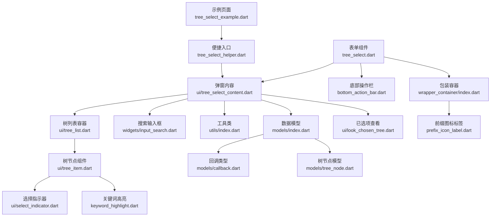
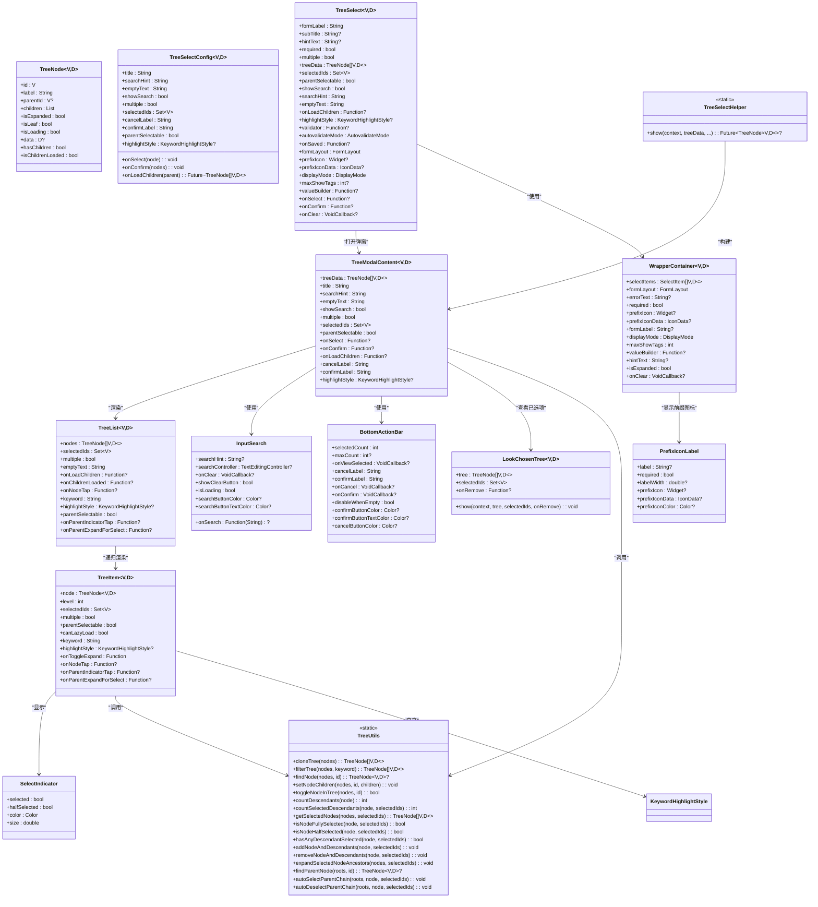
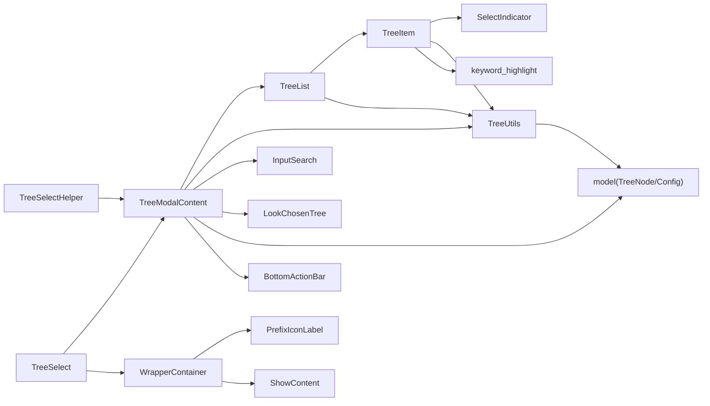

# TreeSelect 树形选择器 API

<cite>
**本文引用的文件**   
- [tree_select.dart](file://lib/src/tree_select/tree_select.dart)
- [tree_select_helper.dart](file://lib/src/tree_select/tree_select_helper.dart)
- [models/index.dart](file://lib/src/tree_select/models/index.dart)
- [models/callback.dart](file://lib/src/tree_select/models/callback.dart)
- [models/tree_node.dart](file://lib/src/tree_select/models/tree_node.dart)
- [ui/tree_select_content.dart](file://lib/src/tree_select/ui/tree_select_content.dart)
- [ui/look_chosen_tree.dart](file://lib/src/tree_select/ui/look_chosen_tree.dart)
- [ui/tree_list.dart](file://lib/src/tree_select/ui/tree_list.dart)
- [ui/tree_item.dart](file://lib/src/tree_select/ui/tree_item.dart)
- [ui/select_indicator.dart](file://lib/src/tree_select/ui/select_indicator.dart)
- [utils/index.dart](file://lib/src/tree_select/utils/index.dart)
- [widgets/input_search.dart](file://lib/src/widgets/input_search.dart)
- [bottom_action_bar.dart](file://lib/src/widgets/bottom_action_bar.dart)
- [keyword_highlight.dart](file://lib/src/widgets/keyword_highlight.dart)
- [prefix_icon_label.dart](file://lib/src/widgets/prefix_icon_label.dart)
- [wrapper_container/index.dart](file://lib/src/wrapper_container/index.dart)
- [dropdown_choose.dart](file://lib/src/dropdown_choose/dropdown_choose.dart)
- [tree_select_example.dart](file://example/lib/pages/tree_select_example.dart)
</cite>

## 更新摘要
**变更内容**   
- **双泛型架构升级**：所有组件从单泛型 `<T>` 升级为双泛型 `<V, D>`，其中 V 为节点ID类型，D 为附加数据类型
- **回调类型重构**：使用新的 typedef 定义 TreeNodeSelect、TreeNodeConfirm、TreeNodeLoadChild，提供更清晰的类型约束
- **TreeNode模型增强**：新增 hasChildren 和 isChildrenLoaded 计算属性，简化子节点状态判断逻辑
- **新增LookChosenTree组件**：提供已选项查看弹窗功能，支持层级展示和移除操作
- **API签名统一**：TreeSelectHelper.show() 方法全面支持双泛型，与表单组件保持一致

## 目录
1. [简介](#简介)
2. [项目结构](#项目结构)
3. [核心组件](#核心组件)
4. [架构总览](#架构总览)
5. [详细组件分析](#详细组件分析)
6. [依赖关系分析](#依赖关系分析)
7. [性能与大数据优化](#性能与大数据优化)
8. [故障排查指南](#故障排查指南)
9. [结论](#结论)
10. [附录：API 参考与示例](#附录api-参考与示例)

## 简介
TreeSelect 是一个支持单选/多选、搜索过滤、关键字高亮、懒加载与父节点联动选择的树形选择器。经过重大重构后，现在采用双泛型架构 `<V, D>`，提供统一的 `show<V, D>()` 便捷方法和全新的 `TreeSelectField` 表单组件，完美集成 Flutter 表单系统。组件采用"表单字段组件 + 弹窗内容"的现代化架构，既支持快速集成，也满足深度定制需求。

**最新更新**：组件架构进行了重大升级，全面采用双泛型设计，增强了数据类型的灵活性和安全性。新增 LookChosenTree 组件用于查看和管理已选项，提供了更好的用户体验。

## 项目结构
TreeSelect 相关代码位于 lib/src/tree_select 目录下，采用清晰的模块化设计：
- `tree_select.dart`: 新的表单字段组件 TreeSelect（双泛型版本）
- `tree_select_helper.dart`: 统一的便捷入口方法（双泛型版本）
- `ui/tree_select_content.dart`: 弹窗内容组件 TreeModalContent（双泛型版本）
- `ui/look_chosen_tree.dart`: 新增的已选项查看弹窗组件
- `ui/tree_list.dart`: 树形列表容器组件（双泛型版本）
- `ui/tree_item.dart`: 单个树节点渲染组件（双泛型版本）
- `ui/select_indicator.dart`: 三态选择指示器组件（全/半选/未选）
- `models/index.dart`: 数据模型和配置类导出
- `models/callback.dart`: 新的回调类型定义
- `models/tree_node.dart`: 增强的 TreeNode 模型
- `utils/index.dart`: 树操作工具类（双泛型版本）
- `widgets/input_search.dart`: 简化的搜索输入框组件
- `widgets/prefix_icon_label.dart`: 前缀图标标签组件
- `wrapper_container/index.dart`: 包装容器组件



**图表来源**
- [tree_select_example.dart:1-369](file://example/lib/pages/tree_select_example.dart#L1-L369)
- [tree_select_helper.dart:1-81](file://lib/src/tree_select/tree_select_helper.dart#L1-L81)
- [ui/tree_select_content.dart:1-361](file://lib/src/tree_select/ui/tree_select_content.dart#L1-L361)
- [ui/look_chosen_tree.dart:1-310](file://lib/src/tree_select/ui/look_chosen_tree.dart#L1-L310)
- [ui/tree_list.dart:1-156](file://lib/src/tree_select/ui/tree_list.dart#L1-L156)
- [ui/tree_item.dart:1-234](file://lib/src/tree_select/ui/tree_item.dart#L1-L234)
- [ui/select_indicator.dart:1-38](file://lib/src/tree_select/ui/select_indicator.dart#L1-L38)
- [utils/index.dart:1-243](file://lib/src/tree_select/utils/index.dart#L1-L243)
- [models/index.dart:1-3](file://lib/src/tree_select/models/index.dart#L1-L3)
- [models/callback.dart:1-13](file://lib/src/tree_select/models/callback.dart#L1-L13)
- [models/tree_node.dart:1-115](file://lib/src/tree_select/models/tree_node.dart#L1-L115)
- [tree_select.dart:1-400](file://lib/src/tree_select/tree_select.dart#L1-L400)
- [bottom_action_bar.dart:1-135](file://lib/src/widgets/bottom_action_bar.dart#L1-L135)
- [prefix_icon_label.dart:1-51](file://lib/src/widgets/prefix_icon_label.dart#L1-L51)
- [wrapper_container/index.dart:1-134](file://lib/src/wrapper_container/index.dart#L1-L134)
- [widgets/input_search.dart:1-145](file://lib/src/widgets/input_search.dart#L1-L145)

## 核心组件
- **TreeNode<V, D>**: 增强的树节点数据模型，包含 id、label、parentId、children、isExpanded、isLeaf、isLoading、data 等字段，以及 hasChildren 和 isChildrenLoaded 计算属性
- **TreeSelectConfig<V, D>**: 选择器配置项，集中管理所有行为与外观配置（双泛型版本）
- **TreeSelect<V, D>**: 新的表单字段组件，集成 FormField 和 WrapperContainer（双泛型版本）
- **TreeModalContent<V, D>**: 弹窗内容组件，专注展示和交互逻辑（双泛型版本）
- **TreeList<V, D>**: 树形列表容器组件，负责数据流管理和状态同步（双泛型版本）
- **TreeItem<V, D>**: 纯展示型树节点组件，递归渲染单个节点及其子树（双泛型版本）
- **SelectIndicator**: 三态选择指示器组件，支持全选、半选、未选状态
- **LookChosenTree<V, D>**: 新增的已选项查看弹窗组件，支持层级展示和移除操作
- **TreeUtils**: 静态工具类，提供树操作的无状态方法集合（双泛型版本）
- **TreeSelectHelper**: 统一的便捷入口，提供单一的 show<V, D>() 方法（双泛型版本）
- **BottomActionBar**: 通用的底部操作栏组件，支持已选数量展示和空选禁用
- **PrefixIconLabel**: 前缀图标标签组件，支持 prefixIcon 和 prefixIconData 两种方式
- **InputSearch**: 简化的搜索输入框组件，移除keyword参数，采用事件驱动

**章节来源**
- [models/tree_node.dart:1-115](file://lib/src/tree_select/models/tree_node.dart#L1-L115)
- [models/callback.dart:1-13](file://lib/src/tree_select/models/callback.dart#L1-L13)
- [tree_select.dart:1-400](file://lib/src/tree_select/tree_select.dart#L1-L400)
- [ui/tree_select_content.dart:1-361](file://lib/src/tree_select/ui/tree_select_content.dart#L1-L361)
- [ui/look_chosen_tree.dart:1-310](file://lib/src/tree_select/ui/look_chosen_tree.dart#L1-L310)
- [ui/tree_list.dart:1-156](file://lib/src/tree_select/ui/tree_list.dart#L1-L156)
- [ui/tree_item.dart:1-234](file://lib/src/tree_select/ui/tree_item.dart#L1-L234)
- [ui/select_indicator.dart:1-38](file://lib/src/tree_select/ui/select_indicator.dart#L1-L38)
- [utils/index.dart:1-243](file://lib/src/tree_select/utils/index.dart#L1-L243)
- [tree_select_helper.dart:1-81](file://lib/src/tree_select/tree_select_helper.dart#L1-L81)
- [bottom_action_bar.dart:1-135](file://lib/src/widgets/bottom_action_bar.dart#L1-L135)
- [prefix_icon_label.dart:1-51](file://lib/src/widgets/prefix_icon_label.dart#L1-L51)
- [wrapper_container/index.dart:1-134](file://lib/src/wrapper_container/index.dart#L1-L134)
- [widgets/input_search.dart:1-145](file://lib/src/widgets/input_search.dart#L1-L145)

## 架构总览
TreeSelect 采用现代化的"表单字段 + 弹窗内容"分层架构，完全对齐 DropdownChoose 的设计模式，并全面升级到双泛型架构：



**图表来源**
- [models/tree_node.dart:1-115](file://lib/src/tree_select/models/tree_node.dart#L1-L115)
- [models/callback.dart:1-13](file://lib/src/tree_select/models/callback.dart#L1-L13)
- [tree_select.dart:1-400](file://lib/src/tree_select/tree_select.dart#L1-L400)
- [ui/tree_select_content.dart:1-361](file://lib/src/tree_select/ui/tree_select_content.dart#L1-L361)
- [ui/look_chosen_tree.dart:1-310](file://lib/src/tree_select/ui/look_chosen_tree.dart#L1-L310)
- [ui/tree_list.dart:1-156](file://lib/src/tree_select/ui/tree_list.dart#L1-L156)
- [ui/tree_item.dart:1-234](file://lib/src/tree_select/ui/tree_item.dart#L1-L234)
- [ui/select_indicator.dart:1-38](file://lib/src/tree_select/ui/select_indicator.dart#L1-L38)
- [utils/index.dart:1-243](file://lib/src/tree_select/utils/index.dart#L1-L243)
- [tree_select_helper.dart:1-81](file://lib/src/tree_select/tree_select_helper.dart#L1-L81)
- [bottom_action_bar.dart:1-135](file://lib/src/widgets/bottom_action_bar.dart#L1-L135)
- [prefix_icon_label.dart:1-51](file://lib/src/widgets/prefix_icon_label.dart#L1-L51)
- [wrapper_container/index.dart:1-134](file://lib/src/wrapper_container/index.dart#L1-L134)
- [widgets/input_search.dart:1-145](file://lib/src/widgets/input_search.dart#L1-L145)

## 详细组件分析

### 数据模型与配置（TreeNode / TreeSelectConfig）
- **TreeNode<V, D>**: 增强的树节点数据模型，V 为节点ID类型，D 为附加数据类型。新增 hasChildren 和 isChildrenLoaded 计算属性，简化子节点状态判断逻辑
- **TreeSelectConfig<V, D>**: 集中配置选择器行为与外观，包括 title、searchHint、emptyText、showSearch、multiple、selectedIds、onSelect、onConfirm、onLoadChildren、cancelLabel、confirmLabel、parentSelectable、highlightStyle

**更新**：TreeNode 模型新增了 hasChildren 和 isChildrenLoaded 两个计算属性，提供了更便捷的子节点状态判断方式。

**章节来源**
- [models/tree_node.dart:1-115](file://lib/src/tree_select/models/tree_node.dart#L1-L115)

### 回调类型定义（Callback Types）
- **TreeNodeSelect<V, D>**: 单选节点点击回调，接收 TreeNode<V, D> 参数
- **TreeNodeConfirm<V, D>**: 多选选中状态变化回调，接收 List<TreeNode<V, D>> 参数
- **TreeNodeLoadChild<V, D>**: 懒加载子节点回调，接收 TreeNode<V, D> 父节点，返回 Future<List<TreeNode<V, D>>>

**新增**：使用 typedef 定义了清晰的回调类型，替代了之前的函数类型声明，提供更好的类型安全性和代码提示。

**章节来源**
- [models/callback.dart:1-13](file://lib/src/tree_select/models/callback.dart#L1-L13)

### 统一便捷入口（TreeSelectHelper）
- **show<V, D>()**: 统一的显示方法，通过 multiple 参数区分单选和多选模式，全面支持双泛型
  - 单选模式：选中节点后自动关闭，返回该节点，取消返回 null
  - 多选模式：通过 onConfirm 回调返回选中节点列表
- 内部通过 showModalBottomSheet 构建 TreeModalContent，设置高度约束与 SafeArea
- 支持所有配置选项：selectedIds 预选中、onSelect/onConfirm 回调、onLoadChildren 懒加载、高亮样式等

**更新**：show 方法已升级为双泛型版本，支持灵活的 ID 类型和自定义数据类型。

**章节来源**
- [tree_select_helper.dart:1-81](file://lib/src/tree_select/tree_select_helper.dart#L1-L81)

### 表单字段组件（TreeSelect）
- **TreeSelect<V, D>**: 全新的表单字段组件，完全集成 Flutter FormField，支持双泛型
- 核心特性：
  - 支持单选和多选模式
  - 集成 WrapperContainer 提供默认 UI
  - 完整的表单校验和保存功能
  - 灵活的显示模式（text/compact/tags）
  - 自定义值构建器和图标配置
- State 管理：
  - 维护内部选中状态（_selectedNode/_selectedNodes）
  - 同步外部 selectedIds 变化
  - 处理清除状态和验证逻辑
  - 弹窗展开/折叠状态管理

**更新**：TreeSelect 组件已全面升级到双泛型架构，支持灵活的类型定义。

**章节来源**
- [tree_select.dart:1-400](file://lib/src/tree_select/tree_select.dart#L1-L400)

### 弹窗内容组件（TreeModalContent）
- **TreeModalContent<V, D>**: 弹窗内容组件，专注展示和交互逻辑，支持双泛型
- 核心功能：
  - 搜索过滤与关键词高亮
  - 树形列表渲染与交互
  - 懒加载子节点处理
  - 父子节点联动选择
  - 底部操作栏集成
  - 已选项查看功能
- 状态管理：
  - _searchController 搜索控制器
  - _selectedIds 选中状态集合
  - _filteredData 过滤后的数据
  - 祖先节点展开状态管理

**更新**：新增了对 LookChosenTree 组件的集成，支持查看和管理已选项。

**章节来源**
- [ui/tree_select_content.dart:1-361](file://lib/src/tree_select/ui/tree_select_content.dart#L1-L361)

### 已选项查看弹窗（LookChosenTree）
- **LookChosenTree<V, D>**: 新增的已选项查看弹窗组件，支持层级展示和移除操作
- 核心特性：
  - 居中 Dialog 展示，树形层级版
  - 展示当前已选中的树节点（剪枝树，保留数据层级）
  - 支持按节点移除，移除后自动刷新
  - 全部移除后自动关闭
  - 美观的UI设计和交互体验
- 使用方法：
  - 静态方法 show(context, tree, selectedIds, onRemove)
  - 传入剪枝树数据和选中ID集合
  - 通过 onRemove 回调处理移除操作

**新增**：这是全新添加的功能组件，为用户提供了更好的已选项管理能力。

**章节来源**
- [ui/look_chosen_tree.dart:1-310](file://lib/src/tree_select/ui/look_chosen_tree.dart#L1-L310)

### 树列表容器（TreeList）
- **TreeList<V, D>**: 重构后的树列表容器组件，专注于数据流管理和状态同步，支持双泛型
- 核心功能：
  - 管理树数据的生命周期和状态同步
  - 处理懒加载逻辑和错误处理
  - 协调 TreeItem 组件的递归渲染
  - 监听数据变化并触发相应更新
- 状态管理：
  - 维护内部节点数据 `_nodes`
  - 处理 didUpdateWidget 中的数据同步
  - 管理展开/折叠状态的局部更新

**更新**：TreeList 组件已升级到双泛型版本，与整体架构保持一致。

**章节来源**
- [ui/tree_list.dart:1-156](file://lib/src/tree_select/ui/tree_list.dart#L1-L156)

### 树节点组件（TreeItem）
- **TreeItem<V, D>**: 纯展示型树节点组件，负责单个节点的UI渲染，支持双泛型
- 核心功能：
  - 递归渲染节点，支持展开/折叠箭头、加载指示器、子节点数量 badge
  - 选择指示器（全/半选/未选）三态显示
  - 懒加载：当 isLeaf=false 且 children 为空时，展开触发 onLoadChildren
  - 高亮文本：使用 buildHighlightedText 对 label 进行关键词匹配与高亮
  - 父节点可选模式：splitIndicator 将文本区与圆圈区分开，避免误触
  - 层级连接线：绘制实线直角引导线，清晰展示父子关系

**更新**：TreeItem 组件已升级到双泛型版本，支持灵活的类型定义。

**章节来源**
- [ui/tree_item.dart:1-234](file://lib/src/tree_select/ui/tree_item.dart#L1-L234)

### 选择指示器（SelectIndicator）
- **SelectIndicator**: 三态选择指示器组件，专门处理多选场景的选择状态显示
- 核心特性：
  - 全选状态：实心主色圆 + 白色对勾
  - 半选状态：实心主色圆 + 白色横线
  - 未选状态：灰色空心圆环
  - 可配置的颜色和尺寸
  - 纯展示型组件，无业务逻辑

**章节来源**
- [ui/select_indicator.dart:1-38](file://lib/src/tree_select/ui/select_indicator.dart#L1-L38)

### 工具类（TreeUtils）
- **TreeUtils**: 静态工具类，提供无状态的树操作方法，全面支持双泛型
- 核心方法分类：
  - 树操作：cloneTree、filterTree、findNode、setNodeChildren、toggleNodeInTree
  - 统计与查询：countDescendants、countSelectedDescendants、getSelectedNodes
  - 选中状态：isNodeFullySelected、isNodeHalfSelected、hasAnyDescendantSelected
  - 批量操作：addNodeAndDescendants、removeNodeAndDescendants
  - 展开与联动：expandSelectedNodeAncestors、findParentNode、autoSelectParentChain、autoDeselectParentChain

**更新**：所有工具方法已升级到双泛型版本，确保类型安全。

**章节来源**
- [utils/index.dart:1-243](file://lib/src/tree_select/utils/index.dart#L1-L243)

### 其他组件
- **BottomActionBar**: 通用的底部操作栏组件，被 TreeModalContent 复用
- **PrefixIconLabel**: 专门处理前缀图标和标签显示的组件
- **WrapperContainer<V, D>**: 统一的表单字段包装容器，支持双泛型
- **InputSearch**: 简化的搜索输入框组件，移除了keyword参数

**章节来源**
- [bottom_action_bar.dart:1-135](file://lib/src/widgets/bottom_action_bar.dart#L1-L135)
- [prefix_icon_label.dart:1-51](file://lib/src/widgets/prefix_icon_label.dart#L1-L51)
- [wrapper_container/index.dart:1-134](file://lib/src/wrapper_container/index.dart#L1-L134)
- [widgets/input_search.dart:1-145](file://lib/src/widgets/input_search.dart#L1-L145)

## 依赖关系分析
- **TreeSelectHelper** 依赖 TreeModalContent 与 models 中的配置类型（双泛型）
- **TreeSelect** 依赖 TreeModalContent、WrapperContainer 和 FormField（双泛型）
- **TreeModalContent** 依赖 TreeList、TreeUtils、models、keyword_highlight、input_search 和 LookChosenTree
- **TreeList** 依赖 TreeUtils、models 和 tree_item（双泛型）
- **TreeItem** 依赖 TreeUtils、models、keyword_highlight 和 select_indicator（双泛型）
- **SelectIndicator** 是独立的UI组件，无外部依赖
- **LookChosenTree** 依赖 models 中的 TreeNode 类型（双泛型）
- **InputSearch** 依赖 clear_icon 组件
- **WrapperContainer** 依赖 PrefixIconLabel 和 ShowContent（双泛型）
- **PrefixIconLabel** 是独立的 UI 组件，无外部依赖



**图表来源**
- [tree_select_helper.dart:1-81](file://lib/src/tree_select/tree_select_helper.dart#L1-L81)
- [tree_select.dart:1-400](file://lib/src/tree_select/tree_select.dart#L1-L400)
- [ui/tree_select_content.dart:1-361](file://lib/src/tree_select/ui/tree_select_content.dart#L1-L361)
- [ui/look_chosen_tree.dart:1-310](file://lib/src/tree_select/ui/look_chosen_tree.dart#L1-L310)
- [ui/tree_list.dart:1-156](file://lib/src/tree_select/ui/tree_list.dart#L1-L156)
- [ui/tree_item.dart:1-234](file://lib/src/tree_select/ui/tree_item.dart#L1-L234)
- [ui/select_indicator.dart:1-38](file://lib/src/tree_select/ui/select_indicator.dart#L1-L38)
- [utils/index.dart:1-243](file://lib/src/tree_select/utils/index.dart#L1-L243)
- [models/index.dart:1-3](file://lib/src/tree_select/models/index.dart#L1-L3)
- [bottom_action_bar.dart:1-135](file://lib/src/widgets/bottom_action_bar.dart#L1-L135)
- [prefix_icon_label.dart:1-51](file://lib/src/widgets/prefix_icon_label.dart#L1-L51)
- [wrapper_container/index.dart:1-134](file://lib/src/wrapper_container/index.dart#L1-L134)
- [widgets/input_search.dart:1-145](file://lib/src/widgets/input_search.dart#L1-L145)

## 性能与大数据优化
- **数据克隆与过滤**：每次搜索都会 cloneTree + filterTree，建议在大数据集上结合分页或虚拟滚动策略，减少一次性渲染量
- **懒加载**：通过 isLeaf=false 且 children 为空标识待加载，按需请求子节点，显著降低首屏内存占用
- **选中状态缓存**：使用 Set<V> 存储 selectedIds，O(1) 查找；联动父链时避免重复遍历
- **渲染优化**：
  - TreeList 使用 ListView.builder 惰性构建
  - TreeItem 作为独立组件，支持局部刷新
  - 展开/折叠与加载状态局部 setState，避免整树重建
  - SelectIndicator 作为纯展示组件，无状态开销
- **高亮性能**：keyword 为空时回退普通 Text，避免不必要的 RichText 构建
- **内存建议**：
  - 合理设置 maxHeight/minHeight，避免过高的底部面板导致大量节点渲染
  - 在 onLoadChildren 中限制单次返回的子节点数量，必要时分页加载
  - 避免在 data 中存放大对象，保持节点轻量
  - 利用 TreeItem 的独立性，避免不必要的组件重建

## 故障排查指南
- **搜索无结果**：检查 keyword 是否为空；确认 filterTree 是否正确执行；确保 label 大小写一致（内部已转小写比较）
- **懒加载不触发**：确认 isLeaf=false 且 children 为空；确保 onLoadChildren 非空；检查异常捕获分支是否隐藏 loading
- **父节点联动异常**：确认 parentSelectable 配置；检查 autoSelectParentChain/autoDeselectParentChain 是否被调用；确保 isChildrenLoaded 判断正确
- **高亮不生效**：检查 highlightStyle.enabled 是否为 true；确认 keyword 非空；验证 buildHighlightedText 参数传递
- **表单验证问题**：检查 validator 函数返回值；确认 required 属性设置；验证 onSaved 回调是否正常触发
- **BottomActionBar 按钮禁用**：确认 selectedCount > 0 或 disableWhenEmpty = false；检查 onConfirm 回调是否正确绑定
- **前缀图标不显示**：确认 prefixIcon 和 prefixIconData 只传递其中一个；检查 IconData 是否正确导入；验证 prefixIconColor 配置
- **选择指示器异常**：确认 multiple 模式启用；检查 parentSelectable 配置；验证 isNodeFullySelected/isNodeHalfSelected 计算逻辑
- **InputSearch 搜索无效**：确认 onSearch 回调已绑定；检查 searchController 是否正确初始化；验证 isLoading 状态
- **LookChosenTree 无法显示**：确认传入的 tree 数据是否为有效的剪枝树；检查 selectedIds 是否与 tree 数据对应

**章节来源**
- [ui/tree_select_content.dart:1-361](file://lib/src/tree_select/ui/tree_select_content.dart#L1-L361)
- [ui/look_chosen_tree.dart:1-310](file://lib/src/tree_select/ui/look_chosen_tree.dart#L1-L310)
- [ui/tree_list.dart:1-156](file://lib/src/tree_select/ui/tree_list.dart#L1-L156)
- [ui/tree_item.dart:1-234](file://lib/src/tree_select/ui/tree_item.dart#L1-L234)
- [ui/select_indicator.dart:1-38](file://lib/src/tree_select/ui/select_indicator.dart#L1-L38)
- [utils/index.dart:1-243](file://lib/src/tree_select/utils/index.dart#L1-L243)
- [tree_select.dart:1-400](file://lib/src/tree_select/tree_select.dart#L1-L400)
- [bottom_action_bar.dart:1-135](file://lib/src/widgets/bottom_action_bar.dart#L1-L135)
- [prefix_icon_label.dart:1-51](file://lib/src/widgets/prefix_icon_label.dart#L1-L51)
- [widgets/input_search.dart:1-145](file://lib/src/widgets/input_search.dart#L1-L145)

## 结论
TreeSelect 经过重大重构后，提供了更加现代化和一致的 API 设计。新的双泛型架构 `<V, D>` 提供了更强的类型安全性和灵活性，通过 TreeSelect 表单组件和统一的 show<V, D>() 方法，既简化了使用方式，又增强了表单集成能力。新增的 LookChosenTree 组件进一步提升了用户体验，让用户能够更好地管理和查看已选项。针对大数据场景，推荐结合懒加载与分页策略，以获得更优的性能体验。

**最新改进**：
- **双泛型架构**：全面升级到 `<V, D>` 泛型设计，支持灵活的ID类型和自定义数据类型
- **回调类型重构**：使用 typedef 定义清晰的回调类型，提供更好的类型安全性
- **TreeNode模型增强**：新增 hasChildren 和 isChildrenLoaded 计算属性，简化状态判断
- **新增LookChosenTree组件**：提供已选项查看和管理功能，提升用户体验
- **API签名统一**：所有组件和方法都支持双泛型，保持一致的API设计

## 附录：API 参考与示例

### TreeSelectHelper 统一方法
- **show<V, D>()**: 统一的显示方法，支持单选和多选模式，全面支持双泛型
  - 参数：context、treeData、title、searchHint、emptyText、showSearch、multiple、parentSelectable、selectedIds、onSelect、onConfirm、onLoadChildren、cancelLabel、confirmLabel、highlightStyle、各种颜色配置
  - 单选模式：multiple=false，选中后返回节点，取消返回 null
  - 多选模式：multiple=true，通过 onConfirm 回调返回选中节点列表

**更新**：show 方法已升级为双泛型版本，支持灵活的类型定义。

**章节来源**
- [tree_select_helper.dart:1-81](file://lib/src/tree_select/tree_select_helper.dart#L1-L81)

### TreeSelect 表单组件参数
- **基础参数**：formLabel、subTitle、hintText、required、multiple、treeData、selectedIds
- **显示配置**：parentSelectable、showSearch、searchHint、emptyText、highlightStyle、title、各种按钮文字和颜色
- **表单集成**：validator、autovalidateMode、onSaved、formLayout、prefixIcon、prefixIconData、displayMode、maxShowTags、valueBuilder
- **回调函数**：onSelect（单选）、onConfirm（多选）、onClear

**更新**：TreeSelect 组件已升级到双泛型版本。

**章节来源**
- [tree_select.dart:1-400](file://lib/src/tree_select/tree_select.dart#L1-L400)

### LookChosenTree 已选项查看组件
- **基础参数**：tree（剪枝树数据）、selectedIds（选中ID集合）
- **回调参数**：onRemove（移除节点时的回调，传入被移除节点的ID集合）
- **静态方法**：show(context, tree, selectedIds, onRemove)

**新增**：这是全新添加的组件，用于查看和管理已选项。

**章节来源**
- [ui/look_chosen_tree.dart:1-310](file://lib/src/tree_select/ui/look_chosen_tree.dart#L1-L310)

### TreeModalContent 弹窗组件参数
- **数据配置**：treeData、selectedIds、onLoadChildren
- **显示配置**：title、searchHint、emptyText、showSearch、multiple、parentSelectable
- **交互配置**：onSelect、onConfirm、cancelLabel、confirmLabel
- **样式配置**：highlightStyle、各种按钮颜色配置

**更新**：TreeModalContent 组件已升级到双泛型版本。

**章节来源**
- [ui/tree_select_content.dart:1-361](file://lib/src/tree_select/ui/tree_select_content.dart#L1-L361)

### TreeList 容器组件参数
- **数据参数**：nodes、selectedIds、multiple、emptyText
- **交互参数**：onLoadChildren、onChildrenLoaded、onNodeTap、keyword、highlightStyle、parentSelectable
- **高级参数**：onParentIndicatorTap、onParentExpandForSelect

**更新**：TreeList 组件已升级到双泛型版本。

**章节来源**
- [ui/tree_list.dart:1-156](file://lib/src/tree_select/ui/tree_list.dart#L1-L156)

### TreeItem 节点组件参数
- **数据参数**：node、level、selectedIds、multiple、parentSelectable、canLazyLoad
- **显示参数**：keyword、highlightStyle
- **交互参数**：onToggleExpand、onNodeTap、onParentIndicatorTap、onParentExpandForSelect

**更新**：TreeItem 组件已升级到双泛型版本。

**章节来源**
- [ui/tree_item.dart:1-234](file://lib/src/tree_select/ui/tree_item.dart#L1-L234)

### SelectIndicator 选择指示器参数
- **状态参数**：selected（是否全选）、halfSelected（是否半选）
- **样式参数**：color（主色）、size（指示器尺寸）

**章节来源**
- [ui/select_indicator.dart:1-38](file://lib/src/tree_select/ui/select_indicator.dart#L1-L38)

### 数据模型与类型
- **TreeNode<V, D>**：id、label、parentId、children、isExpanded、isLeaf、isLoading、data、hasChildren、isChildrenLoaded
- **TreeSelectConfig<V, D>**：title、searchHint、emptyText、showSearch、multiple、selectedIds、onSelect、onConfirm、onLoadChildren、cancelLabel、confirmLabel、parentSelectable、highlightStyle
- **回调类型**：TreeNodeSelect<V, D>、TreeNodeConfirm<V, D>、TreeNodeLoadChild<V, D>

**更新**：TreeNode 模型新增了 hasChildren 和 isChildrenLoaded 计算属性，回调类型使用 typedef 定义。

**章节来源**
- [models/tree_node.dart:1-115](file://lib/src/tree_select/models/tree_node.dart#L1-L115)
- [models/callback.dart:1-13](file://lib/src/tree_select/models/callback.dart#L1-L13)

### 常见使用场景与最佳实践
- **表单集成**：使用 TreeSelect 直接嵌入 Form，享受完整的表单校验和保存功能
- **快速弹出**：使用 TreeSelectHelper.show() 一行代码弹出选择面板
- **懒加载**：初始仅根节点，展开时按需加载子节点，提升首屏性能
- **搜索过滤**：实时过滤并高亮匹配文本，自动展开匹配路径
- **父子联动**：根据 parentSelectable 配置灵活控制父节点选择行为
- **大数据优化**：结合懒加载与分页策略，避免一次性加载过多数据
- **前缀图标配置**：推荐使用 `prefixIconData` 属性直接传递 IconData，与 DropdownChoose 保持一致的 API 设计
- **已选项管理**：使用 LookChosenTree 组件查看和管理已选项，提供更好的用户体验
- **组件拆分**：利用 TreeItem 和 SelectIndicator 的独立性，实现更好的代码复用和维护

**章节来源**
- [tree_select_example.dart:1-369](file://example/lib/pages/tree_select_example.dart#L1-L369)

### 双泛型使用示例
```dart
// 使用双泛型的 TreeSelectHelper
TreeSelectHelper.show<String, dynamic>(
  context: context,
  treeData: treeData,
  title: '选择部门',
  multiple: false,
  onSelect: (node) => print(node.label),
)

// 使用双泛型的 TreeSelect 表单组件
TreeSelect<String, User>(
  formLabel: '用户选择',
  treeData: userTreeData,
  multiple: true,
  onSelect: (node) => print('选中: ${node.label}'),
  onConfirm: (nodes) => print('确认选中: ${nodes.length} 个用户'),
)

// 使用 LookChosenTree 查看已选项
LookChosenTree.show<String, dynamic>(
  context: context,
  tree: selectedTree,
  selectedIds: selectedIds,
  onRemove: (removedIds) {
    setState(() {
      selectedIds.removeAll(removedIds);
    });
  },
)
```

**章节来源**
- [tree_select_helper.dart:20-42](file://lib/src/tree_select/tree_select_helper.dart#L20-L42)
- [tree_select.dart:19-25](file://lib/src/tree_select/tree_select.dart#L19-L25)
- [ui/look_chosen_tree.dart:25-30](file://lib/src/tree_select/ui/look_chosen_tree.dart#L25-L30)