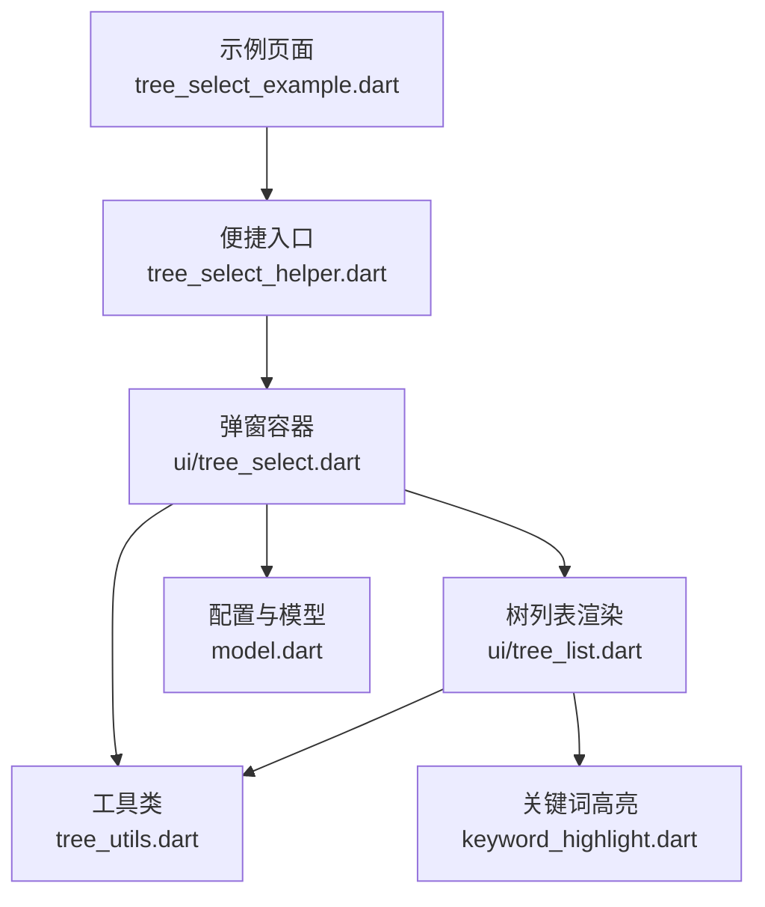
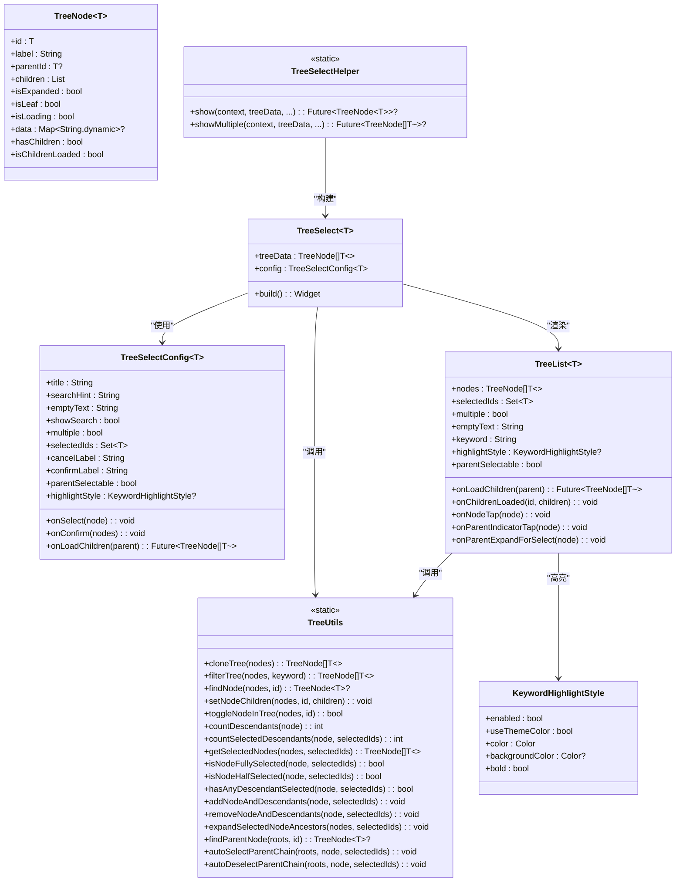
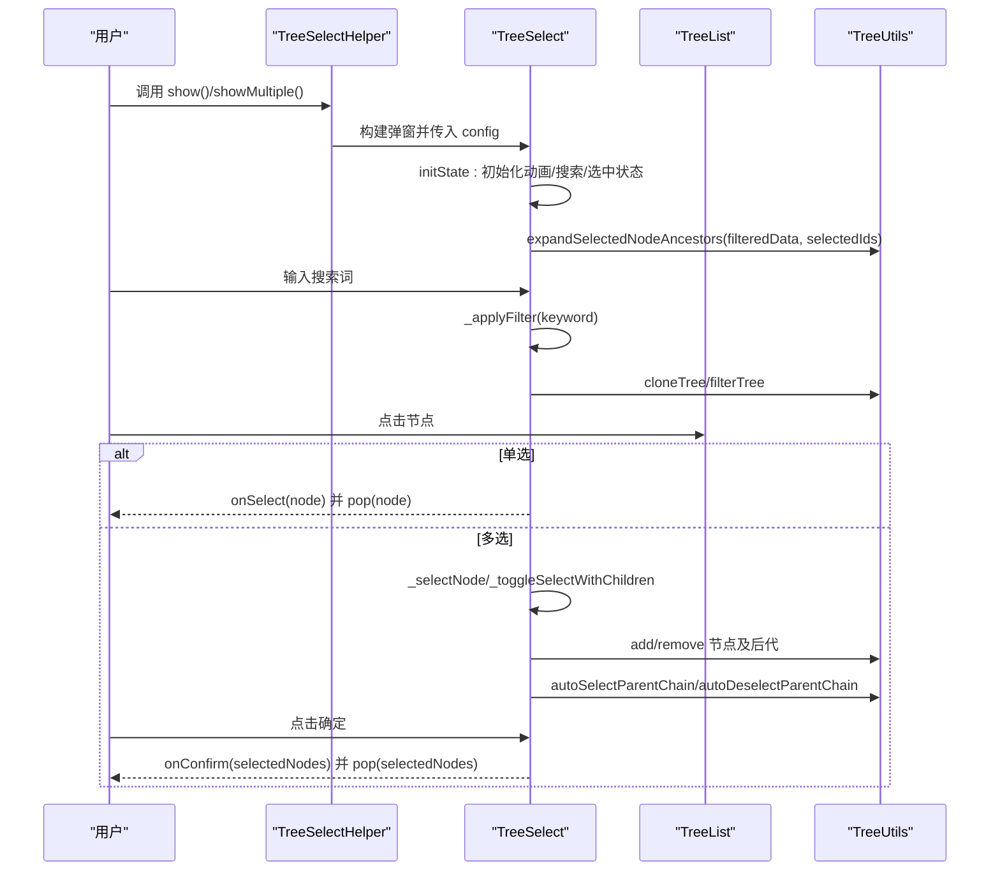
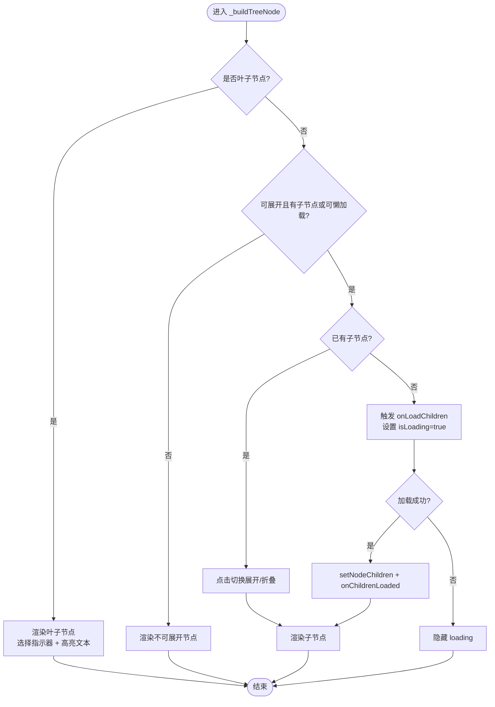
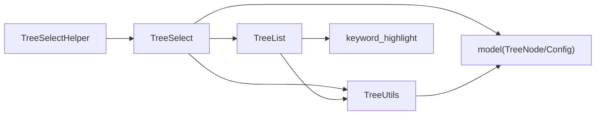

# TreeSelect 树形选择器 API

<cite>
**本文引用的文件**   
- [tree_select_helper.dart](file://lib/src/tree_select/tree_select_helper.dart)
- [model.dart](file://lib/src/tree_select/model.dart)
- [ui/tree_select.dart](file://lib/src/tree_select/ui/tree_select.dart)
- [ui/tree_list.dart](file://lib/src/tree_select/ui/tree_list.dart)
- [tree_utils.dart](file://lib/src/tree_select/tree_utils.dart)
- [keyword_highlight.dart](file://lib/src/widgets/keyword_highlight.dart)
- [tree_select_example.dart](file://example/lib/pages/tree_select_example.dart)
</cite>

## 目录
1. [简介](#简介)
2. [项目结构](#项目结构)
3. [核心组件](#核心组件)
4. [架构总览](#架构总览)
5. [详细组件分析](#详细组件分析)
6. [依赖关系分析](#依赖关系分析)
7. [性能与大数据优化](#性能与大数据优化)
8. [故障排查指南](#故障排查指南)
9. [结论](#结论)
10. [附录：API 参考与示例](#附录api-参考与示例)

## 简介
TreeSelect 是一个支持单选/多选、搜索过滤、关键字高亮、懒加载与父节点联动选择的树形选择器。通过 TreeSelectHelper 的便捷方法，一行代码即可弹出底部面板完成选择；也可直接使用 TreeSelect 组件进行深度定制。组件内置 TreeNode 数据模型、TreeUtils 工具集以及关键词高亮能力，适合组织、部门、地区等层级数据的交互场景。

## 项目结构
TreeSelect 相关代码位于 lib/src/tree_select 目录下，UI 组件在 ui 子目录，工具与模型独立拆分，便于复用与维护。示例页面位于 example/lib/pages 下，演示了单选、多选、懒加载等多种使用方式。

图表来源
- [tree_select_example.dart:1-351](file://example/lib/pages/tree_select_example.dart#L1-L351)
- [tree_select_helper.dart:1-119](file://lib/src/tree_select/tree_select_helper.dart#L1-L119)
- [ui/tree_select.dart:1-238](file://lib/src/tree_select/ui/tree_select.dart#L1-L238)
- [ui/tree_list.dart:1-291](file://lib/src/tree_select/ui/tree_list.dart#L1-L291)
- [tree_utils.dart:1-243](file://lib/src/tree_select/tree_utils.dart#L1-L243)
- [model.dart:1-123](file://lib/src/tree_select/model.dart#L1-L123)
- [keyword_highlight.dart:1-129](file://lib/src/widgets/keyword_highlight.dart#L1-L129)

章节来源
- [tree_select_helper.dart:1-119](file://lib/src/tree_select/tree_select_helper.dart#L1-L119)
- [ui/tree_select.dart:1-238](file://lib/src/tree_select/ui/tree_select.dart#L1-L238)
- [ui/tree_list.dart:1-291](file://lib/src/tree_select/ui/tree_list.dart#L1-L291)
- [tree_utils.dart:1-243](file://lib/src/tree_select/tree_utils.dart#L1-L243)
- [model.dart:1-123](file://lib/src/tree_select/model.dart#L1-L123)
- [keyword_highlight.dart:1-129](file://lib/src/widgets/keyword_highlight.dart#L1-L129)
- [tree_select_example.dart:1-351](file://example/lib/pages/tree_select_example.dart#L1-L351)

## 核心组件
- TreeNode<T>：树节点数据模型，包含 id、label、parentId、children、isExpanded、isLeaf、isLoading、data 等字段，并提供 hasChildren、isChildrenLoaded 等便捷属性。
- TreeSelectConfig<T>：选择器配置项，包括标题、搜索提示、空状态文案、是否显示搜索框、是否多选、初始选中 ID 集合、回调（onSelect/onConfirm）、懒加载回调（onLoadChildren）、按钮文案、是否允许父节点可选、关键词高亮样式等。
- TreeSelect<T>：底部弹窗容器，负责动画、搜索过滤、选择逻辑、懒加载同步与 UI 组装。
- TreeList<T>：纯展示型树列表，递归渲染节点、处理展开/折叠、懒加载、空状态与选择指示器。
- TreeUtils：静态工具类，提供深拷贝、过滤、查找、选中状态计算、批量选中/取消、祖先展开、父链联动等能力。
- TreeSelectHelper：便捷入口，提供 show() 与 showMultiple() 两个静态方法，快速弹出选择面板并返回结果。
- KeywordHighlightStyle / buildHighlightedText：关键词匹配与高亮渲染。

章节来源
- [model.dart:1-123](file://lib/src/tree_select/model.dart#L1-L123)
- [ui/tree_select.dart:1-238](file://lib/src/tree_select/ui/tree_select.dart#L1-L238)
- [ui/tree_list.dart:1-291](file://lib/src/tree_select/ui/tree_list.dart#L1-L291)
- [tree_utils.dart:1-243](file://lib/src/tree_select/tree_utils.dart#L1-L243)
- [tree_select_helper.dart:1-119](file://lib/src/tree_select/tree_select_helper.dart#L1-L119)
- [keyword_highlight.dart:1-129](file://lib/src/widgets/keyword_highlight.dart#L1-L129)

## 架构总览
TreeSelect 采用“便捷入口 + 弹窗容器 + 列表渲染 + 工具库”的分层设计。便捷入口屏蔽 showModalBottomSheet 细节；弹窗容器管理状态与业务逻辑；列表组件专注渲染与交互；工具库提供无状态操作。

图表来源
- [model.dart:1-123](file://lib/src/tree_select/model.dart#L1-L123)
- [ui/tree_select.dart:1-238](file://lib/src/tree_select/ui/tree_select.dart#L1-L238)
- [ui/tree_list.dart:1-291](file://lib/src/tree_select/ui/tree_list.dart#L1-L291)
- [tree_utils.dart:1-243](file://lib/src/tree_select/tree_utils.dart#L1-L243)
- [tree_select_helper.dart:1-119](file://lib/src/tree_select/tree_select_helper.dart#L1-L119)
- [keyword_highlight.dart:1-129](file://lib/src/widgets/keyword_highlight.dart#L1-L129)

## 详细组件分析

### 数据模型与配置（TreeNode / TreeSelectConfig）
- TreeNode<T> 描述树节点结构与状态，isLeaf=false 且 children 为空表示待懒加载；isExpanded 控制展开；isLoading 控制加载态；data 用于扩展附加信息。
- TreeSelectConfig<T> 集中配置选择器行为与外观，包括 title、searchHint、emptyText、showSearch、multiple、selectedIds、onSelect、onConfirm、onLoadChildren、cancelLabel、confirmLabel、parentSelectable、highlightStyle。

章节来源
- [model.dart:1-123](file://lib/src/tree_select/model.dart#L1-L123)

### 便捷入口（TreeSelectHelper）
- show<T>()：单选模式，选中后自动关闭并返回节点，取消返回 null。支持 selectedId 预选中、onSelect 回调、onLoadChildren 懒加载、高亮样式等。
- showMultiple<T>()：多选模式，点击确定后返回选中节点列表，取消返回 null。支持 selectedIds 预选中、onConfirm 回调、onLoadChildren 懒加载、高亮样式等。
- 内部通过 showModalBottomSheet 构建 TreeSelect，设置高度约束与 SafeArea。

章节来源
- [tree_select_helper.dart:1-119](file://lib/src/tree_select/tree_select_helper.dart#L1-L119)

### 弹窗容器（TreeSelect）
- 生命周期：初始化时创建动画控制器、搜索控制器、复制 selectedIds、应用过滤与祖先展开。
- 数据更新：监听 treeData 变化时克隆并重新过滤；监听 selectedIds 变化时同步内部选中状态并重新展开祖先路径。
- 选择逻辑：单选直接 onSelect 并 pop；多选根据 parentSelectable 决定行点击或圆圈点击行为，并联动父子选中状态。
- 懒加载：父节点未加载时先触发 onLoadChildren，完成后同步到原始数据并自动全选（在特定模式下）。
- UI 组装：顶部拖拽条、标题栏、搜索框、树列表、底部确认/取消按钮（仅多选）。

图表来源
- [tree_select_helper.dart:1-119](file://lib/src/tree_select/tree_select_helper.dart#L1-L119)
- [ui/tree_select.dart:1-238](file://lib/src/tree_select/ui/tree_select.dart#L1-L238)
- [tree_utils.dart:1-243](file://lib/src/tree_select/tree_utils.dart#L1-L243)

章节来源
- [ui/tree_select.dart:1-238](file://lib/src/tree_select/ui/tree_select.dart#L1-L238)

### 树列表渲染（TreeList）
- 递归渲染节点，支持展开/折叠箭头、加载指示器、子节点数量 badge、选择指示器（全/半选/未选）。
- 懒加载：当 isLeaf=false 且 children 为空时，展开触发 onLoadChildren，成功后 setNodeChildren 并通知 onChildrenLoaded。
- 高亮文本：使用 buildHighlightedText 对 label 进行关键词匹配与高亮。
- 父节点可选模式：splitIndicator 将文本区与圆圈区分开，避免误触；未加载时点击文本触发 onParentExpandForSelect，由外部处理加载后再全选。

图表来源
- [ui/tree_list.dart:1-291](file://lib/src/tree_select/ui/tree_list.dart#L1-L291)
- [tree_utils.dart:1-243](file://lib/src/tree_select/tree_utils.dart#L1-L243)

章节来源
- [ui/tree_list.dart:1-291](file://lib/src/tree_select/ui/tree_list.dart#L1-L291)

### 工具类（TreeUtils）
- 树操作：cloneTree、filterTree、findNode、setNodeChildren、toggleNodeInTree。
- 统计与查询：countDescendants、countSelectedDescendants、getSelectedNodes。
- 选中状态：isNodeFullySelected、isNodeHalfSelected、hasAnyDescendantSelected。
- 批量操作：addNodeAndDescendants、removeNodeAndDescendants。
- 展开与联动：expandSelectedNodeAncestors、findParentNode、autoSelectParentChain、autoDeselectParentChain。

章节来源
- [tree_utils.dart:1-243](file://lib/src/tree_select/tree_utils.dart#L1-L243)

### 关键词高亮（KeywordHighlightStyle / buildHighlightedText）
- 支持 enabled、useThemeColor、color、backgroundColor、bold 等配置。
- 通过正则匹配 keyword，生成 RichText 片段实现高亮。
- 默认颜色为琥珀黄，可强制使用主题色或自定义背景。

章节来源
- [keyword_highlight.dart:1-129](file://lib/src/widgets/keyword_highlight.dart#L1-L129)

## 依赖关系分析
- TreeSelectHelper 依赖 TreeSelect 与 model 中的配置类型。
- TreeSelect 依赖 TreeList、TreeUtils、model 与 keyword_highlight。
- TreeList 依赖 TreeUtils 与 keyword_highlight。
- TreeUtils 仅依赖 model 中的 TreeNode。

图表来源
- [tree_select_helper.dart:1-119](file://lib/src/tree_select/tree_select_helper.dart#L1-L119)
- [ui/tree_select.dart:1-238](file://lib/src/tree_select/ui/tree_select.dart#L1-L238)
- [ui/tree_list.dart:1-291](file://lib/src/tree_select/ui/tree_list.dart#L1-L291)
- [tree_utils.dart:1-243](file://lib/src/tree_select/tree_utils.dart#L1-L243)
- [model.dart:1-123](file://lib/src/tree_select/model.dart#L1-L123)
- [keyword_highlight.dart:1-129](file://lib/src/widgets/keyword_highlight.dart#L1-L129)

章节来源
- [tree_select_helper.dart:1-119](file://lib/src/tree_select/tree_select_helper.dart#L1-L119)
- [ui/tree_select.dart:1-238](file://lib/src/tree_select/ui/tree_select.dart#L1-L238)
- [ui/tree_list.dart:1-291](file://lib/src/tree_select/ui/tree_list.dart#L1-L291)
- [tree_utils.dart:1-243](file://lib/src/tree_select/tree_utils.dart#L1-L243)
- [model.dart:1-123](file://lib/src/tree_select/model.dart#L1-L123)
- [keyword_highlight.dart:1-129](file://lib/src/widgets/keyword_highlight.dart#L1-L129)

## 性能与大数据优化
- 数据克隆与过滤：每次搜索都会 cloneTree + filterTree，建议在大数据集上结合分页或虚拟滚动策略，减少一次性渲染量。
- 懒加载：通过 isLeaf=false 且 children 为空标识待加载，按需请求子节点，显著降低首屏内存占用。
- 选中状态缓存：使用 Set<T> 存储 selectedIds，O(1) 查找；联动父链时避免重复遍历。
- 渲染优化：TreeList 使用 ListView.builder 惰性构建；展开/折叠与加载状态局部 setState，避免整树重建。
- 高亮性能：keyword 为空时回退普通 Text，避免不必要的 RichText 构建。
- 内存建议：
  - 合理设置 maxHeight/minHeight，避免过高的底部面板导致大量节点渲染。
  - 在 onLoadChildren 中限制单次返回的子节点数量，必要时分页加载。
  - 避免在 data 中存放大对象，保持节点轻量。

[本节为通用指导，不直接分析具体文件]

## 故障排查指南
- 搜索无结果：检查 keyword 是否为空；确认 filterTree 是否正确执行；确保 label 大小写一致（内部已转小写比较）。
- 懒加载不触发：确认 isLeaf=false 且 children 为空；确保 onLoadChildren 非空；检查异常捕获分支是否隐藏 loading。
- 父节点联动异常：确认 parentSelectable 配置；检查 autoSelectParentChain/autoDeselectParentChain 是否被调用；确保 isChildrenLoaded 判断正确。
- 高亮不生效：检查 highlightStyle.enabled 是否为 true；确认 keyword 非空；验证 buildHighlightedText 参数传递。
- 多选确认返回为空：确认 onConfirm 回调是否被调用；检查 selectedIds 是否正确同步；确认 BottomAction 的 onConfirm 绑定。

章节来源
- [ui/tree_select.dart:1-238](file://lib/src/tree_select/ui/tree_select.dart#L1-L238)
- [ui/tree_list.dart:1-291](file://lib/src/tree_select/ui/tree_list.dart#L1-L291)
- [tree_utils.dart:1-243](file://lib/src/tree_select/tree_utils.dart#L1-L243)
- [keyword_highlight.dart:1-129](file://lib/src/widgets/keyword_highlight.dart#L1-L129)

## 结论
TreeSelect 提供了完整的树形选择能力，涵盖数据结构定义、懒加载、搜索高亮、父子联动与便捷入口。通过清晰的模块划分与工具化设计，既满足快速集成，也支持深度定制。针对大数据场景，推荐结合懒加载与分页策略，以获得更优的性能体验。

[本节为总结性内容，不直接分析具体文件]

## 附录：API 参考与示例

### TreeSelectHelper 便捷方法
- show<T>(context, treeData, title, searchHint, emptyText, showSearch, parentSelectable, selectedId, onSelect, onLoadChildren, cancelLabel, confirmLabel, highlightStyle)
  - 功能：弹出单选面板，选中后返回节点，取消返回 null。
- showMultiple<T>(context, treeData, title, searchHint, emptyText, showSearch, parentSelectable, selectedIds, onConfirm, onLoadChildren, cancelLabel, confirmLabel, highlightStyle)
  - 功能：弹出多选面板，确认后返回选中节点列表，取消返回 null。

章节来源
- [tree_select_helper.dart:1-119](file://lib/src/tree_select/tree_select_helper.dart#L1-L119)

### TreeSelect 组件参数
- treeData：树形数据源（List<TreeNode<T>>）。
- config：TreeSelectConfig<T>，包含所有行为与外观配置。

章节来源
- [ui/tree_select.dart:1-238](file://lib/src/tree_select/ui/tree_select.dart#L1-L238)

### TreeList 组件参数
- nodes、selectedIds、multiple、emptyText、onLoadChildren、onChildrenLoaded、onNodeTap、keyword、highlightStyle、parentSelectable、onParentIndicatorTap、onParentExpandForSelect。

章节来源
- [ui/tree_list.dart:1-291](file://lib/src/tree_select/ui/tree_list.dart#L1-L291)

### 数据模型与类型
- TreeNode<T>：id、label、parentId、children、isExpanded、isLeaf、isLoading、data、hasChildren、isChildrenLoaded。
- TreeSelectConfig<T>：title、searchHint、emptyText、showSearch、multiple、selectedIds、onSelect、onConfirm、onLoadChildren、cancelLabel、confirmLabel、parentSelectable、highlightStyle。
- 回调类型：TreeNodeTapCallback、TreeNodeSelectCallback、TreeNodeLoadChildrenCallback。

章节来源
- [model.dart:1-123](file://lib/src/tree_select/model.dart#L1-L123)

### 关键词高亮
- KeywordHighlightStyle：enabled、useThemeColor、color、backgroundColor、bold。
- buildHighlightedText(text, keyword, style, highlightStyle, caseSensitive, maxLines, overflow, textAlign)。

章节来源
- [keyword_highlight.dart:1-129](file://lib/src/widgets/keyword_highlight.dart#L1-L129)

### 常见使用场景与最佳实践
- 单选父节点不可选：点击父节点仅展开/折叠，只能选叶子节点。
- 单选父节点可选：点击父节点可直接选中该节点。
- 多选父节点不可选：只能选叶子节点，父节点自动联动。
- 多选父节点可选：点击父节点行 = 选中父+联动子节点；点击圆圈 = 仅选中/取消父节点自身。
- 懒加载：初始仅根节点，展开时按需加载子节点，提升首屏性能。
- 搜索过滤：实时过滤并高亮匹配文本，自动展开匹配路径。

章节来源
- [tree_select_example.dart:1-351](file://example/lib/pages/tree_select_example.dart#L1-L351)