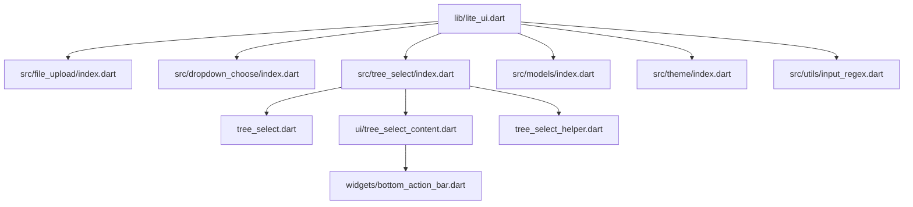
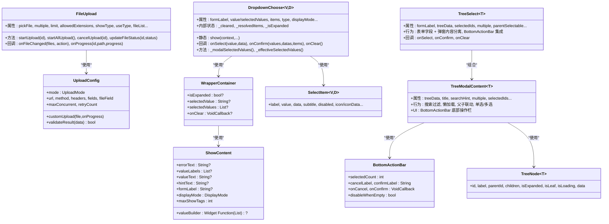
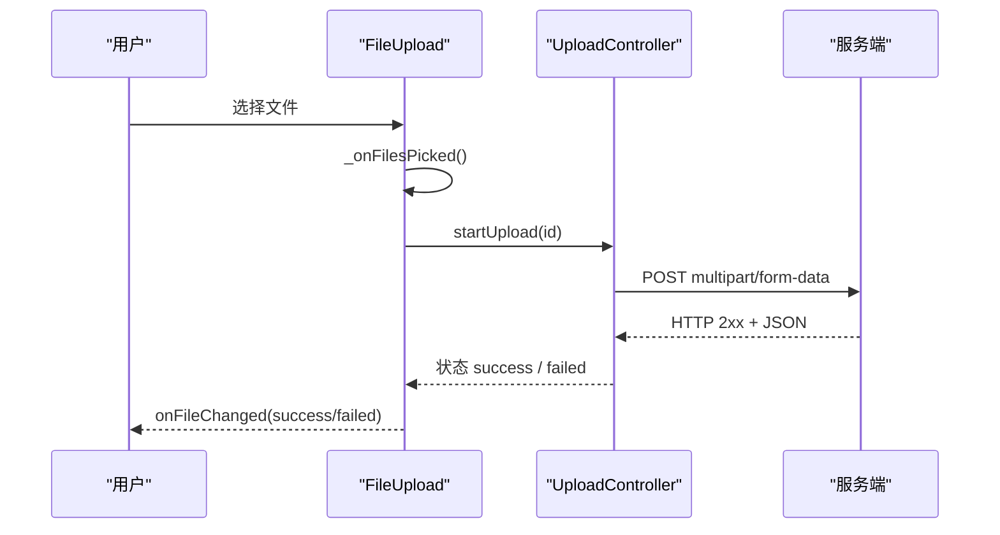
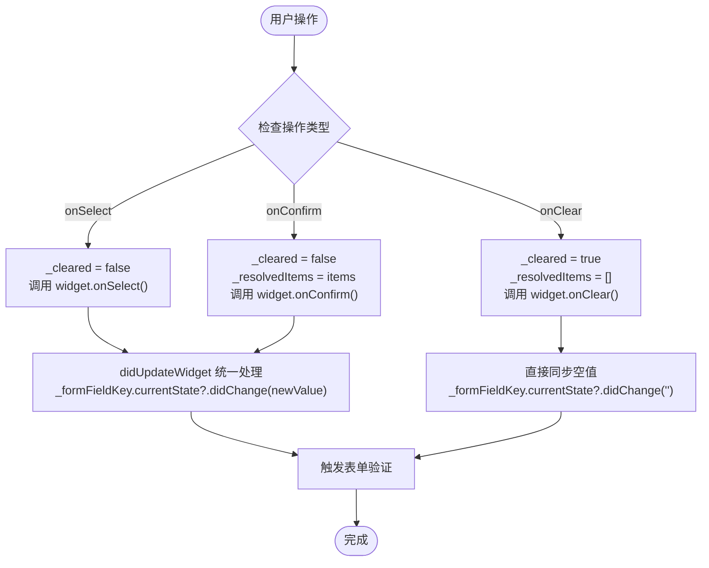
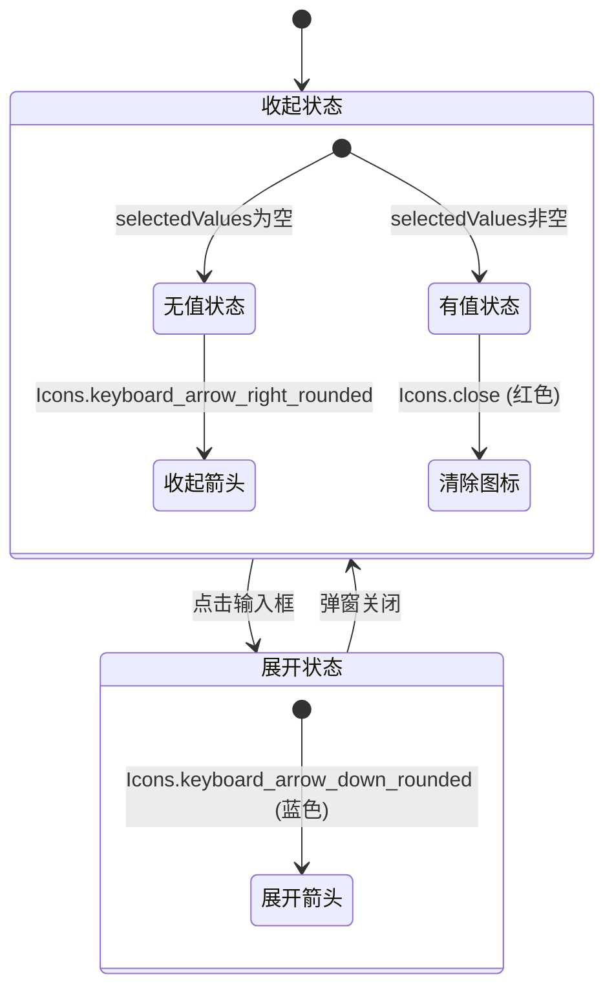
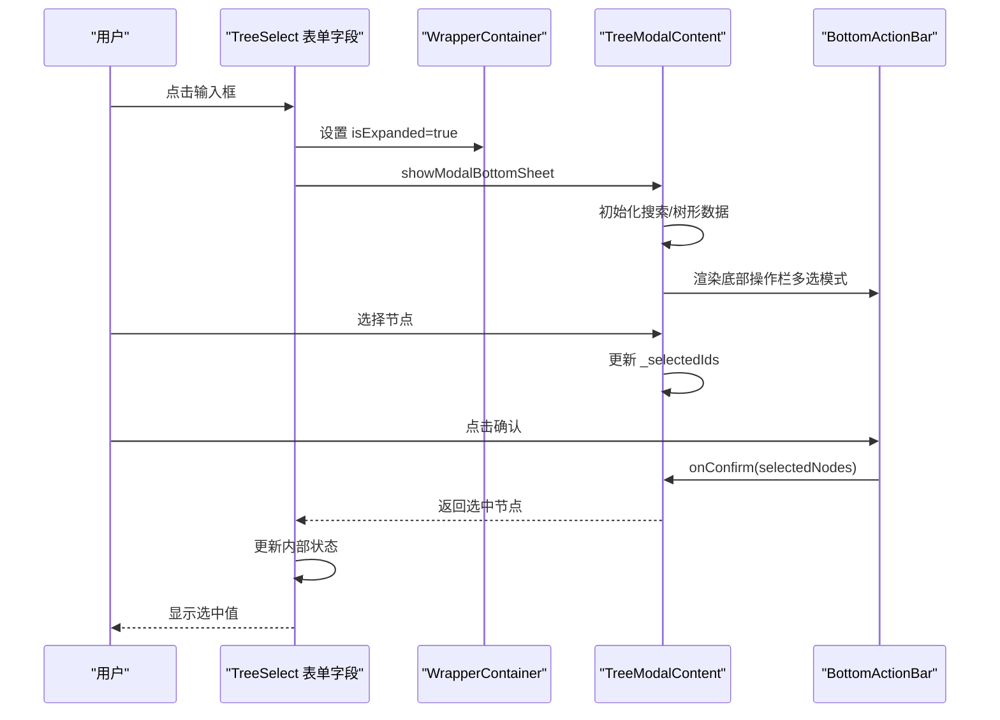
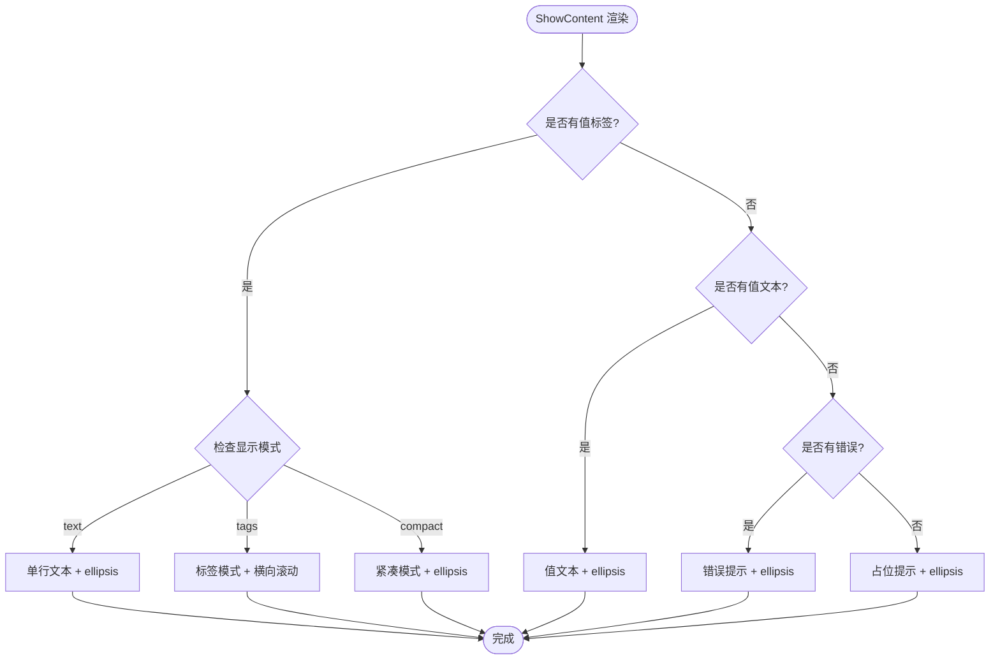
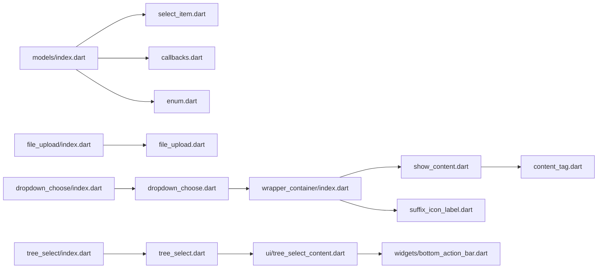

# 高级组件 API

<cite>
**本文引用的文件**   
- [lite_ui.dart](file://lib/lite_ui.dart)
- [file_upload.dart](file://lib/src/file_upload/file_upload.dart)
- [upload_config.dart](file://lib/src/file_upload/model/upload_config.dart)
- [index.dart（file_upload）](file://lib/src/file_upload/index.dart)
- [dropdown_choose.dart](file://lib/src/dropdown_choose/dropdown_choose.dart)
- [wrapper_container/index.dart](file://lib/src/wrapper_container/index.dart)
- [show_content.dart](file://lib/src/wrapper_container/show_content.dart)
- [suffix_icon_label.dart](file://lib/src/widgets/suffix_icon_label.dart)
- [content_tag.dart](file://lib/src/wrapper_container/content_tag.dart)
- [select_item.dart](file://lib/src/models/select_item.dart)
- [callbacks.dart](file://lib/src/models/callbacks.dart)
- [enum.dart（models）](file://lib/src/models/enum.dart)
- [tree_select.dart](file://lib/src/tree_select/tree_select.dart)
- [tree_select_content.dart](file://lib/src/tree_select/ui/tree_select_content.dart)
- [bottom_action_bar.dart](file://lib/src/widgets/bottom_action_bar.dart)
- [model.dart（tree_select）](file://lib/src/tree_select/model.dart)
- [index.dart（tree_select）](file://lib/src/tree_select/index.dart)
</cite>

## 更新摘要
**已进行的更改**   
- 更新了 TreeSelect 组件的表单字段能力，新增完整的 FormField 集成和 WrapperContainer 包装
- 增强了 BottomActionBar 集成，替换了自定义 BottomAction 组件，提供统一的底部操作栏
- 改进了 TreeSelect 的 API 设计，与 DropdownChoose 架构对齐，支持更灵活的配置选项
- 新增了 TreeModalContent 纯弹窗内容组件，分离表单字段和弹窗逻辑
- 优化了多选模式的确认按钮交互，支持已选数量展示和空选禁用功能

## 目录
1. [简介](#简介)
2. [项目结构](#项目结构)
3. [核心组件](#核心组件)
4. [架构总览](#架构总览)
5. [详细组件分析](#详细组件分析)
6. [依赖关系分析](#依赖关系分析)
7. [性能与大数据处理](#性能与大数据处理)
8. [故障排查指南](#故障排查指南)
9. [结论](#结论)
10. [附录：配置项速查](#附录配置项速查)

## 简介
本文件为 Lite UI 高级组件的权威 API 文档，聚焦以下复杂组件：
- 文件上传 FileUpload：支持多模式选择、自动/手动/自定义上传、进度回调、头像模式等。
- 下拉选择 DropdownChoose：本地过滤与远程搜索双模式、多选确认、标签展示、新增扩展点、清除回调、动态后缀图标、FormField 集成优化。
- **树形选择 TreeSelect**：**全新重构**，支持表单字段组件 + 弹窗内容分离架构、BottomActionBar 集成、懒加载子节点、搜索高亮、父子联动、单选/多选交互。

文档涵盖接口规范、参数说明、事件回调、状态管理、性能优化、内存管理与第三方集成方式，并提供可视化架构图与流程图，帮助开发者快速上手并高效使用。

## 项目结构
Lite UI 通过统一入口导出各模块，便于按需引入。核心导出路径如下：
- 组件导出：文件上传、下拉选择、树形选择等均在 lib/src 下按功能划分。
- 模型与枚举：统一的 SelectItem、回调类型、显示模式等定义在 models 中。
- 主题与工具：主题与输入校验工具独立模块。

章节来源
- [lite_ui.dart:1-19](file://lib/lite_ui.dart#L1-L19)

## 核心组件
本节概览三大高级组件的职责与能力边界：
- FileUpload：文件选择、预览、删除、替换、上传控制（自动/手动/自定义）、进度与状态回调、头像模式。
- DropdownChoose：表单字段封装、本地过滤与远程搜索、多选确认、值展示模式（文本/标签/紧凑）、新增扩展、清除回调、动态后缀图标、FormField 集成优化。
- **TreeSelect**：**全新架构**，包含表单字段组件 `TreeSelect` 和弹窗内容组件 `TreeModalContent`，支持 BottomActionBar 集成、懒加载、搜索高亮、父子联动、单选/多选确认。

章节来源
- [file_upload.dart:15-165](file://lib/src/file_upload/file_upload.dart#L15-L165)
- [dropdown_choose.dart:11-248](file://lib/src/dropdown_choose/dropdown_choose.dart#L11-L248)
- [tree_select.dart:26-172](file://lib/src/tree_select/tree_select.dart#L26-L172)
- [tree_select_content.dart:19-102](file://lib/src/tree_select/ui/tree_select_content.dart#L19-L102)

## 架构总览
下图展示了三个组件与其内部关键模块的关系，以及对外暴露的主要能力。

图表来源 
- [file_upload.dart:15-165](file://lib/src/file_upload/file_upload.dart#L15-L165)
- [upload_config.dart:38-99](file://lib/src/file_upload/model/upload_config.dart#L38-L99)
- [dropdown_choose.dart:11-248](file://lib/src/dropdown_choose/dropdown_choose.dart#L11-L248)
- [tree_select.dart:26-172](file://lib/src/tree_select/tree_select.dart#L26-L172)
- [tree_select_content.dart:19-102](file://lib/src/tree_select/ui/tree_select_content.dart#L19-L102)
- [bottom_action_bar.dart:6-53](file://lib/src/widgets/bottom_action_bar.dart#L6-L53)
- [wrapper_container/index.dart:10-82](file://lib/src/wrapper_container/index.dart#L10-L82)
- [show_content.dart:13-50](file://lib/src/wrapper_container/show_content.dart#L13-L50)

## 详细组件分析

### FileUpload 文件上传组件
- 能力概述
  - 选择模式：文件、相册、拍照、图片或相机、全部；头像模式自动限制为单图且默认图片或相机。
  - 展示模式：卡片网格、列表信息、自定义构建器。
  - 上传模式：自动上传、手动触发、自定义上传函数。
  - 状态管理：pending/uploading/success/failed，进度回调，外部可更新状态。
  - 编辑回显：支持初始 fileList，自动同步与去重，避免重复通知父组件。

- 关键参数与行为
  - pickFile：选择器行为，头像模式下受限制。
  - multiple/limit：多选与数量上限，达到上限后隐藏上传按钮。
  - allowedExtensions：仅对文件选择生效。
  - showType：card/textInfo/custom，custom 需传入 itemBuilder。
  - uploadConfig：启用上传能力，包含 mode/url/method/headers/fields/fileField/maxConcurrent/retryCount/customUpload/validateResult。
  - onFileChanged：文件增删/上传状态/进度变化时回调。
  - onProgress：上传进度回调（id, path, progress）。
  - useType：normal/avatar，avatar 会覆盖多项默认配置。
  - fileList：编辑回显，内部基于 url/name/size 签名比较，避免无效重建。

- 公开方法与状态
  - startUpload(id)：开始指定文件上传。
  - startAllUpload()：批量开始 pending 文件上传。
  - cancelUpload(id)：取消上传并恢复 pending。
  - updateFileStatus(id, status)：外部更新文件状态。
  - activeUploadCount：当前正在上传的文件数。

- 事件与回调
  - onFileChanged：动作包括 add/remove/uploading/progress/success/failed/defaultLoad。
  - onProgress：实时上报进度。

- 典型流程（自动上传）

章节来源
- [file_upload.dart:15-165](file://lib/src/file_upload/file_upload.dart#L15-L165)
- [file_upload.dart:173-234](file://lib/src/file_upload/file_upload.dart#L173-L234)
- [file_upload.dart:296-337](file://lib/src/file_upload/file_upload.dart#L296-L337)
- [file_upload.dart:379-447](file://lib/src/file_upload/file_upload.dart#L379-L447)
- [upload_config.dart:38-99](file://lib/src/file_upload/model/upload_config.dart#L38-L99)

### DropdownChoose 下拉选择组件
- 能力概述
  - 两种模式：本地过滤 filterable（直接传 items）与远程搜索 remote（onRemoteSearch）。
  - 单选/多选：单选点击即关闭；多选切换勾选，最终由 onConfirm 确认。
  - 值展示：text/tags/compact，支持自定义 valueBuilder。
  - 新增扩展：showAdd/onAdd 支持无结果时新增条目。
  - 已选回显：selectedItems 与 selectedValues 协同，确保 label 正确显示。
  - **清除功能**：onClear 回调支持清空选中值，动态后缀图标根据状态切换。
  - **状态管理**：内部 _cleared 状态确保清除后弹窗选中状态同步。
  - **FormField 集成优化**：增强的状态同步机制，解决验证后回显异常和清除后验证不生效问题。

- 关键参数与行为
  - type：filterable/remote，约束 items 与 onRemoteSearch 的使用。
  - multiple/maxCount：多选与最大可选数量。
  - displayMode/maxShowTags：值展示样式与紧凑模式显示数量。
  - onSelect/onConfirm：选中与确认回调，返回 value/data 或 values/datas/items。
  - onLabelsResolved：远程模式下解析已选值的 label 映射。
  - onDataLoaded：首次加载成功缓存，避免重复请求。
  - **onClear**：清除回调，点击后缀 close 图标时触发，用于清空选中值。

- 静态方法 show
  - 底部弹窗选择器，支持 title/subTitle/searchHint/cancelLabel/confirmLabel 等。
  - 支持 remote 专属 emptyText、onRemoteSearch。
  - 支持新增 showAdd/addLabel/onAdd。

- **新增功能详解**

#### FormField 状态同步机制优化
**更新** 修复了 DropdownChoose 组件中 FormField 内部状态与实际选中值不同步的问题：

**关键改进点：**
1. **统一状态同步**：在 `didUpdateWidget` 中统一处理 FormField 状态同步，避免重复调用
2. **清除功能增强**：onClear 回调中直接同步空值，确保验证能正确触发失败
3. **智能判断**：根据 multiple 模式计算正确的 newValue 值

#### 弹窗选中状态同步机制
修复了清除后弹窗仍显示已选中项的问题：
- 新增 `_modalSelectedValues()` 方法感知 `_cleared` 状态
- 弹窗打开时使用 `_modalSelectedValues()` 而非 `_effectiveSelectedValues()`
- 确保清除后弹窗不显示旧选中项

#### 动态后缀图标切换

章节来源
- [dropdown_choose.dart:11-248](file://lib/src/dropdown_choose/dropdown_choose.dart#L11-L248)
- [dropdown_choose.dart:250-410](file://lib/src/dropdown_choose/dropdown_choose.dart#L250-410)
- [wrapper_container/index.dart:10-82](file://lib/src/wrapper_container/index.dart#L10-L82)
- [suffix_icon_label.dart:1-39](file://lib/src/widgets/suffix_icon_label.dart#L1-L39)
- [select_item.dart:9-77](file://lib/src/models/select_item.dart#L9-L77)
- [callbacks.dart:1-13](file://lib/src/models/callbacks.dart#L1-L13)

### TreeSelect 树形选择组件
**重大更新** TreeSelect 组件已完成全新架构重构，与 DropdownChoose 保持一致的设计模式。

- **全新架构设计**
  - **表单字段组件** `TreeSelect`：完整的 FormField 集成，支持表单校验、保存、清除等功能
  - **弹窗内容组件** `TreeModalContent`：纯弹窗逻辑，包含搜索、树形列表、选择交互
  - **底部操作栏** `BottomActionBar`：统一的底部按钮区域，支持已选数量展示和空选禁用

- **核心特性**
  - 表单字段封装：支持 formLabel、subTitle、hintText、required 等标准表单属性
  - WrapperContainer 集成：统一的值展示、清除图标、展开状态管理
  - BottomActionBar 集成：多选模式下显示已选数量，支持空选禁用确认
  - 懒加载子节点：onLoadChildren 异步加载，支持父子联动
  - 搜索过滤与高亮：关键字匹配，支持自定义高亮样式
  - 父子联动：parentSelectable 控制父节点是否可选中

- **关键参数与行为**
  - formLabel/subTitle/hintText：表单标签、副标题、占位提示
  - required/multiple：必填标志和多选模式
  - treeData/selectedIds：树形数据源和初始选中ID集合
  - parentSelectable：父节点可选开关
  - showSearch/searchHint：搜索功能和提示文字
  - onLoadChildren：懒加载回调
  - highlightStyle：关键字高亮样式
  - validator/autovalidateMode/onSaved：表单验证相关
  - displayMode/maxShowTags/valueBuilder：值展示模式配置
  - onSelect/onConfirm/onClear：选择、确认、清除回调

- **BottomActionBar 集成特性**
  - 已选数量展示：实时显示 "已选 N 项"
  - 空选禁用：当 selectedCount=0 时可禁用确认按钮
  - 查看已选项：点击已选数量可查看已选项列表
  - 自定义按钮样式：支持 confirmButtonColor、confirmButtonTextColor、cancelButtonColor

- **典型流程（表单字段 + 弹窗）**

**Section sources**
- [tree_select.dart:26-172](file://lib/src/tree_select/tree_select.dart#L26-L172)
- [tree_select.dart:174-423](file://lib/src/tree_select/tree_select.dart#L174-L423)
- [tree_select_content.dart:19-102](file://lib/src/tree_select/ui/tree_select_content.dart#L19-L102)
- [tree_select_content.dart:258-311](file://lib/src/tree_select/ui/tree_select_content.dart#L258-L311)
- [bottom_action_bar.dart:6-53](file://lib/src/widgets/bottom_action_bar.dart#L6-L53)

### ShowContent 内容显示组件
- 能力概述
  - 多种显示模式：text（单行文本）、tags（标签模式）、compact（紧凑模式）
  - 优先级处理：自定义构建器 > 值标签 > 值文本 > 错误提示 > 占位提示
  - **文本溢出处理**：所有文本内容均支持 maxLines: 1 和 overflow: TextOverflow.ellipsis，确保长文本不会破坏布局
  - 主题适配：自动应用 LiteUITheme 的颜色配置

- 关键参数与行为
  - errorText：错误提示文字（有值时优先显示）
  - valueLabels：选中值的 label 列表
  - valueText：选中的值文本（无 labels 时使用）
  - hintText：占位提示文字（无值时显示）
  - formLabel：表单标签（用于占位提示）
  - displayMode：值显示模式，默认 DisplayMode.text
  - maxShowTags：compact 模式下最多显示的 tag 数，默认 3
  - valueBuilder：自定义值显示 Widget 构建器（优先级最高）

- **文本溢出处理增强**
  **更新** ShowContent 组件现在为所有文本内容添加了文本溢出处理能力：

**关键改进点：**
1. **统一溢出处理**：所有 Text 组件都设置了 maxLines: 1 和 overflow: TextOverflow.ellipsis
2. **布局稳定性**：确保长文本内容不会破坏整体布局
3. **用户体验优化**：提供省略号提示，用户可以了解存在更多内容

章节来源
- [show_content.dart:1-145](file://lib/src/wrapper_container/show_content.dart#L1-L145)
- [wrapper_container/index.dart:114-124](file://lib/src/wrapper_container/index.dart#L114-L124)

## 依赖关系分析
- 组件间耦合度低，各自通过独立的 index.dart 导出，便于按需引入。
- 共享模型：SelectItem、回调类型、显示模式等在 models 中统一定义，保证一致性。
- 主题与工具：theme 与 input_regex 提供通用能力，不侵入业务逻辑。
- **新增依赖**：DropdownChoose 现在依赖 WrapperContainer 和 SuffixIconLabel 实现动态图标切换，WrapperContainer 依赖 ShowContent 实现内容显示。**TreeSelect 依赖 BottomActionBar 实现统一的底部操作栏**。

**图表来源**
- [index.dart（file_upload）:1-6](file://lib/src/file_upload/index.dart#L1-L6)
- [index.dart（dropdown_choose）:1-5](file://lib/src/dropdown_choose/index.dart#L1-L5)
- [index.dart（tree_select）:1-7](file://lib/src/tree_select/index.dart#L1-L7)
- [models/index.dart:1-4](file://lib/src/models/index.dart#L1-L4)

章节来源
- [index.dart（file_upload）:1-6](file://lib/src/file_upload/index.dart#L1-L6)
- [index.dart（dropdown_choose）:1-5](file://lib/src/dropdown_choose/index.dart#L1-L5)
- [index.dart（tree_select）:1-7](file://lib/src/tree_select/index.dart#L1-L7)
- [models/index.dart:1-4](file://lib/src/models/index.dart#L1-L4)

## 性能与大数据处理
- FileUpload
  - 并发控制：maxConcurrent 合理设置，避免过多并发导致卡顿。
  - 大文件策略：使用 customUpload 实现分片上传与断点续传，配合 onProgress 实时更新 UI。
  - 内存优化：避免在 onFileChanged 中执行重型操作，必要时节流或防抖。
- DropdownChoose
  - 本地过滤：适用于中小数据集；大数据集建议使用 remote 模式分页加载。
  - 缓存策略：首次加载成功后缓存 items，减少重复请求。
  - 标签展示：tags/compact 模式注意横向滚动性能，必要时虚拟化列表。
  - **状态管理优化**：清除状态管理避免不必要的重新计算，提升响应性能。
  - **FormField 集成优化**：统一的状态同步机制减少重复计算，提升表单验证性能。
- **TreeSelect**
  - **懒加载优化**：仅在需要时加载子节点，降低首屏渲染压力。
  - **搜索优化**：关键字匹配在前端轻量完成；超大数据集建议后端过滤。
  - **数据结构保护**：使用 cloneTree 保护原始数据，避免不必要的重新计算。
  - **BottomActionBar 性能**：已选数量实时更新，避免频繁 setState。
  - **表单字段优化**：WrapperContainer 统一管理状态，减少重复渲染。
- **ShowContent 性能优化**
  - **文本溢出处理**：使用 maxLines: 1 和 TextOverflow.ellipsis 避免长文本导致的布局重排
  - **条件渲染**：根据优先级快速决定显示内容，减少不必要的计算
  - **主题适配**：通过 LiteUITheme 获取颜色，避免硬编码

## 故障排查指南
- FileUpload
  - 上传失败：检查 validateResult 是否正确判断业务成功；查看 onFileChanged 的 failed 动作。
  - 进度不更新：确认 onProgress 回调是否被调用；检查 maxConcurrent 是否过小。
  - 头像模式异常：确认 pickFile 是否为 gallery/camera/imageOrCamera；limit=1、multiple=false 自动生效。
- DropdownChoose
  - 远程模式报错：确保 onRemoteSearch 非空；检查返回的 SelectItem 列表格式。
  - 已选 label 未显示：传入 selectedItems 或使用 onLabelsResolved 解析 label。
  - 多选确认未触发：确认 multiple=true 且 onConfirm 已设置。
  - **清除功能异常**：确认 onClear 回调已设置；检查外部组件是否正确执行 setState 清空值。
  - **弹窗状态不同步**：确认 _cleared 状态管理正常；检查 _modalSelectedValues() 是否正确返回 null。
  - **FormField 验证问题**：确认 didUpdateWidget 中的状态同步逻辑；检查 initialValue 计算是否正确。
  - **后缀图标不切换**：确认 isExpanded、selectedValue、selectedValues 参数传递正确。
- **TreeSelect**
  - **表单字段问题**：确认 FormField 的 validator、autovalidateMode、onSaved 配置正确。
  - **弹窗不显示**：检查 TreeModalContent 的参数传递，特别是 treeData 和 selectedIds。
  - **BottomActionBar 异常**：确认 multiple=true 时才会显示；检查 selectedCount 计算是否正确。
  - **懒加载无响应**：检查 onLoadChildren 是否返回有效 children；确认 isLoading 状态重置。
  - **父子联动异常**：确认 parentSelectable 配置是否符合预期；检查 selectedIds 同步逻辑。
  - **搜索过滤失效**：检查 keyword 传递和 _applyFilter 方法调用。
- **ShowContent 文本显示问题**
  - **文本溢出**：确认所有 Text 组件都设置了 maxLines: 1 和 overflow: TextOverflow.ellipsis
  - **布局错乱**：检查 wrapper_container 的高度设置是否足够容纳内容
  - **主题颜色异常**：确认 LiteUITheme 是否正确配置

章节来源
- [file_upload.dart:341-375](file://lib/src/file_upload/file_upload.dart#L341-L375)
- [dropdown_choose.dart:250-410](file://lib/src/dropdown_choose/dropdown_choose.dart#L250-410)
- [dropdown_choose.dart:410-416](file://lib/src/dropdown_choose/dropdown_choose.dart#L410-L416)
- [suffix_icon_label.dart:16-37](file://lib/src/widgets/suffix_icon_label.dart#L16-L37)
- [tree_select.dart:174-423](file://lib/src/tree_select/tree_select.dart#L174-L423)
- [tree_select_content.dart:258-311](file://lib/src/tree_select/ui/tree_select_content.dart#L258-L311)
- [bottom_action_bar.dart:56-134](file://lib/src/widgets/bottom_action_bar.dart#L56-L134)
- [show_content.dart:65-75](file://lib/src/wrapper_container/show_content.dart#L65-L75)
- [show_content.dart:114-124](file://lib/src/wrapper_container/show_content.dart#L114-L124)
- [show_content.dart:127-134](file://lib/src/wrapper_container/show_content.dart#L127-L134)
- [show_content.dart:137-143](file://lib/src/wrapper_container/show_content.dart#L137-L143)

## 结论
Lite UI 的高级组件在设计上注重模块化、可扩展性与性能优化。FileUpload 提供灵活的上传策略与状态管理；DropdownChoose 支持本地与远程双模式，兼顾易用性与扩展性，新增的清除回调、动态后缀图标功能和优化的 FormField 集成进一步提升了用户体验；**TreeSelect 组件经过全新重构，采用与 DropdownChoose 一致的架构设计，通过表单字段组件和弹窗内容组件的分离，结合 BottomActionBar 的统一底部操作栏，提供了更加灵活和强大的树形选择能力**。遵循本文档的配置与最佳实践，可在复杂业务场景中稳定高效地使用这些组件。

## 附录：配置项速查
- FileUpload
  - 选择模式：pickFile（file/gallery/camera/all/imageOrCamera）
  - 展示模式：showType（card/textInfo/custom）
  - 使用模式：useType（normal/avatar）
  - 上传配置：uploadConfig（mode/url/method/headers/fields/fileField/maxConcurrent/retryCount/customUpload/validateResult）
  - 回调：onFileChanged、onProgress
- DropdownChoose
  - 模式：type（filterable/remote）
  - 展示：displayMode（text/tags/compact）、maxShowTags
  - 选择：multiple、maxCount、onSelect、onConfirm
  - 扩展：showAdd、addLabel、onAdd、onLabelsResolved、onDataLoaded
  - **新增**：onClear（清除回调）
  - **状态管理**：内部 _cleared 状态、_modalSelectedValues() 方法、FormField 集成优化
- **TreeSelect**
  - **表单字段**：formLabel、subTitle、hintText、required、validator、autovalidateMode、onSaved
  - **数据配置**：treeData、selectedIds、parentSelectable、showSearch、searchHint、emptyText
  - **懒加载**：onLoadChildren、highlightStyle
  - **弹窗配置**：title、cancelLabel、confirmLabel、searchButtonColor、confirmButtonColor、cancelButtonColor
  - **值展示**：displayMode、maxShowTags、valueBuilder
  - **回调**：onSelect、onConfirm、onClear
  - **BottomActionBar**：selectedCount、disableWhenEmpty、onViewSelected
- **ShowContent**
  - 显示模式：displayMode（text/tags/compact）
  - 内容参数：errorText、valueLabels、valueText、hintText、formLabel
  - 自定义：valueBuilder、maxShowTags
  - **文本处理**：maxLines: 1、overflow: TextOverflow.ellipsis

章节来源
- [file_upload.dart:15-165](file://lib/src/file_upload/file_upload.dart#L15-L165)
- [upload_config.dart:38-99](file://lib/src/file_upload/model/upload_config.dart#L38-L99)
- [dropdown_choose.dart:11-248](file://lib/src/dropdown_choose/dropdown_choose.dart#L11-L248)
- [wrapper_container/index.dart:52-62](file://lib/src/wrapper_container/index.dart#L52-L62)
- [suffix_icon_label.dart:3-11](file://lib/src/widgets/suffix_icon_label.dart#L3-L11)
- [show_content.dart:13-50](file://lib/src/wrapper_container/show_content.dart#L13-L50)
- [tree_select.dart:26-172](file://lib/src/tree_select/tree_select.dart#L26-L172)
- [tree_select_content.dart:19-102](file://lib/src/tree_select/ui/tree_select_content.dart#L19-L102)
- [bottom_action_bar.dart:6-53](file://lib/src/widgets/bottom_action_bar.dart#L6-L53)
- [model.dart（tree_select）:59-122](file://lib/src/tree_select/model.dart#L59-L122)