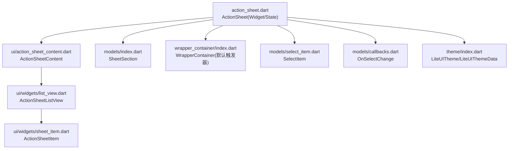
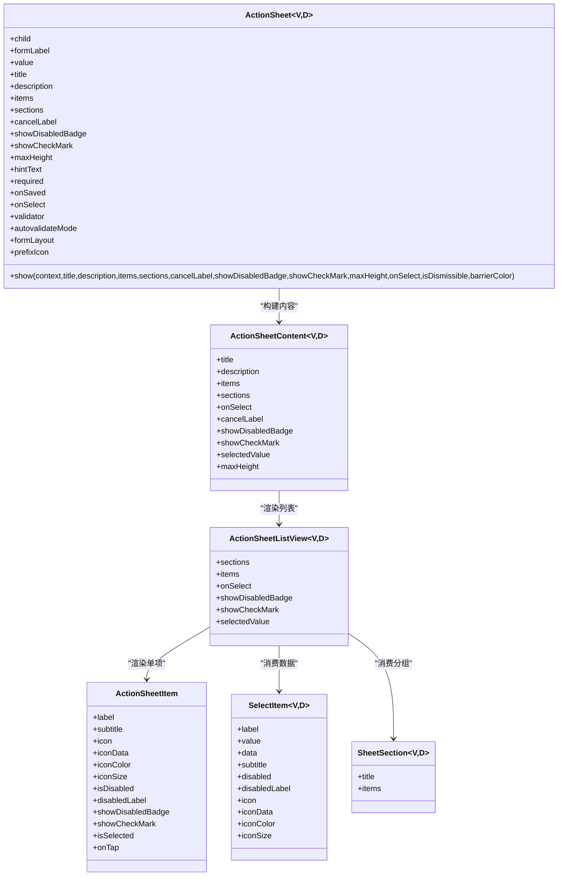
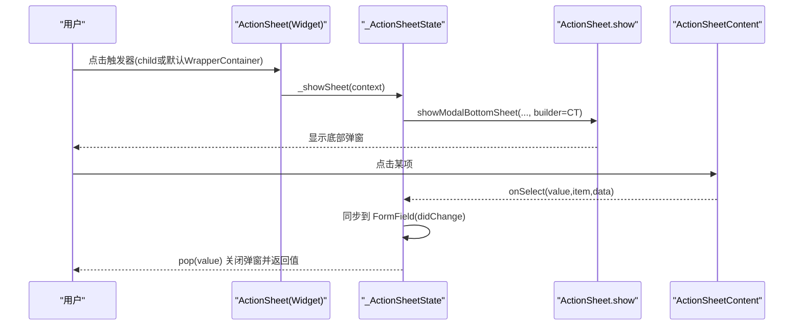
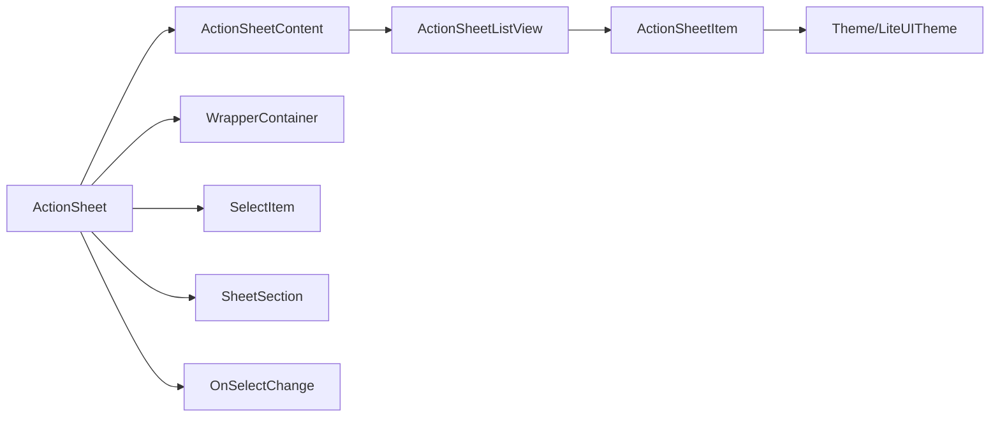

# ActionSheet 底部弹窗

<cite>
**本文引用的文件**   
- [lib/src/action_sheet/action_sheet.dart](file://lib/src/action_sheet/action_sheet.dart)
- [lib/src/action_sheet/index.dart](file://lib/src/action_sheet/index.dart)
- [lib/src/action_sheet/ui/action_sheet_content.dart](file://lib/src/action_sheet/ui/action_sheet_content.dart)
- [lib/src/action_sheet/ui/widgets/list_view.dart](file://lib/src/action_sheet/ui/widgets/list_view.dart)
- [lib/src/action_sheet/ui/widgets/sheet_item.dart](file://lib/src/action_sheet/ui/widgets/sheet_item.dart)
- [lib/src/models/select_item.dart](file://lib/src/models/select_item.dart)
- [lib/src/models/callbacks.dart](file://lib/src/models/callbacks.dart)
- [lib/src/theme/index.dart](file://lib/src/theme/index.dart)
- [lib/src/wrapper_container/index.dart](file://lib/src/wrapper_container/index.dart)
- [example/lib/pages/action_sheet_demo.dart](file://example/lib/pages/action_sheet_demo.dart)
- [example/lib/pages/action_sheet_new_features_demo.dart](file://example/lib/pages/action_sheet_new_features_demo.dart)
</cite>

## 更新摘要
**所做更改**   
- 新增选择指示器功能，包括 showCheckMark 和 selectedValue 属性
- ActionSheetItem 组件新增绿色勾选图标显示功能
- ActionSheetSection 类重命名为 SheetSection
- 更新了相关 API 参考和使用示例

## 目录
1. [简介](#简介)
2. [项目结构](#项目结构)
3. [核心组件](#核心组件)
4. [架构总览](#架构总览)
5. [详细组件分析](#详细组件分析)
6. [依赖关系分析](#依赖关系分析)
7. [性能与内存优化](#性能与内存优化)
8. [主题与样式定制](#主题与样式定制)
9. [API 参考](#api-参考)
10. [使用示例与场景](#使用示例与场景)
11. [故障排查](#故障排查)
12. [结论](#结论)

## 简介
ActionSheet 是一个底部弹窗组件，用于展示一组操作项供用户选择。它支持：
- 两种数据模式：普通列表与分组列表（优先）
- 受控与非受控两种用法
- 图标、禁用状态、禁用标签提示
- **新增：选择指示器功能，支持显示绿色勾选标记**
- 表单集成（标签、占位、必填校验、保存回调）
- 编程式调用（静态 show 方法）与自定义触发器

该组件将"弹窗壳"和"内容渲染"解耦：弹窗壳由 ActionSheet 负责，内容渲染委托给 ActionSheetContent，列表渲染由 ActionSheetListView 与 ActionSheetItem 完成。

## 项目结构
ActionSheet 相关代码位于 lib/src/action_sheet 目录下，包含模型、UI 组件与导出入口；数据项模型 SelectItem 与回调类型定义在 models 目录；主题系统通过 theme/index.dart 提供全局主题能力；默认触发器包装容器为 wrapper_container。

图表来源
- [lib/src/action_sheet/action_sheet.dart:1-322](file://lib/src/action_sheet/action_sheet.dart#L1-L322)
- [lib/src/action_sheet/ui/action_sheet_content.dart:1-149](file://lib/src/action_sheet/ui/action_sheet_content.dart#L1-L149)
- [lib/src/action_sheet/ui/widgets/list_view.dart:1-120](file://lib/src/action_sheet/ui/widgets/list_view.dart#L1-L120)
- [lib/src/action_sheet/ui/widgets/sheet_item.dart:1-147](file://lib/src/action_sheet/ui/widgets/sheet_item.dart#L1-L147)
- [lib/src/models/select_item.dart:1-91](file://lib/src/models/select_item.dart#L1-L91)
- [lib/src/models/callbacks.dart:1-13](file://lib/src/models/callbacks.dart#L1-L13)
- [lib/src/theme/index.dart:1-73](file://lib/src/theme/index.dart#L1-L73)
- [lib/src/wrapper_container/index.dart:1-119](file://lib/src/wrapper_container/index.dart#L1-L119)

章节来源
- [lib/src/action_sheet/index.dart:1-2](file://lib/src/action_sheet/index.dart#L1-L2)

## 核心组件
- ActionSheet（Widget + State）
  - 职责：弹窗壳、受控值匹配、表单字段封装、默认触发器渲染、静态 show 弹出
- ActionSheetContent
  - 职责：标题/描述、可滚动列表、取消按钮、最大高度控制
- ActionSheetListView
  - 职责：统一渲染分组与普通列表，处理分割线与组间距
- ActionSheetItem
  - 职责：单行操作项渲染，支持图标、禁用态、禁用标签、**新增：选择指示器显示**
- SelectItem<V, D>
  - 职责：数据项模型（label/value/data/禁用/图标等）
- SheetSection<V, D>
  - 职责：**重命名后的分组模型**（title/items）
- WrapperContainer
  - 职责：默认触发器包装（标签、值显示、错误提示、后缀图标）

章节来源
- [lib/src/action_sheet/action_sheet.dart:21-165](file://lib/src/action_sheet/action_sheet.dart#L21-L165)
- [lib/src/action_sheet/ui/action_sheet_content.dart:18-61](file://lib/src/action_sheet/ui/action_sheet_content.dart#L18-L61)
- [lib/src/action_sheet/ui/widgets/list_view.dart:11-30](file://lib/src/action_sheet/ui/widgets/list_view.dart#L11-L30)
- [lib/src/action_sheet/ui/widgets/sheet_item.dart:4-55](file://lib/src/action_sheet/ui/widgets/sheet_item.dart#L4-L55)
- [lib/src/models/select_item.dart:9-77](file://lib/src/models/select_item.dart#L9-L77)
- [lib/src/models/select_item.dart:82-90](file://lib/src/models/select_item.dart#L82-L90)
- [lib/src/wrapper_container/index.dart:13-118](file://lib/src/wrapper_container/index.dart#L13-L118)

## 架构总览
ActionSheet 采用"壳-内容-列表-项"的分层设计，便于扩展与复用。

图表来源
- [lib/src/action_sheet/action_sheet.dart:21-165](file://lib/src/action_sheet/action_sheet.dart#L21-L165)
- [lib/src/action_sheet/ui/action_sheet_content.dart:18-61](file://lib/src/action_sheet/ui/action_sheet_content.dart#L18-L61)
- [lib/src/action_sheet/ui/widgets/list_view.dart:11-30](file://lib/src/action_sheet/ui/widgets/list_view.dart#L11-L30)
- [lib/src/action_sheet/ui/widgets/sheet_item.dart:4-55](file://lib/src/action_sheet/ui/widgets/sheet_item.dart#L4-L55)
- [lib/src/models/select_item.dart:9-77](file://lib/src/models/select_item.dart#L9-L77)
- [lib/src/models/select_item.dart:82-90](file://lib/src/models/select_item.dart#L82-L90)

## 详细组件分析

### ActionSheet（弹窗壳与受控逻辑）
- 三种使用方式
  - 自带默认触发器 UI：不传 child 时渲染 WrapperContainer
  - 自定义触发器：传入 child，点击 child 弹出 Sheet
  - 编程式调用：ActionSheet.show(...)
- 受控模式
  - value 传入后，自动从 items/sections 中匹配 label 显示在触发器上
  - onSelect 回调中更新父级 state，实现受控
- 表单集成
  - 包裹 FormField，支持 required、validator、autovalidateMode、onSaved
  - 默认验证规则：当 required 为 true 且无选中值时返回错误信息
- 弹窗参数
  - title/description/cancelLabel/showDisabledBadge/**showCheckMark**/maxHeight/isDismissible/barrierColor
  - **新增：selectedValue 参数用于指定当前选中的值**

图表来源
- [lib/src/action_sheet/action_sheet.dart:213-235](file://lib/src/action_sheet/action_sheet.dart#L213-L235)
- [lib/src/action_sheet/action_sheet.dart:122-161](file://lib/src/action_sheet/action_sheet.dart#L122-L161)
- [lib/src/action_sheet/ui/action_sheet_content.dart:65-147](file://lib/src/action_sheet/ui/action_sheet_content.dart#L65-L147)

章节来源
- [lib/src/action_sheet/action_sheet.dart:21-165](file://lib/src/action_sheet/action_sheet.dart#L21-L165)
- [lib/src/action_sheet/action_sheet.dart:167-322](file://lib/src/action_sheet/action_sheet.dart#L167-L322)

### ActionSheetContent（标题+列表+取消）
- 支持两种数据模式：items 与 sections（sections 优先）
- 最大高度默认 75% 屏幕高度，可通过 maxHeight 覆盖
- 取消按钮固定于底部，点击 Navigator.pop() 关闭
- **新增：支持 showCheckMark 和 selectedValue 参数传递**

章节来源
- [lib/src/action_sheet/ui/action_sheet_content.dart:18-61](file://lib/src/action_sheet/ui/action_sheet_content.dart#L18-L61)
- [lib/src/action_sheet/ui/action_sheet_content.dart:65-147](file://lib/src/action_sheet/ui/action_sheet_content.dart#L65-L147)

### ActionSheetListView（分组/普通列表渲染）
- 分组模式：每组可选带标题，组内项之间无分割线，组间有间距
- 普通模式：扁平列表，项之间有分割线
- 每项通过 ActionSheetItem 渲染，点击回调返回 value 与 data
- **新增：支持 showCheckMark 和 selectedValue 参数，用于计算 isSelected 状态**

章节来源
- [lib/src/action_sheet/ui/widgets/list_view.dart:11-30](file://lib/src/action_sheet/ui/widgets/list_view.dart#L11-L30)
- [lib/src/action_sheet/ui/widgets/list_view.dart:34-119](file://lib/src/action_sheet/ui/widgets/list_view.dart#L34-L119)

### ActionSheetItem（单项渲染）
- 支持 icon/iconData/iconColor/iconSize
- 禁用态：透明度降低、文本与图标颜色变化、点击无效
- 可选禁用标签：当 disabled=true 且 showDisabledBadge=true 时显示
- **新增：支持 showCheckMark 和 isSelected 属性，显示绿色勾选图标**

章节来源
- [lib/src/action_sheet/ui/widgets/sheet_item.dart:4-55](file://lib/src/action_sheet/ui/widgets/sheet_item.dart#L4-L55)
- [lib/src/action_sheet/ui/widgets/sheet_item.dart:57-146](file://lib/src/action_sheet/ui/widgets/sheet_item.dart#L57-L146)

### SelectItem 与 SheetSection（数据模型）
- SelectItem：label/value/data/subtitle/disabled/disabledLabel/icon/iconData/iconColor/iconSize
- **SheetSection：title/items（原 ActionSheetSection 已重命名）**

章节来源
- [lib/src/models/select_item.dart:9-77](file://lib/src/models/select_item.dart#L9-L77)
- [lib/src/models/select_item.dart:82-90](file://lib/src/models/select_item.dart#L82-L90)

### WrapperContainer（默认触发器）
- 提供表单标签、值显示、错误提示、后缀图标
- 与 ActionSheet 的 formLayout、required、errorText 等配合

章节来源
- [lib/src/wrapper_container/index.dart:13-118](file://lib/src/wrapper_container/index.dart#L13-L118)

## 依赖关系分析
- ActionSheet 依赖：
  - ActionSheetContent（内容渲染）
  - SelectItem/SheetSection（数据模型）
  - OnSelectChange（回调类型）
  - WrapperContainer（默认触发器）
  - LiteUITheme（主题色读取）
- ActionSheetContent 依赖：
  - ActionSheetListView（列表渲染）
- ActionSheetListView 依赖：
  - ActionSheetItem（单项渲染）
  - SelectItem/SheetSection（数据）

图表来源
- [lib/src/action_sheet/action_sheet.dart:1-322](file://lib/src/action_sheet/action_sheet.dart#L1-L322)
- [lib/src/action_sheet/ui/action_sheet_content.dart:1-149](file://lib/src/action_sheet/ui/action_sheet_content.dart#L1-L149)
- [lib/src/action_sheet/ui/widgets/list_view.dart:1-120](file://lib/src/action_sheet/ui/widgets/list_view.dart#L1-L120)
- [lib/src/action_sheet/ui/widgets/sheet_item.dart:1-147](file://lib/src/action_sheet/ui/widgets/sheet_item.dart#L1-L147)
- [lib/src/models/select_item.dart:1-91](file://lib/src/models/select_item.dart#L1-L91)
- [lib/src/models/callbacks.dart:1-13](file://lib/src/models/callbacks.dart#L1-L13)
- [lib/src/theme/index.dart:1-73](file://lib/src/theme/index.dart#L1-L73)
- [lib/src/wrapper_container/index.dart:1-119](file://lib/src/wrapper_container/index.dart#L1-L119)

章节来源
- [lib/src/action_sheet/action_sheet.dart:1-322](file://lib/src/action_sheet/action_sheet.dart#L1-L322)

## 性能与内存优化
- 列表渲染
  - 使用 SingleChildScrollView 承载内容，适合中等规模数据；若数据量极大，建议在上层分页或虚拟列表化
  - 分组模式下避免重复计算，确保 sections/items 稳定引用，减少重建
- 受控模式
  - 父组件应缓存 SelectItem 列表，避免每次 rebuild 创建新对象导致不必要的重绘
  - onSelect 中仅更新必要 state，避免大范围 setState
- 弹窗生命周期
  - showModalBottomSheet 会创建新的 BuildContext，注意在回调中正确获取上下文
  - isDismissible 可根据业务需要关闭遮罩点击关闭，防止误触
- 主题与样式
  - 通过 LiteUITheme 统一设置颜色，避免在每个组件中硬编码颜色
- 内存优化
  - 避免在 itemBuilder 中创建昂贵 Widget，必要时使用 const 构造
  - 图标资源尽量复用，避免重复加载

[本节为通用指导，不直接分析具体文件]

## 主题与样式定制
- 主题系统
  - LiteUITheme/LiteUIThemeData 提供库级默认颜色配置，可在 App 层包裹自定义
  - ActionSheetItem 的颜色取自 Theme.of(context) 与 LiteUITheme 的错误色
- 自定义样式建议
  - 通过 LiteUIThemeData 调整 errorColor、textColor、borderRadius 等
  - 如需深度定制弹窗外观，可在外层包裹自定义 Modal 或使用自定义 child 触发器

章节来源
- [lib/src/theme/index.dart:6-72](file://lib/src/theme/index.dart#L6-L72)
- [lib/src/action_sheet/ui/widgets/sheet_item.dart:133-145](file://lib/src/action_sheet/ui/widgets/sheet_item.dart#L133-L145)

## API 参考

### ActionSheet（构造函数参数）
- child: Widget? — 自定义触发器
- formLabel: String? — 表单标签
- value: V? — 当前选中值（受控）
- title: String? — 主标题
- description: String? — 副标题/描述
- items: List<SelectItem<V, D>>? — 普通列表数据
- sections: List<SheetSection<V, D>>? — 分组数据（优先）
- cancelLabel: String — 取消按钮文字，默认「取消」
- showDisabledBadge: bool — 是否显示禁用项标签
- **showCheckMark: bool — 是否显示选中状态标记，默认 true**
- maxHeight: double? — 最大高度（覆盖默认 75%）
- hintText: String? — 占位提示
- required: bool — 是否必填
- onSaved: Function(String)? — 保存回调
- onSelect: OnSelectChange<V, D>? — 选中回调
- validator: String? Function(String?)? — 自定义校验
- autovalidateMode: AutovalidateMode — 自动验证模式
- formLayout: FormLayout — 表单布局方式
- prefixIcon: Widget? — 前置图标

章节来源
- [lib/src/action_sheet/action_sheet.dart:21-108](file://lib/src/action_sheet/action_sheet.dart#L21-L108)

### ActionSheet.show（静态方法）
- context: BuildContext
- title: String?
- description: String?
- items: List<SelectItem<V, D>>?
- sections: List<SheetSection<V, D>>?
- cancelLabel: String
- showDisabledBadge: bool
- **showCheckMark: bool — 是否显示选中状态标记，默认 true**
- **selectedValue: V? — 当前选中的值**
- maxHeight: double?
- onSelect: OnSelectChange<V, D>?
- isDismissible: bool — 点击遮罩是否可关闭
- barrierColor: Color? — 遮罩颜色
- 返回值: Future<V?> — 选中的 value

章节来源
- [lib/src/action_sheet/action_sheet.dart:122-161](file://lib/src/action_sheet/action_sheet.dart#L122-L161)

### ActionSheetContent（属性）
- title/description/items/sections/onSelect/cancelLabel/showDisabledBadge/**showCheckMark**/**selectedValue**/maxHeight

章节来源
- [lib/src/action_sheet/ui/action_sheet_content.dart:18-61](file://lib/src/action_sheet/ui/action_sheet_content.dart#L18-L61)

### ActionSheetListView（属性）
- sections/items/onSelect/showDisabledBadge/**showCheckMark**/**selectedValue**

章节来源
- [lib/src/action_sheet/ui/widgets/list_view.dart:11-30](file://lib/src/action_sheet/ui/widgets/list_view.dart#L11-L30)

### ActionSheetItem（属性）
- label/subtitle/icon/iconData/iconColor/iconSize/isDisabled/disabledLabel/showDisabledBadge/**showCheckMark**/**isSelected**/onTap

章节来源
- [lib/src/action_sheet/ui/widgets/sheet_item.dart:4-55](file://lib/src/action_sheet/ui/widgets/sheet_item.dart#L4-L55)

### SelectItem（属性与工厂）
- label/value/data/subtitle/disabled/disabledLabel/icon/iconData/iconColor/iconSize
- withIcon(...) 工厂方法

章节来源
- [lib/src/models/select_item.dart:9-77](file://lib/src/models/select_item.dart#L9-L77)

### SheetSection（属性）
- **title/items（原 ActionSheetSection 已重命名为 SheetSection）**

章节来源
- [lib/src/models/select_item.dart:82-90](file://lib/src/models/select_item.dart#L82-L90)

### 回调类型
- OnSelectChange<V, D>(V value, SelectItem<V, D> item, D? data)

章节来源
- [lib/src/models/callbacks.dart:1-13](file://lib/src/models/callbacks.dart#L1-L13)

## 使用示例与场景

### 基础单选
- 使用 items 提供选项，onSelect 中更新父级 value 实现受控
- 未选中时显示 hintText，选中后显示对应 label

章节来源
- [lib/src/action_sheet/action_sheet.dart:167-322](file://lib/src/action_sheet/action_sheet.dart#L167-L322)
- [lib/src/models/select_item.dart:9-77](file://lib/src/models/select_item.dart#L9-L77)

### 分组操作
- 使用 sections 组织多组选项，每组可带标题
- 组内项之间无分割线，组间有间距

章节来源
- [lib/src/action_sheet/ui/widgets/list_view.dart:38-77](file://lib/src/action_sheet/ui/widgets/list_view.dart#L38-L77)
- [lib/src/models/select_item.dart:82-90](file://lib/src/models/select_item.dart#L82-L90)

### 禁用与禁用标签
- 设置 item.disabled=true 禁用该项
- 开启 showDisabledBadge 并在 item.disabledLabel 设置文案以显示禁用标签

章节来源
- [lib/src/action_sheet/ui/widgets/sheet_item.dart:108-114](file://lib/src/action_sheet/ui/widgets/sheet_item.dart#L108-L114)
- [lib/src/models/select_item.dart:22-27](file://lib/src/models/select_item.dart#L22-L27)

### 图标设置
- 使用 iconData 或 icon（优先级更高）
- 可设置 iconColor 与 iconSize

章节来源
- [lib/src/models/select_item.dart:28-38](file://lib/src/models/select_item.dart#L28-L38)
- [lib/src/action_sheet/ui/widgets/sheet_item.dart:125-131](file://lib/src/action_sheet/ui/widgets/sheet_item.dart#L125-L131)

### 选择指示器功能
- **新增：通过 showCheckMark 控制是否显示选中状态标记**
- **通过 selectedValue 指定当前选中的值，自动在对应项上显示绿色勾选图标**

章节来源
- [lib/src/action_sheet/action_sheet.dart:53-54](file://lib/src/action_sheet/action_sheet.dart#L53-L54)
- [lib/src/action_sheet/ui/widgets/sheet_item.dart:101-106](file://lib/src/action_sheet/ui/widgets/sheet_item.dart#L101-L106)

### 编程式调用
- 通过 ActionSheet.show(context, ...) 弹出弹窗，onSelect 中处理选择并 pop 返回值

章节来源
- [lib/src/action_sheet/action_sheet.dart:122-161](file://lib/src/action_sheet/action_sheet.dart#L122-L161)

### 表单集成
- 设置 formLabel/hintText/required/autovalidateMode/validator/onSaved
- 默认验证：required 为真且无选中值时报错

章节来源
- [lib/src/action_sheet/action_sheet.dart:258-271](file://lib/src/action_sheet/action_sheet.dart#L258-L271)
- [lib/src/wrapper_container/index.dart:69-118](file://lib/src/wrapper_container/index.dart#L69-L118)

### 示例页面
- example/lib/pages/action_sheet_demo.dart
- example/lib/pages/action_sheet_new_features_demo.dart

章节来源
- [example/lib/pages/action_sheet_demo.dart:1-229](file://example/lib/pages/action_sheet_demo.dart#L1-L229)
- [example/lib/pages/action_sheet_new_features_demo.dart:1-257](file://example/lib/pages/action_sheet_new_features_demo.dart#L1-L257)

## 故障排查
- 弹窗无法关闭
  - 检查 isDismissible 是否为 false；确认取消按钮与遮罩点击逻辑
- 选中值未更新
  - 受控模式下需在 onSelect 中更新父级 state；非受控模式需确保 FormField 的 didChange 被调用
- 禁用项仍可点击
  - 确认 item.disabled 为 true 且 effectiveOnTap 为 null
- 禁用标签不显示
  - 需同时满足 disabled=true、showDisabledBadge=true、disabledLabel 不为空
- **选择指示器不显示**
  - 确认 showCheckMark 为 true 且 selectedValue 与某项的 value 匹配
- 主题颜色不生效
  - 确认 LiteUITheme 已包裹应用树，且组件通过 Theme.of(context)/LiteUITheme.of(context) 读取

章节来源
- [lib/src/action_sheet/action_sheet.dart:122-161](file://lib/src/action_sheet/action_sheet.dart#L122-L161)
- [lib/src/action_sheet/ui/widgets/sheet_item.dart:101-106](file://lib/src/action_sheet/ui/widgets/sheet_item.dart#L101-L106)
- [lib/src/theme/index.dart:54-72](file://lib/src/theme/index.dart#L54-L72)

## 结论
ActionSheet 以清晰的分层设计与灵活的 API 覆盖了常见的底部弹窗需求。通过受控模式、表单集成、分组与图标支持，能够高效实现单选、多选（结合上层逻辑）、分组操作等业务场景。**新增的选择指示器功能进一步增强了用户体验，通过 showCheckMark 和 selectedValue 属性实现了直观的选中状态反馈**。配合 LiteUITheme 可实现统一的视觉风格。建议在大数据量场景下结合上层分页或虚拟化策略，以获得更好的性能体验。