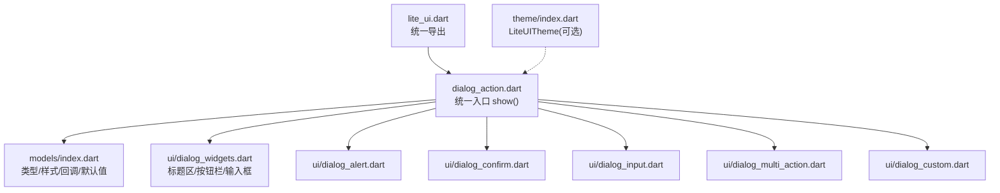
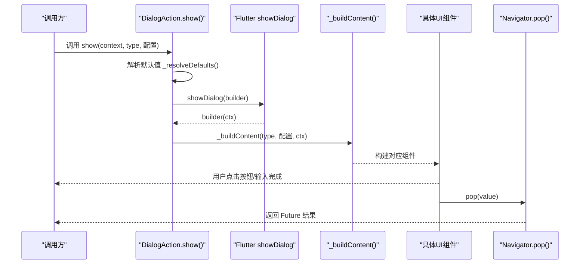
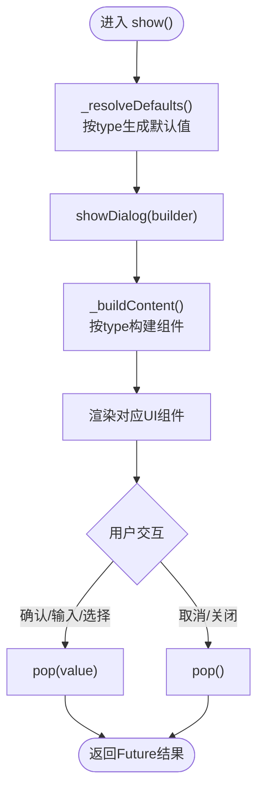
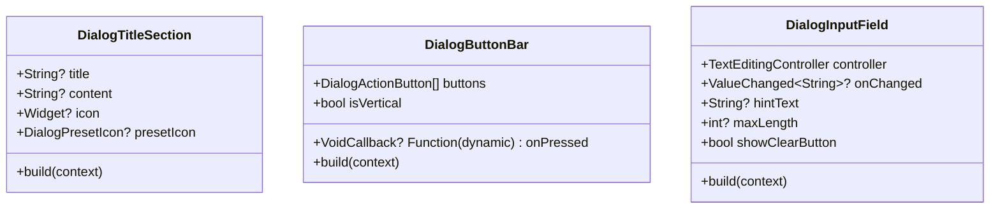
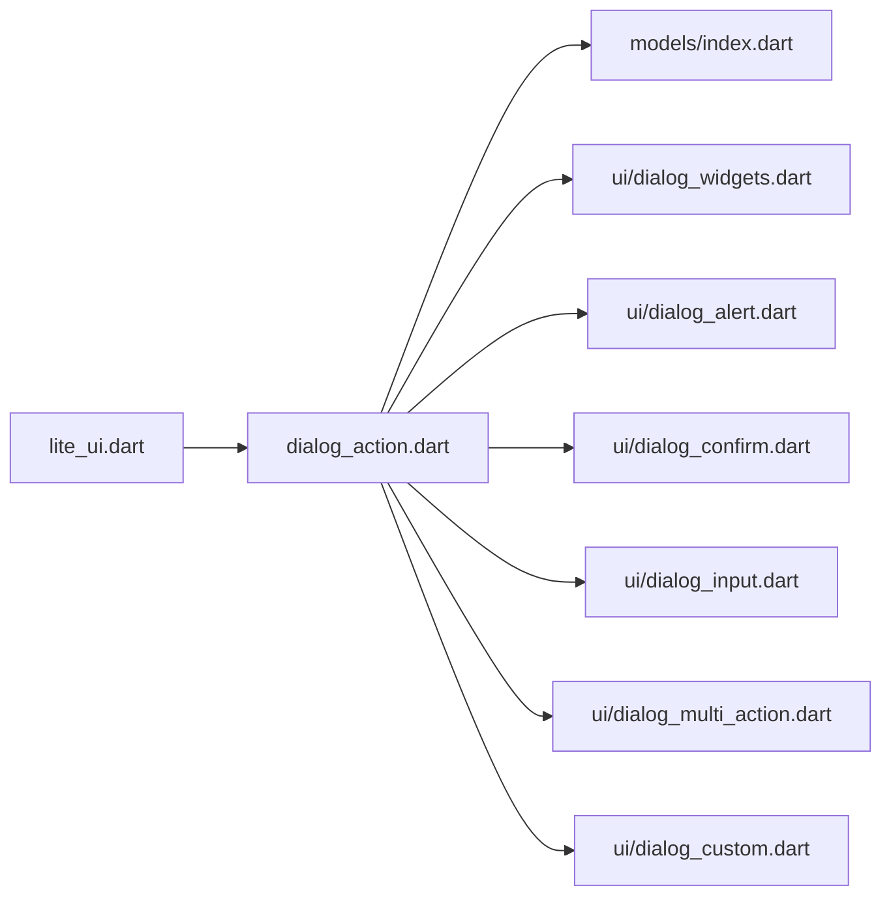
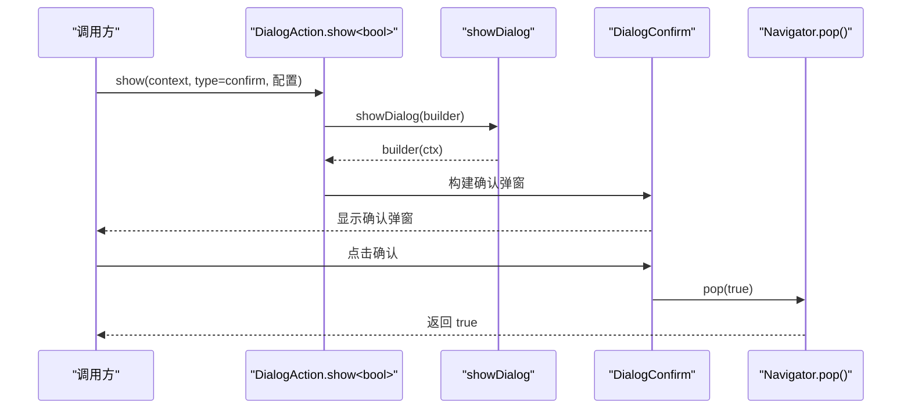

# DialogAction 对话框系统

<cite>
**本文引用的文件**   
- [lite_ui.dart](file://lib/lite_ui.dart)
- [dialog_action.dart](file://lib/src/dialog_action/dialog_action.dart)
- [models/index.dart](file://lib/src/dialog_action/models/index.dart)
- [ui/dialog_widgets.dart](file://lib/src/dialog_action/ui/dialog_widgets.dart)
- [ui/dialog_alert.dart](file://lib/src/dialog_action/ui/dialog_alert.dart)
- [ui/dialog_confirm.dart](file://lib/src/dialog_action/ui/dialog_confirm.dart)
- [ui/dialog_input.dart](file://lib/src/dialog_action/ui/dialog_input.dart)
- [ui/dialog_multi_action.dart](file://lib/src/dialog_action/ui/dialog_multi_action.dart)
- [ui/dialog_custom.dart](file://lib/src/dialog_action/ui/dialog_custom.dart)
- [theme/index.dart](file://lib/src/theme/index.dart)
- [dialog_action_demo.dart](file://example/lib/pages/dialog_action_demo.dart)
</cite>

## 目录
1. [简介](#简介)
2. [项目结构](#项目结构)
3. [核心组件](#核心组件)
4. [架构总览](#架构总览)
5. [详细组件分析](#详细组件分析)
6. [依赖关系分析](#依赖关系分析)
7. [性能与体验优化](#性能与体验优化)
8. [故障排查指南](#故障排查指南)
9. [结论](#结论)
10. [附录：API 参考与示例](#附录api-参考与示例)

## 简介
DialogAction 是 lite_ui 库中的统一对话框管理器，提供五种预设类型（alert、confirm、input、multiAction、custom），通过静态方法 show() 以一致的 API 展示不同场景的弹窗。它封装了 Flutter 原生 showDialog 的层级管理、遮罩控制、主题色集成与圆角样式，并将具体渲染委托给对应类型的子组件。该设计使开发者无需关心底层细节，即可快速实现确认提示、输入校验、多操作选择等常见交互。

## 项目结构
DialogAction 采用“统一入口 + 类型分发 + 专用 UI”的分层组织方式：
- 统一入口：DialogAction.show() 负责参数解析、默认值合并、showDialog 调用与返回 Future。
- 模型与枚举：集中定义类型、按钮样式、回调签名与默认值容器。
- UI 组件：每种类型一个独立 Widget，复用标题区、按钮栏、输入框等通用控件。
- 主题集成：使用 Material Theme 的颜色与文本样式，保证与全局主题一致。

图表来源
- [lite_ui.dart:1-19](file://lib/lite_ui.dart#L1-L19)
- [dialog_action.dart:95-131](file://lib/src/dialog_action/dialog_action.dart#L95-L131)
- [models/index.dart:1-85](file://lib/src/dialog_action/models/index.dart#L1-L85)
- [ui/dialog_widgets.dart:1-275](file://lib/src/dialog_action/ui/dialog_widgets.dart#L1-L275)

章节来源
- [lite_ui.dart:1-19](file://lib/lite_ui.dart#L1-L19)
- [dialog_action.dart:1-248](file://lib/src/dialog_action/dialog_action.dart#L1-L248)

## 核心组件
- DialogAction：统一入口类，提供静态方法 show<V>()，根据 type 分发到对应 UI 组件，并处理返回值 pop(value)。
- 模型与枚举：
  - DialogType：五种对话框类型。
  - DialogButtonStyle：normal、primary、destructive。
  - DialogActionButton<V>：按钮数据（label、value、style、disabled）。
  - DialogPresetIcon：success、warning、error、info。
  - DialogDefaults：内部默认值容器。
- UI 组件：
  - DialogTitleSection：标题+内容+图标区域。
  - DialogButtonBar：iOS 风格分割线布局，支持横向/纵向排列。
  - DialogInputField：带清除按钮、自动聚焦、最大长度限制的输入框。
  - DialogAlert / DialogConfirm / DialogInput / DialogMultiAction / DialogCustom：各类型的具体实现。

章节来源
- [dialog_action.dart:24-131](file://lib/src/dialog_action/dialog_action.dart#L24-L131)
- [models/index.dart:1-85](file://lib/src/dialog_action/models/index.dart#L1-L85)
- [ui/dialog_widgets.dart:1-275](file://lib/src/dialog_action/ui/dialog_widgets.dart#L1-L275)
- [ui/dialog_alert.dart:1-45](file://lib/src/dialog_action/ui/dialog_alert.dart#L1-L45)
- [ui/dialog_confirm.dart:1-71](file://lib/src/dialog_action/ui/dialog_confirm.dart#L1-L71)
- [ui/dialog_input.dart:1-110](file://lib/src/dialog_action/ui/dialog_input.dart#L1-L110)
- [ui/dialog_multi_action.dart:1-47](file://lib/src/dialog_action/ui/dialog_multi_action.dart#L1-L47)
- [ui/dialog_custom.dart:1-18](file://lib/src/dialog_action/ui/dialog_custom.dart#L1-L18)

## 架构总览
DialogAction 的核心流程：
- 调用 show(context, type, ...) 时，先根据 type 解析默认文案与占位符。
- 使用 showDialog 创建居中弹窗壳，设置圆角、内边距、尺寸约束与主题背景色。
- _buildContent 根据 type 实例化对应 UI 组件，并绑定回调与 Navigator.pop 返回值。
- 用户交互后，各组件触发 onXxx 回调，随后 pop(value)，上层 await 得到结果。

图表来源
- [dialog_action.dart:95-131](file://lib/src/dialog_action/dialog_action.dart#L95-L131)
- [dialog_action.dart:156-247](file://lib/src/dialog_action/dialog_action.dart#L156-L247)

章节来源
- [dialog_action.dart:95-247](file://lib/src/dialog_action/dialog_action.dart#L95-L247)

## 详细组件分析

### 统一入口 DialogAction
- 职责：接收统一参数，解析默认值，调用 showDialog，按类型构建内容，统一处理 pop 返回值。
- 关键行为：
  - barrierDismissible/barrierColor：控制遮罩可关闭与颜色。
  - Dialog 壳：圆角 14、最小/最大宽度约束、主题 canvasColor 背景。
  - 默认值策略：_resolveDefaults 根据 type 提供 title/content/按钮文案/hintText 的默认值，用户传参优先覆盖。
  - 返回值：confirm/input/multiAction 会 pop(true/text/value)，alert/custom 不返回或返回空。

图表来源
- [dialog_action.dart:95-131](file://lib/src/dialog_action/dialog_action.dart#L95-L131)
- [dialog_action.dart:134-153](file://lib/src/dialog_action/dialog_action.dart#L134-L153)
- [dialog_action.dart:156-247](file://lib/src/dialog_action/dialog_action.dart#L156-L247)

章节来源
- [dialog_action.dart:24-131](file://lib/src/dialog_action/dialog_action.dart#L24-L131)
- [dialog_action.dart:134-153](file://lib/src/dialog_action/dialog_action.dart#L134-L153)
- [dialog_action.dart:156-247](file://lib/src/dialog_action/dialog_action.dart#L156-L247)

### 类型与模型
- DialogType：alert、confirm、input、multiAction、custom。
- DialogButtonStyle：normal、primary、destructive。
- DialogActionButton<V>：label、value、style、disabled。
- DialogPresetIcon：success、warning、error、info。
- DialogDefaults：title、content、confirmLabel、cancelLabel、hintText。

章节来源
- [models/index.dart:1-85](file://lib/src/dialog_action/models/index.dart#L1-L85)

### 通用 UI 组件
- DialogTitleSection：支持自定义 icon 或 presetIcon，标题与内容居中对齐，间距与字号遵循主题。
- DialogButtonBar：
  - 横向模式（alert/confirm/input）：等宽按钮，中间竖线分隔，顶部横线分隔。
  - 纵向模式（multiAction）：按钮堆叠，每行之间横线分隔。
  - 按钮样式：依据 style 映射颜色，disabled 状态禁用点击。
- DialogInputField：
  - 自动聚焦、最大长度限制、清除按钮、边框与焦点态颜色跟随主题。

图表来源
- [ui/dialog_widgets.dart:1-275](file://lib/src/dialog_action/ui/dialog_widgets.dart#L1-L275)

章节来源
- [ui/dialog_widgets.dart:1-275](file://lib/src/dialog_action/ui/dialog_widgets.dart#L1-L275)

### 五种预设类型

#### Alert（提示弹窗）
- 适用场景：告知用户操作结果或提示信息，仅需确认。
- 属性：title、content、icon/presetIcon、confirmLabel、onConfirm。
- 返回值：pop()，无 value；适合仅做通知的场景。

章节来源
- [ui/dialog_alert.dart:1-45](file://lib/src/dialog_action/ui/dialog_alert.dart#L1-L45)
- [dialog_action.dart:177-188](file://lib/src/dialog_action/dialog_action.dart#L177-L188)

#### Confirm（确认弹窗）
- 适用场景：删除、退出等需要二次确认的操作。
- 属性：title、content、icon/presetIcon、cancelLabel、confirmLabel、confirmStyle、onCancel、onConfirm。
- 返回值：pop(true)；上层 await 得到布尔值。

章节来源
- [ui/dialog_confirm.dart:1-71](file://lib/src/dialog_action/ui/dialog_confirm.dart#L1-L71)
- [dialog_action.dart:190-207](file://lib/src/dialog_action/dialog_action.dart#L190-L207)

#### Input（输入弹窗）
- 适用场景：重命名、搜索词输入、简短文本采集。
- 属性：title、content、icon/presetIcon、hintText、initialValue、maxLength、cancelLabel、confirmLabel、onCancel、onConfirm(text)。
- 返回值：pop(text)；上层 await 得到输入字符串。

章节来源
- [ui/dialog_input.dart:1-110](file://lib/src/dialog_action/ui/dialog_input.dart#L1-L110)
- [dialog_action.dart:209-228](file://lib/src/dialog_action/dialog_action.dart#L209-L228)

#### MultiAction（多操作弹窗）
- 适用场景：多个并列操作的选择，如拍照/相册/视频/文件。
- 属性：title、content、icon/presetIcon、actions(List<DialogActionButton<V>>)、onAction(value)。
- 返回值：pop(value)；上层 await 得到选中的 value。

章节来源
- [ui/dialog_multi_action.dart:1-47](file://lib/src/dialog_action/ui/dialog_multi_action.dart#L1-L47)
- [dialog_action.dart:230-241](file://lib/src/dialog_action/dialog_action.dart#L230-L241)

#### Custom（自定义内容弹窗）
- 适用场景：复杂表单、富信息展示、非标准交互。
- 属性：customChild(child Widget)。
- 返回值：由外部自行控制 pop；适合完全自定义的业务弹窗。

章节来源
- [ui/dialog_custom.dart:1-18](file://lib/src/dialog_action/ui/dialog_custom.dart#L1-L18)
- [dialog_action.dart:243-245](file://lib/src/dialog_action/dialog_action.dart#L243-L245)

### 层级管理与动画
- 层级管理：基于 Flutter 的 showDialog，DialogAction 仅负责传入 context、barrierDismissible、barrierColor 以及 builder。
- 动画效果：未自定义过渡动画，使用框架默认 Dialog 动画。如需自定义，可在上层包裹更高层级的 ModalRoute 或使用第三方方案。
- 键盘处理：Input 模式自动聚焦输入框，支持 maxLength 与清除按钮；其他模式不涉及键盘。

章节来源
- [dialog_action.dart:95-131](file://lib/src/dialog_action/dialog_action.dart#L95-L131)
- [ui/dialog_input.dart:80-110](file://lib/src/dialog_action/ui/dialog_input.dart#L80-L110)

### 主题系统与自定义样式
- 主题集成：Dialog 背景色使用 Theme.of(ctx).canvasColor；按钮颜色、文字样式、分割线颜色均从 ThemeData 获取。
- LiteUITheme：库提供 LiteUITheme/LiteUIThemeData 用于全局定制颜色与圆角等，但 DialogAction 当前主要依赖 Material Theme，未直接读取 LiteUITheme。
- 自定义样式建议：
  - 通过外层 MaterialApp 的 theme 覆盖 colorScheme、textTheme、dividerColor 等，影响所有 Dialog 外观。
  - 在 custom 模式下完全自定义 child，不受默认样式限制。

章节来源
- [dialog_action.dart:100-106](file://lib/src/dialog_action/dialog_action.dart#L100-L106)
- [ui/dialog_widgets.dart:22-78](file://lib/src/dialog_action/ui/dialog_widgets.dart#L22-L78)
- [theme/index.dart:1-73](file://lib/src/theme/index.dart#L1-L73)

## 依赖关系分析
- DialogAction 依赖 models/index.dart 的类型与默认值。
- 各类型 UI 组件依赖 dialog_widgets.dart 的通用控件。
- 入口通过 lite_ui.dart 统一导出，便于上层 import。

图表来源
- [dialog_action.dart:1-9](file://lib/src/dialog_action/dialog_action.dart#L1-L9)
- [lite_ui.dart:1-19](file://lib/lite_ui.dart#L1-L19)

章节来源
- [dialog_action.dart:1-9](file://lib/src/dialog_action/dialog_action.dart#L1-L9)
- [lite_ui.dart:1-19](file://lib/lite_ui.dart#L1-L19)

## 性能与体验优化
- 避免重复构建：DialogAction 的 _buildContent 仅在 showDialog 时执行，避免频繁重建。
- 输入性能：DialogInputField 使用 TextEditingController，注意在 dispose 中释放（已实现）。
- 无障碍与键盘：Input 模式自动聚焦，提升输入效率；必要时可为其他模式添加快捷键支持。
- 视觉一致性：尽量使用主题色与默认样式，减少硬编码颜色，确保暗色/亮色主题切换正常。
- 长文本与溢出：DialogTitleSection 对标题与内容做了居中排版，建议在业务侧控制文本长度或使用换行策略。

[本节为通用指导，不直接分析具体文件]

## 故障排查指南
- 无法关闭弹窗：检查 barrierDismissible 是否为 true；或在 custom 模式中正确调用 Navigator.pop()。
- 返回值异常：确认类型与返回值匹配（confirm 返回 bool，input 返回 String，multiAction 返回 V）。
- 样式不一致：检查是否覆盖了 MaterialApp 的 theme；若需库级主题，请结合 LiteUITheme 进行全局配置。
- 输入框不可用：确认 maxLength 与 initialValue 设置合理；检查 disabled 状态逻辑。

章节来源
- [dialog_action.dart:95-131](file://lib/src/dialog_action/dialog_action.dart#L95-L131)
- [ui/dialog_input.dart:63-78](file://lib/src/dialog_action/ui/dialog_input.dart#L63-L78)
- [theme/index.dart:1-73](file://lib/src/theme/index.dart#L1-L73)

## 结论
DialogAction 以统一的静态 API 屏蔽了 showDialog 的复杂性，将五种常用弹窗类型抽象为一致的调用方式，并通过类型分发与通用 UI 组件实现高内聚、低耦合的设计。配合主题系统，开发者可以快速获得一致且美观的对话框体验，同时保留足够的扩展空间以满足复杂业务需求。

[本节为总结性内容，不直接分析具体文件]

## 附录：API 参考与示例

### show() 方法参数说明
- 必填：context、type
- 通用：title、content、icon、presetIcon、confirmLabel、cancelLabel、confirmStyle、barrierDismissible、barrierColor
- confirm：onCancel、onConfirm
- input：hintText、initialValue、maxLength、onInputConfirm
- multiAction：actions、onAction
- custom：customChild

章节来源
- [dialog_action.dart:56-91](file://lib/src/dialog_action/dialog_action.dart#L56-L91)
- [models/index.dart:1-85](file://lib/src/dialog_action/models/index.dart#L1-L85)

### 使用示例（来自演示页）
- Alert 默认与自定义、Confirm 默认与自定义、Input 默认与自定义、MultiAction 多操作、Custom 自定义内容、自定义图标等。

章节来源
- [dialog_action_demo.dart:14-124](file://example/lib/pages/dialog_action_demo.dart#L14-L124)

### 典型业务流程时序图（以 Confirm 为例）

图表来源
- [dialog_action.dart:190-207](file://lib/src/dialog_action/dialog_action.dart#L190-L207)
- [ui/dialog_confirm.dart:52-71](file://lib/src/dialog_action/ui/dialog_confirm.dart#L52-L71)