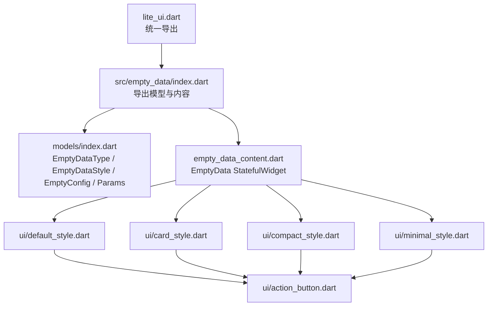
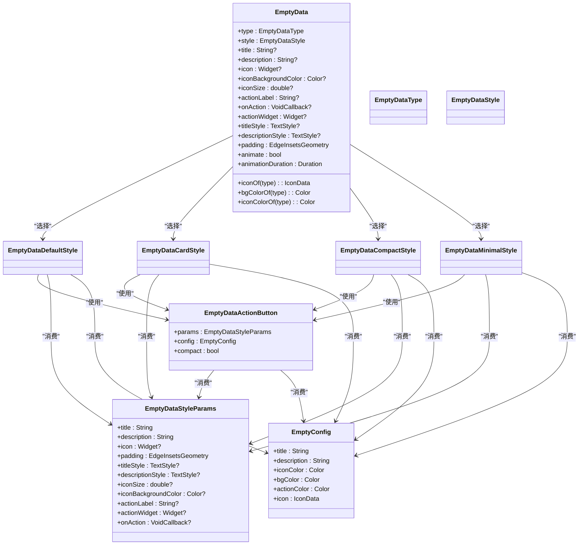
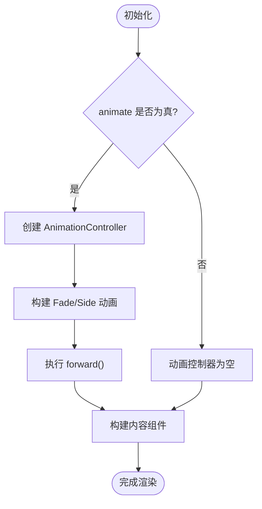
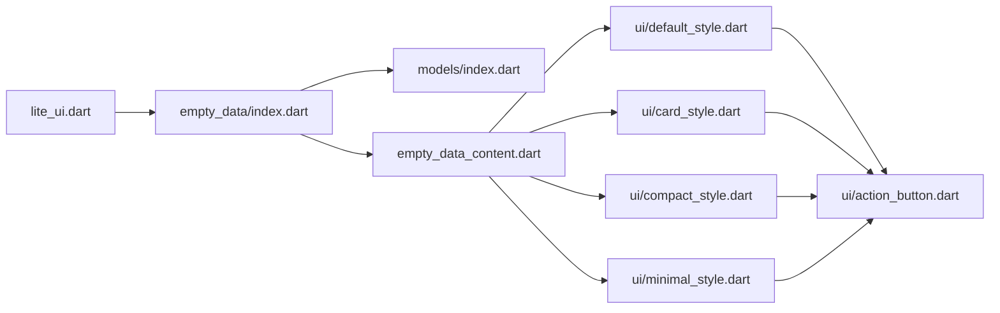

# EmptyData 空状态组件

<cite>
**本文引用的文件**   
- [lib/src/empty_data/index.dart](file://lib/src/empty_data/index.dart)
- [lib/src/empty_data/empty_data_content.dart](file://lib/src/empty_data/empty_data_content.dart)
- [lib/src/empty_data/models/index.dart](file://lib/src/empty_data/models/index.dart)
- [lib/src/empty_data/ui/default_style.dart](file://lib/src/empty_data/ui/default_style.dart)
- [lib/src/empty_data/ui/card_style.dart](file://lib/src/empty_data/ui/card_style.dart)
- [lib/src/empty_data/ui/compact_style.dart](file://lib/src/empty_data/ui/compact_style.dart)
- [lib/src/empty_data/ui/minimal_style.dart](file://lib/src/empty_data/ui/minimal_style.dart)
- [lib/src/empty_data/ui/action_button.dart](file://lib/src/empty_data/ui/action_button.dart)
- [example/lib/pages/empty_data_demo.dart](file://example/lib/pages/empty_data_demo.dart)
- [lib/lite_ui.dart](file://lib/lite_ui.dart)
- [lib/src/theme/index.dart](file://lib/src/theme/index.dart)
</cite>

## 目录
1. [简介](#简介)
2. [项目结构](#项目结构)
3. [核心组件](#核心组件)
4. [架构总览](#架构总览)
5. [详细组件分析](#详细组件分析)
6. [依赖关系分析](#依赖关系分析)
7. [性能与可访问性](#性能与可访问性)
8. [使用示例与最佳实践](#使用示例与最佳实践)
9. [故障排查](#故障排查)
10. [结论](#结论)

## 简介
EmptyData 是一个用于“空状态”展示的 Flutter 组件，适用于列表、页面或模块无数据时的占位展示。它支持 8 种业务场景类型与 4 种布局风格自由组合，并提供入场动画、操作按钮、自定义图标与文案样式等能力，帮助在多种业务场景中提供一致且友好的用户体验。

设计理念：
- 以“场景 + 风格”的二维配置驱动 UI，降低使用复杂度
- 内置默认文案与配色，开箱即用；同时允许完全覆盖
- 通过 Semantics 提升可访问性，便于读屏工具识别
- 轻量、可组合、易扩展，适配不同屏幕尺寸与主题

## 项目结构
EmptyData 组件位于 lib/src/empty_data 目录下，采用“入口导出 + 模型定义 + 内容组件 + 多风格实现”的组织方式。

图表来源
- [lib/lite_ui.dart:1-19](file://lib/lite_ui.dart#L1-L19)
- [lib/src/empty_data/index.dart:1-3](file://lib/src/empty_data/index.dart#L1-L3)
- [lib/src/empty_data/models/index.dart:1-156](file://lib/src/empty_data/models/index.dart#L1-L156)
- [lib/src/empty_data/empty_data_content.dart:1-167](file://lib/src/empty_data/empty_data_content.dart#L1-L167)
- [lib/src/empty_data/ui/default_style.dart:1-69](file://lib/src/empty_data/ui/default_style.dart#L1-L69)
- [lib/src/empty_data/ui/card_style.dart:1-92](file://lib/src/empty_data/ui/card_style.dart#L1-L92)
- [lib/src/empty_data/ui/compact_style.dart:1-67](file://lib/src/empty_data/ui/compact_style.dart#L1-L67)
- [lib/src/empty_data/ui/minimal_style.dart:1-75](file://lib/src/empty_data/ui/minimal_style.dart#L1-L75)
- [lib/src/empty_data/ui/action_button.dart:1-63](file://lib/src/empty_data/ui/action_button.dart#L1-L63)

章节来源
- [lib/lite_ui.dart:1-19](file://lib/lite_ui.dart#L1-L19)
- [lib/src/empty_data/index.dart:1-3](file://lib/src/empty_data/index.dart#L1-L3)

## 核心组件
- EmptyData（StatefulWidget）：对外暴露的组件，负责根据 type/style 选择对应风格渲染，并控制入场动画。
- 四种风格组件：defaultStyle、card、compact、minimal，分别实现不同的视觉呈现。
- 动作按钮：EmptyDataActionButton，支持 actionLabel 或自定义 actionWidget。
- 模型与配置：EmptyDataType、EmptyDataStyle、EmptyConfig、EmptyDataStyleParams。

章节来源
- [lib/src/empty_data/empty_data_content.dart:26-102](file://lib/src/empty_data/empty_data_content.dart#L26-L102)
- [lib/src/empty_data/models/index.dart:4-43](file://lib/src/empty_data/models/index.dart#L4-L43)
- [lib/src/empty_data/ui/action_button.dart:9-63](file://lib/src/empty_data/ui/action_button.dart#L9-L63)

## 架构总览
EmptyData 通过“参数聚合 + 策略式风格切换”的方式组织代码，将共享参数封装为 EmptyDataStyleParams，减少各风格组件的参数传递成本。动画由 SingleTickerProviderStateMixin 管理，支持淡入与上滑效果。

图表来源
- [lib/src/empty_data/empty_data_content.dart:26-102](file://lib/src/empty_data/empty_data_content.dart#L26-L102)
- [lib/src/empty_data/ui/default_style.dart:7-69](file://lib/src/empty_data/ui/default_style.dart#L7-L69)
- [lib/src/empty_data/ui/card_style.dart:7-92](file://lib/src/empty_data/ui/card_style.dart#L7-L92)
- [lib/src/empty_data/ui/compact_style.dart:7-67](file://lib/src/empty_data/ui/compact_style.dart#L7-L67)
- [lib/src/empty_data/ui/minimal_style.dart:7-75](file://lib/src/empty_data/ui/minimal_style.dart#L7-L75)
- [lib/src/empty_data/ui/action_button.dart:9-63](file://lib/src/empty_data/ui/action_button.dart#L9-L63)
- [lib/src/empty_data/models/index.dart:46-156](file://lib/src/empty_data/models/index.dart#L46-L156)

## 详细组件分析

### EmptyData 主组件
- 职责：接收用户配置，生成 EmptyDataStyleParams，按 style 选择具体风格组件，并在启用动画时包裹 FadeTransition + SlideTransition。
- 关键属性：
  - type：预设场景类型，影响默认标题、描述、图标与颜色
  - style：布局风格
  - title/description/icon/iconBackgroundColor/iconSize：内容与图标定制
  - actionLabel/onAction/actionWidget：操作区域
  - titleStyle/descriptionStyle：文本样式
  - padding/animate/animationDuration：内边距与动画控制
- 静态方法：iconOf、bgColorOf、iconColorOf，便于外部获取类型对应的图标与颜色。

章节来源
- [lib/src/empty_data/empty_data_content.dart:26-102](file://lib/src/empty_data/empty_data_content.dart#L26-L102)
- [lib/src/empty_data/empty_data_content.dart:104-167](file://lib/src/empty_data/empty_data_content.dart#L104-L167)

### 场景类型与默认配置
- EmptyDataType：包含 empty、search、noNetwork、error、noPermission、noMessage、noOrder、maintenance 八种场景。
- EmptyConfig：每个类型对应标题、描述、图标色、背景色、按钮色与图标。
- emptyDataDefaults：集中维护各类型的默认配置。

章节来源
- [lib/src/empty_data/models/index.dart:4-28](file://lib/src/empty_data/models/index.dart#L4-L28)
- [lib/src/empty_data/models/index.dart:46-123](file://lib/src/empty_data/models/index.dart#L46-L123)

### 四种布局风格
- defaultStyle：居中圆形图标 + 标题 + 描述 + 可选按钮，适合通用空状态。
- compact：横向紧凑布局，小圆角图标与文字并排，适合行内或空间受限场景。
- card：带顶部渐变色带的装饰卡片，适合强调型空状态。
- minimal：极简文字风格，圆点装饰 + 渐变分隔线，适合低干扰信息展示。

章节来源
- [lib/src/empty_data/ui/default_style.dart:7-69](file://lib/src/empty_data/ui/default_style.dart#L7-L69)
- [lib/src/empty_data/ui/compact_style.dart:7-67](file://lib/src/empty_data/ui/compact_style.dart#L7-L67)
- [lib/src/empty_data/ui/card_style.dart:7-92](file://lib/src/empty_data/ui/card_style.dart#L7-L92)
- [lib/src/empty_data/ui/minimal_style.dart:7-75](file://lib/src/empty_data/ui/minimal_style.dart#L7-L75)

### 操作按钮
- 支持 actionLabel 或 actionWidget，优先级：actionWidget > actionLabel > 不显示。
- 默认按钮具备圆角、阴影与点击反馈，支持 compact 模式调整尺寸。

章节来源
- [lib/src/empty_data/ui/action_button.dart:9-63](file://lib/src/empty_data/ui/action_button.dart#L9-L63)

### 动画机制
- 使用 SingleTickerProviderStateMixin 创建 AnimationController。
- 淡入与上滑组合动画，时长可通过 animationDuration 控制，animate=false 则禁用。

图表来源
- [lib/src/empty_data/empty_data_content.dart:104-131](file://lib/src/empty_data/empty_data_content.dart#L104-L131)
- [lib/src/empty_data/empty_data_content.dart:134-167](file://lib/src/empty_data/empty_data_content.dart#L134-L167)

## 依赖关系分析
- EmptyData 依赖 models 中的枚举与配置，以及 ui 下的四种风格实现。
- 所有风格均依赖 EmptyDataActionButton 进行按钮渲染。
- lite_ui.dart 作为统一出口，对外暴露 EmptyData 及相关模型。

图表来源
- [lib/lite_ui.dart:1-19](file://lib/lite_ui.dart#L1-L19)
- [lib/src/empty_data/index.dart:1-3](file://lib/src/empty_data/index.dart#L1-L3)
- [lib/src/empty_data/models/index.dart:1-156](file://lib/src/empty_data/models/index.dart#L1-L156)
- [lib/src/empty_data/empty_data_content.dart:1-167](file://lib/src/empty_data/empty_data_content.dart#L1-L167)
- [lib/src/empty_data/ui/default_style.dart:1-69](file://lib/src/empty_data/ui/default_style.dart#L1-L69)
- [lib/src/empty_data/ui/card_style.dart:1-92](file://lib/src/empty_data/ui/card_style.dart#L1-L92)
- [lib/src/empty_data/ui/compact_style.dart:1-67](file://lib/src/empty_data/ui/compact_style.dart#L1-L67)
- [lib/src/empty_data/ui/minimal_style.dart:1-75](file://lib/src/empty_data/ui/minimal_style.dart#L1-L75)
- [lib/src/empty_data/ui/action_button.dart:1-63](file://lib/src/empty_data/ui/action_button.dart#L1-L63)

章节来源
- [lib/lite_ui.dart:1-19](file://lib/lite_ui.dart#L1-L19)
- [lib/src/empty_data/index.dart:1-3](file://lib/src/empty_data/index.dart#L1-L3)

## 性能与可访问性
- 性能
  - 动画可控：通过 animate 与 animationDuration 控制是否启用及动画时长，避免不必要的重绘。
  - 组件拆分：每种风格独立 StatelessWidget，利于复用与按需渲染。
  - 参数聚合：EmptyDataStyleParams 减少跨层参数传递开销。
- 可访问性
  - 各风格组件均使用 Semantics 标签，便于读屏工具读取标题与描述。
  - 按钮具备 button 语义，增强交互可达性。
- 响应式
  - 文本最大行数与溢出处理确保在不同屏幕宽度下正常显示。
  - 图标尺寸与间距随风格自适应，compact 模式更适合窄屏。

章节来源
- [lib/src/empty_data/ui/default_style.dart:18-69](file://lib/src/empty_data/ui/default_style.dart#L18-L69)
- [lib/src/empty_data/ui/card_style.dart:18-92](file://lib/src/empty_data/ui/card_style.dart#L18-L92)
- [lib/src/empty_data/ui/compact_style.dart:18-67](file://lib/src/empty_data/ui/compact_style.dart#L18-L67)
- [lib/src/empty_data/ui/minimal_style.dart:15-75](file://lib/src/empty_data/ui/minimal_style.dart#L15-L75)
- [lib/src/empty_data/ui/action_button.dart:31-57](file://lib/src/empty_data/ui/action_button.dart#L31-L57)

## 使用示例与最佳实践

### API 参考
- 构造参数
  - type：EmptyDataType，默认 empty
  - style：EmptyDataStyle，默认 defaultStyle
  - title/description：String?，覆盖默认文案
  - icon：Widget?，自定义图标
  - iconBackgroundColor：Color?，图标背景色
  - iconSize：double?，图标尺寸
  - actionLabel：String?，按钮文案
  - onAction：VoidCallback?，按钮回调
  - actionWidget：Widget?，自定义操作区（优先级高于 actionLabel）
  - titleStyle/descriptionStyle：TextStyle?，文本样式
  - padding：EdgeInsetsGeometry，内边距
  - animate：bool，是否启用动画
  - animationDuration：Duration，动画时长
- 静态方法
  - iconOf(type)：返回类型对应图标
  - bgColorOf(type)：返回类型对应背景色
  - iconColorOf(type)：返回类型对应图标色

章节来源
- [lib/src/empty_data/empty_data_content.dart:26-99](file://lib/src/empty_data/empty_data_content.dart#L26-L99)
- [lib/src/empty_data/models/index.dart:4-43](file://lib/src/empty_data/models/index.dart#L4-L43)

### 典型业务场景
- 网络错误
  - 使用 noNetwork 类型，配合 actionLabel “重新加载”，点击后恢复数据。
- 数据为空
  - 使用 empty 类型，可搭配 actionLabel “添加数据”引导用户创建内容。
- 搜索无结果
  - 使用 search 类型，提示更换关键词。
- 权限不足
  - 使用 noPermission 类型，提示联系管理员。
- 暂无消息/订单
  - 使用 noMessage/noOrder 类型，结合 card 风格突出信息。
- 系统维护中
  - 使用 maintenance 类型，告知暂时不可用。

章节来源
- [lib/src/empty_data/models/index.dart:4-28](file://lib/src/empty_data/models/index.dart#L4-L28)
- [example/lib/pages/empty_data_demo.dart:360-388](file://example/lib/pages/empty_data_demo.dart#L360-L388)

### 完整示例路径
- 基础用法与动画控制、类型/风格切换、实际模拟列表切换、禁用动画、完全自定义等示例见：
  - [example/lib/pages/empty_data_demo.dart](file://example/lib/pages/empty_data_demo.dart)

章节来源
- [example/lib/pages/empty_data_demo.dart:1-390](file://example/lib/pages/empty_data_demo.dart#L1-L390)

### 国际化适配建议
- 当前默认文案集中在 emptyDataDefaults 中，如需国际化，可在应用层对 title/description 进行本地化替换，或在调用处传入本地化后的字符串。
- 建议在业务层维护语言包，并根据当前 Locale 动态设置 EmptyData 的 title/description。

[本节为概念性说明，不直接分析具体文件]

### 主题系统集成
- 库提供 LiteUITheme/LiteUIThemeData 用于全局主题配置，但 EmptyData 内部未直接读取该主题数据，主要通过自身默认配置与传入参数决定样式。
- 若需与主题联动，可在应用层通过传入 iconBackgroundColor、actionColor（通过 actionWidget 包装）、titleStyle/descriptionStyle 等方式实现主题化。

章节来源
- [lib/src/theme/index.dart:6-73](file://lib/src/theme/index.dart#L6-L73)

### 自定义样式实现方法
- 通过 actionWidget 完全替换按钮区域，实现复杂交互或样式。
- 通过 titleStyle/descriptionStyle 自定义字体、字号、颜色等。
- 通过 icon 与 iconBackgroundColor 自定义图标与背景。
- 通过 padding 调整整体内边距，适配不同容器。

章节来源
- [lib/src/empty_data/ui/action_button.dart:20-63](file://lib/src/empty_data/ui/action_button.dart#L20-L63)
- [lib/src/empty_data/empty_data_content.dart:136-148](file://lib/src/empty_data/empty_data_content.dart#L136-L148)

## 故障排查
- 按钮不显示
  - 检查是否同时传入了 actionLabel 与 actionWidget；若 actionWidget 存在，将优先渲染 actionWidget。
- 动画异常或卡顿
  - 确认 animate 与 animationDuration 设置合理；在频繁重建的场景中考虑关闭动画以提升性能。
- 文本溢出或换行异常
  - 检查 maxLines 与 overflow 设置；必要时调整 padding 与 iconSize。
- 颜色与主题不一致
  - 由于 EmptyData 未直接读取 LiteUITheme，需在调用处传入相应颜色或通过 actionWidget 覆盖。

章节来源
- [lib/src/empty_data/ui/action_button.dart:20-63](file://lib/src/empty_data/ui/action_button.dart#L20-L63)
- [lib/src/empty_data/empty_data_content.dart:114-131](file://lib/src/empty_data/empty_data_content.dart#L114-L131)
- [lib/src/empty_data/ui/default_style.dart:43-61](file://lib/src/empty_data/ui/default_style.dart#L43-L61)

## 结论
EmptyData 以“场景 + 风格”为核心设计，提供了丰富的默认配置与灵活的自定义能力，能够在多种业务场景中快速实现一致的空状态展示。通过合理的动画控制、可访问性支持与响应式布局，组件在不同设备与屏幕尺寸下均能保持良好体验。结合 LiteUITheme 与业务层的国际化方案，可实现更完善的主题与本地化集成。