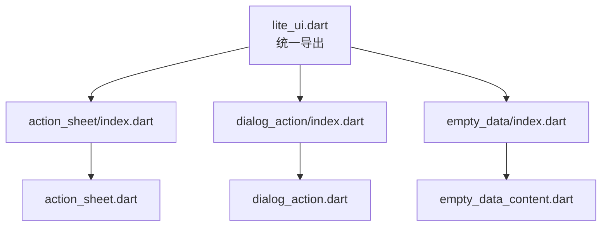
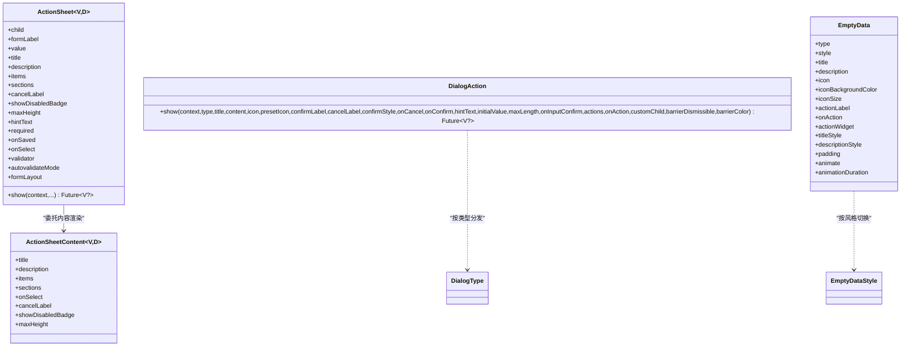
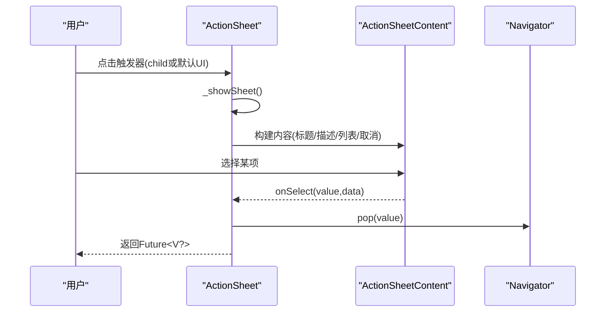
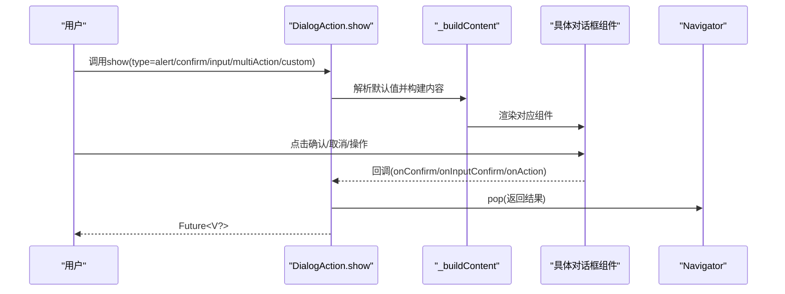
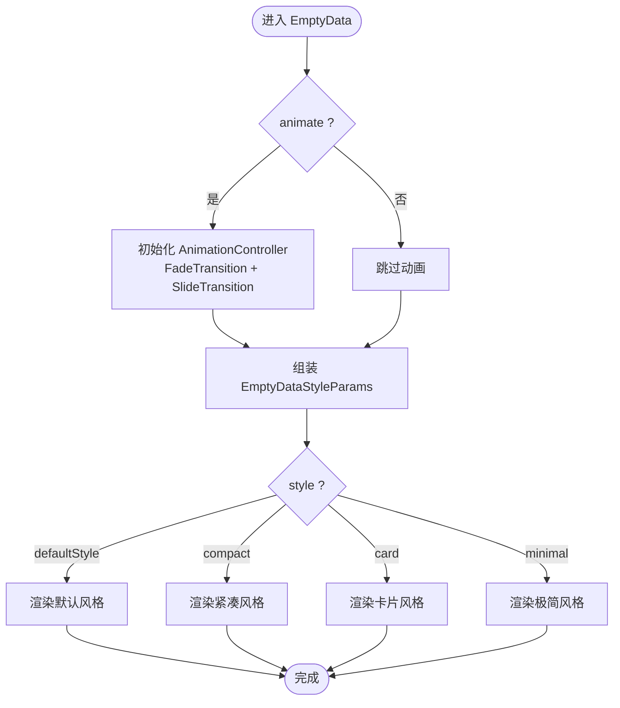
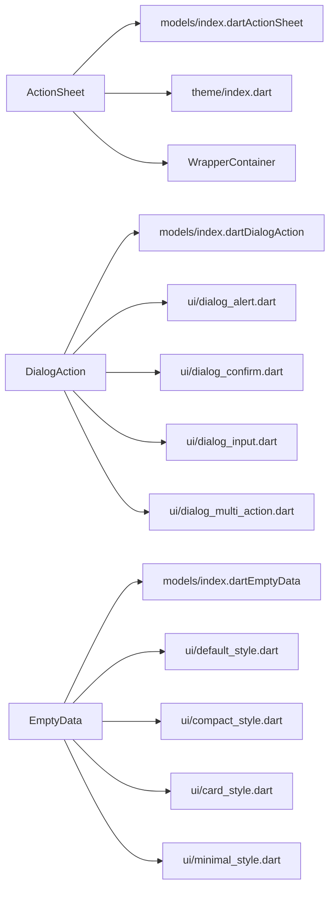

# 业务组件

<cite>
**本文引用的文件**   
- [lite_ui.dart](file://lib/lite_ui.dart)
- [action_sheet.dart](file://lib/src/action_sheet/action_sheet.dart)
- [action_sheet_content.dart](file://lib/src/action_sheet/ui/action_sheet_content.dart)
- [index.dart（ActionSheet）](file://lib/src/action_sheet/index.dart)
- [models/index.dart（ActionSheet）](file://lib/src/action_sheet/models/index.dart)
- [dialog_action.dart](file://lib/src/dialog_action/dialog_action.dart)
- [index.dart（DialogAction）](file://lib/src/dialog_action/index.dart)
- [models/index.dart（DialogAction）](file://lib/src/dialog_action/models/index.dart)
- [empty_data_content.dart](file://lib/src/empty_data/empty_data_content.dart)
- [index.dart（EmptyData）](file://lib/src/empty_data/index.dart)
- [models/index.dart（EmptyData）](file://lib/src/empty_data/models/index.dart)
- [action_button.dart（EmptyData）](file://lib/src/empty_data/ui/action_button.dart)
- [compact_style.dart](file://lib/src/empty_data/ui/compact_style.dart)
- [action_sheet_demo.dart](file://example/lib/pages/action_sheet_demo.dart)
- [dialog_action_demo.dart](file://example/lib/pages/dialog_action_demo.dart)
- [empty_data_demo.dart](file://example/lib/pages/empty_data_demo.dart)
</cite>

## 目录
1. [简介](#简介)
2. [项目结构](#项目结构)
3. [核心组件](#核心组件)
4. [架构总览](#架构总览)
5. [详细组件分析](#详细组件分析)
6. [依赖关系分析](#依赖关系分析)
7. [性能与内存优化建议](#性能与内存优化建议)
8. [故障排查指南](#故障排查指南)
9. [结论](#结论)
10. [附录：API 参考与示例索引](#附录api-参考与示例索引)

## 简介
本文件面向 Lite UI 的三个业务组件：ActionSheet、DialogAction、EmptyData。文档从实现原理、交互模式、数据绑定、状态管理、生命周期、事件回调机制、第三方集成与扩展点，到性能优化策略与内存管理进行全面说明，并提供完整的 API 参考与丰富的使用示例路径，帮助开发者快速上手并高效集成。

## 项目结构
Lite UI 通过统一入口导出各模块，便于按需引入。三个目标组件的导出位置如下：
- ActionSheet：lib/src/action_sheet/index.dart 与 action_sheet.dart
- DialogAction：lib/src/dialog_action/index.dart 与 dialog_action.dart
- EmptyData：lib/src/empty_data/index.dart 与 empty_data_content.dart

图表来源
- [lite_ui.dart:1-19](file://lib/lite_ui.dart#L1-L19)
- [index.dart（ActionSheet）:1-3](file://lib/src/action_sheet/index.dart#L1-L3)
- [index.dart（DialogAction）:1-3](file://lib/src/dialog_action/index.dart#L1-L3)
- [index.dart（EmptyData）:1-3](file://lib/src/empty_data/index.dart#L1-L3)

章节来源
- [lite_ui.dart:1-19](file://lib/lite_ui.dart#L1-L19)

## 核心组件
- ActionSheet：底部弹出式选择器，支持普通列表与分组两种数据模式，提供受控与非受控两种用法，内置表单校验与占位提示。
- DialogAction：居中弹窗，支持 alert/confirm/input/multiAction/custom 五种类型，统一入口 show 方法，按类型自动解析默认值与渲染内容。
- EmptyData：空状态占位组件，支持 8 种场景类型 × 4 种布局风格，可配置图标、文案、操作按钮与入场动画。

章节来源
- [action_sheet.dart:22-101](file://lib/src/action_sheet/action_sheet.dart#L22-L101)
- [dialog_action.dart:24-91](file://lib/src/dialog_action/dialog_action.dart#L24-L91)
- [empty_data_content.dart:26-89](file://lib/src/empty_data/empty_data_content.dart#L26-L89)

## 架构总览
三个组件均遵循“壳子 + 内容”的解耦设计：
- ActionSheet：外壳负责 showModalBottomSheet，内容渲染委托给 ActionSheetContent。
- DialogAction：外壳负责 showDialog，根据类型分发至具体对话框组件。
- EmptyData：外壳负责样式与动画，内部按 style 切换不同布局实现。

图表来源
- [action_sheet.dart:22-149](file://lib/src/action_sheet/action_sheet.dart#L22-L149)
- [action_sheet_content.dart:19-62](file://lib/src/action_sheet/ui/action_sheet_content.dart#L19-L62)
- [dialog_action.dart:56-131](file://lib/src/dialog_action/dialog_action.dart#L56-L131)
- [empty_data_content.dart:26-102](file://lib/src/empty_data/empty_data_content.dart#L26-L102)

## 详细组件分析

### ActionSheet 组件
- 业务场景
  - 底部选择菜单、文件操作、分享选项等。
  - 支持分组展示与禁用项标签。
- 交互模式
  - 自定义触发器 child；或默认触发器包裹 WrapperContainer。
  - 编程式调用 show(context,...) 弹出。
- 数据绑定
  - 受控模式：传入 value，自动匹配 items/sections 中的 label 显示。
  - 非受控模式：通过 onSelect 回调更新上层状态。
- 状态管理与生命周期
  - 使用 FormField 封装，支持 required、validator、autovalidateMode、onSaved。
  - 内部维护 _matchLabel 以同步选中值到触发器文本。
- 事件回调
  - onSelect(value, data)：选择项回调。
  - onSaved：表单保存回调。
- 第三方集成与扩展点
  - 可通过 child 完全自定义触发器。
  - sections/items 数据结构灵活，支持 icon、disabled、disabledLabel 等。
- 性能与内存
  - 列表项渲染在 sheet 内，避免主页面重绘。
  - 合理设置 maxHeight，减少不必要的滚动区域。

图表来源
- [action_sheet.dart:158-174](file://lib/src/action_sheet/action_sheet.dart#L158-L174)
- [action_sheet.dart:114-149](file://lib/src/action_sheet/action_sheet.dart#L114-L149)
- [action_sheet_content.dart:59-62](file://lib/src/action_sheet/ui/action_sheet_content.dart#L59-L62)

章节来源
- [action_sheet.dart:22-101](file://lib/src/action_sheet/action_sheet.dart#L22-L101)
- [action_sheet.dart:114-149](file://lib/src/action_sheet/action_sheet.dart#L114-L149)
- [action_sheet.dart:155-254](file://lib/src/action_sheet/action_sheet.dart#L155-L254)
- [action_sheet_content.dart:19-62](file://lib/src/action_sheet/ui/action_sheet_content.dart#L19-L62)
- [models/index.dart（ActionSheet）:6-14](file://lib/src/action_sheet/models/index.dart#L6-L14)

#### API 参考（ActionSheet）
- 属性
  - child?: Widget — 自定义触发器
  - formLabel?: String — 表单标签
  - value?: V — 当前选中值（受控）
  - title?, description? — 标题与描述
  - items?, sections? — 列表或分组数据
  - cancelLabel = '取消' — 取消按钮文字
  - showDisabledBadge = false — 是否显示禁用项标签
  - maxHeight? — 最大高度
  - hintText? — 占位提示
  - required = false — 是否必填
  - onSaved?(String?) — 保存回调
  - onSelect?(V?, D?) — 选择回调
  - validator?(String?)? — 自定义校验
  - autovalidateMode = AutovalidateMode.disabled — 自动验证模式
  - formLayout = FormLayout.row — 表单布局
- 静态方法
  - show<V,D>({context, title, description, items, sections, cancelLabel, showDisabledBadge, maxHeight, onSelect, isDismissible, barrierColor}) → Future<V?>

章节来源
- [action_sheet.dart:22-101](file://lib/src/action_sheet/action_sheet.dart#L22-L101)
- [action_sheet.dart:114-149](file://lib/src/action_sheet/action_sheet.dart#L114-L149)

#### 使用示例（ActionSheet）
- 基本本地列表、分组、带图标、禁用状态、组合场景
- 示例路径
  - [action_sheet_demo.dart:17-27](file://example/lib/pages/action_sheet_demo.dart#L17-L27)
  - [action_sheet_demo.dart:30-40](file://example/lib/pages/action_sheet_demo.dart#L30-L40)
  - [action_sheet_demo.dart:43-53](file://example/lib/pages/action_sheet_demo.dart#L43-L53)
  - [action_sheet_demo.dart:56-104](file://example/lib/pages/action_sheet_demo.dart#L56-L104)
  - [action_sheet_demo.dart:107-167](file://example/lib/pages/action_sheet_demo.dart#L107-L167)

### DialogAction 组件
- 业务场景
  - 提示、确认、输入、多操作、自定义内容弹窗。
- 交互模式
  - 统一入口 show(context,...)，按 type 自动解析默认值与渲染对应内容。
- 数据绑定
  - input 模式支持 initialValue、maxLength、onInputConfirm。
  - multiAction 模式通过 actions 定义按钮与返回值。
- 状态管理与生命周期
  - 无内部状态，纯函数式外壳，关闭时 Navigator.pop(...) 返回结果。
- 事件回调
  - onCancel/onConfirm（confirm 模式）
  - onInputConfirm(text)（input 模式）
  - onAction(value)（multiAction 模式）
- 第三方集成与扩展点
  - custom 模式允许任意 Widget 作为内容。
  - presetIcon 与 icon 参数支持预设与自定义图标。
- 性能与内存
  - 弹窗仅在需要时创建，关闭即销毁，注意避免在回调中持有长生命周期引用。

图表来源
- [dialog_action.dart:56-131](file://lib/src/dialog_action/dialog_action.dart#L56-L131)
- [dialog_action.dart:156-246](file://lib/src/dialog_action/dialog_action.dart#L156-L246)

章节来源
- [dialog_action.dart:24-91](file://lib/src/dialog_action/dialog_action.dart#L24-L91)
- [dialog_action.dart:56-131](file://lib/src/dialog_action/dialog_action.dart#L56-L131)
- [dialog_action.dart:156-246](file://lib/src/dialog_action/dialog_action.dart#L156-L246)
- [models/index.dart（DialogAction）:1-85](file://lib/src/dialog_action/models/index.dart#L1-L85)

#### API 参考（DialogAction）
- 静态方法
  - show<V>({context, type=alert, title?, content?, icon?, presetIcon?, confirmLabel?, cancelLabel?, confirmStyle=primary, onCancel?, onConfirm?, hintText?, initialValue?, maxLength?, onInputConfirm?, actions?, onAction?, customChild?, barrierDismissible=true, barrierColor?}) → Future<V?>
- 类型与枚举
  - DialogType：alert/confirm/input/multiAction/custom
  - DialogButtonStyle：normal/primary/destructive
  - DialogPresetIcon：success/warning/error/info
  - DialogActionButton<V>：label/value/style/disabled
  - DialogDefaults：内部默认值容器

章节来源
- [dialog_action.dart:56-131](file://lib/src/dialog_action/dialog_action.dart#L56-L131)
- [models/index.dart（DialogAction）:1-85](file://lib/src/dialog_action/models/index.dart#L1-L85)

#### 使用示例（DialogAction）
- Alert/Confirm/Input/MultiAction/Custom 多种模式演示
- 示例路径
  - [dialog_action_demo.dart:15-24](file://example/lib/pages/dialog_action_demo.dart#L15-L24)
  - [dialog_action_demo.dart:27-44](file://example/lib/pages/dialog_action_demo.dart#L27-L44)
  - [dialog_action_demo.dart:47-64](file://example/lib/pages/dialog_action_demo.dart#L47-L64)
  - [dialog_action_demo.dart:67-82](file://example/lib/pages/dialog_action_demo.dart#L67-L82)
  - [dialog_action_demo.dart:85-106](file://example/lib/pages/dialog_action_demo.dart#L85-L106)
  - [dialog_action_demo.dart:109-124](file://example/lib/pages/dialog_action_demo.dart#L109-L124)

### EmptyData 组件
- 业务场景
  - 列表/页面/模块无数据时的占位展示，覆盖搜索无结果、网络异常、加载失败、权限不足、暂无消息/订单、系统维护等。
- 交互模式
  - 可选 actionLabel 或 actionWidget 提供操作入口。
- 数据绑定
  - 通过 type 决定默认文案与图标颜色；也可覆盖 title/description/icon/iconBackgroundColor/iconSize。
- 状态管理与生命周期
  - StatefulWidget，启用 SingleTickerProviderStateMixin 控制入场动画。
  - initState 初始化 AnimationController，dispose 释放资源。
- 事件回调
  - onAction：操作按钮点击回调。
- 第三方集成与扩展点
  - actionWidget 优先级高于 actionLabel，可完全自定义操作区。
  - 四种布局风格（defaultStyle/compact/card/minimal）自由切换。
- 性能与内存
  - 动画控制器按需创建与释放；animate=false 时不创建控制器，降低开销。

图表来源
- [empty_data_content.dart:104-131](file://lib/src/empty_data/empty_data_content.dart#L104-L131)
- [empty_data_content.dart:134-166](file://lib/src/empty_data/empty_data_content.dart#L134-L166)

章节来源
- [empty_data_content.dart:26-89](file://lib/src/empty_data/empty_data_content.dart#L26-L89)
- [empty_data_content.dart:104-131](file://lib/src/empty_data/empty_data_content.dart#L104-L131)
- [empty_data_content.dart:134-166](file://lib/src/empty_data/empty_data_content.dart#L134-L166)
- [models/index.dart（EmptyData）:1-156](file://lib/src/empty_data/models/index.dart#L1-L156)
- [action_button.dart（EmptyData）:9-29](file://lib/src/empty_data/ui/action_button.dart#L9-L29)
- [compact_style.dart:1-16](file://lib/src/empty_data/ui/compact_style.dart#L1-L16)

#### API 参考（EmptyData）
- 属性
  - type = EmptyDataType.empty — 场景类型
  - style = EmptyDataStyle.defaultStyle — 布局风格
  - title?, description? — 标题与描述（可覆盖默认）
  - icon?, iconBackgroundColor?, iconSize? — 图标与尺寸
  - actionLabel?, onAction?, actionWidget? — 操作按钮或自定义区域
  - titleStyle?, descriptionStyle? — 文本样式
  - padding = EdgeInsets.all(32) — 内边距
  - animate = true — 是否启用入场动画
  - animationDuration = Duration(milliseconds: 400) — 动画时长
- 静态方法
  - iconOf(type) → IconData
  - bgColorOf(type) → Color
  - iconColorOf(type) → Color

章节来源
- [empty_data_content.dart:26-89](file://lib/src/empty_data/empty_data_content.dart#L26-L89)
- [models/index.dart（EmptyData）:1-156](file://lib/src/empty_data/models/index.dart#L1-L156)

#### 使用示例（EmptyData）
- 8 种场景类型、4 种布局风格、动画控制、操作按钮
- 示例路径
  - [empty_data_demo.dart:47-83](file://example/lib/pages/empty_data_demo.dart#L47-L83)
  - [empty_data_demo.dart:86-184](file://example/lib/pages/empty_data_demo.dart#L86-L184)
  - [empty_data_demo.dart:188-200](file://example/lib/pages/empty_data_demo.dart#L188-L200)

## 依赖关系分析
- ActionSheet 依赖 models/select_item.dart 与 theme/index.dart，并通过 WrapperContainer 统一表单包装。
- DialogAction 依赖 models/index.dart（类型与回调），并按类型分发到 ui/* 下的具体对话框组件。
- EmptyData 依赖 models/index.dart（场景与风格），并根据 style 选择 ui/* 下的布局实现。

图表来源
- [action_sheet.dart:1-7](file://lib/src/action_sheet/action_sheet.dart#L1-L7)
- [dialog_action.dart:1-9](file://lib/src/dialog_action/dialog_action.dart#L1-L9)
- [empty_data_content.dart:1-7](file://lib/src/empty_data/empty_data_content.dart#L1-L7)

章节来源
- [action_sheet.dart:1-7](file://lib/src/action_sheet/action_sheet.dart#L1-L7)
- [dialog_action.dart:1-9](file://lib/src/dialog_action/dialog_action.dart#L1-L9)
- [empty_data_content.dart:1-7](file://lib/src/empty_data/empty_data_content.dart#L1-L7)

## 性能与内存优化建议
- ActionSheet
  - 合理使用 maxHeight，避免过大滚动区域导致布局计算开销。
  - 大量列表项建议使用懒加载或分页数据源，减少一次性渲染。
  - 避免在 onSelect 中执行耗时任务，必要时异步处理。
- DialogAction
  - 弹窗仅在需要时创建，避免在高频触发的回调中重复构建复杂内容。
  - custom 模式下避免持有长生命周期对象引用，防止内存泄漏。
  - 对频繁出现的输入框，尽量复用 TextEditingController。
- EmptyData
  - 不需要动画时设置 animate=false，避免 AnimationController 创建与销毁开销。
  - 大图标或图片应进行缓存与尺寸适配，避免重复解码。
  - 在列表中使用 EmptyData 时，确保其仅在最外层渲染一次，避免嵌套重建。

[本节为通用指导，无需代码来源]

## 故障排查指南
- ActionSheet
  - 未显示选中值：检查受控 value 是否与 items/sections 中的 value 一致；确认 _matchLabel 逻辑。
  - 表单校验不生效：确认 required/autovalidateMode/validator 配置正确。
- DialogAction
  - 弹窗不关闭：检查 onConfirm/onInputConfirm/onAction 是否正确调用 Navigator.pop(...)。
  - 类型默认值不符合预期：确认传入参数是否覆盖了默认值。
- EmptyData
  - 动画不播放：确认 animate=true 且组件已插入树中；必要时使用 key 强制重建。
  - 操作按钮无效：确认 onAction 或 actionWidget 已正确配置。

章节来源
- [action_sheet.dart:176-209](file://lib/src/action_sheet/action_sheet.dart#L176-L209)
- [dialog_action.dart:176-246](file://lib/src/dialog_action/dialog_action.dart#L176-L246)
- [empty_data_content.dart:112-131](file://lib/src/empty_data/empty_data_content.dart#L112-L131)

## 结论
ActionSheet、DialogAction、EmptyData 三个组件分别覆盖底部选择、居中弹窗与空状态三大常见业务场景。它们采用统一的“壳子+内容”架构，提供清晰的 API、灵活的扩展点与良好的性能表现。结合示例与最佳实践，开发者可以快速构建稳定、易维护的用户界面。

[本节为总结性内容，无需代码来源]

## 附录：API 参考与示例索引
- ActionSheet
  - 属性与方法参考：见 [action_sheet.dart:22-101](file://lib/src/action_sheet/action_sheet.dart#L22-L101)、[action_sheet.dart:114-149](file://lib/src/action_sheet/action_sheet.dart#L114-L149)
  - 示例：见 [action_sheet_demo.dart:17-167](file://example/lib/pages/action_sheet_demo.dart#L17-L167)
- DialogAction
  - 属性与方法参考：见 [dialog_action.dart:56-131](file://lib/src/dialog_action/dialog_action.dart#L56-L131)、[models/index.dart（DialogAction）:1-85](file://lib/src/dialog_action/models/index.dart#L1-L85)
  - 示例：见 [dialog_action_demo.dart:15-124](file://example/lib/pages/dialog_action_demo.dart#L15-L124)
- EmptyData
  - 属性与方法参考：见 [empty_data_content.dart:26-89](file://lib/src/empty_data/empty_data_content.dart#L26-L89)、[models/index.dart（EmptyData）:1-156](file://lib/src/empty_data/models/index.dart#L1-L156)
  - 示例：见 [empty_data_demo.dart:47-200](file://example/lib/pages/empty_data_demo.dart#L47-L200)