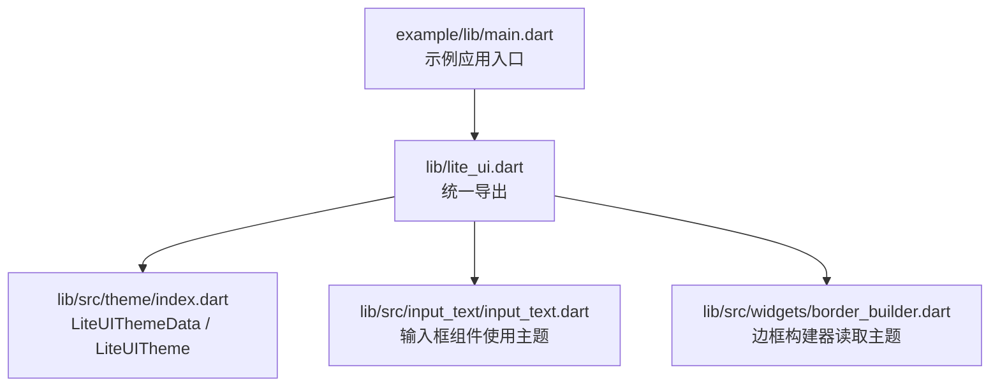
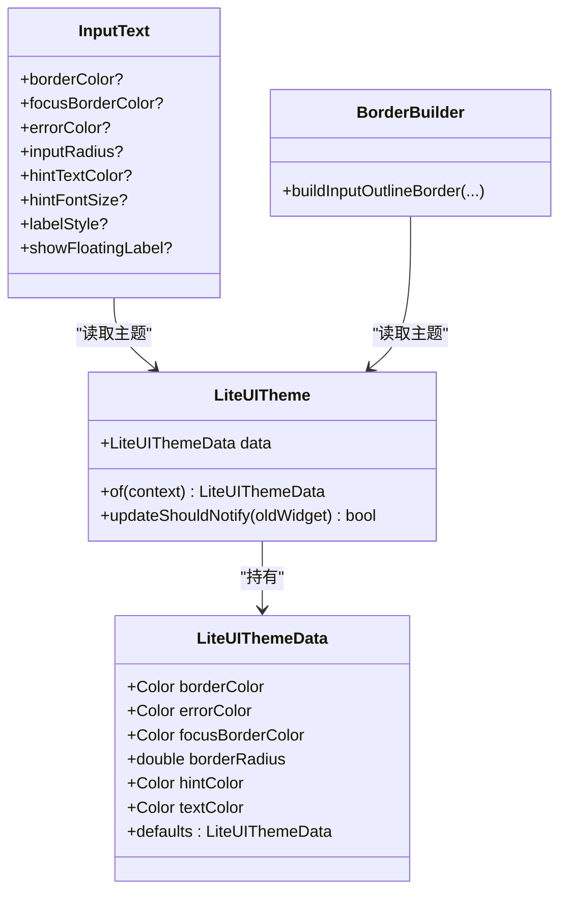
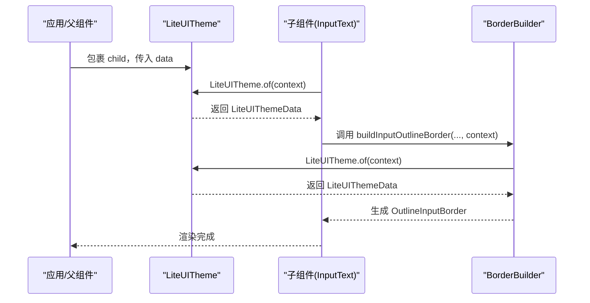
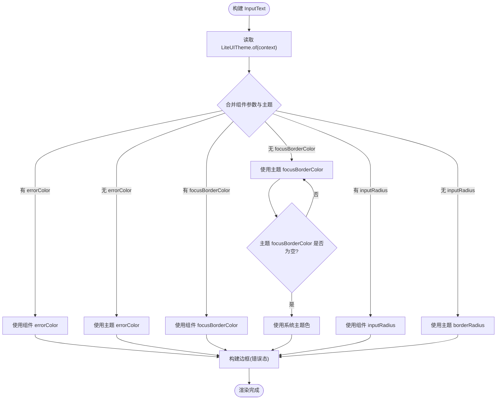
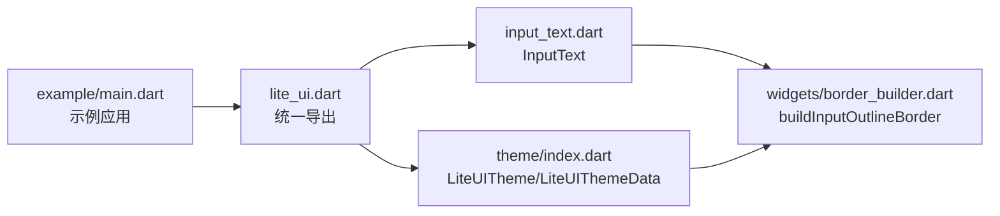

# 主题系统

<cite>
**本文引用的文件**   
- [lite_ui.dart](file://lib/lite_ui.dart)
- [index.dart](file://lib/src/theme/index.dart)
- [input_text.dart](file://lib/src/input_text/input_text.dart)
- [border_builder.dart](file://lib/src/widgets/border_builder.dart)
- [main.dart](file://example/lib/main.dart)
</cite>

## 目录
1. [简介](#简介)
2. [项目结构](#项目结构)
3. [核心组件](#核心组件)
4. [架构总览](#架构总览)
5. [详细组件分析](#详细组件分析)
6. [依赖关系分析](#依赖关系分析)
7. [性能考虑](#性能考虑)
8. [故障排查指南](#故障排查指南)
9. [结论](#结论)
10. [附录](#附录)

## 简介
本章节概述 Lite UI 主题系统的目标与能力：通过 LiteUITheme 与 LiteUIThemeData，为库内组件提供统一的颜色、圆角、边框等样式配置；借助 Flutter 的 InheritedWidget 机制，在组件树中高效传递主题数据；支持按组件覆盖默认值，便于品牌化定制与暗色模式扩展。

## 项目结构
Lite UI 的主题相关代码集中在 lib/src/theme 下，并通过库入口统一导出。示例应用位于 example/lib，展示如何集成 Material 主题与库组件。

图表来源 
- [lite_ui.dart:1-19](file://lib/lite_ui.dart#L1-L19)
- [index.dart:1-73](file://lib/src/theme/index.dart#L1-L73)
- [input_text.dart:1-365](file://lib/src/input_text/input_text.dart#L1-L365)
- [border_builder.dart:1-35](file://lib/src/widgets/border_builder.dart#L1-L35)
- [main.dart:1-80](file://example/lib/main.dart#L1-L80)

章节来源
- [lite_ui.dart:1-19](file://lib/lite_ui.dart#L1-L19)
- [index.dart:1-73](file://lib/src/theme/index.dart#L1-L73)

## 核心组件
- LiteUIThemeData：承载库级默认颜色与样式（边框色、错误色、聚焦边框色、圆角、提示文字色、文本色），并提供 defaults 常量。
- LiteUITheme：基于 InheritedWidget 的主题提供者，暴露静态 of(context) 方法供子树读取主题数据，并在 data 变化时触发重建。

章节来源
- [index.dart:1-73](file://lib/src/theme/index.dart#L1-L73)

## 架构总览
LiteUITheme 作为 InheritedWidget 将 LiteUIThemeData 注入到组件树中。组件通过 LiteUITheme.of(context) 获取主题数据，结合自身参数进行优先级合并，最终渲染出符合品牌风格的界面。

图表来源 
- [index.dart:1-73](file://lib/src/theme/index.dart#L1-L73)
- [input_text.dart:1-365](file://lib/src/input_text/input_text.dart#L1-L365)
- [border_builder.dart:1-35](file://lib/src/widgets/border_builder.dart#L1-L35)

## 详细组件分析

### LiteUIThemeData 与 LiteUITheme 的工作原理
- LiteUIThemeData 定义库级默认样式字段，并提供不可变构造与 defaults 常量，确保一致性。
- LiteUITheme 继承 InheritedWidget，封装 data 字段，并实现 updateShouldNotify 以比较 data 引用是否变化，控制子树重建范围。
- 静态方法 of(context) 通过 dependOnInheritedWidgetOfExactType 查找最近的 LiteUITheme，未找到则回退到 defaults，保证健壮性。

图表来源 
- [index.dart:1-73](file://lib/src/theme/index.dart#L1-L73)
- [input_text.dart:1-365](file://lib/src/input_text/input_text.dart#L1-L365)
- [border_builder.dart:1-35](file://lib/src/widgets/border_builder.dart#L1-L35)

章节来源
- [index.dart:1-73](file://lib/src/theme/index.dart#L1-L73)

### 颜色系统与全局样式配置
- 主色调与辅助色：可通过 LiteUIThemeData.borderColor、errorColor、focusBorderColor 控制边框、错误态与聚焦态颜色。
- 文本颜色：textColor 与 hintColor 分别用于正文与提示文本。
- 圆角与间距：borderRadius 控制输入框等组件的圆角；组件内部还包含 labelSpacing、contentPadding 等布局间距。
- 字体与字号：hintFontSize、labelStyle 可调整提示与标签的字体样式。

章节来源
- [index.dart:1-73](file://lib/src/theme/index.dart#L1-L73)
- [input_text.dart:1-365](file://lib/src/input_text/input_text.dart#L1-L365)

### 组件如何使用主题（以 InputText 为例）
- InputText 在 InputDecoration 的 labelStyle、hintStyle 以及边框构建中读取 LiteUITheme 的值，同时允许组件参数覆盖默认值。
- 错误状态优先使用 widget.errorColor，其次回退到 LiteUITheme.errorColor。
- 聚焦边框优先使用 widget.focusBorderColor，其次回退到 LiteUITheme.focusBorderColor，仍为空时使用系统主题色。
- 圆角优先使用 widget.inputRadius，其次回退到 LiteUITheme.borderRadius。

图表来源 
- [input_text.dart:1-365](file://lib/src/input_text/input_text.dart#L1-L365)
- [border_builder.dart:1-35](file://lib/src/widgets/border_builder.dart#L1-L35)
- [index.dart:1-73](file://lib/src/theme/index.dart#L1-L73)

章节来源
- [input_text.dart:1-365](file://lib/src/input_text/input_text.dart#L1-L365)
- [border_builder.dart:1-35](file://lib/src/widgets/border_builder.dart#L1-L35)

### 暗色模式实现与支持方式
- 当前 LiteUIThemeData 提供默认颜色与 defaults，适合在应用层通过 LiteUITheme 包裹不同主题数据以实现明/暗主题切换。
- 建议做法：在应用根节点或页面层级使用 LiteUITheme(data: 自定义主题) 包裹子树，根据系统或用户偏好动态替换 data，从而驱动组件重绘。
- 若需与 Material 3 的 ColorScheme 联动，可在应用层维护一个主题工厂函数，根据 isDark 返回不同的 LiteUIThemeData。

章节来源
- [index.dart:1-73](file://lib/src/theme/index.dart#L1-L73)

### 主题配置示例与品牌化定制
- 在应用入口或页面顶部使用 LiteUITheme 包裹，传入自定义 LiteUIThemeData，覆盖 borderColor、errorColor、borderRadius、hintColor、textColor 等字段，实现品牌化风格。
- 示例应用 main.dart 展示了如何设置 MaterialApp 的 theme（Material 3），在此基础上再使用 LiteUITheme 覆盖库组件样式。

章节来源
- [lite_ui.dart:1-19](file://lib/lite_ui.dart#L1-L19)
- [main.dart:1-80](file://example/lib/main.dart#L1-L80)

### 主题数据在组件树中的传递机制与性能
- LiteUITheme 作为 InheritedWidget，子组件通过 of(context) 订阅主题数据，仅在 data 引用变化时触发相关子树重建。
- updateShouldNotify 比较 data 对象引用，避免不必要的重建。
- 建议在应用层缓存主题实例或使用 const 构造 LiteUIThemeData，减少重建开销。

章节来源
- [index.dart:1-73](file://lib/src/theme/index.dart#L1-L73)

### 主题切换的动态实现方案与最佳实践
- 在应用顶层维护一个 State 管理 isDark 或主题实例，当切换时更新 LiteUITheme.data，驱动子树刷新。
- 将主题数据提升到足够高的层级，避免频繁跨层级传递。
- 对需要响应主题的组件，尽量只依赖 LiteUITheme.of(context)，避免重复读取导致多余重建。
- 对于复杂主题，可使用主题工厂函数集中生成 LiteUIThemeData，保证一致性与可测试性。

## 依赖关系分析
- lite_ui.dart 统一导出主题模块与组件模块，形成清晰的对外 API 边界。
- 组件（如 InputText）依赖 border_builder.dart 构建边框，两者都依赖 LiteUITheme 读取主题。
- 示例应用 main.dart 引入 lite_ui.dart，展示如何在实际项目中组合使用。

图表来源 
- [lite_ui.dart:1-19](file://lib/lite_ui.dart#L1-L19)
- [index.dart:1-73](file://lib/src/theme/index.dart#L1-L73)
- [input_text.dart:1-365](file://lib/src/input_text/input_text.dart#L1-L365)
- [border_builder.dart:1-35](file://lib/src/widgets/border_builder.dart#L1-L35)
- [main.dart:1-80](file://example/lib/main.dart#L1-L80)

章节来源
- [lite_ui.dart:1-19](file://lib/lite_ui.dart#L1-L19)
- [index.dart:1-73](file://lib/src/theme/index.dart#L1-L73)
- [input_text.dart:1-365](file://lib/src/input_text/input_text.dart#L1-L365)
- [border_builder.dart:1-35](file://lib/src/widgets/border_builder.dart#L1-L35)
- [main.dart:1-80](file://example/lib/main.dart#L1-L80)

## 性能考虑
- 使用 const 构造 LiteUIThemeData 与 LiteUITheme，减少不必要的重建。
- 合理放置 LiteUITheme 的位置，避免包裹过大的子树导致频繁重建。
- 在组件内部仅按需读取 LiteUITheme.of(context)，避免在无关逻辑中触发依赖。
- 对于高频更新的场景，考虑将主题数据提升到更高层级并使用 ValueListenableBuilder 或 Provider/Riverpod 等状态管理方案。

## 故障排查指南
- 主题未生效：确认 LiteUITheme 包裹位置是否正确，且子组件确实处于其作用域内。
- 颜色异常：检查组件参数是否覆盖了主题值；确认错误态、聚焦态与默认态的优先级顺序。
- 圆角不生效：确认 inputRadius 与 borderRadius 的设置路径，确保 BorderBuilder 正确读取主题。
- 重建过多：检查 updateShouldNotify 的比较逻辑，确保 data 引用稳定；避免每次构建创建新的 LiteUIThemeData 实例。

## 结论
Lite UI 主题系统通过 LiteUITheme 与 LiteUIThemeData 提供了简洁而强大的样式管理能力。借助 InheritedWidget 的高效传递机制，组件可以灵活地读取与覆盖主题值，满足品牌化与暗色模式需求。遵循本文的配置方法与最佳实践，可以在保证性能的同时实现一致的视觉体验。

## 附录
- 常用字段说明
  - borderColor：默认边框颜色
  - errorColor：错误状态边框颜色
  - focusBorderColor：聚焦状态边框颜色（为空时使用系统主题色）
  - borderRadius：默认圆角半径
  - hintColor：提示文字颜色
  - textColor：文本颜色
- 组件覆盖优先级
  - 组件参数 > 主题值 > 系统默认值