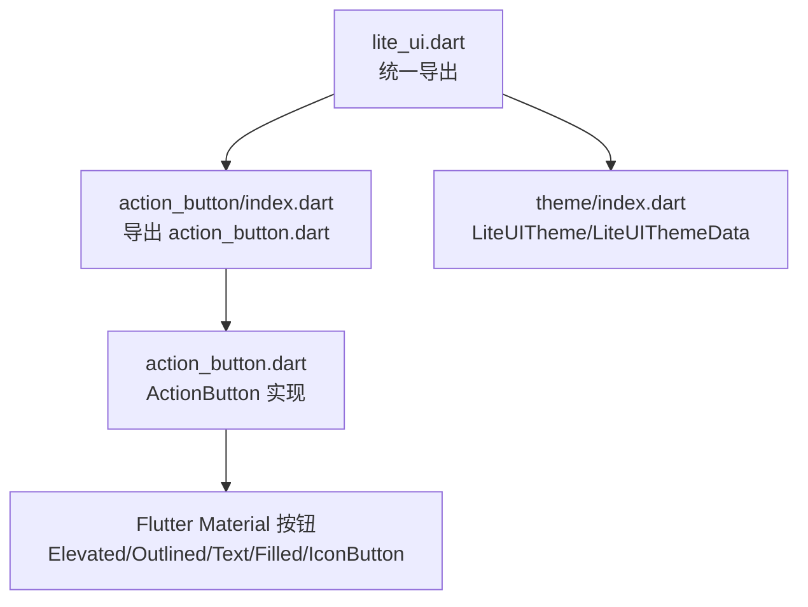
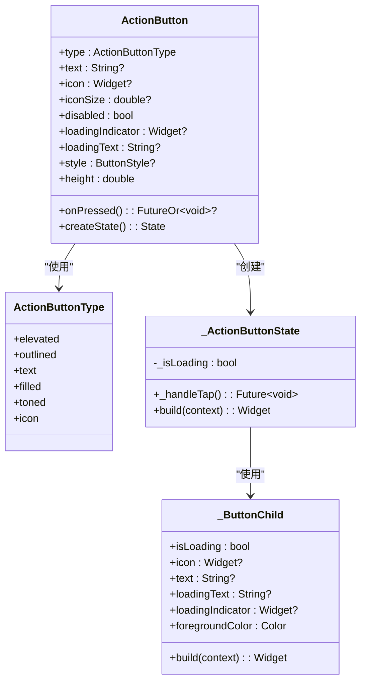
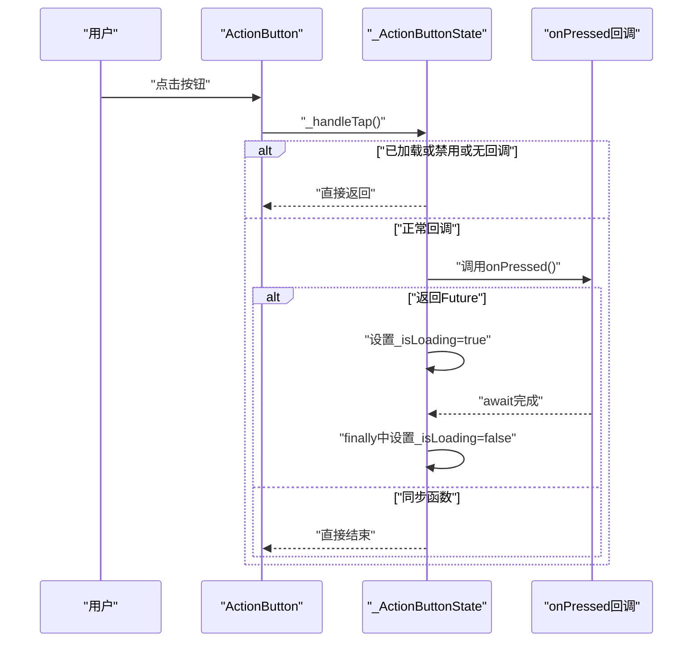
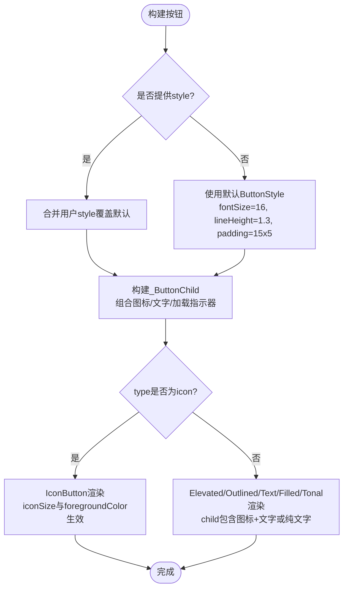
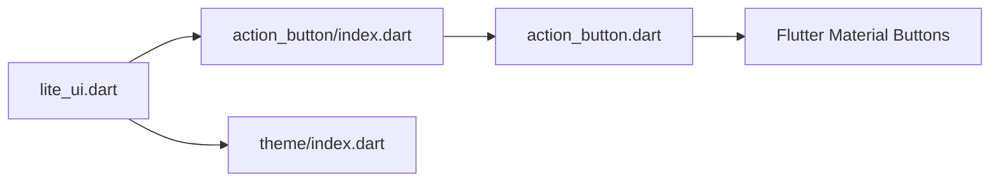

# ActionButton 按钮组件

<cite>
**本文引用的文件**   
- [lib/src/action_button/action_button.dart](file://lib/src/action_button/action_button.dart)
- [lib/src/action_button/index.dart](file://lib/src/action_button/index.dart)
- [lib/lite_ui.dart](file://lib/lite_ui.dart)
- [lib/src/theme/index.dart](file://lib/src/theme/index.dart)
</cite>

## 目录
1. [简介](#简介)
2. [项目结构](#项目结构)
3. [核心组件](#核心组件)
4. [架构总览](#架构总览)
5. [详细组件分析](#详细组件分析)
6. [依赖关系分析](#依赖关系分析)
7. [性能考量](#性能考量)
8. [故障排查指南](#故障排查指南)
9. [结论](#结论)
10. [附录](#附录)

## 简介
ActionButton 是一个基于 Flutter 原生按钮的二次封装组件，统一了多种按钮形态（凸起、描边、文字、填充、色调填充、图标），并内置异步点击处理与加载状态管理。它保留了水波纹、无障碍、主题等能力，适合在表单提交、数据操作、导航跳转等场景中使用。

## 项目结构
ActionButton 组件位于 lib/src/action_button 目录下，并通过库入口 lite_ui.dart 统一导出。主题系统通过 lib/src/theme/index.dart 提供 LiteUITheme 与 LiteUIThemeData，便于全局样式定制。

图表来源
- [lib/lite_ui.dart:1-19](file://lib/lite_ui.dart#L1-L19)
- [lib/src/action_button/index.dart:1-2](file://lib/src/action_button/index.dart#L1-L2)
- [lib/src/action_button/action_button.dart:1-208](file://lib/src/action_button/action_button.dart#L1-L208)
- [lib/src/theme/index.dart:1-73](file://lib/src/theme/index.dart#L1-L73)

章节来源
- [lib/lite_ui.dart:1-19](file://lib/lite_ui.dart#L1-L19)
- [lib/src/action_button/index.dart:1-2](file://lib/src/action_button/index.dart#L1-L2)
- [lib/src/action_button/action_button.dart:1-208](file://lib/src/action_button/action_button.dart#L1-L208)
- [lib/src/theme/index.dart:1-73](file://lib/src/theme/index.dart#L1-L73)

## 核心组件
- ActionButtonType：定义按钮类型枚举，映射到 Flutter 标准按钮。
- ActionButton：StatefulWidget，封装按钮外观、交互与加载态。
- _ButtonChild：内部 Widget，负责组合图标、文字与加载指示器。

章节来源
- [lib/src/action_button/action_button.dart:4-23](file://lib/src/action_button/action_button.dart#L4-L23)
- [lib/src/action_button/action_button.dart:43-94](file://lib/src/action_button/action_button.dart#L43-L94)
- [lib/src/action_button/action_button.dart:180-207](file://lib/src/action_button/action_button.dart#L180-L207)

## 架构总览
ActionButton 根据 type 选择底层按钮实现；onPressed 支持同步或异步函数，自动切换 loading 状态；style 透传 ButtonStyle 以覆盖默认样式；icon 在非 icon 类型时作为前缀，在 icon 类型时作为唯一内容。

图表来源
- [lib/src/action_button/action_button.dart:4-23](file://lib/src/action_button/action_button.dart#L4-L23)
- [lib/src/action_button/action_button.dart:43-94](file://lib/src/action_button/action_button.dart#L43-L94)
- [lib/src/action_button/action_button.dart:96-175](file://lib/src/action_button/action_button.dart#L96-L175)
- [lib/src/action_button/action_button.dart:180-207](file://lib/src/action_button/action_button.dart#L180-L207)

## 详细组件分析

### 属性参数说明
- type：按钮类型，默认 elevated。可选值包括 elevated、outlined、text、filled、toned、icon。
- text：按钮文本，icon 类型时忽略。
- icon：图标 Widget；非 icon 类型显示在文字左侧；icon 类型时作为唯一内容。
- iconSize：仅 icon 类型生效，透传给 IconButton.iconSize。
- onPressed：点击回调，支持同步或异步函数；异步时自动进入 loading 态并禁用重复点击。
- disabled：是否禁用，默认 false。
- loadingIndicator：自定义加载指示器，覆盖默认的 CircularProgressIndicator。
- loadingText：加载中显示的文案；为 null 时保持原文字；icon 类型时忽略。
- style：ButtonStyle，用于覆盖默认样式（如字体、内边距、前景色等）。
- height：按钮高度，默认 45。

章节来源
- [lib/src/action_button/action_button.dart:43-94](file://lib/src/action_button/action_button.dart#L43-L94)
- [lib/src/action_button/action_button.dart:117-175](file://lib/src/action_button/action_button.dart#L117-L175)

### 事件处理机制
- 点击流程：
  - 若处于 loading 或 disabled 或无回调，则直接返回。
  - 调用 onPressed；若返回 Future，则设置 loading 态并在 finally 中恢复。
- 禁用策略：
  - 当 isLoading 或 disabled 为真时，将 onPressed 置空，从而禁用按钮。
- 异步最佳实践：
  - 在 onPressed 中执行网络请求或耗时任务，避免阻塞 UI。
  - 确保异常路径不会导致 loading 态卡死（组件已保证 finally 清理）。

图表来源
- [lib/src/action_button/action_button.dart:96-114](file://lib/src/action_button/action_button.dart#L96-L114)
- [lib/src/action_button/action_button.dart:117-175](file://lib/src/action_button/action_button.dart#L117-L175)

章节来源
- [lib/src/action_button/action_button.dart:96-114](file://lib/src/action_button/action_button.dart#L96-L114)
- [lib/src/action_button/action_button.dart:117-175](file://lib/src/action_button/action_button.dart#L117-L175)

### 样式配置与主题定制
- 默认样式：
  - 文本样式：字号 16、行高 1.3、字重 w600。
  - 内边距：水平 15、垂直 5。
- 覆盖方式：
  - 通过 style 传入 ButtonStyle，可覆盖 foregroundColor、textStyle、padding 等。
  - icon 类型的加载指示器颜色取自 style.foregroundColor.resolve({})，未设置时使用白色。
- 主题系统：
  - 可通过 LiteUITheme 包裹应用，设置全局颜色与圆角等（当前按钮主要依赖 Flutter Theme 与 style）。

图表来源
- [lib/src/action_button/action_button.dart:117-175](file://lib/src/action_button/action_button.dart#L117-L175)
- [lib/src/theme/index.dart:1-73](file://lib/src/theme/index.dart#L1-L73)

章节来源
- [lib/src/action_button/action_button.dart:117-175](file://lib/src/action_button/action_button.dart#L117-L175)
- [lib/src/theme/index.dart:1-73](file://lib/src/theme/index.dart#L1-L73)

### 使用示例与场景
- 普通按钮（带文本）：
  - 使用 ElevatedButton 形态，传入 text 与 onPressed。
  - 参考路径：[lib/src/action_button/action_button.dart:139-143](file://lib/src/action_button/action_button.dart#L139-L143)
- 带图标的按钮：
  - 非 icon 类型：传入 icon 与 text，图标显示在文字左侧。
  - icon 类型：仅显示图标，iconSize 控制大小。
  - 参考路径：[lib/src/action_button/action_button.dart:140-171](file://lib/src/action_button/action_button.dart#L140-L171)
- 加载状态：
  - 传入异步 onPressed，组件自动显示 loadingIndicator 与 loadingText。
  - 参考路径：[lib/src/action_button/action_button.dart:96-114](file://lib/src/action_button/action_button.dart#L96-L114)
- 禁用状态：
  - 设置 disabled 为 true，按钮不可点击。
  - 参考路径：[lib/src/action_button/action_button.dart:117-119](file://lib/src/action_button/action_button.dart#L117-L119)
- 尺寸规格：
  - 通过 height 控制整体高度；icon 类型通过 iconSize 控制图标大小。
  - 参考路径：[lib/src/action_button/action_button.dart:55-58](file://lib/src/action_button/action_button.dart#L55-L58), [lib/src/action_button/action_button.dart:160-171](file://lib/src/action_button/action_button.dart#L160-L171)

章节来源
- [lib/src/action_button/action_button.dart:96-114](file://lib/src/action_button/action_button.dart#L96-L114)
- [lib/src/action_button/action_button.dart:117-175](file://lib/src/action_button/action_button.dart#L117-L175)

### 响应式设计与可访问性
- 响应式：
  - 通过 style.padding 与 height 适配不同屏幕密度与布局。
  - icon 类型下 iconSize 可按设备调整。
- 可访问性：
  - 基于 Material 按钮，保留水波纹与语义信息；如需增强，可在外层包裹 Semantics。
  - 建议为 onPressed 提供明确的业务语义，便于读屏器描述。

章节来源
- [lib/src/action_button/action_button.dart:117-175](file://lib/src/action_button/action_button.dart#L117-L175)

## 依赖关系分析
- 外部依赖：
  - Flutter Material 组件（ElevatedButton、OutlinedButton、TextButton、FilledButton、IconButton）。
- 内部依赖：
  - index.dart 仅做导出。
  - lite_ui.dart 统一导出 action_button 与 theme。
- 耦合度：
  - ActionButton 与 Flutter 按钮强耦合，但通过 type 抽象降低具体实现影响。
  - 样式通过 style 透传，解耦外观与行为。

图表来源
- [lib/lite_ui.dart:1-19](file://lib/lite_ui.dart#L1-L19)
- [lib/src/action_button/index.dart:1-2](file://lib/src/action_button/index.dart#L1-L2)
- [lib/src/action_button/action_button.dart:1-208](file://lib/src/action_button/action_button.dart#L1-L208)
- [lib/src/theme/index.dart:1-73](file://lib/src/theme/index.dart#L1-L73)

章节来源
- [lib/lite_ui.dart:1-19](file://lib/lite_ui.dart#L1-L19)
- [lib/src/action_button/index.dart:1-2](file://lib/src/action_button/index.dart#L1-L2)
- [lib/src/action_button/action_button.dart:1-208](file://lib/src/action_button/action_button.dart#L1-L208)
- [lib/src/theme/index.dart:1-73](file://lib/src/theme/index.dart#L1-L73)

## 性能考量
- 避免频繁重建：
  - 将 onPressed 中的异步逻辑抽离为独立函数，减少闭包重建。
- 合理设置样式：
  - 复用 ButtonStyle 实例，避免每次 build 重新计算。
- 图标资源：
  - 使用稳定的 Icon 或预加载图片，避免运行时解码开销。
- 加载态优化：
  - 尽量缩短异步任务时间；必要时使用节流或防抖防止重复触发。

## 故障排查指南
- 按钮不响应点击：
  - 检查 disabled 是否为 true。
  - 确认 onPressed 是否为 null。
  - 若为异步函数，确认未抛出未捕获异常导致 loading 态卡住。
- 加载指示器不显示：
  - 确认 onPressed 返回 Future。
  - 检查 loadingIndicator 是否被错误覆盖。
- 样式未生效：
  - 确认 style 正确传入且字段名无误（如 foregroundColor、textStyle、padding）。
  - 对于 icon 类型，foreground 颜色决定加载指示器颜色。

章节来源
- [lib/src/action_button/action_button.dart:96-114](file://lib/src/action_button/action_button.dart#L96-L114)
- [lib/src/action_button/action_button.dart:117-175](file://lib/src/action_button/action_button.dart#L117-L175)

## 结论
ActionButton 提供了统一的按钮抽象与强大的交互能力，尤其适合需要异步操作与加载态管理的场景。通过灵活的 type、style 与 icon 配置，可快速适配多种 UI 需求。结合 LiteUITheme 可实现全局主题定制，满足企业级应用的样式一致性要求。

## 附录
- 导出入口：
  - 通过 lite_ui.dart 引入 ActionButton。
  - 参考路径：[lib/lite_ui.dart:7](file://lib/lite_ui.dart#L7)
- 主题定制：
  - 使用 LiteUITheme 包裹应用，设置全局颜色与圆角。
  - 参考路径：[lib/src/theme/index.dart:40-73](file://lib/src/theme/index.dart#L40-L73)

章节来源
- [lib/lite_ui.dart:1-19](file://lib/lite_ui.dart#L1-L19)
- [lib/src/theme/index.dart:1-73](file://lib/src/theme/index.dart#L1-L73)