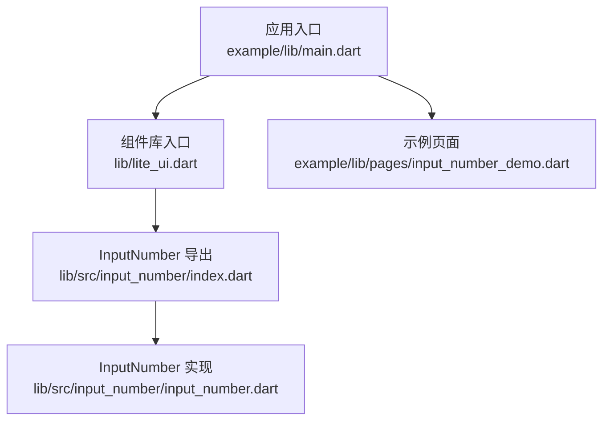
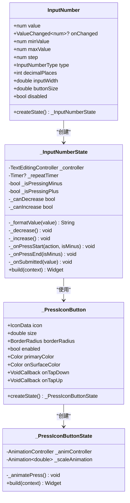
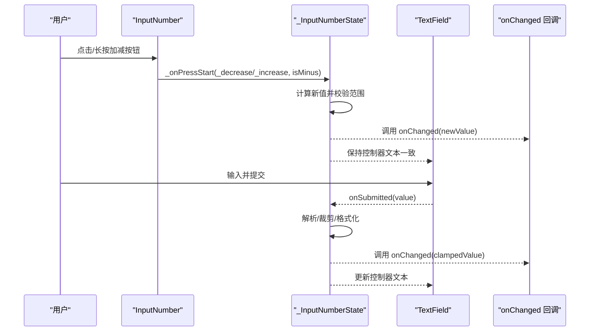
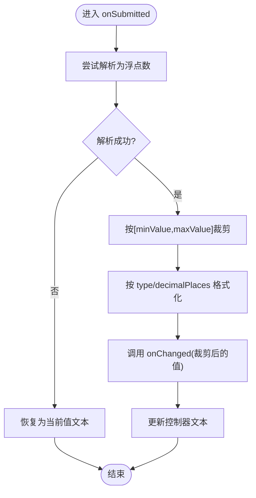
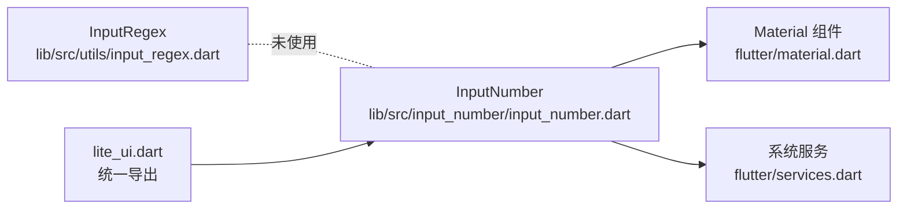

# InputNumber 数字输入框

<cite>
**本文引用的文件**   
- [README.md](file://README.md)
- [pubspec.yaml](file://pubspec.yaml)
- [lite_ui.dart](file://lib/lite_ui.dart)
- [input_number.dart](file://lib/src/input_number/input_number.dart)
- [index.dart](file://lib/src/input_number/index.dart)
- [input_regex.dart](file://lib/src/utils/input_regex.dart)
- [main.dart](file://example/lib/main.dart)
- [input_number_demo.dart](file://example/lib/pages/input_number_demo.dart)
</cite>

## 目录
1. [简介](#简介)
2. [项目结构](#项目结构)
3. [核心组件与特性](#核心组件与特性)
4. [架构总览](#架构总览)
5. [详细组件分析](#详细组件分析)
6. [依赖关系分析](#依赖关系分析)
7. [性能与体验优化](#性能与体验优化)
8. [故障排查指南](#故障排查指南)
9. [结论](#结论)
10. [附录：属性与用法速查](#附录属性与用法速查)

## 简介
InputNumber 数字输入框是一个轻量、可配置的 Flutter 数字步进器，提供“左侧减号 + 中间输入框 + 右侧加号”的交互形态。它支持整数/小数两种输入类型、最小值/最大值范围限制、步长控制、小数位数格式化、禁用状态、自定义尺寸等能力，适合购物车数量、评分、体重等常见数值输入场景。

该组件在库中通过统一入口导出，示例页面提供了多种典型用法的演示。

**章节来源**
- [README.md:100-108](file://README.md#L100-L108)

## 项目结构
InputNumber 组件位于 lib/src/input_number 目录下，并通过 lite_ui.dart 统一导出。示例代码位于 example/lib/pages/input_number_demo.dart，主入口在 example/lib/main.dart。

**图表来源**
- [main.dart:1-80](file://example/lib/main.dart#L1-L80)
- [lite_ui.dart:1-19](file://lib/lite_ui.dart#L1-L19)
- [index.dart:1-2](file://lib/src/input_number/index.dart#L1-L2)
- [input_number_demo.dart:1-140](file://example/lib/pages/input_number_demo.dart#L1-L140)

**章节来源**
- [lite_ui.dart:1-19](file://lib/lite_ui.dart#L1-L19)
- [index.dart:1-2](file://lib/src/input_number/index.dart#L1-L2)
- [main.dart:1-80](file://example/lib/main.dart#L1-L80)
- [input_number_demo.dart:1-140](file://example/lib/pages/input_number_demo.dart#L1-L140)

## 核心组件与特性
- 输入类型：整数（integer）或小数（decimal），默认小数
- 范围限制：minValue、maxValue
- 步长控制：step（加减步幅）
- 小数位数：decimalPlaces（仅在小数模式生效）
- 交互行为：点击加减按钮、长按连续增减、提交时校验并格式化
- 显示样式：输入框宽度 inputWidth、按钮大小 buttonSize、禁用态 disabled
- 主题适配：基于 Material 3 颜色体系，自动跟随主题

**章节来源**
- [input_number.dart:6-68](file://lib/src/input_number/input_number.dart#L6-L68)
- [input_number.dart:168-231](file://lib/src/input_number/input_number.dart#L168-L231)

## 架构总览
InputNumber 为 StatefulWidget，内部维护 TextEditingController 与长按定时器，渲染左右两个带缩放动画的按钮和中间的 TextField。输入通过 onSubmitted 回调进行解析、裁剪与格式化，再通过 onChanged 通知外部。

**图表来源**
- [input_number.dart:21-68](file://lib/src/input_number/input_number.dart#L21-L68)
- [input_number.dart:70-166](file://lib/src/input_number/input_number.dart#L70-L166)
- [input_number.dart:168-231](file://lib/src/input_number/input_number.dart#L168-L231)
- [input_number.dart:235-306](file://lib/src/input_number/input_number.dart#L235-L306)

## 详细组件分析

### 数据流与交互流程
- 初始渲染：根据 value 与 type/decimalPlaces 格式化文本
- 加减按钮：立即执行一次操作，随后以固定间隔重复触发，直到抬起
- 手动输入：onSubmitted 时解析、裁剪到[minValue,maxValue]，再格式化并回调
- 外部更新：value 变化时同步刷新控制器文本

**图表来源**
- [input_number.dart:110-162](file://lib/src/input_number/input_number.dart#L110-L162)
- [input_number.dart:168-231](file://lib/src/input_number/input_number.dart#L168-L231)

### 输入与格式化逻辑
- 整数模式：仅允许数字输入，显示为整数字符串
- 小数模式：允许小数点与指定位数的小数位，显示时使用 toFixed(decimalPlaces)
- 提交处理：解析失败则回退当前值；成功则 clamp 到[minValue,maxValue]后格式化

**图表来源**
- [input_number.dart:153-162](file://lib/src/input_number/input_number.dart#L153-L162)
- [input_number.dart:82-87](file://lib/src/input_number/input_number.dart#L82-L87)

### 键盘与输入设备支持
- 键盘：TextField 根据类型选择 number 或 numberWithOptions(decimal:true)，提交时完成校验
- 鼠标/触摸：左右按钮支持按下、抬起、取消事件；长按通过 Timer.periodic 持续触发
- 滚轮：未内置滚轮监听，如需滚轮增减可在外层包裹监听滚动事件并调用 onChanged

**章节来源**
- [input_number.dart:202-214](file://lib/src/input_number/input_number.dart#L202-L214)
- [input_number.dart:126-151](file://lib/src/input_number/input_number.dart#L126-L151)

### 与表单验证集成
- 组件本身不直接集成 FormField，但可通过 onChanged 将值同步到上层表单控制器
- 若需严格校验，建议在父层对 onChanged 返回值做二次校验与错误提示
- 输入格式由组件内部控制，避免非法字符进入

**章节来源**
- [input_number_demo.dart:31-78](file://example/lib/pages/input_number_demo.dart#L31-L78)

### 本地化与千分位分隔
- 当前实现未内置千分位分隔与区域化格式化
- 如需展示货币或地区化格式，可在外层对 onChanged 返回值进行格式化后再显示

[本节为通用说明，不直接分析具体文件]

## 依赖关系分析
InputNumber 依赖 Flutter 基础控件与系统服务，用于输入过滤与长度限制。工具类 InputRegex 提供常用正则表达式，但 InputNumber 当前未直接使用该类。

**图表来源**
- [input_number.dart:1-4](file://lib/src/input_number/input_number.dart#L1-L4)
- [lite_ui.dart:13](file://lib/lite_ui.dart#L13)
- [input_regex.dart:1-46](file://lib/src/utils/input_regex.dart#L1-L46)

**章节来源**
- [input_number.dart:1-4](file://lib/src/input_number/input_number.dart#L1-L4)
- [lite_ui.dart:1-19](file://lib/lite_ui.dart#L1-L19)
- [input_regex.dart:1-46](file://lib/src/utils/input_regex.dart#L1-L46)

## 性能与体验优化
- 避免频繁重建：将 InputNumber 放入稳定的 State 或 Provider 管理，减少不必要的 rebuild
- 合理设置 decimalPlaces：过大的小数位数会增加字符串格式化开销
- 输入长度限制：LengthLimitingTextInputFormatter 已内置，避免超长输入导致布局抖动
- 长按频率：当前周期为 120ms，可根据业务调整以提升流畅度
- 移动端体验：增大 buttonSize 与 inputWidth，提升触控命中率；必要时在外层添加滚动监听实现滚轮增减

[本节为通用建议，不直接分析具体文件]

## 故障排查指南
- 输入被拒绝：检查 onSubmitted 是否返回了无效字符，组件会回退到当前值
- 超出范围：确认 minValue/maxValue 配置是否正确；组件会自动裁剪
- 无法输入小数：确保 type=decimal 且 decimalPlaces>=1
- 按钮无响应：检查 disabled 是否为 true；确认 _canDecrease/_canIncrease 条件
- 样式异常：确认 Theme 颜色可用，或传入合适的 primaryColor/onSurfaceColor

**章节来源**
- [input_number.dart:153-162](file://lib/src/input_number/input_number.dart#L153-L162)
- [input_number.dart:164-166](file://lib/src/input_number/input_number.dart#L164-L166)
- [input_number.dart:176-184](file://lib/src/input_number/input_number.dart#L176-L184)

## 结论
InputNumber 提供了简洁、稳定、可配置的数字输入能力，覆盖常见的整数/小数、范围与步长控制、长按连续增减等需求。对于更复杂的本地化与千分位展示，可在上层进行格式化与校验。整体实现清晰、耦合度低，易于集成到各类表单与业务场景中。

[本节为总结性内容，不直接分析具体文件]

## 附录：属性与用法速查

- 属性一览
  - value：当前值（必填）
  - onChanged：值变化回调
  - minValue：最小值（默认 0）
  - maxValue：最大值（默认 9999）
  - step：步长（默认 1）
  - type：输入类型 integer/decimal（默认 decimal）
  - decimalPlaces：小数位数（默认 2，仅在 decimal 有效）
  - inputWidth：输入框宽度（默认 50）
  - buttonSize：按钮大小（默认 36）
  - disabled：禁用状态（默认 false）

- 典型用法
  - 整数输入：type=integer，常用于数量、评分等
  - 小数输入：type=decimal，decimalPlaces=1/2，常用于重量、价格等
  - 百分比输入：在上层将值乘以 100 并格式化显示
  - 购物车数量：结合商品卡片展示数量增减

- 参考示例路径
  - 示例页面：[input_number_demo.dart](file://example/lib/pages/input_number_demo.dart)
  - 组件实现：[input_number.dart](file://lib/src/input_number/input_number.dart)

**章节来源**
- [input_number_demo.dart:24-78](file://example/lib/pages/input_number_demo.dart#L24-L78)
- [input_number.dart:21-68](file://lib/src/input_number/input_number.dart#L21-L68)