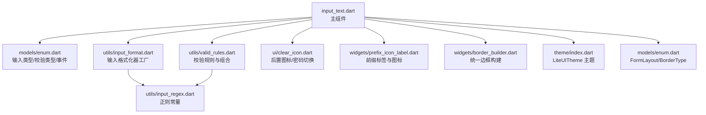
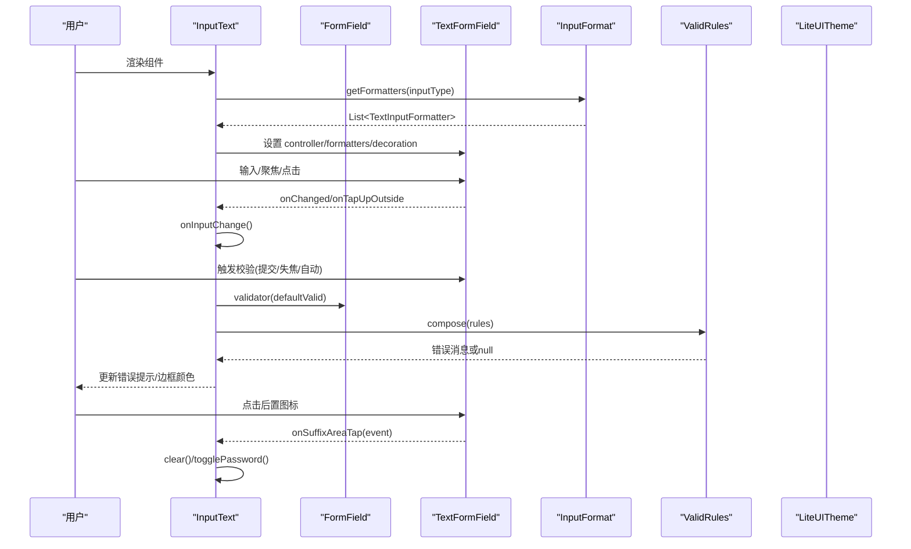
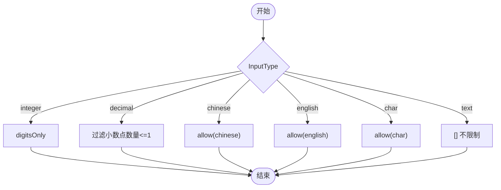
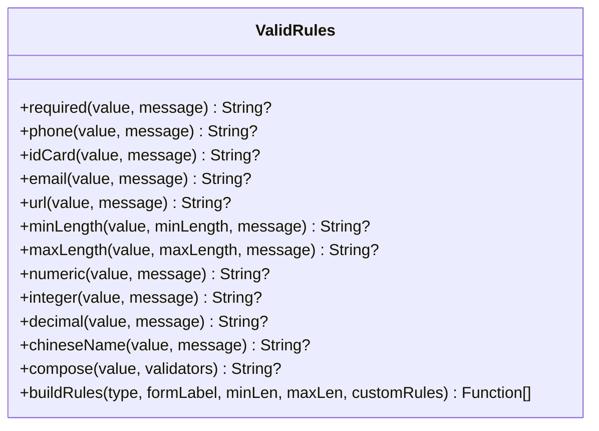
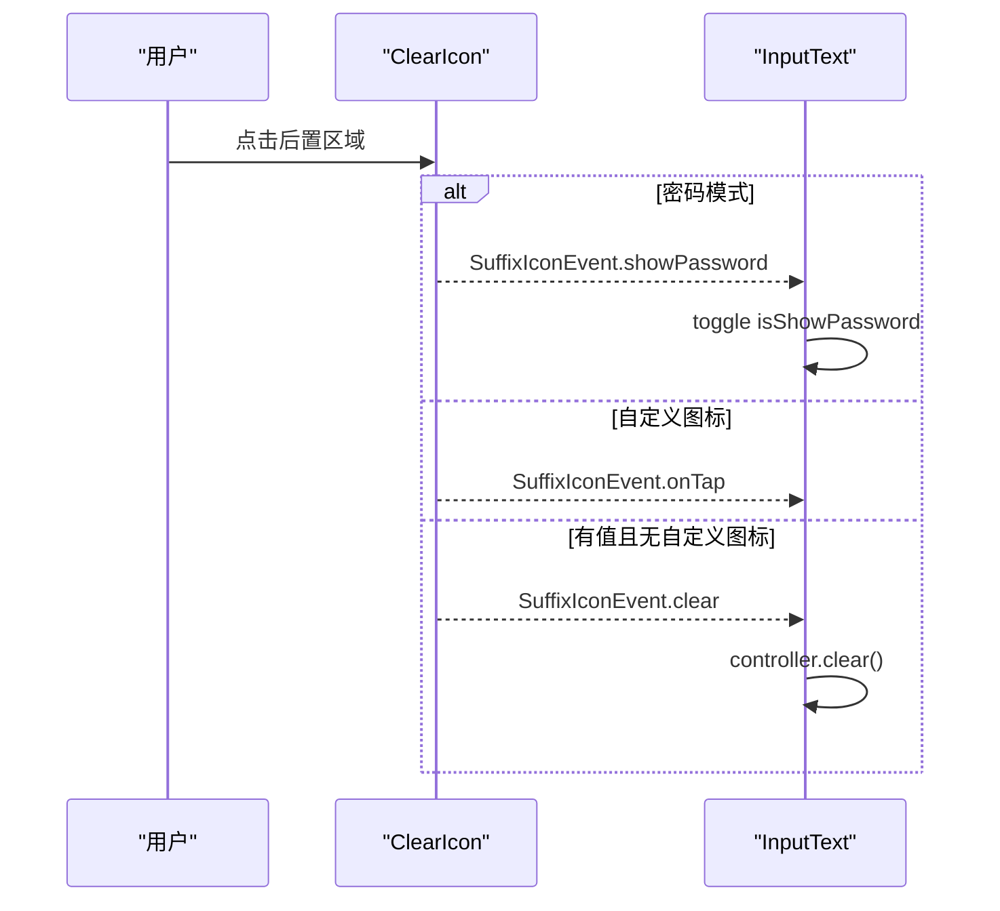
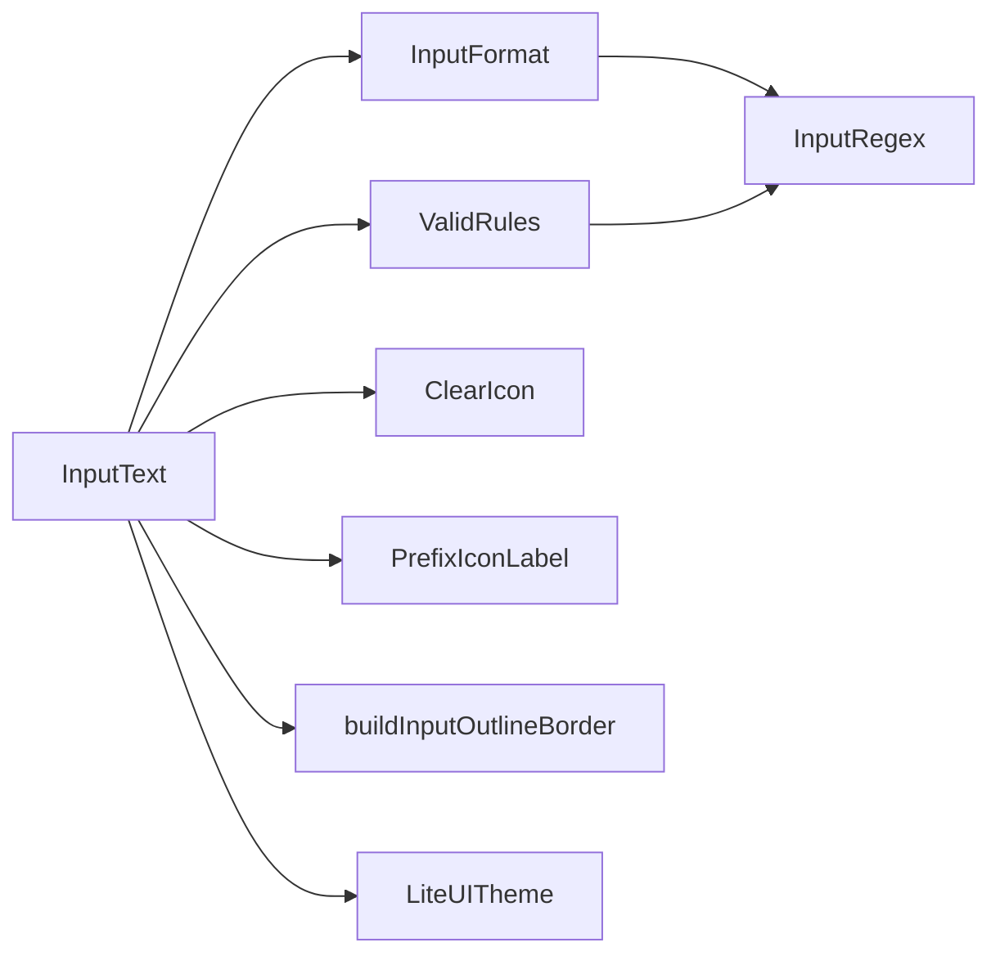

# InputText 文本输入框

<cite>
**本文引用的文件**
- [lib/src/input_text/input_text.dart](file://lib/src/input_text/input_text.dart)
- [lib/src/input_text/index.dart](file://lib/src/input_text/index.dart)
- [lib/src/input_text/models/enum.dart](file://lib/src/input_text/models/enum.dart)
- [lib/src/input_text/utils/input_format.dart](file://lib/src/input_text/utils/input_format.dart)
- [lib/src/input_text/utils/valid_rules.dart](file://lib/src/input_text/utils/valid_rules.dart)
- [lib/src/input_text/ui/clear_icon.dart](file://lib/src/input_text/ui/clear_icon.dart)
- [lib/src/widgets/prefix_icon_label.dart](file://lib/src/widgets/prefix_icon_label.dart)
- [lib/src/widgets/border_builder.dart](file://lib/src/widgets/border_builder.dart)
- [lib/src/theme/index.dart](file://lib/src/theme/index.dart)
- [lib/src/models/enum.dart](file://lib/src/models/enum.dart)
- [lib/src/utils/input_regex.dart](file://lib/src/utils/input_regex.dart)
</cite>

## 目录
1. [简介](#简介)
2. [项目结构](#项目结构)
3. [核心组件](#核心组件)
4. [架构总览](#架构总览)
5. [详细组件分析](#详细组件分析)
6. [依赖关系分析](#依赖关系分析)
7. [性能与体验优化](#性能与体验优化)
8. [故障排查指南](#故障排查指南)
9. [结论](#结论)
10. [附录：属性与用法速查](#附录属性与用法速查)

## 简介
InputText 是 LiteUI 的文本输入框组件，提供基础输入、实时格式化、内置与自定义验证规则、图标与前缀后缀支持、主题化样式等能力。它基于 Flutter 的 FormField 与 TextFormField 构建，结合统一的边框构建器与主题系统，实现一致的视觉与交互体验。

## 项目结构
InputText 模块采用“组件 + 模型枚举 + 工具类 + UI 子组件”的分层组织方式：
- 组件入口与导出：index.dart
- 主组件：input_text.dart（StatefulWidget）
- 类型与事件枚举：models/enum.dart
- 输入格式化器：utils/input_format.dart（工厂与路由）
- 校验规则：utils/valid_rules.dart（内置规则与组合器）
- 后置图标与清空逻辑：ui/clear_icon.dart
- 前置标签与图标：widgets/prefix_icon_label.dart
- 统一边框构建：widgets/border_builder.dart
- 主题数据与 Inherited：theme/index.dart
- 表单布局与边框类型枚举：models/enum.dart
- 正则表达式常量：utils/input_regex.dart

图表来源
- [lib/src/input_text/input_text.dart:1-365](file://lib/src/input_text/input_text.dart#L1-L365)
- [lib/src/input_text/models/enum.dart:1-82](file://lib/src/input_text/models/enum.dart#L1-L82)
- [lib/src/input_text/utils/input_format.dart:1-88](file://lib/src/input_text/utils/input_format.dart#L1-L88)
- [lib/src/input_text/utils/valid_rules.dart:1-245](file://lib/src/input_text/utils/valid_rules.dart#L1-L245)
- [lib/src/input_text/ui/clear_icon.dart:1-46](file://lib/src/input_text/ui/clear_icon.dart#L1-L46)
- [lib/src/widgets/prefix_icon_label.dart:1-50](file://lib/src/widgets/prefix_icon_label.dart#L1-L50)
- [lib/src/widgets/border_builder.dart:1-35](file://lib/src/widgets/border_builder.dart#L1-L35)
- [lib/src/theme/index.dart:1-73](file://lib/src/theme/index.dart#L1-L73)
- [lib/src/models/enum.dart:1-29](file://lib/src/models/enum.dart#L1-L29)
- [lib/src/utils/input_regex.dart:1-46](file://lib/src/utils/input_regex.dart#L1-L46)

章节来源
- [lib/src/input_text/index.dart:1-4](file://lib/src/input_text/index.dart#L1-L4)

## 核心组件
InputText 是一个 StatefulWidget，内部封装了 FormField 与 TextFormField，提供：
- 输入类型限制：通过 inputType 选择 text/decimal/integer/chinese/english/char，底层使用 TextInputFormatter 实时拦截非法字符
- 校验规则：支持 ValidRuleType 内置规则（手机号、邮箱、身份证、URL、数字、小数、整数、中文姓名、密码、自定义），以及 validRules 自定义规则列表
- 图标与前缀后缀：支持 prefixIcon/suffixIcon 或 IconData，密码模式自动显示可见性切换；有值时默认显示清空按钮
- 浮动标签与错误提示：根据状态动态展示 label/hint/error，支持主题色与自定义颜色
- 表单集成：onSaved、validator、onChange、autoValidate、keyboardType、inputFormatters 等

章节来源
- [lib/src/input_text/input_text.dart:15-168](file://lib/src/input_text/input_text.dart#L15-L168)
- [lib/src/input_text/input_text.dart:170-365](file://lib/src/input_text/input_text.dart#L170-L365)

## 架构总览
InputText 的运行时流程如下：
- 初始化：创建 TextEditingController（若未传入）、焦点节点、密码可见性状态
- 构建：根据 formLayout 决定标签位置；为 TextFormField 注入 inputFormatters（由 inputType 生成并合并用户自定义）
- 校验：当 required 或 validRuleType 非 custom 时启用 FormField 校验，defaultValid 将 required、内置规则、长度限制与自定义 validator 组合执行
- 事件：onChange 回调内容变化；onSuffixIconTap 处理清空、密码切换等后置图标事件
- 样式：通过 buildInputOutlineBorder 统一边框，颜色从 LiteUITheme 读取

图表来源
- [lib/src/input_text/input_text.dart:170-365](file://lib/src/input_text/input_text.dart#L170-L365)
- [lib/src/input_text/utils/input_format.dart:67-87](file://lib/src/input_text/utils/input_format.dart#L67-L87)
- [lib/src/input_text/utils/valid_rules.dart:173-245](file://lib/src/input_text/utils/valid_rules.dart#L173-L245)
- [lib/src/theme/index.dart:54-73](file://lib/src/theme/index.dart#L54-L73)

## 详细组件分析

### 组件属性与行为
- 基础输入
  - controller：外部控制器，便于双向绑定与程序化控制
  - keyboardType：键盘类型，适配不同输入场景
  - maxLines/minLines：多行输入支持
  - password：密码模式，自动显示可见性切换图标
- 输入类型与格式化
  - inputType：text/decimal/integer/chinese/english/char，通过 InputFormat.getFormatters 生成 TextInputFormatter 列表
  - inputFormatters：可叠加自定义格式化器，与 inputType 生成的格式化器合并
- 校验规则
  - validRuleType：内置规则类型（phone/email/idCard/url/numeric/decimal/integer/chineseName/password/custom）
  - minLen/maxLen：长度限制，可与任意规则组合
  - validRules：自定义规则函数列表，仅在 validRuleType=custom 时生效
  - validator：最后执行的自定义校验函数
  - autoValidate：AutovalidateMode，控制何时触发校验
- 图标与前缀后缀
  - prefixIcon/prefixIconData/prefixIconColor：前缀图标与样式
  - suffixIcon/suffixIconData：后置图标；密码模式下自动切换可见性；有值时默认显示清空按钮
  - onSuffixIconTap：后置图标点击回调，事件包括 onTap/showPassword/clear
- 表单布局与标签
  - formLayout：row/column 两种布局
  - showFloatingLabel：是否启用浮动标签
  - labelStyle/hintStyle/hintTextColor/hintFontSize：标签与提示文字样式
  - formLabel：表单标签名，用于必填提示与占位符
- 外观与主题
  - borderColor/focusBorderColor/errorColor/inputRadius：边框与圆角
  - 所有颜色优先使用 LiteUITheme，未设置则回退到默认或系统主题

章节来源
- [lib/src/input_text/input_text.dart:15-168](file://lib/src/input_text/input_text.dart#L15-L168)
- [lib/src/input_text/input_text.dart:236-352](file://lib/src/input_text/input_text.dart#L236-L352)
- [lib/src/input_text/models/enum.dart:23-82](file://lib/src/input_text/models/enum.dart#L23-L82)
- [lib/src/input_text/utils/input_format.dart:67-87](file://lib/src/input_text/utils/input_format.dart#L67-L87)
- [lib/src/input_text/utils/valid_rules.dart:191-245](file://lib/src/input_text/utils/valid_rules.dart#L191-L245)
- [lib/src/theme/index.dart:6-38](file://lib/src/theme/index.dart#L6-L38)

### 输入格式化器（InputFormat）
- 工厂方法
  - integer()：仅允许数字
  - decimal()：允许数字与一个小数点，拒绝非法格式
  - chinese()：仅允许中文字符
  - english()：仅允许英文字母
  - char()：仅允许 ASCII 单字符
  - text()：不限制
- 路由
  - getFormatters(InputType)：根据输入类型返回对应的格式化器列表

图表来源
- [lib/src/input_text/utils/input_format.dart:10-62](file://lib/src/input_text/utils/input_format.dart#L10-L62)
- [lib/src/input_text/utils/input_format.dart:67-87](file://lib/src/input_text/utils/input_format.dart#L67-L87)
- [lib/src/utils/input_regex.dart:1-46](file://lib/src/utils/input_regex.dart#L1-L46)

章节来源
- [lib/src/input_text/utils/input_format.dart:1-88](file://lib/src/input_text/utils/input_format.dart#L1-L88)

### 校验规则（ValidRules）
- 内置规则
  - required：必填
  - phone：中国大陆手机号
  - idCard：18位身份证号（含校验码）
  - email：邮箱地址
  - url：URL
  - numeric：纯数字
  - integer：整数（支持负数）
  - decimal：有效小数（不允许 1.2.3、空小数点等）
  - chineseName：中文姓名（2-20个中文字符）
  - password：至少6位且包含大写字母
- 组合与构建
  - compose(value, validators)：顺序执行多个规则，返回首个错误消息
  - buildRules(type, formLabel, minLen, maxLen, customRules)：根据类型自动生成规则列表，支持长度限制与自定义规则

图表来源
- [lib/src/input_text/utils/valid_rules.dart:1-245](file://lib/src/input_text/utils/valid_rules.dart#L1-L245)

章节来源
- [lib/src/input_text/utils/valid_rules.dart:1-245](file://lib/src/input_text/utils/valid_rules.dart#L1-L245)

### 后置图标与清空逻辑（ClearIcon）
- 密码模式：显示可见性切换图标，点击触发 showPassword 事件
- 自定义后置图标：suffixIcon 或 suffixIconData，点击触发 onTap 事件
- 默认清空：当有值时显示清空按钮，点击触发 clear 事件

图表来源
- [lib/src/input_text/ui/clear_icon.dart:1-46](file://lib/src/input_text/ui/clear_icon.dart#L1-L46)
- [lib/src/input_text/input_text.dart:225-233](file://lib/src/input_text/input_text.dart#L225-L233)

章节来源
- [lib/src/input_text/ui/clear_icon.dart:1-46](file://lib/src/input_text/ui/clear_icon.dart#L1-L46)

### 前置标签与图标（PrefixIconLabel）
- 支持自定义前缀图标与固定宽度标签
- 必填时显示红色星号标记

章节来源
- [lib/src/widgets/prefix_icon_label.dart:1-50](file://lib/src/widgets/prefix_icon_label.dart#L1-L50)

### 边框构建（buildInputOutlineBorder）
- 统一 OutlineInputBorder 构建，支持默认/启用/聚焦三种状态
- 颜色优先级：hasError > focusBorderColor > theme.focusBorderColor > 系统主题色；默认边框颜色优先 theme.borderColor

章节来源
- [lib/src/widgets/border_builder.dart:1-35](file://lib/src/widgets/border_builder.dart#L1-L35)

### 主题系统（LiteUITheme）
- LiteUIThemeData：定义默认边框颜色、错误颜色、聚焦边框颜色、圆角半径、提示颜色、文字颜色
- LiteUITheme：InheritedWidget，提供 of(context) 获取主题数据，未找到时使用 defaults

章节来源
- [lib/src/theme/index.dart:1-73](file://lib/src/theme/index.dart#L1-L73)

## 依赖关系分析
InputText 对以下模块存在直接依赖：
- 输入格式化器：InputFormat（基于 InputRegex）
- 校验规则：ValidRules（基于 InputRegex）
- UI 子组件：ClearIcon、PrefixIconLabel
- 边框构建：buildInputOutlineBorder
- 主题：LiteUITheme
- 枚举：InputType、ValidRuleType、SuffixIconEvent、FormLayout、BorderType

图表来源
- [lib/src/input_text/input_text.dart:1-365](file://lib/src/input_text/input_text.dart#L1-L365)
- [lib/src/input_text/utils/input_format.dart:1-88](file://lib/src/input_text/utils/input_format.dart#L1-L88)
- [lib/src/input_text/utils/valid_rules.dart:1-245](file://lib/src/input_text/utils/valid_rules.dart#L1-L245)
- [lib/src/utils/input_regex.dart:1-46](file://lib/src/utils/input_regex.dart#L1-L46)

章节来源
- [lib/src/input_text/input_text.dart:1-365](file://lib/src/input_text/input_text.dart#L1-L365)

## 性能与体验优化
- 输入格式化器
  - 使用 FilteringTextInputFormatter.digitsOnly 与轻量正则，避免复杂计算
  - decimal 格式化器仅检查小数点数量，保证输入流畅
- 校验策略
  - defaultValid 仅在 required 或 validRuleType 非 custom 时启用，减少不必要的校验开销
  - compose 短路返回首个错误，避免多余校验
- 状态管理
  - 内部 controller 在 dispose 时释放，外部传入的由外部生命周期管理
  - FocusNode 在 dispose 时释放，避免内存泄漏
- 用户体验
  - 后置图标点击区分 clear/showPassword/onTap，反馈明确
  - 浮动标签与错误提示即时更新，提升可读性

[本节为通用指导，不直接分析具体文件]

## 故障排查指南
- 校验不生效
  - 确认已设置 required=true 或 validRuleType 非 custom
  - 检查 autoValidate 模式是否符合预期
- 格式化无效
  - 确认 inputType 与 inputFormatters 是否正确配置
  - 注意 decimal 格式化器会拒绝非法小数点组合
- 后置图标无响应
  - 检查 onSuffixIconTap 是否注册
  - 密码模式下需确保 hasValue 与 isShowPassword 状态正确
- 主题颜色不生效
  - 确认 LiteUITheme 包裹层级覆盖到 InputText
  - 检查 borderColor/focusBorderColor/errorColor 是否被覆盖

章节来源
- [lib/src/input_text/input_text.dart:196-217](file://lib/src/input_text/input_text.dart#L196-L217)
- [lib/src/input_text/input_text.dart:225-233](file://lib/src/input_text/input_text.dart#L225-L233)
- [lib/src/theme/index.dart:54-73](file://lib/src/theme/index.dart#L54-L73)

## 结论
InputText 以简洁的 API 提供了丰富的输入控制能力，涵盖输入类型限制、内置与自定义校验、图标与前缀后缀、主题化样式等。其模块化设计使扩展与维护更加便捷，适合在各类表单场景中复用。

[本节为总结，不直接分析具体文件]

## 附录：属性与用法速查
- 基础输入
  - controller：外部控制器
  - keyboardType：键盘类型
  - maxLines/minLines：多行输入
  - password：密码模式
- 输入类型与格式化
  - inputType：text/decimal/integer/chinese/english/char
  - inputFormatters：自定义格式化器列表
- 校验规则
  - validRuleType：内置规则类型
  - minLen/maxLen：长度限制
  - validRules：自定义规则函数列表
  - validator：自定义校验函数
  - autoValidate：自动校验模式
- 图标与前缀后缀
  - prefixIcon/prefixIconData/prefixIconColor
  - suffixIcon/suffixIconData
  - onSuffixIconTap：后置图标事件
- 表单布局与标签
  - formLayout：row/column
  - showFloatingLabel：浮动标签开关
  - labelStyle/hintStyle/hintTextColor/hintFontSize
  - formLabel：表单标签名
- 外观与主题
  - borderColor/focusBorderColor/errorColor/inputRadius

章节来源
- [lib/src/input_text/input_text.dart:15-168](file://lib/src/input_text/input_text.dart#L15-L168)
- [lib/src/input_text/models/enum.dart:23-82](file://lib/src/input_text/models/enum.dart#L23-L82)
- [lib/src/input_text/utils/input_format.dart:67-87](file://lib/src/input_text/utils/input_format.dart#L67-L87)
- [lib/src/input_text/utils/valid_rules.dart:191-245](file://lib/src/input_text/utils/valid_rules.dart#L191-L245)
- [lib/src/theme/index.dart:6-38](file://lib/src/theme/index.dart#L6-L38)