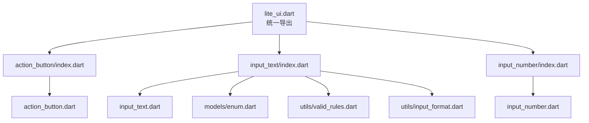
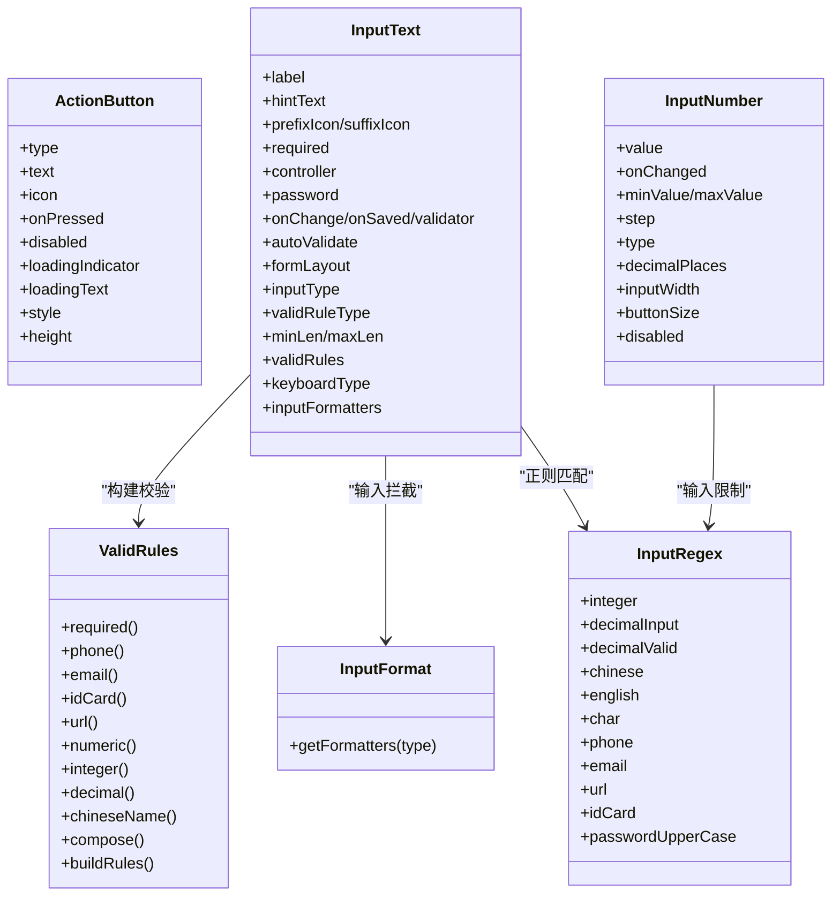
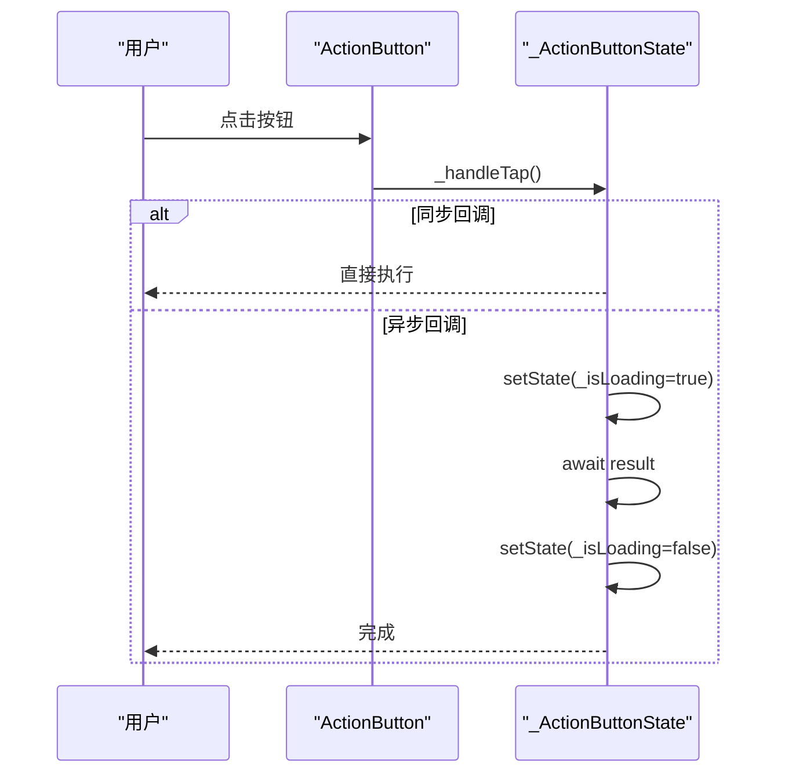
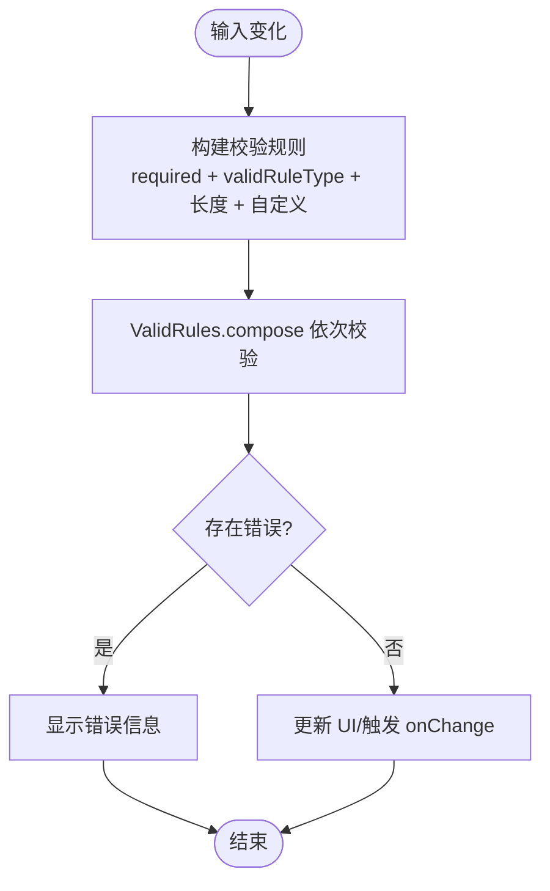
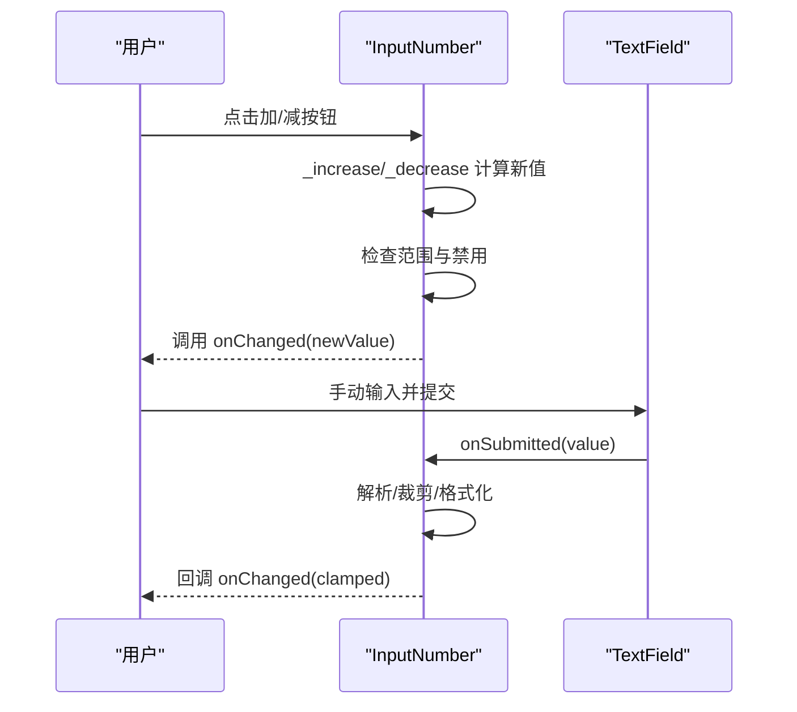
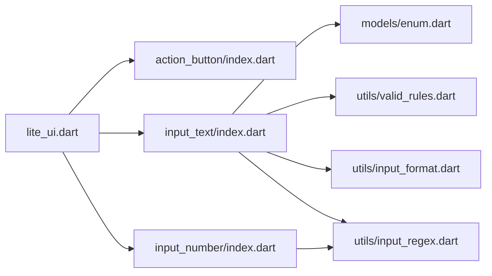

# 基础组件

<cite>
**本文引用的文件**   
- [lib/lite_ui.dart](file://lib/lite_ui.dart)
- [lib/src/action_button/action_button.dart](file://lib/src/action_button/action_button.dart)
- [lib/src/action_button/index.dart](file://lib/src/action_button/index.dart)
- [lib/src/input_text/input_text.dart](file://lib/src/input_text/input_text.dart)
- [lib/src/input_text/index.dart](file://lib/src/input_text/index.dart)
- [lib/src/input_text/models/enum.dart](file://lib/src/input_text/models/enum.dart)
- [lib/src/input_text/utils/valid_rules.dart](file://lib/src/input_text/utils/valid_rules.dart)
- [lib/src/input_text/utils/input_format.dart](file://lib/src/input_text/utils/input_format.dart)
- [lib/src/input_number/input_number.dart](file://lib/src/input_number/input_number.dart)
- [lib/src/input_number/index.dart](file://lib/src/input_number/index.dart)
- [lib/src/models/enum.dart](file://lib/src/models/enum.dart)
- [lib/src/utils/input_regex.dart](file://lib/src/utils/input_regex.dart)
</cite>

## 目录
1. [简介](#简介)
2. [项目结构](#项目结构)
3. [核心组件](#核心组件)
4. [架构总览](#架构总览)
5. [详细组件分析](#详细组件分析)
6. [依赖关系分析](#依赖关系分析)
7. [性能考虑](#性能考虑)
8. [故障排查指南](#故障排查指南)
9. [结论](#结论)
10. [附录：使用示例与最佳实践](#附录使用示例与最佳实践)

## 简介
本章节面向 Lite UI 的基础组件，重点介绍 ActionButton、InputText、InputNumber 三个核心组件的功能、属性配置、事件处理、样式定制、状态管理、验证规则、格式化能力、响应式设计与可访问性，并给出组合使用模式、性能优化建议与常见问题解决方案。

## 项目结构
Lite UI 通过统一入口导出各模块，便于按需引入。三个基础组件分别位于 src 下的独立目录中，并通过 index 文件暴露对外 API。

图表来源
- [lib/lite_ui.dart:1-19](file://lib/lite_ui.dart#L1-L19)
- [lib/src/action_button/index.dart:1-2](file://lib/src/action_button/index.dart#L1-L2)
- [lib/src/input_text/index.dart:1-4](file://lib/src/input_text/index.dart#L1-L4)
- [lib/src/input_number/index.dart:1-2](file://lib/src/input_number/index.dart#L1-L2)

章节来源
- [lib/lite_ui.dart:1-19](file://lib/lite_ui.dart#L1-L19)

## 核心组件
- ActionButton：基于 Flutter 原生按钮的封装，支持多种按钮类型、自动异步加载态、图标与文字组合、样式覆盖等。
- InputText：表单输入框，支持多布局、前置/后置图标、密码可见切换、输入类型限制、丰富校验规则、浮动标签与主题色。
- InputNumber：数字步进器，支持整数/小数、步长、范围限制、长按连续增减、输入格式化与提交校验。

章节来源
- [lib/src/action_button/action_button.dart:1-208](file://lib/src/action_button/action_button.dart#L1-L208)
- [lib/src/input_text/input_text.dart:1-365](file://lib/src/input_text/input_text.dart#L1-L365)
- [lib/src/input_number/input_number.dart:1-307](file://lib/src/input_number/input_number.dart#L1-L307)

## 架构总览
三个组件均遵循“StatefulWidget + 内部状态管理”的模式，结合枚举与工具类实现统一的交互与校验逻辑。

图表来源
- [lib/src/action_button/action_button.dart:1-208](file://lib/src/action_button/action_button.dart#L1-L208)
- [lib/src/input_text/input_text.dart:1-365](file://lib/src/input_text/input_text.dart#L1-L365)
- [lib/src/input_number/input_number.dart:1-307](file://lib/src/input_number/input_number.dart#L1-L307)
- [lib/src/input_text/utils/valid_rules.dart:1-245](file://lib/src/input_text/utils/valid_rules.dart#L1-L245)
- [lib/src/input_text/utils/input_format.dart:1-88](file://lib/src/input_text/utils/input_format.dart#L1-L88)
- [lib/src/utils/input_regex.dart:1-46](file://lib/src/utils/input_regex.dart#L1-L46)

## 详细组件分析

### ActionButton 组件
- 功能概述
  - 支持 elevated、outlined、text、filled、toned、icon 六种类型。
  - 自动识别同步/异步回调：异步时显示 loading，期间禁用重复点击。
  - 支持 icon 前缀（非 icon 类型）或唯一内容（icon 类型）。
  - 可通过 style 完全覆盖默认样式。
- 关键属性
  - type：按钮类型
  - text/icon/iconSize：文本与图标
  - onPressed：点击回调（支持 FutureOr<void>）
  - disabled/loadingIndicator/loadingText/style/height：禁用、加载指示器、加载文案、样式、高度
- 事件处理
  - 点击触发 _handleTap，若返回 Future 则进入加载态；finally 中恢复。
- 样式定制
  - 通过 ButtonStyle 覆盖文本样式、内边距、前景色等。
- 可访问性与无障碍
  - 继承 Material 按钮的无障碍能力（语义、焦点、水波纹）。
- 响应式设计
  - 高度固定（默认 45），可根据屏幕宽度自由缩放；图标尺寸可按需设置。

图表来源
- [lib/src/action_button/action_button.dart:96-175](file://lib/src/action_button/action_button.dart#L96-L175)

章节来源
- [lib/src/action_button/action_button.dart:1-208](file://lib/src/action_button/action_button.dart#L1-L208)

### InputText 组件
- 功能概述
  - 表单输入框，支持行/列布局、浮动标签、前置/后置图标、密码可见切换。
  - 输入类型限制（text/decimal/integer/chinese/english/char）通过 TextInputFormatter 实时拦截。
  - 校验规则丰富：必填、手机号、邮箱、身份证、URL、数字、整数、小数、中文姓名、密码、自定义规则。
  - 支持 autoValidate、onSaved、validator、onChange 等生命周期与事件。
- 关键属性
  - label/hintText/formLabel/labelSpacing：标签与提示
  - prefixIcon/suffixIcon/password：前后置图标与密码模式
  - required/autoValidate/formLayout：必填、自动校验、布局
  - inputType/validRuleType/minLen/maxLen/validRules：输入限制与校验
  - keyboardType/inputFormatters：键盘与输入格式化
- 状态管理
  - 内部 FocusNode 与 TextEditingController（如未外部传入）；密码可见状态 isShowPassword。
- 验证规则
  - defaultValid 组合 required、类型规则、长度限制与自定义 validator。
  - ValidRules.compose 顺序执行，返回首个错误信息。
- 输入格式化
  - InputFormat.getFormatters 根据 InputType 返回对应 Formatter 列表。
- 可访问性与主题
  - 使用 LiteUITheme 的颜色与样式；错误颜色、提示颜色、标签样式均可定制。
- 响应式设计
  - 支持 row/column 布局；labelWidth、inputRadius、hintFontSize 等适配不同屏幕。

图表来源
- [lib/src/input_text/input_text.dart:196-217](file://lib/src/input_text/input_text.dart#L196-L217)
- [lib/src/input_text/utils/valid_rules.dart:173-182](file://lib/src/input_text/utils/valid_rules.dart#L173-L182)

章节来源
- [lib/src/input_text/input_text.dart:1-365](file://lib/src/input_text/input_text.dart#L1-L365)
- [lib/src/input_text/models/enum.dart:1-82](file://lib/src/input_text/models/enum.dart#L1-L82)
- [lib/src/input_text/utils/valid_rules.dart:1-245](file://lib/src/input_text/utils/valid_rules.dart#L1-L245)
- [lib/src/input_text/utils/input_format.dart:1-88](file://lib/src/input_text/utils/input_format.dart#L1-L88)
- [lib/src/models/enum.dart:1-29](file://lib/src/models/enum.dart#L1-L29)

### InputNumber 组件
- 功能概述
  - 左侧减号、中间输入框、右侧加号的数字步进器。
  - 支持整数/小数、步长、最小/最大值限制、长按连续增减。
  - 输入时按类型限制格式，提交时进行范围裁剪与格式化。
- 关键属性
  - value/onChanged：受控值与变化回调
  - minValue/maxValue/step：范围与步长
  - type/decimalPlaces：整数或小数及小数位数
  - inputWidth/buttonSize/disabled：尺寸与禁用
- 状态管理
  - 内部 TextEditingController 维护显示值；didUpdateWidget 同步外部 value 变化。
- 输入与提交
  - 输入阶段：TextInputFormatter 限制字符；提交 onSubmitted 解析、裁剪、格式化后回调 onChanged。
- 交互体验
  - 长按定时器周期性触发加减；按钮按下有缩放动画。
- 可访问性与主题
  - 使用 Theme.of(context) 获取主色、表面色、轮廓色等，保证与系统主题一致。

图表来源
- [lib/src/input_number/input_number.dart:110-162](file://lib/src/input_number/input_number.dart#L110-L162)

章节来源
- [lib/src/input_number/input_number.dart:1-307](file://lib/src/input_number/input_number.dart#L1-L307)

## 依赖关系分析
- 统一导出
  - lite_ui.dart 集中导出 action_button、input_text、input_number 以及主题、模型与工具。
- 组件间耦合
  - InputText 依赖 models/enum（FormLayout、BorderType、DisplayMode）、utils/valid_rules、utils/input_format、utils/input_regex。
  - InputNumber 依赖 utils/input_regex（用于输入限制）。
  - ActionButton 无外部强依赖，主要依赖 Material 组件。

图表来源
- [lib/lite_ui.dart:1-19](file://lib/lite_ui.dart#L1-L19)
- [lib/src/input_text/index.dart:1-4](file://lib/src/input_text/index.dart#L1-L4)
- [lib/src/input_number/index.dart:1-2](file://lib/src/input_number/index.dart#L1-L2)
- [lib/src/models/enum.dart:1-29](file://lib/src/models/enum.dart#L1-L29)
- [lib/src/input_text/utils/valid_rules.dart:1-245](file://lib/src/input_text/utils/valid_rules.dart#L1-L245)
- [lib/src/input_text/utils/input_format.dart:1-88](file://lib/src/input_text/utils/input_format.dart#L1-L88)
- [lib/src/utils/input_regex.dart:1-46](file://lib/src/utils/input_regex.dart#L1-L46)

章节来源
- [lib/lite_ui.dart:1-19](file://lib/lite_ui.dart#L1-L19)

## 性能考虑
- ActionButton
  - 避免在 onPressed 中执行重型同步操作；优先使用异步回调以利用内置 loading 与防抖。
  - 频繁重建场景下，尽量将 style 与 icon 提升为常量或缓存，减少重建开销。
- InputText
  - 合理设置 autoValidate，避免每次输入都触发复杂校验；必要时改为手动触发 Form.validate。
  - 外部传入 controller 时注意生命周期管理，避免内存泄漏。
  - 输入格式化器与校验规则应尽量精简，减少正则复杂度。
- InputNumber
  - 长按定时器在 dispose 中及时取消，避免后台持续触发。
  - didUpdateWidget 中仅当 value 变化时更新控制器文本，降低不必要的重绘。

[本节为通用指导，不直接分析具体文件]

## 故障排查指南
- ActionButton
  - 现象：点击无响应
    - 检查 disabled 与 onPressed 是否为空；确认异步回调是否抛出异常导致 finally 未执行。
  - 现象：加载态不消失
    - 确保异步回调正常完成；检查 mounted 判断与 setState 调用时机。
- InputText
  - 现象：校验不生效
    - 确认 hasValidation 条件（required 或 validRuleType != custom）；检查 defaultValid 中的 rules 构建。
  - 现象：输入被意外拦截
    - 检查 inputType 对应的 InputFormat 与 inputFormatters 叠加情况；确认正则与长度限制。
  - 现象：密码不可见切换无效
    - 检查 password 与 isShowPassword 状态更新；确认 onSuffixAreaTap 分支。
- InputNumber
  - 现象：数值超出范围
    - 检查 minValue/maxValue 与 step；确认 onSubmitted 的 clamping 逻辑。
  - 现象：长按无效
    - 检查 _repeatTimer 是否正确启动与取消；确认 onTapDown/TapUp 回调绑定。

章节来源
- [lib/src/action_button/action_button.dart:96-175](file://lib/src/action_button/action_button.dart#L96-L175)
- [lib/src/input_text/input_text.dart:196-233](file://lib/src/input_text/input_text.dart#L196-L233)
- [lib/src/input_number/input_number.dart:126-162](file://lib/src/input_number/input_number.dart#L126-L162)

## 结论
ActionButton、InputText、InputNumber 三个基础组件覆盖了常见的交互与数据输入场景。它们通过枚举与工具类实现了统一的样式、校验与格式化能力，具备良好的可访问性与主题一致性。在实际项目中，建议结合业务需求选择合适的输入类型与校验规则，合理使用受控与非受控模式，并注意性能与可维护性。

[本节为总结，不直接分析具体文件]

## 附录：使用示例与最佳实践
- ActionButton
  - 基本用法：设置 type、text/icon、onPressed，启用异步加载。
  - 样式定制：通过 style 覆盖文本、内边距、前景色等。
  - 最佳实践：将耗时操作放入异步回调；避免在 onPressed 中直接 setState。
- InputText
  - 表单布局：row/column 布局配合 formLabel 与 labelSpacing。
  - 输入限制：选择 inputType（如 decimal/integer/chinese）并结合 inputFormatters。
  - 校验规则：使用 validRuleType（如 phone/email/idCard/url/numeric/decimal/integer/chineseName/password/custom）与 minLen/maxLen；必要时提供 validRules 自定义规则。
  - 密码模式：password=true 时启用可见切换；suffixIconTap 处理 clear/showPassword。
  - 最佳实践：对复杂校验采用 AutovalidateMode.disabled，在提交时统一验证；外部 controller 需自行 dispose。
- InputNumber
  - 基本用法：设置 value/onChanged、minValue/maxValue/step/type/decimalPlaces。
  - 交互增强：长按连续增减；输入提交时自动裁剪与格式化。
  - 最佳实践：保持 value 与控制器文本同步；在 didUpdateWidget 中谨慎更新文本。

章节来源
- [lib/src/action_button/action_button.dart:1-208](file://lib/src/action_button/action_button.dart#L1-L208)
- [lib/src/input_text/input_text.dart:1-365](file://lib/src/input_text/input_text.dart#L1-L365)
- [lib/src/input_number/input_number.dart:1-307](file://lib/src/input_number/input_number.dart#L1-L307)