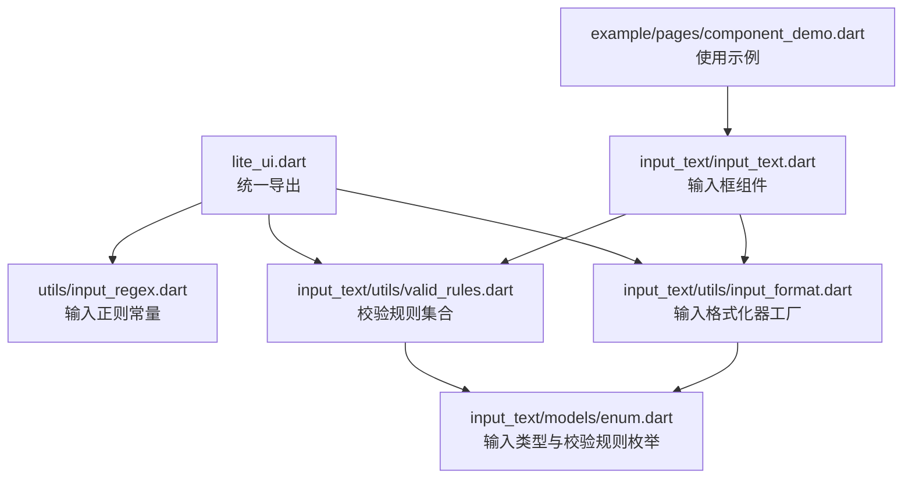
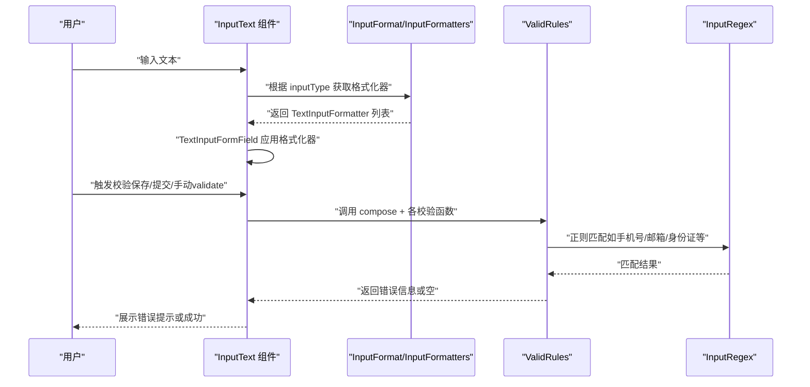
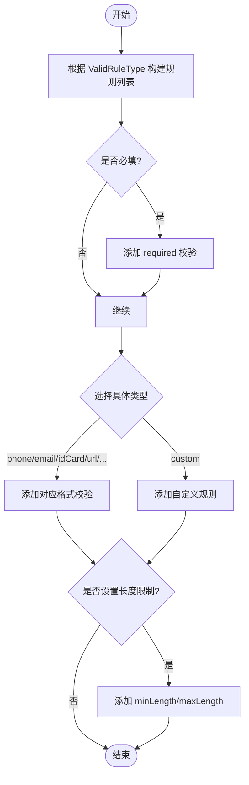
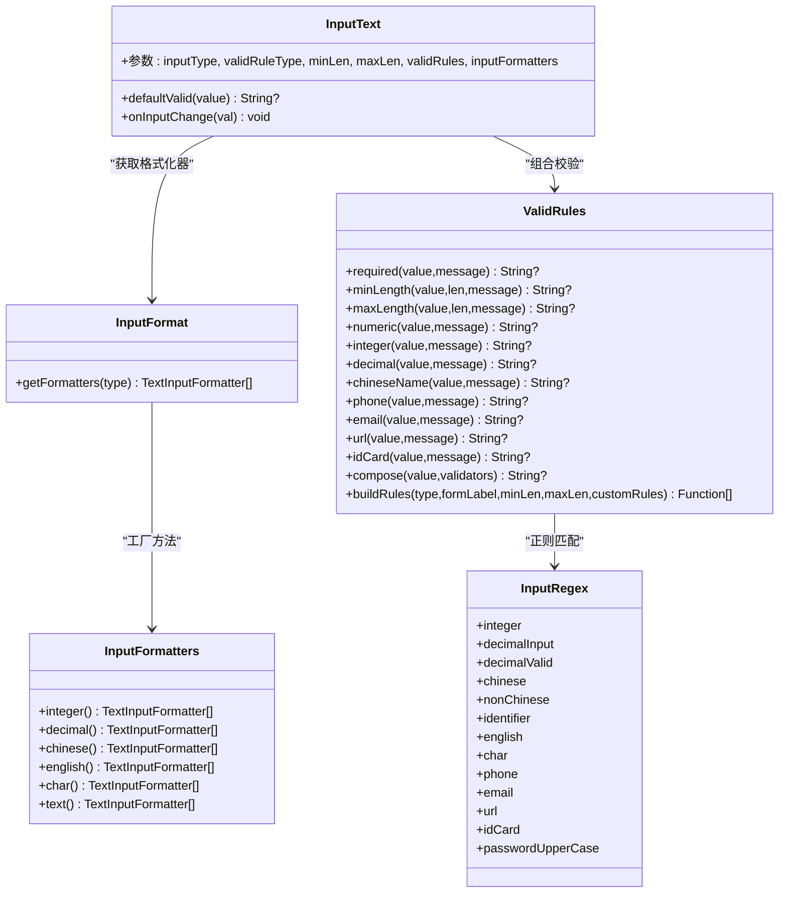
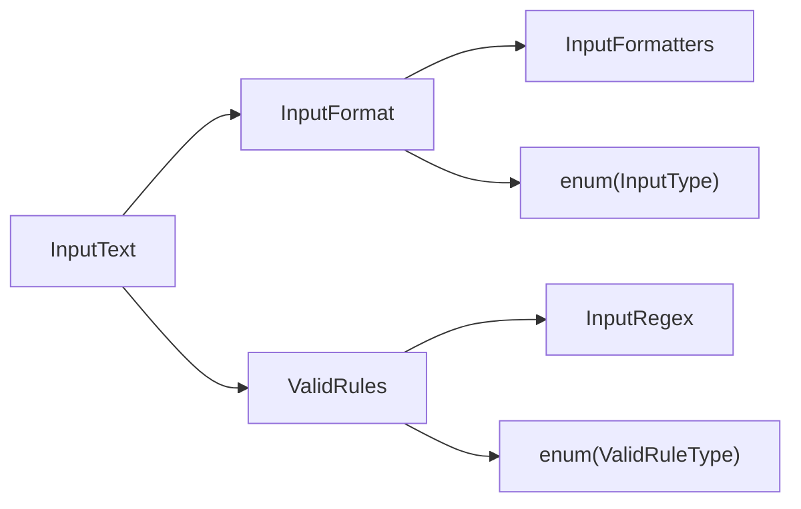

# 工具类

<cite>
**本文引用的文件**   
- [lite_ui.dart](file://lib/lite_ui.dart)
- [input_regex.dart](file://lib/src/utils/input_regex.dart)
- [valid_rules.dart](file://lib/src/input_text/utils/valid_rules.dart)
- [input_format.dart](file://lib/src/input_text/utils/input_format.dart)
- [enum.dart](file://lib/src/input_text/models/enum.dart)
- [input_text.dart](file://lib/src/input_text/input_text.dart)
- [component_demo.dart](file://example/lib/pages/component_demo.dart)
</cite>

## 目录
1. [简介](#简介)
2. [项目结构](#项目结构)
3. [核心组件](#核心组件)
4. [架构总览](#架构总览)
5. [详细组件分析](#详细组件分析)
6. [依赖分析](#依赖分析)
7. [性能考虑](#性能考虑)
8. [故障排查指南](#故障排查指南)
9. [结论](#结论)
10. [附录：API 参考与示例](#附录api-参考与示例)

## 简介
本章节面向 Lite UI 的输入校验与格式化相关工具类，系统性介绍输入验证规则、格式化器、正则表达式等实用工具的使用方法。重点覆盖：
- ValidRules 类的各类验证规则（必填、长度限制、格式校验、组合校验、枚举式快速构建）
- InputFormatters 的输入过滤与格式化能力（数字、小数、中文、英文、单字符等）
- InputRegex 的正则常量与扩展方法
- 与 InputText 组件的集成方式与数据流处理
- 扩展方法与自定义开发指南
- 性能优化建议与最佳实践

## 项目结构
Lite UI 将工具类按职责拆分到独立模块，并通过统一入口导出，便于按需引用。

图表来源
- [lite_ui.dart:1-19](file://lib/lite_ui.dart#L1-L19)
- [input_regex.dart:1-46](file://lib/src/utils/input_regex.dart#L1-L46)
- [valid_rules.dart:1-245](file://lib/src/input_text/utils/valid_rules.dart#L1-L245)
- [input_format.dart:1-88](file://lib/src/input_text/utils/input_format.dart#L1-L88)
- [enum.dart:1-82](file://lib/src/input_text/models/enum.dart#L1-L82)
- [input_text.dart:1-365](file://lib/src/input_text/input_text.dart#L1-L365)
- [component_demo.dart:1-200](file://example/lib/pages/component_demo.dart#L1-L200)

章节来源
- [lite_ui.dart:1-19](file://lib/lite_ui.dart#L1-L19)

## 核心组件
本节对三大核心工具进行概览说明：
- InputRegex：集中管理常用输入正则表达式常量，如整数、小数、手机号、邮箱、URL、身份证号、密码大写字母等。
- ValidRules：提供丰富的表单校验函数与组合能力，支持必填、长度、格式、组合校验以及基于枚举的快速构建。
- InputFormatters/InputFormat：提供 TextInputFormatter 工厂与路由，用于在输入阶段实时拦截非法字符，保证输入内容符合预期。

章节来源
- [input_regex.dart:1-46](file://lib/src/utils/input_regex.dart#L1-L46)
- [valid_rules.dart:1-245](file://lib/src/input_text/utils/valid_rules.dart#L1-L245)
- [input_format.dart:1-88](file://lib/src/input_text/utils/input_format.dart#L1-L88)

## 架构总览
InputText 组件通过 InputFormat 获取输入格式化器，结合 ValidRules 完成提交或触发时的校验。整体数据流如下：

图表来源
- [input_text.dart:196-217](file://lib/src/input_text/input_text.dart#L196-L217)
- [input_format.dart:64-88](file://lib/src/input_text/utils/input_format.dart#L64-L88)
- [valid_rules.dart:173-182](file://lib/src/input_text/utils/valid_rules.dart#L173-L182)
- [input_regex.dart:1-46](file://lib/src/utils/input_regex.dart#L1-L46)

## 详细组件分析

### InputRegex：输入正则表达式常量
- 设计要点
  - 静态常量集中管理，避免重复编译正则，提升性能。
  - 覆盖常见场景：整数、小数、中文、英文、单字符、手机号、邮箱、URL、身份证号、密码大写字母。
- 复杂度与性能
  - 正则预编译为 RegExp 实例，匹配时间复杂度近似 O(n)，n 为字符串长度。
  - 建议在高频路径复用这些常量，避免每次创建新正则。
- 扩展建议
  - 可按业务新增更多模式（如统一社会信用代码、车牌号等），保持命名清晰。

章节来源
- [input_regex.dart:1-46](file://lib/src/utils/input_regex.dart#L1-L46)

### ValidRules：输入验证规则集合
- 功能概览
  - 基础校验：required、numeric、integer、decimal、chineseName、phone、email、url、idCard。
  - 长度限制：minLength、maxLength，并提供 minLengthRule、maxLengthRule 工厂函数以便放入 validRules 列表。
  - 组合校验：compose 依次执行多个校验函数，返回第一个错误信息。
  - 枚举式构建：buildRules 根据 ValidRuleType 自动组装规则集，支持 minLen/maxLen 与 customRules。
- 数据结构与复杂度
  - 校验函数签名统一为 String? Function(String?)，compose 线性遍历，最坏情况 O(k)，k 为规则数量。
- 错误处理
  - 每个校验函数均支持自定义 message，未命中时返回 null，命中时返回错误消息。
- 使用建议
  - 优先使用 buildRules 快速配置常见场景；复杂场景用 compose 组合自定义规则。
  - 对敏感字段（如身份证）可叠加额外逻辑（例如校验码计算）。

图表来源
- [valid_rules.dart:184-243](file://lib/src/input_text/utils/valid_rules.dart#L184-L243)

章节来源
- [valid_rules.dart:1-245](file://lib/src/input_text/utils/valid_rules.dart#L1-L245)

### InputFormatters 与 InputFormat：输入格式化器
- 功能概览
  - InputFormatters：提供 integer、decimal、chinese、english、char、text 等格式化器工厂。
  - InputFormat：根据 InputType 路由到对应的格式化器列表。
- 关键实现
  - decimal 使用自定义函数限制最多一个小数点，并仅允许数字和小数点。
  - chinese/english/char 使用 FilteringTextInputFormatter.allow 配合正则白名单。
  - text 不限制，返回空列表以透传所有输入。
- 性能考量
  - 使用系统级 FilteringTextInputFormatter 与轻量正则，避免在 onChanged 中做重型计算。
- 扩展建议
  - 如需更复杂的格式化（如金额千分位、货币符号），可在 InputFormatters 中新增工厂方法。

章节来源
- [input_format.dart:1-88](file://lib/src/input_text/utils/input_format.dart#L1-L88)

### InputText 组件与工具类的集成
- 输入阶段
  - 组件内部通过 InputFormat.getFormatters(inputType) 获取格式化器，并合并用户自定义 inputFormatters。
- 校验阶段
  - defaultValid 方法负责组合校验：当 required=true 或 validRuleType!=custom 时启用校验。
  - 先根据 validRuleType 调用 ValidRules.buildRules 生成规则列表，再追加自定义 validator，最后通过 ValidRules.compose 执行。
- 数据流
  - 用户输入 -> TextInputFormatter 过滤 -> controller.text 更新 -> 触发 onChange -> 校验触发 -> 展示错误/成功。

图表来源
- [input_text.dart:196-217](file://lib/src/input_text/input_text.dart#L196-L217)
- [input_format.dart:64-88](file://lib/src/input_text/utils/input_format.dart#L64-L88)
- [valid_rules.dart:173-182](file://lib/src/input_text/utils/valid_rules.dart#L173-L182)
- [input_regex.dart:1-46](file://lib/src/utils/input_regex.dart#L1-L46)

章节来源
- [input_text.dart:1-365](file://lib/src/input_text/input_text.dart#L1-L365)

### 枚举定义：InputType 与 ValidRuleType
- InputType：控制输入阶段的字符限制（text、decimal、integer、chinese、english、char）。
- ValidRuleType：控制提交或触发校验时的格式规则（phone、email、idCard、url、numeric、decimal、integer、chineseName、password、custom）。
- 作用范围
  - InputType 影响 InputFormat 选择的格式化器。
  - ValidRuleType 影响 ValidRules.buildRules 生成的校验规则集。

章节来源
- [enum.dart:1-82](file://lib/src/input_text/models/enum.dart#L1-L82)

## 依赖分析
- 模块耦合
  - InputText 依赖 InputFormat 与 ValidRules，二者分别依赖 InputRegex 与 enum 定义。
  - 依赖方向清晰，无循环依赖。
- 外部依赖
  - Flutter 的 services.TextInputFormatter 与 FilteringTextInputFormatter 用于输入过滤。
- 可扩展性
  - 新增输入类型或校验规则只需在对应工厂或规则集合中添加方法，不影响现有代码。

图表来源
- [input_text.dart:1-365](file://lib/src/input_text/input_text.dart#L1-L365)
- [input_format.dart:1-88](file://lib/src/input_text/utils/input_format.dart#L1-L88)
- [valid_rules.dart:1-245](file://lib/src/input_text/utils/valid_rules.dart#L1-L245)
- [input_regex.dart:1-46](file://lib/src/utils/input_regex.dart#L1-L46)
- [enum.dart:1-82](file://lib/src/input_text/models/enum.dart#L1-L82)

章节来源
- [input_text.dart:1-365](file://lib/src/input_text/input_text.dart#L1-L365)

## 性能考虑
- 正则复用
  - InputRegex 中的正则均为静态常量，避免重复编译带来的开销。
- 输入过滤
  - 使用系统级 FilteringTextInputFormatter 在输入阶段拦截非法字符，减少后续校验压力。
- 校验策略
  - 仅在必要时启用校验（required=true 或 validRuleType!=custom），避免不必要的计算。
- 组合校验
  - compose 短路返回首个错误，降低多余校验成本。
- 渲染与状态
  - InputText 内部维护 controller 与 FocusNode，注意生命周期管理，避免内存泄漏。

[本节为通用指导，不直接分析具体文件]

## 故障排查指南
- 常见问题
  - 输入被意外拦截：检查 inputType 与 inputFormatters 是否正确配置。
  - 校验未生效：确认 required 或 validRuleType 是否满足启用条件；检查 validRules 是否为空。
  - 错误提示不显示：确保 FormField 的 autoValidateMode 或手动 validate 已触发。
- 定位步骤
  - 打印 controller.text 确认实际值。
  - 逐步注释规则，定位具体失败的校验函数。
  - 检查正则是否与预期一致（尤其是邮箱、URL、身份证等复杂模式）。

章节来源
- [input_text.dart:196-217](file://lib/src/input_text/input_text.dart#L196-L217)
- [valid_rules.dart:173-182](file://lib/src/input_text/utils/valid_rules.dart#L173-L182)

## 结论
Lite UI 的工具类围绕“输入阶段过滤 + 提交阶段校验”的双层保障机制，提供了稳定、可扩展且易用的输入处理能力。通过 InputRegex、ValidRules、InputFormatters/InputFormat 的协同工作，开发者可以高效地实现各种输入场景，并在需要时灵活扩展自定义规则与格式化逻辑。

[本节为总结性内容，不直接分析具体文件]

## 附录：API 参考与示例

### API 参考速览
- InputRegex（正则常量）
  - 整数、小数（输入/有效）、中文、非中文、标识符、英文、单字符、手机号、邮箱、URL、身份证号、密码大写字母。
- ValidRules（校验函数）
  - required、phone、idCard、email、url、minLength、maxLength、numeric、integer、decimal、chineseName、compose、buildRules。
- InputFormatters（格式化器工厂）
  - integer、decimal、chinese、english、char、text。
- InputFormat（路由）
  - getFormatters(InputType) 返回对应 TextInputFormatter 列表。

章节来源
- [input_regex.dart:1-46](file://lib/src/utils/input_regex.dart#L1-L46)
- [valid_rules.dart:1-245](file://lib/src/input_text/utils/valid_rules.dart#L1-L245)
- [input_format.dart:1-88](file://lib/src/input_text/utils/input_format.dart#L1-L88)

### 使用示例（来自演示页面）
- 仅必填：设置 required=true，formLabel 指定标签名。
- 必填+数字：validRuleType=ValidRuleType.numeric，inputType=InputType.integer。
- 必填+密码：validRuleType=ValidRuleType.password，password=true。
- 只能输入小数：validRuleType=ValidRuleType.decimal，inputType=InputType.decimal。
- 只能输入中文：validRuleType=ValidRuleType.chineseName，inputType=InputType.chinese。
- 只能输入英文：inputType=InputType.english。
- 单字符验证码：inputType=InputType.char，minLen=maxLen=6。
- 手机号：validRuleType=ValidRuleType.phone，inputType=InputType.integer，keyboardType= TextInputType.phone。
- 邮箱：validRuleType=ValidRuleType.email，inputType=InputType.text，keyboardType= TextInputType.emailAddress。

章节来源
- [component_demo.dart:188-285](file://example/lib/pages/component_demo.dart#L188-L285)

### 扩展与自定义开发指南
- 新增输入类型
  - 在 InputType 中添加枚举项，并在 InputFormatters 中实现对应工厂方法，同时在 InputFormat.getFormatters 中路由。
- 新增校验规则
  - 在 ValidRules 中新增校验函数，并在 buildRules 中增加对应分支；或使用 compose 组合自定义规则。
- 自定义格式化器
  - 在 InputFormatters 中新增工厂方法，返回包含自定义 TextInputFormatter.withFunction 的列表。
- 最佳实践
  - 尽量复用 InputRegex 中的正则常量。
  - 将复杂校验拆分为多个小函数，便于测试与维护。
  - 对用户反馈友好的错误提示，结合 formLabel 动态生成。

章节来源
- [input_format.dart:1-88](file://lib/src/input_text/utils/input_format.dart#L1-L88)
- [valid_rules.dart:173-243](file://lib/src/input_text/utils/valid_rules.dart#L173-L243)
- [enum.dart:1-82](file://lib/src/input_text/models/enum.dart#L1-L82)