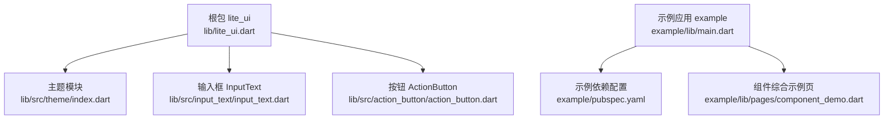
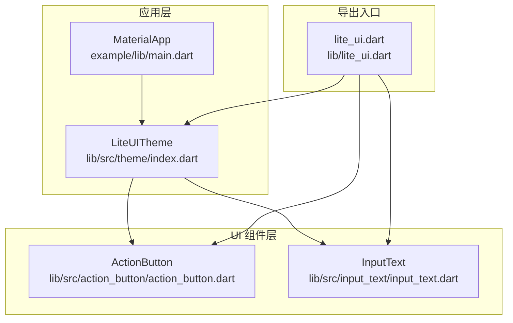
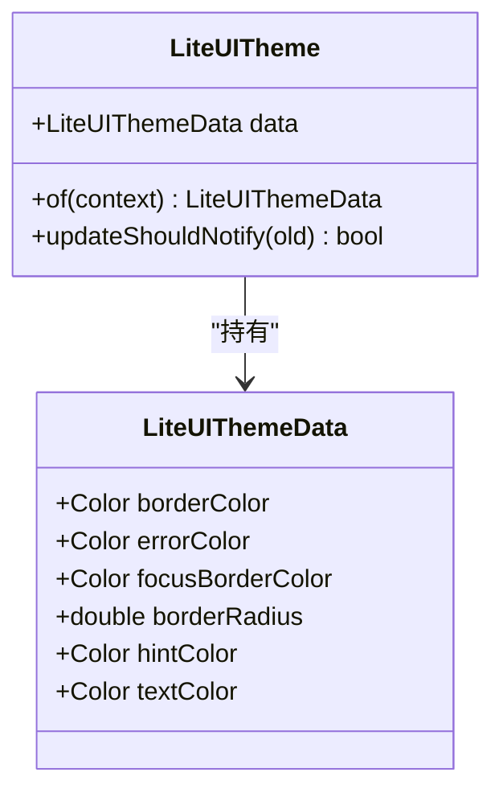
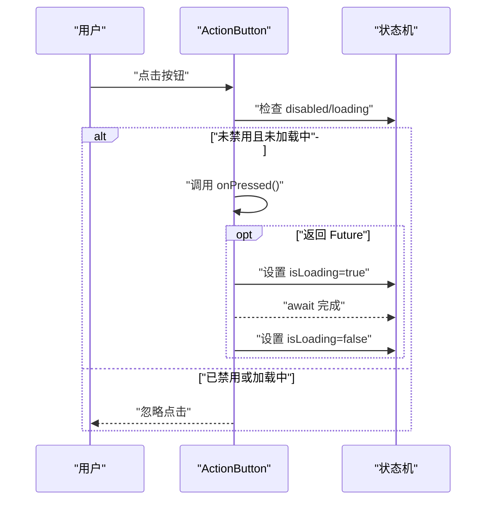
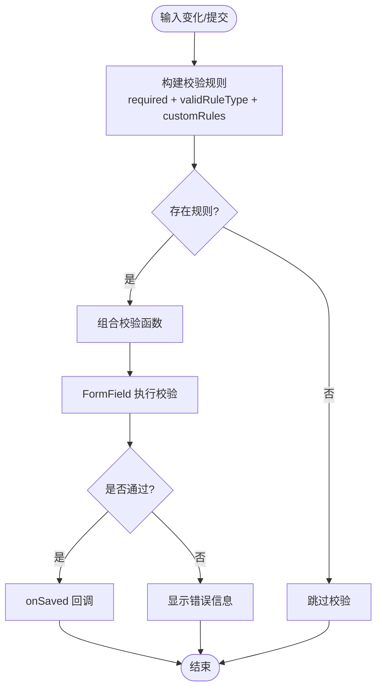
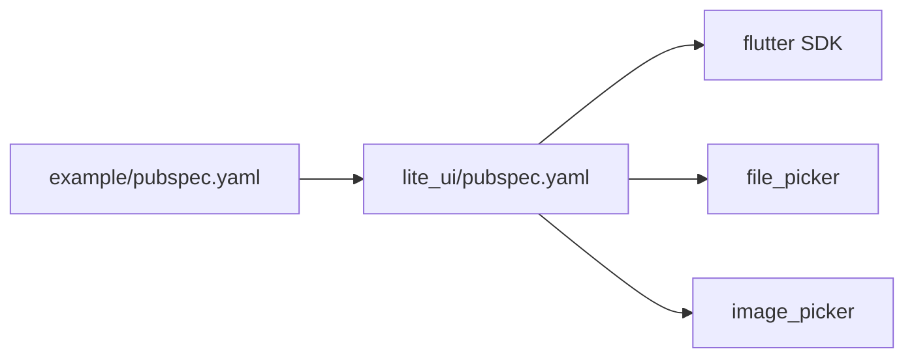

# 快速开始

<cite>
**本文引用的文件**   
- [pubspec.yaml](file://pubspec.yaml)
- [README.md](file://README.md)
- [lite_ui.dart](file://lib/lite_ui.dart)
- [theme/index.dart](file://lib/src/theme/index.dart)
- [action_button/action_button.dart](file://lib/src/action_button/action_button.dart)
- [input_text/input_text.dart](file://lib/src/input_text/input_text.dart)
- [example/pubspec.yaml](file://example/pubspec.yaml)
- [example/lib/main.dart](file://example/lib/main.dart)
- [example/lib/pages/component_demo.dart](file://example/lib/pages/component_demo.dart)
</cite>

## 目录
1. [简介](#简介)
2. [项目结构](#项目结构)
3. [核心组件](#核心组件)
4. [架构总览](#架构总览)
5. [详细组件分析](#详细组件分析)
6. [依赖关系分析](#依赖关系分析)
7. [性能注意事项](#性能注意事项)
8. [故障排除指南](#故障排除指南)
9. [结论](#结论)
10. [附录：5分钟上手示例](#附录5分钟上手示例)

## 简介
Lite UI 是一个轻量级 Flutter UI 组件库，提供开箱即用的弹窗、按钮、表单控件与文件上传等常用能力。本快速开始指南将帮助你在 5 分钟内完成安装、主题初始化，并运行一个包含按钮与输入框的最小示例。

## 项目结构
仓库采用“包 + 示例”的组织方式：
- 根目录为 lite_ui 包，导出统一入口与主题、模型、工具类。
- example 目录为演示应用，展示各组件用法与页面导航。

图表来源
- [lite_ui.dart:1-19](file://lib/lite_ui.dart#L1-L19)
- [theme/index.dart:1-73](file://lib/src/theme/index.dart#L1-L73)
- [action_button/action_button.dart:1-208](file://lib/src/action_button/action_button.dart#L1-L208)
- [input_text/input_text.dart:1-365](file://lib/src/input_text/input_text.dart#L1-L365)
- [example/lib/main.dart:1-80](file://example/lib/main.dart#L1-L80)
- [example/pubspec.yaml:1-24](file://example/pubspec.yaml#L1-L24)

章节来源
- [pubspec.yaml:1-21](file://pubspec.yaml#L1-L21)
- [README.md:1-126](file://README.md#L1-L126)
- [lite_ui.dart:1-19](file://lib/lite_ui.dart#L1-L19)
- [example/pubspec.yaml:1-24](file://example/pubspec.yaml#L1-L24)
- [example/lib/main.dart:1-80](file://example/lib/main.dart#L1-L80)

## 核心组件
- 按钮 ActionButton：支持多种类型（凸起、描边、文字、填充、色调、图标），内置异步加载态与禁用态处理。
- 输入框 InputText：基于 TextFormField 封装，支持必填、格式校验、密码模式、前后缀图标、浮动标签与主题色。
- 主题 LiteUITheme：通过 InheritedWidget 提供全局默认颜色、圆角、提示/错误色等，便于统一风格。

章节来源
- [action_button/action_button.dart:1-208](file://lib/src/action_button/action_button.dart#L1-L208)
- [input_text/input_text.dart:1-365](file://lib/src/input_text/input_text.dart#L1-L365)
- [theme/index.dart:1-73](file://lib/src/theme/index.dart#L1-L73)

## 架构总览
Lite UI 以单一入口导出所有公共 API，并通过主题 InheritedWidget 向子树传递样式数据。示例应用通过 MaterialApp 包裹业务页面，并在需要时由 LiteUITheme 覆盖默认主题。

图表来源
- [lite_ui.dart:1-19](file://lib/lite_ui.dart#L1-L19)
- [theme/index.dart:1-73](file://lib/src/theme/index.dart#L1-L73)
- [action_button/action_button.dart:1-208](file://lib/src/action_button/action_button.dart#L1-L208)
- [input_text/input_text.dart:1-365](file://lib/src/input_text/input_text.dart#L1-L365)
- [example/lib/main.dart:1-80](file://example/lib/main.dart#L1-L80)

## 详细组件分析

### 主题 LiteUITheme
- 作用：集中管理边框色、错误色、聚焦边框色、圆角、提示/文字色等默认值。
- 使用：在应用根节点用 LiteUITheme 包裹，传入 LiteUIThemeData；子组件通过静态方法获取主题数据。
- 更新策略：InheritedWidget 的 updateShouldNotify 比较 data 引用变化，避免不必要的重建。

图表来源
- [theme/index.dart:1-73](file://lib/src/theme/index.dart#L1-L73)

章节来源
- [theme/index.dart:1-73](file://lib/src/theme/index.dart#L1-L73)

### 按钮 ActionButton
- 特性：
  - 多类型按钮：elevated/outlined/text/filled/toned/icon。
  - 自动识别同步/异步回调：异步时显示 loading，期间禁止重复点击。
  - 可自定义高度、图标、样式与加载指示器。
- 交互流程：点击触发 onPressed，若返回 Future，则进入加载态，完成后恢复。

图表来源
- [action_button/action_button.dart:1-208](file://lib/src/action_button/action_button.dart#L1-L208)

章节来源
- [action_button/action_button.dart:1-208](file://lib/src/action_button/action_button.dart#L1-L208)

### 输入框 InputText
- 特性：
  - 表单集成：FormField 包装，支持 onSaved、validator、autoValidate。
  - 输入限制：InputType 控制键盘与输入格式化器。
  - 校验规则：ValidRuleType 快速选择常见规则，支持自定义规则列表。
  - 视觉：浮动标签、前后缀图标、密码切换、错误/聚焦边框色。
- 校验流程：根据 required、validRuleType、custom rules 组合生成校验函数，最终交由 FormField 执行。

图表来源
- [input_text/input_text.dart:1-365](file://lib/src/input_text/input_text.dart#L1-L365)

章节来源
- [input_text/input_text.dart:1-365](file://lib/src/input_text/input_text.dart#L1-L365)

## 依赖关系分析
- 包依赖：lite_ui 依赖 flutter SDK，以及 file_picker、image_picker 用于文件与图片选择。
- 示例依赖：example 通过 path 引用本地 lite_ui 包进行开发调试。

图表来源
- [pubspec.yaml:1-21](file://pubspec.yaml#L1-L21)
- [example/pubspec.yaml:1-24](file://example/pubspec.yaml#L1-L24)

章节来源
- [pubspec.yaml:1-21](file://pubspec.yaml#L1-L21)
- [example/pubspec.yaml:1-24](file://example/pubspec.yaml#L1-L24)

## 性能注意事项
- 按钮加载态：ActionButton 在异步回调期间锁定点击，避免重复请求导致的状态抖动。
- 输入框校验：InputText 将校验规则组合后一次性执行，减少多次重建；仅在必要时启用 autoValidate。
- 主题更新：LiteUITheme 的 updateShouldNotify 仅当 data 引用变化时通知，降低子树重建频率。

[本节为通用指导，不直接分析具体文件]

## 故障排除指南
常见问题与解决思路：
- 无法解析 lite_ui 包
  - 确认 pubspec.yaml 中 dependencies 已添加 lite_ui，并执行依赖拉取。
  - 示例工程需确保 example/pubspec.yaml 正确引用本地路径。
- 主题未生效
  - 确认在应用根节点使用 LiteUITheme 包裹，并确保 child 包含需要主题的组件。
- 输入框校验无效
  - 检查 required、validRuleType、customRules 是否正确设置；如需实时校验，调整 autoValidate。
- 按钮点击无响应
  - 检查 disabled 与 loading 状态；异步回调需返回 Future 才会进入加载态。

章节来源
- [pubspec.yaml:1-21](file://pubspec.yaml#L1-L21)
- [example/pubspec.yaml:1-24](file://example/pubspec.yaml#L1-L24)
- [theme/index.dart:1-73](file://lib/src/theme/index.dart#L1-L73)
- [input_text/input_text.dart:1-365](file://lib/src/input_text/input_text.dart#L1-L365)
- [action_button/action_button.dart:1-208](file://lib/src/action_button/action_button.dart#L1-L208)

## 结论
通过本指南，你已完成 Lite UI 的安装、主题初始化与基础组件使用。建议继续探索 README 中的组件清单与示例页面，按需扩展更多功能。

[本节为总结性内容，不直接分析具体文件]

## 附录：5分钟上手示例
- 安装步骤
  - 在项目的 pubspec.yaml 中添加 lite_ui 依赖，并拉取依赖。
  - 示例工程可通过 path 引用本地包进行开发。
- 主题初始化
  - 在应用根节点使用 LiteUITheme 包裹，传入 LiteUIThemeData 自定义颜色与圆角。
- 引入与命名空间
  - 通过统一入口导入 lite_ui，即可使用按钮、输入框、主题等公共 API。
- 最小示例
  - 在页面中使用 ActionButton 与 InputText，观察点击与输入效果。
  - 参考示例应用的 main.dart 与 component_demo.dart 了解完整用法。

章节来源
- [pubspec.yaml:1-21](file://pubspec.yaml#L1-L21)
- [example/pubspec.yaml:1-24](file://example/pubspec.yaml#L1-L24)
- [lite_ui.dart:1-19](file://lib/lite_ui.dart#L1-L19)
- [theme/index.dart:1-73](file://lib/src/theme/index.dart#L1-L73)
- [example/lib/main.dart:1-80](file://example/lib/main.dart#L1-L80)
- [example/lib/pages/component_demo.dart:1-422](file://example/lib/pages/component_demo.dart#L1-L422)