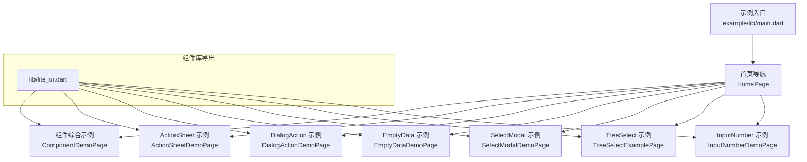
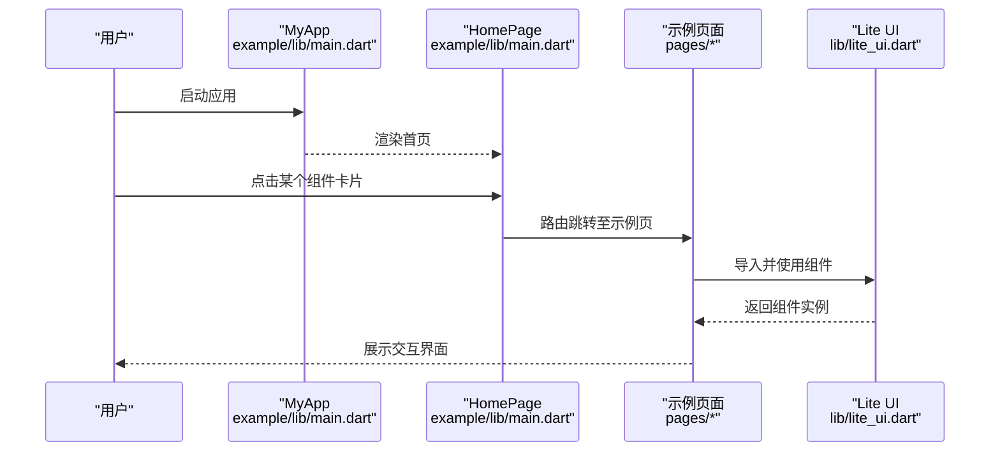
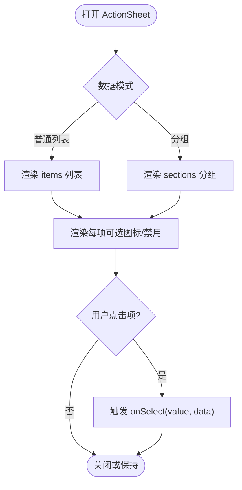
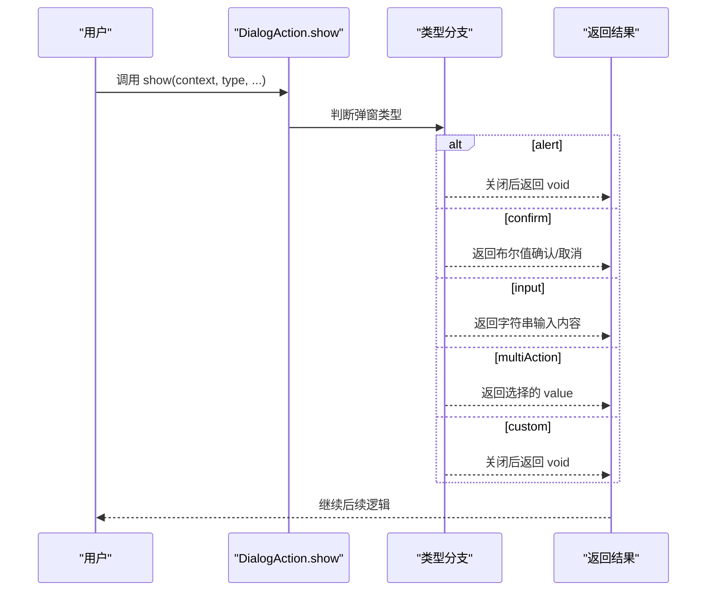
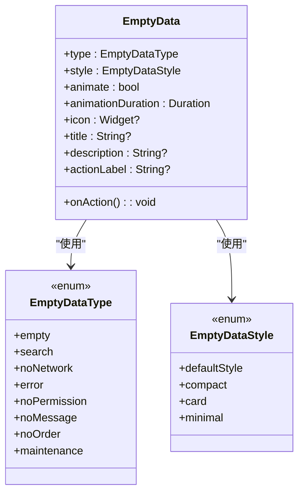
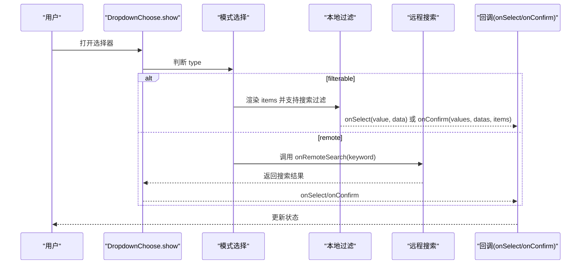
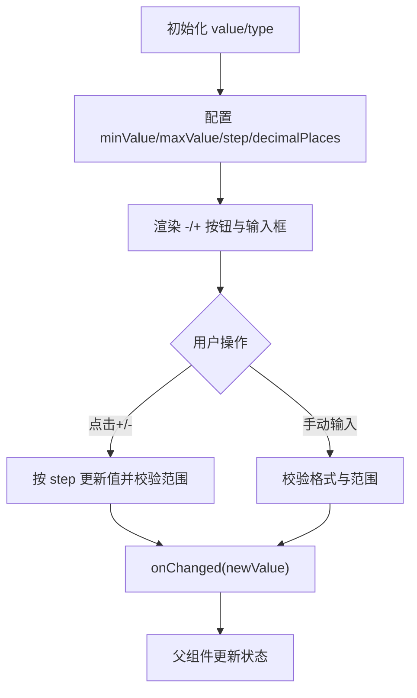
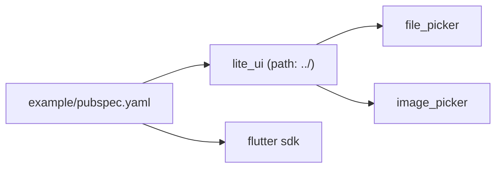

# 示例演示

<cite>
**本文引用的文件**   
- [README.md](file://README.md)
- [pubspec.yaml](file://pubspec.yaml)
- [example/README.md](file://example/README.md)
- [example/pubspec.yaml](file://example/pubspec.yaml)
- [lib/lite_ui.dart](file://lib/lite_ui.dart)
- [example/lib/main.dart](file://example/lib/main.dart)
- [example/lib/pages/component_demo.dart](file://example/lib/pages/component_demo.dart)
- [example/lib/pages/action_sheet_demo.dart](file://example/lib/pages/action_sheet_demo.dart)
- [example/lib/pages/dialog_action_demo.dart](file://example/lib/pages/dialog_action_demo.dart)
- [example/lib/pages/empty_data_demo.dart](file://example/lib/pages/empty_data_demo.dart)
- [example/lib/pages/select_modal_demo.dart](file://example/lib/pages/select_modal_demo.dart)
- [example/lib/pages/tree_select_example.dart](file://example/lib/pages/tree_select_example.dart)
- [example/lib/pages/input_number_demo.dart](file://example/lib/pages/input_number_demo.dart)
</cite>

## 目录
1. [简介](#简介)
2. [项目结构](#项目结构)
3. [核心组件](#核心组件)
4. [架构总览](#架构总览)
5. [详细组件分析](#详细组件分析)
6. [依赖分析](#依赖分析)
7. [性能考虑](#性能考虑)
8. [故障排查指南](#故障排查指南)
9. [结论](#结论)
10. [附录](#附录)

## 简介
本文件为 Lite UI 组件库的示例演示文档，面向开发者与产品同学，系统说明示例应用的结构、组织方式与各页面示例的功能与实现。文档覆盖每个组件的基本用法、高级配置、自定义样式与组合模式，并提供交互式演示路径与代码片段位置，便于直接复制使用。同时给出运行环境、启动方法、扩展建议与最佳实践，帮助快速上手并高效集成。

## 项目结构
示例工程采用 Flutter 标准结构，入口在 example/lib/main.dart，首页以卡片导航聚合各组件示例页；组件库源码位于 lib/src 下，按功能模块划分（如 action_button、action_sheet、dialog_action、dropdown_choose、empty_data、file_upload、input_number、input_text、tree_select 等），并通过 lib/lite_ui.dart 统一导出。

图表来源
- [example/lib/main.dart:1-80](file://example/lib/main.dart#L1-L80)
- [lib/lite_ui.dart:1-19](file://lib/lite_ui.dart#L1-L19)

章节来源
- [example/lib/main.dart:1-80](file://example/lib/main.dart#L1-L80)
- [lib/lite_ui.dart:1-19](file://lib/lite_ui.dart#L1-L19)

## 核心组件
Lite UI 提供开箱即用的常用 UI 能力，包括操作按钮、底部面板、居中弹窗、空状态占位、文件上传、文本输入、数字步进器、选择器与树形选择器等。组件高度可配置，支持泛型适配业务数据，默认样式内联，主题与 Material 3 兼容。

- ActionButton：操作按钮，支持多种风格（凸起、描边、文字、填充、色调、图标）。
- ActionSheet：底部操作面板，支持普通列表与分组展示，含标题、描述、滚动项与取消按钮。
- DialogAction：居中弹窗，支持提示、确认、输入、多操作与自定义内容。
- EmptyData：空状态占位，支持多种场景类型与布局风格，可自定义图标、文案与操作。
- FileUpload：文件上传，支持多种选择方式、单选/多选、数量限制、预览、进度与头像裁剪。
- InputText：文本输入框，支持标签、密码模式、校验规则与样式定制。
- InputNumber：数字步进器，支持整数/小数、范围与步长、长按增减。
- SelectModal：底部选择器，支持本地过滤与远程搜索，单选/多选，泛型设计。
- TreeSelect：树形选择器，支持搜索、单选/多选、懒加载与便捷调用。

章节来源
- [README.md:1-126](file://README.md#L1-L126)

## 架构总览
示例应用通过 MaterialApp 初始化主题与首页，首页以 Scaffold + Card + ListTile 构建导航卡片，点击后路由到对应示例页。组件库通过 lite_ui.dart 集中导出，示例页按需引入并使用。

图表来源
- [example/lib/main.dart:1-80](file://example/lib/main.dart#L1-L80)
- [lib/lite_ui.dart:1-19](file://lib/lite_ui.dart#L1-L19)

## 详细组件分析

### ActionSheet（底部操作面板）
- 功能要点：支持普通列表与分组展示，可带图标、禁用状态与禁用角标。
- 使用方式：通过静态 show 方法弹出，传入 title、description、items/sections 与 onSelect 回调。
- 示例页：演示了默认菜单、分组显示、图标支持、禁用状态与组合功能。

图表来源
- [example/lib/pages/action_sheet_demo.dart:1-243](file://example/lib/pages/action_sheet_demo.dart#L1-L243)

章节来源
- [example/lib/pages/action_sheet_demo.dart:1-243](file://example/lib/pages/action_sheet_demo.dart#L1-L243)

### DialogAction（居中弹窗）
- 功能要点：支持 alert、confirm、input、multiAction、custom 五种类型，可覆盖默认文案、样式与图标。
- 使用方式：通过静态 show 方法弹出，根据 type 传入不同参数，返回结果由 await 获取。
- 示例页：演示了默认与自定义覆盖、多操作、自定义内容与图标。

图表来源
- [example/lib/pages/dialog_action_demo.dart:1-206](file://example/lib/pages/dialog_action_demo.dart#L1-L206)

章节来源
- [example/lib/pages/dialog_action_demo.dart:1-206](file://example/lib/pages/dialog_action_demo.dart#L1-L206)

### EmptyData（空状态占位）
- 功能要点：支持 8 种场景类型与 4 种布局风格，可自定义图标、标题、描述、操作按钮与动画。
- 使用方式：直接作为 Widget 使用，设置 type/style/animate 等属性，配合 onAction 处理交互。
- 示例页：演示了类型切换、风格预览、动画控制、带操作按钮与实际使用模拟。

图表来源
- [example/lib/pages/empty_data_demo.dart:1-390](file://example/lib/pages/empty_data_demo.dart#L1-L390)

章节来源
- [example/lib/pages/empty_data_demo.dart:1-390](file://example/lib/pages/empty_data_demo.dart#L1-L390)

### SelectModal（选择器）
- 功能要点：支持 filterable（本地过滤）与 remote（远程搜索）两种模式，单选/多选，支持初始值与禁用项。
- 使用方式：通过 DropdownChoose.show 弹出，传入 type/items/onRemoteSearch/multiple 等参数。
- 示例页：演示了本地过滤单选/多选、带初始选中、图标与禁用、远程搜索单选/多选与初始数据。

图表来源
- [example/lib/pages/select_modal_demo.dart:1-329](file://example/lib/pages/select_modal_demo.dart#L1-L329)

章节来源
- [example/lib/pages/select_modal_demo.dart:1-329](file://example/lib/pages/select_modal_demo.dart#L1-L329)

### TreeSelect（树形选择器）
- 功能要点：支持单选/多选、父节点可选/不可选、懒加载子节点、内置搜索过滤。
- 使用方式：通过 TreeSelectHelper.show/showMultiple 弹出，传入 treeData/title/parentSelectable/selectedId(s)/onLoadChildren。
- 示例页：演示了父子节点选择策略、懒加载地区树、单选/多选与结果展示。

图表来源
- [example/lib/pages/tree_select_example.dart:1-351](file://example/lib/pages/tree_select_example.dart#L1-L351)

章节来源
- [example/lib/pages/tree_select_example.dart:1-351](file://example/lib/pages/tree_select_example.dart#L1-L351)

### InputNumber（数字步进器）
- 功能要点：支持整数/小数、最小/最大值、步长、禁用状态与尺寸定制。
- 使用方式：作为表单控件使用，绑定 value 与 onChanged，设置 type/minValue/maxValue/step 等。
- 示例页：演示了基础用法、范围限制、步长、禁用、尺寸与购物车场景。

图表来源
- [example/lib/pages/input_number_demo.dart:1-140](file://example/lib/pages/input_number_demo.dart#L1-L140)

章节来源
- [example/lib/pages/input_number_demo.dart:1-140](file://example/lib/pages/input_number_demo.dart#L1-L140)

### ComponentDemo（综合示例）
- 功能要点：在一个页面中集中演示 InputText 校验规则、选择型组件（ActionSheet/DropdownChoose）与表单提交。
- 使用方式：Form 包裹多个 InputText，结合 DropdownChoose 的 selectedValues/selectedItems 与 onSaved/onSelect/onConfirm。
- 示例页：展示了必填、数字、密码、手机号、邮箱、中文/英文、单字符验证码等多种输入类型与选择模式。

章节来源
- [example/lib/pages/component_demo.dart:1-422](file://example/lib/pages/component_demo.dart#L1-L422)

## 依赖分析
示例工程通过 pubspec.yaml 引用 lite_ui 包（path 指向根目录），并启用 Material Design。组件库依赖 file_picker 与 image_picker 提供文件与图片选择能力。

图表来源
- [example/pubspec.yaml:1-24](file://example/pubspec.yaml#L1-L24)
- [pubspec.yaml:1-21](file://pubspec.yaml#L1-L21)

章节来源
- [example/pubspec.yaml:1-24](file://example/pubspec.yaml#L1-L24)
- [pubspec.yaml:1-21](file://pubspec.yaml#L1-L21)

## 性能考虑
- 选择器大数据量：优先使用 SelectModal 的 remote 模式，避免一次性渲染大量节点；合理设置防抖与分页。
- 树形选择器懒加载：仅在展开时加载子节点，减少首屏渲染压力。
- 空状态与动画：EmptyData 的入场动画可按需关闭或在低端设备上降低时长。
- 表单校验：InputText 的校验规则尽量前置，避免频繁重绘。
- 文件上传：FileUpload 的预览与压缩应在后台线程进行，避免阻塞 UI。

## 故障排查指南
- 无法导入 lite_ui：检查 example/pubspec.yaml 中 path 是否正确指向根目录，并确保 flutter pub get 成功。
- 选择器无数据：remote 模式下确认 onRemoteSearch 返回有效列表；filterable 模式下确保 items 非空。
- 树形选择器不展开：确认 onLoadChildren 正确返回子节点，且 isLeaf 标记准确。
- 弹窗不关闭：custom 类型需自行管理 Navigator.pop；其他类型应等待返回值或回调触发。
- 输入校验失败：检查 validRuleType 与 inputType 是否匹配，必要时添加自定义校验。

## 结论
Lite UI 示例工程提供了清晰、完整的组件使用范式与交互演示，覆盖常见业务场景。通过模块化结构与统一导出，开发者可以快速定位与复用组件。遵循本文档的最佳实践与性能建议，可在实际项目中高效落地。

## 附录

### 运行环境与启动方法
- 环境要求：Flutter SDK >= 1.17.0，Dart SDK ^3.12.2。
- 安装依赖：进入 example 目录执行 flutter pub get。
- 启动应用：连接设备或模拟器后执行 flutter run。
- 平台支持：Android、iOS、Web、Linux、macOS、Windows（示例工程包含各平台脚手架）。

章节来源
- [example/README.md:1-18](file://example/README.md#L1-L18)
- [pubspec.yaml:1-21](file://pubspec.yaml#L1-L21)

### 自定义示例开发指南与扩展建议
- 新增组件示例：在 example/lib/pages 下创建新页面，并在 example/lib/main.dart 的 HomePage 中添加导航卡片。
- 复用 mock 数据：将示例数据放入 example/mock 目录，供多个页面共享。
- 主题与样式：通过 ThemeData 全局配置颜色与字体，组件默认样式与主题联动。
- 扩展组件能力：在 lib/src 下新增模块，并在 lib/lite_ui.dart 中统一导出，确保示例页能正常引用。

章节来源
- [example/lib/main.dart:1-80](file://example/lib/main.dart#L1-L80)
- [lib/lite_ui.dart:1-19](file://lib/lite_ui.dart#L1-L19)

### 常见使用场景的最佳实践
- 表单场景：使用 Form + GlobalKey<FormState> 统一管理校验与保存；对敏感字段开启密码模式与掩码。
- 选择场景：大数据量用 remote 模式；需要初始值时传入 selectedValues/selectedItems；禁用项明确标注 disabledLabel。
- 树形场景：层级较深时使用懒加载；父节点可选时注意联动逻辑与去重。
- 空状态：根据业务语义选择合适的 EmptyDataType 与风格；提供明确的 onAction 引导用户下一步操作。
- 文件上传：限制类型与大小，提供预览与删除；头像模式启用自动裁剪。