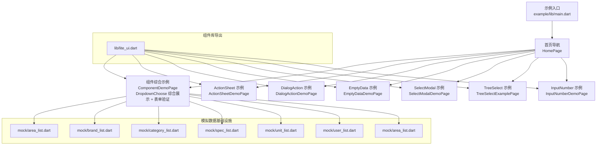
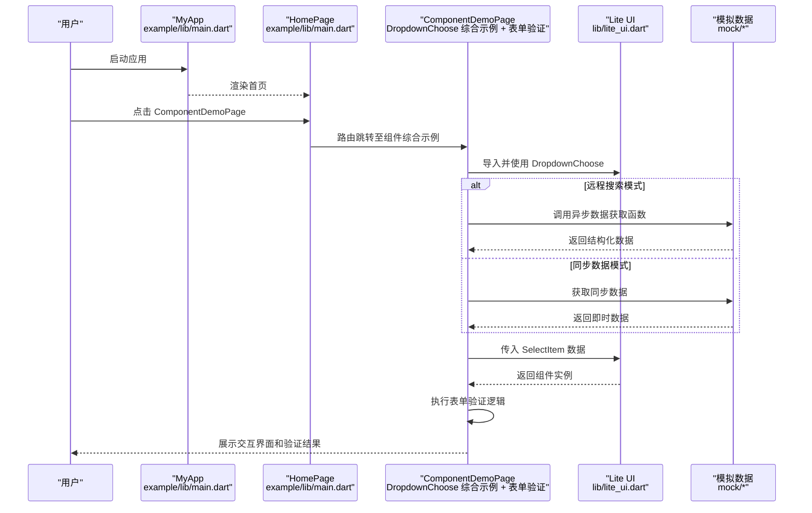
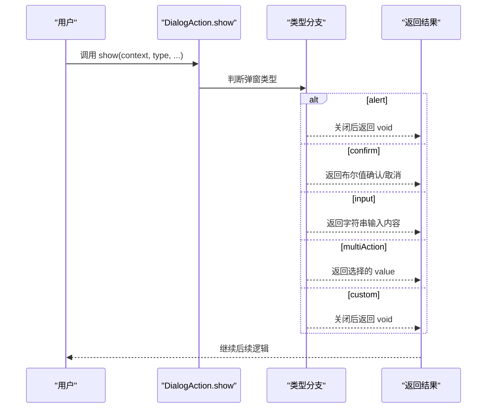
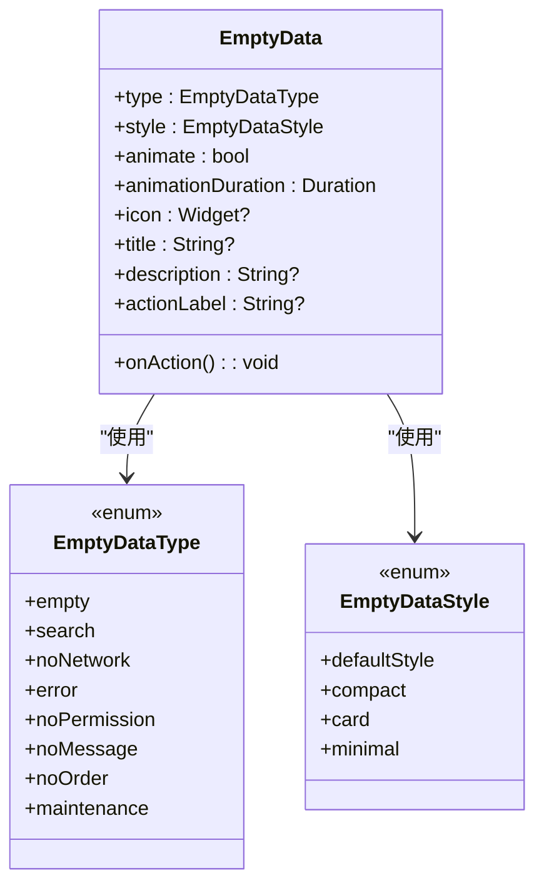
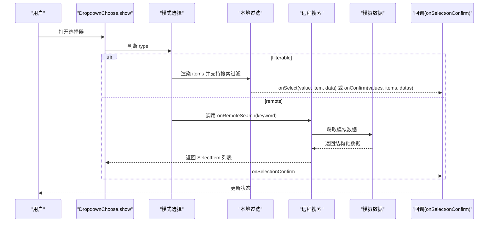
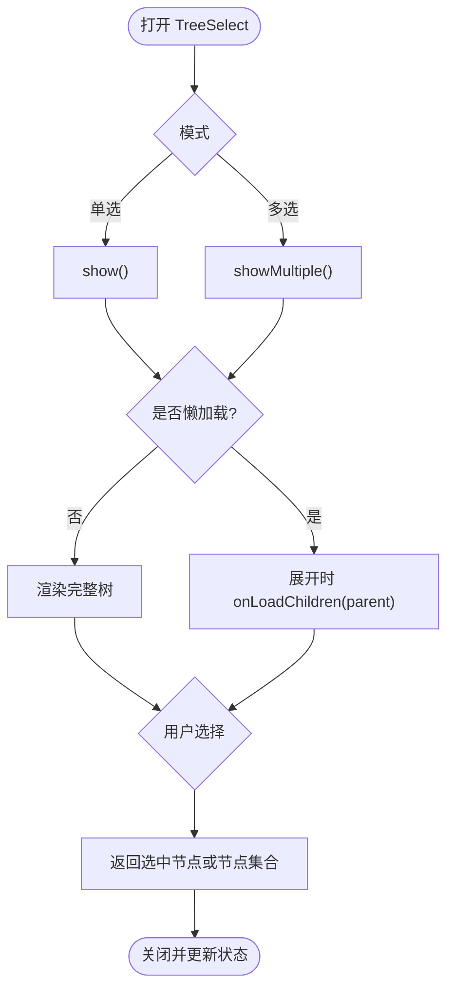
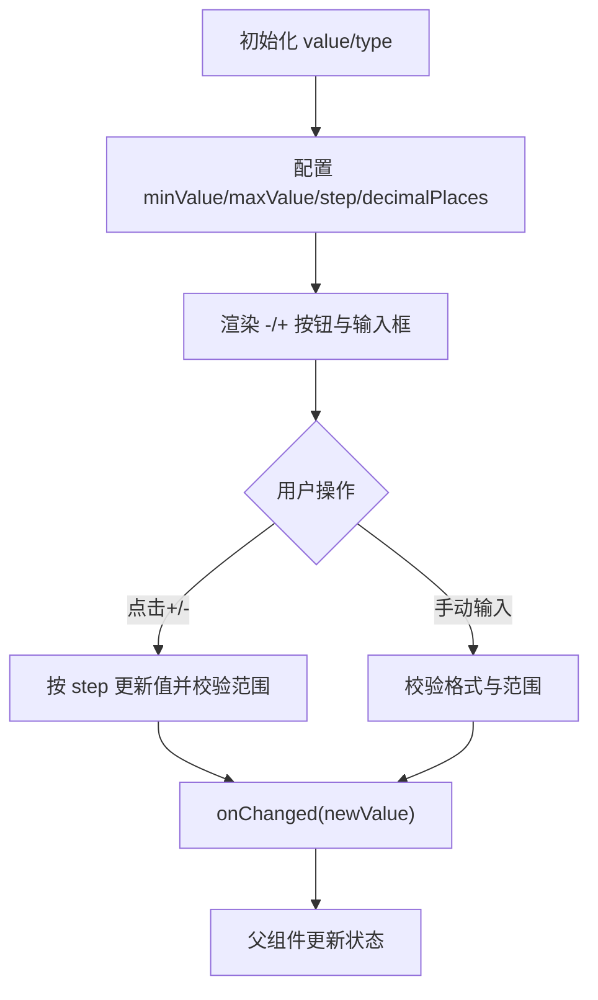
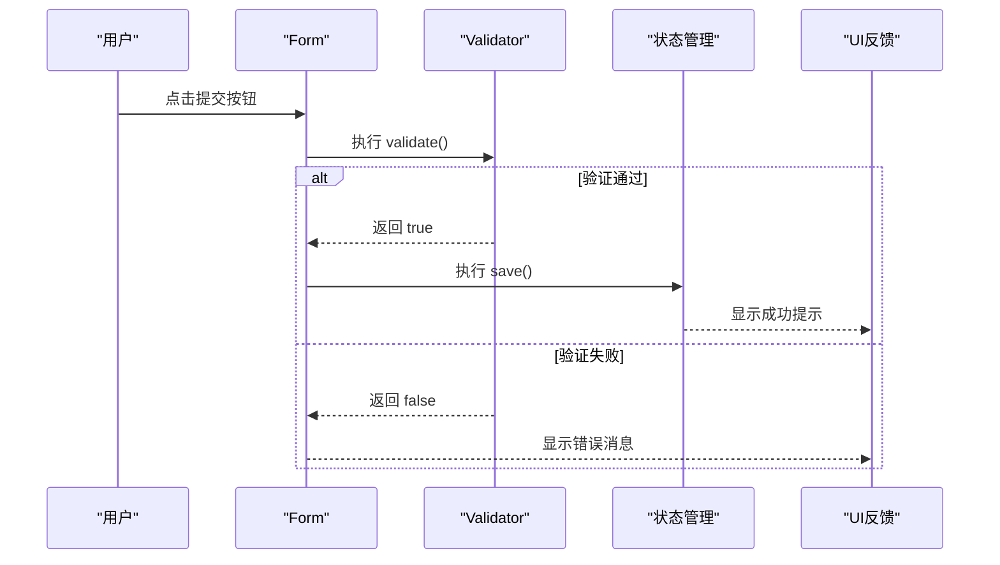
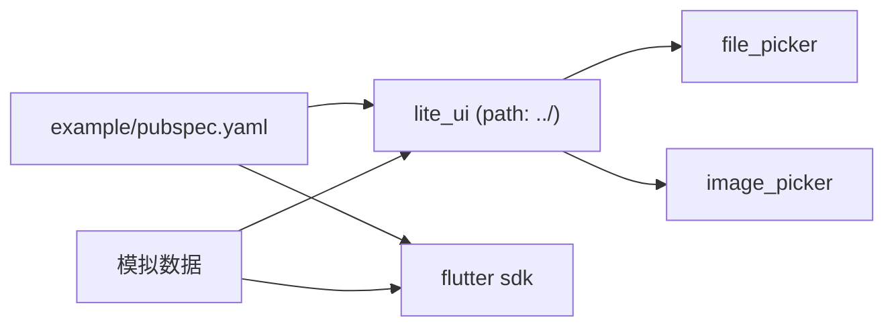

# 示例演示

<cite>
**本文引用的文件**   
- [README.md](file://README.md)
- [pubspec.yaml](file://pubspec.yaml)
- [example/README.md](file://example/README.md)
- [example/pubspec.yaml](file://example/pubspec.yaml)
- [lib/lite_ui.dart](file://lib/lite_ui.dart)
- [example/lib/main.dart](file://example/lib/main.dart)
- [example/lib/pages/component_demo.dart](file://example/lib/pages/component_demo.dart)
- [example/lib/pages/component_demo_copy.dart](file://example/lib/pages/component_demo_copy.dart)
- [example/lib/pages/back.dart](file://example/lib/pages/back.dart)
- [example/lib/pages/action_sheet_demo.dart](file://example/lib/pages/action_sheet_demo.dart)
- [example/lib/pages/dialog_action_demo.dart](file://example/lib/pages/dialog_action_demo.dart)
- [example/lib/pages/empty_data_demo.dart](file://example/lib/pages/empty_data_demo.dart)
- [example/lib/pages/select_modal_demo.dart](file://example/lib/pages/select_modal_demo.dart)
- [example/lib/pages/tree_select_example.dart](file://example/lib/pages/tree_select_example.dart)
- [example/lib/pages/input_number_demo.dart](file://example/lib/pages/input_number_demo.dart)
- [example/lib/mock/area_list.dart](file://example/lib/mock/area_list.dart)
- [example/lib/mock/brand_list.dart](file://example/lib/mock/brand_list.dart)
- [example/lib/mock/category_list.dart](file://example/lib/mock/category_list.dart)
- [example/lib/mock/product_list.dart](file://example/lib/mock/product_list.dart)
- [example/lib/mock/spec_list.dart](file://example/lib/mock/spec_list.dart)
- [example/lib/mock/unit_list.dart](file://example/lib/mock/unit_list.dart)
- [example/lib/mock/user_list.dart](file://example/lib/mock/user_list.dart)
- [lib/src/dropdown_choose/dropdown_choose.dart](file://lib/src/dropdown_choose/dropdown_choose.dart)
- [lib/src/models/callbacks.dart](file://lib/src/models/callbacks.dart)
</cite>

## 更新摘要
**所做更改**   
- 更新了 DropdownChoose 组件的 API 使用方式，移除了 value 属性，统一使用 selectedItems 管理选中值
- 修改了回调函数参数顺序，现在为 (values, items, datas) 以提供更完整的数据结构
- 将多选示例从 Set<int> 转换为 List<SelectItem> 以支持更丰富的数据展示
- 增强了表单验证功能，提供了完整的验证流程和错误处理机制
- 优化了状态管理，确保 selectedItems 与 UI 显示的同步一致性

## 目录
1. [简介](#简介)
2. [项目结构](#项目结构)
3. [核心组件](#核心组件)
4. [架构总览](#架构总览)
5. [详细组件分析](#详细组件分析)
6. [DropdownChoose 综合使用示例](#dropdownchoose-综合使用示例)
7. [表单验证功能详解](#表单验证功能详解)
8. [模拟数据基础设施](#模拟数据基础设施)
9. [依赖分析](#依赖分析)
10. [性能考虑](#性能考虑)
11. [故障排查指南](#故障排查指南)
12. [结论](#结论)
13. [附录](#附录)

## 简介
本文件为 Lite UI 组件库的示例演示文档，面向开发者与产品同学，系统说明示例应用的结构、组织方式与各页面示例的功能与实现。文档覆盖每个组件的基本用法、高级配置、自定义样式与组合模式，并提供交互式演示路径与代码片段位置，便于直接复制使用。同时给出运行环境、启动方法、扩展建议与最佳实践，帮助快速上手并高效集成。

**更新** 示例演示页面已完全重构为 DropdownChoose 综合使用展示，新增了完整的表单验证功能，包括自定义错误消息处理和多种验证场景的实现。最新的 API 变更包括移除 value 属性，统一使用 selectedItems 管理选中值，以及优化的回调参数顺序。

## 项目结构
示例工程采用 Flutter 标准结构，入口在 example/lib/main.dart，首页以卡片导航聚合各组件示例页；组件库源码位于 lib/src 下，按功能模块划分（如 action_button、action_sheet、dialog_action、dropdown_choose、empty_data、file_upload、input_number、input_text、tree_select 等），并通过 lib/lite_ui.dart 统一导出。

**更新** 示例页面现在主要展示 DropdownChoose 组件的综合使用，包括远程搜索模式和同步数据模式的完整示例，以及完整的表单验证功能。所有示例都已更新为使用新的 selectedItems API，移除了旧的 value 属性。



**图表来源**
- [example/lib/main.dart:1-80](file://example/lib/main.dart#L1-L80)
- [lib/lite_ui.dart:1-19](file://lib/lite_ui.dart#L1-L19)
- [example/lib/pages/component_demo.dart:1-290](file://example/lib/pages/component_demo.dart#L1-L290)

**章节来源**
- [example/lib/main.dart:1-80](file://example/lib/main.dart#L1-L80)
- [lib/lite_ui.dart:1-19](file://lib/lite_ui.dart#L1-L19)

## 核心组件
Lite UI 提供开箱即用的常用 UI 能力，包括操作按钮、底部面板、居中弹窗、空状态占位、文件上传、文本输入、数字步进器、选择器与树形选择器等。组件高度可配置，支持泛型适配业务数据，默认样式内联，主题与 Material 3 兼容。

- ActionButton：操作按钮，支持多种风格（凸起、描边、文字、填充、色调、图标）。
- ActionSheet：底部操作面板，支持普通列表与分组展示，含标题、描述、滚动项与取消按钮。
- DialogAction：居中弹窗，支持提示、确认、输入、多操作与自定义内容。
- EmptyData：空状态占位，支持多种场景类型与布局风格，可自定义图标、文案与操作。
- FileUpload：文件上传，支持多种选择方式、单选/多选、数量限制、预览、进度与头像裁剪。
- InputText：文本输入框，支持标签、密码模式、校验规则与样式定制。
- InputNumber：数字步进器，支持整数/小数、范围与步长、长按增减。
- SelectModal：底部选择器，支持本地过滤与远程搜索，单选/多选，泛型设计。
- TreeSelect：树形选择器，支持搜索、单选/多选、懒加载与便捷调用。

**更新** DropdownChoose 组件现在是示例演示的核心，展示了完整的远程搜索和同步数据使用模式，以及完整的表单验证功能。新的 API 移除了 value 属性，统一使用 selectedItems 管理选中值，提供更好的数据管理能力。

**章节来源**
- [README.md:1-126](file://README.md#L1-L126)

## 架构总览
示例应用通过 MaterialApp 初始化主题与首页，首页以 Scaffold + Card + ListTile 构建导航卡片，点击后路由到对应示例页。组件库通过 lite_ui.dart 集中导出，示例页按需引入并使用。

**更新** 新的架构重点展示 DropdownChoose 组件的两种主要使用模式：远程搜索模式和同步数据模式，每种模式都包含单选和多选的完整示例，以及完整的表单验证功能。所有示例都使用新的 selectedItems API，移除了旧的 value 属性。



**图表来源**
- [example/lib/main.dart:1-80](file://example/lib/main.dart#L1-L80)
- [lib/lite_ui.dart:1-19](file://lib/lite_ui.dart#L1-L19)
- [example/lib/pages/component_demo.dart:1-290](file://example/lib/pages/component_demo.dart#L1-L290)

## 详细组件分析

### ActionSheet（底部操作面板）
- 功能要点：支持普通列表与分组展示，可带图标、禁用状态与禁用角标。
- 使用方式：通过静态 show 方法弹出，传入 title、description、items/sections 与 onSelect 回调。
- 示例页：演示了默认菜单、分组显示、图标支持、禁用状态与组合功能。


**图表来源**
- [example/lib/pages/action_sheet_demo.dart:1-243](file://example/lib/pages/action_sheet_demo.dart#L1-L243)

**章节来源**
- [example/lib/pages/action_sheet_demo.dart:1-243](file://example/lib/pages/action_sheet_demo.dart#L1-L243)

### DialogAction（居中弹窗）
- 功能要点：支持 alert、confirm、input、multiAction、custom 五种类型，可覆盖默认文案、样式与图标。
- 使用方式：通过静态 show 方法弹出，根据 type 传入不同参数，返回结果由 await 获取。
- 示例页：演示了默认与自定义覆盖、多操作、自定义内容与图标。



**图表来源**
- [example/lib/pages/dialog_action_demo.dart:1-206](file://example/lib/pages/dialog_action_demo.dart#L1-L206)

**章节来源**
- [example/lib/pages/dialog_action_demo.dart:1-206](file://example/lib/pages/dialog_action_demo.dart#L1-L206)

### EmptyData（空状态占位）
- 功能要点：支持 8 种场景类型与 4 种布局风格，可自定义图标、标题、描述、操作按钮与动画。
- 使用方式：直接作为 Widget 使用，设置 type/style/animate 等属性，配合 onAction 处理交互。
- 示例页：演示了类型切换、风格预览、动画控制、带操作按钮与实际使用模拟。



**图表来源**
- [example/lib/pages/empty_data_demo.dart:1-390](file://example/lib/pages/empty_data_demo.dart#L1-L390)

**章节来源**
- [example/lib/pages/empty_data_demo.dart:1-390](file://example/lib/pages/empty_data_demo.dart#L1-L390)

### SelectModal（选择器）
- 功能要点：支持 filterable（本地过滤）与 remote（远程搜索）两种模式，单选/多选，支持初始值与禁用项。
- 使用方式：通过 DropdownChoose.show 弹出，传入 type/items/onRemoteSearch/multiple 等参数。
- 示例页：演示了本地过滤单选/多选、带初始选中、图标与禁用、远程搜索单选/多选与初始数据。

**更新** SelectModal 组件现在可以通过 DropdownChoose 组件的多种使用模式来展示，包括远程搜索和同步数据的完整示例，以及完整的表单验证功能。所有示例都使用新的 selectedItems API，移除了旧的 value 属性。



**图表来源**
- [example/lib/pages/select_modal_demo.dart:1-335](file://example/lib/pages/select_modal_demo.dart#L1-L335)

**章节来源**
- [example/lib/pages/select_modal_demo.dart:1-335](file://example/lib/pages/select_modal_demo.dart#L1-L335)

### TreeSelect（树形选择器）
- 功能要点：支持单选/多选、父节点可选/不可选、懒加载子节点、内置搜索过滤。
- 使用方式：通过 TreeSelectHelper.show/showMultiple 弹出，传入 treeData/title/parentSelectable/selectedId(s)/onLoadChildren。
- 示例页：演示了父子节点选择策略、懒加载地区树、单选/多选与结果展示。



**图表来源**
- [example/lib/pages/tree_select_example.dart:1-351](file://example/lib/pages/tree_select_example.dart#L1-L351)

**章节来源**
- [example/lib/pages/tree_select_example.dart:1-351](file://example/lib/pages/tree_select_example.dart#L1-L351)

### InputNumber（数字步进器）
- 功能要点：支持整数/小数、最小/最大值、步长、禁用状态与尺寸定制。
- 使用方式：作为表单控件使用，绑定 value 与 onChanged，设置 type/minValue/maxValue/step 等。
- 示例页：演示了基础用法、范围限制、步长、禁用、尺寸与购物车场景。



**图表来源**
- [example/lib/pages/input_number_demo.dart:1-140](file://example/lib/pages/input_number_demo.dart#L1-L140)

**章节来源**
- [example/lib/pages/input_number_demo.dart:1-140](file://example/lib/pages/input_number_demo.dart#L1-L140)

## DropdownChoose 综合使用示例

**新增** 这是本次重构的核心内容，ComponentDemoPage 现在专注于展示 DropdownChoose 组件的各种使用场景，包括完整的表单验证功能。所有示例都已更新为使用新的 selectedItems API，移除了旧的 value 属性。

### 远程搜索模式示例

#### 城市单选 + 新增功能 + 表单验证
```dart
DropdownChoose<int, AreaInfo>(
  required: true,
  formLabel: '城市',
  displayMode: DisplayMode.tags,
  validator: (v) {
    print(v);
    print(v);
    print(v);
    return '远程搜索 + 单选 + 新增校验失败';
  },
  selectedItems: _citySingleItem != null ? [_citySingleItem!] : null,
  type: SelectModalType.remote,
  prefixIcon: const Icon(Icons.location_on),
  showAdd: true,
  addLabel: '新增城市',
  onClear: () => debugPrint('城市已清除'),
  onAdd: (keyword) async {
    final result = await _showAddDialog('城市', keyword);
    if (result != null && result.isNotEmpty) {
      addMockArea(name: result);
      if (context.mounted) {
        ScaffoldMessenger.of(context).showSnackBar(SnackBar(content: Text('已新增城市: $result')));
      }
    }
  },
  onSaved: (v) => debugPrint('城市: $v'),
  onSelect: (value, item, data) {
    setState(() {
      _citySingleItem = SelectItem(label: data?.name ?? '', value: value, data: data);
    });
  },
  onRemoteSearch: (keyword) async => getAsyncData(keyword: keyword),
)
```

#### 城市多选 + Tags 模式 + 表单验证
```dart
DropdownChoose<int, AreaInfo>(
  required: true,
  formLabel: '配送城市',
  multiple: true,
  type: SelectModalType.remote,
  displayMode: DisplayMode.compact,
  selectedItems: _citiesMulti,
  validator: (v) {
    print(v);
    print(v);
    print(v);
    return '远程搜索 + 多选 + tags 模式校验失败';
  },
  onSaved: (v) => debugPrint('配送城市: $v'),
  onConfirm: (values, items, datas) {
    setState(() => _citiesMulti = items);
  },
  onRemoteSearch: (keyword) async => getAsyncData(keyword: keyword),
)
```

**更新** 注意这里使用了新的 onConfirm 回调参数顺序 (values, items, datas)，其中 items 是完整的 SelectItem 列表，可以直接用于更新 selectedItems。

#### 品牌单选 + 表单验证
```dart
DropdownChoose<int, BrandInfo>(
  required: true,
  formLabel: '品牌',
  selectedItems: _brandItem != null ? [_brandItem!] : null,
  type: SelectModalType.remote,
  prefixIcon: const Icon(Icons.bookmark_outline),
  onClear: () => debugPrint('品牌已清除'),
  onSaved: (v) => debugPrint('品牌: $v'),
  onSelect: (value, item, data) {
    setState(() {
      _brandItem = SelectItem(label: data?.name ?? '', value: value, data: data);
    });
  },
  onRemoteSearch: (keyword) async => getBrandAsyncData(keyword: keyword),
)
```

### 同步数据模式示例

#### 商品分类单选 + 表单验证
```dart
DropdownChoose<int, CategoryInfo>(
  required: true,
  formLabel: '商品分类',
  selectedItems: _categoryItem != null ? [_categoryItem!] : null,
  prefixIcon: const Icon(Icons.category_outlined),
  onClear: () => debugPrint('分类已清除'),
  onSaved: (v) => debugPrint('分类: $v'),
  onSelect: (value, item, data) {
    setState(() {
      _categoryItem = SelectItem(label: data?.name ?? '', value: value, data: data);
    });
  },
  items: getCategorySyncData(),
)
```

#### 规格多选 + Tags 模式 + 表单验证
```dart
DropdownChoose<int, SpecInfo>(
  required: true,
  formLabel: '规格',
  multiple: true,
  displayMode: DisplayMode.tags,
  selectedItems: _specs,
  prefixIcon: const Icon(Icons.straighten),
  onClear: () => debugPrint('规格已清除'),
  onSaved: (v) => debugPrint('规格: $v'),
  onConfirm: (values, items, datas) {
    setState(() => _specs = items);
  },
  items: getSpecSyncData(),
)
```

#### 计量单位单选 + 表单验证
```dart
DropdownChoose<int, UnitInfo>(
  formLabel: '计量单位',
  selectedItems: _unitItem != null ? [_unitItem!] : null,
  prefixIcon: const Icon(Icons.balance),
  hintText: '请选择单位',
  onClear: () => debugPrint('单位已清除'),
  onSaved: (v) => debugPrint('单位: $v'),
  onSelect: (value, item, data) {
    setState(() {
      _unitItem = SelectItem(label: data?.name ?? '', value: value, data: data);
    });
  },
  items: getUnitSyncData(),
)
```

### 备用演示版本

**新增** component_demo_copy.dart 保留了原有的 InputText 验证功能，作为备用演示版本。这个版本展示了完整的表单验证场景，包括各种输入类型和校验规则。注意这个版本中仍然使用旧的回调参数顺序 (values, datas, _)，主要用于对比新旧 API 的差异。

**章节来源**
- [example/lib/pages/component_demo.dart:1-290](file://example/lib/pages/component_demo.dart#L1-L290)
- [example/lib/pages/component_demo_copy.dart:1-419](file://example/lib/pages/component_demo_copy.dart#L1-L419)

## 表单验证功能详解

**新增** 这是本次更新的核心功能，ComponentDemoPage 现在包含了完整的表单验证实现。

### 表单状态管理
```dart
final _formKey = GlobalKey<FormState>();

// 表单重置功能
void _onReset() {
  _formKey.currentState?.reset();
  setState(() {
    _citySingleItem = null;
    _citiesMulti = [];
    _categoryItem = null;
    _brandItem = null;
    _specs = [];
    _unitItem = null;
    _userItem = null;
    _products = [];
  });
}

// 表单提交功能
void _onSubmit() {
  if (_formKey.currentState?.validate() ?? false) {
    _formKey.currentState?.save();
    ScaffoldMessenger.of(context).showSnackBar(const SnackBar(content: Text('表单验证通过')));
  }
}
```

### 自定义验证器实现
```dart
validator: (v) {
  print(v);
  print(v);
  print(v);
  return '远程搜索 + 单选 + 新增校验失败';
}
```

### 表单验证流程


**图表来源**
- [example/lib/pages/component_demo.dart:51-70](file://example/lib/pages/component_demo.dart#L51-L70)
- [example/lib/pages/component_demo.dart:116-121](file://example/lib/pages/component_demo.dart#L116-L121)

### 验证器配置选项
- **required**: 必填字段标记
- **formLabel**: 表单标签显示
- **validator**: 自定义验证函数
- **onSaved**: 保存时的回调处理
- **AutovalidateMode.disabled**: 禁用自动验证

**章节来源**
- [example/lib/pages/component_demo.dart:18-70](file://example/lib/pages/component_demo.dart#L18-L70)
- [example/lib/pages/component_demo.dart:116-121](file://example/lib/pages/component_demo.dart#L116-L121)
- [example/lib/pages/component_demo.dart:152-157](file://example/lib/pages/component_demo.dart#L152-L157)

## 模拟数据基础设施

**更新** 模拟数据基础设施现在更加完善，为 DropdownChoose 组件的各种使用场景提供了完整的数据支持，并支持表单验证功能。

### 数据结构设计
每个模拟数据文件都遵循统一的设计模式：
- **强类型模型类**：定义业务实体的属性和 JSON 序列化方法
- **JSON 数据源**：模拟后端返回的原始 JSON 数据
- **异步数据获取**：支持关键词搜索和延迟模拟网络请求
- **同步数据获取**：提供即时数据访问能力
- **数据操作方法**：支持动态添加新数据项

### 城市数据（AreaInfo）
- 字段：id、name、code、description
- 用途：地理位置选择、配送区域配置
- 特点：支持行政编码和描述信息，包含中国主要城市数据

### 品牌数据（BrandInfo）
- 字段：id、name、logo、country、description
- 用途：品牌选择、商品品牌配置
- 特点：支持国家筛选和品牌描述搜索

### 分类数据（CategoryInfo）
- 字段：id、name、parentId、icon、sort
- 用途：商品分类、层级结构展示
- 特点：支持父子关系和排序功能

### 产品数据（ProductInfo）
- 字段：id、name、category、price、brand
- 用途：商品管理、价格配置
- 特点：关联品牌和分类信息

### 规格数据（SpecInfo）
- 字段：id、name、unit、description
- 用途：商品规格、包装配置
- 特点：支持单位关联和规格描述

### 单位数据（UnitInfo）
- 字段：id、name、symbol、category
- 用途：计量单位、物理量配置
- 特点：支持符号显示和分类管理

### 用户数据（UserInfo）
- 字段：id、name、phone、department
- 用途：用户管理、部门分配
- 特点：支持部门筛选和联系方式管理

### 使用示例
所有模拟数据都可以通过以下方式在 DropdownChoose 中使用：

```dart
// 异步获取城市数据
DropdownChoose<int, AreaInfo>(
  type: SelectModalType.remote,
  onRemoteSearch: (keyword) async => getAsyncData(keyword: keyword),
  onSelect: (value, item, data) {
    // 处理城市选择
  },
)

// 同步获取分类数据
DropdownChoose<int, CategoryInfo>(
  type: SelectModalType.filterable,
  items: getCategorySyncData(),
  multiple: true,
  onConfirm: (values, items, datas) {
    // 处理分类选择，items 包含完整的 SelectItem 列表
  },
)
```

**章节来源**
- [example/lib/mock/area_list.dart:1-93](file://example/lib/mock/area_list.dart#L1-L93)
- [example/lib/mock/brand_list.dart:1-78](file://example/lib/mock/brand_list.dart#L1-L78)
- [example/lib/mock/category_list.dart:1-76](file://example/lib/mock/category_list.dart#L1-L76)
- [example/lib/mock/product_list.dart:1-94](file://example/lib/mock/product_list.dart#L1-L94)
- [example/lib/mock/spec_list.dart:1-71](file://example/lib/mock/spec_list.dart#L1-L71)
- [example/lib/mock/unit_list.dart:1-71](file://example/lib/mock/unit_list.dart#L1-L71)
- [example/lib/mock/user_list.dart:1-87](file://example/lib/mock/user_list.dart#L1-L87)

## 依赖分析
示例工程通过 pubspec.yaml 引用 lite_ui 包（path 指向根目录），并启用 Material Design。组件库依赖 file_picker 与 image_picker 提供文件与图片选择能力。

**更新** 模拟数据基础设施不依赖外部包，仅使用 Flutter 和 lite_ui 组件库的核心功能。



**图表来源**
- [example/pubspec.yaml:1-24](file://example/pubspec.yaml#L1-L24)
- [pubspec.yaml:1-21](file://pubspec.yaml#L1-L21)

**章节来源**
- [example/pubspec.yaml:1-24](file://example/pubspec.yaml#L1-L24)
- [pubspec.yaml:1-21](file://pubspec.yaml#L1-L21)

## 性能考虑
- 选择器大数据量：优先使用 SelectModal 的 remote 模式，避免一次性渲染大量节点；合理设置防抖与分页。
- 树形选择器懒加载：仅在展开时加载子节点，减少首屏渲染压力。
- 空状态与动画：EmptyData 的入场动画可按需关闭或在低端设备上降低时长。
- 表单校验：InputText 的校验规则尽量前置，避免频繁重绘。
- 文件上传：FileUpload 的预览与压缩应在后台线程进行，避免阻塞 UI。

**更新** 针对新的 DropdownChoose 综合示例和表单验证功能：
- 远程搜索优化：所有远程搜索都包含适当的延迟模拟，实际使用时应根据网络情况调整延迟时间。
- 内存管理：模拟数据对象创建时应注意内存占用，避免在高频操作中重复创建大量对象。
- 显示模式选择：tags 模式适合少量选项，compact 模式适合大量选项的紧凑显示。
- 数据缓存：对于频繁访问的模拟数据，可以考虑在应用层添加缓存机制。
- 表单验证优化：验证器函数应避免复杂计算，必要时使用防抖机制。
- **API 优化**：使用 selectedItems 替代旧的 value 属性可以减少不必要的状态转换，提高性能表现。

## 故障排查指南
- 无法导入 lite_ui：检查 example/pubspec.yaml 中 path 是否正确指向根目录，并确保 flutter pub get 成功。
- 选择器无数据：remote 模式下确认 onRemoteSearch 返回有效列表；filterable 模式下确保 items 非空。
- 树形选择器不展开：确认 onLoadChildren 正确返回子节点，且 isLeaf 标记准确。
- 弹窗不关闭：custom 类型需自行管理 Navigator.pop；其他类型应等待返回值或回调触发。
- 输入校验失败：检查 validRuleType 与 inputType 是否匹配，必要时添加自定义校验。

**更新** DropdownChoose 相关问题：
- 远程搜索无响应：确认 onRemoteSearch 函数正确返回 Future<List<SelectItem>> 类型数据。
- 多选模式数据不同步：确保在 onConfirm 回调中正确更新 selectedItems 状态，注意新的参数顺序 (values, items, datas)。
- 清除功能异常：检查 onClear 回调是否正确重置相关状态变量。
- 显示模式问题：tags 模式需要足够的水平空间，compact 模式需要设置合适的 maxShowTags。
- 表单验证问题：确认 validator 函数返回正确的字符串或 null，required 字段正确配置。
- **API 迁移问题**：如果从旧版本升级，需要移除 value 属性，统一使用 selectedItems 管理选中值，并将 onConfirm 回调参数从 (values, datas, _) 更新为 (values, items, datas)。

## 结论
Lite UI 示例工程提供了清晰、完整的组件使用范式与交互演示，覆盖常见业务场景。通过模块化结构与统一导出，开发者可以快速定位与复用组件。最新的 DropdownChoose 综合示例展示了完整的远程搜索和同步数据使用模式，以及完整的表单验证功能，为开发团队提供了标准化的选择器使用方案。新的 API 改进包括移除 value 属性，统一使用 selectedItems，以及优化的回调参数顺序，提供了更好的开发体验和性能表现。遵循本文档的最佳实践与性能建议，可在实际项目中高效落地。

**更新** 全新的 DropdownChoose 综合示例和表单验证功能大大提升了示例项目的实用性和教学价值，为开发者提供了完整的选择器使用和表单验证参考。新的 API 设计使得数据处理更加直观和高效。

## 附录

### 运行环境与启动方法
- 环境要求：Flutter SDK >= 1.17.0，Dart SDK ^3.12.2。
- 安装依赖：进入 example 目录执行 flutter pub get。
- 启动应用：连接设备或模拟器后执行 flutter run。
- 平台支持：Android、iOS、Web、Linux、macOS、Windows（示例工程包含各平台脚手架）。

**章节来源**
- [example/README.md:1-18](file://example/README.md#L1-L18)
- [pubspec.yaml:1-21](file://pubspec.yaml#L1-L21)

### 自定义示例开发指南与扩展建议
- 新增组件示例：在 example/lib/pages 下创建新页面，并在 example/lib/main.dart 的 HomePage 中添加导航卡片。
- 复用 mock 数据：将示例数据放入 example/mock 目录，供多个页面共享。
- 主题与样式：通过 ThemeData 全局配置颜色与字体，组件默认样式与主题联动。
- 扩展组件能力：在 lib/src 下新增模块，并在 lib/lite_ui.dart 中统一导出，确保示例页能正常引用。

**更新** DropdownChoose 扩展建议：
- 新增数据类型：按照现有模式创建新的模拟数据文件，包含完整的模型类和数据操作方法。
- 数据关联：建立不同类型数据之间的关联关系，模拟真实的业务数据依赖。
- 性能优化：对于大型数据集，考虑实现分页加载和虚拟滚动优化。
- 测试覆盖：为新添加的模拟数据编写相应的单元测试和集成测试。
- 表单验证：为新组件添加适当的验证规则和错误处理。
- **API 兼容性**：确保新添加的功能与新的 selectedItems API 兼容，使用正确的回调参数顺序。

**章节来源**
- [example/lib/main.dart:1-80](file://example/lib/main.dart#L1-L80)
- [lib/lite_ui.dart:1-19](file://lib/lite_ui.dart#L1-L19)

### 常见使用场景的最佳实践
- 表单场景：使用 Form + GlobalKey<FormState> 统一管理校验与保存；对敏感字段开启密码模式与掩码。
- 选择场景：大数据量用 remote 模式；需要初始值时传入 selectedItems；禁用项明确标注 disabledLabel。
- 树形场景：层级较深时使用懒加载；父节点可选时注意联动逻辑与去重。
- 空状态：根据业务语义选择合适的 EmptyDataType 与风格；提供明确的 onAction 引导用户下一步操作。
- 文件上传：限制类型与大小，提供预览与删除；头像模式启用自动裁剪。

**更新** DropdownChoose 使用最佳实践：
- 模式选择：远程数据使用 remote 模式，本地数据使用 filterable 模式。
- 显示模式：选项较少使用 text 模式，中等数量使用 tags 模式，大量数据使用 compact 模式。
- 状态管理：统一使用 selectedItems 管理选中值，不再使用 value 属性。
- 用户体验：添加适当的 loading 状态和错误处理，提供清晰的提示信息。
- 表单验证：合理使用 validator 函数，提供友好的错误提示，避免过度验证影响用户体验。
- **API 使用**：始终使用 selectedItems 替代旧的 value 属性，确保回调参数顺序为 (values, items, datas)。

### 模拟数据使用示例

**更新** 以下是如何使用新的模拟数据基础设施的完整示例：

#### 城市远程搜索示例
```dart
// 城市单选 + 新增功能
await DropdownChoose.show<int, AreaInfo>(
  context: context,
  type: SelectModalType.remote,
  title: '选择城市',
  searchHint: '输入城市名称搜索',
  showAdd: true,
  addLabel: '新增城市',
  onRemoteSearch: (keyword) async {
    return getAsyncData(keyword: keyword);
  },
  onSelect: (value, item, data) {
    print('选择了城市: ${data.name} (${data.code})');
  },
);
```

#### 品牌远程搜索示例
```dart
// 品牌远程搜索
await DropdownChoose.show<int, BrandInfo>(
  context: context,
  type: SelectModalType.remote,
  title: '选择品牌',
  searchHint: '输入品牌名称或国家搜索',
  onRemoteSearch: (keyword) async {
    return getBrandAsyncData(keyword: keyword);
  },
  onSelect: (value, item, data) {
    print('选择了品牌: ${data.name} (${data.country})');
  },
);
```

#### 分类多选示例
```dart
// 同步分类多选
await DropdownChoose.show<int, CategoryInfo>(
  context: context,
  type: SelectModalType.filterable,
  title: '选择分类',
  items: getCategorySyncData(),
  multiple: true,
  selectedItems: const [
    SelectItem(label: '电子产品', value: 100),
    SelectItem(label: '服装', value: 102),
  ],
  onConfirm: (values, items, datas) {
    final names = items.map((item) => item.label).join(', ');
    print('选中的分类: $names');
  },
);
```

**章节来源**
- [example/lib/mock/area_list.dart:46-53](file://example/lib/mock/area_list.dart#L46-L53)
- [example/lib/mock/brand_list.dart:52-59](file://example/lib/mock/brand_list.dart#L52-59)
- [example/lib/mock/category_list.dart:57-65](file://example/lib/mock/category_list.dart#L57-65)

### API 变更对照表

**新增** 为了帮助开发者从旧版本迁移到新版本，以下是主要的 API 变更：

| 旧 API | 新 API | 说明 |
|--------|--------|------|
| `value: dynamic` | `selectedItems: List<SelectItem>` | 移除 value 属性，统一使用 selectedItems 管理选中值 |
| `onConfirm: (values, datas, _)` | `onConfirm: (values, items, datas)` | 参数顺序调整，items 现在包含完整的 SelectItem 列表 |
| `onSelect: (value, data)` | `onSelect: (value, item, data)` | 增加 item 参数，提供完整的 SelectItem 信息 |

**章节来源**
- [lib/src/models/callbacks.dart:3-9](file://lib/src/models/callbacks.dart#L3-L9)
- [lib/src/dropdown_choose/dropdown_choose.dart:87-94](file://lib/src/dropdown_choose/dropdown_choose.dart#L87-L94)
- [example/lib/pages/component_demo.dart:111-142](file://example/lib/pages/component_demo.dart#L111-L142)
- [example/lib/pages/component_demo_copy.dart:178-187](file://example/lib/pages/component_demo_copy.dart#L178-L187)