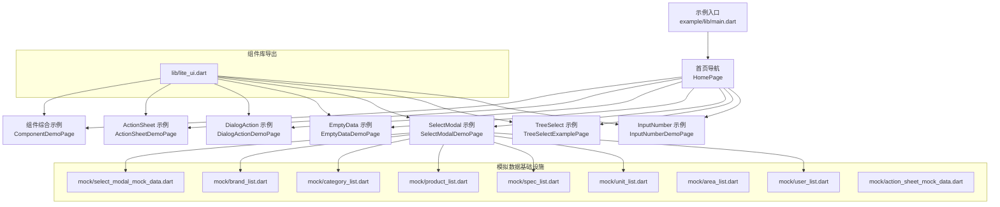
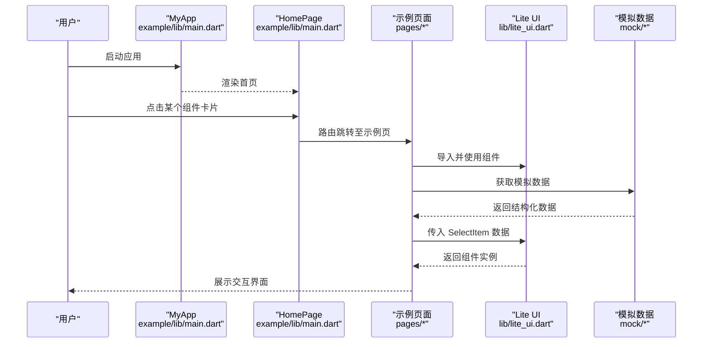
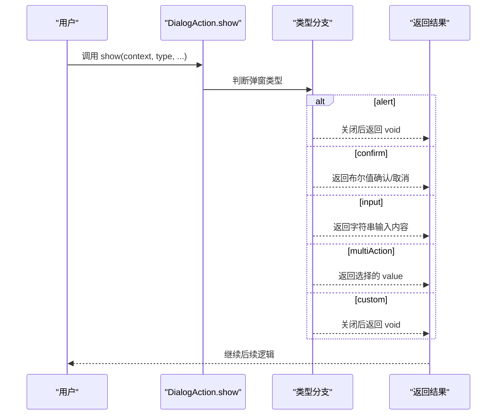
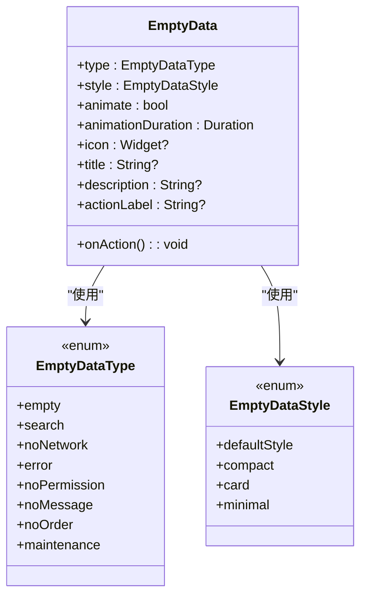
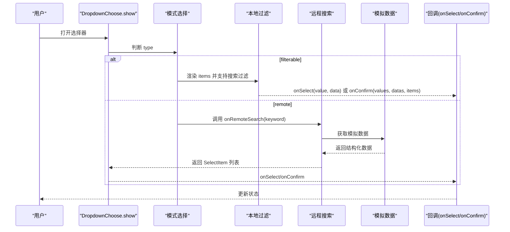
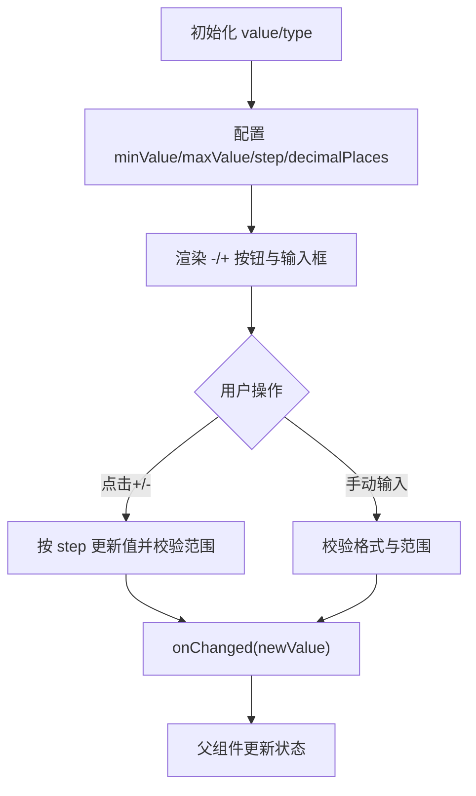
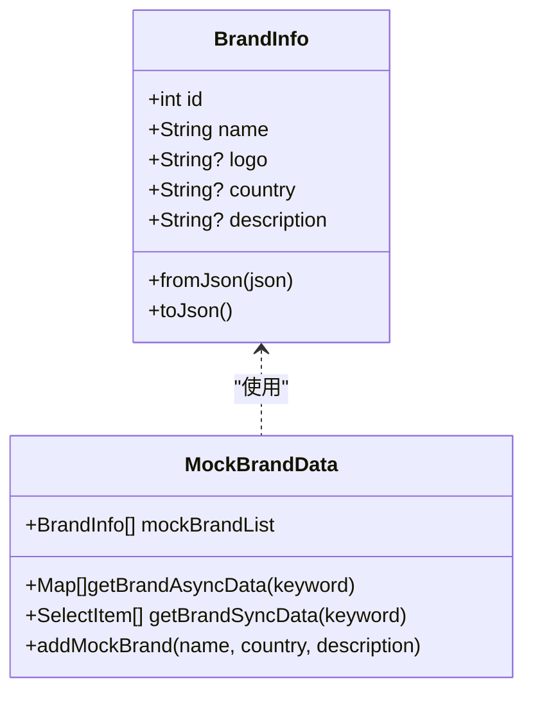
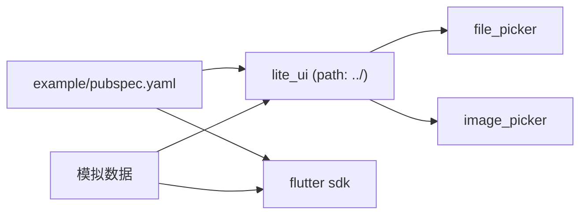

# 示例演示

<cite>
**本文引用的文件**   
- [README.md](file://README.md)
- [pubspec.yaml](file://pubspec.yaml)
- [example/README.md](file://example/README.md)
- [example/pubspec.yaml](file://example/pubspec.yaml)
- [lib/lite_ui.dart](file://lib/lite_ui.dart)
- [example/lib/main.dart](file://example/lib/main.dart)
- [example/lib/pages/component_demo.dart](file://example/lib/pages/component_demo.dart)
- [example/lib/pages/action_sheet_demo.dart](file://example/lib/pages/action_sheet_demo.dart)
- [example/lib/pages/dialog_action_demo.dart](file://example/lib/pages/dialog_action_demo.dart)
- [example/lib/pages/empty_data_demo.dart](file://example/lib/pages/empty_data_demo.dart)
- [example/lib/pages/select_modal_demo.dart](file://example/lib/pages/select_modal_demo.dart)
- [example/lib/pages/tree_select_example.dart](file://example/lib/pages/tree_select_example.dart)
- [example/lib/pages/input_number_demo.dart](file://example/lib/pages/input_number_demo.dart)
- [example/lib/mock/brand_list.dart](file://example/lib/mock/brand_list.dart)
- [example/lib/mock/category_list.dart](file://example/lib/mock/category_list.dart)
- [example/lib/mock/product_list.dart](file://example/lib/mock/product_list.dart)
- [example/lib/mock/spec_list.dart](file://example/lib/mock/spec_list.dart)
- [example/lib/mock/unit_list.dart](file://example/lib/mock/unit_list.dart)
- [example/lib/mock/user_list.dart](file://example/lib/mock/user_list.dart)
- [example/lib/mock/area_list.dart](file://example/lib/mock/area_list.dart)
- [example/lib/mock/select_modal_mock_data.dart](file://example/lib/mock/select_modal_mock_data.dart)
- [example/lib/mock/action_sheet_mock_data.dart](file://example/lib/mock/action_sheet_mock_data.dart)
</cite>

## 更新摘要
**所做更改**   
- 新增完整的模拟数据基础设施章节，涵盖品牌、分类、产品、规格、单位、用户等数据集
- 更新 SelectModal 组件使用示例，展示新 mock 数据的集成方式
- 扩展示例项目结构说明，包含 mock 数据目录的组织方式
- 添加新的性能考虑和最佳实践，针对大数据量选择器的优化建议

## 目录
1. [简介](#简介)
2. [项目结构](#项目结构)
3. [核心组件](#核心组件)
4. [架构总览](#架构总览)
5. [详细组件分析](#详细组件分析)
6. [模拟数据基础设施](#模拟数据基础设施)
7. [依赖分析](#依赖分析)
8. [性能考虑](#性能考虑)
9. [故障排查指南](#故障排查指南)
10. [结论](#结论)
11. [附录](#附录)

## 简介
本文件为 Lite UI 组件库的示例演示文档，面向开发者与产品同学，系统说明示例应用的结构、组织方式与各页面示例的功能与实现。文档覆盖每个组件的基本用法、高级配置、自定义样式与组合模式，并提供交互式演示路径与代码片段位置，便于直接复制使用。同时给出运行环境、启动方法、扩展建议与最佳实践，帮助快速上手并高效集成。

**更新** 新增了完整的模拟数据基础设施，为测试下拉功能提供了品牌、分类、产品、规格、单位和用户等丰富的数据集。

## 项目结构
示例工程采用 Flutter 标准结构，入口在 example/lib/main.dart，首页以卡片导航聚合各组件示例页；组件库源码位于 lib/src 下，按功能模块划分（如 action_button、action_sheet、dialog_action、dropdown_choose、empty_data、file_upload、input_number、input_text、tree_select 等），并通过 lib/lite_ui.dart 统一导出。

**更新** 新增了 example/lib/mock 目录，包含完整的模拟数据基础设施，支持各种业务场景的数据测试。



**图表来源**
- [example/lib/main.dart:1-80](file://example/lib/main.dart#L1-L80)
- [lib/lite_ui.dart:1-19](file://lib/lite_ui.dart#L1-L19)
- [example/lib/mock/brand_list.dart:1-78](file://example/lib/mock/brand_list.dart#L1-L78)
- [example/lib/mock/category_list.dart:1-76](file://example/lib/mock/category_list.dart#L1-L76)
- [example/lib/mock/product_list.dart:1-94](file://example/lib/mock/product_list.dart#L1-L94)

**章节来源**
- [example/lib/main.dart:1-80](file://example/lib/main.dart#L1-L80)
- [lib/lite_ui.dart:1-19](file://lib/lite_ui.dart#L1-L19)

## 核心组件
Lite UI 提供开箱即用的常用 UI 能力，包括操作按钮、底部面板、居中弹窗、空状态占位、文件上传、文本输入、数字步进器、选择器与树形选择器等。组件高度可配置，支持泛型适配业务数据，默认样式内联，主题与 Material 3 兼容。

- ActionButton：操作按钮，支持多种风格（凸起、描边、文字、填充、色调、图标）。
- ActionSheet：底部操作面板，支持普通列表与分组展示，含标题、描述、滚动项与取消按钮。
- DialogAction：居中弹窗，支持提示、确认、输入、多操作与自定义内容。
- EmptyData：空状态占位，支持多种场景类型与布局风格，可自定义图标、文案与操作。
- FileUpload：文件上传，支持多种选择方式、单选/多选、数量限制、预览、进度与头像裁剪。
- InputText：文本输入框，支持标签、密码模式、校验规则与样式定制。
- InputNumber：数字步进器，支持整数/小数、范围与步长、长按增减。
- SelectModal：底部选择器，支持本地过滤与远程搜索，单选/多选，泛型设计。
- TreeSelect：树形选择器，支持搜索、单选/多选、懒加载与便捷调用。

**更新** SelectModal 组件现在可以充分利用丰富的模拟数据进行测试和演示，包括品牌、分类、产品、规格、单位和用户等多种数据类型。

**章节来源**
- [README.md:1-126](file://README.md#L1-L126)

## 架构总览
示例应用通过 MaterialApp 初始化主题与首页，首页以 Scaffold + Card + ListTile 构建导航卡片，点击后路由到对应示例页。组件库通过 lite_ui.dart 集中导出，示例页按需引入并使用。

**更新** 新增的模拟数据基础设施为 SelectModal 组件提供了完整的数据源支持，支持同步和异步数据获取，以及复杂业务场景的数据模拟。



**图表来源**
- [example/lib/main.dart:1-80](file://example/lib/main.dart#L1-L80)
- [lib/lite_ui.dart:1-19](file://lib/lite_ui.dart#L1-L19)
- [example/lib/mock/brand_list.dart:52-68](file://example/lib/mock/brand_list.dart#L52-L68)

## 详细组件分析

### ActionSheet（底部操作面板）
- 功能要点：支持普通列表与分组展示，可带图标、禁用状态与禁用角标。
- 使用方式：通过静态 show 方法弹出，传入 title、description、items/sections 与 onSelect 回调。
- 示例页：演示了默认菜单、分组显示、图标支持、禁用状态与组合功能。


**图表来源**
- [example/lib/pages/action_sheet_demo.dart:1-243](file://example/lib/pages/action_sheet_demo.dart#L1-L243)

**章节来源**
- [example/lib/pages/action_sheet_demo.dart:1-243](file://example/lib/pages/action_sheet_demo.dart#L1-L243)

### DialogAction（居中弹窗）
- 功能要点：支持 alert、confirm、input、multiAction、custom 五种类型，可覆盖默认文案、样式与图标。
- 使用方式：通过静态 show 方法弹出，根据 type 传入不同参数，返回结果由 await 获取。
- 示例页：演示了默认与自定义覆盖、多操作、自定义内容与图标。



**图表来源**
- [example/lib/pages/dialog_action_demo.dart:1-206](file://example/lib/pages/dialog_action_demo.dart#L1-L206)

**章节来源**
- [example/lib/pages/dialog_action_demo.dart:1-206](file://example/lib/pages/dialog_action_demo.dart#L1-L206)

### EmptyData（空状态占位）
- 功能要点：支持 8 种场景类型与 4 种布局风格，可自定义图标、标题、描述、操作按钮与动画。
- 使用方式：直接作为 Widget 使用，设置 type/style/animate 等属性，配合 onAction 处理交互。
- 示例页：演示了类型切换、风格预览、动画控制、带操作按钮与实际使用模拟。



**图表来源**
- [example/lib/pages/empty_data_demo.dart:1-390](file://example/lib/pages/empty_data_demo.dart#L1-L390)

**章节来源**
- [example/lib/pages/empty_data_demo.dart:1-390](file://example/lib/pages/empty_data_demo.dart#L1-L390)

### SelectModal（选择器）
- 功能要点：支持 filterable（本地过滤）与 remote（远程搜索）两种模式，单选/多选，支持初始值与禁用项。
- 使用方式：通过 DropdownChoose.show 弹出，传入 type/items/onRemoteSearch/multiple 等参数。
- 示例页：演示了本地过滤单选/多选、带初始选中、图标与禁用、远程搜索单选/多选与初始数据。

**更新** 现在可以使用丰富的模拟数据来演示各种业务场景，包括品牌选择、产品分类、商品选择、规格配置、单位选择和用户管理等。



**图表来源**
- [example/lib/pages/select_modal_demo.dart:1-329](file://example/lib/pages/select_modal_demo.dart#L1-L329)
- [example/lib/mock/brand_list.dart:52-68](file://example/lib/mock/brand_list.dart#L52-L68)

**章节来源**
- [example/lib/pages/select_modal_demo.dart:1-329](file://example/lib/pages/select_modal_demo.dart#L1-L329)

### TreeSelect（树形选择器）
- 功能要点：支持单选/多选、父节点可选/不可选、懒加载子节点、内置搜索过滤。
- 使用方式：通过 TreeSelectHelper.show/showMultiple 弹出，传入 treeData/title/parentSelectable/selectedId(s)/onLoadChildren。
- 示例页：演示了父子节点选择策略、懒加载地区树、单选/多选与结果展示。


**图表来源**
- [example/lib/pages/tree_select_example.dart:1-351](file://example/lib/pages/tree_select_example.dart#L1-L351)

**章节来源**
- [example/lib/pages/tree_select_example.dart:1-351](file://example/lib/pages/tree_select_example.dart#L1-L351)

### InputNumber（数字步进器）
- 功能要点：支持整数/小数、最小/最大值、步长、禁用状态与尺寸定制。
- 使用方式：作为表单控件使用，绑定 value 与 onChanged，设置 type/minValue/maxValue/step 等。
- 示例页：演示了基础用法、范围限制、步长、禁用、尺寸与购物车场景。



**图表来源**
- [example/lib/pages/input_number_demo.dart:1-140](file://example/lib/pages/input_number_demo.dart#L1-L140)

**章节来源**
- [example/lib/pages/input_number_demo.dart:1-140](file://example/lib/pages/input_number_demo.dart#L1-L140)

### ComponentDemo（综合示例）
- 功能要点：在一个页面中集中演示 InputText 校验规则、选择型组件（ActionSheet/DropdownChoose）与表单提交。
- 使用方式：Form 包裹多个 InputText，结合 DropdownChoose 的 selectedValues/selectedItems 与 onSaved/onSelect/onConfirm。
- 示例页：展示了必填、数字、密码、手机号、邮箱、中文/英文、单字符验证码等多种输入类型与选择模式。

**更新** 现在可以利用模拟数据来演示更复杂的表单场景，如品牌选择、产品分类、商品配置等业务需求。

**章节来源**
- [example/lib/pages/component_demo.dart:1-422](file://example/lib/pages/component_demo.dart#L1-L422)

## 模拟数据基础设施

**新增** Lite UI 示例项目现在包含了完整的模拟数据基础设施，为测试下拉功能和选择器组件提供了丰富的数据支持。

### 数据结构设计
每个模拟数据文件都遵循统一的设计模式：
- **强类型模型类**：定义业务实体的属性和 JSON 序列化方法
- **JSON 数据源**：模拟后端返回的原始 JSON 数据
- **异步数据获取**：支持关键词搜索和延迟模拟网络请求
- **同步数据获取**：提供即时数据访问能力
- **数据操作方法**：支持动态添加新数据项

### 品牌数据（BrandInfo）
- 字段：id、name、logo、country、description
- 用途：品牌选择、商品品牌配置
- 特点：支持国家筛选和品牌描述搜索



**图表来源**
- [example/lib/mock/brand_list.dart:3-25](file://example/lib/mock/brand_list.dart#L3-L25)
- [example/lib/mock/brand_list.dart:52-78](file://example/lib/mock/brand_list.dart#L52-L78)

### 分类数据（CategoryInfo）
- 字段：id、name、parentId、icon、sort
- 用途：商品分类、层级结构展示
- 特点：支持父子关系和排序功能

### 产品数据（ProductInfo）
- 字段：id、name、category、price、brand
- 用途：商品管理、价格配置
- 特点：关联品牌和分类信息

### 规格数据（SpecInfo）
- 字段：id、name、unit、description
- 用途：商品规格、包装配置
- 特点：支持单位关联和规格描述

### 单位数据（UnitInfo）
- 字段：id、name、symbol、category
- 用途：计量单位、物理量配置
- 特点：支持符号显示和分类管理

### 用户数据（UserInfo）
- 字段：id、name、phone、department
- 用途：用户管理、部门分配
- 特点：支持部门筛选和联系方式管理

### 区域数据（AreaInfo）
- 字段：id、name、code、description
- 用途：地理位置、行政区划
- 特点：支持行政编码和描述信息

### 使用示例
所有模拟数据都可以通过以下方式在 SelectModal 中使用：

```dart
// 异步获取品牌数据
await DropdownChoose.show<int, BrandInfo>(
  context: context,
  type: SelectModalType.remote,
  title: '选择品牌',
  onRemoteSearch: (keyword) async {
    return getBrandAsyncData(keyword: keyword);
  },
  onSelect: (value, data) {
    // 处理品牌选择
  },
);

// 同步获取分类数据
await DropdownChoose.show<int, CategoryInfo>(
  context: context,
  type: SelectModalType.filterable,
  title: '选择分类',
  items: getCategorySyncData(),
  multiple: true,
  onConfirm: (values, datas, _) {
    // 处理分类选择
  },
);
```

**章节来源**
- [example/lib/mock/brand_list.dart:1-78](file://example/lib/mock/brand_list.dart#L1-L78)
- [example/lib/mock/category_list.dart:1-76](file://example/lib/mock/category_list.dart#L1-L76)
- [example/lib/mock/product_list.dart:1-94](file://example/lib/mock/product_list.dart#L1-L94)
- [example/lib/mock/spec_list.dart:1-71](file://example/lib/mock/spec_list.dart#L1-L71)
- [example/lib/mock/unit_list.dart:1-71](file://example/lib/mock/unit_list.dart#L1-L71)
- [example/lib/mock/user_list.dart:1-87](file://example/lib/mock/user_list.dart#L1-L87)
- [example/lib/mock/area_list.dart:1-93](file://example/lib/mock/area_list.dart#L1-L93)

## 依赖分析
示例工程通过 pubspec.yaml 引用 lite_ui 包（path 指向根目录），并启用 Material Design。组件库依赖 file_picker 与 image_picker 提供文件与图片选择能力。

**更新** 模拟数据基础设施不依赖外部包，仅使用 Flutter 和 lite_ui 组件库的核心功能。



**图表来源**
- [example/pubspec.yaml:1-24](file://example/pubspec.yaml#L1-L24)
- [pubspec.yaml:1-21](file://pubspec.yaml#L1-L21)

**章节来源**
- [example/pubspec.yaml:1-24](file://example/pubspec.yaml#L1-L24)
- [pubspec.yaml:1-21](file://pubspec.yaml#L1-L21)

## 性能考虑
- 选择器大数据量：优先使用 SelectModal 的 remote 模式，避免一次性渲染大量节点；合理设置防抖与分页。
- 树形选择器懒加载：仅在展开时加载子节点，减少首屏渲染压力。
- 空状态与动画：EmptyData 的入场动画可按需关闭或在低端设备上降低时长。
- 表单校验：InputText 的校验规则尽量前置，避免频繁重绘。
- 文件上传：FileUpload 的预览与压缩应在后台线程进行，避免阻塞 UI。

**更新** 针对新的模拟数据基础设施：
- 大数据集优化：模拟数据文件中的列表数据适合中小规模测试，对于大规模数据测试建议使用分页加载。
- 内存管理：模拟数据对象创建时应注意内存占用，避免在高频操作中重复创建大量对象。
- 异步处理：所有异步数据获取都包含适当的延迟模拟，实际使用时应根据网络情况调整延迟时间。
- 数据缓存：对于频繁访问的模拟数据，可以考虑在应用层添加缓存机制。

## 故障排查指南
- 无法导入 lite_ui：检查 example/pubspec.yaml 中 path 是否正确指向根目录，并确保 flutter pub get 成功。
- 选择器无数据：remote 模式下确认 onRemoteSearch 返回有效列表；filterable 模式下确保 items 非空。
- 树形选择器不展开：确认 onLoadChildren 正确返回子节点，且 isLeaf 标记准确。
- 弹窗不关闭：custom 类型需自行管理 Navigator.pop；其他类型应等待返回值或回调触发。
- 输入校验失败：检查 validRuleType 与 inputType 是否匹配，必要时添加自定义校验。

**更新** 模拟数据相关问题：
- 数据格式错误：确保 JSON 数据与模型类的字段类型匹配，特别注意可选字段的空值处理。
- 异步数据未加载：检查 Future.delayed 的时间设置，确保数据加载完成后再进行 UI 更新。
- 搜索功能异常：确认关键词过滤逻辑正确，注意大小写处理和特殊字符处理。
- 数据更新失效：模拟数据的增删改操作会影响全局数据源，注意数据状态的同步。

## 结论
Lite UI 示例工程提供了清晰、完整的组件使用范式与交互演示，覆盖常见业务场景。通过模块化结构与统一导出，开发者可以快速定位与复用组件。新增的模拟数据基础设施为测试和演示提供了强大的数据支持，使开发者能够更好地理解和验证组件功能。遵循本文档的最佳实践与性能建议，可在实际项目中高效落地。

**更新** 完整的模拟数据基础设施大大提升了示例项目的实用性和可扩展性，为开发团队提供了标准化的数据测试方案。

## 附录

### 运行环境与启动方法
- 环境要求：Flutter SDK >= 1.17.0，Dart SDK ^3.12.2。
- 安装依赖：进入 example 目录执行 flutter pub get。
- 启动应用：连接设备或模拟器后执行 flutter run。
- 平台支持：Android、iOS、Web、Linux、macOS、Windows（示例工程包含各平台脚手架）。

**章节来源**
- [example/README.md:1-18](file://example/README.md#L1-L18)
- [pubspec.yaml:1-21](file://pubspec.yaml#L1-L21)

### 自定义示例开发指南与扩展建议
- 新增组件示例：在 example/lib/pages 下创建新页面，并在 example/lib/main.dart 的 HomePage 中添加导航卡片。
- 复用 mock 数据：将示例数据放入 example/mock 目录，供多个页面共享。
- 主题与样式：通过 ThemeData 全局配置颜色与字体，组件默认样式与主题联动。
- 扩展组件能力：在 lib/src 下新增模块，并在 lib/lite_ui.dart 中统一导出，确保示例页能正常引用。

**更新** 模拟数据扩展建议：
- 新增数据类型：按照现有模式创建新的模拟数据文件，包含完整的模型类和数据操作方法。
- 数据关联：建立不同类型数据之间的关联关系，模拟真实的业务数据依赖。
- 性能优化：对于大型数据集，考虑实现分页加载和虚拟滚动优化。
- 测试覆盖：为新添加的模拟数据编写相应的单元测试和集成测试。

**章节来源**
- [example/lib/main.dart:1-80](file://example/lib/main.dart#L1-L80)
- [lib/lite_ui.dart:1-19](file://lib/lite_ui.dart#L1-L19)

### 常见使用场景的最佳实践
- 表单场景：使用 Form + GlobalKey<FormState> 统一管理校验与保存；对敏感字段开启密码模式与掩码。
- 选择场景：大数据量用 remote 模式；需要初始值时传入 selectedValues/selectedItems；禁用项明确标注 disabledLabel。
- 树形场景：层级较深时使用懒加载；父节点可选时注意联动逻辑与去重。
- 空状态：根据业务语义选择合适的 EmptyDataType 与风格；提供明确的 onAction 引导用户下一步操作。
- 文件上传：限制类型与大小，提供预览与删除；头像模式启用自动裁剪。

**更新** 模拟数据使用最佳实践：
- 数据隔离：不同类型的模拟数据应该独立管理，避免相互污染。
- 状态管理：模拟数据的变更应该通过明确的方法调用，便于追踪和调试。
- 错误处理：为模拟数据操作添加适当的错误处理和边界条件检查。
- 性能监控：在生产环境中禁用模拟数据，使用真实 API 接口。

### 模拟数据使用示例

**新增** 以下是如何使用新的模拟数据基础设施的完整示例：

#### 品牌选择示例
```dart
// 异步品牌选择
await DropdownChoose.show<int, BrandInfo>(
  context: context,
  type: SelectModalType.remote,
  title: '选择品牌',
  searchHint: '输入品牌名称或国家搜索',
  onRemoteSearch: (keyword) async {
    return getBrandAsyncData(keyword: keyword);
  },
  onSelect: (value, data) {
    print('选择了品牌: ${data.name} (${data.country})');
  },
);
```

#### 分类多选示例
```dart
// 同步分类多选
await DropdownChoose.show<int, CategoryInfo>(
  context: context,
  type: SelectModalType.filterable,
  title: '选择分类',
  items: getCategorySyncData(),
  multiple: true,
  selectedValues: {100, 102}, // 初始选中
  onConfirm: (values, datas, _) {
    final names = datas.map((d) => d.name).join(', ');
    print('选中的分类: $names');
  },
);
```

#### 产品搜索示例
```dart
// 产品远程搜索
await DropdownChoose.show<int, ProductInfo>(
  context: context,
  type: SelectModalType.remote,
  title: '搜索产品',
  searchHint: '输入产品名称、分类或品牌',
  onRemoteSearch: (keyword) async {
    return getProductAsyncData(keyword: keyword);
  },
  onSelect: (value, data) {
    print('选择了产品: ${data.name} - ¥${data.price}');
  },
);
```

**章节来源**
- [example/lib/mock/brand_list.dart:52-68](file://example/lib/mock/brand_list.dart#L52-L68)
- [example/lib/mock/category_list.dart:47-65](file://example/lib/mock/category_list.dart#L47-L65)
- [example/lib/mock/product_list.dart:50-70](file://example/lib/mock/product_list.dart#L50-L70)