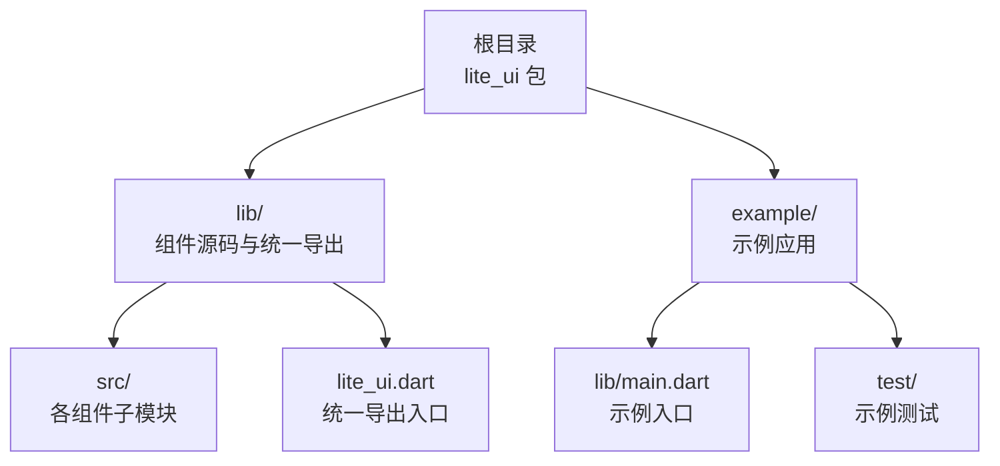
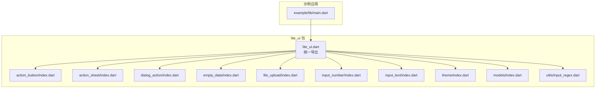
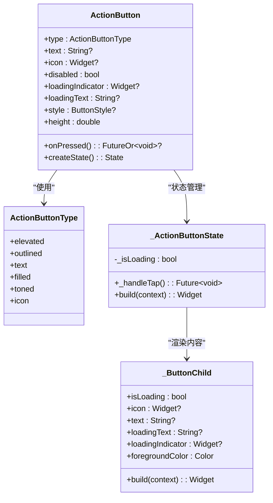
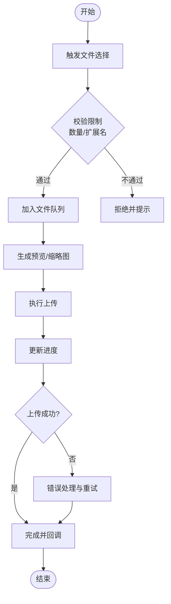
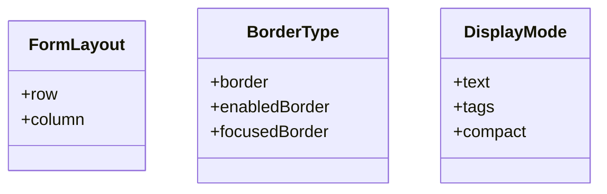
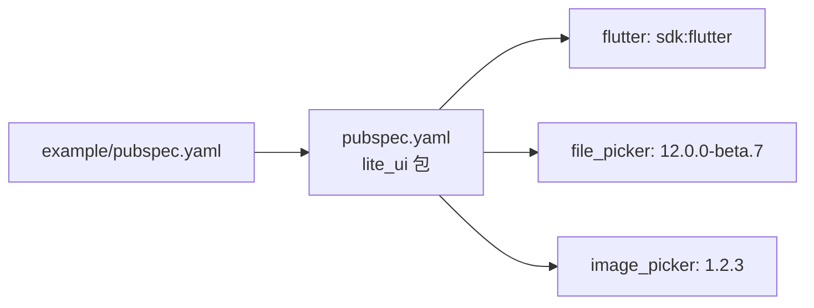

# 贡献指南

<cite>
**本文引用的文件**   
- [README.md](file://README.md)
- [pubspec.yaml](file://pubspec.yaml)
- [analysis_options.yaml](file://analysis_options.yaml)
- [lite_ui.dart](file://lib/lite_ui.dart)
- [action_button.dart](file://lib/src/action_button/action_button.dart)
- [enum.dart](file://lib/src/models/enum.dart)
- [file_utils.dart](file://lib/src/file_upload/utils/file_utils.dart)
- [example/pubspec.yaml](file://example/pubspec.yaml)
- [example/analysis_options.yaml](file://example/analysis_options.yaml)
- [CHANGELOG.md](file://CHANGELOG.md)
</cite>

## 目录
1. [简介](#简介)
2. [项目结构](#项目结构)
3. [核心组件](#核心组件)
4. [架构总览](#架构总览)
5. [详细组件分析](#详细组件分析)
6. [依赖分析](#依赖分析)
7. [性能考虑](#性能考虑)
8. [故障排查指南](#故障排查指南)
9. [结论](#结论)
10. [附录](#附录)

## 简介
本贡献指南面向希望为 Lite UI 组件库做出贡献的开发者，涵盖开发环境搭建、代码规范与风格、提交流程与审查要求、测试编写与覆盖率、组件开发模板与最佳实践、文档更新流程、问题报告与功能请求提交方式，以及社区协作行为准则。Lite UI 是一个轻量 Flutter UI 组件库，提供弹窗、按钮、表单控件、文件上传等常用能力，强调高可配置性与泛型适配。

## 项目结构
仓库采用“包 + 示例”的双工程结构：
- 根目录为 lite_ui 包，包含所有组件实现与统一导出入口。
- example 目录为示例应用，用于演示组件用法与本地联调。

**图示来源** 
- [lite_ui.dart:1-19](file://lib/lite_ui.dart#L1-L19)
- [example/pubspec.yaml:1-24](file://example/pubspec.yaml#L1-L24)

**章节来源**
- [README.md:1-126](file://README.md#L1-L126)
- [pubspec.yaml:1-21](file://pubspec.yaml#L1-L21)
- [lite_ui.dart:1-19](file://lib/lite_ui.dart#L1-L19)
- [example/pubspec.yaml:1-24](file://example/pubspec.yaml#L1-L24)

## 核心组件
Lite UI 通过 lib/lite_ui.dart 统一导出各组件与工具，便于使用者按需引入。当前导出的主要能力包括：
- 组件：ActionButton、ActionSheet、DialogAction、EmptyData、FileUpload、InputContent、InputNumber、SelectModal、TreeSelect 等
- 主题与模型：theme/index.dart、models/index.dart
- 工具类：输入校验正则等

建议新增组件时遵循以下原则：
- 在 src 下新建以组件名命名的文件夹，并在其中提供 index.dart 作为模块导出。
- 将公共枚举、回调、选择项等模型集中到 models 目录并统一导出。
- 保持对外 API 简洁稳定，内部实现可拆分至 ui、utils、service 等子目录。

**章节来源**
- [lite_ui.dart:1-19](file://lib/lite_ui.dart#L1-L19)
- [enum.dart:1-29](file://lib/src/models/enum.dart#L1-L29)

## 架构总览
下图展示了包的导出结构与示例工程的引用关系，帮助理解从入口到具体组件的调用路径。

**图示来源** 
- [lite_ui.dart:1-19](file://lib/lite_ui.dart#L1-L19)
- [example/pubspec.yaml:1-24](file://example/pubspec.yaml#L1-L24)

## 详细组件分析

### ActionButton（操作按钮）
ActionButton 是对 Flutter 原生按钮的封装，支持多种类型与加载态处理，具备自动识别同步/异步回调的能力。

**图示来源** 
- [action_button.dart:1-208](file://lib/src/action_button/action_button.dart#L1-L208)

**章节来源**
- [action_button.dart:1-208](file://lib/src/action_button/action_button.dart#L1-L208)

### FileUpload（文件上传）
FileUpload 提供多平台文件选择与上传能力，内置进度展示、预览、删除等功能，并通过工具方法获取远程文件大小。

**图示来源** 
- [file_utils.dart:21-50](file://lib/src/file_upload/utils/file_utils.dart#L21-L50)

**章节来源**
- [file_utils.dart:21-50](file://lib/src/file_upload/utils/file_utils.dart#L21-L50)

### 通用模型与枚举
项目中定义了若干通用枚举，如布局、边框类型、显示模式等，供各组件复用。

**图示来源** 
- [enum.dart:1-29](file://lib/src/models/enum.dart#L1-L29)

**章节来源**
- [enum.dart:1-29](file://lib/src/models/enum.dart#L1-L29)

## 依赖分析
Lite UI 的依赖集中在 pubspec.yaml 中，示例工程通过 path 引用本地包进行联调。

**图示来源** 
- [pubspec.yaml:1-21](file://pubspec.yaml#L1-L21)
- [example/pubspec.yaml:1-24](file://example/pubspec.yaml#L1-L24)

**章节来源**
- [pubspec.yaml:1-21](file://pubspec.yaml#L1-L21)
- [example/pubspec.yaml:1-24](file://example/pubspec.yaml#L1-L24)

## 性能考虑
- 按钮交互：ActionButton 对异步回调自动进入 loading 态，避免重复点击；建议在 onPressed 中尽量短耗时，必要时使用节流或防抖策略。
- 文件上传：优先使用 HEAD 请求获取大小，失败再回退 GET；合理设置并发与重试次数，避免阻塞主线程。
- 列表渲染：对于大数据量场景（如 TreeSelect、SelectModal），建议使用分页或虚拟列表，减少一次性构建开销。
- 主题与样式：尽量复用默认样式，仅在必要时覆盖，降低样式计算成本。

[本节为通用指导，无需特定文件来源]

## 故障排查指南
常见问题与定位思路：
- 依赖冲突：检查 flutter 与 dart SDK 版本是否与 pubspec.yaml 一致；清理 .dart_tool 后重新 get。
- 平台权限：文件选择与图片拍摄需确保 Android/iOS 权限声明正确。
- 网络异常：文件上传失败时查看日志输出，确认服务端返回码与 Content-Length 字段可用性。
- 分析器告警：运行 flutter analyze，根据 analysis_options.yaml 规则修复警告。

**章节来源**
- [analysis_options.yaml:1-5](file://analysis_options.yaml#L1-L5)
- [example/analysis_options.yaml:1-29](file://example/analysis_options.yaml#L1-L29)
- [file_utils.dart:21-50](file://lib/src/file_upload/utils/file_utils.dart#L21-L50)

## 结论
Lite UI 提供了开箱即用的轻量组件集合，结构清晰、依赖明确、易于扩展。贡献者应遵循统一的导出与模块化约定，保持 API 稳定与可读性，完善测试与文档，确保质量与可维护性。

[本节为总结，无需特定文件来源]

## 附录

### 开发环境搭建
- 安装 Flutter SDK：确保版本满足 pubspec.yaml 的环境约束（Flutter >= 1.17.0，Dart SDK ^3.12.2）。
- 克隆仓库并进入根目录。
- 安装依赖：
  - 包依赖：flutter pub get
  - 示例依赖：cd example && flutter pub get
- 运行示例：
  - 连接设备或启动模拟器后，运行 example/lib/main.dart。

**章节来源**
- [pubspec.yaml:1-21](file://pubspec.yaml#L1-L21)
- [example/pubspec.yaml:1-24](file://example/pubspec.yaml#L1-L24)

### 代码规范与风格指南
- 分析器与 Lint：
  - 根目录与示例均启用 flutter_lints/flutter.yaml。
  - 可通过 analysis_options.yaml 自定义规则。
- 命名约定：
  - 组件类使用 PascalCase，私有成员以下划线开头。
  - 枚举值使用小写蛇形或语义化命名。
- 注释标准：
  - 公共 API 需提供清晰的文档注释，说明用途、参数、返回值与注意事项。
  - 复杂逻辑添加行内注释解释关键步骤。

**章节来源**
- [analysis_options.yaml:1-5](file://analysis_options.yaml#L1-L5)
- [example/analysis_options.yaml:1-29](file://example/analysis_options.yaml#L1-L29)

### 提交流程与代码审查
- 分支策略：
  - main：稳定发布分支
  - develop：日常开发分支
  - feature/*：功能分支
  - fix/*：修复分支
- 提交信息：
  - 使用语义化提交（feat/fix/docs/chore 等），简要描述变更目的与影响范围。
- PR 模板：
  - 变更概述、涉及组件、兼容性说明、测试覆盖情况、截图或录屏（如有 UI 变化）。
- 代码审查：
  - 至少一名维护者审查通过后合并。
  - 关注 API 稳定性、错误处理、性能与可访问性。

[本节为流程指导，无需特定文件来源]

### 测试编写指南与覆盖率
- 单元测试：
  - 使用 flutter_test 框架，针对纯函数、工具类与简单逻辑编写用例。
- 组件测试：
  - 使用 WidgetTester 模拟用户交互，验证 UI 状态与回调行为。
- 覆盖率目标：
  - 建议核心逻辑与工具类达到较高覆盖率（如 >80%），UI 组件按重要性逐步提升。
- 运行测试：
  - 包级别：flutter test
  - 示例级别：cd example && flutter test

**章节来源**
- [pubspec.yaml:16-21](file://pubspec.yaml#L16-L21)
- [example/test/widget_test.dart:1-30](file://example/test/widget_test.dart#L1-L30)

### 组件开发模板与最佳实践
- 目录结构：
  - 组件根目录：index.dart（统一导出）、component.dart（主实现）
  - 子目录：ui/（界面组件）、models/（数据模型）、utils/（工具方法）、service/（业务服务）
- API 设计：
  - 最小必要参数，提供合理的默认值。
  - 使用泛型增强灵活性（如 SelectModal、TreeSelect）。
- 状态管理：
  - 局部状态尽量使用 StatefulWidget，跨组件状态通过回调或外部状态管理。
- 可访问性与主题：
  - 遵循 Material 主题与无障碍规范，确保键盘导航与屏幕阅读器友好。

**章节来源**
- [lite_ui.dart:1-19](file://lib/lite_ui.dart#L1-L19)
- [action_button.dart:1-208](file://lib/src/action_button/action_button.dart#L1-L208)

### 文档编写规范与更新流程
- README：
  - 组件使用说明、特性、依赖、安装方式与示例。
- CHANGELOG：
  - 记录版本变更、新增功能、修复问题与破坏性变更。
- 更新流程：
  - 每次发布前更新 CHANGELOG 与版本号，确保与代码一致。

**章节来源**
- [README.md:1-126](file://README.md#L1-L126)
- [CHANGELOG.md:1-7](file://CHANGELOG.md#L1-L7)

### 问题报告与功能请求
- 问题报告：
  - 提供复现步骤、期望行为与实际行为、环境与版本信息、相关日志或截图。
- 功能请求：
  - 描述需求背景、使用场景、预期接口与边界条件。
- 提交渠道：
  - 通过仓库 Issues 提交，标签区分 bug/feature/question。

[本节为流程指导，无需特定文件来源]

### 社区行为准则与协作规范
- 尊重与包容：
  - 友善沟通，尊重不同观点与背景。
- 透明与协作：
  - 公开讨论、共享上下文、及时反馈。
- 质量优先：
  - 重视代码质量、测试与文档，共同维护项目健康。

[本节为行为指导，无需特定文件来源]