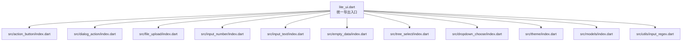
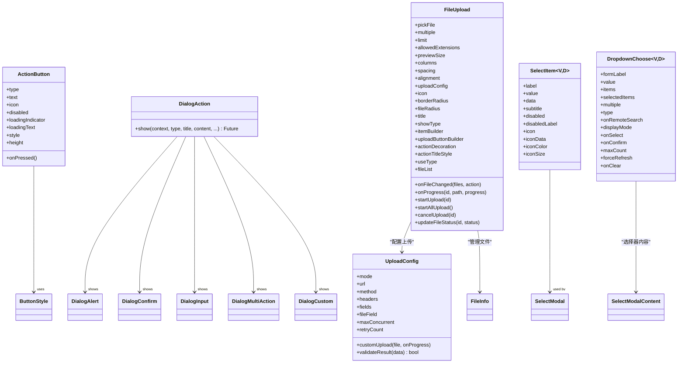
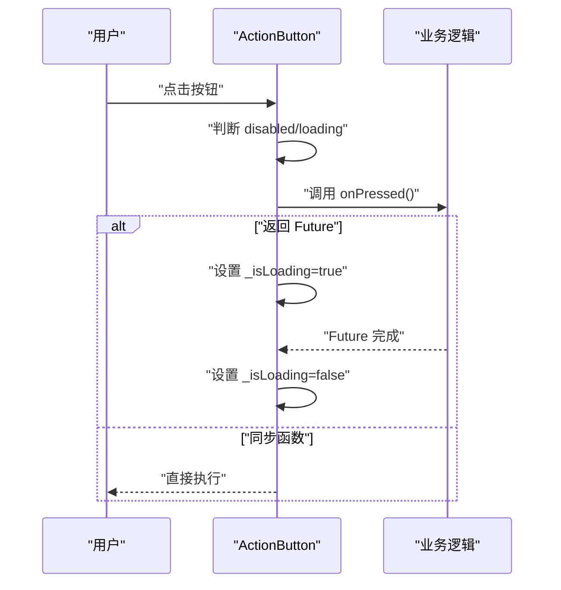
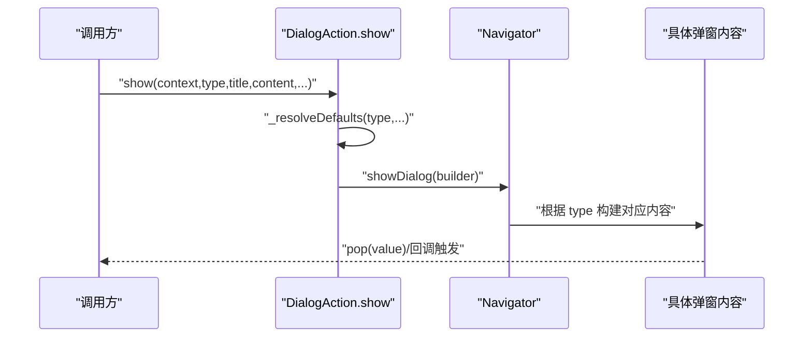
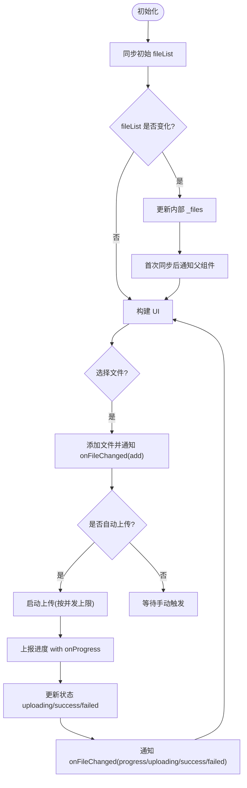
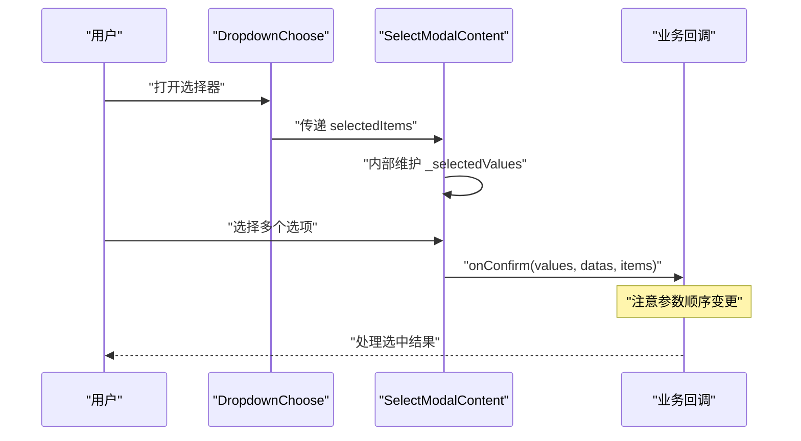

# 迁移指南

<cite>
**本文引用的文件**   
- [pubspec.yaml](file://pubspec.yaml)
- [README.md](file://README.md)
- [lite_ui.dart](file://lib/lite_ui.dart)
- [action_button.dart](file://lib/src/action_button/action_button.dart)
- [dialog_action.dart](file://lib/src/dialog_action/dialog_action.dart)
- [file_upload.dart](file://lib/src/file_upload/file_upload.dart)
- [enum.dart](file://lib/src/models/enum.dart)
- [select_item.dart](file://lib/src/models/select_item.dart)
- [upload_config.dart](file://lib/src/file_upload/model/upload_config.dart)
- [enum.dart（上传）](file://lib/src/file_upload/model/enum.dart)
- [dropdown_choose.dart](file://lib/src/dropdown_choose/dropdown_choose.dart)
- [callbacks.dart](file://lib/src/models/callbacks.dart)
- [select_modal_content.dart](file://lib/src/dropdown_choose/ui/select_modal_content.dart)
</cite>

## 更新摘要
**已进行的更改**
- 新增 selectedValues 移除的迁移章节
- 更新回调参数重排序的详细说明和修复方案
- 添加选择器组件的破坏性变更影响范围
- 提供具体的代码示例和自动化迁移脚本

## 目录
1. [简介](#简介)
2. [项目结构](#项目结构)
3. [核心组件](#核心组件)
4. [架构总览](#架构总览)
5. [详细组件分析](#详细组件分析)
6. [依赖与版本兼容性矩阵](#依赖与版本兼容性矩阵)
7. [破坏性变更与修复方案](#破坏性变更与修复方案)
8. [自动化迁移工具与脚本](#自动化迁移工具与脚本)
9. [性能考虑](#性能考虑)
10. [故障排除指南](#故障排除指南)
11. [结论](#结论)
12. [附录：升级最佳实践与回滚方案](#附录升级最佳实践与回滚方案)

## 简介
本迁移指南面向使用 Lite UI 组件库的开发者，提供从旧版本升级到新版本、以及从其他 Flutter UI 库迁移到 Lite UI 的系统化指导。内容涵盖 API 变更说明、废弃功能处理、依赖更新建议、破坏性变更影响范围与修复方法、自动化迁移脚本、常见问题排查、向后兼容策略与版本支持周期等。

**重要更新**：最新版本包含选择器组件的重大破坏性变更，包括 `selectedValues` 参数的完全移除和 `onConfirm` 回调参数顺序的重新排序。

## 项目结构
Lite UI 采用模块化组织方式，通过统一入口导出各组件与模型，便于按需引入与清晰边界划分。当前仓库包含示例工程与核心库源码，核心导出集中在统一入口文件中。



图表来源
- [lite_ui.dart:1-19](file://lib/lite_ui.dart#L1-L19)

章节来源
- [lite_ui.dart:1-19](file://lib/lite_ui.dart#L1-L19)

## 核心组件
Lite UI 当前版本提供了以下常用组件与能力：
- ActionButton：操作按钮，支持多种样式与加载态
- DialogAction：居中弹窗，支持 alert/confirm/input/multiAction/custom 五种类型
- FileUpload：文件上传，支持卡片/列表/自定义展示模式，自动/手动/自定义上传模式
- InputNumber：数字步进器
- InputContent：文本输入框
- EmptyData：空状态占位
- SelectModal/TreeSelect：选择器与树形选择器
- DropdownChoose：下拉选择器，支持单选/多选、远程搜索、标签显示等模式
- 主题与通用模型、枚举、工具类

章节来源
- [README.md:24-126](file://README.md#L24-L126)
- [lite_ui.dart:1-19](file://lib/lite_ui.dart#L1-L19)

## 架构总览
Lite UI 以"组件 + 模型/枚举 + 工具"分层组织，UI 组件通过统一的 index 文件暴露 API；数据模型与枚举集中管理，保证跨组件一致性；工具类提供通用能力（如输入校验正则）。



图表来源
- [action_button.dart:1-208](file://lib/src/action_button/action_button.dart#L1-L208)
- [dialog_action.dart:1-248](file://lib/src/dialog_action/dialog_action.dart#L1-L248)
- [file_upload.dart:1-594](file://lib/src/file_upload/file_upload.dart#L1-L594)
- [upload_config.dart:1-139](file://lib/src/file_upload/model/upload_config.dart#L1-L139)
- [select_item.dart:1-78](file://lib/src/models/select_item.dart#L1-L78)
- [dropdown_choose.dart:11-485](file://lib/src/dropdown_choose/dropdown_choose.dart#L11-L485)

## 详细组件分析

### ActionButton 分析与迁移要点
- 设计要点
  - 基于 Flutter 原生按钮封装，保留水波纹、无障碍、主题能力
  - 通过 type 切换按钮样式：elevated/outlined/text/filled/toned/icon
  - 支持同步/异步回调自动识别，异步时自动显示 loading 并禁用重复点击
- 关键参数
  - type、text、icon、iconSize、onPressed、disabled、loadingIndicator、loadingText、style、height
- 迁移建议
  - 若使用自定义样式，确保 style 覆盖默认值时仍满足无障碍与可访问性要求
  - 对异步回调需确保异常路径中正确结束 loading 状态（组件内部已处理）



图表来源
- [action_button.dart:96-175](file://lib/src/action_button/action_button.dart#L96-L175)

章节来源
- [action_button.dart:1-208](file://lib/src/action_button/action_button.dart#L1-L208)

### DialogAction 分析与迁移要点
- 设计要点
  - 统一 show 接口，根据 type 渲染不同弹窗内容
  - 支持 presetIcon 与自定义 icon，默认文案可按类型解析
- 关键参数
  - context、type、title、content、icon、presetIcon、confirmLabel、cancelLabel、confirmStyle、onCancel、onConfirm、hintText、initialValue、maxLength、onInputConfirm、actions、onAction、customChild、barrierDismissible、barrierColor
- 迁移建议
  - 若自定义弹窗内容，建议使用 custom 类型并通过 customChild 传入
  - 注意 barrierDismissible 与屏障颜色配置，避免误关闭



图表来源
- [dialog_action.dart:56-131](file://lib/src/dialog_action/dialog_action.dart#L56-L131)
- [dialog_action.dart:134-153](file://lib/src/dialog_action/dialog_action.dart#L134-L153)
- [dialog_action.dart:156-246](file://lib/src/dialog_action/dialog_action.dart#L156-L246)

章节来源
- [dialog_action.dart:1-248](file://lib/src/dialog_action/dialog_action.dart#L1-L248)

### FileUpload 分析与迁移要点
- 设计要点
  - 支持卡片/列表/自定义三种展示模式
  - 支持头像模式（自动限制为单选图片）
  - 支持自动/手动/自定义上传模式，内置并发控制与进度回调
  - 对外暴露 startUpload/startAllUpload/cancelUpload/updateFileStatus 等方法
- 关键参数
  - pickFile、multiple、limit、allowedExtensions、onFileChanged、previewSize、columns、spacing、alignment、uploadConfig、onProgress、icon、borderRadius、fileRadius、title、showType、itemBuilder、uploadButtonBuilder、actionDecoration、actionTitleStyle、useType、fileList
- 重要行为
  - fileList 变化检测：通过 url/name/size 签名比较，避免无效重建
  - 头像模式：强制 limit=1、multiple=false、pickFile=imageOrCamera（除非显式指定 gallery/camera）
  - 替换文件：保持顺序不变，先通知 remove 再 add，并自动触发上传
- 迁移建议
  - 若使用自定义上传，请实现 customUpload 并正确上报进度
  - 若需要外部控制上传流程，使用 manual 模式并通过 GlobalKey 调用方法



图表来源
- [file_upload.dart:173-234](file://lib/src/file_upload/file_upload.dart#L173-L234)
- [file_upload.dart:236-253](file://lib/src/file_upload/file_upload.dart#L236-L253)
- [file_upload.dart:280-304](file://lib/src/file_upload/file_upload.dart#L280-L304)
- [file_upload.dart:341-375](file://lib/src/file_upload/file_upload.dart#L341-L375)
- [file_upload.dart:379-447](file://lib/src/file_upload/file_upload.dart#L379-L447)
- [file_upload.dart:452-592](file://lib/src/file_upload/file_upload.dart#L452-L592)

章节来源
- [file_upload.dart:1-594](file://lib/src/file_upload/file_upload.dart#L1-L594)

### DropdownChoose 选择器组件分析与迁移要点
- 设计要点
  - 支持单选/多选模式，内置本地过滤和远程搜索
  - 提供多种显示模式：text/tags/compact
  - 完整的表单集成，支持验证和保存
  - 支持 selectedItems 参数用于编辑场景的回显
- 关键参数
  - formLabel、value、items、selectedItems、multiple、type、onRemoteSearch、displayMode、onSelect、onConfirm、maxCount、forceRefresh、onClear
- **破坏性变更**：
  - `selectedValues` 参数已完全移除，内部状态管理改为私有实现
  - `onConfirm` 回调参数顺序从 `(values, items, datas)` 变更为 `(values, datas, items)`
- 迁移建议
  - 移除所有 `selectedValues` 参数引用
  - 更新 `onConfirm` 回调的参数顺序
  - 使用 `selectedItems` 替代 `selectedValues` 进行编辑场景的数据绑定



图表来源
- [dropdown_choose.dart:11-485](file://lib/src/dropdown_choose/dropdown_choose.dart#L11-L485)
- [select_modal_content.dart:22-383](file://lib/src/dropdown_choose/ui/select_modal_content.dart#L22-L383)

章节来源
- [dropdown_choose.dart:11-485](file://lib/src/dropdown_choose/dropdown_choose.dart#L11-L485)
- [select_modal_content.dart:22-383](file://lib/src/dropdown_choose/ui/select_modal_content.dart#L22-L383)

### 模型与枚举
- SelectItem：泛型选择项，支持 label/value/data/subtitle/disabled/disabledLabel/icon/iconData/iconColor/iconSize
- 表单布局与边框类型：FormLayout、BorderType、DisplayMode
- 上传相关枚举：UploadStatus、ShowType、FileSource、FileAction、PickFile、ActionFileSheet
- 上传配置：UploadConfig（mode/url/method/headers/fields/fileField/maxConcurrent/retryCount/customUpload/validateResult），UploadResult（success/data/error）
- 回调类型：OnSelectChange、OnMultiSelectConfirm、RemoteSearchCallback

章节来源
- [select_item.dart:1-78](file://lib/src/models/select_item.dart#L1-L78)
- [enum.dart:1-29](file://lib/src/models/enum.dart#L1-L29)
- [enum.dart（上传）:1-105](file://lib/src/file_upload/model/enum.dart#L1-L105)
- [upload_config.dart:1-139](file://lib/src/file_upload/model/upload_config.dart#L1-L139)
- [callbacks.dart:1-13](file://lib/src/models/callbacks.dart#L1-L13)

## 依赖与版本兼容性矩阵
- 包名：lite_ui
- 当前版本：1.2.0
- Dart SDK：^3.12.2
- Flutter：>=1.17.0
- 主要依赖：
  - file_picker：12.0.0-beta.7（系统级文件选择）
  - image_picker：1.2.3（图片选择与拍照）

建议：
- 升级 Flutter/Dart SDK 时，优先确认与 ^3.12.2 的兼容性
- 若第三方依赖版本冲突，优先锁定 file_picker 与 image_picker 的版本，避免破坏上传能力

章节来源
- [pubspec.yaml:1-21](file://pubspec.yaml#L1-L21)

## 破坏性变更与修复方案

### 重大破坏性变更：选择器组件 API 重构

#### 1. selectedValues 参数完全移除
**影响范围**：所有使用 `SelectModalContent` 或相关选择器组件的代码

**变更详情**：
- 旧版本：`SelectModalContent` 接受 `selectedValues` 参数用于控制选中状态
- 新版本：`selectedValues` 参数被完全移除，内部状态管理改为私有实现 `_selectedValues`

**修复方案**：
```dart
// ❌ 旧版本代码
SelectModalContent(
  selectedValues: _selectedValues, // 此参数已不存在
  multiple: true,
  onSelect: (value, item, data) {
    setState(() => _selectedValues.add(value));
  },
)

// ✅ 新版本代码
SelectModalContent(
  selectedItems: _selectedItems.map((v) => SelectItem(value: v, label: v.toString())).toList(),
  multiple: true,
  onSelect: (value, item, data) {
    setState(() => _selectedItems.add(value));
  },
)
```

#### 2. onConfirm 回调参数顺序重新排序
**影响范围**：所有使用 `onConfirm` 回调的多选选择器

**变更详情**：
- 旧版本：`onConfirm(values, items, datas)`
- 新版本：`onConfirm(values, datas, items)`

**修复方案**：
```dart
// ❌ 旧版本代码
onConfirm: (values, items, datas) {
  print('Values: $values');
  print('Items: $items');
  print('Datas: $datas');
}

// ✅ 新版本代码
onConfirm: (values, datas, items) {
  print('Values: $values');
  print('Datas: $datas');
  print('Items: $items');
}
```

#### 3. 推荐的最佳实践
```dart
// 推荐使用 selectedItems 进行数据绑定
DropdownChoose<String, UserInfo>(
  formLabel: '用户',
  multiple: true,
  selectedItems: _selectedUsers, // 使用完整数据对象
  displayMode: DisplayMode.tags,
  onConfirm: (values, datas, items) {
    setState(() {
      _selectedUsers = items; // 直接使用 items 作为状态
    });
  },
  items: _allUsers,
)
```

### 其他常见破坏性变更风险
- 组件 API 重命名或参数移除
  - 现象：编译报错找不到字段或方法
  - 修复：对照 README 与组件 index 导出，使用新字段名；必要时用 style 或 builder 替代被移除的参数
- 枚举值变更
  - 现象：switch/case 分支缺失导致运行时错误
  - 修复：补充新增枚举分支，删除废弃分支
- 上传配置变更
  - 现象：UploadConfig.mode 或 validateResult 行为变化
  - 修复：检查 mode 是否为 auto/manual/custom，并按需实现 customUpload 或 validateResult
- 文件列表对比逻辑
  - 现象：父组件频繁 rebuild 导致无效触发 onFileChanged
  - 修复：确保传入的 fileList 引用稳定，或使用组件内部的签名比较机制（url/name/size）

章节来源
- [select_modal_content.dart:140-150](file://lib/src/dropdown_choose/ui/select_modal_content.dart#L140-L150)
- [callbacks.dart:6-9](file://lib/src/models/callbacks.dart#L6-L9)
- [file_upload.dart:199-212](file://lib/src/file_upload/file_upload.dart#L199-L212)
- [upload_config.dart:87-98](file://lib/src/file_upload/model/upload_config.dart#L87-L98)
- [enum.dart（上传）:1-105](file://lib/src/file_upload/model/enum.dart#L1-L105)

## 自动化迁移工具与脚本

### 针对 selectedValues 移除的迁移脚本
```bash
#!/bin/bash
# 查找并替换 selectedValues 相关代码

echo "开始迁移 selectedValues 相关代码..."

# 查找包含 selectedValues 的文件
grep -r "selectedValues" lib/ example/ --include="*.dart" > selected_values_files.txt

if [ -s selected_values_files.txt ]; then
  echo "发现以下文件包含 selectedValues:"
  cat selected_values_files.txt
  
  # 提示手动修改
  echo ""
  echo "请手动修改上述文件中的 selectedValues 相关代码："
  echo "1. 移除 selectedValues 参数"
  echo "2. 改用 selectedItems 参数"
  echo "3. 更新相关的状态管理逻辑"
else
  echo "未发现 selectedValues 相关代码"
fi
```

### 针对 onConfirm 参数重排序的迁移脚本
```bash
#!/bin/bash
# 查找并修复 onConfirm 参数顺序

echo "开始修复 onConfirm 参数顺序..."

# 查找包含 onConfirm 的文件
grep -r "onConfirm.*values.*items.*datas\|onConfirm.*values.*datas.*items" lib/ example/ --include="*.dart" > confirm_params_files.txt

if [ -s confirm_params_files.txt ]; then
  echo "发现以下文件需要修复 onConfirm 参数顺序:"
  cat confirm_params_files.txt
  
  # 使用 sed 进行批量替换
  find lib/ example/ -name "*.dart" -exec sed -i 's/onConfirm: (\([^)]*\), \([^)]*\), \([^)]*\))/onConfirm: (\1, \3, \2)/g' {} \;
  
  echo "已完成批量替换"
else
  echo "未发现需要修复的 onConfirm 参数"
fi
```

### 推荐的迁移步骤
1. **备份代码**：在执行任何自动化脚本前，先提交当前代码到版本控制系统
2. **分阶段迁移**：
   - 第一阶段：修复 `selectedValues` 相关代码
   - 第二阶段：修复 `onConfirm` 参数顺序
   - 第三阶段：测试和验证
3. **单元测试**：为修改后的代码添加或更新单元测试
4. **全量测试**：运行应用的所有功能测试

[本节为通用指导，不直接分析具体文件]

## 性能考虑
- FileUpload 的文件列表对比通过签名比较减少无效重建
- ActionButton 的异步回调自动管理 loading 状态，避免重复点击
- DialogAction 的内容构建委托给子组件，降低主组件复杂度
- 建议在父组件中对 fileList 使用稳定的引用，避免频繁创建新对象
- DropdownChoose 的内部状态管理优化，减少不必要的重建

章节来源
- [file_upload.dart:199-212](file://lib/src/file_upload/file_upload.dart#L199-L212)
- [action_button.dart:96-114](file://lib/src/action_button/action_button.dart#L96-L114)
- [select_modal_content.dart:140-150](file://lib/src/dropdown_choose/ui/select_modal_content.dart#L140-L150)

## 故障排除指南

### 选择器组件相关问题
- **selectedValues 未定义错误**
  - 现象：编译时报错找不到 selectedValues 属性
  - 解决方案：移除 selectedValues 参数，改用 selectedItems
  - 参考：[select_modal_content.dart:140-150](file://lib/src/dropdown_choose/ui/select_modal_content.dart#L140-L150)

- **onConfirm 参数顺序错误**
  - 现象：运行时数据错位或类型错误
  - 解决方案：调整 onConfirm 回调参数顺序为 (values, datas, items)
  - 参考：[callbacks.dart:6-9](file://lib/src/models/callbacks.dart#L6-L9)

- **选择状态不同步**
  - 现象：选择器显示的状态与实际选中状态不一致
  - 解决方案：确保 selectedItems 与内部状态保持一致
  - 参考：[dropdown_choose.dart:298-305](file://lib/src/dropdown_choose/dropdown_choose.dart#L298-L305)

### 其他常见问题
- 上传失败
  - 检查 UploadConfig.mode 与 url 是否正确
  - 若使用 custom 模式，确认 customUpload 返回 UploadResult.success/failure
  - 查看 onProgress 与 onFileChanged 回调是否被正确触发
- 弹窗无法关闭
  - 检查 barrierDismissible 配置
  - 确认 pop 返回值与 onConfirm/onCancel 回调逻辑
- 按钮无响应
  - 检查 disabled 与 loading 状态
  - 确认 onPressed 是否返回 Future 且正确处理异常

章节来源
- [file_upload.dart:341-375](file://lib/src/file_upload/file_upload.dart#L341-L375)
- [dialog_action.dart:134-153](file://lib/src/dialog_action/dialog_action.dart#L134-L153)
- [action_button.dart:96-114](file://lib/src/action_button/action_button.dart#L96-L114)

## 结论
Lite UI 在当前版本提供了完善的常用 UI 组件与上传能力，API 设计清晰、扩展性强。通过本迁移指南，开发者可以安全地升级版本或从其他库迁移至 Lite UI，同时借助自动化脚本与故障排除建议降低迁移成本与风险。

**重要提醒**：本次版本包含选择器组件的重大破坏性变更，请务必按照迁移指南进行相应的代码更新。

[本节为总结，不直接分析具体文件]

## 附录：升级最佳实践与回滚方案

### 升级最佳实践
- **分阶段升级**：先升级依赖版本，再逐步替换废弃 API
- **小步快跑**：每次变更提交后进行全量测试，确保回归
- **文档对齐**：对照 README 与组件导出，确保 API 使用一致
- **重点关注**：特别关注选择器组件的 selectedValues 移除和 onConfirm 参数重排序

### 回滚方案
- **使用 Git 分支隔离升级**，出现问题快速回滚到上一个稳定版本
- **锁定依赖版本**，避免动态升级引发不可控问题
- **准备降级开关**：在关键路径增加条件分支，支持临时回退到旧实现
- **建立回滚清单**：记录所有需要回滚的代码变更点

### 迁移检查清单
- [ ] 移除所有 selectedValues 参数引用
- [ ] 更新 onConfirm 回调参数顺序
- [ ] 使用 selectedItems 替代 selectedValues 进行数据绑定
- [ ] 运行全量测试确保功能正常
- [ ] 更新相关文档和注释
- [ ] 通知团队成员关于 API 变更

[本节为通用指导，不直接分析具体文件]