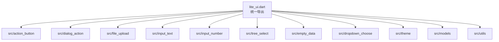
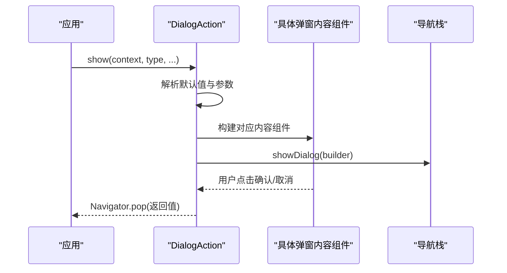
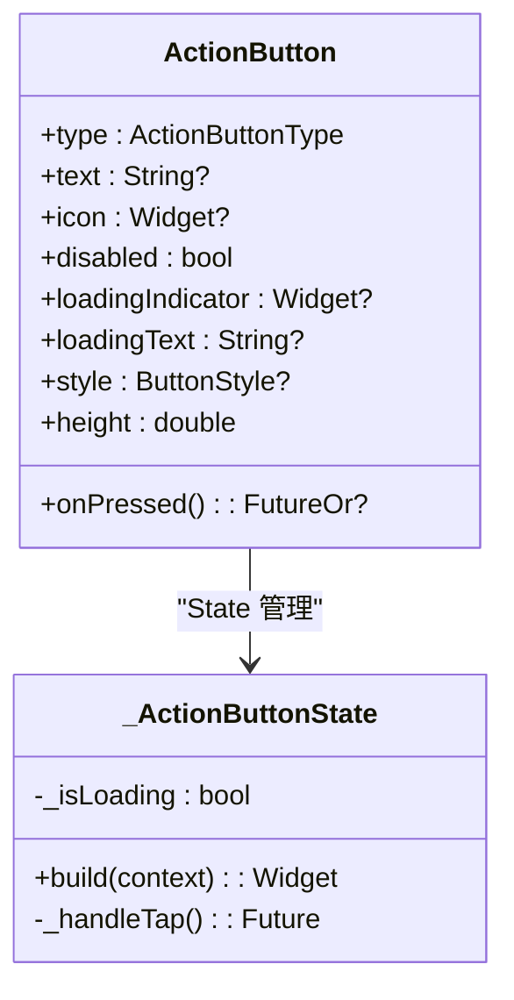
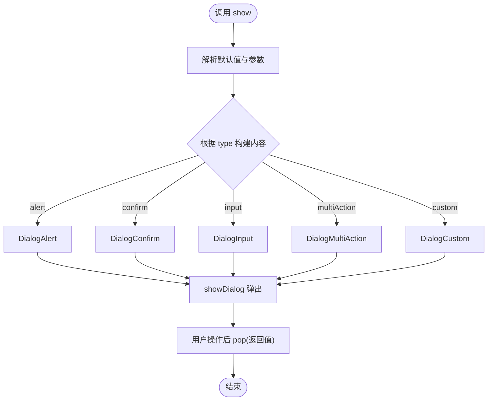
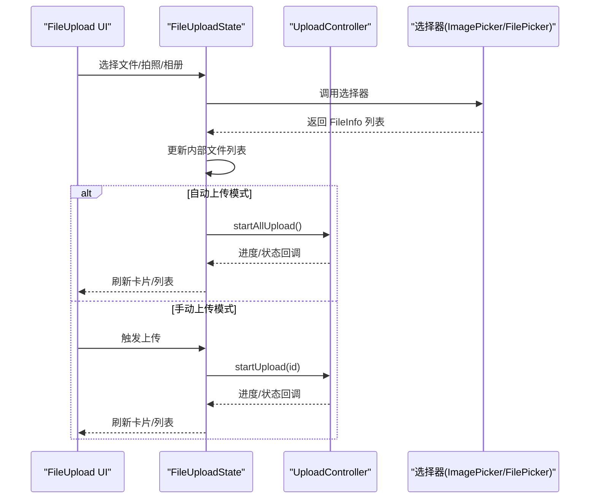
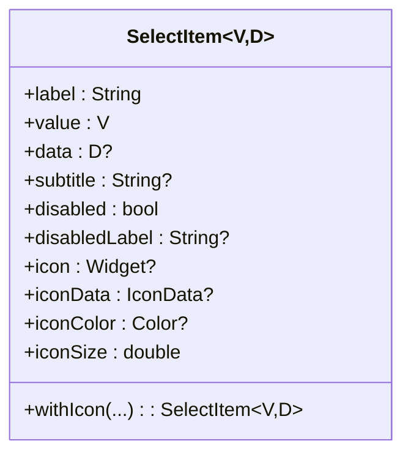
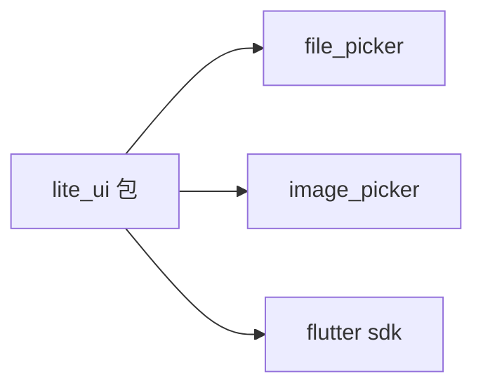

# 项目概述

<cite>
**本文引用的文件**
- [README.md](file://README.md)
- [pubspec.yaml](file://pubspec.yaml)
- [lite_ui.dart](file://lib/lite_ui.dart)
- [action_button.dart](file://lib/src/action_button/action_button.dart)
- [dialog_action.dart](file://lib/src/dialog_action/dialog_action.dart)
- [file_upload.dart](file://lib/src/file_upload/file_upload.dart)
- [select_item.dart](file://lib/src/models/select_item.dart)
- [main.dart](file://example/lib/main.dart)
- [component_demo.dart](file://example/lib/pages/component_demo.dart)
</cite>

## 目录
1. [简介](#简介)
2. [项目结构](#项目结构)
3. [核心组件](#核心组件)
4. [架构总览](#架构总览)
5. [详细组件分析](#详细组件分析)
6. [依赖关系分析](#依赖关系分析)
7. [性能与可维护性](#性能与可维护性)
8. [快速开始](#快速开始)
9. [常见问题排查](#常见问题排查)
10. [结论](#结论)

## 简介
Lite UI 是一个轻量级 Flutter UI 组件库，聚焦“开箱即用”的常用交互能力：弹窗、按钮、表单控件、文件上传等。其设计理念强调：
- 高度可配置：默认样式内联，参数覆盖简单直观
- 泛型适配：选择类组件通过泛型承载业务数据类型，减少类型转换成本
- 跨平台一致体验：基于 Flutter 渲染管线，统一支持 Android、iOS、Web、Desktop（Windows/macOS/Linux）
- 低耦合、高复用：组件内部职责清晰，对外暴露稳定 API，便于集成与维护

与其他 Flutter UI 库相比，Lite UI 的优势在于：
- 更轻量的依赖与包体积，聚焦高频场景
- 对常见交互进行“组合式封装”，降低样板代码
- 提供统一的模型与工具（如输入校验规则、选择项模型），提升一致性

版本与许可证信息：
- 当前版本：1.2.0（见 pubspec.yaml）
- Dart SDK：^3.12.2；Flutter：>=1.17.0
- 许可证：请参见仓库根目录 LICENSE 文件（若存在）

章节来源
- [pubspec.yaml:1-21](file://pubspec.yaml#L1-L21)
- [README.md:1-126](file://README.md#L1-L126)

## 项目结构
Lite UI 采用“按功能模块划分”的组织方式，每个组件位于 lib/src/ 下独立目录，并通过顶层导出文件集中暴露 API。示例结构如下：
- lib/lite_ui.dart：统一导出所有公开 API（组件、主题、模型、工具）
- lib/src/*：各组件源码（action_button、dialog_action、file_upload、input_text、input_number、tree_select、empty_data、dropdown_choose 等）
- example/：示例应用，展示各组件用法与组合方式

图表来源
- [lite_ui.dart:1-19](file://lib/lite_ui.dart#L1-L19)

章节来源
- [lite_ui.dart:1-19](file://lib/lite_ui.dart#L1-L19)

## 核心组件
Lite UI 的核心组件围绕“交互效率”和“开发体验”展开，主要包括：
- ActionButton：操作按钮，支持多种 Material 风格与加载态
- DialogAction：居中弹窗，内置 alert/confirm/input/multiAction/custom 五种模式
- FileUpload：文件上传，支持多源选择、预览、进度、替换、头像模式等
- InputText/InputNumber：文本与数字输入，内置校验与格式化
- SelectModal/TreeSelect：选择器与树形选择，支持本地过滤与远程搜索
- EmptyData：空状态占位，多场景与多布局风格

这些组件均遵循一致的参数命名与回调约定，便于学习与迁移。

章节来源
- [README.md:24-126](file://README.md#L24-L126)

## 架构总览
Lite UI 的架构以“组件 + 模型 + 工具”三层为主：
- 组件层：UI 表现与交互逻辑（StatefulWidget/StatelessWidget）
- 模型层：统一的数据结构与枚举（如 SelectItem、各种枚举定义）
- 工具层：通用能力（输入正则、格式化工具等）

整体调用链示例（DialogAction）：
- 外部调用 DialogAction.show(...)
- 内部根据 type 解析默认值并构建对应内容组件
- 通过 showDialog 弹出 Modal，返回用户操作结果

图表来源
- [dialog_action.dart:1-248](file://lib/src/dialog_action/dialog_action.dart#L1-L248)

章节来源
- [dialog_action.dart:1-248](file://lib/src/dialog_action/dialog_action.dart#L1-L248)

## 详细组件分析

### ActionButton（操作按钮）
- 设计要点：
  - 基于 Flutter 原生按钮封装，保留水波纹、无障碍、主题能力
  - 通过 type 切换不同风格（elevated/outlined/text/filled/toned/icon）
  - 自动识别同步/异步 onPressed，异步时显示 loading 并防重复点击
- 关键特性：
  - 支持 icon 前缀或仅图标模式
  - 支持自定义 loadingIndicator 与 loadingText
  - 高度可定制 ButtonStyle

图表来源
- [action_button.dart:1-208](file://lib/src/action_button/action_button.dart#L1-L208)

章节来源
- [action_button.dart:1-208](file://lib/src/action_button/action_button.dart#L1-L208)

### DialogAction（居中弹窗）
- 设计要点：
  - 单一入口 show(...)，根据 type 分发到不同内容组件
  - 内置预设标题、文案与按钮文字，支持覆盖
  - 支持 barrier 可关闭、遮罩颜色等通用参数
- 关键特性：
  - 五种弹窗类型：alert/confirm/input/multiAction/custom
  - 泛型返回：V?，便于上层获取操作结果

图表来源
- [dialog_action.dart:1-248](file://lib/src/dialog_action/dialog_action.dart#L1-L248)

章节来源
- [dialog_action.dart:1-248](file://lib/src/dialog_action/dialog_action.dart#L1-L248)

### FileUpload（文件上传）
- 设计要点：
  - 多源选择：文件/相册/拍照/组合弹窗
  - 两种展示：卡片网格与列表行
  - 三种上传模式：auto/manual/custom
  - 头像模式：限制单选、自动裁剪为正方形展示
- 关键特性：
  - 支持数量限制、扩展名过滤、预览、删除、替换
  - 上传进度回调与状态变更回调
  - 通过 UploadController 管理并发与生命周期

图表来源
- [file_upload.dart:1-594](file://lib/src/file_upload/file_upload.dart#L1-L594)

章节来源
- [file_upload.dart:1-594](file://lib/src/file_upload/file_upload.dart#L1-L594)

### SelectItem（选择项模型）
- 设计要点：
  - 泛型 V/D：value 用于提交，data 携带原始数据
  - 支持禁用状态与禁用标签、图标与图标尺寸
  - 提供 withIcon 工厂方法简化构造

图表来源
- [select_item.dart:1-78](file://lib/src/models/select_item.dart#L1-L78)

章节来源
- [select_item.dart:1-78](file://lib/src/models/select_item.dart#L1-L78)

## 依赖关系分析
Lite UI 的依赖非常精简，主要依赖系统级文件与图片选择能力：
- file_picker：系统级文件选择
- image_picker：图片选择与拍照
- flutter：基础框架

图表来源
- [pubspec.yaml:1-21](file://pubspec.yaml#L1-L21)

章节来源
- [pubspec.yaml:1-21](file://pubspec.yaml#L1-L21)

## 性能与可维护性
- 渲染优化：
  - FileUpload 使用 LayoutBuilder 自适应布局，避免不必要的重建
  - 通过 ValueKey 与 id 匹配更新文件状态，减少全量重建
- 状态管理：
  - 组件内部维护最小必要状态，外部通过回调与可控方法（如 startUpload/cancelUpload）协作
- 可维护性：
  - 统一的模型与枚举，清晰的导出边界
  - 示例工程覆盖主要场景，便于回归与学习

[本节为通用指导，不直接分析具体文件]

## 快速开始
- 安装依赖：在 pubspec.yaml 中添加 lite_ui 依赖（版本 ^1.0.0 及以上）
- 引入库：在 Dart 文件中 import 'package:lite_ui/lite_ui.dart'
- 使用示例：参考 example/lib/main.dart 与 example/lib/pages/component_demo.dart 中的页面组织与组件调用方式

章节来源
- [README.md:17-22](file://README.md#L17-L22)
- [main.dart:1-80](file://example/lib/main.dart#L1-L80)
- [component_demo.dart:1-200](file://example/lib/pages/component_demo.dart#L1-L200)

## 常见问题排查
- 文件上传无响应：
  - 检查是否配置了 uploadConfig，且 mode 与触发方式一致
  - 确认 onFileChanged 与 onProgress 回调是否正确监听
- 选择器无数据：
  - 本地模式需传入 items；远程模式需实现 onRemoteSearch 并返回数据
- 弹窗无法关闭：
  - 检查 barrierDismissible 设置；确认 onConfirm/onCancel 中是否调用了 pop

章节来源
- [file_upload.dart:1-594](file://lib/src/file_upload/file_upload.dart#L1-L594)
- [dialog_action.dart:1-248](file://lib/src/dialog_action/dialog_action.dart#L1-L248)

## 结论
Lite UI 以“轻量、易用、跨平台”为核心目标，通过简洁的 API 与稳定的模型体系，帮助开发者快速搭建高质量的 Flutter 界面。其组件化设计与清晰的依赖边界，既适合初学者上手，也满足成熟项目的扩展与维护需求。建议结合示例工程逐步掌握各组件用法，并在实际业务中按需定制样式与行为。

[本节为总结性内容，不直接分析具体文件]