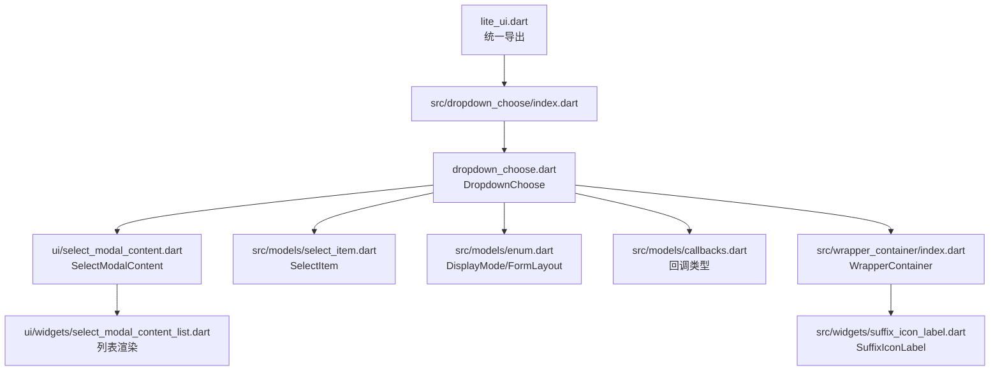
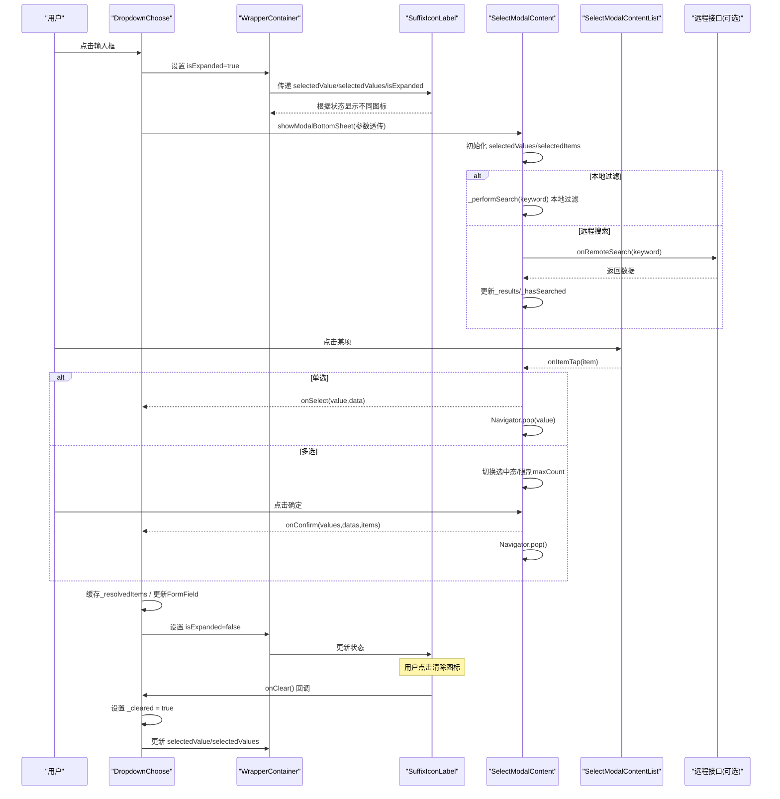
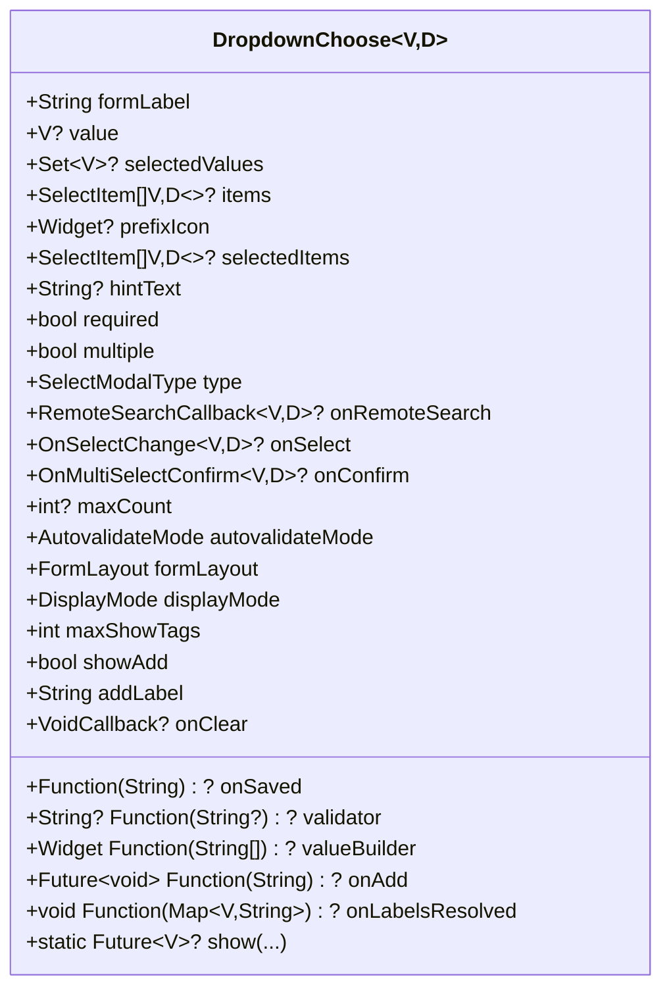
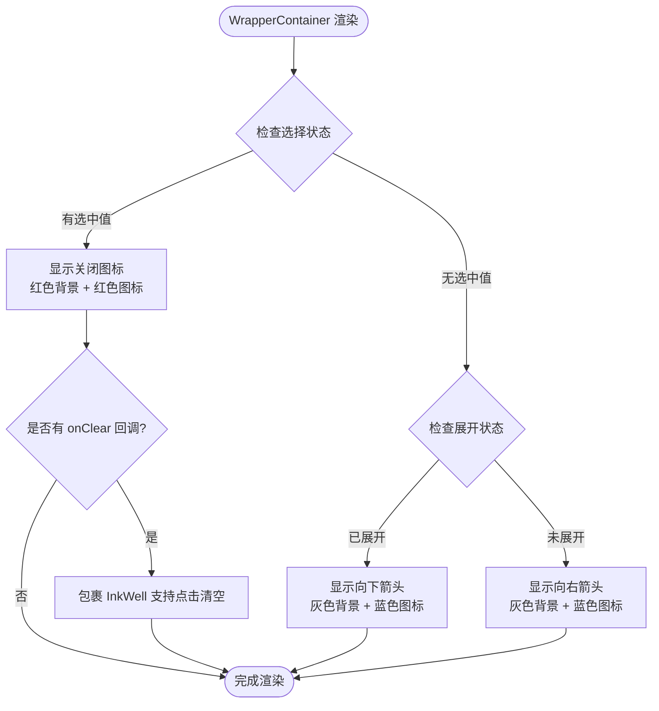
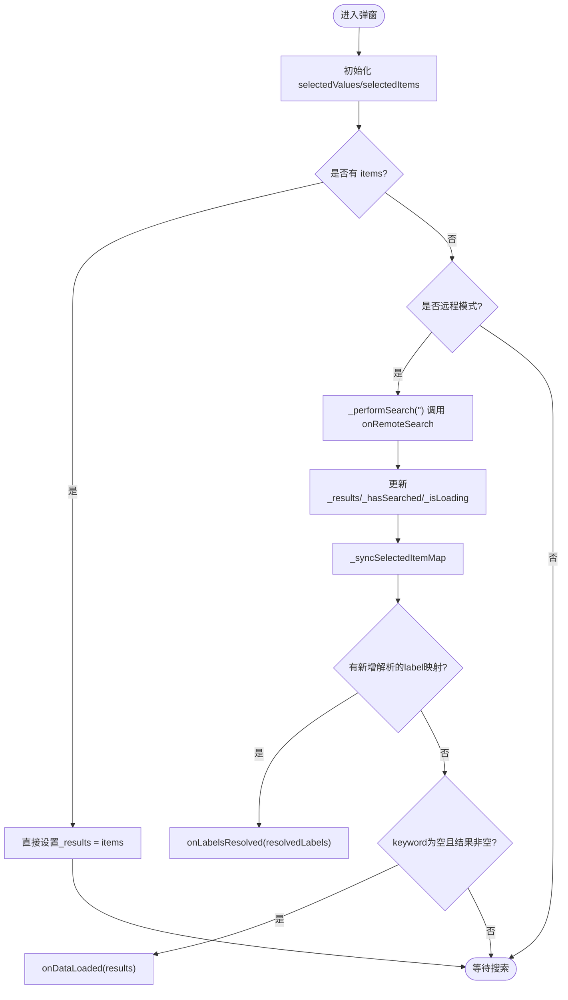
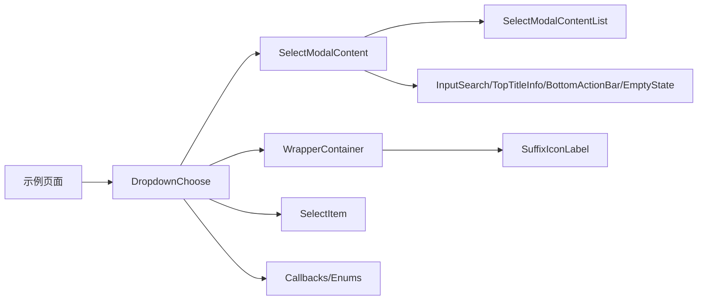

# 下拉选择器

<cite>
**本文引用的文件**   
- [lite_ui.dart](file://lib/lite_ui.dart)
- [dropdown_choose.dart](file://lib/src/dropdown_choose/dropdown_choose.dart)
- [select_modal_content.dart](file://lib/src/dropdown_choose/ui/select_modal_content.dart)
- [select_modal_content_list.dart](file://lib/src/dropdown_choose/ui/widgets/select_modal_content_list.dart)
- [index.dart（models）](file://lib/src/dropdown_choose/models/index.dart)
- [select_item.dart](file://lib/src/models/select_item.dart)
- [enum.dart](file://lib/src/models/enum.dart)
- [callbacks.dart](file://lib/src/models/callbacks.dart)
- [index.dart（wrapper_container）](file://lib/src/wrapper_container/index.dart)
- [suffix_icon_label.dart](file://lib/src/widgets/suffix_icon_label.dart)
- [select_modal_demo.dart](file://example/lib/pages/select_modal_demo.dart)
- [back.dart](file://example/lib/pages/back.dart)
</cite>

## 更新摘要
**变更内容**   
- WrapperContainer 新增 onClear 属性并传递给 SuffixIconLabel，支持点击清空功能
- SuffixIconLabel 增强 onClear 回调支持，当有值且提供 onClear 回调时支持点击清空功能
- DropdownChoose 修复清除后弹窗选中状态同步问题，新增 _modalSelectedValues() 方法感知内部清除状态
- 完善了清除功能的完整实现，包括状态管理和视觉反馈

## 目录
1. [简介](#简介)
2. [项目结构](#项目结构)
3. [核心组件](#核心组件)
4. [架构总览](#架构总览)
5. [详细组件分析](#详细组件分析)
6. [依赖关系分析](#依赖关系分析)
7. [性能考虑](#性能考虑)
8. [故障排查指南](#故障排查指南)
9. [结论](#结论)
10. [附录：API 参考与示例](#附录api-参考与示例)

## 简介
本文件为 Lite UI 下拉选择器组件的完整技术文档，聚焦 DropdownChoose 组件及其弹窗内容 SelectModalContent。内容涵盖单选/多选模式、搜索过滤、远程数据加载、禁用状态、受控与非受控模式、状态同步机制、数据绑定方式、完整的 API 参考、业务场景示例、性能优化策略以及用户体验设计原则（键盘导航、无障碍支持、响应式布局等）。特别强调了增强的视觉反馈系统和清除功能，通过 SuffixIconLabel 组件提供清晰的三态交互反馈和点击清空能力。读者可据此快速集成并高效使用。

## 项目结构
Lite UI 的下拉选择器位于 lib/src/dropdown_choose 目录下，并通过 lib/lite_ui.dart 统一导出。核心文件包括：
- 组件入口与表单封装：DropdownChoose
- 弹窗内容与交互逻辑：SelectModalContent
- 列表渲染与空状态：SelectModalContentList
- 数据模型与回调类型：SelectItem、枚举与回调定义
- 表单包装容器：WrapperContainer（用于值显示与标签布局）
- 后缀图标组件：SuffixIconLabel（提供智能视觉反馈和清空功能）

**图表来源** 
- [lite_ui.dart:1-19](file://lib/lite_ui.dart#L1-L19)
- [dropdown_choose.dart:1-470](file://lib/src/dropdown_choose/dropdown_choose.dart#L1-L470)
- [select_modal_content.dart:1-391](file://lib/src/dropdown_choose/ui/select_modal_content.dart#L1-L391)
- [select_modal_content_list.dart:1-103](file://lib/src/dropdown_choose/ui/widgets/select_modal_content_list.dart#L1-L103)
- [select_item.dart:1-78](file://lib/src/models/select_item.dart#L1-L78)
- [enum.dart:1-29](file://lib/src/models/enum.dart#L1-L29)
- [callbacks.dart:1-13](file://lib/src/models/callbacks.dart#L1-L13)
- [index.dart（wrapper_container）:1-134](file://lib/src/wrapper_container/index.dart#L1-L134)
- [suffix_icon_label.dart:1-39](file://lib/src/widgets/suffix_icon_label.dart#L1-L39)

章节来源
- [lite_ui.dart:1-19](file://lib/lite_ui.dart#L1-L19)

## 核心组件
- DropdownChoose：表单级下拉选择器，支持单选/多选、本地过滤与远程搜索、值显示模式、新增按钮、校验与保存、受控/非受控模式、自动缓存与 label 解析、点击清空功能。
- SelectModalContent：底部弹窗内容组件，负责搜索、数据加载（本地/远程）、选中态管理、确认与查看已选、新增操作。
- SelectModalContentList：列表渲染组件，处理 Loading、空状态、数据项展示与点击事件。
- SelectItem：选项数据模型，包含标签、副标题、图标、禁用状态、原始数据等。
- WrapperContainer：表单包装容器，提供标签、占位符、错误提示、值显示（文本/标签/紧凑）与智能后缀图标。
- SuffixIconLabel：智能后缀图标组件，根据选择状态和展开状态提供三态视觉反馈，支持点击清空功能。

章节来源
- [dropdown_choose.dart:11-264](file://lib/src/dropdown_choose/dropdown_choose.dart#L11-L264)
- [select_modal_content.dart:22-134](file://lib/src/dropdown_choose/ui/select_modal_content.dart#L22-L134)
- [select_modal_content_list.dart:14-61](file://lib/src/dropdown_choose/ui/widgets/select_modal_content_list.dart#L14-L61)
- [select_item.dart:9-51](file://lib/src/models/select_item.dart#L9-L51)
- [index.dart（wrapper_container）:13-82](file://lib/src/wrapper_container/index.dart#L13-L82)
- [suffix_icon_label.dart:3-11](file://lib/src/widgets/suffix_icon_label.dart#L3-L11)

## 架构总览
DropdownChoose 作为表单字段，点击后通过静态方法 show 弹出 SelectModalContent 弹窗。弹窗内部根据 type 决定本地过滤或远程搜索；用户选择后触发 onSelect/onConfirm，并在多选模式下返回 values、datas 与完整 items。WrapperContainer 通过 SuffixIconLabel 组件提供智能的视觉反馈，根据选择状态和展开状态动态切换图标和颜色，并支持点击清空功能。

**图表来源** 
- [dropdown_choose.dart:133-217](file://lib/src/dropdown_choose/dropdown_choose.dart#L133-L217)
- [select_modal_content.dart:166-237](file://lib/src/dropdown_choose/ui/select_modal_content.dart#L166-L237)
- [select_modal_content_list.dart:82-101](file://lib/src/dropdown_choose/ui/widgets/select_modal_content_list.dart#L82-L101)
- [suffix_icon_label.dart:9-28](file://lib/src/widgets/suffix_icon_label.dart#L9-L28)

## 详细组件分析

### DropdownChoose 组件
- 功能要点
  - 单选/多选：multiple 控制；单选通过 onSelect 立即返回；多选通过 onConfirm 返回 values、datas、items。
  - 值显示模式：displayMode 支持 text/tags/compact；支持 valueBuilder 自定义渲染。
  - 搜索与远程：type=filterable 本地过滤；type=remote 使用 onRemoteSearch 异步获取数据。
  - 新增按钮：showAdd + addLabel + onAdd，无结果时展示新增入口。
  - 校验与保存：required、validator、autovalidateMode、onSaved；内置 defaultValid 规则。
  - 受控/非受控：支持 value/selectedValues（受控），也支持内部状态（非受控）；onLabelsResolved 用于仅传 selectedValues 时的 label 解析回传。
  - 缓存与性能：首次远程数据成功且非空时缓存，避免重复请求；_resolvedItems 缓存已选项完整数据，提升 label 显示效率。
  - 状态管理：_isExpanded 跟踪弹窗展开状态，_cleared 跟踪内部清除状态，传递给 WrapperContainer 用于视觉反馈。
  - 清除功能：onClear 回调支持点击清空，内部维护 _cleared 状态确保弹窗选中状态同步。
- 关键断言与约束
  - remote 模式必须传入 onRemoteSearch；filterable 模式必须传入 items。
  - onConfirm 仅在 multiple=true 有效；maxCount 必须大于 0 且仅在 multiple=true 有效。
  - selectedValues 与 selectedItems 同时传递时长度需相等。

**图表来源** 
- [dropdown_choose.dart:11-264](file://lib/src/dropdown_choose/dropdown_choose.dart#L11-L264)

章节来源
- [dropdown_choose.dart:265-470](file://lib/src/dropdown_choose/dropdown_choose.dart#L265-L470)

### WrapperContainer 与 SuffixIconLabel 组件
- WrapperContainer 功能要点
  - 统一布局：标签、值显示（文本/标签/紧凑）、占位符、错误提示、后缀图标。
  - 值显示：支持 valueBuilder 完全自定义；默认按 displayMode 渲染。
  - 边框样式：基于 LiteUITheme 的错误色与边框构建。
  - 状态传递：将 isExpanded、selectedValue、selectedValues、onClear 传递给 SuffixIconLabel。
- SuffixIconLabel 智能视觉反馈系统
  - **选中状态**：当 selectedValue 不为空或 selectedValues 非空时，显示红色背景（Colors.red.shade50）和关闭图标（Icons.close），颜色为 Colors.red.shade400。
  - **展开状态**：当 isExpanded 为 true 且未选中时，显示灰色背景（Colors.grey.shade100）和向下箭头图标（Icons.keyboard_arrow_down_rounded），颜色为 Colors.blue.shade600。
  - **折叠状态**：当 isExpanded 为 false 且未选中时，显示灰色背景和向右箭头图标（Icons.keyboard_arrow_right_rounded），颜色为 Colors.blue.shade600。
  - **视觉效果**：圆角矩形背景（BorderRadius.circular(6)），内边距 6px，右边距 10px，图标大小 20px，字重 2.5。
  - **清空功能**：当有值且提供 onClear 回调时，包裹 InkWell 支持点击清除，触发 onClear 回调。

**更新** 新增了 onClear 清空功能，当 SuffixIconLabel 检测到有值且提供了 onClear 回调时，会自动包裹 InkWell 组件以支持点击清空操作。这为用户提供了直观的清空选择的功能。

**图表来源** 
- [index.dart（wrapper_container）:123-127](file://lib/src/wrapper_container/index.dart#L123-L127)
- [suffix_icon_label.dart:9-28](file://lib/src/widgets/suffix_icon_label.dart#L9-L28)

章节来源
- [index.dart（wrapper_container）:69-134](file://lib/src/wrapper_container/index.dart#L69-L134)
- [suffix_icon_label.dart:1-39](file://lib/src/widgets/suffix_icon_label.dart#L1-L39)

### SelectModalContent 组件
- 功能要点
  - 模式切换：type=filterable 本地过滤；type=remote 调用 onRemoteSearch。
  - 搜索与加载：_performSearch 统一处理；isLoading 控制加载态；_hasSearched 控制空状态文案。
  - 选中态管理：selectedValues 集合；_selectedItemMap 缓存已选项完整数据；_getSelectedItem 优先从缓存/当前结果查找，否则降级构造。
  - 查看已选：SelectedItemsDialog.show 展示已选 label，支持移除。
  - 新增操作：_handleAdd 调用 onAdd(keyword)，完成后刷新列表。
  - 确认流程：_handleConfirm 组装 values、datas、items，回调 onConfirm 并关闭弹窗。
  - 远程数据缓存：首次加载成功且非空时通过 onDataLoaded 通知外部缓存，避免重复请求。
- 性能细节
  - 本地过滤对 label/subtitle 进行小写匹配，避免频繁对象创建。
  - 远程模式首次加载成功且非空时通过 onDataLoaded 通知外部缓存，避免重复请求。

**图表来源** 
- [select_modal_content.dart:166-237](file://lib/src/dropdown_choose/ui/select_modal_content.dart#L166-L237)

章节来源
- [select_modal_content.dart:136-391](file://lib/src/dropdown_choose/ui/select_modal_content.dart#L136-L391)

### SelectModalContentList 组件
- 功能要点
  - 状态渲染：Loading、空状态、数据列表三种状态。
  - 空状态差异化：远程模式区分"未搜索"和"搜索无结果"，支持新增按钮。
  - 列表项渲染：将 SelectItem 的属性映射到 CheckListItem，支持图标、禁用、勾选态。

章节来源
- [select_modal_content_list.dart:64-101](file://lib/src/dropdown_choose/ui/widgets/select_modal_content_list.dart#L64-L101)

### SelectItem 数据模型
- 属性说明
  - label：显示文本
  - value：实际值（后端提交用）
  - data：原始数据（可选）
  - subtitle：副标题/描述
  - disabled：是否禁用
  - disabledLabel：禁用标签（配合 showDisabledBadge）
  - icon/iconData：图标（互斥）
  - iconColor：图标颜色（iconData 有效）
  - iconSize：图标大小
- 工厂方法
  - withIcon：便捷构造带图标的项

章节来源
- [select_item.dart:9-77](file://lib/src/models/select_item.dart#L9-L77)

### 枚举与回调
- DisplayMode：text/tags/compact
- FormLayout：row/column
- BorderType：border/enabledBorder/focusedBorder
- SelectModalType：filterable/remote
- 回调类型：OnSelectChange、OnMultiSelectConfirm、RemoteSearchCallback

章节来源
- [enum.dart:1-29](file://lib/src/models/enum.dart#L1-L29)
- [callbacks.dart:1-13](file://lib/src/models/callbacks.dart#L1-L13)
- [index.dart（models）:1-9](file://lib/src/dropdown_choose/models/index.dart#L1-L9)

## 依赖关系分析
- DropdownChoose 依赖 SelectModalContent 进行弹窗展示，依赖 SelectItem、回调类型与枚举进行数据与行为定义，依赖 WrapperContainer 进行表单字段包装。
- WrapperContainer 依赖 SuffixIconLabel 提供智能视觉反馈和清空功能。
- SelectModalContent 依赖 SelectModalContentList 进行列表渲染，依赖 InputSearch、TopTitleInfo、BottomActionBar、EmptyState 等通用组件。
- 示例页面通过 lite_ui.dart 统一导入并使用组件。

**图表来源** 
- [lite_ui.dart:1-19](file://lib/lite_ui.dart#L1-L19)
- [dropdown_choose.dart:1-470](file://lib/src/dropdown_choose/dropdown_choose.dart#L1-L470)
- [select_modal_content.dart:1-391](file://lib/src/dropdown_choose/ui/select_modal_content.dart#L1-L391)
- [index.dart（wrapper_container）:1-134](file://lib/src/wrapper_container/index.dart#L1-L134)
- [suffix_icon_label.dart:1-39](file://lib/src/widgets/suffix_icon_label.dart#L1-L39)

章节来源
- [lite_ui.dart:1-19](file://lib/lite_ui.dart#L1-L19)

## 性能考虑
- 虚拟滚动与懒加载
  - 当前列表使用 ListView.builder，按需构建可见项，适合中等规模数据。
  - 对于超大数据集，建议结合分页或增量加载，减少一次性渲染压力。
- 远程数据缓存
  - 首次远程加载成功且非空时通过 onDataLoaded 通知外部缓存，避免重复请求。
  - DropdownChoose 内部缓存首次远程数据，提高二次打开速度。
- 搜索算法优化
  - 本地过滤对 label/subtitle 进行小写匹配，避免复杂正则；可在上层实现更高效的索引（如前缀树）以应对海量数据。
- 状态最小化更新
  - 使用 Set 管理选中态，避免不必要的重建；_selectedItemMap 缓存完整数据，降低查找成本。
  - _cleared 状态管理确保清除操作的即时响应，避免不必要的重新计算。
- 渲染优化
  - 列表项复用 CheckListItem，避免重复计算；空状态与加载态分离，减少无效渲染。
  - SuffixIconLabel 通过简单的条件判断实现三态视觉反馈，避免复杂的动画和状态管理。
- 清空功能优化
  - onClear 回调直接触发状态更新，无需额外的网络请求或复杂逻辑。
  - _cleared 状态与外部 props 变化联动，确保状态一致性。

[本节为通用指导，不直接分析具体文件]

## 故障排查指南
- 常见断言失败
  - 远程模式未传 onRemoteSearch 或本地模式未传 items：检查 type 与对应参数。
  - onConfirm 在非多选模式下使用：确保 multiple=true。
  - maxCount 小于等于 0 或非多选模式：确保 maxCount>0 且 multiple=true。
  - selectedValues 与 selectedItems 长度不一致：保证两者同时存在时长度一致。
- 值显示异常
  - 仅传 selectedValues 时，若无法解析 label，会降级为 value.toString()；可通过 onLabelsResolved 回传解析结果。
- 远程搜索无结果
  - 检查 onRemoteSearch 是否正确返回数据；注意 hasSearched 控制空状态文案。
- 校验失败
  - required=true 但未选择任何项时会触发默认校验；可自定义 validator 提供更精确提示。
- 视觉反馈异常
  - 检查 SuffixIconLabel 的 selectedValue、selectedValues、isExpanded 参数是否正确传递。
  - 确认状态更新时机，确保 isExpanded 在弹窗打开时设置为 true，关闭时设置为 false。
- 清空功能异常
  - 确保 onClear 回调正确传递到 SuffixIconLabel 组件。
  - 检查外部是否在 onClear 回调中正确更新了 value/selectedValues 状态。
  - 验证 _cleared 状态是否正确重置，确保后续操作正常。

章节来源
- [dropdown_choose.dart:237-260](file://lib/src/dropdown_choose/dropdown_choose.dart#L237-L260)
- [select_modal_content.dart:124-130](file://lib/src/dropdown_choose/ui/select_modal_content.dart#L124-L130)
- [suffix_icon_label.dart:9-28](file://lib/src/widgets/suffix_icon_label.dart#L9-L28)

## 结论
DropdownChoose 提供了完善的下拉选择能力，覆盖单选/多选、搜索过滤、远程数据加载、禁用状态、值显示模式、新增操作、校验与保存等功能。其内部通过 SelectModalContent 统一管理弹窗状态与交互，结合 WrapperContainer 和 SuffixIconLabel 实现一致的表单体验和智能视觉反馈。通过合理的缓存与渲染策略，组件在性能与可用性之间取得良好平衡。新增的清空功能进一步提升了用户体验，让用户能够直观地清除已选择的选项。推荐的三态视觉反馈系统和清空功能显著提升了用户体验，让用户能够清晰地了解当前的选择状态和交互状态。在实际业务中结合远程缓存、分页与索引优化，可获得更佳的用户体验。

[本节为总结性内容，不直接分析具体文件]

## 附录：API 参考与示例

### API 参考（构造函数与静态方法）
- DropdownChoose 构造函数参数（节选）
  - formLabel：表单标签
  - value/selectedValues：受控值（单选/多选）
  - items：选项列表（本地过滤模式必传）
  - selectedItems：已选项完整数据（用于查看已选回显）
  - hintText：占位提示
  - required/autovalidateMode/validator：校验相关
  - multiple/type/onRemoteSearch：多选与搜索模式
  - displayMode/maxShowTags/valueBuilder：值显示模式与自定义渲染
  - showAdd/addLabel/onAdd：新增按钮
  - onLabelsResolved：label 解析回调
  - onSelect/onConfirm：选择与确认回调
  - maxCount：多选最大数量
  - onSaved：保存回调
  - formLayout/prefixIcon：表单布局与前缀图标
  - forceRefresh：强制刷新开关
  - onClear：点击清除图标回调（有值时后缀 close 图标点击触发）
- DropdownChoose.show 静态方法
  - 支持所有上述参数，并额外支持 title/subTitle/searchHint/cancelLabel/confirmLabel/emptyText 等弹窗配置。
  - 新增 onDataLoaded 回调用于远程数据缓存。

章节来源
- [dropdown_choose.dart:11-264](file://lib/src/dropdown_choose/dropdown_choose.dart#L11-L264)
- [dropdown_choose.dart:133-217](file://lib/src/dropdown_choose/dropdown_choose.dart#L133-L217)

### WrapperContainer 与 SuffixIconLabel API
- WrapperContainer 新增参数
  - isExpanded：是否展开（弹窗打开状态），用于切换后缀图标
  - selectedValue：单选模式下的选中值（有值时后缀显示 close 图标）
  - selectedValues：多选模式下的选中值集合（非空时后缀显示 close 图标）
  - onClear：有值时点击清除回调（透传给 SuffixIconLabel）
- SuffixIconLabel 参数
  - selectedValue：单选选中值
  - selectedValues：多选选中值集合
  - isExpanded：展开状态标识
  - onClear：有值时点击清除回调（点击 close 图标时触发）

章节来源
- [index.dart（wrapper_container）:52-82](file://lib/src/wrapper_container/index.dart#L52-L82)
- [suffix_icon_label.dart:4-11](file://lib/src/widgets/suffix_icon_label.dart#L4-L11)

### 数据模型 SelectItem
- 字段：label、value、data、subtitle、disabled、disabledLabel、icon/iconData、iconColor、iconSize
- 工厂：withIcon(label,value,iconData,...)

章节来源
- [select_item.dart:9-77](file://lib/src/models/select_item.dart#L9-L77)

### 回调与枚举
- 回调：OnSelectChange、OnMultiSelectConfirm、RemoteSearchCallback
- 枚举：DisplayMode、FormLayout、BorderType、SelectModalType

章节来源
- [callbacks.dart:1-13](file://lib/src/models/callbacks.dart#L1-L13)
- [enum.dart:1-29](file://lib/src/models/enum.dart#L1-L29)
- [index.dart（models）:1-9](file://lib/src/dropdown_choose/models/index.dart#L1-L9)

### 示例与最佳实践
- 地区选择（单选/多选）
  - 使用 items 提供地区数据，selectedValues 初始选中；onSelect/onConfirm 更新状态。
- 分类筛选（带图标与禁用）
  - 使用 SelectItem.withIcon 构造带图标项；disabled/disabledLabel 表示不可用。
- 动态数据加载（远程搜索）
  - type=remote，onRemoteSearch 实现异步搜索；首次加载成功后通过 onDataLoaded 缓存。
- 值显示定制
  - displayMode=tags/compact；valueBuilder 完全自定义渲染。
- 表单校验与保存
  - required+validator 组合；onSaved 在表单保存时触发。
- 视觉反馈优化
  - 利用 SuffixIconLabel 的智能三态反馈，提升用户交互体验。
- 清空功能使用
  - 在 onClear 回调中清空当前选中值，外部可在此回调中调用 setState 将 value/selectedValues 置空。

章节来源
- [back.dart:176-290](file://example/lib/pages/back.dart#L176-L290)
- [select_modal_demo.dart:17-249](file://example/lib/pages/select_modal_demo.dart#L17-L249)

### 用户体验设计原则
- 键盘导航
  - 建议在 InputSearch 与列表项上支持方向键与回车确认，提升键盘可达性。
- 无障碍支持
  - 为输入框与列表项添加语义化标签（如 aria-label），确保读屏软件可读。
- 响应式布局
  - 使用 Flexible/Expanded 适配不同屏幕宽度；值显示模式 tags/compact 在多值场景下更友好。
- 反馈与提示
  - 加载态、空状态、错误提示清晰明确；新增按钮在无结果时提供快捷入口。
- **智能视觉反馈**
  - SuffixIconLabel 组件提供三态视觉反馈：选中状态显示关闭图标和红色主题，展开状态显示向下箭头和蓝色主题，折叠状态显示向右箭头和蓝色主题。
  - 通过颜色和图标的变化，用户可以直观地了解当前的选择状态和交互状态。
  - 圆角矩形背景和适当的内边距确保了良好的视觉层次和触摸区域。
- **清空功能体验**
  - 当有值时，后缀图标变为可点击的清空按钮，提供直观的清空操作入口。
  - 点击清空后立即反馈，视觉上保持红色主题的一致性。
  - 清空操作与外部状态管理解耦，通过 onClear 回调让开发者自由处理清空逻辑。

[本节为通用指导，不直接分析具体文件]