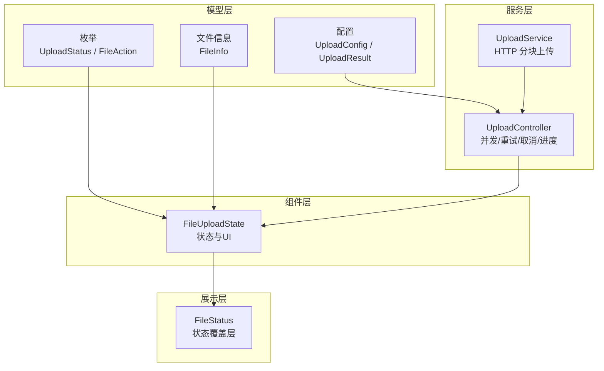
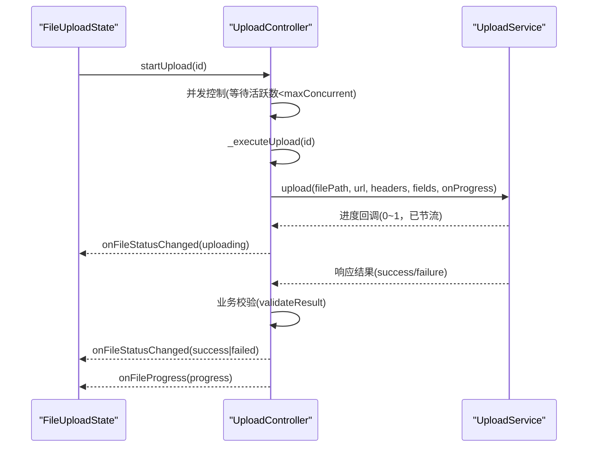
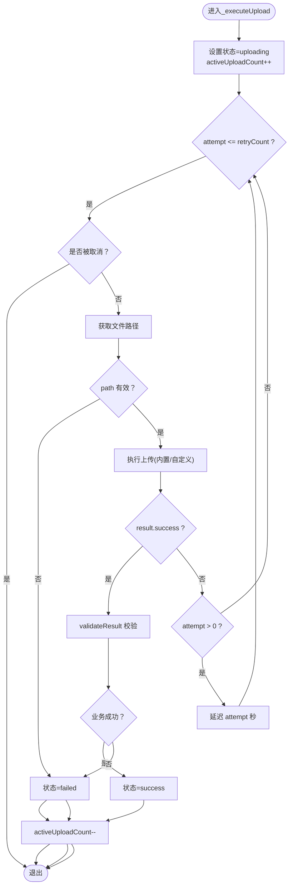
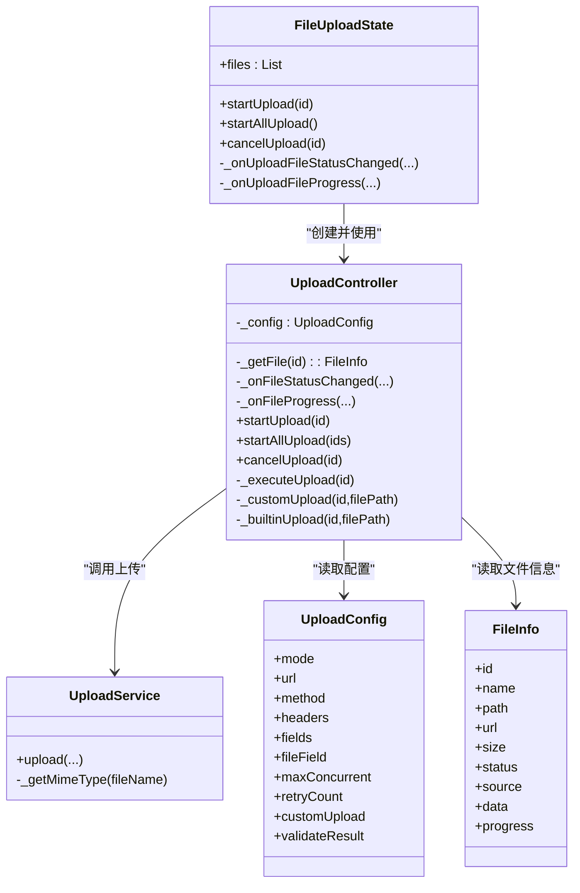

# 上传控制和进度管理

<cite>
**本文引用的文件**
- [lib/src/file_upload/service/upload_controller.dart](file://lib/src/file_upload/service/upload_controller.dart)
- [lib/src/file_upload/service/upload_service.dart](file://lib/src/file_upload/service/upload_service.dart)
- [lib/src/file_upload/model/enum.dart](file://lib/src/file_upload/model/enum.dart)
- [lib/src/file_upload/model/upload_config.dart](file://lib/src/file_upload/model/upload_config.dart)
- [lib/src/file_upload/model/file_info.dart](file://lib/src/file_upload/model/file_info.dart)
- [lib/src/file_upload/file_upload.dart](file://lib/src/file_upload/file_upload.dart)
- [lib/src/file_upload/widgets/file_status.dart](file://lib/src/file_upload/widgets/file_status.dart)
- [lib/src/file_upload/readme.md](file://lib/src/file_upload/readme.md)
</cite>

## 目录
1. [简介](#简介)
2. [项目结构](#项目结构)
3. [核心组件](#核心组件)
4. [架构总览](#架构总览)
5. [详细组件分析](#详细组件分析)
6. [依赖关系分析](#依赖关系分析)
7. [性能与内存优化](#性能与内存优化)
8. [故障排查指南](#故障排查指南)
9. [结论](#结论)
10. [附录：常用场景示例路径](#附录常用场景示例路径)

## 简介
本文件聚焦 Lite UI 文件上传组件的“上传控制与进度管理”能力，围绕 UploadController 控制器、状态机、进度回调、并发控制、重试机制以及网络请求封装进行系统化说明。文档面向开发者，既提供高层概览，也深入到具体实现细节，帮助快速掌握批量上传、断点续传、错误重试等复杂业务场景的实现思路。

## 项目结构
Lite UI 的文件上传模块采用分层组织：
- 模型层：枚举、配置、文件信息
- 服务层：HTTP 上传服务、上传控制器
- 组件层：FileUpload 状态管理与 UI 渲染
- 展示层：文件状态覆盖层等

图表来源
- [lib/src/file_upload/model/enum.dart:1-105](file://lib/src/file_upload/model/enum.dart#L1-L105)
- [lib/src/file_upload/model/upload_config.dart:1-139](file://lib/src/file_upload/model/upload_config.dart#L1-L139)
- [lib/src/file_upload/model/file_info.dart:1-140](file://lib/src/file_upload/model/file_info.dart#L1-L140)
- [lib/src/file_upload/service/upload_service.dart:1-183](file://lib/src/file_upload/service/upload_service.dart#L1-L183)
- [lib/src/file_upload/service/upload_controller.dart:1-162](file://lib/src/file_upload/service/upload_controller.dart#L1-L162)
- [lib/src/file_upload/file_upload.dart:1-594](file://lib/src/file_upload/file_upload.dart#L1-L594)
- [lib/src/file_upload/widgets/file_status.dart:1-37](file://lib/src/file_upload/widgets/file_status.dart#L1-L37)

章节来源
- [lib/src/file_upload/index.dart:1-6](file://lib/src/file_upload/index.dart#L1-L6)
- [lib/lite_ui.dart:1-19](file://lib/lite_ui.dart#L1-L19)

## 核心组件
- UploadController：上传流程控制器，负责并发控制、重试、取消、进度追踪与内置/自定义上传分发。
- UploadService：内置 HTTP 上传服务，基于 dart:io 以 multipart/form-data 分块发送并上报进度。
- FileUploadState：组件状态管理，维护文件列表、触发上传、处理状态变更与进度回调。
- FileInfo / UploadConfig / UploadStatus：数据模型与枚举，描述文件生命周期与上传行为。
- FileStatus：根据 UploadStatus 在卡片上叠加状态指示（待上传、上传中、成功、失败）。

章节来源
- [lib/src/file_upload/service/upload_controller.dart:10-34](file://lib/src/file_upload/service/upload_controller.dart#L10-L34)
- [lib/src/file_upload/service/upload_service.dart:8-32](file://lib/src/file_upload/service/upload_service.dart#L8-L32)
- [lib/src/file_upload/file_upload.dart:167-176](file://lib/src/file_upload/file_upload.dart#L167-L176)
- [lib/src/file_upload/model/file_info.dart:4-10](file://lib/src/file_upload/model/file_info.dart#L4-L10)
- [lib/src/file_upload/model/upload_config.dart:31-38](file://lib/src/file_upload/model/upload_config.dart#L31-L38)
- [lib/src/file_upload/model/enum.dart:1-14](file://lib/src/file_upload/model/enum.dart#L1-L14)
- [lib/src/file_upload/widgets/file_status.dart:5-12](file://lib/src/file_upload/widgets/file_status.dart#L5-L12)

## 架构总览
UploadController 作为中枢，协调 UI 状态与底层上传服务；FileUploadState 持有文件列表并通过回调同步状态与进度；UploadService 负责实际的 HTTP 传输与进度节流上报。

图表来源
- [lib/src/file_upload/file_upload.dart:296-316](file://lib/src/file_upload/file_upload.dart#L296-L316)
- [lib/src/file_upload/service/upload_controller.dart:36-49](file://lib/src/file_upload/service/upload_controller.dart#L36-L49)
- [lib/src/file_upload/service/upload_controller.dart:67-122](file://lib/src/file_upload/service/upload_controller.dart#L67-L122)
- [lib/src/file_upload/service/upload_service.dart:23-32](file://lib/src/file_upload/service/upload_service.dart#L23-L32)

## 详细组件分析

### UploadController 控制器
职责
- 并发控制：通过 activeUploadCount 与 maxConcurrent 限制同时进行的上传任务数量。
- 重试逻辑：按 retryCount 次数循环执行，每次重试前短暂延迟。
- 取消支持：使用 _cancelFlags 标记取消，并在关键节点检查。
- 进度追踪：将进度回调透传给上层。
- 上传分发：根据模式选择内置或自定义上传。

核心方法
- startUpload(id)：开始单个文件上传，受并发上限限制。
- startAllUpload(ids)：批量启动多个文件的上传。
- cancelUpload(id)：取消指定文件上传，恢复为 pending。
- _executeUpload(id)：内部执行上传，含重试与最终状态派发。
- _customUpload(id, filePath)：调用自定义上传函数。
- _builtinUpload(id, filePath)：调用内置 HTTP 上传。

并发与重试流程图

图表来源
- [lib/src/file_upload/service/upload_controller.dart:67-122](file://lib/src/file_upload/service/upload_controller.dart#L67-L122)

章节来源
- [lib/src/file_upload/service/upload_controller.dart:10-34](file://lib/src/file_upload/service/upload_controller.dart#L10-L34)
- [lib/src/file_upload/service/upload_controller.dart:36-49](file://lib/src/file_upload/service/upload_controller.dart#L36-L49)
- [lib/src/file_upload/service/upload_controller.dart:54-57](file://lib/src/file_upload/service/upload_controller.dart#L54-L57)
- [lib/src/file_upload/service/upload_controller.dart:59-65](file://lib/src/file_upload/service/upload_controller.dart#L59-L65)
- [lib/src/file_upload/service/upload_controller.dart:124-162](file://lib/src/file_upload/service/upload_controller.dart#L124-L162)

### UploadService 内置 HTTP 上传
职责
- 构建 multipart/form-data 请求体，包含额外字段与文件部分。
- 分块发送数据，节流上报进度，避免频繁刷新 UI。
- 统一异常捕获与结果封装。

关键点
- Content-Type 与 boundary 动态生成。
- 分块大小 32KB，每块计算百分比并去重上报。
- 定期让出事件循环，保证 UI 流畅。
- 返回 UploadResult，解析 JSON 响应体。

章节来源
- [lib/src/file_upload/service/upload_service.dart:8-32](file://lib/src/file_upload/service/upload_service.dart#L8-L32)
- [lib/src/file_upload/service/upload_service.dart:58-104](file://lib/src/file_upload/service/upload_service.dart#L58-L104)
- [lib/src/file_upload/service/upload_service.dart:108-135](file://lib/src/file_upload/service/upload_service.dart#L108-L135)
- [lib/src/file_upload/service/upload_service.dart:137-181](file://lib/src/file_upload/service/upload_service.dart#L137-L181)

### FileUploadState 状态管理
职责
- 维护文件列表与初始回显同步。
- 暴露 startUpload、startAllUpload、cancelUpload 等方法。
- 处理控制器回调，更新状态与触发外部回调。

关键点
- 自动上传：在 auto/custom 模式下，选择文件后自动触发。
- 进度回调：更新 progress 并通知父组件。
- 状态映射：将 UploadStatus 映射为 FileAction 通知上层。

章节来源
- [lib/src/file_upload/file_upload.dart:167-176](file://lib/src/file_upload/file_upload.dart#L167-L176)
- [lib/src/file_upload/file_upload.dart:280-289](file://lib/src/file_upload/file_upload.dart#L280-L289)
- [lib/src/file_upload/file_upload.dart:296-316](file://lib/src/file_upload/file_upload.dart#L296-L316)
- [lib/src/file_upload/file_upload.dart:318-337](file://lib/src/file_upload/file_upload.dart#L318-L337)
- [lib/src/file_upload/file_upload.dart:341-375](file://lib/src/file_upload/file_upload.dart#L341-L375)

### 数据模型与枚举
- UploadStatus：pending、uploading、success、failed。
- FileAction：defaultLoad、add、remove、uploading、progress、success、failed。
- UploadConfig：mode、url、method、headers、fields、fileField、maxConcurrent、retryCount、customUpload、validateResult。
- UploadResult：success、data、error。
- FileInfo：id、name、path、url、size、status、source、data、progress、时间戳等。

章节来源
- [lib/src/file_upload/model/enum.dart:1-105](file://lib/src/file_upload/model/enum.dart#L1-L105)
- [lib/src/file_upload/model/upload_config.dart:31-98](file://lib/src/file_upload/model/upload_config.dart#L31-L98)
- [lib/src/file_upload/model/upload_config.dart:101-138](file://lib/src/file_upload/model/upload_config.dart#L101-L138)
- [lib/src/file_upload/model/file_info.dart:4-78](file://lib/src/file_upload/model/file_info.dart#L4-L78)

### 状态覆盖层 FileStatus
根据 UploadStatus 显示不同覆盖样式：
- pending：底部半透明条显示“待上传”。
- uploading：底部标签条显示进度百分比。
- success：左上角绿色对勾徽标。
- failed：全遮罩 + 红色错误图标 + “上传失败”，并提供重试入口。

章节来源
- [lib/src/file_upload/widgets/file_status.dart:5-12](file://lib/src/file_upload/widgets/file_status.dart#L5-L12)
- [lib/src/file_upload/widgets/file_status.dart:12-34](file://lib/src/file_upload/widgets/file_status.dart#L12-L34)

## 依赖关系分析
- FileUploadState 依赖 UploadController 与 UploadService。
- UploadController 依赖 UploadConfig、FileInfo、UploadStatus、UploadService。
- UploadService 依赖 dart:io 与 json 编解码。
- UI 层依赖枚举与模型进行渲染。

图表来源
- [lib/src/file_upload/file_upload.dart:296-316](file://lib/src/file_upload/file_upload.dart#L296-L316)
- [lib/src/file_upload/service/upload_controller.dart:22-34](file://lib/src/file_upload/service/upload_controller.dart#L22-L34)
- [lib/src/file_upload/service/upload_service.dart:12-32](file://lib/src/file_upload/service/upload_service.dart#L12-L32)
- [lib/src/file_upload/model/upload_config.dart:31-98](file://lib/src/file_upload/model/upload_config.dart#L31-L98)
- [lib/src/file_upload/model/file_info.dart:4-78](file://lib/src/file_upload/model/file_info.dart#L4-L78)

章节来源
- [lib/src/file_upload/file_upload.dart:296-316](file://lib/src/file_upload/file_upload.dart#L296-L316)
- [lib/src/file_upload/service/upload_controller.dart:22-34](file://lib/src/file_upload/service/upload_controller.dart#L22-L34)
- [lib/src/file_upload/service/upload_service.dart:12-32](file://lib/src/file_upload/service/upload_service.dart#L12-L32)

## 性能与内存优化
- 并发控制：通过 maxConcurrent 限制同时上传数量，避免资源争用与 UI 卡顿。
- 进度节流：UploadService 分块发送并按百分比去重上报，减少 setState 频率。
- 事件循环让出：每若干字节让出一次，确保 UI 能及时刷新。
- 内存管理：
  - 大文件分块读取与发送，避免一次性加载到内存。
  - 上传完成后关闭 HttpClient，释放连接。
  - 文件列表仅保留必要字段，避免冗余对象。
- 建议：
  - 合理设置 maxConcurrent（通常 2-5），根据网络与设备性能调整。
  - 使用 validateResult 尽早判定业务失败，减少无效重试。
  - 在 custom 模式下，结合缓存与压缩策略降低带宽占用。

章节来源
- [lib/src/file_upload/service/upload_controller.dart:43-46](file://lib/src/file_upload/service/upload_controller.dart#L43-L46)
- [lib/src/file_upload/service/upload_service.dart:82-104](file://lib/src/file_upload/service/upload_service.dart#L82-L104)
- [lib/src/file_upload/service/upload_service.dart:131-134](file://lib/src/file_upload/service/upload_service.dart#L131-L134)

## 故障排查指南
常见问题与定位要点
- 未配置 url：内置上传会直接返回失败，需检查 UploadConfig.url。
- 文件路径为空：无法上传，检查 FileInfo.path 是否正确赋值。
- 业务校验失败：validateResult 返回 false 时视为失败，检查服务端响应结构与校验逻辑。
- 网络异常：SocketException/HttpException 会被捕获并转为失败结果，检查网络环境与权限。
- Web 平台不可用：UploadService 基于 dart:io，Web 端请使用 UploadMode.custom。

章节来源
- [lib/src/file_upload/service/upload_controller.dart:138-141](file://lib/src/file_upload/service/upload_controller.dart#L138-L141)
- [lib/src/file_upload/service/upload_controller.dart:87-94](file://lib/src/file_upload/service/upload_controller.dart#L87-L94)
- [lib/src/file_upload/service/upload_controller.dart:104-117](file://lib/src/file_upload/service/upload_controller.dart#L104-L117)
- [lib/src/file_upload/service/upload_service.dart:122-134](file://lib/src/file_upload/service/upload_service.dart#L122-L134)
- [lib/src/file_upload/service/upload_service.dart:8-11](file://lib/src/file_upload/service/upload_service.dart#L8-L11)

## 结论
UploadController 提供了完善的上传生命周期管理能力，配合 UploadService 的分块上传与进度节流，以及 FileUploadState 的状态同步，能够支撑从基础选择到复杂业务场景的多样化需求。通过合理的并发控制、重试策略与业务校验，可以在保证用户体验的同时提升系统稳定性与性能。

## 附录：常用场景示例路径
- 仅选择文件（不上传）：[readme.md:40-53](file://lib/src/file_upload/readme.md#L40-L53)
- 自动上传：[readme.md:55-71](file://lib/src/file_upload/readme.md#L55-L71)
- 手动上传：[readme.md:73-91](file://lib/src/file_upload/readme.md#L73-L91)
- 自定义上传函数：[readme.md:93-113](file://lib/src/file_upload/readme.md#L93-L113)
- API 参考（参数表）：[readme.md:186-238](file://lib/src/file_upload/readme.md#L186-L238)