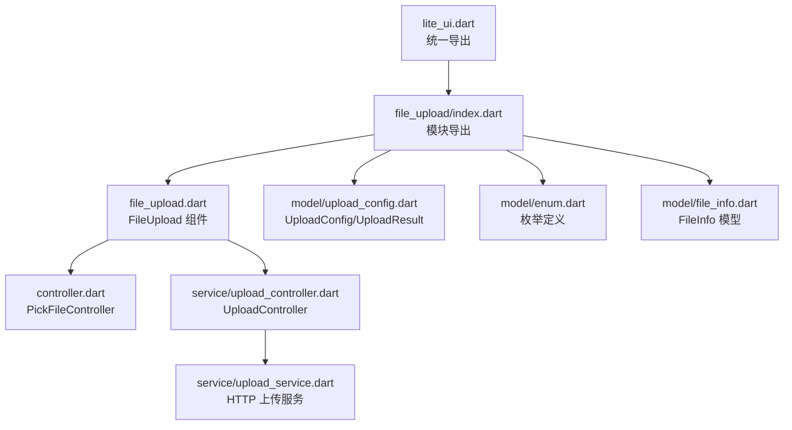
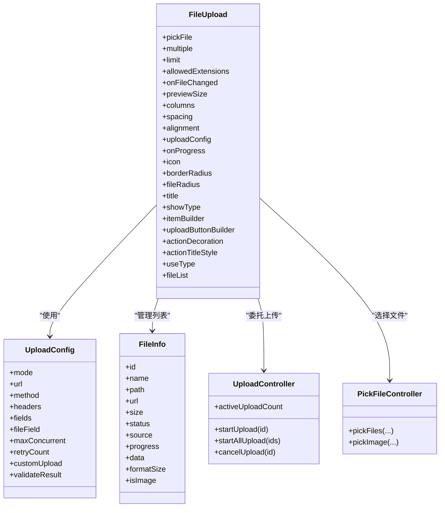
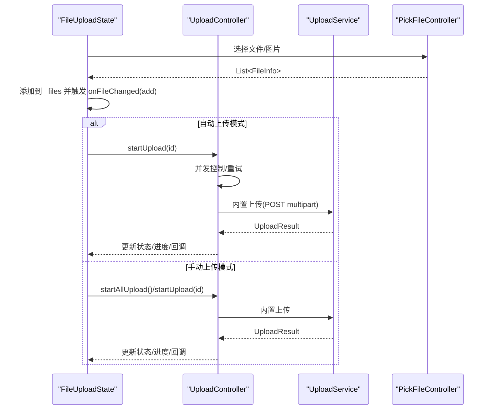

# 基础用法和配置

<cite>
**本文引用的文件**   
- [lib/lite_ui.dart](file://lib/lite_ui.dart)
- [lib/src/file_upload/index.dart](file://lib/src/file_upload/index.dart)
- [lib/src/file_upload/file_upload.dart](file://lib/src/file_upload/file_upload.dart)
- [lib/src/file_upload/model/upload_config.dart](file://lib/src/file_upload/model/upload_config.dart)
- [lib/src/file_upload/model/enum.dart](file://lib/src/file_upload/model/enum.dart)
- [lib/src/file_upload/model/file_info.dart](file://lib/src/file_upload/model/file_info.dart)
- [lib/src/file_upload/controller.dart](file://lib/src/file_upload/controller.dart)
- [lib/src/file_upload/service/upload_controller.dart](file://lib/src/file_upload/service/upload_controller.dart)
- [lib/src/file_upload/readme.md](file://lib/src/file_upload/readme.md)
</cite>

## 目录
1. [简介](#简介)
2. [项目结构](#项目结构)
3. [核心组件](#核心组件)
4. [架构总览](#架构总览)
5. [详细组件分析](#详细组件分析)
6. [依赖关系分析](#依赖关系分析)
7. [性能与并发特性](#性能与并发特性)
8. [常见问题与最佳实践](#常见问题与最佳实践)
9. [结论](#结论)
10. [附录：API 速查](#附录api-速查)

## 简介
本章节面向 Lite UI 的文件上传组件 FileUpload，聚焦“基础用法与配置”。内容涵盖：
- FileUpload 的基本使用方法（构造函数参数、基本属性、事件回调）
- UploadConfig 配置类的完整参数说明（如 mode、url、method、headers、fields、fileField、maxConcurrent、retryCount、customUpload、validateResult）
- 三种上传模式（自动 auto、手动 manual、自定义 custom）的配置方法与适用场景
- 初始化、设置属性、处理回调的完整示例路径
- 常见配置问题与最佳实践建议

## 项目结构
FileUpload 组件位于 lib/src/file_upload 目录下，采用分层组织：
- model：枚举、模型（FileInfo、UploadConfig、UploadResult）
- service：上传控制器与服务（UploadController、UploadService）
- widgets：UI 展示与交互（卡片、列表、选择器、操作区等）
- controller：文件选择控制器（PickFileController）
- index.dart：对外导出入口

图表来源
- [lib/lite_ui.dart:1-19](file://lib/lite_ui.dart#L1-L19)
- [lib/src/file_upload/index.dart:1-6](file://lib/src/file_upload/index.dart#L1-L6)
- [lib/src/file_upload/file_upload.dart:1-20](file://lib/src/file_upload/file_upload.dart#L1-L20)
- [lib/src/file_upload/model/upload_config.dart:1-20](file://lib/src/file_upload/model/upload_config.dart#L1-L20)
- [lib/src/file_upload/model/enum.dart:1-20](file://lib/src/file_upload/model/enum.dart#L1-L20)
- [lib/src/file_upload/model/file_info.dart:1-20](file://lib/src/file_upload/model/file_info.dart#L1-L20)
- [lib/src/file_upload/controller.dart:1-10](file://lib/src/file_upload/controller.dart#L1-L10)
- [lib/src/file_upload/service/upload_controller.dart:1-15](file://lib/src/file_upload/service/upload_controller.dart#L1-L15)

章节来源
- [lib/lite_ui.dart:1-19](file://lib/lite_ui.dart#L1-L19)
- [lib/src/file_upload/index.dart:1-6](file://lib/src/file_upload/index.dart#L1-L6)

## 核心组件
- FileUpload：Flutter StatefulWidget，负责文件选择、展示、上传流程控制与状态同步。支持多种展示模式（卡片/列表/自定义）、数量限制、多选/单选、头像模式等。
- UploadConfig：上传配置类，定义上传模式、接口地址、请求方法、请求头、表单字段、并发数、重试次数、自定义上传函数与结果校验。
- FileInfo：文件信息模型，包含 id、name、path、url、size、status、source、progress、data 等，并提供 isImage、formatSize 等便捷属性。
- UploadController：上传流程控制器，管理并发、重试、取消、进度上报与内置/自定义上传分发。
- PickFileController：封装 file_picker 与 image_picker，提供统一的选择文件/图片能力。

章节来源
- [lib/src/file_upload/file_upload.dart:15-165](file://lib/src/file_upload/file_upload.dart#L15-L165)
- [lib/src/file_upload/model/upload_config.dart:31-99](file://lib/src/file_upload/model/upload_config.dart#L31-L99)
- [lib/src/file_upload/model/file_info.dart:10-74](file://lib/src/file_upload/model/file_info.dart#L10-L74)
- [lib/src/file_upload/service/upload_controller.dart:22-34](file://lib/src/file_upload/service/upload_controller.dart#L22-L34)
- [lib/src/file_upload/controller.dart:11-34](file://lib/src/file_upload/controller.dart#L11-L34)

## 架构总览
FileUpload 通过 State 管理内部文件列表与上传控制器，结合 UploadConfig 决定上传行为。选择器由 PickFileController 统一封装；上传由 UploadController 调度，根据模式选择内置 HTTP 或自定义上传函数。

图表来源
- [lib/src/file_upload/file_upload.dart:15-165](file://lib/src/file_upload/file_upload.dart#L15-L165)
- [lib/src/file_upload/model/upload_config.dart:31-99](file://lib/src/file_upload/model/upload_config.dart#L31-L99)
- [lib/src/file_upload/model/file_info.dart:10-74](file://lib/src/file_upload/model/file_info.dart#L10-L74)
- [lib/src/file_upload/service/upload_controller.dart:22-34](file://lib/src/file_upload/service/upload_controller.dart#L22-L34)
- [lib/src/file_upload/controller.dart:11-34](file://lib/src/file_upload/controller.dart#L11-L34)

## 详细组件分析

### FileUpload 组件
- 构造参数要点
  - pickFile：选择器类型（file/gallery/camera/imageOrCamera/all）
  - multiple：是否多选（默认 true）
  - limit：最大数量（-1 表示不限制），达到上限后隐藏上传按钮
  - allowedExtensions：允许扩展名（仅在 file 模式下生效）
  - showType：展示模式（card/textInfo/custom）
  - previewSize/columns：卡片尺寸或列数（二者互斥）
  - spacing/alignment：间距与对齐
  - uploadConfig：启用上传能力（auto/manual/custom）
  - onFileChanged：文件变更回调（add/remove/uploading/progress/success/failed/defaultLoad）
  - onProgress：上传进度回调（id, path, progress）
  - useType：normal/avatar（头像模式强制 limit=1、multiple=false、imageOrCamera）
  - fileList：编辑模式回显（推荐用 FileInfo.existing 或 url 标识已上传）
  - 其他样式：icon、borderRadius、fileRadius、title、actionDecoration、actionTitleStyle、uploadButtonBuilder、itemBuilder
- 状态管理与公开方法
  - startUpload(id)、startAllUpload()、cancelUpload(id)、updateFileStatus(id, status)、files（只读）
  - 内部维护 _files 列表，监听外部 fileList 变化并同步，避免重复触发父组件 setState
- 事件流
  - 选择文件后触发 onFileChanged(add)，并在 auto/custom 模式下自动开始上传
  - 上传中/成功/失败时触发对应 action，并调用 onProgress 回调

章节来源
- [lib/src/file_upload/file_upload.dart:15-165](file://lib/src/file_upload/file_upload.dart#L15-L165)
- [lib/src/file_upload/file_upload.dart:173-234](file://lib/src/file_upload/file_upload.dart#L173-L234)
- [lib/src/file_upload/file_upload.dart:296-337](file://lib/src/file_upload/file_upload.dart#L296-L337)
- [lib/src/file_upload/file_upload.dart:379-447](file://lib/src/file_upload/file_upload.dart#L379-L447)

### UploadConfig 配置类
- 关键参数
  - mode：UploadMode.auto/manual/custom
  - url：上传接口地址（auto/manual 必填）
  - method：HTTP 方法（默认 POST）
  - headers：自定义请求头
  - fields：额外表单字段（multipart/form-data）
  - fileField：文件字段名（默认 "file"）
  - maxConcurrent：最大并发上传数（默认 3）
  - retryCount：失败自动重试次数（默认 0）
  - customUpload：自定义上传函数（custom 必填）
  - validateResult：业务结果校验（未提供则默认 HTTP 2xx 即成功）
- UploadResult
  - success/data/error：成功标志、服务端响应数据（JSON Map）、错误信息
  - successFromRaw：从原始响应字符串解析为 JSON 并创建成功结果

章节来源
- [lib/src/file_upload/model/upload_config.dart:31-99](file://lib/src/file_upload/model/upload_config.dart#L31-L99)
- [lib/src/file_upload/model/upload_config.dart:101-139](file://lib/src/file_upload/model/upload_config.dart#L101-L139)

### FileInfo 模型
- 字段说明
  - id：唯一标识（雪花算法生成）
  - name/path/url/size/status/source/progress/data/createTime/updateTime
  - formatSize：格式化文件大小（KB/MB/GB）
  - isImage：是否为图片（基于扩展名判断）
- 构造逻辑
  - 若 url 存在且以 http(s) 开头，自动标记为 success 与 network 来源

章节来源
- [lib/src/file_upload/model/file_info.dart:10-74](file://lib/src/file_upload/model/file_info.dart#L10-L74)
- [lib/src/file_upload/model/file_info.dart:111-135](file://lib/src/file_upload/model/file_info.dart#L111-L135)

### 上传控制器与流程
- UploadController
  - 并发控制：等待活跃数低于 maxConcurrent
  - 重试逻辑：按 retryCount 进行指数退避式延迟重试
  - 取消支持：cancelUpload 将状态恢复为 pending
  - 进度追踪：通过 onProgress 回调上报 0.0~1.0 进度
  - 上传分发：根据 mode 选择内置 HTTP 或自定义上传函数
- 内置上传
  - 使用 UploadService.upload，支持 method、headers、fields、fileField、fileName、onProgress
- 自定义上传
  - 传入 customUpload(file, onProgress)，返回 UploadResult

章节来源
- [lib/src/file_upload/service/upload_controller.dart:22-34](file://lib/src/file_upload/service/upload_controller.dart#L22-L34)
- [lib/src/file_upload/service/upload_controller.dart:36-57](file://lib/src/file_upload/service/upload_controller.dart#L36-L57)
- [lib/src/file_upload/service/upload_controller.dart:67-122](file://lib/src/file_upload/service/upload_controller.dart#L67-L122)
- [lib/src/file_upload/service/upload_controller.dart:124-161](file://lib/src/file_upload/service/upload_controller.dart#L124-L161)

### 文件选择控制器
- PickFileController
  - pickFiles：支持多选/单选、扩展名过滤、剩余数量限制
  - pickImage：相册多选/单选、拍照（仅单选），返回 FileInfo 列表

章节来源
- [lib/src/file_upload/controller.dart:11-67](file://lib/src/file_upload/controller.dart#L11-L67)

### 上传模式与适用场景
- 自动上传（UploadMode.auto）
  - 选择文件后立即开始上传，适合简单上传场景
  - 需提供 url
- 手动上传（UploadMode.manual）
  - 选择文件后需调用 startUpload/startAllUpload 触发，适合需要用户确认的场景
  - 需提供 url
- 自定义上传（UploadMode.custom）
  - 完全由外部控制上传逻辑，适合已有网络库封装或复杂业务逻辑
  - 需提供 customUpload

章节来源
- [lib/src/file_upload/model/upload_config.dart:19-29](file://lib/src/file_upload/model/upload_config.dart#L19-L29)
- [lib/src/file_upload/file_upload.dart:282-289](file://lib/src/file_upload/file_upload.dart#L282-L289)

### 代码示例路径
- 仅选择文件（不上传）
  - [lib/src/file_upload/readme.md:40-53](file://lib/src/file_upload/readme.md#L40-L53)
- 自动上传
  - [lib/src/file_upload/readme.md:55-71](file://lib/src/file_upload/readme.md#L55-L71)
- 手动上传
  - [lib/src/file_upload/readme.md:73-91](file://lib/src/file_upload/readme.md#L73-L91)
- 自定义上传函数
  - [lib/src/file_upload/readme.md:93-114](file://lib/src/file_upload/readme.md#L93-L114)
- 卡片模式
  - [lib/src/file_upload/readme.md:116-140](file://lib/src/file_upload/readme.md#L116-L140)
- 列表模式
  - [lib/src/file_upload/readme.md:142-152](file://lib/src/file_upload/readme.md#L142-L152)
- 自定义模式
  - [lib/src/file_upload/readme.md:154-170](file://lib/src/file_upload/readme.md#L154-L170)
- 编辑模式（回显）
  - [lib/src/file_upload/readme.md:172-184](file://lib/src/file_upload/readme.md#L172-L184)

## 依赖关系分析
- FileUpload 依赖：
  - model（UploadConfig、FileInfo、枚举）
  - service（UploadController、UploadService）
  - widgets（卡片/列表/选择器/操作区）
  - controller（PickFileController）
- 耦合与内聚：
  - FileUploadState 持有 _files 与 UploadController，职责清晰
  - UploadController 专注上传生命周期，不持有文件列表，通过回调与外部通信
  - PickFileController 解耦 UI 与底层选择器实现

图表来源
- [lib/src/file_upload/file_upload.dart:379-447](file://lib/src/file_upload/file_upload.dart#L379-L447)
- [lib/src/file_upload/service/upload_controller.dart:36-57](file://lib/src/file_upload/service/upload_controller.dart#L36-L57)
- [lib/src/file_upload/service/upload_controller.dart:67-122](file://lib/src/file_upload/service/upload_controller.dart#L67-L122)
- [lib/src/file_upload/controller.dart:11-67](file://lib/src/file_upload/controller.dart#L11-L67)

章节来源
- [lib/src/file_upload/file_upload.dart:379-447](file://lib/src/file_upload/file_upload.dart#L379-L447)
- [lib/src/file_upload/service/upload_controller.dart:36-57](file://lib/src/file_upload/service/upload_controller.dart#L36-L57)

## 性能与并发特性
- 并发控制：UploadController 通过 activeUploadCount 与 maxConcurrent 限制同时上传数量，超出时等待
- 重试机制：按 retryCount 进行重试，每次重试前短暂延迟，提升稳定性
- 取消支持：cancelUpload 将状态恢复为 pending，便于用户重新触发
- 进度上报：onProgress 实时上报 0.0~1.0，可用于 UI 进度条
- 内存与重建优化：
  - FileUploadState 在 didUpdateWidget 中比较 fileList 引用与签名，避免无效 rebuild
  - 初始加载通知仅触发一次，防止无限循环

章节来源
- [lib/src/file_upload/service/upload_controller.dart:36-57](file://lib/src/file_upload/service/upload_controller.dart#L36-L57)
- [lib/src/file_upload/service/upload_controller.dart:67-122](file://lib/src/file_upload/service/upload_controller.dart#L67-L122)
- [lib/src/file_upload/file_upload.dart:190-234](file://lib/src/file_upload/file_upload.dart#L190-L234)

## 常见问题与最佳实践
- 常见问题
  - 未配置 url（auto/manual 模式）导致上传失败
  - previewSize 与 columns 同时设置引发断言错误
  - 头像模式下 pickFile 不支持任意值（仅 gallery/camera/imageOrCamera）
  - 上传中文件不允许删除（避免状态不一致）
  - 自定义模式未提供 customUpload 导致无法上传
- 最佳实践
  - 使用 UploadConfig.validateResult 对业务结果进行校验，确保成功语义正确
  - 合理设置 maxConcurrent，平衡吞吐与服务器压力
  - 使用 fileList 回显时，优先使用 url 标识已上传文件，避免本地路径缺失
  - 在手动模式下，提供明确的“全部上传”按钮，提升用户体验
  - 使用 onFileChanged 监听 add/remove/success/failed 等动作，统一管理状态

章节来源
- [lib/src/file_upload/file_upload.dart:156-161](file://lib/src/file_upload/file_upload.dart#L156-L161)
- [lib/src/file_upload/file_upload.dart:259-264](file://lib/src/file_upload/file_upload.dart#L259-L264)
- [lib/src/file_upload/model/upload_config.dart:72-85](file://lib/src/file_upload/model/upload_config.dart#L72-L85)
- [lib/src/file_upload/service/upload_controller.dart:138-141](file://lib/src/file_upload/service/upload_controller.dart#L138-L141)

## 结论
FileUpload 提供了灵活、可扩展的文件上传能力，覆盖选择、展示、上传全流程。通过 UploadConfig 的三种模式与丰富参数，可适配不同业务场景。配合 FileInfo 与枚举体系，开发者可以高效构建稳定的文件上传功能。

## 附录：API 速查
- FileUpload 参数
  - pickFile/multiple/limit/allowedExtensions/showType/previewSize/columns/spacing/alignment/uploadConfig/onFileChanged/onProgress/icon/borderRadius/fileRadius/title/itemBuilder/uploadButtonBuilder/actionDecoration/actionTitleStyle/useType/fileList
- FileUploadState 公开方法
  - startUpload(id)/startAllUpload()/cancelUpload(id)/updateFileStatus(id,status)/files
- UploadConfig 参数
  - mode/url/method/headers/fields/fileField/maxConcurrent/retryCount/customUpload/validateResult
- FileInfo 字段
  - id/name/path/url/size/status/source/progress/data/formatSize/isImage

章节来源
- [lib/src/file_upload/readme.md:186-267](file://lib/src/file_upload/readme.md#L186-L267)