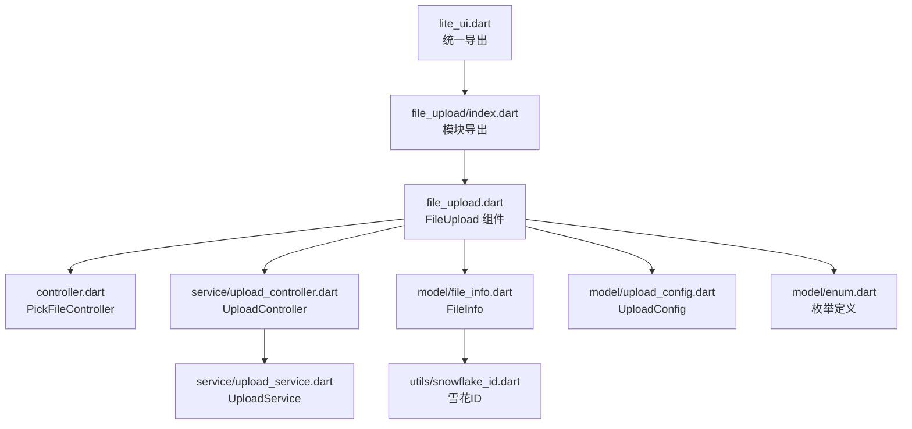
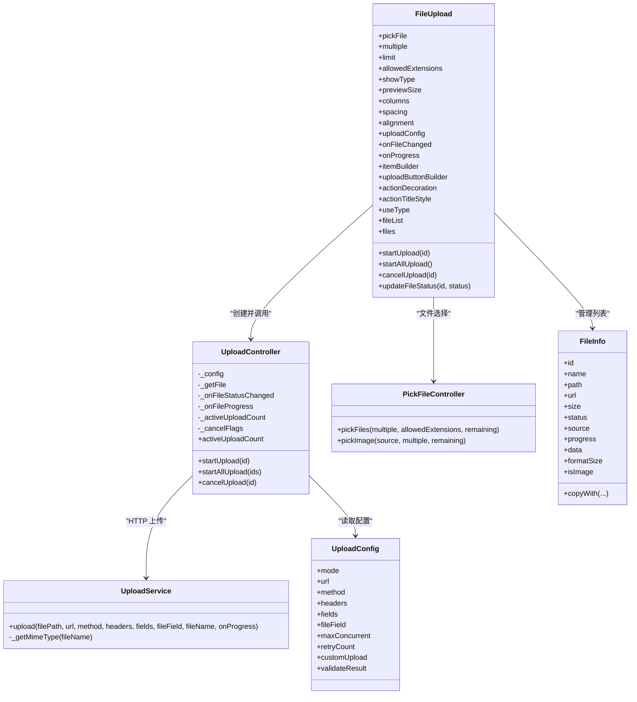
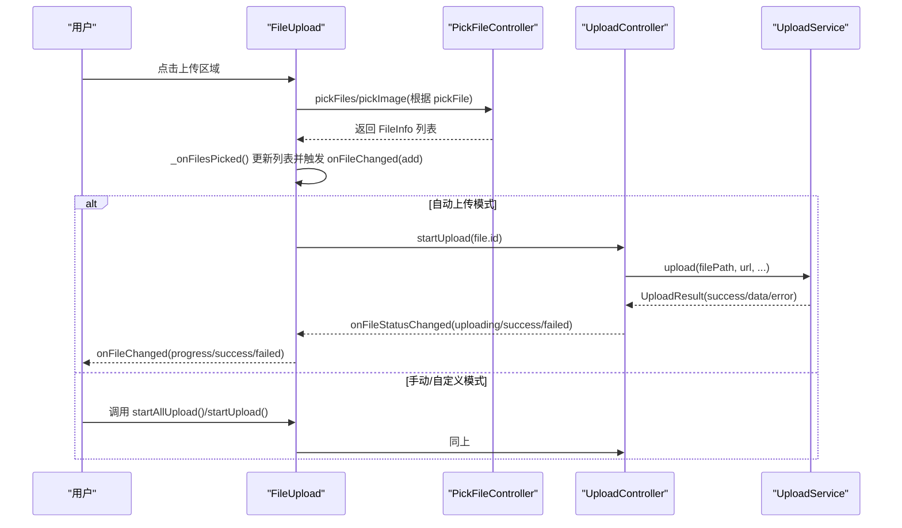
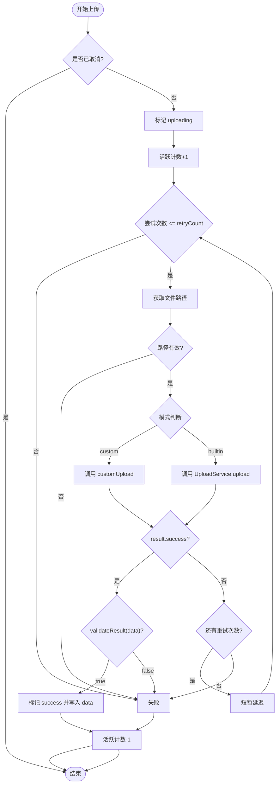
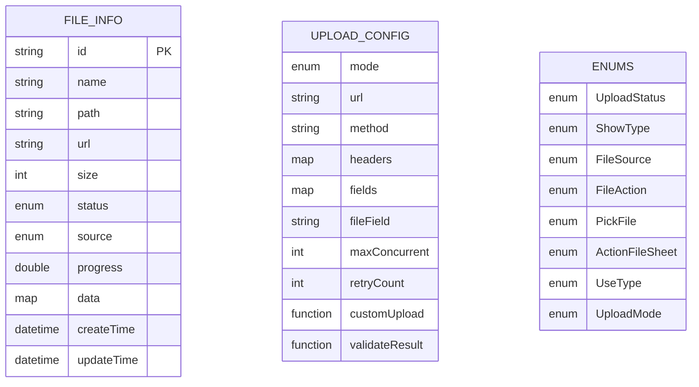
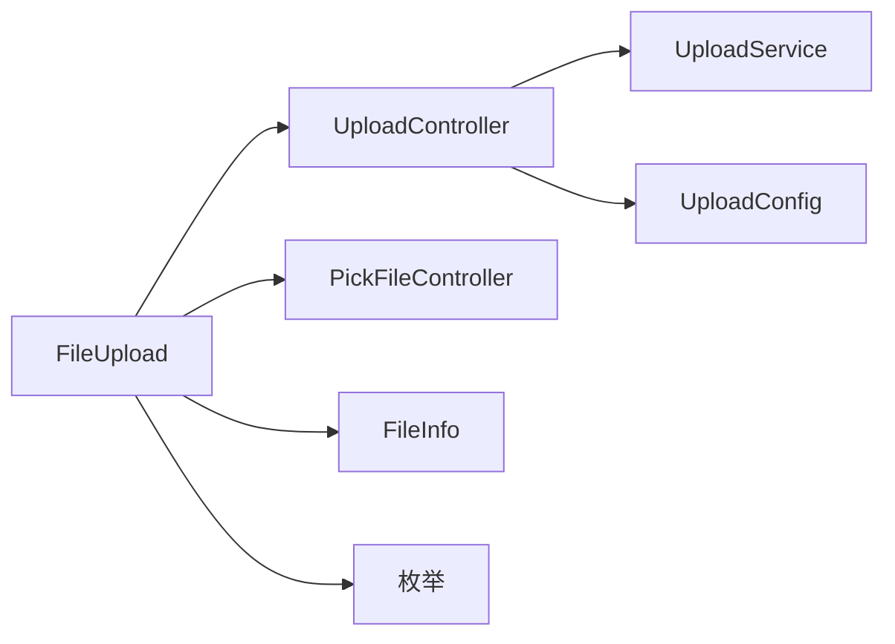

# 文件上传组件

<cite>
**本文引用的文件**   
- [lite_ui.dart](file://lib/lite_ui.dart)
- [file_upload.dart](file://lib/src/file_upload/file_upload.dart)
- [index.dart](file://lib/src/file_upload/index.dart)
- [controller.dart](file://lib/src/file_upload/controller.dart)
- [enum.dart](file://lib/src/file_upload/model/enum.dart)
- [upload_config.dart](file://lib/src/file_upload/model/upload_config.dart)
- [file_info.dart](file://lib/src/file_upload/model/file_info.dart)
- [upload_controller.dart](file://lib/src/file_upload/service/upload_controller.dart)
- [upload_service.dart](file://lib/src/file_upload/service/upload_service.dart)
- [snowflake_id.dart](file://lib/src/file_upload/utils/snowflake_id.dart)
- [readme.md](file://lib/src/file_upload/readme.md)
</cite>

## 目录
1. [简介](#简介)
2. [项目结构](#项目结构)
3. [核心组件](#核心组件)
4. [架构总览](#架构总览)
5. [详细组件分析](#详细组件分析)
6. [依赖关系分析](#依赖关系分析)
7. [性能与内存优化](#性能与内存优化)
8. [故障排查指南](#故障排查指南)
9. [结论](#结论)
10. [附录：API 参考与示例](#附录api-参考与示例)

## 简介
本组件为 Lite UI 的文件上传能力，提供多源文件选择（系统文件、相册、拍照）、三种展示模式（卡片、列表、自定义）以及三种上传模式（自动、手动、自定义）。内置并发控制、重试、进度回调、状态管理与编辑回显，支持大文件分块发送与节流上报，适用于图片、文档等多类型文件的批量上传场景。

## 项目结构
- 入口导出：统一从 lite_ui.dart 暴露 file_upload 模块及相关枚举、模型。
- 组件层：FileUpload StatefulWidget 负责 UI 与交互，内部维护文件列表与上传控制器。
- 控制器层：PickFileController 封装文件选择；UploadController 管理上传生命周期（并发、重试、取消、进度）。
- 服务层：UploadService 实现内置 HTTP 上传（dart:io），Web 平台需使用自定义上传。
- 数据模型：FileInfo、UploadConfig、各类枚举定义数据结构与行为约束。
- 工具类：SnowflakeId 生成唯一 ID。

**图表来源** 
- [lite_ui.dart:1-19](file://lib/lite_ui.dart#L1-L19)
- [index.dart:1-6](file://lib/src/file_upload/index.dart#L1-L6)
- [file_upload.dart:1-165](file://lib/src/file_upload/file_upload.dart#L1-L165)
- [controller.dart:1-68](file://lib/src/file_upload/controller.dart#L1-L68)
- [upload_controller.dart:1-163](file://lib/src/file_upload/service/upload_controller.dart#L1-L163)
- [upload_service.dart:1-183](file://lib/src/file_upload/service/upload_service.dart#L1-L183)
- [file_info.dart:1-140](file://lib/src/file_upload/model/file_info.dart#L1-L140)
- [upload_config.dart:1-139](file://lib/src/file_upload/model/upload_config.dart#L1-L139)
- [enum.dart:1-105](file://lib/src/file_upload/model/enum.dart#L1-L105)
- [snowflake_id.dart:1-40](file://lib/src/file_upload/utils/snowflake_id.dart#L1-L40)

**章节来源**
- [lite_ui.dart:1-19](file://lib/lite_ui.dart#L1-L19)
- [index.dart:1-6](file://lib/src/file_upload/index.dart#L1-L6)

## 核心组件
- FileUpload：StatefulWidget，负责文件选择、预览、操作（删除/替换/重试）、上传触发与状态同步。
- UploadController：集中处理上传流程，包括并发限制、重试、取消、进度上报与结果校验。
- UploadService：基于 dart:io 的 multipart/form-data 上传实现，支持字段、头、文件名与 MIME 推断。
- PickFileController：封装 file_picker 与 image_picker，统一返回 FileInfo 列表。
- FileInfo：文件元数据与状态载体，包含 id、name、path、url、size、status、source、progress、data 等。
- UploadConfig：上传配置，含 mode、url、method、headers、fields、fileField、maxConcurrent、retryCount、customUpload、validateResult。
- 枚举：UploadStatus、ShowType、FileSource、FileAction、PickFile、ActionFileSheet、UseType、UploadMode。

**章节来源**
- [file_upload.dart:15-165](file://lib/src/file_upload/file_upload.dart#L15-L165)
- [upload_controller.dart:10-34](file://lib/src/file_upload/service/upload_controller.dart#L10-L34)
- [upload_service.dart:8-34](file://lib/src/file_upload/service/upload_service.dart#L8-L34)
- [controller.dart:7-11](file://lib/src/file_upload/controller.dart#L7-L11)
- [file_info.dart:4-74](file://lib/src/file_upload/model/file_info.dart#L4-L74)
- [upload_config.dart:31-99](file://lib/src/file_upload/model/upload_config.dart#L31-L99)
- [enum.dart:1-105](file://lib/src/file_upload/model/enum.dart#L1-L105)

## 架构总览
组件采用“UI 层 + 控制器层 + 服务层”的分层设计：
- UI 层（FileUpload）：渲染卡片/列表/自定义项，处理用户交互（选择、删除、替换、重试），通过 onFileChanged/onProgress 向外暴露事件。
- 控制器层（UploadController/PickFileController）：屏蔽底层选择器与网络细节，向上提供稳定接口。
- 服务层（UploadService）：实现具体上传协议（multipart/form-data），并输出标准化 UploadResult。

**图表来源** 
- [file_upload.dart:15-165](file://lib/src/file_upload/file_upload.dart#L15-L165)
- [upload_controller.dart:10-34](file://lib/src/file_upload/service/upload_controller.dart#L10-L34)
- [upload_service.dart:8-34](file://lib/src/file_upload/service/upload_service.dart#L8-L34)
- [controller.dart:7-11](file://lib/src/file_upload/controller.dart#L7-L11)
- [file_info.dart:4-74](file://lib/src/file_upload/model/file_info.dart#L4-L74)
- [upload_config.dart:31-99](file://lib/src/file_upload/model/upload_config.dart#L31-L99)

## 详细组件分析

### FileUpload 组件
- 功能要点
  - 多源选择：支持 file/gallery/camera/imageOrCamera/all，头像模式自动限制为单图。
  - 展示模式：card/textInfo/custom，支持列数或固定尺寸、间距、对齐、圆角、按钮样式定制。
  - 上传模式：auto/manual/custom，自动模式下选择后即刻触发；手动模式通过 startAllUpload/startUpload 触发；自定义模式通过 customUpload 完全接管。
  - 编辑回显：传入 fileList，http 开头 url 自动识别为 success 状态。
  - 文件操作：点击卡片弹出操作 Sheet（预览/重试/替换/删除），删除时阻止上传中文件。
  - 事件回调：onFileChanged 报告 add/remove/uploading/progress/success/failed；onProgress 实时上报进度。
- 关键方法
  - startUpload(id)、startAllUpload()、cancelUpload(id)、updateFileStatus(id, status)、files。
- 状态同步
  - didUpdateWidget 比较外部 fileList 引用与内容签名，避免无效 rebuild；初始加载仅通知一次 defaultLoad。

**图表来源** 
- [file_upload.dart:379-447](file://lib/src/file_upload/file_upload.dart#L379-L447)
- [controller.dart:17-67](file://lib/src/file_upload/controller.dart#L17-L67)
- [upload_controller.dart:36-122](file://lib/src/file_upload/service/upload_controller.dart#L36-L122)
- [upload_service.dart:23-135](file://lib/src/file_upload/service/upload_service.dart#L23-L135)

**章节来源**
- [file_upload.dart:15-165](file://lib/src/file_upload/file_upload.dart#L15-L165)
- [file_upload.dart:173-256](file://lib/src/file_upload/file_upload.dart#L173-L256)
- [file_upload.dart:280-337](file://lib/src/file_upload/file_upload.dart#L280-L337)
- [file_upload.dart:379-447](file://lib/src/file_upload/file_upload.dart#L379-L447)
- [file_upload.dart:452-592](file://lib/src/file_upload/file_upload.dart#L452-L592)

### UploadController 与 UploadService
- 并发控制：按 maxConcurrent 限制活跃上传数，超出则等待。
- 重试逻辑：支持 retryCount 次重试，每次重试前短暂延迟。
- 取消机制：cancelUpload 设置取消标志并恢复 pending 状态。
- 进度上报：节流上报，避免频繁刷新 UI。
- 内置上传：multipart/form-data，支持 headers/fields/fileField/MIME 推断；Web 平台不可用，需 customUpload。
- 结果校验：validateResult 用于业务成功判定，未提供时默认 HTTP 2xx 即成功。

**图表来源** 
- [upload_controller.dart:67-122](file://lib/src/file_upload/service/upload_controller.dart#L67-L122)
- [upload_service.dart:23-135](file://lib/src/file_upload/service/upload_service.dart#L23-L135)

**章节来源**
- [upload_controller.dart:10-34](file://lib/src/file_upload/service/upload_controller.dart#L10-L34)
- [upload_controller.dart:36-122](file://lib/src/file_upload/service/upload_controller.dart#L36-L122)
- [upload_service.dart:8-34](file://lib/src/file_upload/service/upload_service.dart#L8-L34)
- [upload_service.dart:137-181](file://lib/src/file_upload/service/upload_service.dart#L137-L181)

### 数据模型与枚举
- FileInfo：唯一 id（雪花算法）、name、path、url、size、status、source、progress、data、formatSize、isImage、isNetwork、extension、copyWith。
- UploadConfig：mode、url、method、headers、fields、fileField、maxConcurrent、retryCount、customUpload、validateResult。
- 枚举：UploadStatus、ShowType、FileSource、FileAction、PickFile、ActionFileSheet、UseType、UploadMode。

**图表来源** 
- [file_info.dart:4-74](file://lib/src/file_upload/model/file_info.dart#L4-L74)
- [upload_config.dart:31-99](file://lib/src/file_upload/model/upload_config.dart#L31-L99)
- [enum.dart:1-105](file://lib/src/file_upload/model/enum.dart#L1-L105)

**章节来源**
- [file_info.dart:4-139](file://lib/src/file_upload/model/file_info.dart#L4-L139)
- [upload_config.dart:31-139](file://lib/src/file_upload/model/upload_config.dart#L31-L139)
- [enum.dart:1-105](file://lib/src/file_upload/model/enum.dart#L1-L105)
- [snowflake_id.dart:1-40](file://lib/src/file_upload/utils/snowflake_id.dart#L1-L40)

## 依赖关系分析
- 组件对外依赖：image_picker、file_picker、dart:io（仅内置上传）。
- 内部耦合：FileUpload 依赖 UploadController 与 PickFileController；UploadController 依赖 UploadService；所有模块通过枚举与模型解耦。
- 潜在循环依赖：无直接循环，控制器与服务单向依赖。

**图表来源** 
- [file_upload.dart:1-14](file://lib/src/file_upload/file_upload.dart#L1-L14)
- [controller.dart:1-6](file://lib/src/file_upload/controller.dart#L1-L6)
- [upload_controller.dart:1-8](file://lib/src/file_upload/service/upload_controller.dart#L1-L8)
- [upload_service.dart:1-6](file://lib/src/file_upload/service/upload_service.dart#L1-L6)

**章节来源**
- [file_upload.dart:1-14](file://lib/src/file_upload/file_upload.dart#L1-L14)
- [controller.dart:1-6](file://lib/src/file_upload/controller.dart#L1-L6)
- [upload_controller.dart:1-8](file://lib/src/file_upload/service/upload_controller.dart#L1-L8)
- [upload_service.dart:1-6](file://lib/src/file_upload/service/upload_service.dart#L1-L6)

## 性能与内存优化
- 并发控制：maxConcurrent 限制同时上传数量，避免资源争用与服务器压力。
- 进度节流：每 10% 或最后一块才上报进度，减少 UI 刷新频率。
- 分块发送：32KB 分块写入请求流，降低内存峰值。
- 对象复用：FileInfo.copyWith 局部更新，避免全量重建。
- 列表同步：didUpdateWidget 使用签名比较，避免父组件 rebuild 导致的无效同步。
- 大文件建议：优先使用 customUpload 配合流式上传与压缩策略；服务端支持断点续传时结合 range 与分片。

[本节为通用指导，不直接分析具体文件]

## 故障排查指南
- 常见问题
  - Web 平台内置上传不可用：需使用 UploadMode.custom 并提供 customUpload。
  - 未配置 url：内置上传将返回错误提示。
  - 文件路径为空：无法上传，检查选择器返回与平台差异。
  - 业务校验失败：实现 validateResult 以区分传输成功与业务成功。
  - 并发过高导致卡顿：降低 maxConcurrent。
- 调试建议
  - 启用 debugPrint 观察上传日志（内置实现已打印关键步骤）。
  - 使用 onFileChanged 监听状态变化，定位问题阶段。
  - 检查 headers/fields/fileField 是否与后端一致。

**章节来源**
- [upload_service.dart:137-181](file://lib/src/file_upload/service/upload_service.dart#L137-L181)
- [upload_controller.dart:87-122](file://lib/src/file_upload/service/upload_controller.dart#L87-L122)

## 结论
Lite UI 文件上传组件通过清晰的分层设计与完善的控制器/服务抽象，提供了灵活的多源选择、多种展示与上传模式、稳定的状态管理与进度反馈。其并发控制、重试、取消与结果校验机制可满足常见到复杂业务需求。在 Web 平台或特殊网络库集成场景下，可通过自定义上传函数无缝扩展。

[本节为总结性内容，不直接分析具体文件]

## 附录：API 参考与示例

### FileUpload 参数
- pickFile：选择器类型（file/gallery/camera/imageOrCamera/all）
- multiple：是否多选
- limit：数量上限（-1 表示不限制）
- allowedExtensions：允许扩展名（仅 file 模式生效）
- showType：展示模式（card/textInfo/custom）
- previewSize/columns：卡片尺寸或列数（互斥）
- spacing/alignment/borderRadius/fileRadius/title/icon：布局与样式
- uploadConfig：上传配置
- fileList：初始文件列表（编辑回显）
- onFileChanged/onProgress：事件回调
- itemBuilder/uploadButtonBuilder/actionDecoration/actionTitleStyle：自定义 UI
- useType：normal/avatar（头像模式自动覆盖部分参数）

**章节来源**
- [file_upload.dart:15-165](file://lib/src/file_upload/file_upload.dart#L15-L165)
- [readme.md:186-212](file://lib/src/file_upload/readme.md#L186-L212)

### FileUploadState 公开方法
- startUpload(id)：上传指定文件
- startAllUpload()：上传所有待上传文件
- cancelUpload(id)：取消上传
- updateFileStatus(id, status)：手动更新状态
- files：只读当前文件列表

**章节来源**
- [file_upload.dart:291-337](file://lib/src/file_upload/file_upload.dart#L291-L337)
- [readme.md:213-224](file://lib/src/file_upload/readme.md#L213-L224)

### UploadConfig 参数
- mode：auto/manual/custom
- url：上传地址（auto/manual 必填）
- method/headers/fields/fileField：HTTP 相关
- maxConcurrent/retryCount：并发与重试
- customUpload：自定义上传函数
- validateResult：业务成功校验

**章节来源**
- [upload_config.dart:31-99](file://lib/src/file_upload/model/upload_config.dart#L31-L99)
- [readme.md:225-239](file://lib/src/file_upload/readme.md#L225-L239)

### FileInfo 模型
- id/name/path/url/size/status/source/progress/data/createTime/updateTime
- formatSize/isImage/isNetwork/extension/copyWith

**章节来源**
- [file_info.dart:4-139](file://lib/src/file_upload/model/file_info.dart#L4-L139)
- [readme.md:240-255](file://lib/src/file_upload/readme.md#L240-L255)

### 枚举值
- PickFile/ShowType/UploadMode/UploadStatus/FileAction/FileSource/ActionFileSheet/UseType

**章节来源**
- [enum.dart:1-105](file://lib/src/file_upload/model/enum.dart#L1-L105)
- [readme.md:256-267](file://lib/src/file_upload/readme.md#L256-L267)

### 基础用法示例
- 仅选择文件（不上传）
- 自动上传
- 手动上传（GlobalKey 触发）
- 自定义上传函数
- 卡片/列表/自定义展示模式
- 编辑模式回显

**章节来源**
- [readme.md:40-184](file://lib/src/file_upload/readme.md#L40-L184)

### 复杂业务场景实现建议
- 批量上传：使用 startAllUpload，合理设置 maxConcurrent。
- 断点续传：在 customUpload 中实现分片与 Range 请求，结合服务端存储与校验。
- 错误重试：利用 retryCount 与 validateResult 组合，必要时结合指数退避。
- 大文件处理：分块上传、压缩、缩略图预览、懒加载。
- 用户体验：拖拽支持（外层容器拦截）、键盘导航（焦点与 Enter/Space）、无障碍（语义化标签与描述）。

[本节为通用指导，不直接分析具体文件]