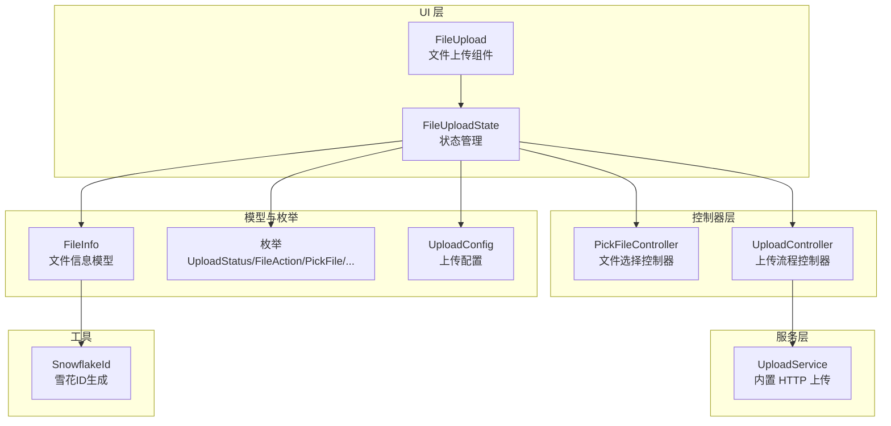
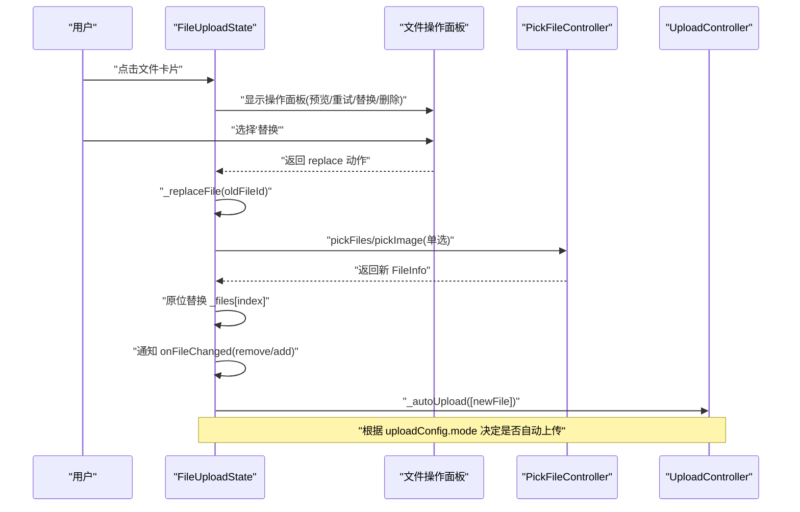
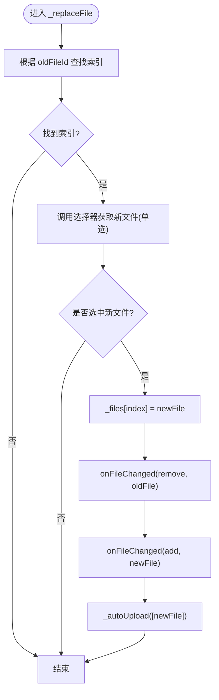
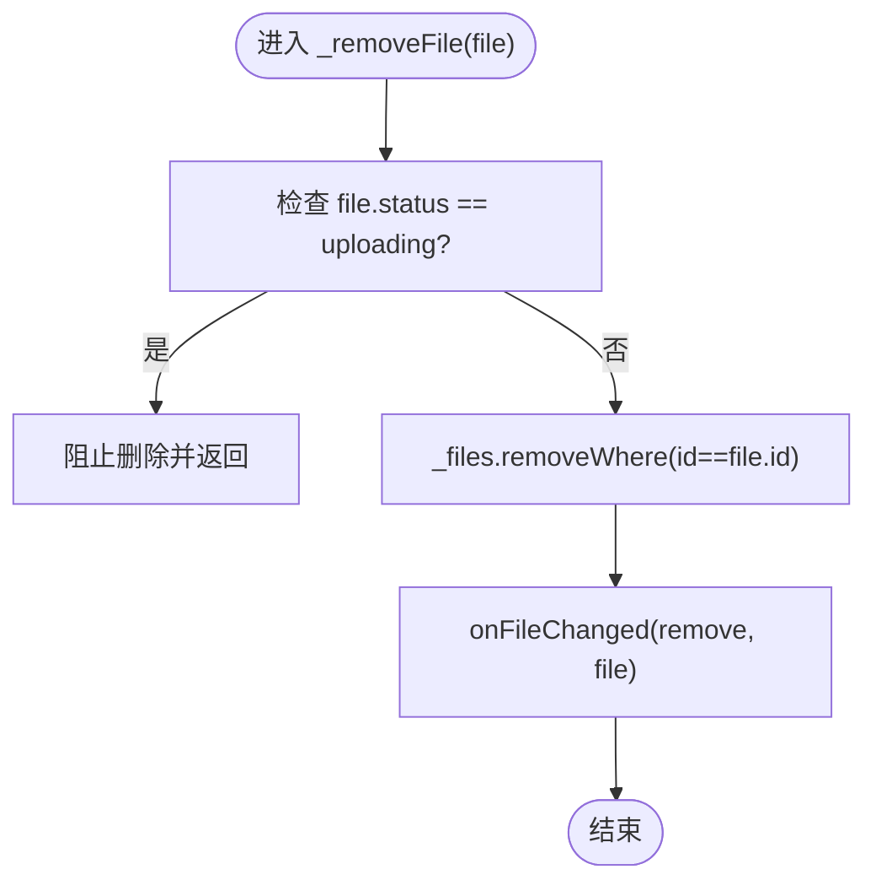
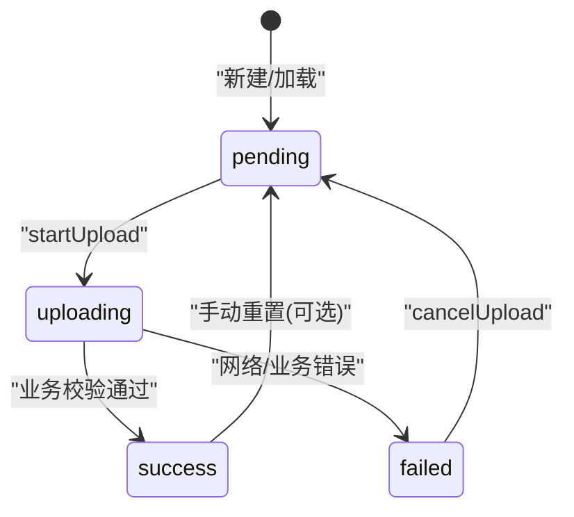
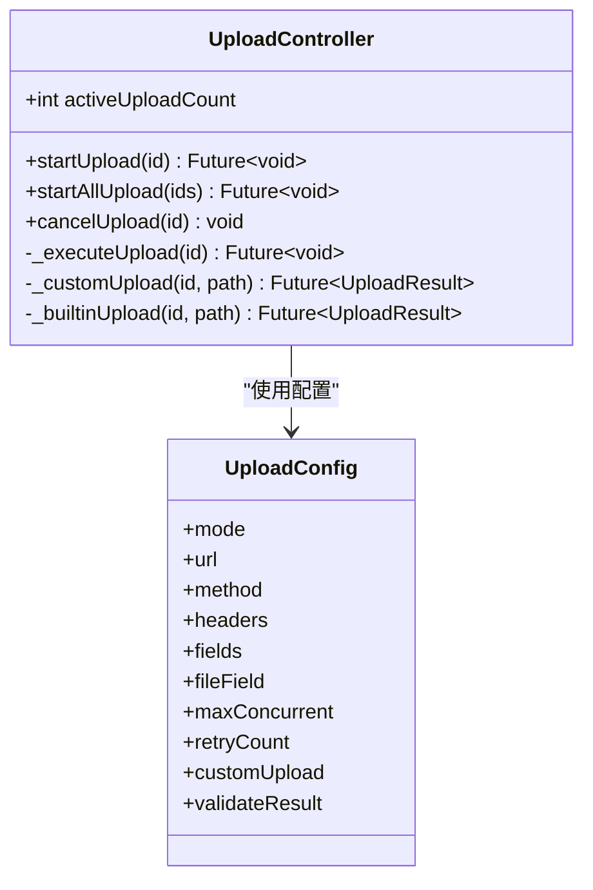
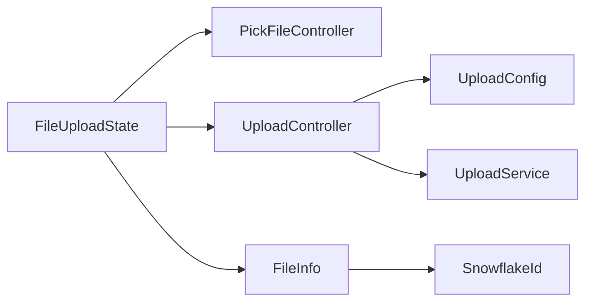

# 文件编辑操作

<cite>
**本文引用的文件**
- [file_upload.dart](file://lib/src/file_upload/file_upload.dart)
- [controller.dart](file://lib/src/file_upload/controller.dart)
- [enum.dart](file://lib/src/file_upload/model/enum.dart)
- [file_info.dart](file://lib/src/file_upload/model/file_info.dart)
- [upload_config.dart](file://lib/src/file_upload/model/upload_config.dart)
- [upload_controller.dart](file://lib/src/file_upload/service/upload_controller.dart)
- [snowflake_id.dart](file://lib/src/file_upload/utils/snowflake_id.dart)
</cite>

## 目录
1. [简介](#简介)
2. [项目结构](#项目结构)
3. [核心组件](#核心组件)
4. [架构总览](#架构总览)
5. [详细组件分析](#详细组件分析)
6. [依赖关系分析](#依赖关系分析)
7. [性能考量](#性能考量)
8. [故障排查指南](#故障排查指南)
9. [结论](#结论)
10. [附录：高级用法示例与最佳实践](#附录：高级用法示例与最佳实践)

## 简介
本文件围绕 Lite UI 文件上传组件的“文件编辑操作”能力进行系统化说明，重点覆盖以下主题：
- 文件替换机制：_replaceFile() 的原位替换、顺序保持、自动上传触发。
- 文件删除机制：_removeFile() 的状态检查、删除确认（由上层交互决定）、状态同步。
- 文件状态管理：UploadStatus 枚举及其转换逻辑。
- onFileChanged 回调：add/remove/uploading/progress/success/failed/defaultLoad 等动作的处理方式。
- 安全性与一致性：上传中文件保护、重复操作防护、数据一致性保证。
- 高级编辑场景：确认对话框、批量操作、撤销重做等实现思路与代码路径指引。

## 项目结构
Lite UI 的文件上传模块采用分层组织：UI 层（Widget）负责交互与展示；控制器层负责选择器封装与上传流程控制；模型与枚举定义数据结构与状态；工具类提供 ID 生成等通用能力。

图表来源
- [file_upload.dart:15-165](file://lib/src/file_upload/file_upload.dart#L15-L165)
- [controller.dart:11-67](file://lib/src/file_upload/controller.dart#L11-L67)
- [upload_controller.dart:22-34](file://lib/src/file_upload/service/upload_controller.dart#L22-L34)
- [file_info.dart:10-74](file://lib/src/file_upload/model/file_info.dart#L10-L74)
- [enum.dart:1-105](file://lib/src/file_upload/model/enum.dart#L1-L105)
- [upload_config.dart:38-99](file://lib/src/file_upload/model/upload_config.dart#L38-L99)
- [snowflake_id.dart:5-39](file://lib/src/file_upload/utils/snowflake_id.dart#L5-L39)

章节来源
- [file_upload.dart:15-165](file://lib/src/file_upload/file_upload.dart#L15-L165)
- [controller.dart:11-67](file://lib/src/file_upload/controller.dart#L11-L67)
- [upload_controller.dart:22-34](file://lib/src/file_upload/service/upload_controller.dart#L22-L34)
- [file_info.dart:10-74](file://lib/src/file_upload/model/file_info.dart#L10-L74)
- [enum.dart:1-105](file://lib/src/file_upload/model/enum.dart#L1-L105)
- [upload_config.dart:38-99](file://lib/src/file_upload/model/upload_config.dart#L38-L99)
- [snowflake_id.dart:5-39](file://lib/src/file_upload/utils/snowflake_id.dart#L5-L39)

## 核心组件
- FileUpload / FileUploadState：对外暴露的上传组件与内部状态管理，包含文件列表维护、选择/删除/替换、上传触发与进度回调、外部 fileList 回显同步等。
- PickFileController：封装 file_picker 与 image_picker，统一返回 FileInfo 列表，支持多选/限制剩余数量/扩展名过滤。
- UploadController：上传生命周期控制器，负责并发控制、重试、取消、进度上报、自定义/内置上传分发。
- FileInfo：文件信息模型，包含 id/name/path/url/size/status/source/data/progress 等字段，并提供 copyWith 与便捷属性。
- 枚举与配置：UploadStatus、FileAction、PickFile、ShowType、UseType、UploadMode、UploadConfig 等。

章节来源
- [file_upload.dart:167-383](file://lib/src/file_upload/file_upload.dart#L167-L383)
- [controller.dart:11-67](file://lib/src/file_upload/controller.dart#L11-L67)
- [upload_controller.dart:22-163](file://lib/src/file_upload/service/upload_controller.dart#L22-L163)
- [file_info.dart:10-139](file://lib/src/file_upload/model/file_info.dart#L10-L139)
- [enum.dart:1-105](file://lib/src/file_upload/model/enum.dart#L1-L105)
- [upload_config.dart:38-99](file://lib/src/file_upload/model/upload_config.dart#L38-L99)

## 架构总览
下图展示了文件编辑相关的关键调用链：用户点击卡片 → 弹出操作面板 → 执行替换或删除 → 更新本地状态 → 触发回调与自动上传。

图表来源
- [file_upload.dart:388-447](file://lib/src/file_upload/file_upload.dart#L388-L447)
- [controller.dart:17-34](file://lib/src/file_upload/controller.dart#L17-L34)
- [upload_controller.dart:39-49](file://lib/src/file_upload/service/upload_controller.dart#L39-L49)

## 详细组件分析

### 文件替换：_replaceFile() 工作原理
- 定位旧文件索引：通过 oldFileId 在内部 _files 列表中查找对应 index。
- 选择新文件：复用组件 pickFile 配置，在 all/imageOrCamera 分支会先弹子选择器，最终仅允许单选。
- 原位替换：将 _files[index] 直接替换为新文件，保持列表顺序不变。
- 通知与自动上传：先触发 onFileChanged(remove, oldFile)，再触发 add(newFile)，随后根据 uploadConfig.mode 自动启动上传。
- 关键特性：
  - 顺序保持：原地替换，不改变其他元素位置。
  - 自动上传：在 auto/custom 模式下自动触发 startUpload。
  - 选择器约束：遵循 allowedExtensions、limit 等配置。

图表来源
- [file_upload.dart:408-447](file://lib/src/file_upload/file_upload.dart#L408-L447)
- [controller.dart:17-34](file://lib/src/file_upload/controller.dart#L17-L34)

章节来源
- [file_upload.dart:388-447](file://lib/src/file_upload/file_upload.dart#L388-L447)
- [controller.dart:17-34](file://lib/src/file_upload/controller.dart#L17-L34)

### 文件删除：_removeFile() 状态检查与同步
- 状态检查：若文件处于 uploading 状态，则禁止删除，避免破坏上传一致性。
- 删除逻辑：从 _files 中移除匹配 id 的文件，并触发 onFileChanged(remove, file)。
- 可结合上层交互：如需二次确认，可在 UI 层（如操作面板或父组件）增加确认步骤后再调用 _removeFile。

图表来源
- [file_upload.dart:259-264](file://lib/src/file_upload/file_upload.dart#L259-L264)

章节来源
- [file_upload.dart:259-264](file://lib/src/file_upload/file_upload.dart#L259-L264)

### 文件状态管理机制：UploadStatus 与转换
- 枚举值：pending、uploading、success、failed。
- 初始状态：
  - FileInfo 构造时，若 url 为 http(s) 开头，则 status=success、source=network；否则默认 pending。
- 状态转换：
  - 开始上传：pending → uploading（UploadController._executeUpload）。
  - 成功：uploading → success（业务校验通过后）。
  - 失败：uploading → failed（网络异常或业务校验失败）。
  - 取消：uploading/pending → pending（cancelUpload）。
- 进度更新：uploading 期间通过 progress 字段持续刷新。

图表来源
- [enum.dart:1-14](file://lib/src/file_upload/model/enum.dart#L1-L14)
- [file_info.dart:57-74](file://lib/src/file_upload/model/file_info.dart#L57-L74)
- [upload_controller.dart:68-122](file://lib/src/file_upload/service/upload_controller.dart#L68-L122)

章节来源
- [enum.dart:1-14](file://lib/src/file_upload/model/enum.dart#L1-L14)
- [file_info.dart:57-74](file://lib/src/file_upload/model/file_info.dart#L57-L74)
- [upload_controller.dart:68-122](file://lib/src/file_upload/service/upload_controller.dart#L68-L122)

### onFileChanged 回调使用方式
- 触发时机：
  - defaultLoad：初始化回显 fileList 后首次同步。
  - add：新增文件（选择器返回后）。
  - remove：删除文件。
  - uploading：开始上传。
  - progress：上传进度更新。
  - success：上传成功。
  - failed：上传失败。
- 参数：
  - files：变更的文件集合（通常为单个或多个）。
  - action：具体动作枚举。
- 典型用法：
  - 父组件监听 add/remove 以维护服务端关联数据。
  - 监听 progress 更新全局进度条。
  - 监听 success/failed 进行结果处理与提示。

章节来源
- [file_upload.dart:215-234](file://lib/src/file_upload/file_upload.dart#L215-L234)
- [file_upload.dart:379-383](file://lib/src/file_upload/file_upload.dart#L379-L383)
- [file_upload.dart:341-375](file://lib/src/file_upload/file_upload.dart#L341-L375)
- [enum.dart:49-71](file://lib/src/file_upload/model/enum.dart#L49-L71)

### 上传流程与并发控制
- 模式：
  - auto：选择文件后自动上传。
  - manual：手动调用 startUpload/startAllUpload。
  - custom：完全自定义上传函数。
- 并发：maxConcurrent 限制同时上传数，超出则等待。
- 重试：retryCount 次指数退避式重试。
- 取消：cancelUpload 将状态恢复为 pending，并标记取消标志。

图表来源
- [upload_controller.dart:22-163](file://lib/src/file_upload/service/upload_controller.dart#L22-L163)
- [upload_config.dart:38-99](file://lib/src/file_upload/model/upload_config.dart#L38-L99)

章节来源
- [upload_controller.dart:22-163](file://lib/src/file_upload/service/upload_controller.dart#L22-L163)
- [upload_config.dart:38-99](file://lib/src/file_upload/model/upload_config.dart#L38-L99)

## 依赖关系分析
- FileUploadState 依赖：
  - PickFileController：文件选择。
  - UploadController：上传流程控制。
  - FileInfo/枚举/配置：数据与行为定义。
- UploadController 依赖：
  - UploadConfig：上传策略与参数。
  - UploadService（内置）：HTTP 上传实现。
- 数据标识：
  - FileInfo.id 基于 SnowflakeId 生成，确保唯一性，用于删除、匹配、状态更新等操作。

图表来源
- [file_upload.dart:167-383](file://lib/src/file_upload/file_upload.dart#L167-L383)
- [controller.dart:11-67](file://lib/src/file_upload/controller.dart#L11-L67)
- [upload_controller.dart:22-163](file://lib/src/file_upload/service/upload_controller.dart#L22-L163)
- [file_info.dart:10-74](file://lib/src/file_upload/model/file_info.dart#L10-L74)
- [snowflake_id.dart:5-39](file://lib/src/file_upload/utils/snowflake_id.dart#L5-L39)

章节来源
- [file_upload.dart:167-383](file://lib/src/file_upload/file_upload.dart#L167-L383)
- [controller.dart:11-67](file://lib/src/file_upload/controller.dart#L11-L67)
- [upload_controller.dart:22-163](file://lib/src/file_upload/service/upload_controller.dart#L22-L163)
- [file_info.dart:10-74](file://lib/src/file_upload/model/file_info.dart#L10-L74)
- [snowflake_id.dart:5-39](file://lib/src/file_upload/utils/snowflake_id.dart#L5-L39)

## 性能考量
- 并发控制：UploadController 通过 maxConcurrent 限制并发，避免过多请求导致阻塞或崩溃。
- 增量更新：updateFileStatus/_onUploadFileProgress 仅更新目标文件，减少不必要的重建。
- 列表比较：didUpdateWidget 中对 fileList 的内容签名比较，避免无效同步导致的频繁 rebuild。
- 选择器优化：Android 多选使用 FileType.custom 以兼容 DocumentsUI。

[本节为通用性能建议，不直接分析具体文件]

## 故障排查指南
- 无法删除上传中的文件：
  - 现象：_removeFile 对 uploading 状态直接返回。
  - 解决：先 cancelUpload 将状态恢复为 pending，再删除。
- 替换后未自动上传：
  - 检查 uploadConfig.mode 是否为 auto/custom；manual 模式需手动调用 startUpload。
- 进度回调未触发：
  - 确认 onProgress 已传入；检查 _onUploadFileProgress 是否被调用。
- 业务校验失败：
  - 检查 validateResult 是否正确实现；失败会转为 failed 状态。
- 并发过高导致卡顿：
  - 降低 maxConcurrent；或优化网络请求与后端处理能力。

章节来源
- [file_upload.dart:259-264](file://lib/src/file_upload/file_upload.dart#L259-L264)
- [file_upload.dart:341-375](file://lib/src/file_upload/file_upload.dart#L341-L375)
- [upload_controller.dart:68-122](file://lib/src/file_upload/service/upload_controller.dart#L68-L122)

## 结论
Lite UI 文件上传组件在文件编辑方面提供了稳健的替换与删除机制，配合清晰的状态管理与回调体系，能够支撑常见的编辑场景。通过合理的配置与上层交互设计，可实现安全、一致且高性能的文件操作体验。

[本节为总结性内容，不直接分析具体文件]

## 附录：高级用法示例与最佳实践

### 文件编辑确认对话框
- 在点击“删除”或“替换”前，通过 DialogAction 或自定义弹窗进行确认，确认后调用 _removeFile 或 _replaceFile。
- 参考路径：
  - 删除确认：[_removeFile:259-264](file://lib/src/file_upload/file_upload.dart#L259-L264)
  - 替换确认：[_replaceFile:408-447](file://lib/src/file_upload/file_upload.dart#L408-L447)

### 批量操作
- 批量删除：遍历 selectedIds，逐个调用 _removeFile（注意上传中保护）。
- 批量替换：对每个待替换项调用 _replaceFile，或使用自定义逻辑批量更新 _files 并触发 onFileChanged。
- 批量上传：调用 startAllUpload(pendingIds) 按并发上限逐批上传。
- 参考路径：
  - 批量上传入口：[startAllUpload:321-326](file://lib/src/file_upload/file_upload.dart#L321-L326)
  - 上传控制器批量调度：[startAllUpload:54-57](file://lib/src/file_upload/service/upload_controller.dart#L54-L57)

### 撤销/重做
- 维护操作历史栈：记录每次 add/remove/replace 的快照（文件名、id、索引、状态）。
- 撤销：根据历史栈反向执行，例如 remove→add、replace→restore。
- 重做：正向应用历史栈中的操作。
- 注意事项：
  - 上传中的文件不可撤销删除，需等待完成或取消。
  - 替换操作的撤销需保留旧文件快照。
- 参考路径：
  - 文件状态更新：[updateFileStatus:271-278](file://lib/src/file_upload/file_upload.dart#L271-L278)
  - 上传状态回调：[_onUploadFileStatusChanged:341-363](file://lib/src/file_upload/file_upload.dart#L341-L363)

### 安全性与一致性最佳实践
- 上传中保护：禁止删除 uploading 状态文件，必要时先 cancelUpload。
- 重复操作防护：
  - 选择器限制 remaining/limit，防止超限。
  - 替换时强制单选，避免多文件覆盖。
- 数据一致性：
  - 使用 FileInfo.id 作为稳定标识，确保删除/替换/状态更新准确匹配。
  - onFileChanged 中区分 add/remove，便于上层维护服务端映射。
- 错误处理：
  - 合理设置 retryCount 与 validateResult，确保业务成功判定准确。
  - 捕获异常并降级为用户友好提示。

章节来源
- [file_upload.dart:259-264](file://lib/src/file_upload/file_upload.dart#L259-L264)
- [file_upload.dart:321-326](file://lib/src/file_upload/file_upload.dart#L321-L326)
- [file_upload.dart:341-375](file://lib/src/file_upload/file_upload.dart#L341-L375)
- [upload_controller.dart:54-57](file://lib/src/file_upload/service/upload_controller.dart#L54-L57)
- [upload_controller.dart:68-122](file://lib/src/file_upload/service/upload_controller.dart#L68-L122)
- [file_info.dart:10-74](file://lib/src/file_upload/model/file_info.dart#L10-L74)