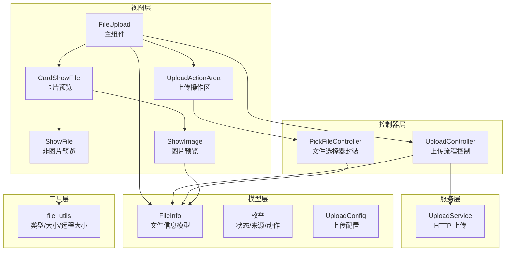
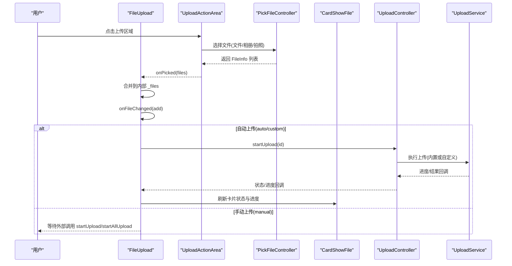
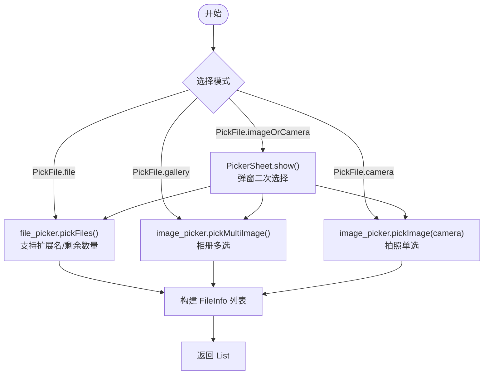
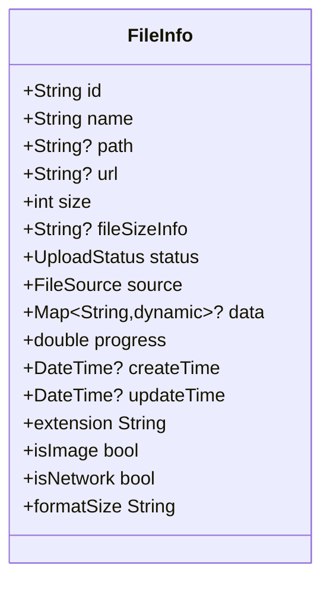
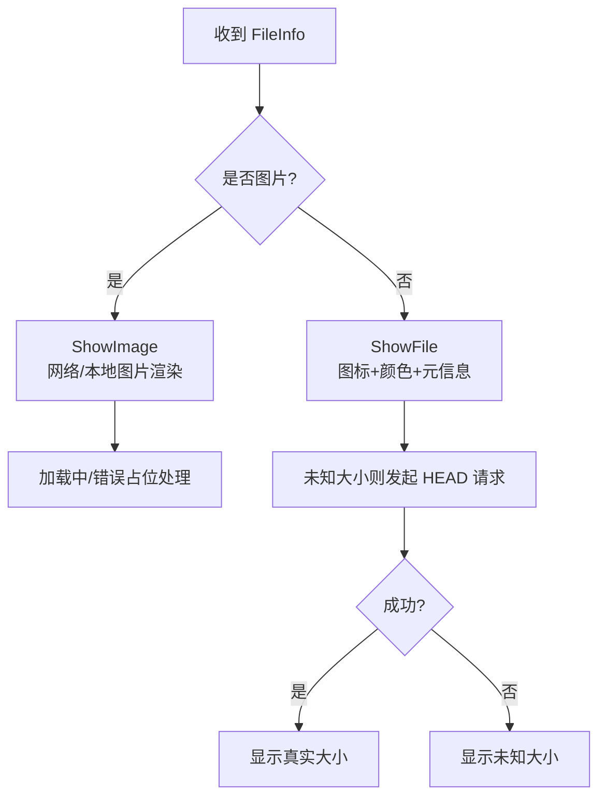
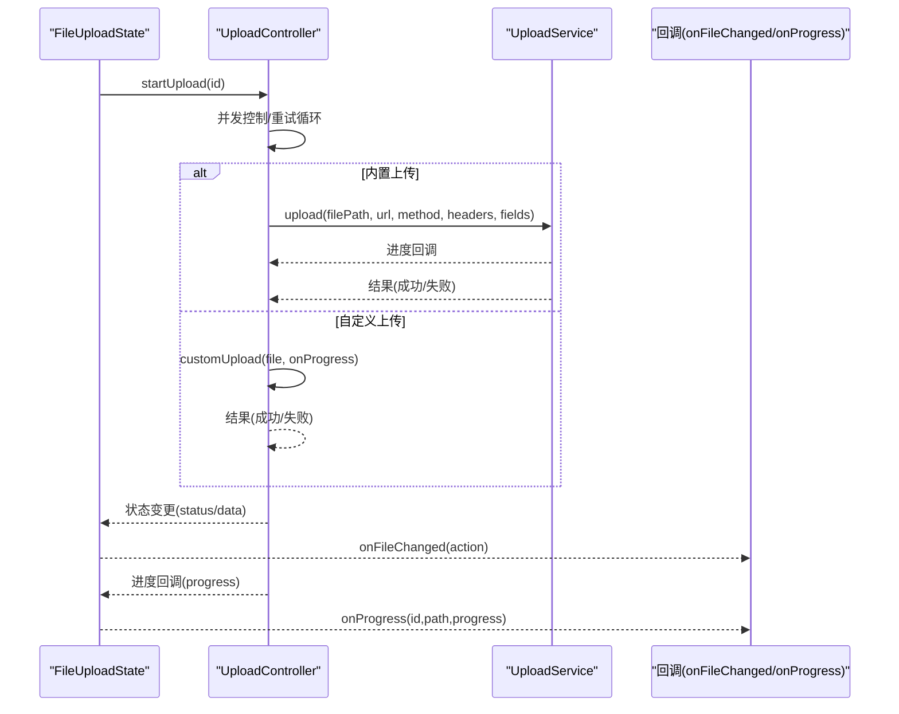
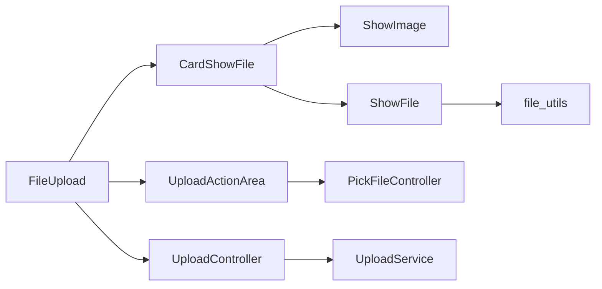

# 文件选择和预览

<cite>
**本文引用的文件**
- [file_upload.dart](file://lib/src/file_upload/file_upload.dart)
- [controller.dart](file://lib/src/file_upload/controller.dart)
- [enum.dart](file://lib/src/file_upload/model/enum.dart)
- [upload_config.dart](file://lib/src/file_upload/model/upload_config.dart)
- [file_info.dart](file://lib/src/file_upload/model/file_info.dart)
- [upload_controller.dart](file://lib/src/file_upload/service/upload_controller.dart)
- [upload_action_area.dart](file://lib/src/file_upload/widgets/upload_action_area.dart)
- [card_show_file.dart](file://lib/src/file_upload/widgets/card_show_file.dart)
- [show_image.dart](file://lib/src/file_upload/widgets/show_image.dart)
- [show_file.dart](file://lib/src/file_upload/widgets/show_file.dart)
- [file_utils.dart](file://lib/src/file_upload/utils/file_utils.dart)
- [readme.md](file://lib/src/file_upload/readme.md)
</cite>

## 目录
1. [简介](#简介)
2. [项目结构](#项目结构)
3. [核心组件](#核心组件)
4. [架构总览](#架构总览)
5. [详细组件分析](#详细组件分析)
6. [依赖关系分析](#依赖关系分析)
7. [性能考量](#性能考量)
8. [故障排查指南](#故障排查指南)
9. [结论](#结论)
10. [附录：API 与配置速查](#附录api-与配置速查)

## 简介
本章节面向 Lite UI 的文件上传组件，聚焦“文件选择”和“预览”两大能力。文档将系统阐述多源文件选择（系统文件、图片选择、拍照）的配置与使用；详解 FileInfo 数据模型字段含义；说明图片、视频、文档等类型的预览实现原理；并提供完整的回调、预览与编辑示例路径，以及类型校验、大小限制、格式转换等高级配置的实践要点。

## 项目结构
Lite UI 文件上传模块采用分层组织：
- 模型层：FileInfo、枚举、UploadConfig
- 控制器层：PickFileController（选择器封装）、UploadController（上传流程控制）
- 服务层：UploadService（HTTP 上传实现）
- 视图层：FileUpload（主组件）、各展示卡片与操作区
- 工具层：文件类型判断、大小格式化、远程文件大小获取

图表来源
- [file_upload.dart:1-120](file://lib/src/file_upload/file_upload.dart#L1-L120)
- [upload_action_area.dart:47-98](file://lib/src/file_upload/widgets/upload_action_area.dart#L47-L98)
- [card_show_file.dart:1-80](file://lib/src/file_upload/widgets/card_show_file.dart#L1-L80)
- [show_image.dart:1-40](file://lib/src/file_upload/widgets/show_image.dart#L1-L40)
- [show_file.dart:1-40](file://lib/src/file_upload/widgets/show_file.dart#L1-L40)
- [controller.dart:1-30](file://lib/src/file_upload/controller.dart#L1-L30)
- [upload_controller.dart:1-40](file://lib/src/file_upload/service/upload_controller.dart#L1-L40)
- [file_info.dart:1-40](file://lib/src/file_upload/model/file_info.dart#L1-L40)
- [enum.dart:1-40](file://lib/src/file_upload/model/enum.dart#L1-L40)
- [upload_config.dart:1-40](file://lib/src/file_upload/model/upload_config.dart#L1-L40)
- [file_utils.dart:1-30](file://lib/src/file_upload/utils/file_utils.dart#L1-L30)

章节来源
- [file_upload.dart:1-120](file://lib/src/file_upload/file_upload.dart#L1-L120)
- [readme.md:116-262](file://lib/src/file_upload/readme.md#L116-L262)

## 核心组件
- FileUpload：对外暴露的上传组件，支持多种展示模式、选择方式、上传模式与编辑回显。
- UploadActionArea：上传按钮区域，负责触发文件选择与数量限制。
- CardShowFile / ListShowFile：文件项展示，区分图片与非图片，叠加上传状态与进度。
- ShowImage / ShowFile：具体渲染逻辑，分别处理图片缩略图与文件图标+元信息。
- PickFileController：统一封装 file_picker 与 image_picker 的选择行为，返回 FileInfo。
- UploadController：并发控制、重试、取消、进度上报与结果校验。
- FileInfo：文件生命周期数据载体，包含 id、name、path、url、size、status、source、progress、data 等。
- UploadConfig：上传配置（模式、URL、方法、头、字段、并发、重试、自定义上传、结果校验）。

章节来源
- [file_upload.dart:15-165](file://lib/src/file_upload/file_upload.dart#L15-L165)
- [upload_action_area.dart:47-98](file://lib/src/file_upload/widgets/upload_action_area.dart#L47-L98)
- [card_show_file.dart:17-89](file://lib/src/file_upload/widgets/card_show_file.dart#L17-L89)
- [show_image.dart:10-40](file://lib/src/file_upload/widgets/show_image.dart#L10-L40)
- [show_file.dart:12-43](file://lib/src/file_upload/widgets/show_file.dart#L12-L43)
- [controller.dart:11-34](file://lib/src/file_upload/controller.dart#L11-L34)
- [upload_controller.dart:22-50](file://lib/src/file_upload/service/upload_controller.dart#L22-L50)
- [file_info.dart:10-74](file://lib/src/file_upload/model/file_info.dart#L10-L74)
- [upload_config.dart:38-99](file://lib/src/file_upload/model/upload_config.dart#L38-L99)

## 架构总览
文件选择与预览的整体调用链如下：用户点击上传区域 → 选择器弹出并返回文件 → 生成 FileInfo → 插入列表 → 根据上传模式自动或手动触发上传 → 更新状态与进度 → 提供预览与编辑操作。

图表来源
- [file_upload.dart:377-447](file://lib/src/file_upload/file_upload.dart#L377-L447)
- [controller.dart:17-66](file://lib/src/file_upload/controller.dart#L17-L66)
- [upload_controller.dart:36-122](file://lib/src/file_upload/service/upload_controller.dart#L36-L122)

## 详细组件分析

### 多源文件选择功能
- 选择器类型
  - 系统文件：通过 file_picker 选择任意文件，支持扩展名过滤与剩余数量限制。
  - 图片选择：通过 image_picker 从相册多选或单选。
  - 拍照：通过 image_picker 调用相机（仅单选）。
  - 组合选择：弹窗让用户在“文件/相册/拍照”间选择。
- 关键实现
  - PickFileController.pickFiles：封装 file_picker，支持 multiple、allowedExtensions、remaining。
  - PickFileController.pickImage：封装 image_picker，支持 gallery/camera、multiple（仅相册）。
  - UploadActionArea：接收 pickFile、multiple、limit、allowedExtensions 等参数，并在达到上限时隐藏上传按钮。
  - FileUploadState._replaceFile：替换文件时复用 pickFile 配置，保持顺序并触发自动上传。

图表来源
- [controller.dart:17-66](file://lib/src/file_upload/controller.dart#L17-L66)
- [upload_action_area.dart:47-98](file://lib/src/file_upload/widgets/upload_action_area.dart#L47-L98)
- [file_upload.dart:408-447](file://lib/src/file_upload/file_upload.dart#L408-L447)

章节来源
- [controller.dart:11-66](file://lib/src/file_upload/controller.dart#L11-L66)
- [upload_action_area.dart:47-98](file://lib/src/file_upload/widgets/upload_action_area.dart#L47-L98)
- [file_upload.dart:408-447](file://lib/src/file_upload/file_upload.dart#L408-L447)

### FileInfo 数据模型
- 关键字段
  - id：唯一标识（雪花算法），用于删除、匹配等操作。
  - name：文件名。
  - path：本地文件路径（可为 null，编辑模式下后端已有文件时无需本地路径）。
  - url：网络访问地址（http 开头自动识别为 success 状态，编辑模式回显）。
  - size：文件大小（字节）。
  - status：上传状态（pending/uploading/success/failed）。
  - source：文件来源（file/image/camera/all/network）。
  - progress：上传进度（0.0~1.0）。
  - data：扩展数据（上传成功后存放服务端响应）。
  - formatSize：格式化文件大小（只读 getter）。
  - isImage：是否为图片文件（只读 getter）。
- 构造与派生
  - 当 url 存在且以 http(s) 开头时，自动设置 status=success、source=network。
  - extension 由 name 后缀推导；isImage 基于常见图片后缀判断。

图表来源
- [file_info.dart:10-139](file://lib/src/file_upload/model/file_info.dart#L10-L139)

章节来源
- [file_info.dart:10-139](file://lib/src/file_upload/model/file_info.dart#L10-L139)

### 文件预览功能
- 图片预览
  - ShowImage：根据 isNetwork 决定 Image.network 或 Image.file；支持加载占位、错误占位与缓存优化。
  - 网络图片加载失败时显示占位图与文件名提示。
- 非图片预览
  - ShowFile：根据扩展名显示对应图标与颜色；卡片模式下底部半透明遮罩显示名称与大小。
  - 对网络文件且未知大小时，通过 HTTP HEAD 请求获取 Content-Length，失败回退 GET。
- 卡片与列表模式
  - CardShowFile：图片走 ShowImage，非图片走 ShowFile；叠加上传状态、进度条与删除按钮。
  - ListShowFile：横向行展示文件信息与操作。

图表来源
- [show_image.dart:10-72](file://lib/src/file_upload/widgets/show_image.dart#L10-L72)
- [show_file.dart:45-96](file://lib/src/file_upload/widgets/show_file.dart#L45-L96)
- [file_utils.dart:25-51](file://lib/src/file_upload/utils/file_utils.dart#L25-L51)

章节来源
- [card_show_file.dart:91-192](file://lib/src/file_upload/widgets/card_show_file.dart#L91-L192)
- [show_image.dart:10-72](file://lib/src/file_upload/widgets/show_image.dart#L10-L72)
- [show_file.dart:45-96](file://lib/src/file_upload/widgets/show_file.dart#L45-L96)
- [file_utils.dart:25-51](file://lib/src/file_upload/utils/file_utils.dart#L25-L51)

### 文件编辑与回显
- 通过 fileList 传入已存在的文件，组件初始化时直接展示。
- 当 url 为 http 开头时，自动识别为 success 状态，无需本地 path。
- 支持在卡片上点击进行预览、重试、替换、删除等操作。

章节来源
- [file_upload.dart:120-165](file://lib/src/file_upload/file_upload.dart#L120-L165)
- [file_upload.dart:214-234](file://lib/src/file_upload/file_upload.dart#L214-L234)
- [file_upload.dart:388-402](file://lib/src/file_upload/file_upload.dart#L388-L402)

### 上传流程与回调
- 三种上传模式
  - auto：选择后自动上传。
  - manual：手动触发（startUpload/startAllUpload）。
  - custom：完全自定义上传函数，通过 UploadConfig.customUpload 提供。
- 回调机制
  - onFileChanged：添加/删除/上传中/进度/成功/失败等动作。
  - onProgress：上传进度回调（id、path、progress）。
- 并发与重试
  - maxConcurrent：并发上限。
  - retryCount：失败自动重试次数。
  - validateResult：业务结果校验。

图表来源
- [upload_controller.dart:36-122](file://lib/src/file_upload/service/upload_controller.dart#L36-L122)
- [file_upload.dart:282-375](file://lib/src/file_upload/file_upload.dart#L282-L375)

章节来源
- [upload_config.dart:38-99](file://lib/src/file_upload/model/upload_config.dart#L38-L99)
- [upload_controller.dart:36-122](file://lib/src/file_upload/service/upload_controller.dart#L36-L122)
- [file_upload.dart:282-375](file://lib/src/file_upload/file_upload.dart#L282-L375)

## 依赖关系分析
- 组件耦合
  - FileUpload 依赖 UploadActionArea、CardShowFile/ListShowFile、UploadController。
  - UploadActionArea 依赖 PickFileController。
  - CardShowFile 依赖 ShowImage/ShowFile。
  - ShowFile 依赖 file_utils（远程大小获取）。
- 外部依赖
  - file_picker：系统文件选择。
  - image_picker：相册与拍照。
  - Flutter 网络与 IO：HTTP 请求、文件读取。

图表来源
- [file_upload.dart:1-120](file://lib/src/file_upload/file_upload.dart#L1-L120)
- [upload_action_area.dart:47-98](file://lib/src/file_upload/widgets/upload_action_area.dart#L47-L98)
- [card_show_file.dart:1-80](file://lib/src/file_upload/widgets/card_show_file.dart#L1-L80)
- [show_file.dart:1-40](file://lib/src/file_upload/widgets/show_file.dart#L1-L40)
- [controller.dart:1-30](file://lib/src/file_upload/controller.dart#L1-L30)
- [upload_controller.dart:1-40](file://lib/src/file_upload/service/upload_controller.dart#L1-L40)

章节来源
- [file_upload.dart:1-120](file://lib/src/file_upload/file_upload.dart#L1-L120)
- [controller.dart:1-30](file://lib/src/file_upload/controller.dart#L1-L30)
- [upload_controller.dart:1-40](file://lib/src/file_upload/service/upload_controller.dart#L1-L40)

## 性能考量
- 图片加载优化
  - ShowImage 使用 cacheWidth/cacheHeight 提升首帧渲染效率。
  - 网络图片 loadingBuilder 与 errorBuilder 提供良好用户体验。
- 远程大小获取
  - ShowFile 优先 HEAD 请求，失败回退 GET，避免不必要的数据传输。
- 上传并发控制
  - UploadController 通过 maxConcurrent 限制并发，避免阻塞与资源争用。
- 列表渲染
  - CardShowFile/ListShowFile 使用 ValueKey 与不可变列表减少重建开销。

[本节为通用指导，不直接分析具体文件]

## 故障排查指南
- 常见问题
  - 未配置上传地址：内置上传需要 url，否则返回失败。
  - 文件路径为空：本地 path 为空无法上传，检查选择器返回。
  - 业务校验失败：validateResult 返回 false 视为失败。
  - 网络图片加载失败：检查 URL 有效性、跨域与权限。
- 调试建议
  - 打印 onFileChanged 的 action 与文件状态变化。
  - 观察 onProgress 回调是否正常上报。
  - 查看 ShowImage/ShowFile 的错误日志输出。

章节来源
- [upload_controller.dart:138-161](file://lib/src/file_upload/service/upload_controller.dart#L138-L161)
- [show_image.dart:54-68](file://lib/src/file_upload/widgets/show_image.dart#L54-L68)
- [show_file.dart:72-87](file://lib/src/file_upload/widgets/show_file.dart#L72-L87)

## 结论
Lite UI 文件上传组件通过清晰的分层设计与灵活的配置选项，提供了完善的文件选择、预览与上传能力。借助 FileInfo 模型与 UploadConfig，开发者可快速实现多源选择、类型校验、大小限制、并发上传与结果校验等高级需求，并通过丰富的回调与展示模式满足多样化场景。

[本节为总结性内容，不直接分析具体文件]

## 附录：API 与配置速查
- FileUpload 常用参数
  - pickFile：选择器类型（file/gallery/camera/imageOrCamera/all）
  - multiple：是否多选
  - limit：数量上限（-1 表示不限制）
  - allowedExtensions：允许扩展名（仅 file 模式生效）
  - showType：展示模式（card/textInfo/custom）
  - previewSize/columns：卡片尺寸或列数（互斥）
  - spacing/alignment/borderRadius/fileRadius：布局与样式
  - title/icon/actionDecoration/actionTitleStyle：上传按钮样式
  - useType：使用方式（normal/avatar）
  - fileList：初始文件列表（编辑回显）
  - onFileChanged：文件变更回调
  - onProgress：上传进度回调
  - itemBuilder/uploadButtonBuilder：自定义构建器
- UploadConfig 常用参数
  - mode：auto/manual/custom
  - url/method/headers/fields/fileField：上传接口与表单
  - maxConcurrent/retryCount：并发与重试
  - customUpload：自定义上传函数
  - validateResult：业务结果校验
- FileInfo 字段
  - id/name/path/url/size/status/source/progress/data/formatSize/isImage

章节来源
- [file_upload.dart:15-165](file://lib/src/file_upload/file_upload.dart#L15-L165)
- [upload_config.dart:38-99](file://lib/src/file_upload/model/upload_config.dart#L38-L99)
- [file_info.dart:10-139](file://lib/src/file_upload/model/file_info.dart#L10-L139)
- [readme.md:186-262](file://lib/src/file_upload/readme.md#L186-L262)