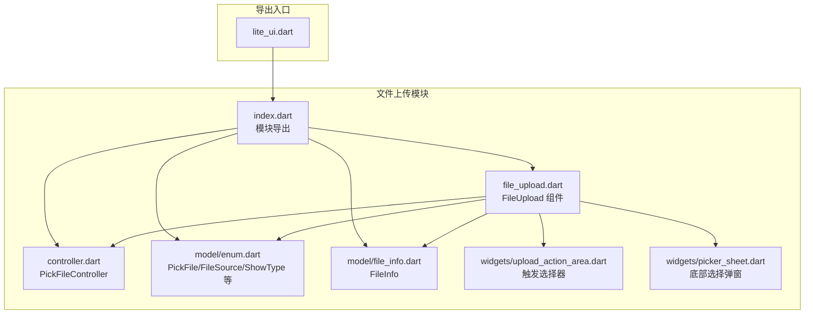
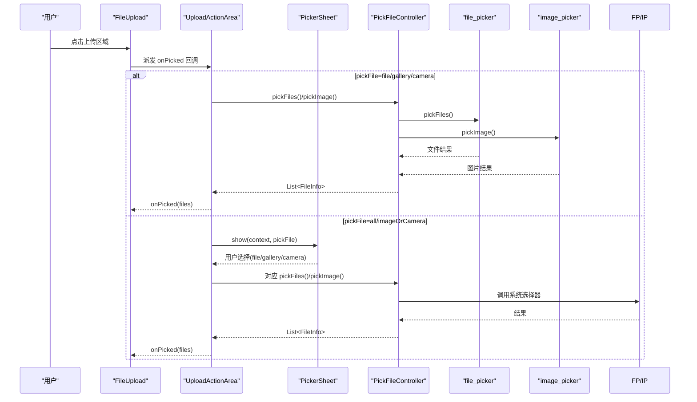
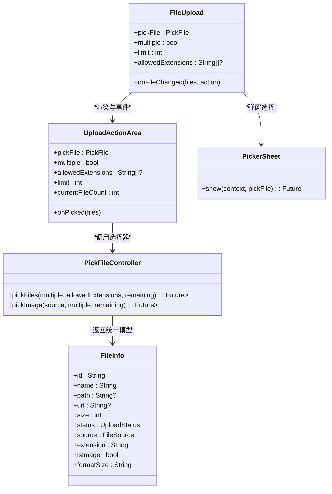

# 文件选择器配置

<cite>
**本文引用的文件**   
- [lite_ui.dart](file://lib/lite_ui.dart)
- [controller.dart](file://lib/src/file_upload/controller.dart)
- [enum.dart](file://lib/src/file_upload/model/enum.dart)
- [file_info.dart](file://lib/src/file_upload/model/file_info.dart)
- [file_upload.dart](file://lib/src/file_upload/file_upload.dart)
- [upload_action_area.dart](file://lib/src/file_upload/widgets/upload_action_area.dart)
- [picker_sheet.dart](file://lib/src/file_upload/widgets/picker_sheet.dart)
- [index.dart](file://lib/src/file_upload/index.dart)
</cite>

## 目录
1. [简介](#简介)
2. [项目结构](#项目结构)
3. [核心组件](#核心组件)
4. [架构总览](#架构总览)
5. [详细组件分析](#详细组件分析)
6. [依赖关系分析](#依赖关系分析)
7. [性能考量](#性能考量)
8. [故障排查指南](#故障排查指南)
9. [结论](#结论)
10. [附录：使用示例与最佳实践](#附录使用示例与最佳实践)

## 简介
本章节面向 Lite UI 文件上传组件的文件选择器配置功能，系统性说明 PickFile 枚举的多种选择模式、PickFileController 的静态方法参数与返回值、allowedExtensions 扩展名过滤、multiple 多选与 limit 数量限制等高级选项，并给出不同模式的调用流程与回调处理要点。文档同时涵盖权限处理、错误处理与性能优化建议，帮助开发者快速、正确地集成文件选择能力。

## 项目结构
Lite UI 文件上传模块采用分层组织：
- 控制器层：封装底层 file_picker 与 image_picker 的选择逻辑，统一返回 FileInfo 列表
- 模型与枚举：定义文件来源、动作、展示类型、选择器操作等枚举，以及 FileInfo 数据模型
- UI 组件：FileUpload 主组件负责状态管理、渲染与事件分发；子组件 UploadActionArea 负责触发选择器；PickerSheet 提供底部弹窗选择入口
- 导出入口：lite_ui.dart 统一暴露各模块，便于外部引用

图表来源
- [lite_ui.dart:1-19](file://lib/lite_ui.dart#L1-L19)
- [index.dart:1-6](file://lib/src/file_upload/index.dart#L1-L6)
- [file_upload.dart:1-12](file://lib/src/file_upload/file_upload.dart#L1-L12)
- [controller.dart:1-11](file://lib/src/file_upload/controller.dart#L1-L11)
- [enum.dart:73-89](file://lib/src/file_upload/model/enum.dart#L73-L89)
- [file_info.dart:1-10](file://lib/src/file_upload/model/file_info.dart#L1-L10)
- [upload_action_area.dart:47-98](file://lib/src/file_upload/widgets/upload_action_area.dart#L47-L98)
- [picker_sheet.dart:1-39](file://lib/src/file_upload/widgets/picker_sheet.dart#L1-L39)

章节来源
- [lite_ui.dart:1-19](file://lib/lite_ui.dart#L1-L19)
- [index.dart:1-6](file://lib/src/file_upload/index.dart#L1-L6)

## 核心组件
- PickFile 枚举：定义选择器操作类型（file/gallery/camera/imageOrCamera/all）
- PickFileController：封装 file_picker 与 image_picker 的调用，统一返回 List<FileInfo>
- FileInfo：统一文件信息模型，包含 id/name/path/url/size/source/status/progress 等字段
- FileUpload：对外暴露的上传组件，内部通过 UploadActionArea 触发选择器，并通过 PickerSheet 提供弹窗选择
- UploadActionArea：根据 pickFile 配置调用 PickFileController.pickFiles 或 pickImage，并计算 remaining 限制
- PickerSheet：当 pickFile 为 all 或 imageOrCamera 时，弹出 Apple 风格底部选择框，让用户选择具体操作

章节来源
- [enum.dart:73-89](file://lib/src/file_upload/model/enum.dart#L73-L89)
- [controller.dart:11-67](file://lib/src/file_upload/controller.dart#L11-L67)
- [file_info.dart:10-74](file://lib/src/file_upload/model/file_info.dart#L10-L74)
- [file_upload.dart:15-165](file://lib/src/file_upload/file_upload.dart#L15-L165)
- [upload_action_area.dart:47-98](file://lib/src/file_upload/widgets/upload_action_area.dart#L47-L98)
- [picker_sheet.dart:1-39](file://lib/src/file_upload/widgets/picker_sheet.dart#L1-L39)

## 架构总览
下图展示了从用户点击到文件选择的完整调用链，包括弹窗选择与直接选择两种路径。

图表来源
- [file_upload.dart:404-447](file://lib/src/file_upload/file_upload.dart#L404-L447)
- [upload_action_area.dart:139-167](file://lib/src/file_upload/widgets/upload_action_area.dart#L139-L167)
- [picker_sheet.dart:8-38](file://lib/src/file_upload/widgets/picker_sheet.dart#L8-L38)
- [controller.dart:17-66](file://lib/src/file_upload/controller.dart#L17-L66)

## 详细组件分析

### PickFile 枚举与使用场景
- PickFile.file：直接打开系统文件选择器，适合文档类上传（如 PDF、DOCX），可配合 allowedExtensions 进行扩展名过滤
- PickFile.gallery：直接打开相册选择图片，适合头像、封面等多图场景
- PickFile.camera：直接调用相机拍照，适合即时拍摄场景
- PickFile.imageOrCamera：弹出底部选择框，在“相册”和“拍照”之间选择
- PickFile.all：弹出底部选择框，在“文件/相册/拍照”三者中选择

章节来源
- [enum.dart:73-89](file://lib/src/file_upload/model/enum.dart#L73-L89)
- [file_upload.dart:15-22](file://lib/src/file_upload/file_upload.dart#L15-L22)
- [picker_sheet.dart:22-38](file://lib/src/file_upload/widgets/picker_sheet.dart#L22-L38)

### PickFileController 静态方法详解
- pickFiles({bool multiple = true, List<String>? allowedExtensions, int? remaining})
  - multiple：是否允许多选，默认 true；部分 Android 设备多选需使用 FileType.custom 以触发 DocumentsUI
  - allowedExtensions：仅对 file 模式生效，用于限制可选扩展名
  - remaining：剩余可选择的文件数（配合 limit 使用），为空则不限制
  - 返回：List<FileInfo>，source 标记为 FileSource.file
- pickImage(ImageSource source, {bool multiple = true, int? remaining})
  - source：ImageSource.gallery 或 ImageSource.camera
  - multiple：仅相册模式支持多选；拍照始终单选
  - remaining：同上，用于限制本次选择数量
  - 返回：List<FileInfo>，相册返回 source=FileSource.image，拍照返回 source=FileSource.camera

章节来源
- [controller.dart:17-34](file://lib/src/file_upload/controller.dart#L17-L34)
- [controller.dart:41-66](file://lib/src/file_upload/controller.dart#L41-L66)

### FileInfo 数据模型与扩展名判断
- FileInfo 提供 extension 属性用于获取扩展名，isImage 用于判断是否为图片
- isNetwork 基于 url 是否为 http(s) 开头判断网络文件
- formatSize 自动格式化文件大小显示

章节来源
- [file_info.dart:112-121](file://lib/src/file_upload/model/file_info.dart#L112-L121)
- [file_info.dart:124-135](file://lib/src/file_upload/model/file_info.dart#L124-L135)

### UploadActionArea 与限制策略
- _pickFiles/_pickImage 中根据 widget.limit 与 currentFileCount 计算 remaining，确保不超过上限
- 将选中的 files 通过 onPicked 回调回传给父组件

章节来源
- [upload_action_area.dart:153-167](file://lib/src/file_upload/widgets/upload_action_area.dart#L153-L167)

### PickerSheet 弹窗选择
- 当 pickFile 为 all 或 imageOrCamera 时，调用 PickerSheet.show 弹出底部选择框
- 根据 pickFile 动态构建选项：all 包含“选择文件/从相册选择/拍照”，imageOrCamera 包含“从相册选择/拍照”

章节来源
- [picker_sheet.dart:8-38](file://lib/src/file_upload/widgets/picker_sheet.dart#L8-L38)

### FileUpload 替换文件流程
- 替换旧文件时，若当前 pickFile 为 all 或 imageOrCamera，会再次弹出 PickerSheet 让用户选择具体方式
- 替换成功后先通知 remove 旧文件，再通知 add 新文件，并触发自动上传

章节来源
- [file_upload.dart:404-447](file://lib/src/file_upload/file_upload.dart#L404-L447)

## 依赖关系分析
- FileUpload 依赖 PickFileController 完成选择逻辑，依赖 UploadActionArea 触发选择，依赖 PickerSheet 提供弹窗选择
- UploadActionArea 依赖 PickFileController 与 FileInfo
- PickerSheet 依赖 enum 中的 PickFile 枚举
- 所有选择结果统一为 List<FileInfo>，便于后续上传与状态管理

图表来源
- [file_upload.dart:15-165](file://lib/src/file_upload/file_upload.dart#L15-L165)
- [upload_action_area.dart:47-98](file://lib/src/file_upload/widgets/upload_action_area.dart#L47-L98)
- [picker_sheet.dart:1-39](file://lib/src/file_upload/widgets/picker_sheet.dart#L1-L39)
- [controller.dart:11-67](file://lib/src/file_upload/controller.dart#L11-L67)
- [file_info.dart:10-74](file://lib/src/file_upload/model/file_info.dart#L10-L74)

## 性能考量
- Android 多选兼容性：当存在 allowedExtensions 时，使用 FileType.custom 以触发系统 DocumentsUI 的多选模式，避免部分设备上 FileType.any 多选失效
- 批量读取大小：相册多选时逐个读取 xFile.length() 计算大小，建议在大量图片场景下考虑异步与批处理，避免阻塞 UI
- 限制提前截断：remaining 非空且超出时直接 take(remaining)，减少不必要的数据传递与渲染

章节来源
- [controller.dart:18-28](file://lib/src/file_upload/controller.dart#L18-L28)
- [controller.dart:49-57](file://lib/src/file_upload/controller.dart#L49-L57)

## 故障排查指南
- 多选无效（Android）：确认是否传入了 allowedExtensions；若传入，内部已切换为 FileType.custom 以启用多选
- 选择结果为空：检查用户取消选择或系统未返回文件；控制器在 null 或空结果时返回空列表
- 扩展名过滤不生效：确认仅在 PickFile.file 模式下有效；gallery/camera 不受 allowedExtensions 影响
- 数量限制异常：检查 limit 与 currentFileCount 的计算是否正确；remaining 由 limit - currentFileCount 推导
- 权限问题（相机/相册）：需在平台侧正确声明权限并在运行时申请；若未授权，系统将拒绝访问

章节来源
- [controller.dart:18-34](file://lib/src/file_upload/controller.dart#L18-L34)
- [controller.dart:41-66](file://lib/src/file_upload/controller.dart#L41-L66)
- [upload_action_area.dart:153-167](file://lib/src/file_upload/widgets/upload_action_area.dart#L153-L167)

## 结论
Lite UI 的文件选择器通过 PickFile 枚举与 PickFileController 提供了灵活、统一的文件选择能力，结合 FileInfo 模型与 UploadActionArea/PickerSheet 实现了从选择到上传的全链路解耦。开发者可根据业务场景选择合适的 pickFile 模式，并通过 multiple、allowedExtensions、limit 等参数精细控制选择行为。遵循本文的最佳实践，可有效提升兼容性与用户体验。

## 附录：使用示例与最佳实践

### 不同选择模式的配置与回调
- 仅选择文件（不上传）
  - 设置 pickFile=PickFile.file，可传入 allowedExtensions 限制类型
  - 监听 onFileChanged 获取添加/删除动作及文件列表
- 自动上传
  - 设置 uploadConfig.mode=auto，并提供 url
  - 选择后自动开始上传，进度通过 onProgress 回调
- 手动上传
  - 设置 uploadConfig.mode=manual，通过 GlobalKey<FileUploadState> 调用 startAllUpload
- 自定义上传函数
  - 设置 uploadConfig.mode=custom，实现 customUpload 回调，自行处理上传与进度

章节来源
- [file_upload.dart:59-70](file://lib/src/file_upload/file_upload.dart#L59-L70)
- [file_upload.dart:131-161](file://lib/src/file_upload/file_upload.dart#L131-L161)

### 展示模式与布局
- 卡片模式（默认）：适合图片上传，可通过 columns 或 previewSize 控制布局
- 列表模式：适合文档上传，横向行展示文件名与大小
- 自定义模式：通过 itemBuilder 完全自定义每个文件项的 UI

章节来源
- [file_upload.dart:85-101](file://lib/src/file_upload/file_upload.dart#L85-L101)

### 编辑模式（回显已有文件）
- 通过 fileList 传入已存在的 FileInfo，url 为 http(s) 开头时自动识别为已上传成功
- 初始化时直接展示，支持继续添加或删除

章节来源
- [file_upload.dart:120-124](file://lib/src/file_upload/file_upload.dart#L120-L124)

### 高级选项与最佳实践
- allowedExtensions：仅在 PickFile.file 模式生效，建议明确限定业务所需扩展名
- multiple：相册多选体验良好；拍照始终单选；如需严格限制总数，配合 limit 使用
- limit：设置为正整数时达到上限隐藏上传按钮；删除后可继续添加
- 权限处理：在 Android/iOS 清单与运行时正确申请相机与存储权限
- 错误处理：捕获选择器异常与空结果，提示用户重试或检查权限
- 性能优化：大文件上传建议使用分块与进度反馈；批量图片读取大小可考虑后台线程

章节来源
- [upload_action_area.dart:153-167](file://lib/src/file_upload/widgets/upload_action_area.dart#L153-L167)
- [controller.dart:18-34](file://lib/src/file_upload/controller.dart#L18-L34)
- [controller.dart:41-66](file://lib/src/file_upload/controller.dart#L41-L66)