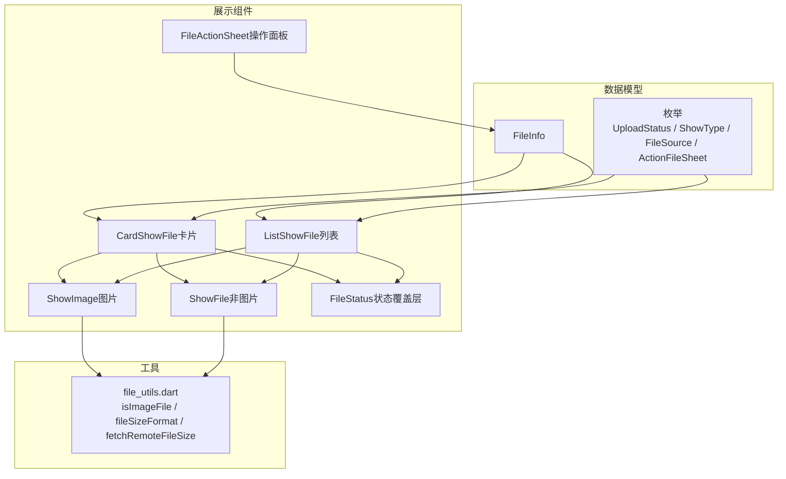
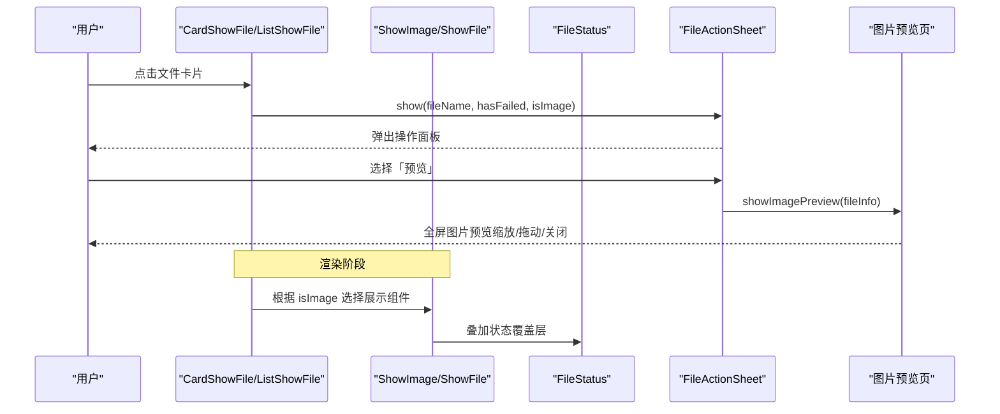
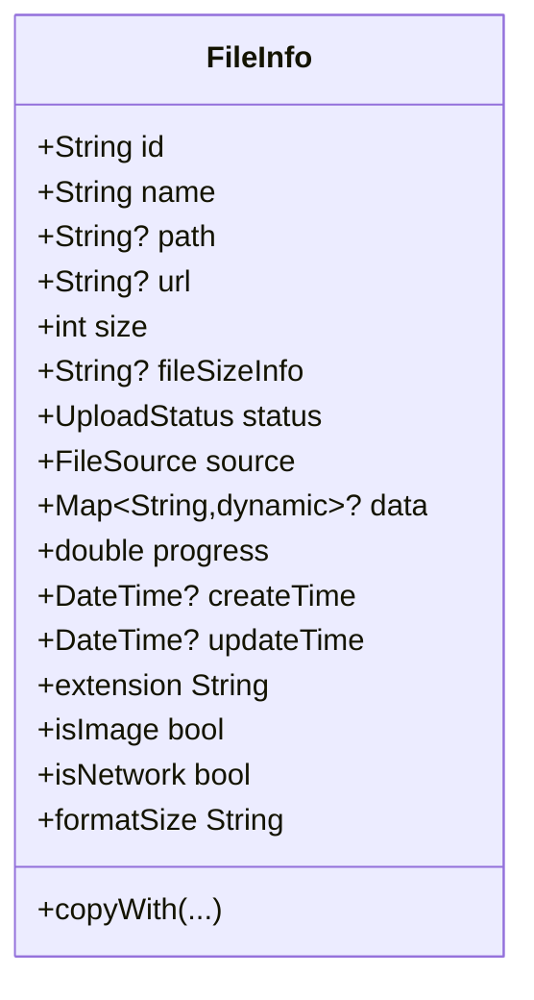
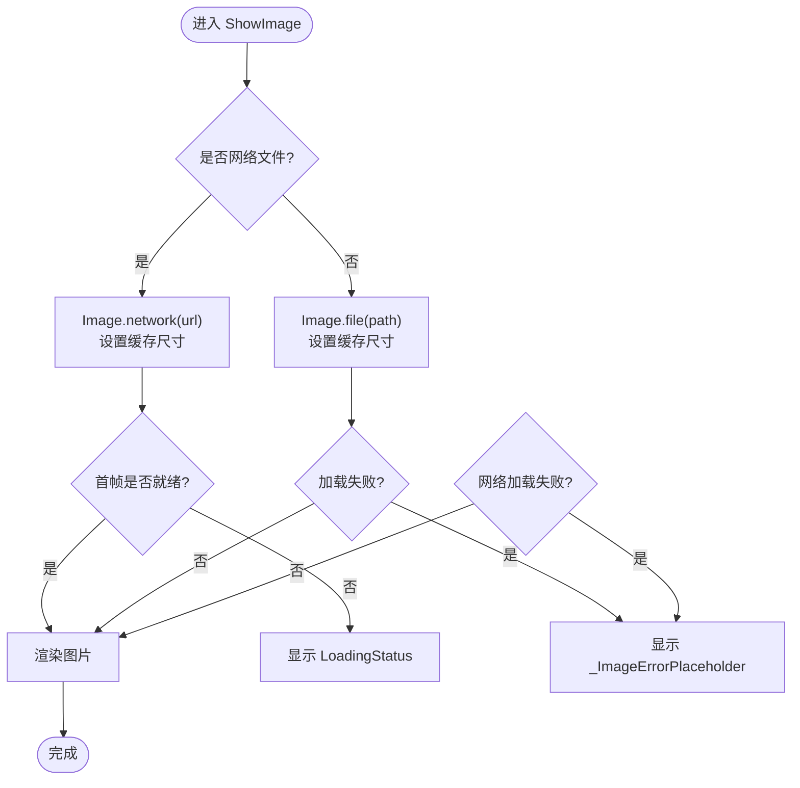
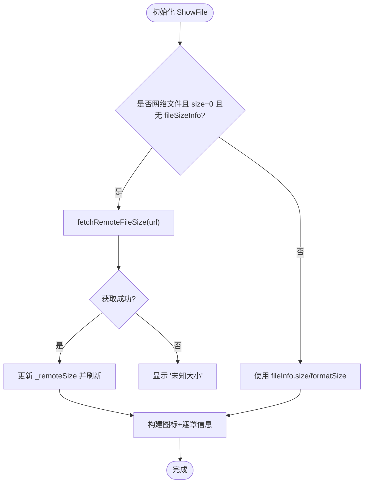
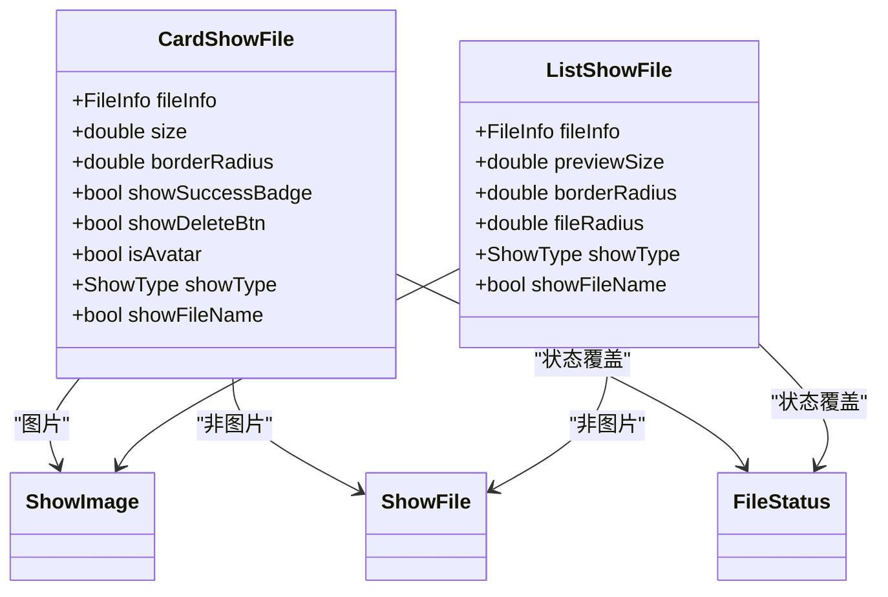
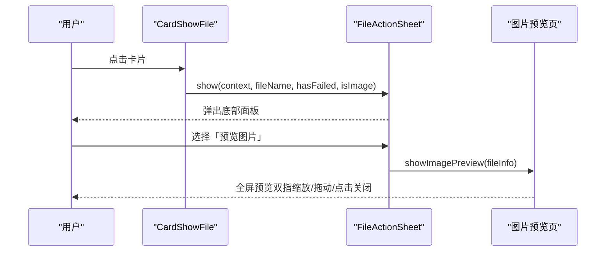
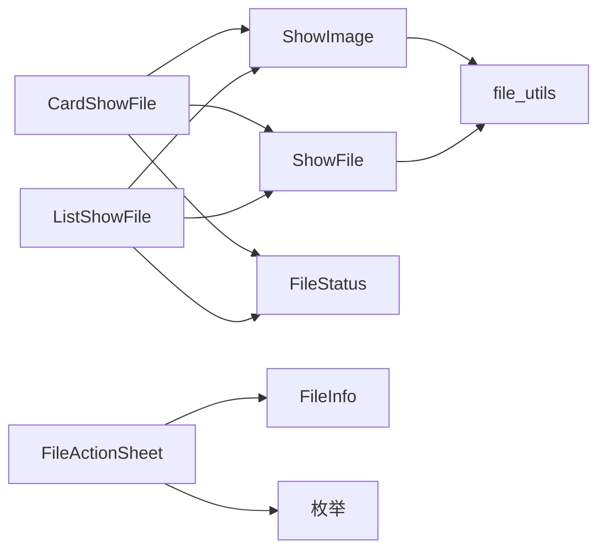

# 文件预览系统

<cite>
**本文引用的文件**   
- [lib/src/file_upload/model/file_info.dart](file://lib/src/file_upload/model/file_info.dart)
- [lib/src/file_upload/model/enum.dart](file://lib/src/file_upload/model/enum.dart)
- [lib/src/file_upload/widgets/show_image.dart](file://lib/src/file_upload/widgets/show_image.dart)
- [lib/src/file_upload/widgets/show_file.dart](file://lib/src/file_upload/widgets/show_file.dart)
- [lib/src/file_upload/widgets/card_show_file.dart](file://lib/src/file_upload/widgets/card_show_file.dart)
- [lib/src/file_upload/widgets/list_show_file.dart](file://lib/src/file_upload/widgets/list_show_file.dart)
- [lib/src/file_upload/widgets/file_status.dart](file://lib/src/file_upload/widgets/file_status.dart)
- [lib/src/file_upload/widgets/file_action_sheet.dart](file://lib/src/file_upload/widgets/file_action_sheet.dart)
- [lib/src/file_upload/utils/file_utils.dart](file://lib/src/file_upload/utils/file_utils.dart)
- [lib/src/file_upload/readme.md](file://lib/src/file_upload/readme.md)
</cite>

## 目录
1. [简介](#简介)
2. [项目结构](#项目结构)
3. [核心组件](#核心组件)
4. [架构总览](#架构总览)
5. [详细组件分析](#详细组件分析)
6. [依赖关系分析](#依赖关系分析)
7. [性能考虑](#性能考虑)
8. [故障排查指南](#故障排查指南)
9. [结论](#结论)
10. [附录](#附录)

## 简介
本文件聚焦 Lite UI 文件上传组件的“文件预览系统”，系统性说明 FileInfo 数据模型、图片与文档等类型文件的预览策略、操作面板（FileActionSheet）交互流程，以及高级定制与性能优化实践。目标是帮助开发者快速理解并扩展该预览子系统，实现稳定、高性能且体验友好的文件预览能力。

## 项目结构
文件预览系统主要位于 file_upload 模块内，围绕“数据模型 + 展示组件 + 工具函数”组织：
- 数据模型：FileInfo、枚举（UploadStatus、ShowType、FileSource、ActionFileSheet 等）
- 展示组件：卡片模式（CardShowFile）、列表模式（ListShowFile）、图片展示（ShowImage）、非图片展示（ShowFile）、状态覆盖层（FileStatus）、操作面板（FileActionSheet）
- 工具函数：文件类型判断、大小格式化、远程文件大小获取（HTTP HEAD/GET 回退）

图表来源
- [lib/src/file_upload/model/file_info.dart:1-140](file://lib/src/file_upload/model/file_info.dart#L1-L140)
- [lib/src/file_upload/model/enum.dart:1-105](file://lib/src/file_upload/model/enum.dart#L1-L105)
- [lib/src/file_upload/widgets/card_show_file.dart:1-192](file://lib/src/file_upload/widgets/card_show_file.dart#L1-L192)
- [lib/src/file_upload/widgets/list_show_file.dart:1-289](file://lib/src/file_upload/widgets/list_show_file.dart#L1-L289)
- [lib/src/file_upload/widgets/show_image.dart:1-133](file://lib/src/file_upload/widgets/show_image.dart#L1-L133)
- [lib/src/file_upload/widgets/show_file.dart:1-206](file://lib/src/file_upload/widgets/show_file.dart#L1-L206)
- [lib/src/file_upload/widgets/file_status.dart:1-174](file://lib/src/file_upload/widgets/file_status.dart#L1-L174)
- [lib/src/file_upload/widgets/file_action_sheet.dart:1-66](file://lib/src/file_upload/widgets/file_action_sheet.dart#L1-L66)
- [lib/src/file_upload/utils/file_utils.dart:1-51](file://lib/src/file_upload/utils/file_utils.dart#L1-L51)

章节来源
- [lib/src/file_upload/readme.md:1-267](file://lib/src/file_upload/readme.md#L1-L267)

## 核心组件
- FileInfo：统一文件生命周期数据，包含 id、name、path、url、size、status、source、progress、data、createTime、updateTime 等字段，并提供 isImage、isNetwork、formatSize 等便捷属性。
- ShowImage：图片缩略图展示，支持本地路径与网络 URL 两种加载方式，内置加载中占位与失败占位，设置缓存尺寸以提升渲染性能。
- ShowFile：非图片文件图标展示，按扩展名映射颜色与图标；对网络未知大小时通过 HTTP HEAD/GET 回退获取 Content-Length。
- CardShowFile / ListShowFile：分别提供卡片网格与列表行两种展示形态，叠加状态覆盖层（FileStatus），并根据 showType 控制文件名与大小的显示策略。
- FileStatus：根据 UploadStatus 渲染不同状态指示（待上传、上传中进度、成功徽标、失败遮罩）。
- FileActionSheet：点击已上传成功的文件卡片时弹出的底部操作面板，支持预览图片、重试、替换、删除等操作，并提供全屏图片预览入口。

章节来源
- [lib/src/file_upload/model/file_info.dart:1-140](file://lib/src/file_upload/model/file_info.dart#L1-L140)
- [lib/src/file_upload/widgets/show_image.dart:1-133](file://lib/src/file_upload/widgets/show_image.dart#L1-L133)
- [lib/src/file_upload/widgets/show_file.dart:1-206](file://lib/src/file_upload/widgets/show_file.dart#L1-L206)
- [lib/src/file_upload/widgets/card_show_file.dart:1-192](file://lib/src/file_upload/widgets/card_show_file.dart#L1-L192)
- [lib/src/file_upload/widgets/list_show_file.dart:1-289](file://lib/src/file_upload/widgets/list_show_file.dart#L1-L289)
- [lib/src/file_upload/widgets/file_status.dart:1-174](file://lib/src/file_upload/widgets/file_status.dart#L1-L174)
- [lib/src/file_upload/widgets/file_action_sheet.dart:1-66](file://lib/src/file_upload/widgets/file_action_sheet.dart#L1-L66)

## 架构总览
预览系统的核心数据流：
- 上层控制器维护 List<FileInfo>，根据 showType 选择 CardShowFile 或 ListShowFile 进行渲染。
- 卡片/列表项内部根据 fileInfo.isImage 分支到 ShowImage 或 ShowFile。
- 状态覆盖层 FileStatus 基于 UploadStatus 与 progress 渲染。
- 用户交互（点击卡片）触发 FileActionSheet.show，返回 ActionFileSheet 动作后执行对应逻辑（预览、重试、替换、删除）。
- 网络图片通过 Image.network 加载，本地图片通过 Image.file 加载；未知大小时通过 fetchRemoteFileSize 获取。

图表来源
- [lib/src/file_upload/widgets/card_show_file.dart:1-192](file://lib/src/file_upload/widgets/card_show_file.dart#L1-L192)
- [lib/src/file_upload/widgets/list_show_file.dart:1-289](file://lib/src/file_upload/widgets/list_show_file.dart#L1-L289)
- [lib/src/file_upload/widgets/show_image.dart:1-133](file://lib/src/file_upload/widgets/show_image.dart#L1-L133)
- [lib/src/file_upload/widgets/show_file.dart:1-206](file://lib/src/file_upload/widgets/show_file.dart#L1-L206)
- [lib/src/file_upload/widgets/file_status.dart:1-174](file://lib/src/file_upload/widgets/file_status.dart#L1-L174)
- [lib/src/file_upload/widgets/file_action_sheet.dart:1-66](file://lib/src/file_upload/widgets/file_action_sheet.dart#L1-L66)

## 详细组件分析

### FileInfo 数据模型
- 关键字段
  - id：唯一标识（雪花算法生成），用于前端操作（删除、匹配等）
  - name：文件名
  - path：本地文件路径（编辑模式下可为 null）
  - url：网络访问地址（http(s) 开头自动识别为 success 状态）
  - size：文件大小（字节）
  - status：UploadStatus（pending/uploading/success/failed）
  - source：FileSource（file/image/camera/all/network）
  - progress：上传进度（0.0~1.0）
  - data：扩展数据（上传成功后存放服务端响应）
  - createTime/updateTime：时间戳
- 便捷属性
  - extension：从 name 提取扩展名
  - isImage：根据扩展名判断是否为图片
  - isNetwork：存在有效 url 即为网络文件
  - formatSize：按 B/KB/MB/GB 格式化大小
- 构造行为
  - 若 url 存在且以 http(s) 开头，则自动设置 status=success、source=network

图表来源
- [lib/src/file_upload/model/file_info.dart:1-140](file://lib/src/file_upload/model/file_info.dart#L1-L140)
- [lib/src/file_upload/model/enum.dart:1-105](file://lib/src/file_upload/model/enum.dart#L1-L105)

章节来源
- [lib/src/file_upload/model/file_info.dart:1-140](file://lib/src/file_upload/model/file_info.dart#L1-L140)
- [lib/src/file_upload/readme.md:240-262](file://lib/src/file_upload/readme.md#L240-L262)

### 图片预览（ShowImage）
- 本地图片：使用 Image.file 读取 path，设置 cacheWidth/cacheHeight 提升首帧性能
- 网络图片：使用 Image.network 加载 url，frameBuilder/loadingBuilder/errorBuilder 处理加载态与错误态
- 加载占位：LoadingStatus 环形进度条，在首帧前填补空白
- 错误占位：_ImageErrorPlaceholder 显示 broken_image 图标与文件名

图表来源
- [lib/src/file_upload/widgets/show_image.dart:1-133](file://lib/src/file_upload/widgets/show_image.dart#L1-L133)

章节来源
- [lib/src/file_upload/widgets/show_image.dart:1-133](file://lib/src/file_upload/widgets/show_image.dart#L1-L133)

### 非图片预览（ShowFile）
- 图标与颜色：根据扩展名映射颜色与图标（pdf/doc/xls/ppt/zip/mp4/mp3 等）
- 名称与大小：卡片模式下底部半透明遮罩显示文件名与大小
- 远程大小获取：当为网络文件且 size 为 0 时，调用 fetchRemoteFileSize 通过 HEAD/GET 获取 Content-Length

图表来源
- [lib/src/file_upload/widgets/show_file.dart:1-206](file://lib/src/file_upload/widgets/show_file.dart#L1-L206)
- [lib/src/file_upload/utils/file_utils.dart:1-51](file://lib/src/file_upload/utils/file_utils.dart#L1-L51)

章节来源
- [lib/src/file_upload/widgets/show_file.dart:1-206](file://lib/src/file_upload/widgets/show_file.dart#L1-L206)
- [lib/src/file_upload/utils/file_utils.dart:1-51](file://lib/src/file_upload/utils/file_utils.dart#L1-L51)

### 卡片与列表展示（CardShowFile / ListShowFile）
- 卡片模式：正方形网格，图片显示缩略图，非图片显示图标；叠加 FileStatus 状态层与删除按钮；上传中显示渐变背景与底部进度条
- 列表模式：横向行布局，左侧图标/缩略图，中间文件名/大小/状态，右侧操作按钮；整行作为进度载体，背景色填充 + 底部进度条始终可见
- 两者均支持 showFileName 控制名称与大小显示策略

图表来源
- [lib/src/file_upload/widgets/card_show_file.dart:1-192](file://lib/src/file_upload/widgets/card_show_file.dart#L1-L192)
- [lib/src/file_upload/widgets/list_show_file.dart:1-289](file://lib/src/file_upload/widgets/list_show_file.dart#L1-L289)
- [lib/src/file_upload/widgets/show_image.dart:1-133](file://lib/src/file_upload/widgets/show_image.dart#L1-L133)
- [lib/src/file_upload/widgets/show_file.dart:1-206](file://lib/src/file_upload/widgets/show_file.dart#L1-L206)
- [lib/src/file_upload/widgets/file_status.dart:1-174](file://lib/src/file_upload/widgets/file_status.dart#L1-L174)

章节来源
- [lib/src/file_upload/widgets/card_show_file.dart:1-192](file://lib/src/file_upload/widgets/card_show_file.dart#L1-L192)
- [lib/src/file_upload/widgets/list_show_file.dart:1-289](file://lib/src/file_upload/widgets/list_show_file.dart#L1-L289)

### 文件操作面板（FileActionSheet）
- 功能：点击已上传成功的文件卡片时弹出，提供「预览图片」「替换」「删除」选项；若上传失败则额外显示「重新上传」
- 返回值：ActionFileSheet（preview/retry/replace/delete）或 null（取消）
- 图片全屏预览：showImagePreview 使用 PageRouteBuilder 过渡动画（淡入）打开全屏预览页

图表来源
- [lib/src/file_upload/widgets/file_action_sheet.dart:1-66](file://lib/src/file_upload/widgets/file_action_sheet.dart#L1-L66)

章节来源
- [lib/src/file_upload/widgets/file_action_sheet.dart:1-66](file://lib/src/file_upload/widgets/file_action_sheet.dart#L1-L66)

### 状态覆盖层（FileStatus）
- pending：底部标签或居中显示“待上传”
- uploading：底部标签条显示百分比进度，头像模式居中显示
- success：左上角绿色对勾徽标（可配置隐藏）
- failed：全遮罩 + 错误图标 + “上传失败”，点击穿透到卡片层触发操作面板

章节来源
- [lib/src/file_upload/widgets/file_status.dart:1-174](file://lib/src/file_upload/widgets/file_status.dart#L1-L174)

## 依赖关系分析
- 组件耦合
  - CardShowFile/ListShowFile 依赖 ShowImage/ShowFile 与 FileStatus
  - ShowImage/ShowFile 依赖 file_utils.dart 的工具函数
  - FileActionSheet 依赖 FileInfo 与枚举 ActionFileSheet
- 外部依赖
  - Flutter 基础组件（Image、PageRouteBuilder、BottomSheet 等）
  - dart:io 用于网络请求（HEAD/GET）

图表来源
- [lib/src/file_upload/widgets/card_show_file.dart:1-192](file://lib/src/file_upload/widgets/card_show_file.dart#L1-L192)
- [lib/src/file_upload/widgets/list_show_file.dart:1-289](file://lib/src/file_upload/widgets/list_show_file.dart#L1-L289)
- [lib/src/file_upload/widgets/show_image.dart:1-133](file://lib/src/file_upload/widgets/show_image.dart#L1-L133)
- [lib/src/file_upload/widgets/show_file.dart:1-206](file://lib/src/file_upload/widgets/show_file.dart#L1-L206)
- [lib/src/file_upload/widgets/file_status.dart:1-174](file://lib/src/file_upload/widgets/file_status.dart#L1-L174)
- [lib/src/file_upload/widgets/file_action_sheet.dart:1-66](file://lib/src/file_upload/widgets/file_action_sheet.dart#L1-L66)
- [lib/src/file_upload/utils/file_utils.dart:1-51](file://lib/src/file_upload/utils/file_utils.dart#L1-L51)

章节来源
- [lib/src/file_upload/model/enum.dart:1-105](file://lib/src/file_upload/model/enum.dart#L1-L105)
- [lib/src/file_upload/utils/file_utils.dart:1-51](file://lib/src/file_upload/utils/file_utils.dart#L1-L51)

## 性能考虑
- 图片缓存
  - ShowImage 为 Image.network/Image.file 设置 cacheWidth/cacheHeight（建议为显示尺寸的 2 倍），减少重复解码与重绘
- 懒加载与首帧优化
  - 使用 frameBuilder 在首帧未就绪时显示 LoadingStatus，避免白屏闪烁
  - loadingBuilder 将下载进度反馈至 LoadingStatus，提升感知性能
- 远程大小获取
  - 优先 HEAD 请求，失败回退 GET；仅在 size=0 且无 fileSizeInfo 时发起，避免冗余请求
- 内存管理
  - 合理设置图片缓存尺寸，避免过大导致内存峰值过高
  - 长列表场景建议使用 ListView.builder 按需构建，结合 keepAlive 或缓存策略
- 并发与节流
  - 大量图片同时加载时，可通过队列或限流策略控制并发数，降低带宽与解码压力
- 错误降级
  - 网络/本地加载失败时显示统一的错误占位，保证界面稳定性

[本节为通用性能建议，不直接分析具体文件]

## 故障排查指南
- 图片加载失败
  - 检查 url/path 有效性；查看 errorBuilder 日志输出（id/url/path）
  - 确认网络权限与跨域问题（HTTPS/CORS）
- 远程大小获取失败
  - 服务器是否支持 HEAD 方法；必要时回退 GET
  - 检查 Content-Length 是否存在且大于 0
- 状态显示异常
  - 确认 UploadStatus 与 progress 值是否正确更新
  - 头像模式下状态位置与样式差异需留意
- 操作面板未弹出
  - 确保点击的是已上传成功的卡片（hasFailed/isImage 参数正确）
  - 检查 showModalBottomSheet 上下文与 Navigator

章节来源
- [lib/src/file_upload/widgets/show_image.dart:1-133](file://lib/src/file_upload/widgets/show_image.dart#L1-L133)
- [lib/src/file_upload/widgets/show_file.dart:1-206](file://lib/src/file_upload/widgets/show_file.dart#L1-L206)
- [lib/src/file_upload/widgets/file_status.dart:1-174](file://lib/src/file_upload/widgets/file_status.dart#L1-L174)
- [lib/src/file_upload/widgets/file_action_sheet.dart:1-66](file://lib/src/file_upload/widgets/file_action_sheet.dart#L1-L66)
- [lib/src/file_upload/utils/file_utils.dart:1-51](file://lib/src/file_upload/utils/file_utils.dart#L1-L51)

## 结论
Lite UI 的文件预览系统以 FileInfo 为核心数据模型，配合 ShowImage/ShowFile/FileStatus/CardShowFile/ListShowFile 等组件，实现了图片与多类型文件的统一预览与状态管理。FileActionSheet 提供了直观的操作入口，结合工具函数完成远程大小获取与格式化处理。通过合理的缓存、懒加载与错误降级策略，可在复杂场景下保持良好性能与用户体验。

[本节为总结性内容，不直接分析具体文件]

## 附录

### 自定义预览样式与高级用法
- 自定义卡片样式
  - 通过 CardShowFile 的 backgroundColor/borderColor/borderRadius/fileRadius 等参数调整外观
  - 使用 showFileName 控制名称与大小显示
- 自定义列表样式
  - ListShowFile 支持 previewSize/fileRadius/borderRadius 等参数，结合 ListActionBtn 自定义操作按钮
- 自定义文件项
  - 使用 ShowType.custom 并通过 itemBuilder 完全自定义每个文件项的 UI
- 处理预览失败
  - 在 ShowImage.errorBuilder 与 ShowFile 的错误分支中提供降级 UI（如占位图/提示文案）
- 添加预览动画效果
  - 在 FileActionSheet.showImagePreview 中使用 PageRouteBuilder 的 transitionsBuilder 自定义转场动画（当前为淡入）

章节来源
- [lib/src/file_upload/widgets/card_show_file.dart:1-192](file://lib/src/file_upload/widgets/card_show_file.dart#L1-L192)
- [lib/src/file_upload/widgets/list_show_file.dart:1-289](file://lib/src/file_upload/widgets/list_show_file.dart#L1-L289)
- [lib/src/file_upload/widgets/show_image.dart:1-133](file://lib/src/file_upload/widgets/show_image.dart#L1-L133)
- [lib/src/file_upload/widgets/show_file.dart:1-206](file://lib/src/file_upload/widgets/show_file.dart#L1-L206)
- [lib/src/file_upload/widgets/file_action_sheet.dart:1-66](file://lib/src/file_upload/widgets/file_action_sheet.dart#L1-L66)
- [lib/src/file_upload/readme.md:154-170](file://lib/src/file_upload/readme.md#L154-L170)