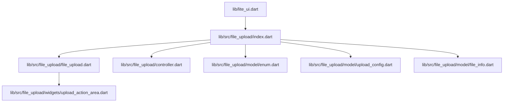
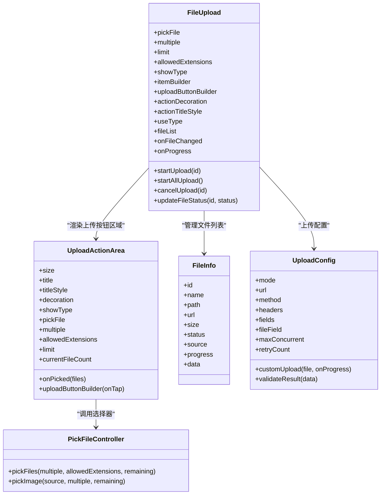
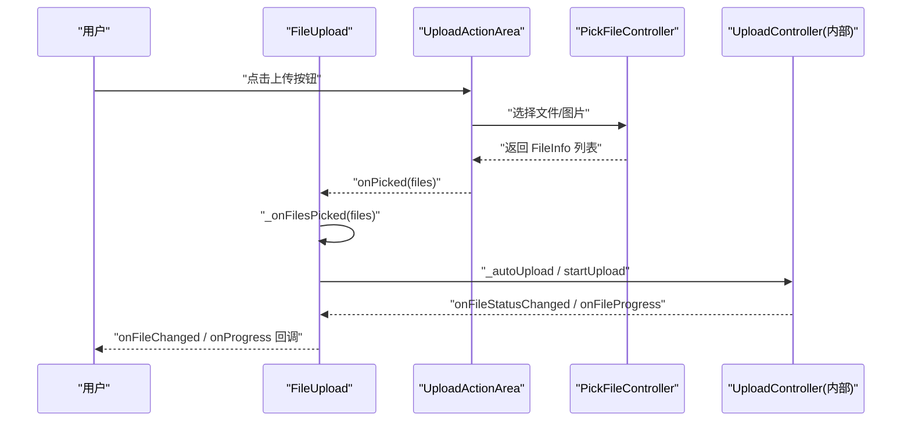
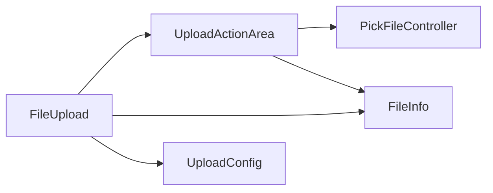

# 扩展接口设计

<cite>
**本文引用的文件**   
- [lite_ui.dart](file://lib/lite_ui.dart)
- [file_upload.dart](file://lib/src/file_upload/file_upload.dart)
- [upload_action_area.dart](file://lib/src/file_upload/widgets/upload_action_area.dart)
- [controller.dart](file://lib/src/file_upload/controller.dart)
- [enum.dart](file://lib/src/file_upload/model/enum.dart)
- [upload_config.dart](file://lib/src/file_upload/model/upload_config.dart)
- [file_info.dart](file://lib/src/file_upload/model/file_info.dart)
- [readme.md](file://lib/src/file_upload/readme.md)
</cite>

## 目录
1. [简介](#简介)
2. [项目结构](#项目结构)
3. [核心组件](#核心组件)
4. [架构总览](#架构总览)
5. [详细组件分析](#详细组件分析)
6. [依赖关系分析](#依赖关系分析)
7. [性能考量](#性能考量)
8. [故障排查指南](#故障排查指南)
9. [结论](#结论)
10. [附录](#附录)

## 简介
本文件面向 Lite UI 的文件上传组件，聚焦其“扩展接口设计”，系统性说明以下扩展能力：
- itemBuilder 自定义构建器：完全接管单个文件项的渲染。
- uploadButtonBuilder 自定义按钮构建器：替换默认上传按钮区域 UI。
- actionDecoration 装饰样式定制：覆盖上传区域的背景、边框、圆角、阴影等。
- actionTitleStyle 文字样式定制：统一控制提示文字的字体与颜色。

文档将逐项解释参数定义、返回值要求、调用时机、生命周期管理与性能优化建议，并给出实现自定义文件项渲染、自定义上传按钮样式、响应式布局适配的实践要点与最佳实践。

## 项目结构
Lite UI 通过顶层导出暴露 file_upload 模块，便于外部引用。文件上传相关代码集中在 lib/src/file_upload 下，包含模型、控制器、UI 组件与工具类。

图表来源
- [lite_ui.dart:1-19](file://lib/lite_ui.dart#L1-L19)
- [file_upload.dart:1-20](file://lib/src/file_upload/file_upload.dart#L1-L20)
- [upload_action_area.dart:1-20](file://lib/src/file_upload/widgets/upload_action_area.dart#L1-L20)

章节来源
- [lite_ui.dart:1-19](file://lib/lite_ui.dart#L1-L19)

## 核心组件
- FileUpload（StatefulWidget）：对外暴露的核心组件，提供多种展示模式与上传配置，并通过扩展点允许深度定制 UI 与行为。
- UploadActionArea（StatefulWidget）：封装上传按钮区域，支持默认样式与完全自定义按钮构建器。
- PickFileController：封装文件选择逻辑（系统文件选择器与图片选择器），返回统一的 FileInfo 列表。
- 模型与枚举：FileInfo、UploadConfig、UploadStatus、ShowType、PickFile、FileAction、UseType 等，用于描述数据与状态。

章节来源
- [file_upload.dart:15-165](file://lib/src/file_upload/file_upload.dart#L15-L165)
- [upload_action_area.dart:16-102](file://lib/src/file_upload/widgets/upload_action_area.dart#L16-L102)
- [controller.dart:11-67](file://lib/src/file_upload/controller.dart#L11-L67)
- [enum.dart:1-105](file://lib/src/file_upload/model/enum.dart#L1-L105)
- [upload_config.dart:6-99](file://lib/src/file_upload/model/upload_config.dart#L6-L99)
- [file_info.dart:10-78](file://lib/src/file_upload/model/file_info.dart#L10-L78)

## 架构总览
下图展示了扩展点在组件中的位置与交互关系：FileUpload 负责编排展示与业务回调；UploadActionArea 负责按钮区域渲染与选择器触发；PickFileController 负责底层选择；模型与枚举贯穿数据流。

图表来源
- [file_upload.dart:15-165](file://lib/src/file_upload/file_upload.dart#L15-L165)
- [upload_action_area.dart:16-102](file://lib/src/file_upload/widgets/upload_action_area.dart#L16-L102)
- [controller.dart:11-67](file://lib/src/file_upload/controller.dart#L11-L67)
- [file_info.dart:10-78](file://lib/src/file_upload/model/file_info.dart#L10-L78)
- [upload_config.dart:38-99](file://lib/src/file_upload/model/upload_config.dart#L38-L99)

## 详细组件分析

### 扩展点一：itemBuilder 自定义构建器
- 作用：在 showType=custom 时，完全接管每个文件项的 UI 渲染。
- 参数：
  - fileInfo：当前文件信息对象（含 id、name、path、url、size、status、source、progress、data 等）。
  - index：当前文件在列表中的索引。
  - onRemove：删除当前文件的回调（内部会更新状态并触发 onFileChanged）。
- 返回值：任意 Widget。
- 调用时机：每次 _files 变化或父组件 rebuild 时重建。
- 注意事项：
  - 必须保证返回的 Widget 可响应 onRemove 以正确移除文件。
  - 建议在 itemBuilder 中避免重型计算，必要时使用 ValueKey 提升重建效率。
- 最佳实践：
  - 对大文件或复杂预览，使用懒加载与缓存策略。
  - 保持 item 高度稳定，减少重排。

章节来源
- [file_upload.dart:91-96](file://lib/src/file_upload/file_upload.dart#L91-L96)
- [file_upload.dart:550-586](file://lib/src/file_upload/file_upload.dart#L550-L586)

### 扩展点二：uploadButtonBuilder 自定义按钮构建器
- 作用：完全替换默认的上传按钮区域 UI，适用于卡片、列表、自定义三种模式。
- 参数：
  - onTap：点击上传按钮时的回调。若需要触发文件选择，请在该回调内调用 PickFileController.pickFiles/pickImage，或通过组件提供的 onPicked 机制（由 UploadActionArea 处理）。
- 返回值：任意 Widget。
- 调用时机：当 widget.uploadButtonBuilder 非空且 widget.onTap 存在时，UploadActionArea 直接使用该构建器渲染。
- 注意事项：
  - 若需保留默认选择器行为，请确保 onTap 能正确触发选择流程。
  - 自定义按钮应遵循无障碍与可访问性规范。
- 最佳实践：
  - 将按钮尺寸与主题色与整体 UI 保持一致。
  - 在受限空间场景（如头像模式）下，简化按钮内容。

章节来源
- [file_upload.dart:97-101](file://lib/src/file_upload/file_upload.dart#L97-L101)
- [upload_action_area.dart:70-77](file://lib/src/file_upload/widgets/upload_action_area.dart#L70-L77)
- [upload_action_area.dart:177-179](file://lib/src/file_upload/widgets/upload_action_area.dart#L177-L179)

### 扩展点三：actionDecoration 装饰样式定制
- 作用：覆盖 UploadActionArea 的 BoxDecoration，包括背景色、边框、圆角、渐变、阴影等。
- 参数：BoxDecoration?。为空时使用默认样式。
- 调用时机：在 UploadActionArea 构建时应用。
- 注意事项：
  - 传入后将完全覆盖默认装饰，需自行考虑不同模式的视觉一致性。
- 最佳实践：
  - 在卡片模式下设置合适的 size 与 borderRadius。
  - 在列表模式下注意渐变与边框的对比度。

章节来源
- [file_upload.dart:103-106](file://lib/src/file_upload/file_upload.dart#L103-L106)
- [upload_action_area.dart:41-45](file://lib/src/file_upload/widgets/upload_action_area.dart#L41-L45)
- [upload_action_area.dart:186-195](file://lib/src/file_upload/widgets/upload_action_area.dart#L186-L195)
- [upload_action_area.dart:216-226](file://lib/src/file_upload/widgets/upload_action_area.dart#L216-L226)

### 扩展点四：actionTitleStyle 文字样式定制
- 作用：统一控制上传按钮区域的提示文字样式（字体大小、粗细、颜色等）。
- 参数：TextStyle?。为空时使用默认样式。
- 调用时机：在 UploadActionArea 构建时应用。
- 注意事项：
  - 在不同模式下（卡片/列表/自定义）保持一致的视觉风格。
- 最佳实践：
  - 根据主题色动态生成 TextStyle，确保可读性与对比度。

章节来源
- [file_upload.dart:108-111](file://lib/src/file_upload/file_upload.dart#L108-L111)
- [upload_action_area.dart:35-36](file://lib/src/file_upload/widgets/upload_action_area.dart#L35-L36)
- [upload_action_area.dart:200-206](file://lib/src/file_upload/widgets/upload_action_area.dart#L200-L206)
- [upload_action_area.dart:245-248](file://lib/src/file_upload/widgets/upload_action_area.dart#L245-L248)

### 扩展点五：响应式布局与多模式展示
- 卡片模式：支持 columns 自适应列数或 previewSize 固定尺寸，二者互斥。
- 列表模式：横向行展示文件信息，适合文档类文件。
- 自定义模式：通过 itemBuilder 完全自定义。
- 头像模式：useType=avatar 时自动限制为单图、仅相册/拍照选择，隐藏操作按钮。

章节来源
- [file_upload.dart:40-58](file://lib/src/file_upload/file_upload.dart#L40-L58)
- [file_upload.dart:113-118](file://lib/src/file_upload/file_upload.dart#L113-L118)
- [file_upload.dart:454-504](file://lib/src/file_upload/file_upload.dart#L454-L504)
- [file_upload.dart:505-549](file://lib/src/file_upload/file_upload.dart#L505-L549)
- [file_upload.dart:558-586](file://lib/src/file_upload/file_upload.dart#L558-L586)

### 扩展点六：上传流程与回调
- 自动上传：选择文件后自动开始上传（UploadMode.auto/custom）。
- 手动上传：通过 startUpload/startAllUpload 触发。
- 进度回调：onProgress 实时上报进度。
- 文件变更回调：onFileChanged 在 add/remove/uploading/progress/success/failed 时触发。

图表来源
- [file_upload.dart:379-383](file://lib/src/file_upload/file_upload.dart#L379-L383)
- [file_upload.dart:283-289](file://lib/src/file_upload/file_upload.dart#L283-L289)
- [file_upload.dart:341-375](file://lib/src/file_upload/file_upload.dart#L341-L375)
- [upload_action_area.dart:109-137](file://lib/src/file_upload/widgets/upload_action_area.dart#L109-L137)
- [controller.dart:17-66](file://lib/src/file_upload/controller.dart#L17-L66)

## 依赖关系分析
- FileUpload 依赖 UploadActionArea 渲染按钮区域，依赖 PickFileController 进行文件选择。
- UploadActionArea 依赖 PickFileController 完成选择逻辑。
- 所有组件共享 FileInfo、UploadConfig、枚举类型，形成稳定的数据契约。

图表来源
- [file_upload.dart:1-14](file://lib/src/file_upload/file_upload.dart#L1-L14)
- [upload_action_area.dart:1-9](file://lib/src/file_upload/widgets/upload_action_area.dart#L1-L9)
- [controller.dart:1-6](file://lib/src/file_upload/controller.dart#L1-L6)

章节来源
- [file_upload.dart:1-14](file://lib/src/file_upload/file_upload.dart#L1-L14)
- [upload_action_area.dart:1-9](file://lib/src/file_upload/widgets/upload_action_area.dart#L1-L9)
- [controller.dart:1-6](file://lib/src/file_upload/controller.dart#L1-L6)

## 性能考量
- 列表重建优化：
  - 使用 ValueKey(f.id) 确保文件项稳定重建。
  - 在 didUpdateWidget 中对 fileList 进行内容比较，避免无效同步。
- 选择器防抖：
  - 在 UploadActionArea 中使用 _isPicking 标记防止重复触发选择。
- 并发控制：
  - UploadConfig.maxConcurrent 控制最大并发上传数，避免网络拥塞。
- 内存与渲染：
  - 在 itemBuilder 中避免重型计算，必要时使用缓存或延迟加载。
  - 合理设置 spacing、columns、previewSize，减少 Wrap 重排。

章节来源
- [file_upload.dart:190-212](file://lib/src/file_upload/file_upload.dart#L190-L212)
- [file_upload.dart:468-484](file://lib/src/file_upload/file_upload.dart#L468-L484)
- [upload_action_area.dart:104-118](file://lib/src/file_upload/widgets/upload_action_area.dart#L104-L118)
- [upload_config.dart:57-61](file://lib/src/file_upload/model/upload_config.dart#L57-L61)

## 故障排查指南
- 达到上传数量上限：
  - 现象：点击上传按钮无反应，可能弹出 SnackBar 提示。
  - 原因：limit > 0 且 currentFileCount >= limit。
  - 解决：调整 limit 或先删除部分文件。
- 未提供 itemBuilder：
  - 现象：显示错误提示文本。
  - 原因：showType=custom 但未提供 itemBuilder。
  - 解决：提供有效的 itemBuilder。
- 上传失败重试：
  - 现象：上传失败后无法自动重试。
  - 原因：retryCount=0 或未配置 validateResult。
  - 解决：设置 retryCount>0 并提供 validateResult。

章节来源
- [upload_action_area.dart:112-117](file://lib/src/file_upload/widgets/upload_action_area.dart#L112-L117)
- [file_upload.dart:550-557](file://lib/src/file_upload/file_upload.dart#L550-L557)
- [upload_config.dart:72-85](file://lib/src/file_upload/model/upload_config.dart#L72-L85)

## 结论
Lite UI 文件上传组件通过清晰的扩展点设计，提供了强大的自定义能力：
- itemBuilder 与 uploadButtonBuilder 分别覆盖文件项与按钮区域的渲染。
- actionDecoration 与 actionTitleStyle 提供一致的样式定制入口。
- 配合 UploadConfig 与回调机制，可实现从选择到上传的全链路可控。
在实际项目中，建议结合响应式布局与性能优化策略，充分利用扩展点满足多样化需求。

## 附录
- API 参考与示例用法详见组件 README。

章节来源
- [readme.md:186-239](file://lib/src/file_upload/readme.md#L186-L239)