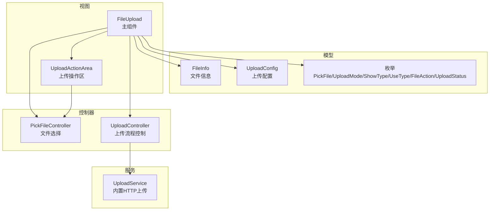
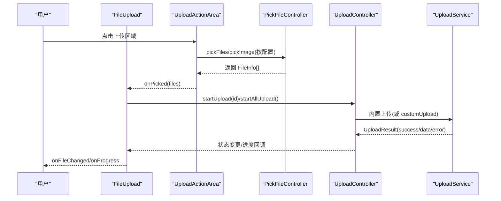
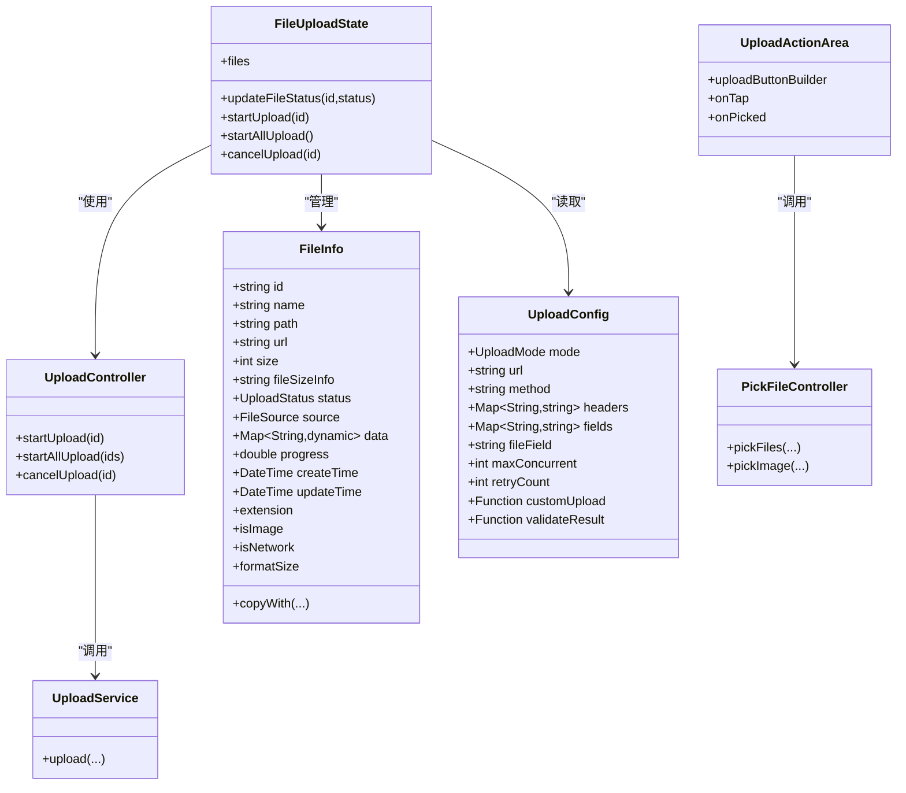
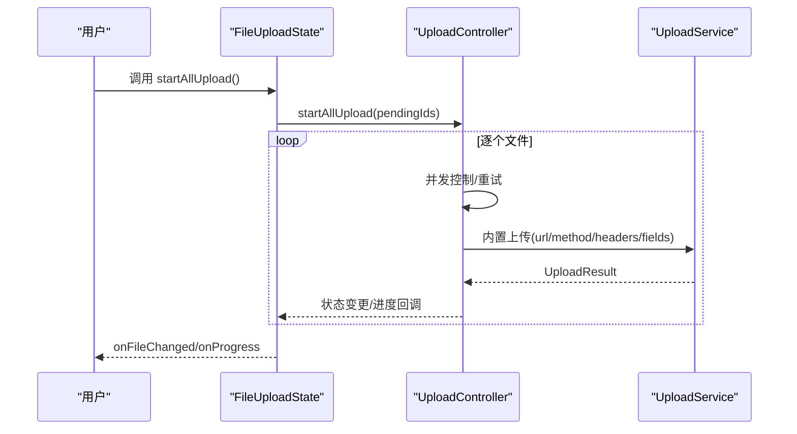
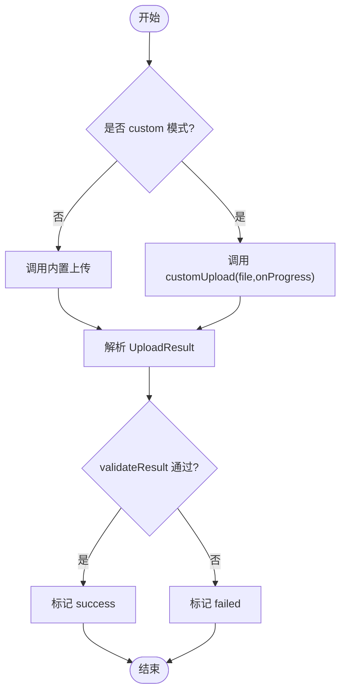
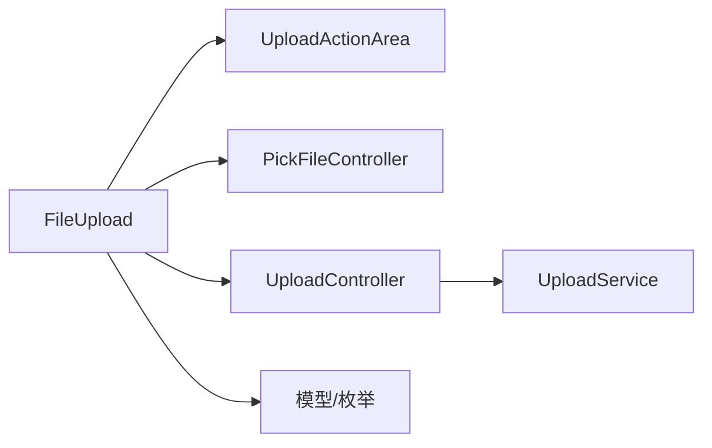

# 插件扩展

<cite>
**本文引用的文件**   
- [pubspec.yaml](file://pubspec.yaml)
- [README.md](file://README.md)
- [index.dart](file://lib/src/file_upload/index.dart)
- [enum.dart](file://lib/src/file_upload/model/enum.dart)
- [upload_config.dart](file://lib/src/file_upload/model/upload_config.dart)
- [file_info.dart](file://lib/src/file_upload/model/file_info.dart)
- [controller.dart](file://lib/src/file_upload/controller.dart)
- [file_upload.dart](file://lib/src/file_upload/file_upload.dart)
- [upload_controller.dart](file://lib/src/file_upload/service/upload_controller.dart)
- [upload_service.dart](file://lib/src/file_upload/service/upload_service.dart)
- [upload_action_area.dart](file://lib/src/file_upload/widgets/upload_action_area.dart)
- [readme.md](file://lib/src/file_upload/readme.md)
</cite>

## 目录
1. [简介](#简介)
2. [项目结构](#项目结构)
3. [核心组件](#核心组件)
4. [架构总览](#架构总览)
5. [详细组件分析](#详细组件分析)
6. [依赖关系分析](#依赖关系分析)
7. [性能考量](#性能考量)
8. [故障排查指南](#故障排查指南)
9. [结论](#结论)
10. [附录：企业级插件开发示例与最佳实践](#附录企业级插件开发示例与最佳实践)

## 简介
本文件围绕 Lite UI 的文件上传组件，系统阐述其插件扩展机制与扩展点设计。重点包括：
- 扩展点：itemBuilder 自定义构建器、uploadButtonBuilder 自定义按钮构建器、onFileChanged/onProgress 回调、UploadConfig.customUpload 自定义上传函数等。
- 枚举体系：PickFile、UploadMode、ShowType、UseType、FileAction、UploadStatus 等的含义与应用场景。
- 扩展方式：通过继承与组合扩展现有能力，支持第三方库集成（网络库、存储 SDK）、高级特性（水印、压缩、校验）。
- 架构要点：依赖注入、事件总线（回调驱动）、生命周期管理（控制器与状态分离）、并发控制与重试。

## 项目结构
文件上传模块采用“模型-服务-控制器-视图”分层组织，便于扩展与维护：
- 模型层：FileInfo、UploadConfig、枚举定义
- 服务层：内置 HTTP 上传服务
- 控制器层：文件选择控制器、上传流程控制器
- 视图层：主组件 FileUpload、上传操作区域 UploadActionArea、展示卡片/列表组件

图表来源
- [file_upload.dart:1-594](file://lib/src/file_upload/file_upload.dart#L1-L594)
- [upload_action_area.dart:1-264](file://lib/src/file_upload/widgets/upload_action_area.dart#L1-L264)
- [controller.dart:1-68](file://lib/src/file_upload/controller.dart#L1-L68)
- [upload_controller.dart:1-163](file://lib/src/file_upload/service/upload_controller.dart#L1-L163)
- [upload_service.dart:1-183](file://lib/src/file_upload/service/upload_service.dart#L1-L183)
- [file_info.dart:1-140](file://lib/src/file_upload/model/file_info.dart#L1-L140)
- [upload_config.dart:1-139](file://lib/src/file_upload/model/upload_config.dart#L1-L139)
- [enum.dart:1-105](file://lib/src/file_upload/model/enum.dart#L1-L105)

章节来源
- [index.dart:1-6](file://lib/src/file_upload/index.dart#L1-L6)
- [README.md:1-126](file://README.md#L1-L126)
- [pubspec.yaml:1-21](file://pubspec.yaml#L1-L21)

## 核心组件
- FileUpload：对外暴露的上传组件，提供多种展示模式、上传模式、扩展点与回调。
- UploadActionArea：上传触发区域，支持默认行为与 uploadButtonBuilder 完全自定义。
- PickFileController：封装 file_picker 与 image_picker，统一返回 FileInfo。
- UploadController：负责并发、重试、取消、进度上报与内置/自定义上传分发。
- UploadService：基于 dart:io 的 multipart/form-data 上传实现（Web 平台需 custom 模式）。
- FileInfo/UploadConfig/枚举：数据模型与行为开关。

章节来源
- [file_upload.dart:1-594](file://lib/src/file_upload/file_upload.dart#L1-L594)
- [upload_action_area.dart:1-264](file://lib/src/file_upload/widgets/upload_action_area.dart#L1-L264)
- [controller.dart:1-68](file://lib/src/file_upload/controller.dart#L1-L68)
- [upload_controller.dart:1-163](file://lib/src/file_upload/service/upload_controller.dart#L1-L163)
- [upload_service.dart:1-183](file://lib/src/file_upload/service/upload_service.dart#L1-L183)
- [file_info.dart:1-140](file://lib/src/file_upload/model/file_info.dart#L1-L140)
- [upload_config.dart:1-139](file://lib/src/file_upload/model/upload_config.dart#L1-L139)
- [enum.dart:1-105](file://lib/src/file_upload/model/enum.dart#L1-L105)

## 架构总览
组件通过“回调 + 配置”的方式实现松耦合扩展：
- 视图层通过 onFileChanged/onProgress 与外部通信
- 上传逻辑由 UploadController 统一管理，支持 auto/manual/custom 三种模式
- 文件选择由 PickFileController 屏蔽平台差异
- 内置上传使用 UploadService，也可通过 customUpload 接入任意网络库或存储 SDK

图表来源
- [file_upload.dart:1-594](file://lib/src/file_upload/file_upload.dart#L1-L594)
- [upload_action_area.dart:1-264](file://lib/src/file_upload/widgets/upload_action_area.dart#L1-L264)
- [controller.dart:1-68](file://lib/src/file_upload/controller.dart#L1-L68)
- [upload_controller.dart:1-163](file://lib/src/file_upload/service/upload_controller.dart#L1-L163)
- [upload_service.dart:1-183](file://lib/src/file_upload/service/upload_service.dart#L1-L183)

## 详细组件分析

### 枚举类型与语义
- UploadStatus：待上传、上传中、成功、失败。用于描述单文件的上传生命周期。
- ShowType：card（卡片网格）、textInfo（列表行）、custom（自定义项构建）。
- FileSource：file/image/camera/imageOrCamera/all/network。标识文件来源。
- FileAction：defaultLoad/add/remove/uploading/progress/success/failed。用于 onFileChanged 的动作语义。
- PickFile：file/gallery/camera/all/imageOrCamera。选择器入口。
- ActionFileSheet：preview/retry/replace/delete。卡片操作菜单项。
- UseType：normal/avatar。头像模式下自动覆盖 limit=1、multiple=false、pickFile=imageOrCamera。
- UploadMode：auto/manual/custom。上传触发策略。

章节来源
- [enum.dart:1-105](file://lib/src/file_upload/model/enum.dart#L1-L105)
- [upload_config.dart:1-139](file://lib/src/file_upload/model/upload_config.dart#L1-L139)
- [file_upload.dart:1-594](file://lib/src/file_upload/file_upload.dart#L1-L594)

### 数据模型：FileInfo
- id：雪花算法生成，唯一标识，用于删除、匹配等操作。
- name/path/url/size：文件名、本地路径、网络地址、大小。
- status/source/data/progress/createTime/updateTime：状态、来源、响应数据、进度、时间戳。
- 便捷方法：extension/isImage/isNetwork/formatSize/copyWith。

章节来源
- [file_info.dart:1-140](file://lib/src/file_upload/model/file_info.dart#L1-L140)

### 上传配置：UploadConfig
- mode：auto/manual/custom。
- url/method/headers/fields/fileField：HTTP 参数。
- maxConcurrent/retryCount：并发与重试。
- customUpload：自定义上传函数，接收 FileInfo 与 onProgress 回调，返回 UploadResult。
- validateResult：业务结果校验，默认仅校验 HTTP 2xx。

章节来源
- [upload_config.dart:1-139](file://lib/src/file_upload/model/upload_config.dart#L1-L139)

### 文件选择控制器：PickFileController
- pickFiles：基于 file_picker，支持多选、扩展名过滤、剩余数量限制。
- pickImage：基于 image_picker，支持相册多选、拍照单选。
- 统一返回 FileInfo 列表，屏蔽平台差异。

章节来源
- [controller.dart:1-68](file://lib/src/file_upload/controller.dart#L1-L68)

### 上传流程控制器：UploadController
- startUpload/startAllUpload：受 maxConcurrent 限制，逐批执行。
- cancelUpload：将状态恢复为 pending。
- _executeUpload：重试、取消、进度上报、内置/自定义上传分发、业务校验。
- 通过回调通知状态变化与进度，不持有文件列表，解耦 UI。

章节来源
- [upload_controller.dart:1-163](file://lib/src/file_upload/service/upload_controller.dart#L1-L163)

### 内置上传服务：UploadService
- 使用 dart:io HttpClient 以 multipart/form-data 上传。
- 分块发送并节流进度回调，避免频繁刷新。
- Web 平台不可用，需走 custom 模式。

章节来源
- [upload_service.dart:1-183](file://lib/src/file_upload/service/upload_service.dart#L1-L183)

### 主组件：FileUpload
- 展示模式：card/textInfo/custom。
- 扩展点：
  - itemBuilder：自定义文件项 UI（custom 模式必填）。
  - uploadButtonBuilder：完全替换上传按钮 UI。
  - actionDecoration/actionTitleStyle：装饰与样式覆盖。
  - onFileChanged/onProgress：事件回调。
  - uploadConfig：启用上传能力。
- 头像模式：useType=avatar 时自动覆盖多项配置。
- 初始回显：fileList 支持编辑模式回显，首次同步后触发 defaultLoad。

章节来源
- [file_upload.dart:1-594](file://lib/src/file_upload/file_upload.dart#L1-L594)

### 上传操作区域：UploadActionArea
- 默认行为：根据 pickFile 调用 PickFileController，完成选择后 onPicked。
- 自定义模式：uploadButtonBuilder 完全接管 UI 与行为，传入 onTap 供外部处理。
- 数量上限：达到 limit 时提示并阻止继续选择。

章节来源
- [upload_action_area.dart:1-264](file://lib/src/file_upload/widgets/upload_action_area.dart#L1-L264)

### 类图（代码级）

图表来源
- [file_info.dart:1-140](file://lib/src/file_upload/model/file_info.dart#L1-L140)
- [upload_config.dart:1-139](file://lib/src/file_upload/model/upload_config.dart#L1-L139)
- [controller.dart:1-68](file://lib/src/file_upload/controller.dart#L1-L68)
- [upload_controller.dart:1-163](file://lib/src/file_upload/service/upload_controller.dart#L1-L163)
- [upload_service.dart:1-183](file://lib/src/file_upload/service/upload_service.dart#L1-L183)
- [file_upload.dart:1-594](file://lib/src/file_upload/file_upload.dart#L1-L594)
- [upload_action_area.dart:1-264](file://lib/src/file_upload/widgets/upload_action_area.dart#L1-L264)

### 关键流程时序（手动上传）

图表来源
- [file_upload.dart:1-594](file://lib/src/file_upload/file_upload.dart#L1-L594)
- [upload_controller.dart:1-163](file://lib/src/file_upload/service/upload_controller.dart#L1-L163)
- [upload_service.dart:1-183](file://lib/src/file_upload/service/upload_service.dart#L1-L183)

### 复杂逻辑流程图（自定义上传）

图表来源
- [upload_controller.dart:1-163](file://lib/src/file_upload/service/upload_controller.dart#L1-L163)
- [upload_config.dart:1-139](file://lib/src/file_upload/model/upload_config.dart#L1-L139)

## 依赖关系分析
- 外部依赖：file_picker、image_picker（见 pubspec.yaml）。
- 内部依赖：
  - FileUpload 依赖 UploadActionArea、PickFileController、UploadController、枚举与模型。
  - UploadController 依赖 UploadService 与 UploadConfig。
  - UploadActionArea 依赖 PickFileController。
- 无循环依赖；职责清晰，易于替换与扩展。

图表来源
- [file_upload.dart:1-594](file://lib/src/file_upload/file_upload.dart#L1-L594)
- [upload_action_area.dart:1-264](file://lib/src/file_upload/widgets/upload_action_area.dart#L1-L264)
- [controller.dart:1-68](file://lib/src/file_upload/controller.dart#L1-L68)
- [upload_controller.dart:1-163](file://lib/src/file_upload/service/upload_controller.dart#L1-L163)
- [upload_service.dart:1-183](file://lib/src/file_upload/service/upload_service.dart#L1-L183)

章节来源
- [pubspec.yaml:1-21](file://pubspec.yaml#L1-L21)

## 性能考量
- 并发控制：UploadController 通过 maxConcurrent 限制同时上传数，避免阻塞。
- 进度节流：UploadService 分块发送并按百分比节流回调，减少 UI 刷新压力。
- 列表渲染：Card/List 模式按需渲染，避免不必要的重建。
- 初始同步：FileUploadState 对 fileList 进行稳定签名比较，避免无效 rebuild。
- Web 平台：内置上传不可用，应使用 custom 模式配合浏览器 API 或 http 库。

[本节为通用指导，无需源码引用]

## 故障排查指南
- 未配置 url：内置上传会返回错误，请检查 UploadConfig.url。
- 文件路径为空：无法上传，确认选择流程是否正确返回 path。
- 业务校验失败：实现 validateResult，确保服务端返回的业务码正确。
- 取消上传：调用 cancelUpload 后状态恢复为 pending，可再次上传。
- Web 平台报错：改用 custom 模式，使用浏览器兼容的网络库。

章节来源
- [upload_controller.dart:1-163](file://lib/src/file_upload/service/upload_controller.dart#L1-L163)
- [upload_service.dart:1-183](file://lib/src/file_upload/service/upload_service.dart#L1-L183)

## 结论
Lite UI 文件上传组件通过清晰的层次划分与丰富的扩展点，提供了开箱即用的选择与上传能力，同时允许深度定制 UI 与上传流程。借助枚举与配置，开发者可以灵活适配不同业务场景，并通过 customUpload 无缝集成第三方库与存储方案。

[本节为总结性内容，无需源码引用]

## 附录：企业级插件开发示例与最佳实践

### 扩展点清单
- 自定义文件项 UI：itemBuilder（ShowType.custom 必填）
- 自定义上传按钮：uploadButtonBuilder（所有模式可用）
- 自定义上传逻辑：UploadConfig.customUpload（UploadMode.custom）
- 事件监听：onFileChanged（add/remove/uploading/progress/success/failed/defaultLoad）
- 进度监听：onProgress（id, path, progress）
- 样式覆盖：actionDecoration、actionTitleStyle、borderRadius、fileRadius

章节来源
- [file_upload.dart:1-594](file://lib/src/file_upload/file_upload.dart#L1-L594)
- [upload_action_area.dart:1-264](file://lib/src/file_upload/widgets/upload_action_area.dart#L1-L264)
- [upload_config.dart:1-139](file://lib/src/file_upload/model/upload_config.dart#L1-L139)

### 依赖注入与组合
- 通过 UploadConfig.customUpload 注入自定义上传实现（如 Dio、OkHttp、云存储 SDK）。
- 通过 UploadController 的回调接口（_onFileStatusChanged/_onFileProgress）与外部状态管理（Provider/Riverpod/Bloc）集成。
- 通过 FileInfo.data 透传服务端响应，便于后续处理。

章节来源
- [upload_controller.dart:1-163](file://lib/src/file_upload/service/upload_controller.dart#L1-L163)
- [file_info.dart:1-140](file://lib/src/file_upload/model/file_info.dart#L1-L140)

### 事件总线与生命周期
- 事件总线：onFileChanged/onProgress 作为轻量事件通道，适合跨层通信。
- 生命周期：FileUploadState 管理文件列表与状态，UploadController 管理上传生命周期（并发/重试/取消）。

章节来源
- [file_upload.dart:1-594](file://lib/src/file_upload/file_upload.dart#L1-L594)
- [upload_controller.dart:1-163](file://lib/src/file_upload/service/upload_controller.dart#L1-L163)

### 高级特性实现建议
- 自定义文件处理器：在 customUpload 中对 path 进行预处理（压缩、裁剪、转格式），再上传。
- 第三方存储集成：对接云存储 SDK（如 OSS/S3），在 customUpload 中完成签名与上传。
- 水印添加：在 customUpload 中读取图片流，叠加水印后再写入临时文件上传。
- 图片压缩：在 customPicker 或 customUpload 中先压缩，再上传，降低带宽与存储成本。
- 安全校验：在 validateResult 中校验业务码，结合 headers 注入鉴权信息。

章节来源
- [upload_config.dart:1-139](file://lib/src/file_upload/model/upload_config.dart#L1-L139)
- [controller.dart:1-68](file://lib/src/file_upload/controller.dart#L1-L68)

### 完整示例指引（步骤说明）
- 仅选择文件：不传 uploadConfig，使用 onFileChanged 收集文件。
- 自动上传：UploadMode.auto + url，选择后自动上传。
- 手动上传：UploadMode.manual + GlobalKey<FileUploadState>，调用 startAllUpload。
- 自定义上传：UploadMode.custom + customUpload，完全接管上传逻辑。
- 自定义 UI：提供 itemBuilder 与 uploadButtonBuilder，实现品牌化界面。

章节来源
- [readme.md:1-238](file://lib/src/file_upload/readme.md#L1-L238)
- [file_upload.dart:1-594](file://lib/src/file_upload/file_upload.dart#L1-L594)