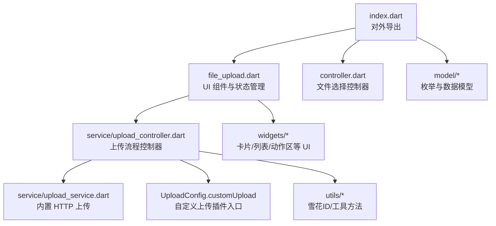
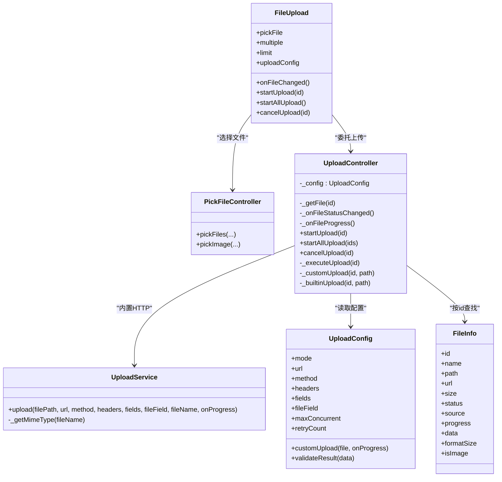
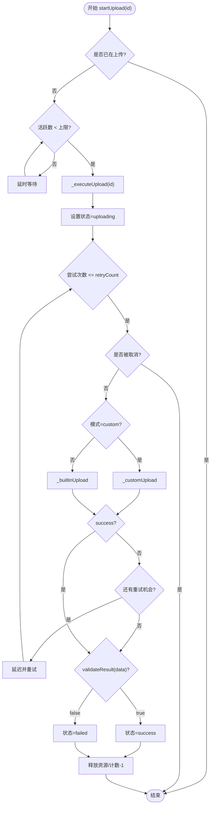
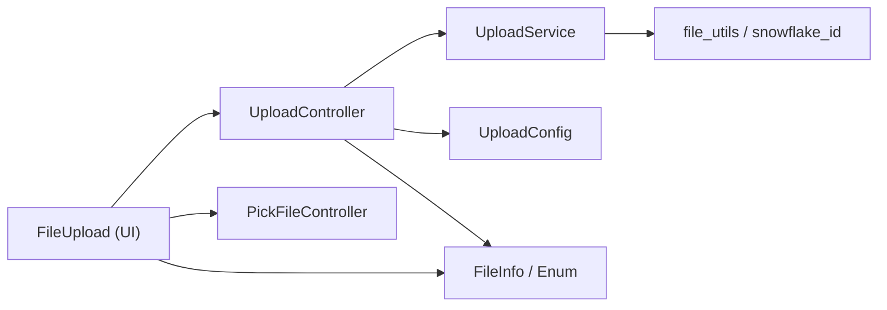

# 插件架构设计

<cite>
**本文引用的文件**
- [README.md](file://README.md)
- [pubspec.yaml](file://pubspec.yaml)
- [lib/src/file_upload/index.dart](file://lib/src/file_upload/index.dart)
- [lib/src/file_upload/controller.dart](file://lib/src/file_upload/controller.dart)
- [lib/src/file_upload/file_upload.dart](file://lib/src/file_upload/file_upload.dart)
- [lib/src/file_upload/readme.md](file://lib/src/file_upload/readme.md)
- [lib/src/file_upload/model/enum.dart](file://lib/src/file_upload/model/enum.dart)
- [lib/src/file_upload/model/file_info.dart](file://lib/src/file_upload/model/file_info.dart)
- [lib/src/file_upload/model/upload_config.dart](file://lib/src/file_upload/model/upload_config.dart)
- [lib/src/file_upload/service/upload_controller.dart](file://lib/src/file_upload/service/upload_controller.dart)
- [lib/src/file_upload/service/upload_service.dart](file://lib/src/file_upload/service/upload_service.dart)
- [lib/src/file_upload/utils/snowflake_id.dart](file://lib/src/file_upload/utils/snowflake_id.dart)
- [lib/src/file_upload/utils/file_utils.dart](file://lib/src/file_upload/utils/file_utils.dart)
</cite>

## 目录
1. [简介](#简介)
2. [项目结构](#项目结构)
3. [核心组件](#核心组件)
4. [架构总览](#架构总览)
5. [详细组件分析](#详细组件分析)
6. [依赖关系分析](#依赖关系分析)
7. [性能考量](#性能考量)
8. [故障排查指南](#故障排查指南)
9. [结论](#结论)
10. [附录：企业级插件开发指南与最佳实践](#附录企业级插件开发指南与最佳实践)

## 简介
本文件围绕 Lite UI 的文件上传组件，系统化阐述其“插件化”架构设计与实现原理。该组件通过控制器模式、事件回调机制与可插拔的上传策略（内置 HTTP 或自定义上传函数），实现了职责分离与高扩展性。文档将深入解析 UploadController 的设计思路与职责边界，涵盖文件状态管理、任务调度、并发控制、重试与取消等关键能力；并给出如何基于现有接口扩展第三方存储、水印处理、图片压缩等企业级插件的实践路径与最佳实践。

## 项目结构
Lite UI 的 file_upload 模块采用分层组织：模型层定义枚举与数据模型，服务层封装上传流程与网络请求，控制器层协调状态与生命周期，UI 层负责交互与展示。入口统一由 index.dart 暴露对外 API。

图表来源
- [lib/src/file_upload/index.dart:1-6](file://lib/src/file_upload/index.dart#L1-L6)
- [lib/src/file_upload/file_upload.dart:1-594](file://lib/src/file_upload/file_upload.dart#L1-L594)
- [lib/src/file_upload/controller.dart:1-68](file://lib/src/file_upload/controller.dart#L1-L68)
- [lib/src/file_upload/service/upload_controller.dart:1-163](file://lib/src/file_upload/service/upload_controller.dart#L1-L163)
- [lib/src/file_upload/service/upload_service.dart:1-183](file://lib/src/file_upload/service/upload_service.dart#L1-L183)
- [lib/src/file_upload/utils/snowflake_id.dart:1-40](file://lib/src/file_upload/utils/snowflake_id.dart#L1-L40)
- [lib/src/file_upload/utils/file_utils.dart:1-51](file://lib/src/file_upload/utils/file_utils.dart#L1-L51)

章节来源
- [README.md:1-126](file://README.md#L1-L126)
- [pubspec.yaml:1-21](file://pubspec.yaml#L1-L21)
- [lib/src/file_upload/index.dart:1-6](file://lib/src/file_upload/index.dart#L1-L6)

## 核心组件
- 文件选择控制器（PickFileController）：封装系统文件与图片选择器，返回统一的 FileInfo 列表，与 UI 解耦。
- 上传流程控制器（UploadController）：负责并发控制、重试、取消、进度上报、内置/自定义上传分发。
- 内置上传服务（UploadService）：使用 dart:io 以 multipart/form-data 上传，提供进度节流与错误分类。
- 配置与模型（UploadConfig、FileInfo、枚举）：描述上传模式、参数、结果与状态流转。
- UI 组件（FileUpload）：聚合选择、展示、操作与上传触发，维护文件状态并通过回调通知外部。

章节来源
- [lib/src/file_upload/controller.dart:1-68](file://lib/src/file_upload/controller.dart#L1-L68)
- [lib/src/file_upload/service/upload_controller.dart:1-163](file://lib/src/file_upload/service/upload_controller.dart#L1-L163)
- [lib/src/file_upload/service/upload_service.dart:1-183](file://lib/src/file_upload/service/upload_service.dart#L1-L183)
- [lib/src/file_upload/model/upload_config.dart:1-139](file://lib/src/file_upload/model/upload_config.dart#L1-L139)
- [lib/src/file_upload/model/file_info.dart:1-140](file://lib/src/file_upload/model/file_info.dart#L1-L140)
- [lib/src/file_upload/model/enum.dart:1-105](file://lib/src/file_upload/model/enum.dart#L1-L105)
- [lib/src/file_upload/file_upload.dart:1-594](file://lib/src/file_upload/file_upload.dart#L1-L594)

## 架构总览
整体采用“控制器 + 服务 + 配置驱动”的分层架构。UI 层仅关注交互与展示，业务逻辑下沉至控制器与服务层。上传策略通过 UploadMode 与 UploadConfig 注入，支持自动/手动/自定义三种模式，形成可扩展的插件式上传管线。

图表来源
- [lib/src/file_upload/file_upload.dart:1-594](file://lib/src/file_upload/file_upload.dart#L1-L594)
- [lib/src/file_upload/controller.dart:1-68](file://lib/src/file_upload/controller.dart#L1-L68)
- [lib/src/file_upload/service/upload_controller.dart:1-163](file://lib/src/file_upload/service/upload_controller.dart#L1-L163)
- [lib/src/file_upload/service/upload_service.dart:1-183](file://lib/src/file_upload/service/upload_service.dart#L1-L183)
- [lib/src/file_upload/model/upload_config.dart:1-139](file://lib/src/file_upload/model/upload_config.dart#L1-L139)
- [lib/src/file_upload/model/file_info.dart:1-140](file://lib/src/file_upload/model/file_info.dart#L1-L140)

## 详细组件分析

### 文件选择控制器（PickFileController）
- 职责：封装 file_picker 与 image_picker 的选择行为，统一返回 FileInfo 列表，屏蔽平台差异与多选限制。
- 关键点：
  - 在 Android 上多选需使用 FileType.custom 以触发 DocumentsUI 的多选模式。
  - 对 remaining 参数进行裁剪，配合 limit 使用。
  - 区分图片来源（相册/相机/文件），设置对应 source。

章节来源
- [lib/src/file_upload/controller.dart:1-68](file://lib/src/file_upload/controller.dart#L1-L68)
- [lib/src/file_upload/model/enum.dart:28-47](file://lib/src/file_upload/model/enum.dart#L28-L47)

### 上传流程控制器（UploadController）
- 职责：编排上传生命周期，包括并发控制、重试、取消、进度上报、内置/自定义上传分发。
- 并发控制：通过 _activeUploadCount 与 maxConcurrent 限流，轮询等待直至可用。
- 重试逻辑：按 attempt 循环，失败后延迟重试，支持最大重试次数。
- 取消机制：通过 _cancelFlags 标记，并在关键节点检查，取消后将状态恢复为 pending。
- 上传分发：根据 UploadMode 选择 _builtinUpload 或 _customUpload。
- 结果校验：可选 validateResult 对响应数据进行业务校验。

图表来源
- [lib/src/file_upload/service/upload_controller.dart:36-122](file://lib/src/file_upload/service/upload_controller.dart#L36-L122)

章节来源
- [lib/src/file_upload/service/upload_controller.dart:1-163](file://lib/src/file_upload/service/upload_controller.dart#L1-L163)

### 内置上传服务（UploadService）
- 职责：基于 dart:io 的 HttpClient 实现 multipart/form-data 上传，提供进度节流与错误分类。
- 关键点：
  - 动态生成 boundary，构建 body，分块发送并节流上报进度。
  - 根据文件名推断 MIME 类型，确保服务端正确识别。
  - 捕获 Socket/Http 异常，统一返回失败结果。
  - Web 平台不可用，需切换至自定义上传模式。

章节来源
- [lib/src/file_upload/service/upload_service.dart:1-183](file://lib/src/file_upload/service/upload_service.dart#L1-L183)

### 配置与模型（UploadConfig、FileInfo、枚举）
- UploadConfig：集中管理上传模式、网络参数、并发与重试、自定义上传函数与结果校验。
- FileInfo：统一文件生命周期数据，包含 id、name、path/url、size、status/source、progress、data 等，并提供 copyWith、formatSize、isImage 等便捷方法。
- 枚举：UploadStatus、ShowType、FileSource、FileAction、PickFile、ActionFileSheet 等，规范状态与行为。

章节来源
- [lib/src/file_upload/model/upload_config.dart:1-139](file://lib/src/file_upload/model/upload_config.dart#L1-L139)
- [lib/src/file_upload/model/file_info.dart:1-140](file://lib/src/file_upload/model/file_info.dart#L1-L140)
- [lib/src/file_upload/model/enum.dart:1-105](file://lib/src/file_upload/model/enum.dart#L1-L105)

### UI 组件（FileUpload）
- 职责：聚合文件选择、展示（卡片/列表/自定义）、操作（删除/替换/重试）与上传触发；维护内部文件列表并通过回调通知外部。
- 关键点：
  - 头像模式与普通模式的差异化处理（limit/multiple/pickFile）。
  - 初始 fileList 同步与去重比较，避免无效 rebuild。
  - 自动上传与手动上传的统一入口，通过 UploadController 委派。
  - 进度与状态变更回调，向上抛出 FileAction 与 onProgress。

章节来源
- [lib/src/file_upload/file_upload.dart:1-594](file://lib/src/file_upload/file_upload.dart#L1-L594)

## 依赖关系分析
- 组件间耦合度低：UI 不直接访问网络层，而是通过 UploadController 抽象；选择器与 UI 解耦。
- 依赖方向清晰：UI → 控制器 → 服务/配置；工具类被多处复用。
- 无循环依赖：各模块职责单一，导入关系单向。

图表来源
- [lib/src/file_upload/file_upload.dart:1-594](file://lib/src/file_upload/file_upload.dart#L1-L594)
- [lib/src/file_upload/service/upload_controller.dart:1-163](file://lib/src/file_upload/service/upload_controller.dart#L1-L163)
- [lib/src/file_upload/service/upload_service.dart:1-183](file://lib/src/file_upload/service/upload_service.dart#L1-L183)
- [lib/src/file_upload/model/upload_config.dart:1-139](file://lib/src/file_upload/model/upload_config.dart#L1-L139)
- [lib/src/file_upload/model/file_info.dart:1-140](file://lib/src/file_upload/model/file_info.dart#L1-L140)
- [lib/src/file_upload/utils/file_utils.dart:1-51](file://lib/src/file_upload/utils/file_utils.dart#L1-L51)
- [lib/src/file_upload/utils/snowflake_id.dart:1-40](file://lib/src/file_upload/utils/snowflake_id.dart#L1-L40)

章节来源
- [lib/src/file_upload/index.dart:1-6](file://lib/src/file_upload/index.dart#L1-L6)

## 性能考量
- 并发控制：通过 maxConcurrent 限制同时上传数量，避免阻塞与内存峰值过高。
- 进度节流：UploadService 每 10% 或最后一块才上报进度，减少 UI 刷新频率。
- 分块发送：按 32KB 分块写入请求流，降低单次内存占用。
- 事件循环让出：周期性 Future.delayed(Duration.zero) 保证 UI 及时刷新。
- 列表对比优化：FileUploadState 对 fileList 进行签名比较，避免不必要的 setState。

[本节为通用性能建议，不直接分析具体文件]

## 故障排查指南
- 未配置上传地址：当 mode 非 custom 且 url 为空时，内置上传会直接返回失败。
- 网络连接失败：SocketException 会被捕获并转换为失败结果。
- HTTP 异常：HttpException 统一处理并附带状态码与响应片段。
- 业务校验失败：validateResult 返回 false 时，视为失败。
- 文件路径为空：无法上传时将输出调试信息并标记失败。
- Web 平台限制：内置上传不可用，需切换到 custom 模式。

章节来源
- [lib/src/file_upload/service/upload_controller.dart:87-122](file://lib/src/file_upload/service/upload_controller.dart#L87-L122)
- [lib/src/file_upload/service/upload_service.dart:114-135](file://lib/src/file_upload/service/upload_service.dart#L114-L135)

## 结论
Lite UI 文件上传组件通过清晰的控制器模式与可插拔上传策略，实现了高内聚、低耦合的架构设计。UploadController 承担核心编排职责，UploadService 专注网络传输细节，UI 层保持简洁。借助 UploadConfig 的 customUpload 与 validateResult，开发者可以灵活扩展第三方存储、预处理（水印/压缩）与业务校验，满足企业级场景需求。

[本节为总结性内容，不直接分析具体文件]

## 附录：企业级插件开发指南与最佳实践

### 插件化扩展点
- 自定义上传插件：通过 UploadConfig.customUpload 注入上传逻辑，接收 FileInfo 与 onProgress 回调，返回 UploadResult。
- 结果校验插件：通过 UploadConfig.validateResult 对响应数据进行业务成功判定。
- 选择器插件：如需扩展更多来源（如云盘、扫码），可在 UI 层增加选择入口并复用 PickFileController 的返回格式。

章节来源
- [lib/src/file_upload/model/upload_config.dart:63-85](file://lib/src/file_upload/model/upload_config.dart#L63-L85)
- [lib/src/file_upload/service/upload_controller.dart:124-135](file://lib/src/file_upload/service/upload_controller.dart#L124-L135)

### 插件注册与生命周期管理
- 注册方式：在应用启动时创建 UploadConfig 实例并传入 FileUpload.uploadConfig。
- 生命周期：
  - 初始化：FileUploadState.initState 同步初始 fileList，首次 defaultLoad 回调。
  - 运行期：onFileChanged 与 onProgress 实时反馈状态与进度。
  - 销毁：组件 dispose 前无需额外清理，UploadController 内部已管理计数与标志位。

章节来源
- [lib/src/file_upload/file_upload.dart:183-234](file://lib/src/file_upload/file_upload.dart#L183-L234)
- [lib/src/file_upload/file_upload.dart:341-375](file://lib/src/file_upload/file_upload.dart#L341-L375)

### 错误处理与监控
- 错误分类：网络异常、HTTP 异常、业务校验失败、路径为空等均有明确分支。
- 监控建议：
  - 在 customUpload 中埋点统计耗时、成功率、失败原因。
  - 在 onFileChanged/onProgress 中上报关键指标（并发数、队列长度、平均耗时）。
  - 使用日志开关与分级输出，便于生产环境定位问题。

章节来源
- [lib/src/file_upload/service/upload_service.dart:122-135](file://lib/src/file_upload/service/upload_service.dart#L122-L135)
- [lib/src/file_upload/service/upload_controller.dart:90-117](file://lib/src/file_upload/service/upload_controller.dart#L90-L117)

### 性能优化与稳定性
- 并发与重试：合理设置 maxConcurrent 与 retryCount，避免雪崩与重复请求。
- 进度节流：避免高频 setState，必要时合并更新。
- 内存管理：大文件上传建议使用流式处理，避免一次性加载到内存。
- 平台兼容：Web 端必须使用 custom 模式；Android 多选需使用 FileType.custom。

章节来源
- [lib/src/file_upload/service/upload_controller.dart:44-49](file://lib/src/file_upload/service/upload_controller.dart#L44-L49)
- [lib/src/file_upload/service/upload_service.dart:82-104](file://lib/src/file_upload/service/upload_service.dart#L82-L104)
- [lib/src/file_upload/controller.dart:17-34](file://lib/src/file_upload/controller.dart#L17-L34)

### 接口设计与模块化组织
- 接口设计：
  - UploadConfig 作为唯一配置入口，集中所有上传相关参数。
  - UploadResult 统一成功/失败语义，data 承载业务数据。
  - FileInfo 提供稳定 id 与丰富属性，便于跨层传递与匹配。
- 模块化组织：
  - model/service/controller/widgets/utils 分层清晰，便于独立测试与维护。
  - index.dart 统一对外导出，简化引用。

章节来源
- [lib/src/file_upload/model/upload_config.dart:38-99](file://lib/src/file_upload/model/upload_config.dart#L38-L99)
- [lib/src/file_upload/model/file_info.dart:57-109](file://lib/src/file_upload/model/file_info.dart#L57-L109)
- [lib/src/file_upload/index.dart:1-6](file://lib/src/file_upload/index.dart#L1-L6)

### 版本兼容性考虑
- 依赖版本锁定：pubspec.yaml 指定 SDK 与 Flutter 版本范围，确保兼容性。
- 平台差异：Web 不支持 dart:io，需在文档与示例中明确提示。
- 向后兼容：新增字段默认值应保守，避免破坏既有用法。

章节来源
- [pubspec.yaml:1-21](file://pubspec.yaml#L1-L21)
- [lib/src/file_upload/service/upload_service.dart:10-12](file://lib/src/file_upload/service/upload_service.dart#L10-L12)

### 完整插件示例（步骤指引）
- 步骤一：定义 UploadConfig.mode = UploadMode.custom，并实现 customUpload(file, onProgress)。
- 步骤二：在 customUpload 中调用自有网络库上传，按进度调用 onProgress。
- 步骤三：返回 UploadResult.success(data: {...}) 或 UploadResult.failure(error: "...")。
- 步骤四：可选实现 validateResult(data) 进行业务成功判定。
- 步骤五：在 onFileChanged/onProgress 中记录日志与埋点，完成监控闭环。

章节来源
- [lib/src/file_upload/model/upload_config.dart:63-85](file://lib/src/file_upload/model/upload_config.dart#L63-L85)
- [lib/src/file_upload/service/upload_controller.dart:124-135](file://lib/src/file_upload/service/upload_controller.dart#L124-L135)
- [lib/src/file_upload/file_upload.dart:341-375](file://lib/src/file_upload/file_upload.dart#L341-L375)

### 高级特性扩展建议
- 第三方存储集成：在 customUpload 中对接对象存储（如 OSS/S3），处理签名与分片上传。
- 水印添加：在 customUpload 前对图片进行水印合成，再上传。
- 图片压缩：在 customUpload 前进行尺寸/质量压缩，减少带宽与存储成本。
- 断点续传：结合服务端能力，在 customUpload 中实现分片与续传逻辑。

[本节为概念性指导，不直接分析具体文件]