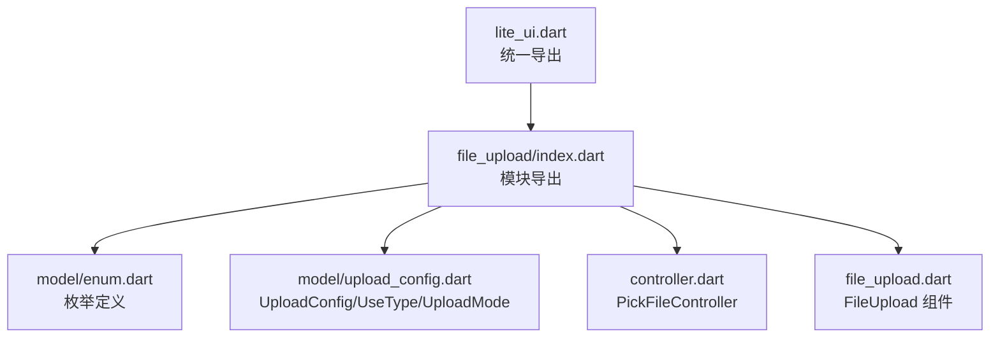
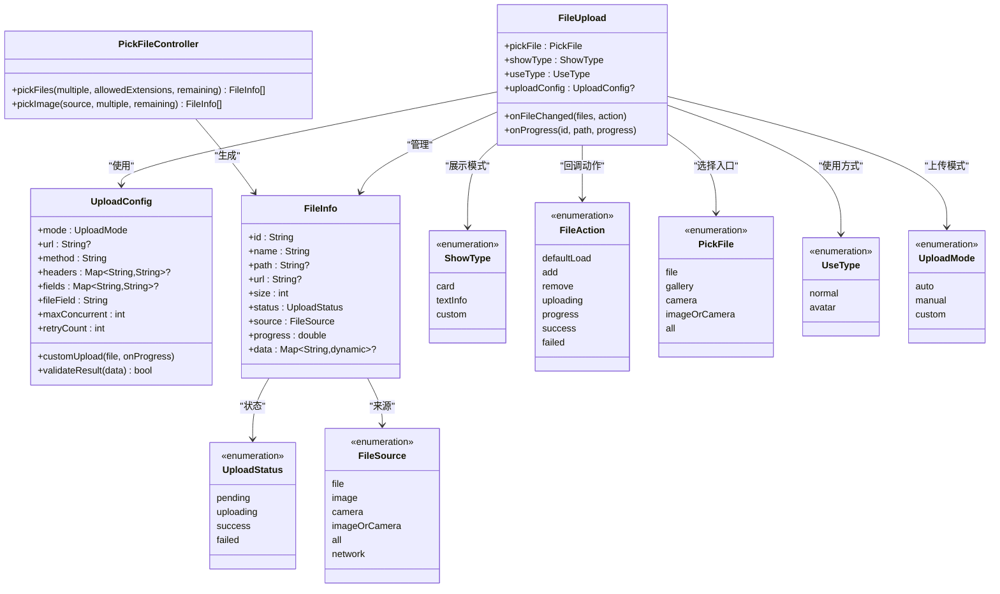
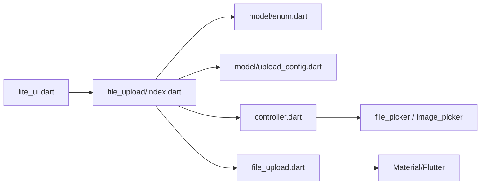

# 枚举类型定义

<cite>
**本文引用的文件**
- [lib/src/file_upload/model/enum.dart](file://lib/src/file_upload/model/enum.dart)
- [lib/src/file_upload/model/upload_config.dart](file://lib/src/file_upload/model/upload_config.dart)
- [lib/src/file_upload/controller.dart](file://lib/src/file_upload/controller.dart)
- [lib/src/file_upload/file_upload.dart](file://lib/src/file_upload/file_upload.dart)
- [lib/src/file_upload/index.dart](file://lib/src/file_upload/index.dart)
- [lib/lite_ui.dart](file://lib/lite_ui.dart)
- [lib/src/file_upload/readme.md](file://lib/src/file_upload/readme.md)
</cite>

## 目录
1. [简介](#简介)
2. [项目结构](#项目结构)
3. [核心组件](#核心组件)
4. [架构总览](#架构总览)
5. [详细组件分析](#详细组件分析)
6. [依赖关系分析](#依赖关系分析)
7. [性能与约束](#性能与约束)
8. [故障排查指南](#故障排查指南)
9. [结论](#结论)
10. [附录：使用示例与最佳实践](#附录使用示例与最佳实践)

## 简介
本文件为 Lite UI 文件上传组件的枚举类型提供系统化、可操作的文档。覆盖以下枚举的定义、含义、适用场景、组合规则与约束，并给出在不同场景下的使用方法与错误处理建议：
- PickFile（文件选择方式）
- UploadMode（上传模式）
- ShowType（显示类型）
- UseType（使用方式）
- FileAction（文件操作）
- UploadStatus（上传状态）

同时补充了与文件来源相关的 FileSource 与 ActionFileSheet 枚举，帮助理解完整的数据流与交互流程。

## 项目结构
Lite UI 的文件上传模块位于 lib/src/file_upload 下，相关枚举集中在 model/enum.dart 与 model/upload_config.dart，并通过 index.dart 统一导出，最终由 lite_ui.dart 对外暴露。



图表来源
- [lib/lite_ui.dart:1-19](file://lib/lite_ui.dart#L1-L19)
- [lib/src/file_upload/index.dart:1-6](file://lib/src/file_upload/index.dart#L1-L6)

章节来源
- [lib/lite_ui.dart:1-19](file://lib/lite_ui.dart#L1-L19)
- [lib/src/file_upload/index.dart:1-6](file://lib/src/file_upload/index.dart#L1-L6)

## 核心组件
- 枚举定义
  - UploadStatus：描述单个文件的上传生命周期状态
  - ShowType：控制文件列表的展示样式
  - FileSource：记录文件来源（文件选择器、相册、相机、网络等）
  - FileAction：描述文件变更动作（添加、删除、上传中、进度、成功、失败、默认加载）
  - PickFile：触发文件选择的入口类型
  - ActionFileSheet：文件卡片操作菜单项（预览、重试、替换、删除）
  - UseType：组件使用方式（普通、头像）
  - UploadMode：上传模式（自动、手动、自定义）
- 配置与控制器
  - UploadConfig：封装上传能力所需参数（URL、并发、重试、自定义上传函数等）
  - PickFileController：封装文件选择逻辑（file_picker、image_picker），返回统一的 FileInfo 列表

章节来源
- [lib/src/file_upload/model/enum.dart:1-105](file://lib/src/file_upload/model/enum.dart#L1-L105)
- [lib/src/file_upload/model/upload_config.dart:1-139](file://lib/src/file_upload/model/upload_config.dart#L1-L139)
- [lib/src/file_upload/controller.dart:1-68](file://lib/src/file_upload/controller.dart#L1-L68)

## 架构总览
下图展示了枚举在组件中的协作关系：UI 层通过 PickFile 决定选择入口；选择结果以 FileInfo 形式进入状态管理；UploadStatus 驱动 UI 渲染与回调；FileAction 向外部通知关键事件；UploadMode 与 UploadConfig 共同决定上传行为。



图表来源
- [lib/src/file_upload/file_upload.dart:15-165](file://lib/src/file_upload/file_upload.dart#L15-L165)
- [lib/src/file_upload/model/upload_config.dart:31-99](file://lib/src/file_upload/model/upload_config.dart#L31-L99)
- [lib/src/file_upload/controller.dart:7-67](file://lib/src/file_upload/controller.dart#L7-L67)
- [lib/src/file_upload/model/enum.dart:1-105](file://lib/src/file_upload/model/enum.dart#L1-L105)

## 详细组件分析

### 枚举定义与语义
- UploadStatus（上传状态）
  - pending：待上传
  - uploading：上传中
  - success：上传成功
  - failed：上传失败
  - 说明：用于驱动 UI 渲染（如进度条、成功标记、失败重试按钮）与回调分发。
- ShowType（显示类型）
  - card：卡片网格布局（默认）
  - textInfo：文本列表模式
  - custom：自定义构建（需提供 itemBuilder）
  - 说明：影响 UI 布局与交互细节。
- FileSource（文件来源）
  - file：文件选择器
  - image：相册
  - camera：拍照
  - imageOrCamera：相册或拍照（弹窗）
  - all：全部（文件/相册/拍照）
  - network：网络地址（仅回显用，不触发选择器）
  - 说明：用于区分数据来源，影响展示与后续处理。
- FileAction（文件操作）
  - defaultLoad：默认加载（编辑模式回显）
  - add：添加文件
  - remove：移除文件
  - uploading：开始上传
  - progress：进度更新
  - success：上传成功
  - failed：上传失败
  - 说明：作为 onFileChanged 回调的动作标识，便于上层统计与业务处理。
- PickFile（文件选择方式）
  - file：直接选择文件
  - gallery：直接选择相册
  - camera：直接拍照
  - imageOrCamera：弹窗选择相册或拍照
  - all：弹窗选择文件/相册/拍照
  - 说明：决定调用 PickFileController 的具体实现。
- ActionFileSheet（文件操作菜单）
  - preview：预览图片
  - retry：重新上传
  - replace：替换文件
  - delete：删除文件
  - 说明：点击已上传成功的卡片时弹出操作菜单。
- UseType（使用方式）
  - normal：普通模式（默认）
  - avatar：头像模式（内部强制 limit=1、multiple=false、pickFile=imageOrCamera）
  - 说明：简化头像上传场景的配置。
- UploadMode（上传模式）
  - auto：选择后自动上传（需 url）
  - manual：手动触发上传（需 url）
  - custom：自定义上传函数（需 customUpload）
  - 说明：决定上传行为的触发时机与控制权。

章节来源
- [lib/src/file_upload/model/enum.dart:1-105](file://lib/src/file_upload/model/enum.dart#L1-L105)
- [lib/src/file_upload/model/upload_config.dart:5-29](file://lib/src/file_upload/model/upload_config.dart#L5-L29)

### 枚举之间的依赖与约束
- UseType.avatar 对其它参数的约束
  - limit 固定为 1
  - multiple 固定为 false
  - pickFile 固定为 imageOrCamera（若用户未明确指定 gallery/camera）
  - 校验断言：头像模式下 pickFile 仅支持 gallery/camera/imageOrCamera
- UploadMode 与 UploadConfig 的依赖
  - auto/manual：必须提供 url
  - custom：必须提供 customUpload
  - validateResult：可选，用于业务成功判定
- ShowType.custom 的依赖
  - 必须提供 itemBuilder，否则提示错误信息
- PickFile 与 PickFileController 的映射
  - file → pickFiles
  - gallery/camera/imageOrCamera/all → pickImage 或 PickerSheet 子选择
- UploadStatus 与 FileAction 的映射
  - uploading → FileAction.uploading
  - success → FileAction.success
  - failed → FileAction.failed
  - progress 单独触发 FileAction.progress
- FileSource.network 的使用
  - 仅用于回显，不触发选择器

章节来源
- [lib/src/file_upload/file_upload.dart:131-161](file://lib/src/file_upload/file_upload.dart#L131-L161)
- [lib/src/file_upload/file_upload.dart:236-253](file://lib/src/file_upload/file_upload.dart#L236-L253)
- [lib/src/file_upload/file_upload.dart:341-375](file://lib/src/file_upload/file_upload.dart#L341-L375)
- [lib/src/file_upload/controller.dart:17-66](file://lib/src/file_upload/controller.dart#L17-L66)

### 数据流与状态流转
```mermaid
sequenceDiagram
participant U as "用户"
participant FU as "FileUpload"
participant PC as "PickFileController"
participant ST as "状态管理"
participant UC as "UploadController(内部)"
participant CB as "回调(onFileChanged/onProgress)"
U->>FU : 点击上传区域
FU->>PC : 根据 PickFile 选择文件/图片
PC-->>FU : 返回 FileInfo 列表
FU->>ST : 添加到 _files
FU->>CB : onFileChanged([files], FileAction.add)
alt 自动上传(auto/custom)
FU->>UC : startUpload(file.id)
UC-->>FU : onFileStatusChanged(id, uploading)
FU->>CB : onFileChanged([file], FileAction.uploading)
UC-->>FU : onFileProgress(id, progress)
FU->>CB : onProgress(id, path, progress)
FU->>CB : onFileChanged([file], FileAction.progress)
UC-->>FU : onFileStatusChanged(id, success|failed)
FU->>CB : onFileChanged([file], FileAction.success|failed)
else 手动上传(manual)
U->>FU : 调用 startAllUpload()/startUpload(id)
FU->>UC : startUpload(id)
...同上...
end
```

图表来源
- [lib/src/file_upload/file_upload.dart:379-383](file://lib/src/file_upload/file_upload.dart#L379-L383)
- [lib/src/file_upload/file_upload.dart:341-375](file://lib/src/file_upload/file_upload.dart#L341-L375)
- [lib/src/file_upload/controller.dart:17-66](file://lib/src/file_upload/controller.dart#L17-L66)

## 依赖关系分析
- 模块导出链
  - lite_ui.dart 导出 file_upload/index.dart
  - file_upload/index.dart 导出 controller.dart、file_upload.dart、model/enum.dart、model/upload_config.dart
- 运行时依赖
  - file_picker、image_picker：文件与图片选择
  - Flutter Material：UI 组件与样式



图表来源
- [lib/lite_ui.dart:1-19](file://lib/lite_ui.dart#L1-L19)
- [lib/src/file_upload/index.dart:1-6](file://lib/src/file_upload/index.dart#L1-L6)

章节来源
- [lib/lite_ui.dart:1-19](file://lib/lite_ui.dart#L1-L19)
- [lib/src/file_upload/index.dart:1-6](file://lib/src/file_upload/index.dart#L1-L6)

## 性能与约束
- 并发与限流
  - maxConcurrent：控制最大并发上传数（默认 3）
  - limit：限制文件数量，达到上限隐藏上传按钮
- 内存与重建
  - fileList 变化时使用稳定签名比较，避免无效 rebuild
  - 上传进度通过 setState 局部更新，减少重绘范围
- 平台差异
  - Android 多选可能受 FileType.any 影响，代码已改用 FileType.custom 触发 DocumentsUI 多选

章节来源
- [lib/src/file_upload/model/upload_config.dart:87-99](file://lib/src/file_upload/model/upload_config.dart#L87-L99)
- [lib/src/file_upload/file_upload.dart:199-234](file://lib/src/file_upload/file_upload.dart#L199-L234)
- [lib/src/file_upload/controller.dart:17-34](file://lib/src/file_upload/controller.dart#L17-L34)

## 故障排查指南
- 常见断言失败
  - previewSize 与 columns 互斥：二者不能同时设置
  - limit 必须为 -1 或正整数
  - 头像模式下 pickFile 仅支持 gallery/camera/imageOrCamera
- 自定义模式缺失 itemBuilder
  - ShowType.custom 必须提供 itemBuilder，否则会显示错误提示
- 上传模式配置不完整
  - auto/manual 必须提供 url
  - custom 必须提供 customUpload
- 上传失败处理
  - 检查 validateResult 是否正确判断业务成功
  - 查看 retryCount 是否启用自动重试
  - 确认网络权限与接口可达性

章节来源
- [lib/src/file_upload/file_upload.dart:156-161](file://lib/src/file_upload/file_upload.dart#L156-L161)
- [lib/src/file_upload/file_upload.dart:550-558](file://lib/src/file_upload/file_upload.dart#L550-L558)
- [lib/src/file_upload/model/upload_config.dart:87-99](file://lib/src/file_upload/model/upload_config.dart#L87-L99)

## 结论
Lite UI 文件上传组件通过清晰的枚举体系与严格的约束条件，提供了灵活且易用的文件选择与上传能力。合理使用 UseType、UploadMode、ShowType、PickFile 等枚举，结合 UploadConfig 的参数配置，可以覆盖从简单图片上传到复杂文档管理的多种场景。配合 FileAction 与 UploadStatus 的状态与回调机制，开发者能够精准掌控文件生命周期与用户体验。

## 附录：使用示例与最佳实践
以下为不同场景下的典型用法与注意事项（以“代码片段路径”代替具体代码内容）：
- 仅选择文件（不上传）
  - 参考：[基础用法-仅选择文件:42-53](file://lib/src/file_upload/readme.md#L42-L53)
  - 要点：不传 uploadConfig，仅使用 onFileChanged 监听选择结果
- 自动上传
  - 参考：[基础用法-自动上传:55-71](file://lib/src/file_upload/readme.md#L55-L71)
  - 要点：UploadMode.auto，提供 url；onFileChanged 处理状态变化
- 手动上传
  - 参考：[基础用法-手动上传:73-91](file://lib/src/file_upload/readme.md#L73-L91)
  - 要点：UploadMode.manual，通过 GlobalKey<FileUploadState> 调用 startAllUpload/startUpload
- 自定义上传函数
  - 参考：[基础用法-自定义上传函数:93-114](file://lib/src/file_upload/readme.md#L93-L114)
  - 要点：UploadMode.custom，提供 customUpload，返回 UploadResult
- 展示模式
  - 卡片模式：columns 或 previewSize（互斥）
    - 参考：[展示模式-卡片模式:116-140](file://lib/src/file_upload/readme.md#L116-L140)
  - 列表模式：适合文档上传
    - 参考：[展示模式-列表模式:142-152](file://lib/src/file_upload/readme.md#L142-L152)
  - 自定义模式：必须提供 itemBuilder
    - 参考：[展示模式-自定义模式:154-170](file://lib/src/file_upload/readme.md#L154-L170)
- 编辑模式（回显已有文件）
  - 参考：[编辑模式:172-184](file://lib/src/file_upload/readme.md#L172-L184)
  - 要点：传入 fileList，url 以 http 开头自动识别为成功状态
- 参数与 API 参考
  - 参考：[API 参考:186-267](file://lib/src/file_upload/readme.md#L186-L267)

章节来源
- [lib/src/file_upload/readme.md:42-267](file://lib/src/file_upload/readme.md#L42-L267)