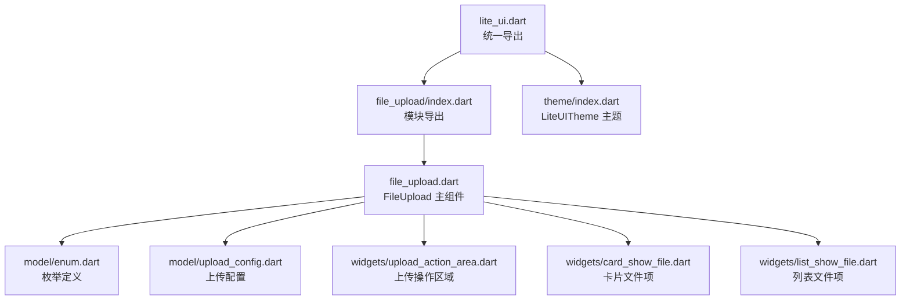
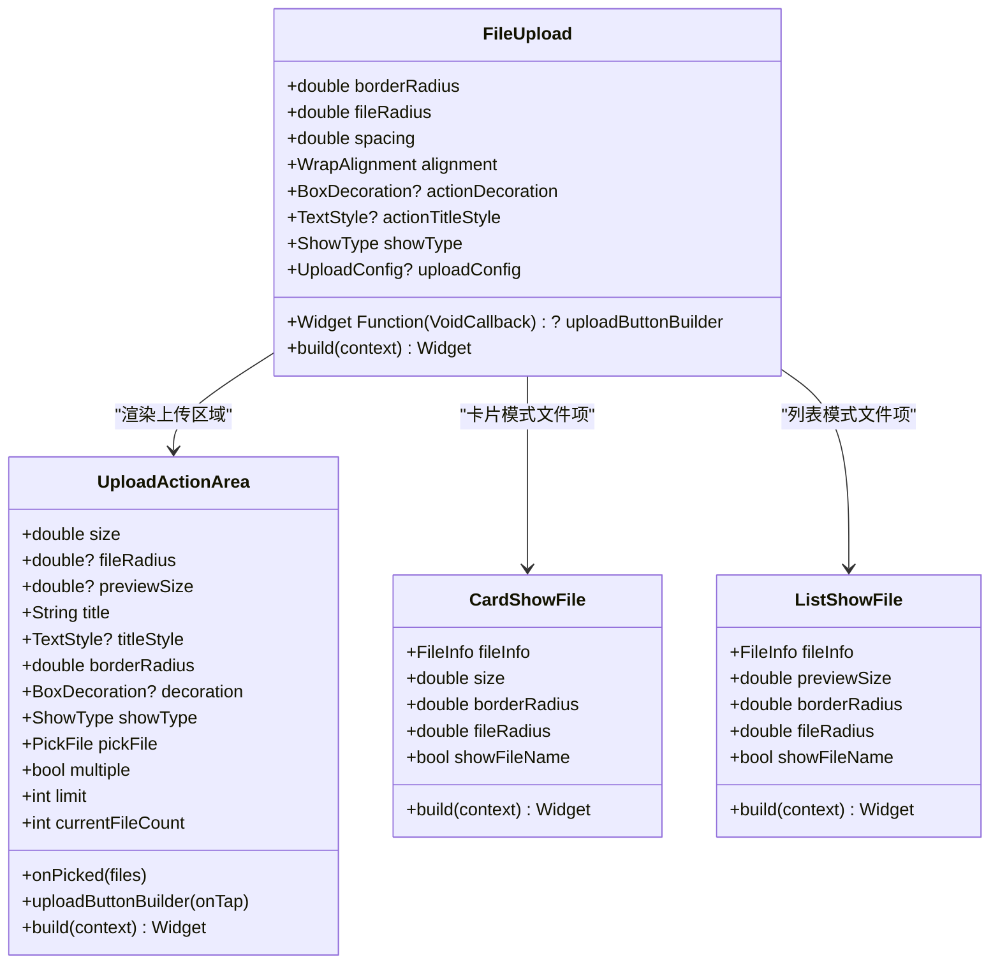
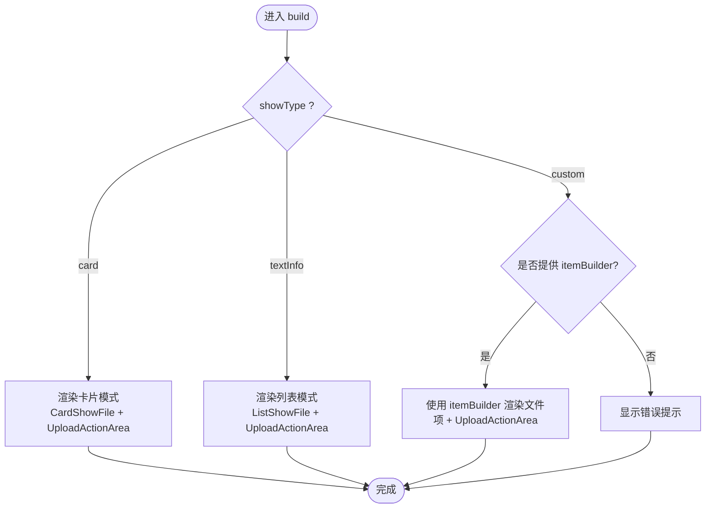
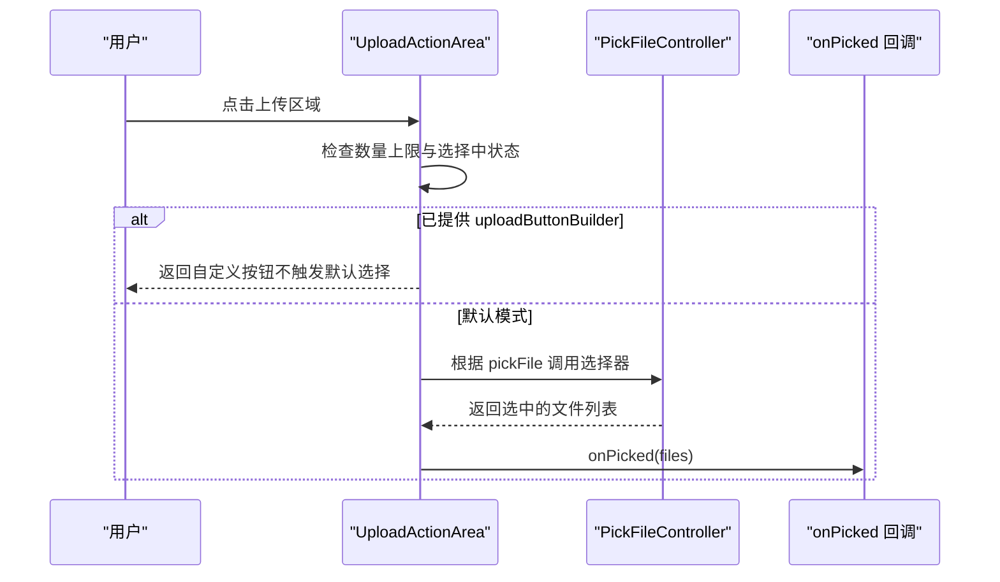
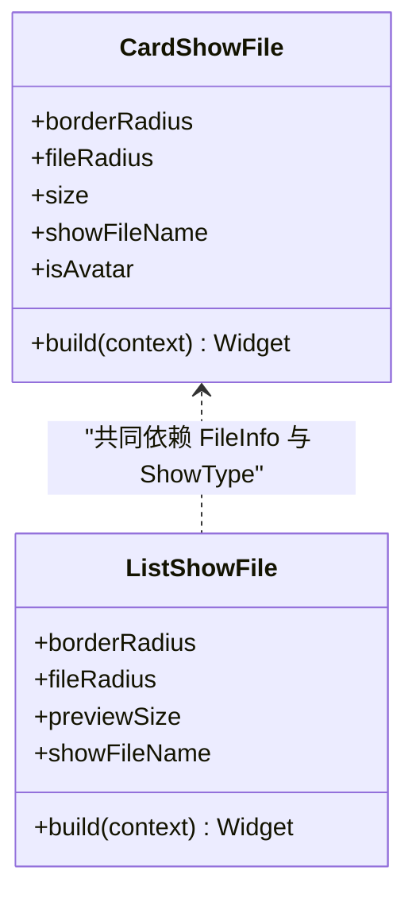
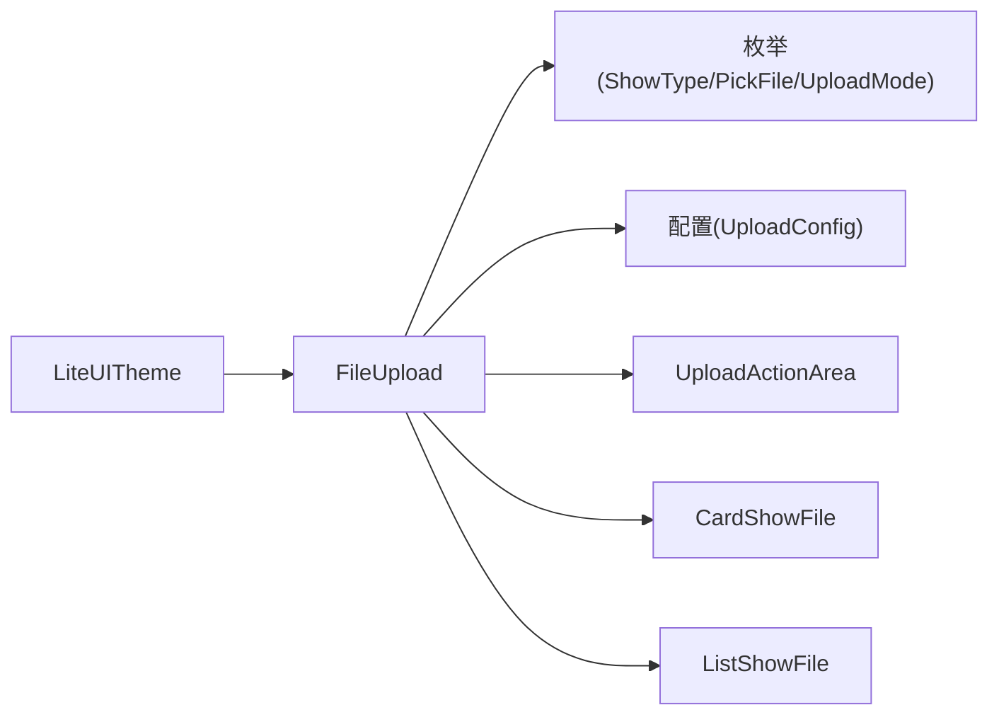

# 样式定制

<cite>
**本文引用的文件**   
- [lite_ui.dart](file://lib/lite_ui.dart)
- [file_upload.dart](file://lib/src/file_upload/file_upload.dart)
- [enum.dart](file://lib/src/file_upload/model/enum.dart)
- [upload_config.dart](file://lib/src/file_upload/model/upload_config.dart)
- [upload_action_area.dart](file://lib/src/file_upload/widgets/upload_action_area.dart)
- [card_show_file.dart](file://lib/src/file_upload/widgets/card_show_file.dart)
- [list_show_file.dart](file://lib/src/file_upload/widgets/list_show_file.dart)
- [index.dart](file://lib/src/file_upload/index.dart)
- [theme/index.dart](file://lib/src/theme/index.dart)
- [readme.md](file://lib/src/file_upload/readme.md)
</cite>

## 目录
1. [简介](#简介)
2. [项目结构](#项目结构)
3. [核心组件](#核心组件)
4. [架构总览](#架构总览)
5. [详细组件分析](#详细组件分析)
6. [依赖关系分析](#依赖关系分析)
7. [性能考量](#性能考量)
8. [故障排查指南](#故障排查指南)
9. [结论](#结论)
10. [附录](#附录)

## 简介
本章节聚焦 Lite UI 文件上传组件的样式定制能力，围绕以下主题展开：
- 通过属性配置自定义外观：borderRadius（外层容器圆角）、fileRadius（文件卡片内容圆角）、spacing（间距）、alignment（对齐方式）等布局属性。
- actionDecoration 装饰器：支持背景色、边框、阴影等 BoxDecoration 完全覆盖默认样式。
- actionTitleStyle 标题文字样式：字体、颜色、大小等 TextStyle 属性。
- 不同 showType（card/textInfo/custom）下的样式差异与定制方法。
- 品牌化定制实践：主题色适配、暗黑模式支持、响应式布局。
- 性能优化建议与最佳实践。

## 项目结构
文件上传组件位于 lib/src/file_upload 目录下，包含模型、控制器、服务、工具与 UI 子组件；对外统一由 lite_ui.dart 导出。

图表来源
- [lite_ui.dart:1-19](file://lib/lite_ui.dart#L1-L19)
- [index.dart:1-6](file://lib/src/file_upload/index.dart#L1-L6)
- [file_upload.dart:1-16](file://lib/src/file_upload/file_upload.dart#L1-L16)
- [enum.dart:1-26](file://lib/src/file_upload/model/enum.dart#L1-L26)
- [upload_config.dart:1-30](file://lib/src/file_upload/model/upload_config.dart#L1-L30)
- [upload_action_area.dart:1-20](file://lib/src/file_upload/widgets/upload_action_area.dart#L1-L20)
- [card_show_file.dart:1-20](file://lib/src/file_upload/widgets/card_show_file.dart#L1-L20)
- [list_show_file.dart:1-20](file://lib/src/file_upload/widgets/list_show_file.dart#L1-L20)
- [theme/index.dart:1-20](file://lib/src/theme/index.dart#L1-L20)

章节来源
- [lite_ui.dart:1-19](file://lib/lite_ui.dart#L1-L19)
- [index.dart:1-6](file://lib/src/file_upload/index.dart#L1-L6)

## 核心组件
- FileUpload：对外暴露的上传组件，提供展示类型、布局、上传配置、样式定制等参数。
- UploadActionArea：上传按钮区域，负责点击选择文件、默认/自定义按钮构建、装饰与标题样式。
- CardShowFile / ListShowFile：分别实现卡片模式与列表模式的文件项展示与状态叠加。
- 枚举与配置：ShowType、PickFile、UploadMode、UploadConfig 等决定行为与样式分支。

关键样式相关属性（来自 FileUpload）：
- borderRadius：外层容器圆角半径（默认 7）。
- fileRadius：文件卡片内容圆角半径（默认 7），控制图片/图标区域的圆角。
- spacing：卡片间距（仅在 columns 模式下生效，默认 10）。
- alignment：每行对齐方式（仅固定尺寸模式生效，默认左对齐）。
- actionDecoration：上传按钮区域的 BoxDecoration，为空时使用默认主题色浅背景+边框+圆角，传入后完全覆盖默认样式。
- actionTitleStyle：上传按钮提示文字 TextStyle，为空时采用默认样式。
- uploadButtonBuilder：自定义上传按钮构建器，可完全替代默认 UI。

章节来源
- [file_upload.dart:74-111](file://lib/src/file_upload/file_upload.dart#L74-L111)
- [file_upload.dart:131-161](file://lib/src/file_upload/file_upload.dart#L131-L161)
- [upload_action_area.dart:35-48](file://lib/src/file_upload/widgets/upload_action_area.dart#L35-L48)
- [upload_action_area.dart:78-98](file://lib/src/file_upload/widgets/upload_action_area.dart#L78-L98)

## 架构总览
FileUpload 根据 showType 渲染不同的文件项与上传区域，并通过 UploadActionArea 处理用户交互与选择逻辑。CardShowFile 与 ListShowFile 分别承载卡片与列表的文件展示与状态层。

图表来源
- [file_upload.dart:15-165](file://lib/src/file_upload/file_upload.dart#L15-L165)
- [upload_action_area.dart:16-102](file://lib/src/file_upload/widgets/upload_action_area.dart#L16-L102)
- [card_show_file.dart:17-89](file://lib/src/file_upload/widgets/card_show_file.dart#L17-L89)
- [list_show_file.dart:16-59](file://lib/src/file_upload/widgets/list_show_file.dart#L16-L59)

## 详细组件分析

### FileUpload 样式与布局
- 布局属性
  - borderRadius：作用于外层容器与上传区域圆角。
  - fileRadius：作用于文件预览内容（图片/图标）的圆角。
  - spacing：在 columns 模式下控制卡片水平与垂直间距。
  - alignment：在固定尺寸模式下控制 Wrap 的对齐方式。
- 展示模式
  - ShowType.card：正方形网格布局，使用 CardShowFile 渲染文件项。
  - ShowType.textInfo：横向行展示，使用 ListShowFile 渲染文件项。
  - ShowType.custom：需传入 itemBuilder 自定义每个文件项 UI。
- 上传区域样式
  - actionDecoration：BoxDecoration，为空时使用默认主题色浅背景+边框+圆角；传入后完全覆盖默认样式。
  - actionTitleStyle：TextStyle，为空时使用默认样式；传入后覆盖卡片与列表模式的标题文字样式。
  - uploadButtonBuilder：完全替换默认上传按钮 UI，所有模式均可使用。

图表来源
- [file_upload.dart:453-592](file://lib/src/file_upload/file_upload.dart#L453-L592)

章节来源
- [file_upload.dart:453-592](file://lib/src/file_upload/file_upload.dart#L453-L592)
- [enum.dart:16-26](file://lib/src/file_upload/model/enum.dart#L16-L26)

### UploadActionArea 装饰与标题样式
- 装饰器
  - decoration：BoxDecoration，为空时使用默认主题色浅背景+边框+圆角；传入后完全覆盖默认样式（包括背景、边框、渐变、阴影等）。
- 标题样式
  - titleStyle：TextStyle，为空时使用默认样式；传入后覆盖卡片与列表模式的标题文字样式。
- 按钮构建
  - uploadButtonBuilder：若提供且 onTap 存在，则直接返回自定义按钮，不再渲染默认 UI。

图表来源
- [upload_action_area.dart:109-167](file://lib/src/file_upload/widgets/upload_action_area.dart#L109-L167)
- [upload_action_area.dart:172-262](file://lib/src/file_upload/widgets/upload_action_area.dart#L172-L262)

章节来源
- [upload_action_area.dart:35-48](file://lib/src/file_upload/widgets/upload_action_area.dart#L35-L48)
- [upload_action_area.dart:78-98](file://lib/src/file_upload/widgets/upload_action_area.dart#L78-L98)
- [upload_action_area.dart:172-262](file://lib/src/file_upload/widgets/upload_action_area.dart#L172-L262)

### CardShowFile 与 ListShowFile 的样式差异
- CardShowFile（卡片模式）
  - 使用 ClipRRect 裁剪外层容器，应用 borderRadius。
  - 内部图片/文件区域使用 fileRadius 控制圆角。
  - 上传中显示底部进度条与渐变进度层，头像模式下状态居中显示。
- ListShowFile（列表模式）
  - 整行作为进度载体，背景填充 + 底部进度条始终可见。
  - 网络文件未知大小时自动通过 HTTP HEAD 获取文件大小并显示。
  - 状态点与状态文本、进度百分比与已上传/总大小信息清晰呈现。

图表来源
- [card_show_file.dart:17-89](file://lib/src/file_upload/widgets/card_show_file.dart#L17-L89)
- [list_show_file.dart:16-59](file://lib/src/file_upload/widgets/list_show_file.dart#L16-L59)

章节来源
- [card_show_file.dart:95-191](file://lib/src/file_upload/widgets/card_show_file.dart#L95-L191)
- [list_show_file.dart:159-288](file://lib/src/file_upload/widgets/list_show_file.dart#L159-L288)

### 不同 showType 的样式差异与定制方法
- card（卡片模式）
  - 正方形网格布局，适合图片上传场景。
  - 可通过 columns 或 previewSize 控制布局；spacing 控制卡片间距；alignment 控制对齐。
  - 上传区域默认带主题色浅背景与边框，可使用 actionDecoration 与 actionTitleStyle 定制。
- textInfo（列表模式）
  - 横向行展示文件信息，适合文档上传场景。
  - 文件项为整行容器，进度与状态信息更丰富。
  - 上传区域同样支持 actionDecoration 与 actionTitleStyle。
- custom（自定义模式）
  - 必须提供 itemBuilder 以自定义每个文件项 UI。
  - 上传区域仍受 actionDecoration 与 actionTitleStyle 影响。

章节来源
- [file_upload.dart:453-592](file://lib/src/file_upload/file_upload.dart#L453-L592)
- [readme.md:116-170](file://lib/src/file_upload/readme.md#L116-L170)

## 依赖关系分析
- FileUpload 依赖枚举与配置：
  - ShowType、PickFile、UploadMode、UploadConfig 等决定展示与上传行为。
- FileUpload 依赖 UI 子组件：
  - UploadActionArea、CardShowFile、ListShowFile 负责具体渲染。
- 主题系统：
  - LiteUITheme 提供库级默认颜色与圆角，可在 App 层通过 LiteUITheme 包裹自定义。

图表来源
- [enum.dart:1-26](file://lib/src/file_upload/model/enum.dart#L1-L26)
- [upload_config.dart:1-30](file://lib/src/file_upload/model/upload_config.dart#L1-L30)
- [file_upload.dart:1-16](file://lib/src/file_upload/file_upload.dart#L1-L16)
- [theme/index.dart:1-20](file://lib/src/theme/index.dart#L1-L20)

章节来源
- [enum.dart:1-26](file://lib/src/file_upload/model/enum.dart#L1-L26)
- [upload_config.dart:1-30](file://lib/src/file_upload/model/upload_config.dart#L1-L30)
- [file_upload.dart:1-16](file://lib/src/file_upload/file_upload.dart#L1-L16)
- [theme/index.dart:1-20](file://lib/src/theme/index.dart#L1-L20)

## 性能考量
- 避免不必要的 rebuild
  - 外部 fileList 引用变化时，组件内部通过签名比较（url + name + size）判断是否真正变化，减少无效重建。
- 网络文件大小获取
  - 列表模式下对网络文件未知大小时通过 HTTP HEAD 请求获取，避免重复请求并在完成后缓存结果。
- 上传并发控制
  - UploadConfig.maxConcurrent 限制并发上传数，避免过多并发导致卡顿。
- 进度更新频率
  - 上传进度回调按文件 id 与路径上报，建议在父组件中节流更新 UI。

章节来源
- [file_upload.dart:190-234](file://lib/src/file_upload/file_upload.dart#L190-L234)
- [list_show_file.dart:72-103](file://lib/src/file_upload/widgets/list_show_file.dart#L72-L103)
- [upload_config.dart:31-99](file://lib/src/file_upload/model/upload_config.dart#L31-L99)

## 故障排查指南
- 达到上传数量上限
  - 当 limit > 0 且当前文件数已达上限时，点击上传区域会提示“已达到上传数量上限”。
- 自定义模式未提供 itemBuilder
  - showType 为 custom 但未提供 itemBuilder 时，将显示错误提示。
- 上传失败重试
  - 上传失败时可通过卡片操作 Sheet 或列表右侧按钮进行重试。

章节来源
- [upload_action_area.dart:109-137](file://lib/src/file_upload/widgets/upload_action_area.dart#L109-L137)
- [file_upload.dart:550-558](file://lib/src/file_upload/file_upload.dart#L550-L558)

## 结论
Lite UI 文件上传组件提供了丰富的样式定制能力，涵盖圆角、间距、对齐、装饰器与标题样式等。通过 showType 切换不同展示模式，并结合 UploadActionArea 的装饰与标题样式，可实现品牌化定制与主题适配。配合 LiteUITheme 与 Flutter 主题系统，可轻松支持暗黑模式与响应式布局。遵循性能优化建议与最佳实践，可获得稳定流畅的用户体验。

## 附录
- 品牌化定制示例要点
  - 主题色适配：通过 Theme.of(context).colorScheme.primary 获取主题色，结合 actionDecoration 与 actionTitleStyle 定制。
  - 暗黑模式支持：在 MaterialApp 中设置 ThemeData 并使用 useMaterial3，组件会自动适配主题色。
  - 响应式布局：columns 与 spacing 组合实现自适应网格；alignment 控制对齐方式。
- 最佳实践
  - 合理使用 limit 与 multiple，避免过度选择。
  - 使用 uploadButtonBuilder 完全自定义上传按钮 UI，保持设计一致性。
  - 在网络环境下谨慎使用 HEAD 请求获取文件大小，注意失败回退策略。

章节来源
- [theme/index.dart:1-73](file://lib/src/theme/index.dart#L1-L73)
- [readme.md:116-211](file://lib/src/file_upload/readme.md#L116-L211)