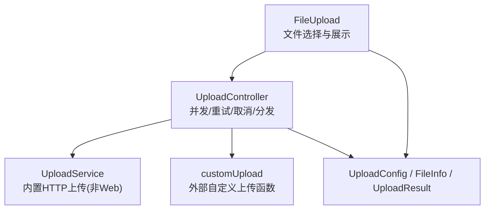
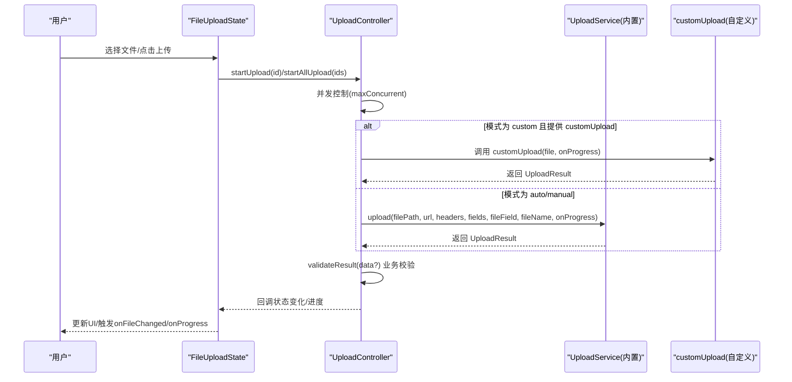
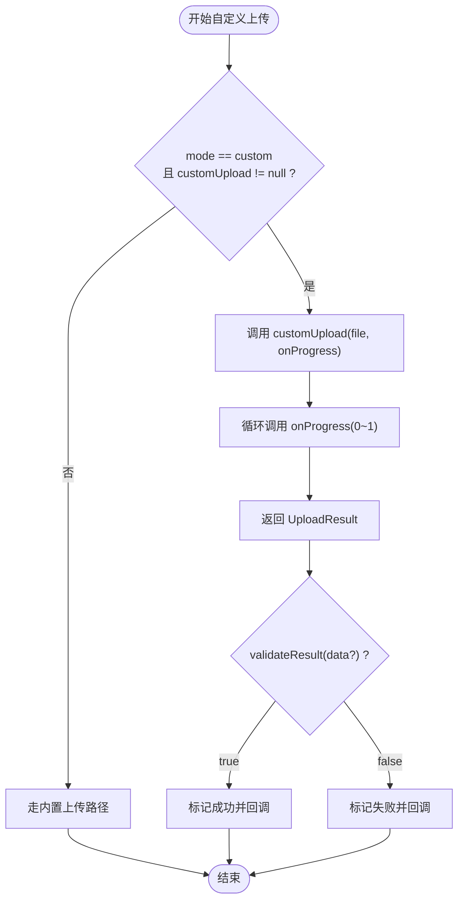
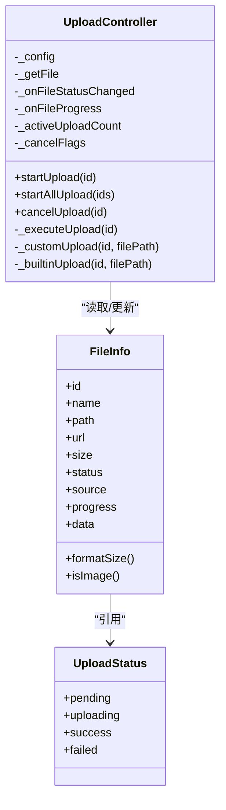
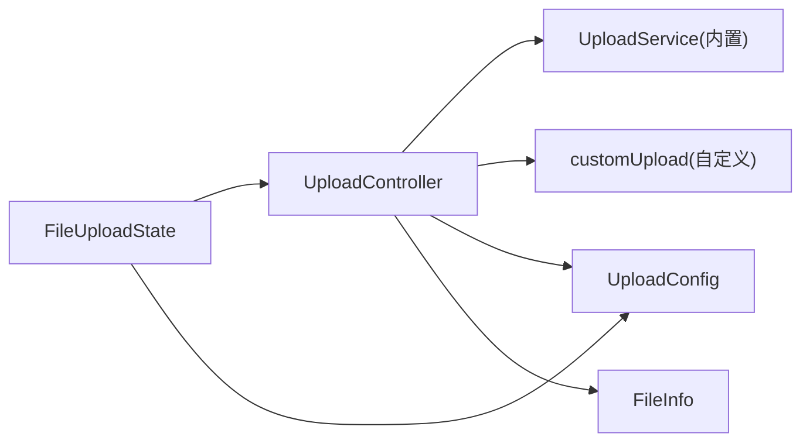

# 自定义上传函数

<cite>
**本文引用的文件**
- [file_upload.dart](file://lib/src/file_upload/file_upload.dart)
- [upload_config.dart](file://lib/src/file_upload/model/upload_config.dart)
- [upload_controller.dart](file://lib/src/file_upload/service/upload_controller.dart)
- [upload_service.dart](file://lib/src/file_upload/service/upload_service.dart)
- [enum.dart](file://lib/src/file_upload/model/enum.dart)
- [file_info.dart](file://lib/src/file_upload/model/file_info.dart)
- [readme.md](file://lib/src/file_upload/readme.md)
</cite>

## 目录
1. [简介](#简介)
2. [项目结构](#项目结构)
3. [核心组件](#核心组件)
4. [架构总览](#架构总览)
5. [详细组件分析](#详细组件分析)
6. [依赖关系分析](#依赖关系分析)
7. [性能与并发控制](#性能与并发控制)
8. [故障排查指南](#故障排查指南)
9. [结论](#结论)
10. [附录：企业级实践示例清单](#附录企业级实践示例清单)

## 简介
本文件围绕 Lite UI 文件上传组件的“自定义上传函数”能力，系统性说明 UploadMode.custom 模式的实现方式、配置项、HTTP 客户端集成、进度回调、并发控制、重试机制、错误处理与日志记录等。文档面向开发者，既提供高层架构概览，也深入到代码级流程与数据流，帮助快速构建企业级文件上传方案（如分片上传、断点续传、加密上传、统一鉴权与重试策略）。

## 项目结构
Lite UI 的文件上传模块采用“UI 组件 + 控制器 + 服务 + 模型/枚举”的分层组织：
- UI 组件：FileUpload 负责选择、展示、状态管理与对外 API
- 控制器：UploadController 管理生命周期、并发、重试、取消与分发到内置或自定义上传
- 服务：UploadService 提供内置 HTTP 上传（仅非 Web 平台）
- 模型/枚举：FileInfo、UploadConfig、UploadResult、UploadStatus、ShowType、PickFile 等

图表来源
- [file_upload.dart:1-165](file://lib/src/file_upload/file_upload.dart#L1-L165)
- [upload_controller.dart:1-74](file://lib/src/file_upload/service/upload_controller.dart#L1-L74)
- [upload_service.dart:1-35](file://lib/src/file_upload/service/upload_service.dart#L1-L35)
- [upload_config.dart:1-99](file://lib/src/file_upload/model/upload_config.dart#L1-L99)

章节来源
- [file_upload.dart:1-165](file://lib/src/file_upload/file_upload.dart#L1-L165)
- [upload_controller.dart:1-74](file://lib/src/file_upload/service/upload_controller.dart#L1-L74)
- [upload_service.dart:1-35](file://lib/src/file_upload/service/upload_service.dart#L1-L35)
- [upload_config.dart:1-99](file://lib/src/file_upload/model/upload_config.dart#L1-L99)

## 核心组件
- FileUpload：提供文件选择、三种展示模式（card/textInfo/custom）、自动/手动/自定义上传触发、进度与状态回调、编辑回显等。
- UploadController：封装上传生命周期，支持 maxConcurrent 并发上限、retryCount 失败重试、cancelUpload 取消、进度上报与结果校验。
- UploadService：基于 dart:io HttpClient 的 multipart/form-data 上传，包含 MIME 类型推断、分块发送与节流进度回调。
- UploadConfig：上传配置，包括 mode/url/method/headers/fields/fileField/maxConcurrent/retryCount/customUpload/validateResult。
- UploadResult：统一上传结果，success/data/error，内置上传使用 successFromRaw 解析响应体。
- FileInfo：文件信息模型，含 id/name/path/url/size/status/source/progress/data/formatSize/isImage 等。
- 枚举：UploadStatus、ShowType、PickFile、FileAction、ActionFileSheet 等。

章节来源
- [file_upload.dart:15-165](file://lib/src/file_upload/file_upload.dart#L15-L165)
- [upload_controller.dart:10-34](file://lib/src/file_upload/service/upload_controller.dart#L10-L34)
- [upload_service.dart:8-35](file://lib/src/file_upload/service/upload_service.dart#L8-L35)
- [upload_config.dart:31-99](file://lib/src/file_upload/model/upload_config.dart#L31-L99)
- [upload_config.dart:101-138](file://lib/src/file_upload/model/upload_config.dart#L101-L138)
- [file_info.dart:1-74](file://lib/src/file_upload/model/file_info.dart#L1-L74)
- [enum.dart:1-27](file://lib/src/file_upload/model/enum.dart#L1-L27)

## 架构总览
下图展示了从 UI 触发到上传执行的完整调用链，以及自定义上传与内置上传的分发逻辑。

图表来源
- [file_upload.dart:283-326](file://lib/src/file_upload/file_upload.dart#L283-L326)
- [upload_controller.dart:36-122](file://lib/src/file_upload/service/upload_controller.dart#L36-L122)
- [upload_service.dart:23-135](file://lib/src/file_upload/service/upload_service.dart#L23-L135)
- [upload_config.dart:63-99](file://lib/src/file_upload/model/upload_config.dart#L63-L99)

## 详细组件分析

### UploadMode.custom 自定义上传函数
- 定义位置与签名：在 UploadConfig 中通过 customUpload 字段声明，类型为 Future<UploadResult> Function(FileInfo file, void Function(double progress) onProgress)。
- 触发时机：当 UploadConfig.mode == UploadMode.custom 且提供了 customUpload，UploadController 将直接调用该函数进行上传。
- 进度回调：框架会注入 onProgress(progress: 0.0~1.0)，自定义上传需按实际进度调用以驱动 UI 更新。
- 结果返回：必须返回 UploadResult.success(...) 或 UploadResult.failure(...)，其中 data 可携带服务端响应（已解析的 Map），error 用于失败原因。
- 业务校验：若配置了 validateResult，框架会在成功时再次校验业务状态；未提供则默认 HTTP 2xx 即视为成功。

图表来源
- [upload_controller.dart:96-122](file://lib/src/file_upload/service/upload_controller.dart#L96-L122)
- [upload_config.dart:63-99](file://lib/src/file_upload/model/upload_config.dart#L63-L99)

章节来源
- [upload_config.dart:63-99](file://lib/src/file_upload/model/upload_config.dart#L63-L99)
- [upload_controller.dart:124-135](file://lib/src/file_upload/service/upload_controller.dart#L124-L135)
- [readme.md:93-114](file://lib/src/file_upload/readme.md#L93-L114)

### UploadConfig 配置选项详解
- mode：UploadMode.auto/manual/custom，决定上传触发方式与是否启用自定义函数。
- url：auto/manual 模式下必填，指定上传接口地址。
- method：HTTP 方法，默认 POST。
- headers：自定义请求头（内置上传生效）。
- fields：额外表单字段（multipart/form-data）。
- fileField：文件对应的表单字段名，默认 "file"。
- maxConcurrent：最大并发上传数，默认 3。
- retryCount：失败自动重试次数，默认 0。
- customUpload：自定义上传函数（custom 模式必填）。
- validateResult：业务成功校验函数，接收已解析的 JSON Map，返回 true/false。

章节来源
- [upload_config.dart:31-99](file://lib/src/file_upload/model/upload_config.dart#L31-L99)
- [readme.md:225-238](file://lib/src/file_upload/readme.md#L225-L238)

### 上传状态管理与进度监听
- 状态枚举：UploadStatus.pending/uploading/success/failed。
- 状态流转：控制器在执行 _executeUpload 时依次设置 uploading -> success/failed，并在 finally 中释放并发计数与取消标志。
- 进度监听：_onUploadFileProgress 会更新内部文件列表的 progress，并触发 onProgress 与 onFileChanged(FileAction.progress)。
- 取消上传：cancelUpload 会将对应文件的取消标志置位，并立即恢复 pending 状态；自定义上传需在 onProgress 前检查取消标志。

图表来源
- [enum.dart:1-14](file://lib/src/file_upload/model/enum.dart#L1-L14)
- [file_info.dart:10-74](file://lib/src/file_upload/model/file_info.dart#L10-L74)
- [upload_controller.dart:22-34](file://lib/src/file_upload/service/upload_controller.dart#L22-L34)

章节来源
- [file_upload.dart:341-375](file://lib/src/file_upload/file_upload.dart#L341-L375)
- [upload_controller.dart:67-122](file://lib/src/file_upload/service/upload_controller.dart#L67-L122)
- [enum.dart:1-14](file://lib/src/file_upload/model/enum.dart#L1-L14)

### 内置 HTTP 上传（非 Web 平台）
- 使用 dart:io HttpClient 构造 multipart/form-data 请求。
- 支持 headers/fields/fileField 配置，自动根据扩展名推断 MIME 类型。
- 分块发送与节流：按 chunkSize=32KB 分块写入，每 10% 或最后一块才回调 onProgress，避免频繁刷新 UI。
- 异常处理：捕获 SocketException/HttpException/未知异常，统一返回 UploadResult.failure。
- 注意：Web 平台不可用，应使用 UploadMode.custom 并通过浏览器网络库实现。

章节来源
- [upload_service.dart:8-35](file://lib/src/file_upload/service/upload_service.dart#L8-L35)
- [upload_service.dart:23-135](file://lib/src/file_upload/service/upload_service.dart#L23-L135)
- [upload_service.dart:137-181](file://lib/src/file_upload/service/upload_service.dart#L137-L181)

### 自定义模式 UI 与交互
- showType=ShowType.custom 时必须提供 itemBuilder，否则显示错误提示。
- 自定义模式下，文件项由 itemBuilder 完全渲染，删除操作通过 onRemove 回调触发。
- 上传按钮区域仍可使用 uploadButtonBuilder 自定义样式与行为。

章节来源
- [file_upload.dart:550-587](file://lib/src/file_upload/file_upload.dart#L550-L587)

## 依赖关系分析
- FileUploadState 依赖 UploadController 进行上传调度，依赖 UploadConfig 获取上传参数。
- UploadController 依赖 UploadService（内置）或 customUpload（自定义）执行上传。
- 所有文件标识通过 FileInfo.id 匹配，确保跨组件一致。
- 状态与进度通过回调向上冒泡至 FileUploadState，再转发给父组件。

图表来源
- [file_upload.dart:296-304](file://lib/src/file_upload/file_upload.dart#L296-L304)
- [upload_controller.dart:22-34](file://lib/src/file_upload/service/upload_controller.dart#L22-L34)
- [upload_config.dart:31-99](file://lib/src/file_upload/model/upload_config.dart#L31-L99)

章节来源
- [file_upload.dart:296-304](file://lib/src/file_upload/file_upload.dart#L296-L304)
- [upload_controller.dart:22-34](file://lib/src/file_upload/service/upload_controller.dart#L22-L34)

## 性能与并发控制
- 并发控制：UploadController 通过 activeUploadCount 与 maxConcurrent 限制同时进行的上传任务，超出上限时会等待。
- 重试机制：_executeUpload 支持 retryCount 次重试，每次重试前短暂延迟，提升稳定性。
- 进度节流：内置上传按 10% 粒度回调，避免 UI 过度刷新；自定义上传建议自行节流。
- 取消优化：cancelUpload 设置取消标志并立即恢复 pending，避免无效继续上传。

章节来源
- [upload_controller.dart:36-57](file://lib/src/file_upload/service/upload_controller.dart#L36-L57)
- [upload_controller.dart:67-122](file://lib/src/file_upload/service/upload_controller.dart#L67-L122)
- [upload_service.dart:82-104](file://lib/src/file_upload/service/upload_service.dart#L82-L104)

## 故障排查指南
- 未配置 url（auto/manual）：内置上传将返回失败，错误信息提示未配置上传地址。
- Web 平台使用内置上传：dart:io 不可用，请改用 UploadMode.custom 并通过浏览器网络库实现。
- 自定义上传未调用 onProgress：UI 不会更新进度，建议在上传过程中周期性调用。
- 业务校验失败：validateResult 返回 false 会被标记为 failed，检查服务端响应结构与校验逻辑。
- 取消后仍继续上传：自定义上传需在 onProgress 前检查取消标志并及时中断。

章节来源
- [upload_controller.dart:138-161](file://lib/src/file_upload/service/upload_controller.dart#L138-L161)
- [upload_service.dart:122-135](file://lib/src/file_upload/service/upload_service.dart#L122-L135)
- [upload_controller.dart:124-135](file://lib/src/file_upload/service/upload_controller.dart#L124-L135)

## 结论
UploadMode.custom 为 Lite UI 文件上传提供了高度可扩展的上传能力。通过 UploadConfig 的丰富配置与 UploadController 的生命周期管理，开发者可以灵活集成任意网络库，实现分片上传、断点续传、加密上传、统一鉴权与重试策略等企业级特性。配合完善的进度回调、状态管理与错误处理，能够构建稳定、高性能且用户体验友好的文件上传功能。

## 附录：企业级实践示例清单
以下为结合仓库能力的企业级实践要点（不直接粘贴代码，给出实现思路与参考位置）：
- 与后端 API 集成
  - 使用 customUpload 调用自有 HTTP 客户端，传入 file.path 与 onProgress。
  - 通过 UploadConfig.headers 注入鉴权令牌（如 Authorization）。
  - 参考：[upload_config.dart:63-99](file://lib/src/file_upload/model/upload_config.dart#L63-L99)、[upload_controller.dart:124-135](file://lib/src/file_upload/service/upload_controller.dart#L124-L135)

- 文件分片上传
  - 在 customUpload 中将文件按固定大小分片，逐片上传并累计进度。
  - 合并分片后返回 UploadResult.success(data: 服务端元数据)。
  - 参考：[upload_service.dart:82-104](file://lib/src/file_upload/service/upload_service.dart#L82-L104)

- 断点续传
  - 记录已上传分片的索引与服务器端分片 ID，失败时从断点继续。
  - 利用 FileInfo.data 存储续传元数据。
  - 参考：[file_info.dart:43-46](file://lib/src/file_upload/model/file_info.dart#L43-L46)

- 错误重试机制
  - 在 customUpload 内实现指数退避重试，或在 UploadConfig.retryCount 基础上叠加业务重试。
  - 区分网络异常与服务端业务错误，分别处理。
  - 参考：[upload_controller.dart:77-100](file://lib/src/file_upload/service/upload_controller.dart#L77-L100)

- 上传状态管理与进度监听
  - 通过 onFileChanged 与 onProgress 同步 UI 状态与进度条。
  - 使用 updateFileStatus 手动修正状态（如初始化回显）。
  - 参考：[file_upload.dart:341-375](file://lib/src/file_upload/file_upload.dart#L341-L375)

- 取消上传
  - 在 customUpload 中监听取消标志（可通过外部状态或回调判断），及时中断 IO。
  - 调用 cancelUpload 后立即恢复 pending。
  - 参考：[upload_controller.dart:59-65](file://lib/src/file_upload/service/upload_controller.dart#L59-L65)

- 网络请求封装与日志记录
  - 封装统一的 HTTP 客户端，集中处理超时、重试、错误码映射与日志输出。
  - 在 customUpload 中打印关键步骤（URL、文件大小、分片进度、错误堆栈）。
  - 参考：[upload_service.dart:33-38](file://lib/src/file_upload/service/upload_service.dart#L33-L38)、[upload_service.dart:106-135](file://lib/src/file_upload/service/upload_service.dart#L106-L135)

- 安全与合规
  - 对敏感文件进行前端加密后再上传，确保传输安全。
  - 校验文件类型与大小，防止恶意上传。
  - 参考：[upload_service.dart:137-181](file://lib/src/file_upload/service/upload_service.dart#L137-L181)